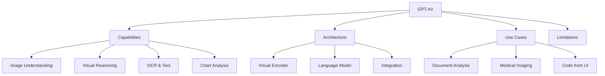

# GPT-4V

GPT-4V (GPT-4 Vision) is OpenAI's multimodal model that extends GPT-4 to process both text and images. It was released in September 2023 and represents a significant advancement in multimodal AI capabilities.

## Overview



## Architecture

### What We Know (Rumors & Analysis)

GPT-4V's architecture is not fully public, but analysis suggests:

```python
# Likely architecture (based on research papers and analysis)
class GPT4V(nn.Module):
    def __init__(self):
        super().__init__()
        # Vision encoder: Likely CLIP-based or custom
        self.vision_encoder = VisionEncoder()  # ~20B parameters?
        
        # Projection: Likely Q-Former or similar
        self.projection = ProjectionLayer()
        
        # Language model: GPT-4 (1.8T parameters, MoE)
        self.language_model = GPT4()
    
    def forward(self, images, text):
        # 1. Encode images into visual tokens
        visual_tokens = self.encode_images(images)
        
        # 2. Interleave with text tokens
        combined = self.prepare_input(visual_tokens, text)
        
        # 3. Generate response
        response = self.language_model.generate(combined)
        return response
```

### Key Technical Details

| Aspect | Detail |
|--------|--------|
| Release | September 2023 |
| Input Types | Text + Images (up to 20) |
| Image Resolution | Up to 512×512 (auto-resized) |
| Context Window | 128K tokens |
| Vision Encoder | Likely ~20B parameters |
| Language Model | ~1.8T parameters (MoE) |
| Training Data | Large-scale image-text pairs |

## Capabilities

### 1. Image Understanding

```python
# Example: Describe an image
response = gpt4v.chat(
    messages=[{
        "role": "user",
        "content": [
            {"type": "image", "image": "photo.jpg"},
            {"type": "text", "text": "What is happening in this image?"}
        ]
    }]
)
# Output: "The image shows a busy street market with vendors..."
```

### 2. OCR and Text Extraction

```python
# Extract text from images
response = gpt4v.chat(
    messages=[{
        "role": "user",
        "content": [
            {"type": "image", "image": "receipt.jpg"},
            {"type": "text", "text": "Extract all text from this receipt."}
        ]
    }]
)
# Output: Extracted text with structure preserved
```

### 3. Chart and Graph Analysis

```python
# Analyze charts and graphs
response = gpt4v.chat(
    messages=[{
        "role": "user",
        "content": [
            {"type": "image", "image": "chart.png"},
            {"type": "text", "text": "What trends do you see in this chart?"}
        ]
    }]
)
# Output: "The chart shows a steady increase in sales from Q1 to Q4..."
```

### 4. Visual Reasoning

```python
# Complex visual reasoning
response = gpt4v.chat(
    messages=[{
        "role": "user",
        "content": [
            {"type": "image", "image": "puzzle.jpg"},
            {"type": "text", "text": "What should replace the question mark?"}
        ]
    }]
)
# Output: "The pattern suggests the answer is 42 because..."
```

### 5. Code Generation from UI

```python
# Generate code from UI mockup
response = gpt4v.chat(
    messages=[{
        "role": "user",
        "content": [
            {"type": "image", "image": "ui_mockup.png"},
            {"type": "text", "text": "Generate HTML/CSS code for this UI."}
        ]
    }]
)
# Output: HTML/CSS code that recreates the UI
```

## Use Cases

### Document Analysis

```python
# Process documents, forms, invoices
def analyze_document(image_path, question):
    response = gpt4v.chat(
        messages=[{
            "role": "user",
            "content": [
                {"type": "image", "image": image_path},
                {"type": "text", "text": f"Analyze this document: {question}"}
            ]
        }]
    )
    return response
```

### Medical Imaging

```python
# Analyze medical images (with appropriate disclaimers)
def analyze_medical_image(image_path):
    response = gpt4v.chat(
        messages=[{
            "role": "user",
            "content": [
                {"type": "image", "image": image_path},
                {"type": "text", "text": "Describe what you see in this X-ray. Note: This is for educational purposes only."}
            ]
        }]
    )
    return response
```

### Real Estate

```python
# Analyze property images
def analyze_property(images):
    response = gpt4v.chat(
        messages=[{
            "role": "user",
            "content": [
                *[{"type": "image", "image": img} for img in images],
                {"type": "text", "text": "Describe the property and estimate its value range."}
            ]
        }]
    )
    return response
```

### Education

```python
# Help with homework
def solve_math_problem(image_path):
    response = gpt4v.chat(
        messages=[{
            "role": "user",
            "content": [
                {"type": "image", "image": image_path},
                {"type": "text", "text": "Solve this math problem step by step."}
            ]
        }]
    )
    return response
```

## Limitations

### 1. Hallucination

```python
# GPT-4V can "see" things that aren't there
# Example: Confidently describing objects not in the image
# Mitigation: Ask for specific evidence, cross-reference
```

### 2. Spatial Reasoning

```python
# Struggles with precise spatial relationships
# Example: "Is the red object to the left or right of the blue object?"
# May give incorrect answers for ambiguous positions
```

### 3. Counting

```python
# Cannot accurately count objects in complex scenes
# Example: "How many people are in this crowd?"
# Often inaccurate for large numbers
```

### 4. Text in Images

```python
# OCR is good but not perfect
# May misread small text, handwritten text, or unusual fonts
# Better with clear, printed text
```

### 5. Safety and Bias

```python
# May refuse to analyze certain images
# Biases from training data
# Cannot verify claims about images
```

## API Usage

### Basic Usage

```python
import openai

client = openai.OpenAI()

response = client.chat.completions.create(
    model="gpt-4-vision-preview",
    messages=[
        {
            "role": "user",
            "content": [
                {
                    "type": "image_url",
                    "image_url": {
                        "url": "https://example.com/image.jpg",
                        "detail": "high"  # or "low" or "auto"
                    }
                },
                {
                    "type": "text",
                    "text": "What is in this image?"
                }
            ]
        }
    ],
    max_tokens=1000
)

print(response.choices[0].message.content)
```

### Multiple Images

```python
response = client.chat.completions.create(
    model="gpt-4-vision-preview",
    messages=[
        {
            "role": "user",
            "content": [
                {"type": "image_url", "image_url": {"url": "image1.jpg"}},
                {"type": "image_url", "image_url": {"url": "image2.jpg"}},
                {"type": "text", "text": "Compare these two images."}
            ]
        }
    ]
)
```

### Detail Levels

```python
# "low": 85 tokens, faster, less detail
# "high": 170+ tokens, slower, more detail
# "auto": Model decides

response = client.chat.completions.create(
    model="gpt-4-vision-preview",
    messages=[{
        "role": "user",
        "content": [{
            "type": "image_url",
            "image_url": {
                "url": "image.jpg",
                "detail": "high"  # Request high detail
            }
        }]
    }]
)
```

## Comparison with Other Models

| Feature | GPT-4V | Gemini | Claude 3 | LLaVA |
|---------|--------|--------|----------|-------|
| Multi-image | Yes (20) | Yes (16) | Yes (20) | Limited |
| Video | No | Yes | No | Limited |
| Resolution | 512×512 | Flexible | 8000px | 336×336 |
| Context | 128K | 1M | 200K | 4K |
| OCR | Excellent | Excellent | Good | Good |
| Chart Analysis | Excellent | Excellent | Good | Moderate |
| Code from UI | Excellent | Good | Good | Moderate |

## Best Practices

### Image Preparation

```python
# 1. Use clear, well-lit images
# 2. Crop to relevant area
# 3. Use appropriate resolution (not too small)
# 4. Consider aspect ratio

# Preprocessing example
def prepare_image(image_path, max_size=512):
    image = Image.open(image_path)
    
    # Resize if too large
    if max(image.size) > max_size:
        image.thumbnail((max_size, max_size))
    
    # Convert to RGB if needed
    if image.mode != 'RGB':
        image = image.convert('RGB')
    
    return image
```

### Prompt Engineering

```python
# Be specific about what you want
bad_prompt = "What's in this image?"
good_prompt = "Describe the objects, their positions, colors, and any text visible in this image."

# Ask for structured output
structured_prompt = """Analyze this image and provide:
1. Main objects: List the primary objects
2. Text: Any visible text
3. Colors: Dominant colors
4. Mood: Overall atmosphere
5. Actions: Any actions or movements"""

# Chain of thought for complex reasoning
cot_prompt = """Look at this image carefully:
1. First, describe what you see
2. Then, identify any patterns or relationships
3. Finally, answer the question: {question}"""
```

## Interview Questions

1. **What is GPT-4V?**
   GPT-4V is OpenAI's multimodal model that extends GPT-4 to process both text and images. It can understand, reason about, and answer questions about visual content.

2. **How does GPT-4V process images?**
   Images are encoded by a vision encoder into visual tokens, which are interleaved with text tokens and processed by the GPT-4 language model. The exact architecture is proprietary.

3. **What are GPT-4V's strengths?**
   Strong OCR, chart analysis, visual reasoning, code generation from UI, and multi-image understanding. Excellent at following complex visual instructions.

4. **What are GPT-4V's limitations?**
   Hallucination (seeing things not in images), poor spatial reasoning, inaccurate counting, and safety/bias issues from training data.

5. **How does GPT-4V compare to Gemini?**
   GPT-4V excels at OCR and chart analysis. Gemini has video support and longer context. Both have similar multimodal capabilities but different strengths.

6. **What is the "detail" parameter in the API?**
   Controls image processing resolution: "low" (85 tokens, faster), "high" (170+ tokens, more detail), "auto" (model decides). Higher detail improves accuracy for complex images.

## Common Mistakes

- ❌ Sending very low resolution images (loses important details)
- ❌ Not providing context about the image domain
- ❌ Expecting perfect counting or spatial reasoning
- ❌ Not handling API errors (rate limits, image size limits)
- ❌ Ignoring safety filters and content policies

## Summary

GPT-4V is a powerful multimodal model that excels at image understanding, OCR, chart analysis, and visual reasoning. While not perfect (hallucination, spatial reasoning limitations), it represents a major step toward human-like visual understanding. Best results come from clear images and specific prompts.

## Cross-References

- [Vision-Language Models](vlm.md) - VLM architecture fundamentals
- [Gemini](gemini.md) - Google's multimodal competitor
- [CLIP](../vision/clip.md) - Vision-language pre-training
- [Multimodal Overview](README.md) - Multimodal models overview
