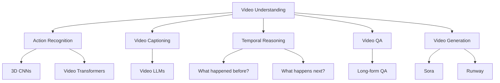
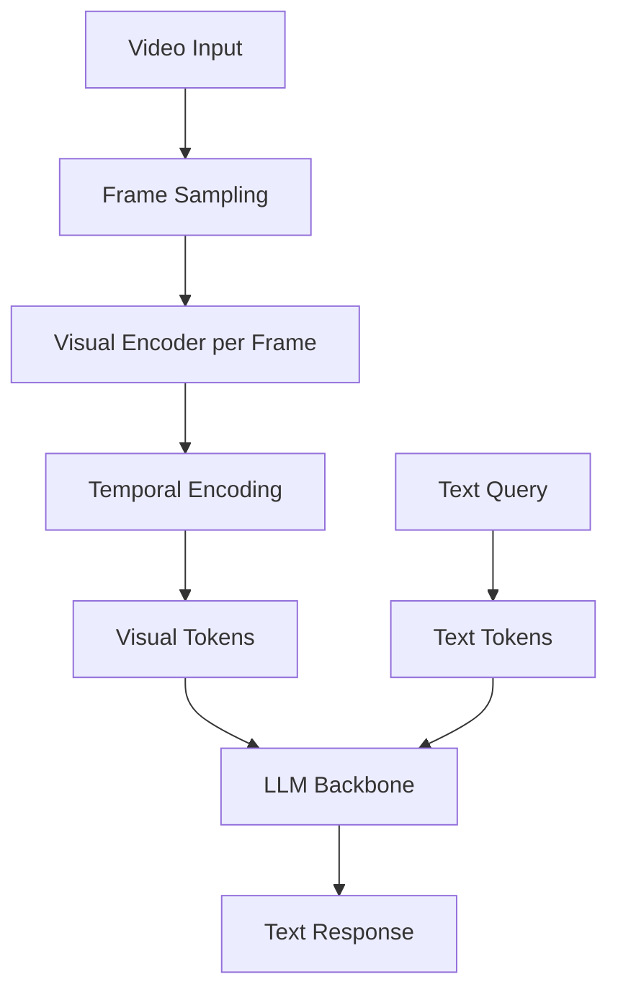
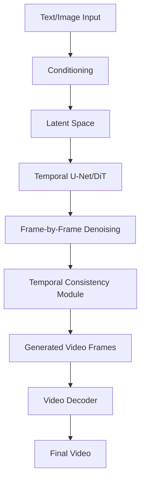

# Video Understanding

Video understanding involves processing temporal sequences of frames along with audio to comprehend actions, events, and narratives over time. It's one of the most challenging multimodal tasks.

## Overview



## Challenges of Video

### Temporal Dimension

```python
# Video = Sequence of frames + time
# A 30fps, 10-second video = 300 frames
# Each frame: 224×224×3 = 150K values
# Total: 300 × 150K = 45M values

# Challenges:
# 1. Temporal modeling (actions span multiple frames)
# 2. Long-range dependencies (narrative understanding)
# 3. Computational cost (much more than images)
# 4. Redundancy (consecutive frames are similar)
```

### Key Differences from Images

| Aspect | Image | Video |
|--------|-------|-------|
| Dimension | 2D (H, W) | 3D (T, H, W) |
| Information | Static scene | Dynamic events |
| Redundancy | Low | High (temporal) |
| Compute | O(1) | O(T) or more |
| Tasks | Classification, detection | Actions, temporal reasoning |

## Video Encoders

### 3D CNNs

```python
# C3D: 3D convolutions for video
class C3D(nn.Module):
    def __init__(self):
        super().__init__()
        # 3D conv: (T, H, W) kernels
        self.conv1 = nn.Conv3d(3, 64, kernel_size=3, padding=1)
        self.conv2 = nn.Conv3d(64, 128, kernel_size=3, padding=1)
        self.conv3 = nn.Conv3d(128, 256, kernel_size=3, padding=1)
        self.pool = nn.MaxPool3d(kernel_size=2, stride=2)
    
    def forward(self, x):
        # x: (B, C, T, H, W)
        x = self.pool(F.relu(self.conv1(x)))
        x = self.pool(F.relu(self.conv2(x)))
        x = self.pool(F.relu(self.conv3(x)))
        return x
```

### SlowFast Networks

```python
# Two pathways: Slow (spatial) + Fast (temporal)
class SlowFast(nn.Module):
    def __init__(self):
        super().__init__()
        # Slow pathway: few frames, high spatial resolution
        self.slow_pathway = ResNet3D(frames=8, stride=8)
        
        # Fast pathway: many frames, low spatial resolution
        self.fast_pathway = ResNet3D(frames=32, stride=2)
        
        # Lateral connections
        self.lateral_connections = LateralConnect()
    
    def forward(self, x):
        # x: (B, C, T, H, W)
        slow_input = x[:, :, ::8, :, :]  # Every 8th frame
        fast_input = x[:, :, ::2, :, :]  # Every 2nd frame
        
        slow_features = self.slow_pathway(slow_input)
        fast_features = self.fast_pathway(fast_input)
        
        # Fuse with lateral connections
        fused = self.lateral_connections(slow_features, fast_features)
        return fused
```

### Video Transformers

```python
# TimeSformer: Divided attention in space and time
class TimeSformer(nn.Module):
    def __init__(self, img_size=224, patch_size=16, num_frames=8):
        super().__init__()
        self.patch_size = patch_size
        self.num_patches = (img_size // patch_size) ** 2
        
        # Patch embedding for each frame
        self.patch_embed = nn.Conv3d(3, 768, 
                                     kernel_size=(1, patch_size, patch_size),
                                     stride=(1, patch_size, patch_size))
        
        # Spatial-temporal attention
        self.spatial_attn = nn.MultiheadAttention(768, 12)
        self.temporal_attn = nn.MultiheadAttention(768, 12)
    
    def forward(self, x):
        # x: (B, C, T, H, W)
        B, C, T, H, W = x.shape
        
        # Patch embedding
        x = self.patch_embed(x)  # (B, 768, T, num_patches)
        x = x.flatten(2).transpose(1, 2)  # (B, T*num_patches, 768)
        
        # Divided attention: spatial then temporal
        # Spatial: attend within each frame
        for t in range(T):
            frame_patches = x[:, t*self.num_patches:(t+1)*self.num_patches]
            spatial_out, _ = self.spatial_attn(frame_patches, frame_patches, frame_patches)
            x[:, t*self.num_patches:(t+1)*self.num_patches] = spatial_out
        
        # Temporal: attend across frames for same patch
        for p in range(self.num_patches):
            patch_across_time = x[:, p::self.num_patches]
            temporal_out, _ = self.temporal_attn(patch_across_time, patch_across_time, patch_across_time)
            x[:, p::self.num_patches] = temporal_out
        
        return x
```

## Video LLMs

### Architecture



### Frame Sampling Strategies

```python
def sample_frames(video_path, num_frames=8, strategy="uniform"):
    """Sample frames from video"""
    cap = cv2.VideoCapture(video_path)
    total_frames = int(cap.get(cv2.CAP_PROP_FRAME_COUNT))
    
    if strategy == "uniform":
        # Uniform sampling
        indices = np.linspace(0, total_frames-1, num_frames, dtype=int)
    
    elif strategy == "keyframe":
        # Sample at scene changes
        indices = detect_keyframes(video_path)[:num_frames]
    
    elif strategy == "dense":
        # Sample every frame (for short videos)
        indices = list(range(total_frames))
    
    frames = []
    for idx in indices:
        cap.set(cv2.CAP_PROP_POS_FRAMES, idx)
        ret, frame = cap.read()
        if ret:
            frames.append(frame)
    
    cap.release()
    return frames
```

### Video-LLaVA

```python
# Extension of LLaVA for video
class VideoLLaVA(nn.Module):
    def __init__(self):
        super().__init__()
        self.vision_encoder = CLIPViT()
        self.projection = MLPProjector()
        self.llm = LLaMA()
    
    def forward(self, video_frames, text):
        # Sample and encode frames
        visual_features = []
        for frame in video_frames:
            features = self.vision_encoder(frame)
            projected = self.projection(features)
            visual_features.append(projected)
        
        # Concatenate all frame features
        all_visual = torch.cat(visual_features, dim=1)
        
        # Combine with text and generate
        return self.llm.generate(all_visual, text)
```

### Gemini Video Processing

```python
# Gemini processes video natively
import google.generativeai as genai

def analyze_video_with_gemini(video_path, question):
    """Gemini's native video understanding"""
    video_file = genai.upload_file(video_path)
    
    model = genai.GenerativeModel('gemini-1.5-pro')
    response = model.generate_content(
        [video_file, question]
    )
    return response.text

# Can handle:
# - 1+ hour videos
# - Audio + visual
# - Temporal queries ("What happened at 5:32?")
```

## Temporal Reasoning

### Types of Temporal Questions

```python
temporal_questions = {
    "recognition": "What action is being performed?",
    "localization": "When does the action start/end?",
    "ordering": "What happened first?",
    "prediction": "What happens next?",
    "causality": "Why did X happen?",
    "counting": "How many times did X occur?",
    "duration": "How long did X last?"
}
```

### Temporal Grounding

```python
def temporal_grounding(video, query, model):
    """Find temporal segment matching query"""
    # Encode video frames
    frame_features = model.encode_video(video)
    
    # Encode text query
    text_feature = model.encode_text(query)
    
    # Predict start/end timestamps
    start_logits = model.start_head(frame_features, text_feature)
    end_logits = model.end_head(frame_features, text_feature)
    
    start_frame = start_logits.argmax()
    end_frame = end_logits.argmax()
    
    return start_frame, end_frame
```

## Action Recognition

### Kinetics Dataset

```python
# Kinetics-400/600/700
# 400-700 action classes
# ~300K videos, 10 seconds each
# Categories: sports, music, cooking, etc.

# Example classes:
actions = [
    "playing guitar", "cooking", "dancing",
    "playing basketball", "brushing teeth",
    "driving car", "reading book"
]
```

### Evaluation

```python
def evaluate_action_recognition(model, test_loader):
    """Evaluate video classification"""
    correct = 0
    total = 0
    
    for video, label in test_loader:
        prediction = model(video)
        if prediction.argmax() == label:
            correct += 1
        total += 1
    
    accuracy = correct / total
    return accuracy

# State-of-the-art on Kinetics-400: ~90% top-1 accuracy
```

## Video Generation

### Sora (OpenAI)

```python
# Diffusion-based video generation
# Generates up to 1-minute videos
# Maintains temporal consistency
# Understands physics and 3D

# Key innovations:
# 1. Patch-based processing (similar to ViT)
# 2. Temporal attention across frames
# 3. Physics-aware generation
# 4. Long-form consistency
```

### Runway Gen-2/Gen-3

```python
# Text-to-video generation
# Image-to-video generation
# Video-to-video style transfer

# Example usage:
# "A cat walking on a beach at sunset"
# → Generates 4-second video
```

### Video Generation Architecture



## Long-Form Video Understanding

### Challenges

```python
# Long video (1+ hour) challenges:
# 1. Memory: Cannot process all frames
# 2. Context: Need to remember early events
# 3. Redundancy: Most frames are uninformative
# 4. Temporal reasoning: Complex event chains

# Solutions:
# 1. Keyframe selection
# 2. Hierarchical processing
# 3. Memory mechanisms
# 4. Efficient attention
```

### Hierarchical Processing

```python
def hierarchical_video_understanding(video, question):
    """Process long video hierarchically"""
    # Level 1: Sample sparse frames for overview
    overview_frames = sample_frames(video, num_frames=32, strategy="uniform")
    overview_summary = llm.summarize_frames(overview_frames)
    
    # Level 2: Identify relevant segments
    relevant_segments = llm.identify_segments(overview_summary, question)
    
    # Level 3: Dense sampling in relevant segments
    for segment in relevant_segments:
        dense_frames = sample_frames(video, segment.start, segment.end, 
                                     num_frames=64)
        segment_analysis = llm.analyze_frames(dense_frames, question)
    
    # Level 4: Combine analyses
    final_answer = llm.combine_analyses(segment_analysis, question)
    return final_answer
```

## Evaluation Benchmarks

| Benchmark | Task | Metric |
|-----------|------|--------|
| Kinetics | Action recognition | Top-1/5 accuracy |
| ActivityNet | Action detection | mAP |
| Charades | Action localization | mAP |
| MSRVTT | Video captioning | CIDEr |
| VideoQA | Video question answering | Accuracy |
| EgoSchema | Long-form understanding | Accuracy |

## Interview Questions

1. **How is video understanding different from image understanding?**
   Video adds a temporal dimension, requiring models to understand actions, events, and narratives over time. Challenges include temporal modeling, long-range dependencies, and computational cost.

2. **What are the main approaches to video encoding?**
   3D CNNs (C3D, I3D), two-stream networks (SlowFast), and video transformers (TimeSformer). Each trades off spatial vs temporal processing differently.

3. **How do Video LLMs work?**
   Sample frames from video, encode each frame with a vision encoder, concatenate visual tokens, and process with an LLM. Some add temporal encoding to capture motion.

4. **What is temporal grounding?**
   Finding the start and end timestamps in a video that correspond to a text query. Used for video retrieval and question answering.

5. **How does Gemini process video differently?**
   Gemini is natively multimodal, processing video frames and audio together in a unified model. It can handle 1+ hour videos with 1M token context.

6. **What are the challenges of video generation?**
   Temporal consistency (objects shouldn't flicker), physics realism, long-form coherence, and computational cost. Models like Sora use diffusion with temporal attention.

7. **How do you handle long videos efficiently?**
   Keyframe selection to reduce redundancy, hierarchical processing (overview then details), memory mechanisms to track events, and efficient attention (sparse, linear).

## Common Mistakes

- ❌ Processing every frame (wasteful, use sampling)
- ❌ Ignoring audio in video understanding
- ❌ Not handling variable video lengths properly
- ❌ Using image models without temporal adaptation
- ❌ Expecting perfect long-form reasoning from current models

## Summary

Video understanding extends image understanding with temporal modeling. Approaches range from 3D CNNs to video transformers. Video LLMs enable natural language interaction with video content. Key challenges include temporal reasoning, long-form understanding, and computational efficiency.

## Cross-References

- [Multimodal Models](README.md) - Multimodal overview
- [GPT-4V](gpt4v.md) - Image understanding (no video)
- [Gemini](gemini.md) - Native video processing
- [Audio Models](audio.md) - Audio in video
- [Transformers](../transformers.md) - Attention mechanisms
