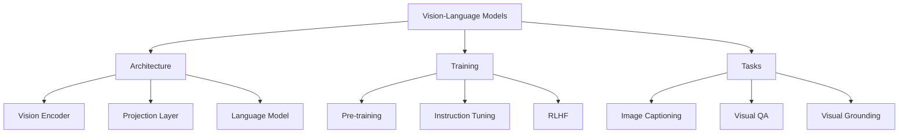
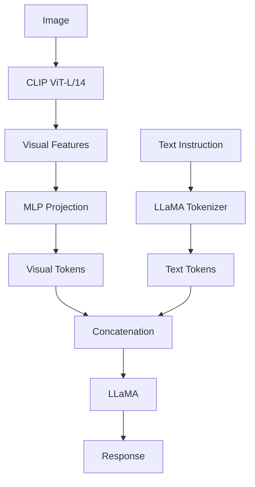
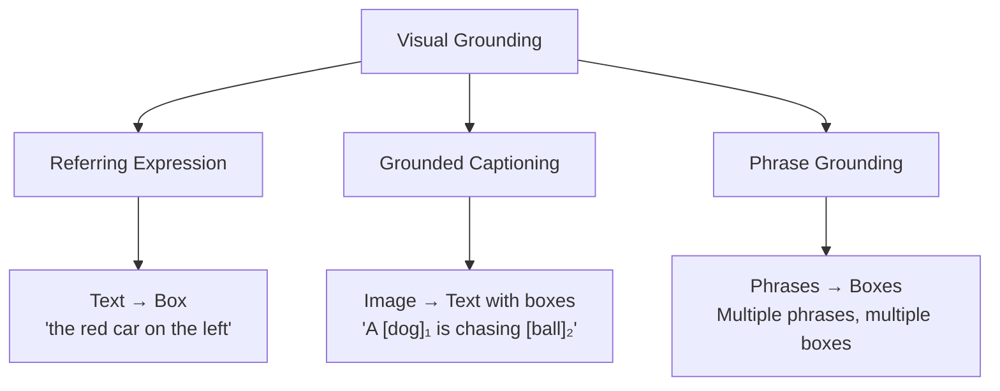

# Vision-Language Models (VLMs)

Vision-Language Models combine visual and textual understanding, enabling tasks like image captioning, visual question answering, and visual grounding. They represent the convergence of computer vision and natural language processing.

## Overview



## Architecture Components

### Vision Encoder

```python
# Common choices:
# 1. CLIP ViT (most popular)
# 2. DINOv2 (self-supervised)
# 3. SigLIP (sigmoid contrastive)
# 4. InternViT (large-scale)

class VisionEncoder(nn.Module):
    def __init__(self, model_type="clip_vit_l14"):
        super().__init__()
        if model_type == "clip_vit_l14":
            self.encoder = CLIPViT(image_size=336, patch_size=14, 
                                   embed_dim=1024, depth=24, heads=16)
        elif model_type == "dinov2":
            self.encoder = DINOv2ViT(embed_dim=1024, depth=24)
    
    def forward(self, images):
        # Output: (B, num_patches, embed_dim)
        return self.encoder(images)
```

### Projection Layer

Maps vision features to language model space:

```python
class MLPProjection(nn.Module):
    """Two-layer MLP projection (LLaVA style)"""
    def __init__(self, vision_dim, llm_dim):
        super().__init__()
        self.proj = nn.Sequential(
            nn.Linear(vision_dim, llm_dim),
            nn.GELU(),
            nn.Linear(llm_dim, llm_dim)
        )
    
    def forward(self, visual_features):
        return self.proj(visual_features)

class CrossAttentionProjection(nn.Module):
    """Cross-attention with learnable queries (Q-Former)"""
    def __init__(self, num_queries=32, vision_dim=1024, llm_dim=4096):
        super().__init__()
        self.queries = nn.Parameter(torch.randn(num_queries, llm_dim))
        self.cross_attn = CrossAttention(llm_dim, vision_dim)
        self.mlp = nn.Linear(llm_dim, llm_dim)
    
    def forward(self, visual_features):
        # Fixed number of output tokens regardless of image size
        queries = self.queries.unsqueeze(0).expand(visual_features.shape[0], -1, -1)
        output = self.cross_attn(queries, visual_features)
        return self.mlp(output)
```

### Language Model Backbone

```python
# Typically a decoder-only transformer
# Common choices:
# - LLaMA / LLaMA 2/3
# - Vicuna
# - Mistral
# - Qwen

class VLModel(nn.Module):
    def __init__(self, vision_encoder, projection, language_model):
        super().__init__()
        self.vision_encoder = vision_encoder
        self.projection = projection
        self.language_model = language_model
    
    def forward(self, images, text_input_ids, text_attention_mask):
        # 1. Encode images
        visual_features = self.vision_encoder(images)
        
        # 2. Project to LLM space
        visual_tokens = self.projection(visual_features)
        
        # 3. Get text embeddings
        text_embeddings = self.language_model.get_input_embeddings()(text_input_ids)
        
        # 4. Concatenate: [visual_tokens, text_embeddings]
        combined = torch.cat([visual_tokens, text_embeddings], dim=1)
        
        # 5. Create attention mask
        visual_mask = torch.ones(visual_tokens.shape[:2], device=visual_tokens.device)
        combined_mask = torch.cat([visual_mask, text_attention_mask], dim=1)
        
        # 6. Forward through LLM
        outputs = self.language_model(inputs_embeds=combined, 
                                      attention_mask=combined_mask)
        return outputs
```

## Key Models

### LLaVA (Large Language and Vision Assistant)



**LLaVA Architecture:**
```python
class LLaVA(nn.Module):
    def __init__(self):
        super().__init__()
        self.vision_encoder = CLIPViTL14(image_size=336)
        self.mm_projector = MLPProjector(1024, 4096)
        self.llm = LLaMA7B()
    
    def prepare_inputs(self, image, text):
        # Encode image
        visual_features = self.vision_encoder(image)
        visual_tokens = self.mm_projector(visual_features)
        
        # Tokenize text
        text_tokens = self.llm.tokenizer(text)
        
        # Replace <image> placeholder with visual tokens
        # Result: [BOS] visual_tokens [text_tokens] [EOS]
        return visual_tokens, text_tokens
```

**Training Stages:**
1. **Stage 1: Feature alignment** - Pre-train projection on image-text pairs
2. **Stage 2: Visual instruction tuning** - Fine-tune on instruction data

### BLIP-2

```python
# Uses Q-Former to bridge vision and language
# More parameter efficient than LLaVA

class BLIP2(nn.Module):
    def __init__(self):
        super().__init__()
        self.vision_encoder = EVA_CLIP_ViT_G()  # Frozen
        self.q_former = QFormer(num_queries=32)
        self.llm = FlanT5XXL()  # or OPT
    
    def forward(self, image, text):
        visual_features = self.vision_encoder(image)  # Frozen
        query_output = self.q_former(visual_features)
        # Feed query_output as prefix to LLM
        return self.llm(query_output, text)
```

### InternVL

```python
# Large-scale vision-language model
# Uses InternViT-6B (6B vision encoder)

class InternVL(nn.Module):
    def __init__(self):
        super().__init__()
        self.vision_encoder = InternViT_6B()  # Very large!
        self.projection = MLPProjector()
        self.llm = InternLM7B()
    
    # Key innovation: Dynamic resolution
    def process_high_res_image(self, image, max_patches=12):
        # Split image into patches
        patches = split_image_into_patches(image, max_patches)
        # Encode each patch
        features = [self.vision_encoder(p) for p in patches]
        # Concatenate all features
        return torch.cat(features, dim=1)
```

## Training Pipeline

### Stage 1: Pre-training (Alignment)

```python
# Train on image-text pairs (e.g., LAION, CC3M)
# Objective: Image captioning / image-text matching

pretrain_dataset = ImageTextDataset(
    images="path/to/images",
    captions="path/to/captions",
    transform=image_transform
)

# Freeze vision encoder and LLM, train only projection
for param in model.vision_encoder.parameters():
    param.requires_grad = False
for param in model.language_model.parameters():
    param.requires_grad = False

# Only projection is trainable
optimizer = AdamW(model.mm_projector.parameters(), lr=1e-3)
```

### Stage 2: Instruction Tuning

```python
# Fine-tune on diverse instruction-following data
# Both projection and LLM are trainable

instruction_data = [
    {
        "image": "image1.jpg",
        "conversations": [
            {"from": "human", "value": "<image>\nWhat is this?"},
            {"from": "gpt", "value": "This is a cat sitting on a couch."}
        ]
    },
    {
        "image": "image2.jpg", 
        "conversations": [
            {"from": "human", "value": "<image>\nDescribe the scene."},
            {"from": "gpt", "value": "A busy city street with..."}
        ]
    }
]

# Unfreeze LLM for fine-tuning
for param in model.language_model.parameters():
    param.requires_grad = True

optimizer = AdamW(model.parameters(), lr=2e-5)
```

### Data Format

```python
# LLaVA-style conversation format
{
    "id": "000000001",
    "image": "coco/train2017/000000001.jpg",
    "conversations": [
        {
            "role": "user",
            "content": "<image>\nWhat are the key elements in this picture?"
        },
        {
            "role": "assistant", 
            "content": "The image shows a group of people..."
        }
    ]
}

# System prompt + image + question format
PROMPT = """A chat between a curious user and an artificial intelligence assistant. The assistant gives helpful, detailed, and polite answers to the user's questions. USER: <image>
{question} ASSISTANT:"""
```

## Visual Grounding

Locating objects in images based on text descriptions.

### Types of Grounding



### Grounding Implementation

```python
class GroundingHead(nn.Module):
    def __init__(self, hidden_dim, num_queries=100):
        super().__init__()
        self.queries = nn.Parameter(torch.randn(num_queries, hidden_dim))
        self.cross_attn = nn.MultiheadAttention(hidden_dim, num_heads=8)
        self.bbox_head = nn.Linear(hidden_dim, 4)
        self.class_head = nn.Linear(hidden_dim, num_classes)
    
    def forward(self, text_features, image_features):
        # Queries attend to both text and image
        queries = self.queries.unsqueeze(1).expand(-1, image_features.shape[1], -1)
        
        # Cross-attention: queries attend to image
        attended, _ = self.cross_attn(queries, image_features, image_features)
        
        # Predict bounding boxes
        boxes = self.bbox_head(attended).sigmoid()
        classes = self.class_head(attended)
        
        return boxes, classes
```

### Example: Visual Grounding

```python
# Input: Image + "the man in red shirt"
# Output: Bounding box [x1, y1, x2, y2]

def visual_grounding(image, text_description, model):
    # Encode image and text
    visual_features = model.vision_encoder(image)
    text_features = model.text_encoder(text_description)
    
    # Grounding head predicts box
    boxes, scores = model.grounding_head(text_features, visual_features)
    
    # Return highest scoring box
    best_box = boxes[scores.argmax()]
    return best_box
```

## Advanced Topics

### Dynamic Resolution

```python
# Handle images of different sizes
def dynamic_resolution_processing(image, model, patch_size=336):
    """Process image with dynamic number of patches"""
    h, w = image.shape[:2]
    
    # Calculate number of patches needed
    num_patches_h = math.ceil(h / patch_size)
    num_patches_w = math.ceil(w / patch_size)
    
    # Split into patches
    patches = []
    for i in range(num_patches_h):
        for j in range(num_patches_w):
            patch = image[i*patch_size:(i+1)*patch_size, 
                         j*patch_size:(j+1)*patch_size]
            patches.append(patch)
    
    # Add global view
    global_view = F.interpolate(image, (patch_size, patch_size))
    patches.append(global_view)
    
    # Encode all patches
    all_features = []
    for patch in patches:
        features = model.vision_encoder(patch.unsqueeze(0))
        all_features.append(features)
    
    return torch.cat(all_features, dim=1)
```

### Multi-Image Understanding

```python
def process_multiple_images(images, question, model):
    """Answer questions about multiple images"""
    # Encode each image separately
    visual_features = []
    for img in images:
        features = model.vision_encoder(img)
        projected = model.projection(features)
        visual_features.append(projected)
    
    # Add image separators
    # Format: <image1> features1 </image1> <image2> features2 </image2> question
    
    # Concatenate with text
    text_tokens = model.tokenizer(question)
    
    # Forward through model
    return model.generate(visual_features, text_tokens)
```

## Evaluation

### Common Benchmarks

```python
# VQAv2 - Visual Question Answering
# "What color is the car?" → "red"

# GQA - Compositional Question Answering
# "What is the man to the left of the woman holding?" → "umbrella"

# TextVQA - Text in Images
# "What does the sign say?" → "STOP"

# POPE - Object Hallucination
# "Is there a cat in the image?" → Yes/No (testing hallucination)

# MMBench - Comprehensive evaluation
# Tests perception, reasoning, knowledge across many dimensions
```

### Metrics

```python
# Accuracy for VQA, GQA
# CIDEr, BLEU for captioning
# F1 for grounding
# Hallucination rate for POPE
```

## Interview Questions

1. **How do VLMs connect vision and language?**
   VLMs use a vision encoder (ViT/CLIP) to extract visual features, a projection layer to map them to the LLM's embedding space, and then process concatenated visual and text tokens through the LLM.

2. **What is the difference between LLaVA and BLIP-2?**
   LLaVA uses a simple MLP projection. BLIP-2 uses Q-Former with learnable queries that attend to visual features, producing a fixed number of visual tokens regardless of image size.

3. **Why is instruction tuning important for VLMs?**
   Pre-training aligns vision and language. Instruction tuning teaches the model to follow diverse instructions, improving zero-shot performance and enabling more natural interaction.

4. **What is visual grounding?**
   The ability to locate objects in images based on text descriptions. The model outputs bounding boxes or masks corresponding to described entities.

5. **How do VLMs handle multiple images?**
   Each image is encoded separately, visual tokens are separated by special tokens (e.g., `<image>`), and the combined sequence is processed by the LLM.

6. **What causes hallucination in VLMs?**
   The language model's priors can override visual evidence. If the model has strong text priors about typical scenes, it may "see" things that aren't there. Mitigation includes better training data and RLHF.

7. **Explain dynamic resolution in VLMs.**
   Split high-resolution images into patches, encode each patch separately, and concatenate features. This preserves fine details that would be lost in standard fixed-resolution processing.

## Common Mistakes

- ❌ Not freezing the vision encoder during pre-training (leads to catastrophic forgetting)
- ❌ Using too high learning rate for instruction tuning (destroys pre-trained features)
- ❌ Not handling image aspect ratios properly
- ❌ Ignoring token limits when processing multiple images
- ❌ Not evaluating for hallucination

## Summary

VLMs combine vision encoders with language models through projection layers. Training involves pre-training for alignment followed by instruction tuning. Key design choices include projection type (MLP vs Q-Former), vision encoder (CLIP vs DINO), and resolution handling. Visual grounding and hallucination mitigation are active research areas.

## Cross-References

- [GPT-4V](gpt4v.md) - OpenAI's multimodal model
- [Gemini](gemini.md) - Google's natively multimodal model
- [CLIP](../vision/clip.md) - Vision-language pre-training
- [Transformers](../../ml/transformers/README.md) - Foundation architecture
- [Instruction Tuning](../../ml/llm/training-pipeline.md) - Fine-tuning paradigm
