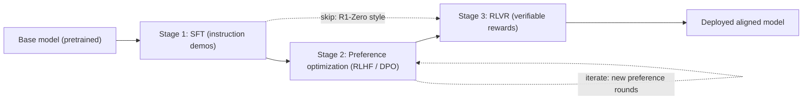

# Post-Training: The Alignment Pipeline

## Overview

Post-training is everything that happens to a base (pretrained) language model between the end of next-token pretraining and product deployment: supervised fine-tuning, preference optimization (RLHF/DPO), and reinforcement learning with verifiable rewards (RLVR). This section covers the *pipeline* — the order of stages, the data each stage consumes, who runs which variant, and where each stage fails. Architecture internals live elsewhere ([Advanced Training Systems](../advanced/training-advanced.md)); serving the aligned model is covered in the serving section.

> **Interview Angle**: Interviewers rarely ask "what is RLHF?" anymore. They ask "why did Llama 3 run SFT, rejection sampling, PPO *and* DPO?" or "why does R1-Zero skip SFT and your product model can't?" Knowing the pipeline stages, their data volumes, and their failure modes is what separates a candidate who read a blog post from one who has shipped a post-trained model.

## Why Post-Training Exists

A pretrained model is a next-token distribution over internet text. It can *complete* a question, but it does not reliably *answer* it, refuse harmful requests, or produce a consistent persona. Post-training converts that distribution into a policy — a model whose outputs are helpful, safe, and calibrated — without paying the pretraining compute bill again.

Three forces shape every post-training pipeline:

1. **Data economics.** Pretraining consumes trillions of tokens scraped from the web; post-training consumes thousands to millions of *human-curated or model-generated* examples. Quality per example is orders of magnitude higher, and curation cost dominates.
2. **Signal availability.** SFT needs demonstrations ("what a good answer looks like"), preference optimization needs comparisons ("which answer is better"), and RLVR needs verifiers ("is this answer objectively right"). Each signal is cheaper or more expensive depending on the domain.
3. **Failure locality.** Each stage has a characteristic failure mode — SFT overfits to style, DPO collapses its implicit reward scale, RL-driven models over-optimize the reward (reward hacking) or drift in length and formatting. Pipeline design is largely risk management.

## The Four-Stage Pipeline

Stages 2 and 3 are usually iterated in rounds: collect fresh data on the current model, retrain, re-evaluate, repeat. Llama 3 ran roughly six such rounds, so the "pipeline" is really a loop wrapped around stages 1-3.

### Stage 1: Supervised Fine-Tuning (SFT)

Fine-tune the base model on instruction–response demonstrations, maximizing the log-probability of response tokens given the prompt. Data comes from human writers (InstructGPT: ~13,000 demonstrations), distilled frontier models (Alpaca's 52K GPT-3-generated instructions; R1's ~800K distilled reasoning samples), or rejection-sampled self-data (RFT). SFT teaches *format and behavior* — the style of a good answer — but not *relative quality* between candidate answers.

Key knobs: data mix (instruction vs chat vs safety vs reasoning), epochs (typically 1-3; more overfits), learning rate (1e-5 to 2e-5 for full fine-tuning, far higher than alignment stages), and loss masking (train only on response tokens, not the prompt). For the mechanics of SFT, see [Supervised Fine-Tuning](../llm-serving/sft.md).

### Stage 2: Preference Optimization (RLHF / DPO)

Train on *comparisons* between candidate responses. The classic RLHF route trains a Bradley-Terry reward model on preference pairs, then runs PPO to maximize reward under a KL constraint to the SFT model. The DPO family (DPO, IPO, KTO, ORPO, SimPO) collapses this into a single supervised-style loss on preference pairs — no explicit reward model, no RL loop. See [RLHF & DPO (serving view)](../llm-serving/rlhf.md), the algorithm-deep [DPO page](../../ml/rl/dpo.md), and [DPO Family](./dpo-family.md) in this section.

This stage is where the "polish" comes from: helpfulness, tone, refusal behavior, format discipline. It is also where reward hacking, sycophancy, and verbosity bias are introduced, because a learned reward model is a lossy proxy for human judgment.

### Stage 3: RLVR (Reinforcement Learning with Verifiable Rewards)

Replace the learned reward model with programmatic verifiers — math answer checkers, unit-test execution, format validators — and run policy-gradient RL (typically GRPO or DAPO variants) to push pass rates on hard, verifiable tasks. DeepSeekMath introduced GRPO in this setting; DeepSeek-R1 showed that RLVR on a strong base can elicit long chain-of-thought reasoning; Tülu 3 coined the "RLVR" name for the general recipe. See [GRPO & RLVR](./grpo-rlvr.md) and the algorithm-focused [GRPO page](../../ml/rl/grpo.md).

RLVR rewards are *not* hackable in the statistical sense (the verifier is ground truth), but the hacking surface moves to the *verifier definition*: models learn to match answer formats, guess on multiple choice, or exploit weak test suites.

## The Method Family Map

| Method | Signal | Reward model? | RL loop? | Reference model? | First appeared |
|---|---|---|---|---|---|
| SFT | Demonstrations | No | No | No | Standard practice |
| PPO-RLHF | Pairwise preferences | Yes (explicit) | Yes (online) | Yes | InstructGPT, 2022 |
| DPO | Pairwise preferences | Implicit in loss | No | Yes | Rafailov et al., 2023 |
| IPO / KTO | Pairs / binary feedback | Implicit | No | Yes | 2023 / 2024 |
| ORPO | Pairwise + SFT fused | No | No | No | 2024 |
| SimPO | Pairwise preferences | Implicit | No | No | 2024 |
| GRPO | Any reward (usually verifiable) | Optional | Yes (online) | Yes (KL term) | DeepSeekMath, 2024 |
| RLVR + GRPO/DAPO | Programmatic verifiers | No | Yes (online) | Yes | R1 / Tülu 3 era, 2024-25 |
| RLAIF | AI-generated preferences | Usually | Optional | Yes | Constitutional AI, 2022 |

## Who Does What: Published Pipelines

### InstructGPT (OpenAI, 2022) — the canonical three stages

| Stage | Data | Scale | Method |
|---|---|---|---|
| SFT | Labeler-written demonstrations on API prompts | ~13K prompts | Full fine-tuning, ~3 epochs |
| Reward model | Rankings of 4-9 sampled responses per prompt | ~33K prompts | Bradley-Terry, 6B RM |
| PPO | API prompts | ~31K prompts | KL-penalized PPO against the SFT policy |

The headline result: a 1.3B InstructGPT was preferred over the 175B GPT-3 by human raters — post-training beat a 134× larger model on perceived output quality.

### Llama 3 (Meta, 2024) — industrial multi-round post-training

| Aspect | Choice |
|---|---|
| Stages | SFT → rejection sampling → PPO and DPO (both used) |
| Iteration | ~6 rounds; fresh preference and SFT data collected on each round's model |
| Data scale | Millions of curated SFT examples; ~10 fresh preference batches across rounds |
| Notable detail | Annotator quality managed through audits and win-rate tracking against the current model; code, multilingual, and safety data mixed into every round |

The lesson from Llama 3 is operational: quality came from *data curation velocity* — repeatedly generating candidates, judging them with humans and models, filtering aggressively, and retraining — rather than from any single algorithmic novelty.

### DeepSeek-R1 (2025) — the RL-first reasoning pipeline

| Stage | What happens | Data |
|---|---|---|
| Cold-start SFT | Teach long chain-of-thought format to stabilize RL | Thousands of long CoT samples |
| Reasoning RL | GRPO with rule-based rewards (answer accuracy + format) on math/code prompts | Curated verifiable prompts |
| Rejection sampling + SFT | Sample from the RL checkpoint, keep correct answers, add non-reasoning data, re-SFT | ~600K reasoning + ~200K non-reasoning (~800K total) |
| Final RL | Second RL round mixing verifiable and general (helpfulness/safety) rewards | Mixed prompt distribution |

R1-Zero (no cold-start SFT at all) showed pure RLVR works but produces poor readability and language mixing — which is why the production R1 pipeline re-inserts SFT in the middle. The distilled R1 models (1.5B-70B on Qwen2.5/Llama bases) demonstrate that SFT on strong reasoning traces still beats direct small-model RL at fixed compute.

### The open-recipe ecosystem

- **Tülu 3 (AI2, 2024)**: SFT (~940K examples) → DPO (hundreds of thousands of pairs) → RLVR over GSM8K/MATH/IFEval-style prompts. The first fully open reproduction of the modern three-stage pipeline, and the origin of the "RLVR" name.
- **Qwen2.5 (Alibaba, 2024)**: SFT on 1M+ samples, then two-stage RL (offline then online) with reward models for helpfulness and rule-based rewards for math and formatting.
- **Constitutional AI / RLAIF (Anthropic, 2022)**: replaces human preference labels with AI critiques scored against a written constitution — see [RLAIF](../advanced/rlaif.md).

## Data Volumes by Stage

| Stage | Typical public scale | Cost driver | Quality lever |
|---|---|---|---|
| SFT | 10K (Llama 2: ~27K annotations) to 1M+ (Qwen2.5: 1M+) | Writer time or teacher-model tokens | Prompt diversity, response correctness |
| Preference pairs | 33K prompts (InstructGPT) to 10M+ pairs (Llama 3-class) | Pairwise labeling: K samples × judgments per prompt | Annotator agreement; agreement with model win-rates |
| RLVR prompts | 10K-100K hard, verifiable prompts | Writing problems with checked ground truth | Difficulty distribution (DAPO showed most prompts being all-correct or all-wrong wastes compute) |
| Rejection-sampled SFT | 100K-1M filtered generations | Teacher sampling compute | Verifier strictness, dedup, diversity |

## Failure Modes by Stage

| Stage | Characteristic failure | Signature symptom | First-line mitigation |
|---|---|---|---|
| SFT | Overfitting to style; forgetting pretraining skills | Pass@1 drops on held-out code/math after 3+ epochs | Fewer epochs, LoRA, data mix with replay |
| Reward model | Overoptimization (Goodhart): proxy reward rises, true quality falls | KL grows, RM score grows, human win-rate falls | KL penalty, early stopping, RM ensembles |
| DPO | Likelihood displacement: chosen and rejected likelihoods both fall | Model drifts off-distribution after 1-2 epochs | Low LR, 1 epoch, IPO/SimPO variants |
| PPO/GRPO | Reward hacking, length explosion, entropy collapse | Verbose or formulaic outputs | Clip ranges, length penalties, KL terms |
| RLVR | Verifier exploitation; difficulty mismatch | High reward, low transfer to unverified evals | Stronger tests, dynamic sampling, human audits |

## Interview Questions

1. **Why does post-training exist as separate stages instead of one end-to-end process?**
Each stage consumes a different signal with different cost: demonstrations, comparisons, and verifications. Mixing them end-to-end makes credit assignment impossible — you cannot tell whether a bad answer came from a bad format habit or a bad preference model. Sequential stages also give checkpoints: you can re-run the preference stage without redoing SFT, and each stage's data is independently auditable. Practically, every published pipeline (InstructGPT, Llama 3, R1, Tülu 3) keeps the stage boundaries, iterating *around* them rather than fusing them.

2. **Why did DeepSeek-R1 put SFT in the middle of its RL pipeline?**
R1-Zero proved RLVR alone can elicit reasoning, but its output was barely readable and mixed languages — the base model had no long-CoT behavior to bootstrap from, so RL optimized reward through strange modes. The R1 pipeline runs a small cold-start SFT on thousands of long CoT examples before RL to stabilize the format, then after the first RL round does rejection sampling into a large SFT set (~600K reasoning + ~200K non-reasoning examples) before the final RL round. SFT is used twice: once to seed behavior, once to consolidate and broaden it.

3. **When would you choose DPO over PPO-based RLHF, and when not?**
Choose DPO when you have a fixed preference dataset, limited engineering time, and no need to explore new response modes: it needs two model copies instead of four, trains with a supervised loss, and is far easier to reproduce. Avoid it when the capability you want is not represented in your preference data — offline methods only sharpen existing modes, while online RL discovers strategies absent from the dataset (which is why frontier reasoning models use online RLVR, not DPO). Llama 3 hedged by using both PPO and DPO in the same rounds.

4. **What does "post-training is a data curation problem" mean concretely?**
Across published pipelines, algorithm choice matters less than the data loop: Llama 3 attributes quality to six rounds of fresh data collection and aggressive filtering, not to a PPO-vs-DPO decision. Concretely this means: generate candidates, judge them (human or model), reject and dedup, retrain, re-evaluate, repeat — with quality gates and decontamination at every ingestion point. Interviewers want to hear the operational loop, not just "RLHF has three stages."

5. **How do you diagnose which stage is broken when an aligned model underperforms?**
Bisect the pipeline: evaluate the base model (perplexity, pass@k — pretraining problem), the SFT model (format and instruction following — data problem), and the aligned model (preference quality — reward/data problem). If SFT output quality collapsed, look at epochs and data mix; if the aligned model is worse than its own SFT checkpoint, suspect preference-data quality or reward overoptimization; if RM score rose but human win-rate fell, that is textbook reward-model overoptimization. Held-out RM agreement and KL-vs-reward curves localize the stage cheaply.

## Key Takeaways

- Post-training is a *pipeline*: pretrain → SFT → preference optimization → RLVR, with iteration loops around stages 2-3, not a single technique.
- SFT teaches behavior format from demonstrations; preference optimization teaches *relative quality* from comparisons; RLVR teaches *correctness* from verifiable rewards.
- InstructGPT fixed the template (SFT → RM → PPO with ~13K/~33K/~31K prompts); Llama 3 showed it is an industrial data-curation loop (~6 rounds, both PPO and DPO); R1 showed RLVR can come first if you add SFT backstops.
- Every published pipeline keeps stage boundaries so data, failures, and credit remain separable.
- The DPO family trades online exploration for training simplicity — appropriate when your preference dataset already contains the target behavior.
- RLVR removes the learned reward model but moves the hacking surface to verifier design and prompt difficulty distribution.
- Failure modes are stage-local and diagnosable: SFT overfit, RM overoptimization (KL curves), DPO likelihood displacement, GRPO length explosion, RLVR verifier gaming.

## References

- Ouyang et al., "Training language models to follow instructions with human feedback" (InstructGPT), NeurIPS 2022 — https://arxiv.org/abs/2203.02155
- Christiano et al., "Deep Reinforcement Learning from Human Preferences", NeurIPS 2017 — https://arxiv.org/abs/1706.03741
- Rafailov et al., "Direct Preference Optimization", NeurIPS 2023 — https://arxiv.org/abs/2305.18290
- Llama Team, "The Llama 3 Herd of Models", 2024 — https://arxiv.org/abs/2407.21783
- DeepSeek-AI, "DeepSeek-R1: Incentivizing Reasoning Capability in LLMs via Reinforcement Learning", 2025 — https://arxiv.org/abs/2501.12948
- Shao et al., "DeepSeekMath: Pushing the Limits of Mathematical Reasoning in Open Language Models" (GRPO), 2024 — https://arxiv.org/abs/2402.03300
- Lambert et al., "Tülu 3: Pushing Frontiers in Open Language Model Post-Training", 2024 — https://arxiv.org/abs/2411.15124
- Qwen Team, "Qwen2.5 Technical Report", 2024 — https://arxiv.org/abs/2412.15115
- Bai et al., "Constitutional AI: Harmlessness from AI Feedback", 2022 — https://arxiv.org/abs/2212.08073
- TRL reference implementations (SFT/DPO/GRPO/PPO trainers) — https://huggingface.co/docs/trl

## Cross-References

- [DPO Family](./dpo-family.md) — the direct-alignment branch of stage 2
- [GRPO & RLVR](./grpo-rlvr.md) — the verifiable-reward branch of stage 3
- [Reward Models](./reward-models.md) — the learned proxy at the heart of stage 2
- [Reward Hacking](./reward-hacking.md) — how every learned-reward stage fails
- [RLHF & DPO (serving view)](../llm-serving/rlhf.md) — shorter, serving-oriented summary of stage 2
- [Advanced Training Systems](../advanced/training-advanced.md) — the distributed-training machinery underneath every stage
- [GRPO (algorithm page)](../../ml/rl/grpo.md) — the RL algorithm behind R1, in the classic RL section
