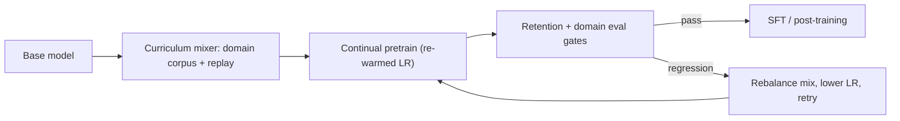

# Continual Pre-Training

## Overview

Continual pre-training (CPT) resumes pretraining on a *trained* model with a new domain-heavy corpus — code, math, medicine, another language — instead of fine-tuning on instructions. It is the standard tool when the target capability needs to live in the model's weights and fluency, not just its behavior: SFT on 100K medical examples cannot reproduce what 50B additional medical tokens can. The central tension is adaptation versus catastrophic forgetting, and the practical recipe is a mixed corpus with general-data replay plus a re-warmed, re-decayed learning rate. The classic continual-learning framing (EWC, rehearsal buffers) is in [Continual Learning](../../ml/advanced/continual-learning.md); here the focus is the LLM-scale pipeline between pretraining and post-training ([Post-Training Overview](./README.md)).

> **Interview Angle**: Expect "how do you add a domain without wrecking general performance?" — the answer is a data-mixing ratio, an LR schedule, and a retention evaluation suite, backed by the Code Llama / DeepSeekMath / Llama 3.1 case numbers.

## Where CPT Fits in the Pipeline

CPT sits between pretraining and the post-training stages: base model → (CPT on domain corpus) → SFT → preference optimization → RLVR. It is "more pretraining", so it inherits pretraining infrastructure (long runs, high LR relative to SFT, trillions-class token plumbing) while adding the retention problem. Choose CPT over SFT when the domain needs *knowledge and vocabulary* (APIs, notation, jargon, reasoning patterns) absorbed broadly; choose SFT when you need behavior shaping on knowledge the base already roughly has. DeepSeekMath is the archetype: ~120B math tokens of CPT took DeepSeek-Coder-Base to near-frontier MATH performance before any SFT or RL — that is a capability SFT alone cannot inject (see [GRPO & RLVR](./grpo-rlvr.md) for what came after).

## The Core Tension: Adaptation vs Forgetting

Gradient updates toward the new domain's loss surface move weights away from the solution that served the old distribution. At LLM scale the symptom pattern is consistent: domain metrics improve for tens of billions of tokens while general benchmarks (MMLU, HellaSwag, instruction-following holdouts) sag; with aggressive LRs the degradation is steep and non-recoverable within the run. Mitigations come in two families:

1. **Data-side**: keep enough general data in every batch (replay), so the old task's loss is still being optimized — the simplest and most effective lever at LLM scale.
2. **Optimization-side**: constrain the movement — lower LR, re-warm/re-decay schedules, parameter-efficient adapters ([LoRA](../advanced/lora.md)), or importance-based regularization like EWC (Kirkpatrick et al., 2017) from the classic literature.

At trillion-scale corpora, data-side replay dominates because optimization-side constraints fight the very capacity you are trying to add; at small data volumes (a few billion tokens), adapter-based methods become competitive because they physically preserve the base weights.

## The Recipe: Mixed Corpora, Replay, LR Schedules

### Data mixing

Published pipelines converge on the same shape: a majority domain corpus plus a general replay fraction, with the replay fraction *increasing* late in the run. Concrete anchors:

- **Code Llama**: continued from Llama 2 weights with ~500B additional code-heavy tokens (including long-context and infilling data); general-language data mixed in to preserve text quality — the resulting models did not lose conversational text ability despite the code-heavy diet.
- **DeepSeekMath**: ~120B tokens of math web data (filtered from Common Crawl) plus arithmetic additions, initialized from DeepSeek-Coder-Base — code pretraining *first* was itself a deliberate curriculum, because code tokens transfer to math reasoning.
- **Llama 3.1 extension training**: additional pretraining to strengthen multilingual coverage (8 languages beyond English), math, coding, and 128K context (progressive RoPE scaling), using fresh warm-up and decay on a mixture with general data to avoid regressing English and instruction ability.

A practical starting split for a domain CPT run is roughly 60-80% domain tokens / 20-40% general replay, with the general slice drawn to match the base model's original distribution, then tuned against your retention suite. There is no universal ratio — it is tuned per run against held-out general benchmarks.

### Learning-rate schedules

Gupta et al. (2023) studied the schedules specifically and named the two that work:

| Schedule | Shape | When to use |
|---|---|---|
| Re-warming | Constant-or-increasing LR on new domain data, then decay | Single new domain, plenty of new tokens; simplest to reason about |
| Re-decaying | Re-warm briefly, then decay *on the mixture* including replay | Multiple sequential domains or limited new tokens; best retention in their study |

The intuition: CPT is "the end of pretraining, again" — models pretrained with LR decayed to ~0 are in a sharp minimum for the old distribution, so re-warming modestly (one to two orders of magnitude below the original pretraining peak; e.g. ~1e-4 to 1e-5 for multi-billion-token runs) escapes it enough to learn, and a fresh decay anneals into the joint minimum. Running CPT at SFT-scale LRs (1e-5, no decay schedule) under-adapts; running at full pretraining LR without decay forgets.

### Curriculum and tokenization effects

Domain ordering matters at the margins: code-before-math transfers (DeepSeekMath's base), and general replay works better when drawn from the *end* of the original pretraining mix (fresher distribution). Also watch the tokenizer: domain corpora shift token distributions (rare Unicode in code, LaTeX in math), which changes effective sequence lengths and can silently invalidate throughput assumptions from the pretraining run (see [Advanced Training Systems](../advanced/training-advanced.md) for the parallelism implications).

## Case Studies

| Run | Base → Corpus | Scale | Retention mechanism | Outcome |
|---|---|---|---|---|
| Code Llama (2023) | Llama 2 → code-heavy mix | ~500B tokens | General-text data in mix; long-context FT stage after | State-of-the-art open code at the time; text ability preserved |
| DeepSeekMath (2024) | DeepSeek-Coder-Base → 120B math tokens | ~120B tokens | Code-first curriculum; quality-filtered web math | MATH near frontier for 7B-class models; set up GRPO/RLVR later |
| Llama 3.1 extension (2024) | Llama 3 → multilingual + math + code + 128K context | Additional pretraining stage | Mixture with general data; fresh warm-up/decay; progressive RoPE scaling | Long-context and multilingual gains without regressing the English core |
| AdaptLLM (2023) | LLaMA-1/2 → domain corpora reformatted as reading comprehension | Per-domain billions of tokens | Raw-domain text rewritten into comprehension format — alignment-ish pretraining | Domain gains with minimal forgetting without massive replay |

The common thread: every successful case treats retention as a *first-class objective with its own evaluation gate*, not as a hoped-for side effect of good LR choices.

## Catastrophic Forgetting Mitigations

| Mitigation | Mechanism | Cost | Best when |
|---|---|---|---|
| General-data replay | Mix 20-40% general tokens into every batch | Cheap — data plumbing only | Always; the default |
| LR schedule (re-warm/re-decay) | Constrain escape from old minimum, anneal into joint minimum | Free | Every run |
| LoRA / adapters on domain data | Freeze base weights; train low-rank deltas ([LoRA](../advanced/lora.md)) | Cheap to run; capacity-capped | Small domain data; many sequential domains |
| EWC / importance regularization | Penalize moving weights important to the old task | Needs Fisher estimates per task | Classic small-model setting; rarely at LLM scale |
| Data curriculum | Order domains so later ones transfer (code → math) | Free | Multi-domain roadmaps |
| Model averaging / merging | Interpolate CPT and base checkpoints to trade off retention vs adaptation | Near-free post-hoc | Tunable deployment knob |

Two knobs deserve explicit numbers in an interview answer: the **replay ratio** (start 60/40 domain/replay, adjust against retention evals) and the **peak LR** (1-2 orders of magnitude below pretraining peak, decayed to near zero on the mixture). Candidates who quote those two numbers plus a retention suite design sound like they have run this; candidates who say "use LoRA" alone have not.

## Evaluation Drift

CPT evaluation has a drift problem in both directions:

1. **Capability drift.** General benchmarks move even when perplexity on a general held-out corpus looks stable — perplexity is a poor retention proxy because a model can shift probability mass between styles while keeping aggregate loss flat. Track a fixed *retention suite* (MMLU-class knowledge, instruction-following, a general chat win-rate against the pre-CPT checkpoint) alongside domain gains, with the pre-CPT model as the pinned baseline.
2. **Contamination drift.** Domain corpora overlap benchmark test sets — math CPT data contains MATH/GSM8K problems, code corpora contain HumanEval-adjacent solutions — so domain "gains" can be memorization. Apply the same decontamination gates as post-training data (n-gram and embedding matching; see [Data Pipelines](./data-pipelines.md)) and report both contaminated-clean and raw numbers when in doubt.
3. **Benchmark meaning drift.** After heavy CPT, a model may answer domain-format questions differently (more step-by-step, different notation), changing what a benchmark *measures* relative to the base — which is why comparisons should always pin the eval harness, prompts, and parsing, and prefer live or recently-refreshed eval sets for retention claims.

## Interview Questions

1. **When do you choose continual pre-training over SFT for domain adaptation, and why?**
When the domain requires new knowledge, vocabulary, and reasoning patterns rather than new behavior on known content. SFT changes behavior conditioned on existing representations — 100K medical Q&A pairs will not teach anatomy or drug-interaction fluency — while CPT moves the underlying distribution with billions of domain tokens. The published anchors: DeepSeekMath used ~120B math tokens to reach near-frontier MATH before any SFT, and Code Llama added ~500B code tokens to Llama 2. Rule of thumb: if you can name the books/manuals/corpora a domain expert would have read, that content belongs in CPT; if the gap is "knows it, doesn't answer like an assistant", that belongs in SFT and preference tuning.

2. **Design the anti-forgetting strategy for a 30B-token medical CPT run on a strong general base.**
Data side: ~70/30 medical/general replay, with the general slice sampled to match the base model's original mixture; apply benchmark decontamination to the medical corpus up front. Optimization side: re-warm LR to ~1e-5-class, then decay to near zero on the mixture (re-decay style). Evaluation side: a fixed retention suite (MMLU-class, instruction-following, general chat win-rate vs the pre-CPT checkpoint) evaluated every ~5B tokens with a gate — if general win-rate drops beyond a tolerance band, increase replay or cut LR rather than finishing the run and discovering the regression. Keep the option of model merging (interpolate checkpoints) as a post-hoc retention knob.

3. **What are re-warming and re-decaying, and why does CPT need them at all?**
A pretrained model has had its LR annealed to ~0, placing it in a minimum tuned to the original distribution; continuing training from that state at SFT-scale LRs barely moves the weights (under-adaptation), while a high LR from step zero moves them violently (forgetting). Re-warming raises the LR modestly (well below the original pretraining peak) to escape the old minimum enough to learn new structure; re-decaying then anneals on the *joint mixture* so the run settles into a minimum good for both distributions. Gupta et al.'s study found re-decaying on the mixture gives the best retention; the LR shape is doing the work that a small replay ratio alone cannot.

4. **Code Llama and DeepSeekMath both did large CPT runs — what made them retain general ability?**
Deliberate data composition, not luck: Code Llama mixed general-language data into its ~500B code-heavy tokens, and DeepSeekMath started from a code-pretrained base (code transfers to math reasoning) with quality-filtered web math plus arithmetic data. Both also kept the "pretraining" character of the run — high token counts, proper LR schedules, web-scale filtering — rather than squeezing CPT into an SFT-shaped job. The transferable lesson: retention is budgeted in the mixture (replay fractions are a planned cost), verified continuously against general benchmarks, and sequenced as a curriculum (code before math, general data throughout).

5. **Your domain benchmark jumps 8 points after CPT but the model got worse at chat. What do you check first?**
Two things in order. First, contamination: is the domain corpus full of the benchmark's test items (math corpora contain MATH/GSM8K near-duplicates routinely)? Run n-gram and embedding decontamination and re-score — if the gain shrinks, it was memorization, not adaptation. Second, the retention-vs-LR trade: check the retention suite curve over the run — a sagging general win-rate alongside rising domain scores means the mixture's replay fraction is too low or the LR too high; re-run with more replay or a re-decayed schedule, and consider checkpoint merging to land the operating point. The symptom pattern "domain up, general down, both large" is almost always mixture/schedule, not a bug.

6. **How does CPT interact with the post-training stages that follow it?**
CPT changes the model that SFT and preference tuning start from, so every downstream dataset's distributional assumptions shift: token distributions, response style, and even tokenizer pressure change with the domain corpus. Practically: re-collect (or at least re-filter) SFT and preference data on the CPT checkpoint, because pairs labeled against the old model are stale — the same iterative-RLHF logic that makes Llama 3 recollect preference data each round. Also expect RLVR prompt difficulty to shift: a math-CPT model solves easier problems uniformly, so zero-advantage groups multiply, and the prompt set needs re-curation (the DAPO dynamic-sampling problem). CPT is not a separate silo — it re-baselines the entire post-training loop.

## Key Takeaways

- CPT = resumed pretraining on a domain-heavy corpus, placed between pretraining and SFT; it injects knowledge and fluency that SFT's behavior shaping cannot.
- The tension is adaptation vs catastrophic forgetting; at LLM scale the winning levers are data-side (replay fractions) with LR-schedule support, not optimization-side regularization.
- The recipe: ~60-80% domain / 20-40% general replay, re-warmed LR (1-2 orders below pretraining peak) with re-decay on the mixture, tuned against a retention suite.
- Case anchors: Code Llama (~500B code tokens), DeepSeekMath (~120B math tokens, code-first curriculum), Llama 3.1 extension (multilingual + 128K context with mixture and fresh warm-up/decay).
- Evaluation drifts in three ways: capability drift (benchmarks move despite stable perplexity), contamination drift (domain corpora overlap test sets), and benchmark-meaning drift (pin the harness, prefer live evals).
- LoRA/adapters trade adaptation capacity for physical weight preservation — competitive for small domain data and sequential domains, not for deep capability injection.
- CPT re-baselines the whole post-training loop: re-filter SFT/preference data on the new checkpoint and re-curate RLVR prompt difficulty afterward.

## References

- Rozière et al., "Code Llama: Open Foundation Models for Code", 2023 — https://arxiv.org/abs/2308.12950
- Shao et al., "DeepSeekMath: Pushing the Limits of Mathematical Reasoning in Open Language Models", 2024 — https://arxiv.org/abs/2402.03300
- Llama Team, "The Llama 3 Herd of Models" (Llama 3.1 extension training), 2024 — https://arxiv.org/abs/2407.21783
- Gupta et al., "Continual Pre-Training of Large Language Models: How to (re)warm your model?", 2023 — https://arxiv.org/abs/2308.04014
- Ke et al., "Adapting Large Language Models via Reading Comprehension" (AdaptLLM), 2023 — https://arxiv.org/abs/2309.09530
- Kirkpatrick et al., "Overcoming Catastrophic Forgetting in Neural Networks" (EWC), 2017 — https://arxiv.org/abs/1612.00796
- Hu et al., "LoRA: Low-Rank Adaptation of Large Language Models", 2021 — https://arxiv.org/abs/2106.09685
- Tülu 3 (pipeline context for post-CPT post-training) — Lambert et al., 2024 — https://arxiv.org/abs/2411.15124

## Cross-References

- [Continual Learning (classic ML)](../../ml/advanced/continual-learning.md) — EWC, rehearsal, and the pre-LLM framing
- [LoRA](../advanced/lora.md) — adapter-based adaptation that preserves base weights
- [Pre-training](../llm-serving/pretraining.md) — the stage CPT resumes
- [Post-Training Overview](./README.md) — where CPT feeds into SFT and alignment
- [Data Pipelines](./data-pipelines.md) — decontamination gates for domain corpora
- [Advanced Training Systems](../advanced/training-advanced.md) — the distributed infrastructure CPT runs on
- [LLM Evaluation](../llm-serving/evaluation.md) — retention suites and contamination testing
