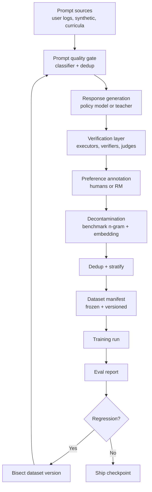

# Post-Training Data Pipelines

## Overview

Model quality after pretraining is determined less by the optimizer than by the data pipeline that feeds it: where prompts come from, how responses are collected, how quality and contamination gates are enforced, and how the result is versioned so a regression can be traced back to a dataset change. Every frontier lab runs an industrial post-training pipeline with the same shape — harvest, synthesize, filter, decontaminate, deduplicate, annotate, verify, package — and interviews increasingly probe this shape rather than the loss functions alone. This page covers the engineering of that pipeline end to end, from prompt sourcing to the training manifest.

> **Interview Angle**: Strong candidates treat data as a distributed-systems problem (lineage, versioning, reproducibility) and a statistics problem (sampling bias, contamination) at the same time. Weak candidates describe "we fine-tuned on GPT-4 outputs" and stop.

## Pipeline Shape

The loop matters as much as the stages: a regression found in evaluation must be bisectable to a dataset version, which requires immutable, content-addressed artifacts. Teams that skip the manifest step cannot explain score changes that follow a silent upstream edit — the single most common operational failure in practice.

## Prompt Sourcing

Prompts enter the pipeline from four channels, each with a distinct bias profile. User-trafficed prompts (consented, anonymized logs) carry real distribution but need PII scrubbing and policy filtering; synthetic prompts are cheap and controllable but inherit the generator model's blind spots; curated corpora (StackExchange, textbooks, exam banks) provide verifiable structure but skew toward what is written down; and adversarial/red-team prompts are deliberately out-of-distribution. Llama 3's post-training report describes a mix in the millions of prompts with explicit quality and difficulty classifiers routing each prompt into capability buckets (coding, math, multilingual, instruction following, creative writing, safety).

| Channel | Realism | Cost | Bias risk | Verifiability |
|---|---|---|---|---|
| User logs | High | Medium (privacy review) | skewed to product surface | Low |
| Synthetic (Evol-Instruct, self-instruct) | Medium | Low | generator blind spots | Medium |
| Curated corpora | Medium | Medium | written-only topics | High |
| Red-team/adversarial | Low (by design) | High | none (purposeful) | Medium |

The canonical synthetic evolution recipe, Evol-Instruct, rewrites seed prompts with operators like "add constraints", "deepen reasoning", or "concretize" to climb difficulty; WizardCoder showed measurable gains from evolution alone. The failure mode is distribution collapse toward the operators' style — treat operators as a sampling distribution and monitor the evolved set's embedding distribution against the seed set.

## Response Generation and Verification

Responses come from the current policy model (self-improvement loops), a stronger teacher model (distillation), or expert humans for narrow high-stakes domains. The critical layer is verification: every response should pass through the strongest checker available for its domain.

- **Executable domains (code, math, SQL)**: run unit tests or check final answers. Execution-based filtering is the single highest-yield filter — DeepSeek-Coder-V2 and Qwen-2.5 both credit rejection sampling under test execution for large coding gains.
- **Judge-checkable domains**: an LLM judge scores helpfulness/harmlessness rubrics; judge position bias and length bias must be measured (swap order, randomize) before trusting the labels.
- **Human-only domains (subjective writing, nuanced safety)**: route to trained annotators with per-task instructions and calibration sets.

A practical rule from frontier post-training reports: prefer *verifiable* signal wherever a domain allows it, and reserve preference data for what verification cannot reach. This is the same division of labor that motivates RLVR (see [GRPO & RLVR](./grpo-rlvr.md)).

## Preference Collection

Human preference pipelines need annotation platform engineering, not just annotator budget. Each task ships with instructions, gold ("salt") examples to measure drift, and pairwise or 4-way comparison layouts. Inter-annotator agreement is tracked per task; Krippendorff's alpha or simple gold-agreement rate below threshold routes work back for instruction revision. Llama 3 reported noticeable quality jumps purely from per-capability task-specific annotation instructions — the interface is part of the model.

Key operational numbers worth quoting in an interview: a skilled annotator completes roughly 2-6 comparisons per minute for short responses, cost ranges from a few cents (objective pairwise) to dollars (expert coding review), and label noise of 5-15% is normal — which is why RM training uses label-smoothed objectives and why DPO-family methods tolerate noise better than brittle argmax pipelines.

## Decontamination

Benchmark contamination inflates evaluations and destroys trust; decontamination is therefore a hard gate, not a best effort. The standard stack, following GPT-3/GPT-4 and Llama practice:

1. **Exact and near-duplicate matching** against benchmark sets: normalize whitespace/case, then n-gram overlap (typically 8-13 gram) over the benchmark corpus.
2. **Embedding retrieval**: embed both dataset and benchmark, flag any item above cosine similarity ~0.85-0.9 against benchmark items for human review — catches paraphrases that n-grams miss.
3. **Train-time held-out probes**: canary strings and private held-out benchmark variants; a model that scores high on public but low on private variants is contaminated.

Scale matters: decontaminating trillions of tokens against a few hundred benchmarks requires approximate join infrastructure (MinHash LSH over shingles), not pairwise scanning. Llama 3 reports re-running decontamination at the final dataset stage *and* the checkpoint stage because late merges reintroduce contaminated sources.

## Deduplication, Stratification, and Mixing

Deduplication inside post-training sets is lighter than in pretraining (exact + MinHash suffices), but stratified mixing is where quality is won. Capability buckets (reasoning, coding, safety, multilingual, creative) are weighted deliberately; sampling weights are treated as hyperparameters with ablations. Two rules of thumb from published recipes: oversample underrepresented capabilities relative to their natural frequency, and keep the safety set proportion stable across rounds so behavior does not drift checkpoint to checkpoint.

Dataset versioning uses content-addressed manifests: each row carries a UUID derived from its hash plus its provenance chain (source, generator model + version, filter decisions). This makes ablations reproducible — "re-run with rows where provenance.generator == teacher-v2 removed" — and makes bisecting a regression mechanical.

## Failure Modes

| Failure | Symptom | Countermeasure |
|---|---|---|
| Silent upstream edit | unexplained eval swing | immutable, content-addressed manifests |
| Generator collapse | narrow style, falling diversity | mix channels, monitor embedding distribution |
| Contamination | public bench up, private flat | multi-layer decon + canaries |
| Judge bias | length/style wins | position-swap, calibrated rubric, spot audits |
| Label noise | RM plateau | smoothed objectives, gold-example drift alarms |
| Over-filtering | RL run starves | track rejection rate per gate, budget passes |

## Interview Questions

1. **Why do post-training pipelines prefer verifiable signals over preference labels where possible?** Preference labels are noisy (5-15% disagreement), biased toward length and confident style, and expensive at scale. Verifiable signals — unit tests, answer checking, theorem proving — are cheap, objective, and dense. Labs therefore route code/math to rejection sampling under execution and reserve human preference for domains where no oracle exists. DeepSeek-R1 and Llama 3 both follow this split.
2. **A new checkpoint regresses 4 points on MMLU but improves coding. Walk through your diagnosis.** First check the dataset manifest diff since the previous run — which capability buckets changed weight. Then check contamination: did a new source leak benchmark content (which would inflate MMLU last time)? Then check for distribution shift in the safety/mix. Because every row is content-addressed with provenance, the ablation is mechanical: re-train a small proxy run with the suspect source removed.
3. **How would you decontaminate a 10T-token pretraining corpus against 500 benchmarks efficiently?** Pairwise scanning is quadratic and infeasible. Build MinHash/LSH signatures over shingles of every document and benchmark item, do an approximate join, then verify candidates with exact n-gram overlap. Add an embedding-retrieval pass for paraphrases on the top candidate pool only. Budget is dominated by the LSH build, which is linear in corpus size and embarrassingly parallel.
4. **What does "point-in-time correctness" mean for post-training data?** Every artifact used in a training run must be reconstructible at run time: the exact filtered set, the exact generator model version, the exact annotation instructions. If the pipeline's live state drifts (new filter version lands mid-run), the run's dataset must be frozen from the manifest, not the live store — otherwise ablations compare apples to oranges.
5. **Synthetic data from a stronger teacher: what are the risks beyond licensing?** Distribution collapse toward the teacher's style and blind spots, benchmark contamination inherited from the teacher's training set, and reward-model overfitting to teacher artifacts (hedging phrases, formatting). Mitigations: execution-based filtering where possible, diversity monitoring, decontaminate *against the teacher's known eval overlaps*, and mix in human/curated data to anchor the tail.

## Key Takeaways

- Treat the pipeline as a system: lineage, versioning, and reproducibility dominate any single filtering trick.
- Verifiable signals first, preference data for what verification cannot reach — the RLVR division of labor.
- Decontamination is layered (n-gram, embedding, canaries) and must re-run at every stage boundary.
- Annotation quality is interface engineering: per-capability instructions and gold-example drift alarms.
- Stratified capability mixing with ablated weights is where post-training quality is actually decided.

## References

- Llama 3 herd of models paper — post-training data pipeline description: [arxiv.org/abs/2407.21783](https://arxiv.org/abs/2407.21783)
- Self-Instruct: [arxiv.org/abs/2212.10560](https://arxiv.org/abs/2212.10560)
- WizardCoder (Evol-Instruct for code): [arxiv.org/abs/2306.08568](https://arxiv.org/abs/2306.08568)
- Phi models (textbook-quality synthetic data): [arxiv.org/abs/2306.11644](https://arxiv.org/abs/2306.11644)
- Deduplicating Training Data (MinHash/ExactSubstr): [arxiv.org/abs/2107.06499](https://arxiv.org/abs/2107.06499)
- DeepSeek-Coder-V2 (execution-based rejection sampling): [arxiv.org/abs/2406.11931](https://arxiv.org/abs/2406.11931)

## Cross-References

- [Synthetic Data](./synthetic-data.md) — generation strategies behind the harvest stage
- [Dataset Deduplication for LLM Training](../advanced/dataset-deduplication.md) — pretraining-scale dedup algorithms
- [GRPO & RLVR](./grpo-rlvr.md) — what the pipeline's verified data feeds
- [Reward Models](./reward-models.md) — the consumer of preference collections
- [Advanced Training](../advanced/training-advanced.md) — the training-loop context around the data
