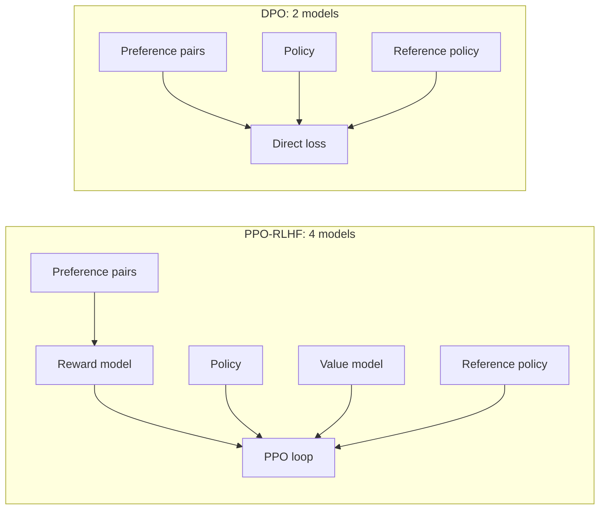

# DPO Family: Direct Preference Optimization and Its Variants

## Overview

The DPO family — DPO, IPO, KTO, ORPO, SimPO — replaces the "train a reward model, then run PPO" two-step of classic RLHF with direct supervised-style losses on preference data. This page derives the core DPO objective from the KL-constrained RLHF problem, then walks through each variant's change of signal or loss shape, and closes with a decision table for practitioners. The classic RLHF loop it replaces is covered in [RLHF & DPO (serving view)](../llm-serving/rlhf.md) and the algorithm page [Direct Preference Optimization](../../ml/rl/dpo.md); the pipeline context is in [Post-Training Overview](./README.md).

> **Interview Angle**: The killer question is "DPO has no reward model — so where is the reward?" The correct answer is the implicit-reward derivation: DPO's policy update is *exactly* RLHF's KL-constrained reward maximization under a specific reward parameterization, so the reward exists, it is just reparametrized as a log-ratio against the reference policy.

## The KL-Constrained RLHF Objective

Classic RLHF (InstructGPT) solves:

\\[
\\max_{\\pi_\\theta} \\; \\mathbb{E}_{x \\sim \\mathcal{D},\\, y \\sim \\pi_\\theta(y|x)} \\left[ r(x, y) \\right] - \\beta \\, \\mathrm{KL}\\left( \\pi_\\theta \\| \\pi_{\\mathrm{ref}} \\right)
\\]

where \\( r(x,y) \\) is a learned reward model, \\( \\pi_{\\mathrm{ref}} \\) is the frozen SFT policy, and \\( \\beta \\) controls how far the policy may drift. This inner problem has a closed-form solution:

\\[
\\pi^*(y|x) = \\frac{1}{Z(x)} \\, \\pi_{\\mathrm{ref}}(y|x) \\, \\exp\\left( \\frac{r(x,y)}{\\beta} \\right)
\\]

with \\( Z(x) \\) the partition function. Inverting it expresses the reward in terms of the optimal policy:

\\[
r(x, y) = \\beta \\log \\frac{\\pi^*(y|x)}{\\pi_{\\mathrm{ref}}(y|x)} + \\beta \\log Z(x)
\\]

DPO's insight (Rafailov et al., 2023): substitute this expression into the Bradley-Terry preference likelihood \\( P(y_w \\succ y_l) = \\sigma(r(y_w) - r(y_l)) \\). The \\( Z(x) \\) terms cancel, so the reward model and the RL loop both disappear — you are left with a loss on (prompt, chosen, rejected) triples only.

## DPO: The Core Loss

\\[
\\mathcal{L}_{\\mathrm{DPO}} = -\\mathbb{E}_{(x, y_w, y_l) \\sim \\mathcal{D}} \\left[ \\log \\sigma \\left( \\beta \\log \\frac{\\pi_\\theta(y_w|x)}{\\pi_{\\mathrm{ref}}(y_w|x)} - \\beta \\log \\frac{\\pi_\\theta(y_l|x)}{\\pi_{\\mathrm{ref}}(y_l|x)} \\right) \\right]
\\]

The implicit reward of any response is \\( r_\\theta(x,y) = \\beta \\log (\\pi_\\theta(y|x) / \\pi_{\\mathrm{ref}}(y|x)) \\) — a log-likelihood-ratio against the frozen SFT model, scaled by \\( \\beta \\). The loss pushes the implicit-reward *margin* between chosen and rejected to grow; the reference model keeps both terms bounded.



Gradient intuition: the DPO gradient is roughly \\( \\beta \\sigma(-\\text{margin}) \\) times (increase chosen log-ratio, decrease rejected log-ratio). Early in training, when the margin is wrong, the weight is large; once pairs are ordered correctly, updates fade. Two practical consequences follow:

1. **Hyperparameters.** \\( \\beta \\in [0.05, 0.5] \\) (Llama 3 and most open recipes use ~0.1), learning rate 5e-7 to 1e-6 — an order of magnitude below SFT — and typically exactly 1 epoch. Higher \\( \\beta \\) keeps the policy closer to the reference.
2. **Failure mode: likelihood displacement.** Both \\( \\pi_\\theta(y_w|x) \\) and \\( \\pi_\\theta(y_l|x) \\) can *decrease*, with the rejected response falling faster — the relative margin grows while the model drifts off the SFT distribution, which surfaces as worse formatting or unlearned safety behavior. Analysis of when DPO displaces probability mass appears in Razin et al. (2024). Mitigations: low LR, one epoch, or the variants below.

```python
# DPO step, stripped to essentials (TRL's DPOTrainer is the reference implementation)
for prompt, chosen, rejected in preference_batch:
    lp_c = model.logprob(prompt, chosen)          # policy log p(y_w | x)
    lp_r = model.logprob(prompt, rejected)        # policy log p(y_l | x)
    with torch.no_grad():                          # frozen reference
        ref_c = ref_model.logprob(prompt, chosen)
        ref_r = ref_model.logprob(prompt, rejected)

    margin = beta * ((lp_c - ref_c) - (lp_r - ref_r))   # implicit reward gap
    loss = -F.logsigmoid(margin).mean()                 # -log sigma(margin)
    loss.backward()
```

## IPO: Squared Loss Against Overfitting

IPO (Azar et al., 2023) observed that DPO can overfit small preference datasets: the logistic loss keeps pushing the margin after pairs are correctly ordered, which forces the policy far from the reference and degrades generation quality. IPO replaces the logistic loss with a squared hinge-style regression whose optimum is at a *finite* margin:

\\[
\\mathcal{L}_{\\mathrm{IPO}} = \\mathbb{E} \\left[ \\left( \\log \\frac{\\pi_\\theta(y_w|x)}{\\pi_{\\mathrm{ref}}(y_w|x)} - \\log \\frac{\\pi_\\theta(y_l|x)}{\\pi_{\\mathrm{ref}}(y_l|x)} - \\frac{1}{2\\tau} \\right)^2 \\right]
\\]

The target difference \\( 1/(2\\tau) \\) caps how much relative advantage the policy assigns to chosen responses. IPO's other contribution is theoretical: it shows that training on a finite preference dataset is fundamentally limited — if the data's preference distribution is not representable, no objective recovers the true optimum — which motivates collecting data under the *current* policy rather than reusing stale pairs.

## KTO: Binary Feedback and Prospect Theory

KTO (Ethayarajh et al., 2024) changes the *signal*: instead of pairs \\( (y_w, y_l) \\), it needs only unlabeled pairs of (prompt, response, thumbs-up/down) — the natural artifact of production chat systems. Users click 👍/👎; prompts rarely come with two side-by-side candidates. Reconstructing balanced pairs from such data wastes most of it; KTO consumes each binary example directly.

Its loss is derived from **prospect theory** (Kahneman-Tversky): humans evaluate outcomes relative to a reference point, and losses loom larger than equivalent gains (loss aversion). KTO's value function applies asymmetric weights \\( \\lambda_L > \\lambda_W \\) to dispreferred and preferred examples — a single bad response should count more than a good one — and adds an explicit KL term against the reference policy to keep the policy bounded:

```text
L_KTO = E[ λ_W * (1 - v(θ, x, y_desirable)) ]      # desired: maximize its value
      + E[ λ_L * (1 - v(θ, x, y_undesirable)) ]    # undesired: penalized harder
v(θ, x, y) = σ( β log(π_θ/π_ref) - β KL(π_θ || π_ref) )   # signed deviation from KL target
```

Empirical takeaway: at matched data, KTO matches or beats DPO, and wins clearly when desirable/undesirable examples are heavily imbalanced (e.g. 90/10) — a common production reality. Tuning \\( \\lambda_L / \\lambda_W \\) is a direct dial on loss aversion: a 1:5 ratio trains "avoid bad" much harder than "seek good".

## ORPO: Odds-Ratio Penalty Inside SFT

ORPO (Hong et al., 2024) removes the reference model entirely by fusing preference optimization into the SFT objective — a *monolithic* one-stage method that can start from the base model, not an SFT checkpoint. Its loss is the standard SFT negative log-likelihood plus a penalty on the **odds ratio** between chosen and rejected:

\\[
\\mathcal{L}_{\\mathrm{ORPO}} = \\mathcal{L}_{\\mathrm{SFT}}(y_w) + \\lambda \\, \\mathbb{E} \\left[ -\\log \\frac{\\mathrm{odds}_\\theta(y_w|x)}{\\mathrm{odds}_\\theta(y_l|x)} \\right]
\\qquad \\text{where } \\mathrm{odds}_\\theta(y|x) = \\frac{P_\\theta(y|x)}{1 - P_\\theta(y|x)}
\\]

The odds ratio is zero when both sequences are equally likely under the policy and grows as the chosen response becomes more likely than the rejected one; penalizing its negative log makes dispreferred sequences actively unlikely rather than merely "less preferred". With \\( \\lambda \\approx 0.1 \\), an 7B ORPO model fine-tuned directly from a base model was reported matching much larger SFT-then-DPO pipelines on AlpacaEval-style evaluations. The practical wins: one training run, no second model copy in memory, and usable when you have *both* demonstrations and preferences on the same prompts.

## SimPO: Length-Normalized and Reference-Free

SimPO (Meng et al., 2024) keeps the DPO shape but changes two things, targeting two known pathologies:

1. **Length bias.** Summed log-probabilities reward longer responses — a verbosity hack that inflates DPO's implicit reward. SimPO uses the *average* log-probability per token: \\( \\frac{\\beta}{|y|} \\log \\pi_\\theta(y|x) \\), so a longer response must genuinely raise per-token confidence, not just accumulate more terms.
2. **Reference-model burden.** Dropping \\( \\pi_{\\mathrm{ref}} \\) halves memory and I/O (no second model's logprobs), but the policy then has nothing anchoring it — so SimPO adds a target margin \\( \\gamma \\): a pair counts as correct only when the normalized reward gap exceeds \\( \\gamma \\), which keeps the learned scale from collapsing.

\\[
r_{\\mathrm{SimPO}}(x, y) = \\frac{\\beta}{|y|} \\log \\pi_\\theta(y|x),
\\qquad
\\mathcal{L} = -\\mathbb{E} \\left[ \\log \\sigma \\left( r_{\\mathrm{SimPO}}(x, y_w) - r_{\\mathrm{SimPO}}(x, y_l) - \\gamma \\right) \\right]
\\]

Typical values: \\( \\beta \\approx 2.0\\text{-}2.5 \\) (much larger than DPO's 0.1 because the reward is now a *mean* per-token logprob, which is small in magnitude) and \\( \\gamma \\approx 0.5 \\text{-} 1.0 \\). SimPO-tuned Llama-3-8B and Gemma-2-9B checkpoints showed large length-controlled AlpacaEval 2.0 gains over DPO at similar win rates — at the cost of being more sensitive to \\( \\gamma \\) and prone to degrading downstream benchmark accuracy if pushed for pure win-rate.

## RLHF (PPO) vs DPO-Family: Decision Table

| Aspect | PPO-RLHF | DPO | IPO | KTO | ORPO | SimPO |
|---|---|---|---|---|---|---|
| Signal | Pairwise preferences | Pairwise | Pairwise | Binary 👍/👎 | Demos + pairs | Pairwise |
| Models in memory | 4 (policy, ref, RM, value) | 2 | 2 | 2 | 1 | 1 |
| Online sampling | Yes | No | No | No | No | No |
| Reference model | Yes (KL) | Yes | Yes | Yes | No | No |
| Length-bias control | Via RM/length penalty | None (known issue) | None | Via KL anchor | Partial | Built-in (avg logprob) |
| Tuning difficulty | High (RL) | Low | Low | Medium (λ ratio) | Medium (λ) | Medium (γ) |
| Exploration ceiling | High (can exceed dataset) | Bounded by dataset | Bounded | Bounded | Bounded | Bounded |
| Best when | Max quality, online data available | Clean pairs, one-shot training | Small pair datasets | Imbalanced binary feedback | Base-model one-stage run | Verbose outputs, memory-bound |

The deeper trade-off behind the table: offline methods (the whole DPO family) optimize a *fixed* dataset, so their ceiling is the diversity of that dataset; online RL keeps generating and can find behaviors no annotator wrote down. That is why frontier reasoning pipelines ([GRPO & RLVR](./grpo-rlvr.md)) use online RL even though it is harder to run.

## Interview Questions

1. **Where is the reward model in DPO?**
It is reparametrized into the policy. Starting from the KL-constrained RLHF objective, the optimal policy is \\( \\pi^* \\propto \\pi_{\\mathrm{ref}} \\exp(r/\\beta) \\); inverting gives \\( r(x,y) = \\beta \\log(\\pi^*/\\pi_{\\mathrm{ref}}) + \\beta \\log Z(x) \\). Substituting into the Bradley-Terry likelihood cancels the partition function, leaving the DPO loss on log-ratios. So DPO's "implicit reward" is a class of reward models — those consistent with the optimal KL-constrained policy — not an absence of rewards. You can even extract it at inference and use it for best-of-N sampling.

2. **Why does DPO overfit after one epoch, and which variants address it?**
The logistic margin loss has its optimum only asymptotically: it keeps pushing the chosen/rejected log-ratio apart forever, so extra epochs drag the policy off the reference distribution (likelihood displacement — both likelihoods fall, rejected faster). IPO replaces the logistic loss with a squared regression to a finite margin \\( 1/(2\\tau) \\), capping the push. SimPO's margin \\( \\gamma \\) plays a similar anchoring role reference-free. Operationally the fix is also boring: LR ~5e-7, one epoch, monitor chosen *and* rejected logprobs for joint descent.

3. **When is KTO the right choice over DPO?**
When your feedback is binary and imbalanced — production thumbs-up/down streams, moderation flags, acceptance of generated code. Pair-based methods must reconstruct pairs, discarding most prompts and biasing the surviving set. KTO consumes single labeled examples, and its prospect-theoretic weighting (\\( \\lambda_L > \\lambda_W \\)) lets you encode loss aversion: penalize undesirable outputs harder than you reward desirable ones. It also degrades more gracefully under class imbalance — DPO needs roughly balanced pairs to behave.

4. **What two pathologies does SimPO fix relative to DPO, and what does it give up?**
It fixes (1) length bias — summing logprobs means longer responses accumulate higher implicit reward, so DPO models inflate; SimPO normalizes by token count \\( |y| \\) — and (2) the memory/compute cost of a second reference model, which it removes entirely. What it gives up: the reference model's regularization. Without an anchor, the reward scale can collapse, so SimPO reintroduces structure via the margin \\( \\gamma \\), which is its most sensitive hyperparameter, and the method is more fragile on downstream benchmark retention than DPO.

5. **Why did ORPO's authors argue preference data can replace the SFT stage entirely?**
ORPO adds the odds-ratio penalty to the SFT loss, so the model learns *what to say* (the NLL term on chosen responses) and *what not to say* (the penalty against rejected) in one pass from the base model. The rejected half of the loss actively suppresses dispreferred continuations — a signal plain SFT never provides — which compensates for skipping a dedicated SFT phase. The result is a single training run with one model in memory. The catch: it needs demonstrations and preferences covering the same distribution, and it cannot exploit an existing strong SFT checkpoint the way DPO does.

6. **Your DPO model's AlpacaEval win rate went up but MMLU dropped. What happened and what do you change?**
Classic preference-objective tunnel vision: the reward proxy (judge win-rate, often length-sensitive) improved while the policy drifted from the SFT distribution's knowledge behavior. Check first for length inflation (average response length vs the SFT checkpoint — that is what SimPO's length normalization targets), then for likelihood displacement (chosen and rejected logprobs both down). Remedies in order of cost: shrink to 1 epoch / lower LR, raise \\( \\beta \\) to stay near the reference, switch to SimPO (length-normalized) or IPO (bounded margin), and mix a small SFT/replay loss to hold the distribution.

## Key Takeaways

- DPO is RLHF's KL-constrained objective solved in closed form and plugged into Bradley-Terry — the reward model becomes the log-ratio \\( \\beta \\log(\\pi_\\theta/\\pi_{\\mathrm{ref}}) \\), not a separate network.
- The whole family is *offline*: bounded by the diversity of the preference dataset, which is exactly the ceiling online RL (PPO/GRPO) is paid to escape.
- DPO failure signatures: 1-epoch overfitting and likelihood displacement (both likelihoods fall, rejected faster); LR ~5e-7, β≈0.1, one epoch is the standard regime.
- IPO bounds the margin with a squared loss; KTO converts binary 👍/👎 feedback with prospect-theory loss aversion (\\( \\lambda_L > \\lambda_W \\)); ORPO fuses the penalty into SFT with an odds ratio and no reference model; SimPO length-normalizes the reward and adds a margin \\( \\gamma \\) instead of a reference.
- Model-count economics: PPO needs 4 models in memory, DPO/IPO/KTO need 2, ORPO/SimPO need 1 — the practical reason offline methods dominate open-recipe pipelines.
- A judge win-rate that rises while downstream benchmarks fall is the family-wide symptom of proxy over-optimization; length and likelihood diagnostics localize it.

## References

- Rafailov et al., "Direct Preference Optimization: Your Language Model is Secretly a Reward Model", NeurIPS 2023 — https://arxiv.org/abs/2305.18290
- Azar et al., "A General Theoretical Paradigm to Understand Learning from Human Preferences" (IPO), 2023 — https://arxiv.org/abs/2310.12036
- Ethayarajh et al., "KTO: Model Alignment as Prospect Theoretic Optimization", ICML 2024 — https://arxiv.org/abs/2402.01306
- Hong et al., "ORPO: Monolithic Preference Optimization without Reference Model", EMNLP 2024 — https://arxiv.org/abs/2403.07691
- Meng et al., "SimPO: Simple Preference Optimization with a Reference-Free Reward", NeurIPS 2024 — https://arxiv.org/abs/2405.14734
- Ouyang et al., "Training language models to follow instructions with human feedback" (InstructGPT), NeurIPS 2022 — https://arxiv.org/abs/2203.02155
- Schulman et al., "Proximal Policy Optimization Algorithms", 2017 — https://arxiv.org/abs/1707.06347
- Razin et al., "Unintentional Unalignment: Likelihood Displacement in Direct Preference Optimization", 2024 — https://arxiv.org/abs/2404.12358
- TRL DPO trainer reference implementation — https://huggingface.co/docs/trl

## Cross-References

- [Post-Training Overview](./README.md) — where stage 2 sits in the full pipeline
- [Reward Models](./reward-models.md) — the explicit reward model that DPO's implicit reward replaces
- [GRPO & RLVR](./grpo-rlvr.md) — the online-RL branch that escapes the offline ceiling
- [RLHF & DPO (serving view)](../llm-serving/rlhf.md) — condensed comparison and TRL training snippet
- [Direct Preference Optimization (algorithm page)](../../ml/rl/dpo.md) — DPO in the classic RL context
- [RLAIF](../advanced/rlaif.md) — where the preference labels themselves can come from AI feedback
