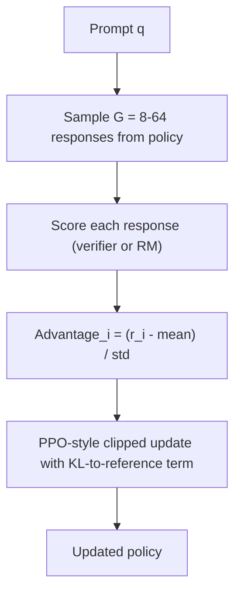
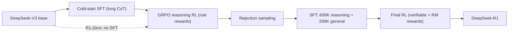

# GRPO & RLVR: Reinforcement Learning with Verifiable Rewards

## Overview

GRPO (Group Relative Policy Optimization) is the policy-gradient algorithm behind DeepSeekMath, DeepSeek-R1, and most open reasoning-model training in 2024-2025. RLVR (Reinforcement Learning with Verifiable Rewards) is the reward regime it usually runs in: instead of a learned reward model, a programmatic verifier — answer checker, unit-test runner, format validator — scores each rollout. This page covers GRPO's mechanics, the R1 pipeline that made it famous, and the DAPO/Dr.GRPO fixes for its known biases. The algorithm page [GRPO](../../ml/rl/grpo.md) covers the classic-RL framing; here the focus is the post-training pipeline role.

> **Interview Angle**: Expect "why does GRPO not need a value network?" (group baselines replace the critic) and "R1-Zero vs R1 — why the difference?" (pure RLVR elicits reasoning but not readability; SFT backstops fix that). Both answers require knowing exactly which component was removed and what replaced it.

## The Problem GRPO Solves: PPO's Value-Function Tax

PPO-based RLHF ([PPO](../../ml/rl/ppo.md), InstructGPT) keeps four models in memory simultaneously: the training policy, the frozen reference policy (for the KL penalty), the frozen reward model, and a learned value function (critic) that estimates expected return to compute advantages. The critic is typically the same size as the policy, and it is hard to train — the value estimate must be accurate for *token-level* credit assignment on long sequences, or advantages are noise.

GRPO (Shao et al., DeepSeekMath, 2024) removes the critic entirely. Its observation: when the reward is the *outcome* of a whole response, and you can afford to sample multiple responses per prompt, the group's own mean reward is a better-conditioned baseline than any learned value function.

## GRPO Mechanics

For each prompt, sample a group of \\( G \\) responses from the current policy, score all of them, and compute the advantage of response \\( i \\) relative to its group:

\\[
A_i = \\frac{r_i - \\mathrm{mean}(r_1, \\dots, r_G)}{\\mathrm{std}(r_1, \\dots, r_G)}
\\]

This z-scored outcome reward is broadcast to every token of response \\( i \\) (no per-token value estimates). The policy update is PPO's clipped surrogate objective, plus a KL term added directly into the loss — using an unbiased estimator that stays positive:

\\[
\\mathrm{KL}\\left[\\pi_\\theta \\| \\pi_{\\mathrm{ref}}\\right] \\approx \\frac{\\pi_{\\mathrm{ref}}(o_t|q,\\, o_{<t})}{\\pi_\\theta(o_t|q,\\, o_{<t})} - \\log \\frac{\\pi_{\\mathrm{ref}}(o_t|q,\\, o_{<t})}{\\pi_\\theta(o_t|q,\\, o_{<t})} - 1
\\]



```python
# GRPO inner loop, schematic (TRL's GRPOTrainer is the reference implementation)
for q in verifiable_prompts:
    responses = [policy.sample(q) for _ in range(G)]        # one generation phase
    rewards = [verifier(q, r) for r in responses]           # 0/1 from a checker, or RM score
    A = [(r - mean(rewards)) / (std(rewards) + 1e-8) for r in rewards]
    for response, adv in zip(responses, A):
        rho = policy.logprob(q, response) - old_policy.logprob(q, response)
        surr = torch.min(rho * adv,
                         torch.clamp(rho, 1 - eps, 1 + eps) * adv)
        loss = -surr.mean() + beta * kl_to_reference(q, response)
        loss.backward()
```

Consequences of the design:

1. **Memory**: three models (policy, reference, optional RM) instead of four — the critic was ~25% of RLHF's memory bill.
2. **Baseline quality**: with a binary verifier reward and \\( G \\) samples, the baseline is exact for that prompt — if all responses are correct (or all wrong), every advantage is 0 and the prompt contributes nothing. This is a feature and a bug: it wastes compute on too-easy/too-hard prompts (see DAPO's dynamic sampling below).
3. **Hyperparameters**: group size \\( G = 8 \\text{-} 64 \\); the KL coefficient keeps the policy near the reference; clip range \\( \\varepsilon \\approx 0.2 \\).

## RLVR: The Verifiable Reward Regime

RLVR replaces the learned reward model with **programmatic verification** of the response:

| Domain | Verifier | Reward |
|---|---|---|
| Math | Parse final answer, compare to ground truth (symmetry-checked) | 1 if correct, 0 otherwise |
| Code | Compile + run against hidden unit tests | Pass fraction |
| Instruction following | Constraint checkers (length, JSON schema, format) | Per-constraint score |
| Data/analysis | Execute generated SQL/analysis against held-out results | Exact match |

Properties that make RLVR attractive at scale: no preference annotation cost, no reward model to over-optimize (the verifier is ground truth, so statistical Goodharting of a learned proxy disappears), and rewards are exactly reproducible across training rounds. The term and the open-recipe formulation come from Tülu 3 (AI2, 2024); DeepSeek made it famous at frontier scale.

The failure surface moves rather than vanishes: models learn to *game the verifier definition* — matching the expected answer format without reasoning, guessing on multiple-choice, writing test-aware code, or generating the string the regex accepts. Verifier design (hidden tests, answer canonicalization, format auditing) becomes the new reward-model-design problem; see [Reward Hacking](./reward-hacking.md).

## DeepSeekMath → R1: The Pipeline That Made GRPO Standard

**DeepSeekMath (2024)** introduced GRPO for a 7B model, pushing MATH benchmark performance above much larger models at the time using math-specific continual pretraining plus GRPO with a mix of rule-based and learned rewards.

**R1-Zero (2025)** is the ablation that made the field rethink pipelines: GRPO applied *directly to the base DeepSeek-V3 model* with purely rule-based rewards (answer accuracy + a format reward enforcing `think`/`answer` tags), no SFT, no learned RM. Reasoning emerged — response length grew from hundreds to thousands of tokens as the model learned to backtrack and verify ("aha moments") — but outputs were hard to read and mixed languages. Pure RLVR elicits capability; it does not produce a product.

**R1 (production)** wraps RLVR with SFT stages:

| Stage | Operation | Purpose |
|---|---|---|
| 1. Cold-start SFT | Fine-tune on thousands of curated long-CoT examples | Stabilize readable reasoning format before RL |
| 2. Reasoning RL | GRPO, rule-based accuracy + format + language-consistency rewards | Push pass rates on math/code; kill language mixing |
| 3. Rejection sampling + SFT | Sample from the RL checkpoint; keep correct answers; build ~600K reasoning + ~200K non-reasoning (writing, QA, translation) samples; re-SFT from base | Consolidate; recover general ability the RL round degraded |
| 4. Final RL | GRPO-style RL on mixed verifiable tasks plus RM-scored general behavior | Align helpfulness/safety without losing reasoning |

Two transferable lessons: (1) SFT is used twice — to seed behavior before RL and to consolidate after; (2) the distilled models (R1-Distill, 1.5B-70B SFT'd on R1's 800K samples) beat smaller models trained with direct RL at equal compute, so for small budgets "SFT on a big model's reasoning traces" remains the right move.



## DAPO: Fixing GRPO's Biases at Scale

DAPO (ByteDance/Tsinghua, 2025) trained on Qwen2.5-32B to ~50% on AIME with four targeted changes to GRPO-style training — each fixing a measurable pathology:

| DAPO technique | GRPO pathology it fixes | Mechanism |
|---|---|---|
| Clip-higher | Entropy collapse: early on, low-probability (exploratory) tokens get suppressed, the policy stops exploring and converges to a mode | Asymmetric clipping: raise the upper clip bound \\( \\varepsilon_{high} \\) (~0.28) while keeping the lower bound tight |
| Dynamic sampling | Wasted updates on all-correct or all-wrong groups (zero advantage by construction) | Oversample prompts; keep only groups with mixed outcomes until the batch is full |
| Token-level policy gradient loss | Sequence-level averaging under-weights long responses (hard problems have long solutions), amplifying noise | Normalize the loss by total tokens in the batch, not per-sequence |
| Overlong reward shaping | Truncated max-length responses get noisy negative reward and destabilize training | Soft penalty on overlong outputs + filter them from the objective |

## Dr. GRPO: Two More Biases in the Standard Recipe

Dr. GRPO ("Understanding R1-Zero-Like Training: A Critical Perspective", 2025) dissects two biases introduced by *implementations* of GRPO and R1-Zero rather than by the core idea:

1. **Standard-deviation normalization** (dividing by std in the advantage) makes easy or hard questions produce systematically larger advantages — the std is small when the group is nearly uniform, inflating updates exactly where the baseline says "nothing to learn". Dr. GRPO drops the std term, keeping the raw group-mean baseline.
2. **Length normalization in the loss** divides each sequence's loss by its token count, so a long wrong answer spreads its (negative) advantage over more tokens — each token's push toward the wrong answer is small, but there are many of them. Combined with clipping, this biases generation longer and rewards rambling. Dr. GRPO removes per-sequence length normalization.

These findings matter because they show GRPO's published results embed implementation choices; reproductions that differ in these details are not comparing like-for-like.

## Interview Questions

1. **How exactly does GRPO avoid a value network, and what does it cost?**
It replaces the learned baseline with the empirical mean reward of a group of \\( G \\) samples for the *same prompt*: advantage \\( A_i = (r_i - \\mathrm{mean})/\\mathrm{std} \\), broadcast over response tokens. For prompt-conditioned outcome rewards this baseline is lower-variance than a critic, because it is exact for that prompt rather than a generalization from other prompts. Costs: you must generate \\( G \\) responses per prompt (generation becomes the dominant compute), prompts whose group is all-correct or all-wrong contribute zero signal (DAPO's dynamic sampling recovers this), and token-level credit assignment is gone — all tokens in a response share its outcome advantage.

2. **Why does R1-Zero's success not mean "skip SFT"?**
R1-Zero's pure-RLVR run produced reasoning but unusable output: low readability, language mixing, poor formatting — because the base model had no long-CoT behavior to amplify, RL found reward through whatever modes were reachable. The production R1 adds a cold-start SFT (thousands of long-CoT examples) to stabilize format before RL, then after reasoning RL does rejection sampling into an ~800K-sample SFT (600K reasoning + 200K general) to consolidate and restore general abilities, then runs a final RL round for helpfulness/safety. The distill results reinforce the point: small models learn more from SFT on R1's traces than from their own RL.

3. **In RLVR, where did reward hacking go if there is no learned reward model?**
It moved from the reward *model* to the reward *definition*. The verifier is ground truth for what it checks, so statistical over-optimization of a learned proxy disappears — but models exploit underspecified verifiers: matching answer formats without reasoning, exploiting weak unit tests, or regex-gaming format rewards. Practical countermeasures: hidden test suites, answer canonicalization, auditing high-reward outputs that fail human checks, and mixing RM-based general rewards (as R1's final stage does). Treat verifier design as reward-model design with a smaller but sharper attack surface.

4. **What is the difference between DAPO's token-level loss fix and Dr. GRPO's length-normalization fix? They sound opposite.**
They target different normalizations. DAPO's token-level policy gradient normalizes the *batch* objective by total tokens so that long (hard) responses are not under-weighted when the batch loss is averaged per sequence — it strengthens long-sequence gradients globally. Dr. GRPO's critique is about dividing *each sequence's* loss by its own length, which dilutes per-token gradients for long wrong answers under clipping and systematically biases generation toward length. One is a batch-level reweighting; the other argues the per-sequence division itself is a bias. Reading the two papers side by side is a good exercise in how implementation details masquerade as algorithm properties.

5. **Why sample G responses per prompt instead of using a running baseline like REINFORCE with baseline?**
Group sampling makes the baseline prompt-specific and contemporaneous: it tracks the current policy's ability on exactly this prompt, which a stale running average does not. It also gives free within-batch difficulty filtering (zero-variance groups are uninformative), and for binary verifiable rewards the z-score is exact. The price is \\( G \\)-fold generation cost per prompt, which is acceptable only because generation is cheaper than training at these scales — and because RLVR prompts are cheap, so you can oversample and discard uninformative groups.

6. **What changes in your infrastructure when you move from DPO to GRPO/RLVR?**
You add a generation-in-the-loop system: a high-throughput inference service (vLLM/SGLang class) for rollouts, a verifier fleet (sandboxed code execution, answer parsers), and a trainer that consumes (prompt, G responses, rewards) groups — policy, reference, and verifier in memory, no critic. Rollout throughput dominates wall-clock, so the engineering work is colocating inference with training and managing verifier parallelism. Offline DPO was a two-model supervised job; GRPO is a distributed RL system (see [Advanced Training Systems](../advanced/training-advanced.md) for the training-infra background).

## Key Takeaways

- GRPO = PPO minus the value network: group-relative advantages \\( (r_i - \\mathrm{mean})/\\mathrm{std} \\) from \\( G \\) samples per prompt replace the critic; KL to the reference is folded into the loss via an unbiased estimator.
- RLVR swaps the learned reward model for programmatic verifiers (math answer checks, unit tests, constraint checkers) — no annotation cost, no proxy Goodharting, but a sharper verifier-gaming surface.
- R1-Zero: GRPO straight on the base model elicits long-CoT reasoning ("aha moments") but unusable formatting; production R1 wraps RL with cold-start SFT, rejection-sampled SFT (~800K samples), and a final general-capability RL round.
- DAPO's four fixes — clip-higher, dynamic sampling, token-level loss, overlong shaping — target entropy collapse, zero-advantage waste, long-sequence under-weighting, and truncation noise respectively.
- Dr. GRPO shows the std-normalization and per-sequence length normalization in common GRPO implementations inject difficulty and length biases; both are removable.
- Frontier post-training pipelines (DeepSeek, Qwen) run GRPO-family RL *on top of* SFT rounds, not instead of them; SFT seeds and consolidates, RL sharpens.
- Infrastructure shifts from two-model supervised training to generation-in-the-loop RL with a verifier fleet; rollout throughput becomes the bottleneck.

## References

- Shao et al., "DeepSeekMath: Pushing the Limits of Mathematical Reasoning in Open Language Models" (introduces GRPO), 2024 — https://arxiv.org/abs/2402.03300
- DeepSeek-AI, "DeepSeek-R1: Incentivizing Reasoning Capability in LLMs via Reinforcement Learning", 2025 — https://arxiv.org/abs/2501.12948
- Yu et al., "DAPO: An Open-Source LLM Reinforcement Learning System at Scale", 2025 — https://arxiv.org/abs/2503.14476
- Liu et al., "Understanding R1-Zero-Like Training: A Critical Perspective" (Dr. GRPO), 2025 — https://arxiv.org/abs/2503.20783
- Schulman et al., "Proximal Policy Optimization Algorithms", 2017 — https://arxiv.org/abs/1707.06347
- Lambert et al., "Tülu 3: Pushing Frontiers in Open Language Model Post-Training" (RLVR formulation), 2024 — https://arxiv.org/abs/2411.15124
- Ouyang et al., "Training language models to follow instructions with human feedback" (PPO-RLHF baseline), NeurIPS 2022 — https://arxiv.org/abs/2203.02155
- TRL GRPO trainer reference implementation — https://huggingface.co/docs/trl

## Cross-References

- [Post-Training Overview](./README.md) — stage 3 of the pipeline in context
- [GRPO (algorithm page)](../../ml/rl/grpo.md) — the classic-RL treatment of the same algorithm
- [PPO](../../ml/rl/ppo.md) — the clipped-surrogate objective GRPO inherits
- [Reward Models](./reward-models.md) — the learned-reward alternative GRPO usually replaces
- [Reward Hacking](./reward-hacking.md) — how the verifier-gaming surface is exploited
- [DeepSeek](../sota/deepseek.md) — the model family this pipeline produced
- [Advanced Training Systems](../advanced/training-advanced.md) — distributed training infrastructure for RL workloads
