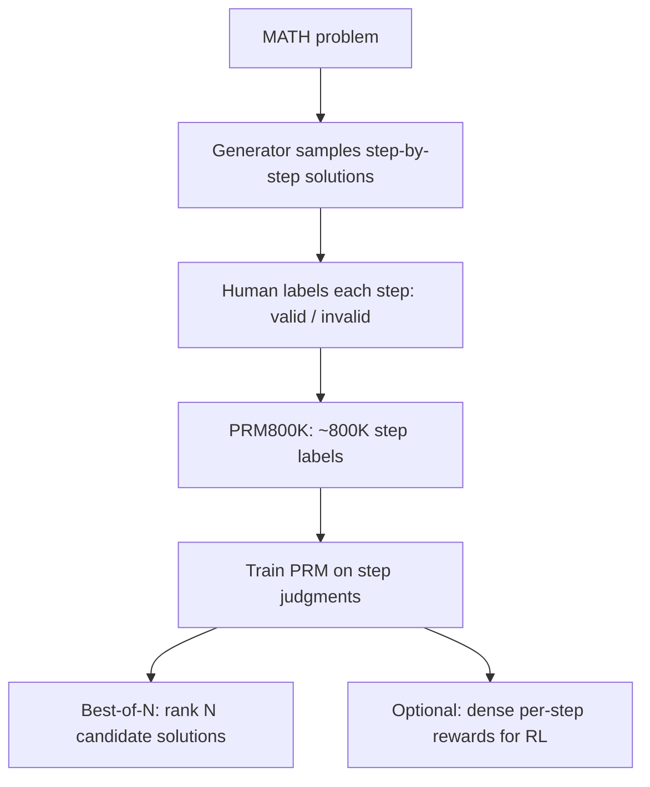

# Process Reward Models

## Overview

A process reward model (PRM) scores *each step* of a chain-of-thought solution instead of assigning one score to the whole response. The motivation is credit assignment: an outcome reward model (ORM) tells you that a 40-step solution failed, a PRM tells you it broke at step 17. This page covers the step-labeling dataset that defined the field (PRM800K), the two automated label-generation methods (OmegaPRM's MCTS search and Math-Shepherd's rollout estimation), the recent empirical criticism of PRM evaluation, and the ORM-vs-PRM decision table. The whole-response RM it upgrades is covered in [Reward Models](./reward-models.md); the pipeline context is [Post-Training Overview](./README.md).

> **Interview Angle**: "Why not just use an outcome reward?" and "how would you get step labels without paying humans for every step?" are the two standard questions. Strong answers cite PRM800K's 78%-vs-72% best-of-N gap, then explain Math-Shepherd's Monte-Carlo rollout labeling — and a great answer knows the 2024-25 criticism that Monte-Carlo labels correlate poorly with human step judgments.

## Why Step-Level Supervision

Outcome rewards are one bit per response. For long reasoning chains this creates three compounding problems:

1. **Sparse credit assignment.** In RL, the whole sequence's tokens share the outcome advantage; the step that caused the failure is not identified, so the policy gradient spreads blame (and credit) uniformly across steps — noise grows with solution length.
2. **Weak best-of-N selection.** An ORM must discriminate among N complete solutions; with N in the hundreds, subtle differences in intermediate reasoning dominate final-answer differences, and a scalar over the full text is a blunt instrument.
3. **No partial credit.** A solution that is 90% correct gets the same reward as one that is 0% correct, wasting the most informative training examples.

Step-level rewards attack all three: they give dense feedback for RL, fine-grained ranking for best-of-N, and localize errors for debugging and data triage. The cost is the label — someone (or some process) must judge every step.

## PRM800K: "Let's Verify Step by Step"

Lightman et al. (OpenAI, 2023) built the canonical human-labeled dataset and the controlled experiment:

- **Data**: 12,000 MATH problems; models generated solutions rendered as step-structured text; human annotators labeled *every step* of each solution as valid or invalid. The released dataset contains ~800,000 step-level labels across ~75,000 solutions. Annotation used active learning — solutions shown to raters were selected to maximize information about the PRM's decision boundary (more steps shown where the model was uncertain), and the final large-scale PRM was itself used to rank solutions for the ORM baseline.
- **Headline result**: with best-of-N selection (N = 186 samples per problem, PRM-weighted voting), the PRM-supervised verifier reached **78.2%** on their MATH test subset vs **72.4%** for the ORM-supervised one — and the PRM's advantage *grew* with N, because finer-grained scoring discriminates better among many similar candidates.
- **Robustness finding**: PRM-guided selection generalized better to out-of-distribution problem sets (a held-out set of recent competition problems) than ORM selection, suggesting step-level judgments capture reasoning quality rather than surface familiarity with the answer distribution.
- **Scope caveat**: all of this was *inference-time* verification (best-of-N), not RL fine-tuning; the same paper notes the ORM-vs-PRM comparison was only meaningful when the ORM was trained on PRM-ranked data (a naive ORM was much weaker).

## OmegaPRM: MCTS for Finding the First Error

Human step labels are expensive — the OmegaPRM paper (Google DeepMind, 2024) asks: can a machine find the *first erroneous step* automatically? Their method runs **Monte Carlo Tree Search over the solution tree** with a binary-search twist:

1. From a problem node, sample continuations and estimate, for each prefix, the probability that rollouts from that prefix reach the correct final answer (a "value" per node).
2. Use binary search along a solution to locate the step where that value collapses — the first-error step — rather than exhaustively labeling every step.
3. The MCTS process explores alternative branches at error points, producing both positive examples (correct continuations) and localized negative labels (the exact broken step).

The result: **1.5M automatically annotated steps** with no human step labels, a PRM trained on them, and reported gains of ~7 points of pass@1 on MATH for a Gemini Pro-class model using the PRM for solution selection. The design insight generalizes beyond math: "first-error localization by outcome-probability collapse" is a recipe for any domain where you can automatically check the final answer but not each step.

## Math-Shepherd: Step Labels from Monte-Carlo Rollouts

Math-Shepherd (2023) takes the cheapest possible automatic label for step \\( s_t \\) of a solution: **let the model finish the solution from the prefix through \\( s_t \\), M times, and count how often the final answer is correct.** A step is "good" if completions conditioned on it succeed more often than chance.

\\[
\\hat{y}(s_t) = \\frac{1}{M} \\sum_{m=1}^{M} \\mathbb{1}\\left[ \\text{final answer of rollout}_m \\text{ is correct} \\right]
\\]

Properties worth stating precisely in an interview:

- The label measures *whether the step preserves reachability of the right answer*, not whether it is logically valid. A lucky wrong step that gets "rescued" by later work scores positively; a correct but unnecessary step can score neutrally.
- It requires a **ground-truth final answer** for the problem, so it is confined to verifiable domains (math, code) — exactly the RLVR regime in [GRPO & RLVR](./grpo-rlvr.md).
- Cost is \\( M \\) extra generations per step (typically M = 4-16 with short completion budgets), which is why it is a data-generation loop, not an online reward.
- The trained Math-Shepherd PRM is used both for best-of-N verification and as a step-level reward for RL (per-step advantages replace the single outcome advantage).

This rollout-based, outcome-derived process supervision is the mechanism most engineering write-ups refer to when they say "ORPS-style" (outcome-reward-derived process supervision): process labels manufactured from outcome checks. The term has no single canonical citation; the mechanisms above are the substance behind it.

## The Criticism: Do PRMs Know Where It Went Wrong?

Two 2024-25 results from the Qwen team punctured the assumption that automatic PRM labels equal human step judgments:

- **ProcessBench** (2024): a benchmark of problems with human-identified *first erroneous steps*; evaluated PRMs frequently failed to localize the injected error — many PRMs judged the final answer rather than the process, and MC-trained PRMs performed worse on error localization than their answer-level accuracy suggested.
- **"Lessons of Developing Process Reward Models in Mathematical Reasoning"** (2025): the sharpest criticism. Comparing three label sources on the same solutions — human step annotations, Monte-Carlo completion estimates, and LLM-critic judgments — they found **MC-estimated labels correlate poorly with human step judgments**: the rollout signal measures answer reachability, not step validity. Their fixes: consensus filtering (keep steps where MC and human/critic labels agree), *soft* labels from MC probabilities instead of hard thresholds, and combining sources. The resulting Qwen2.5-Math-PRM models beat prior open PRMs on ProcessBench, but the paper's deeper point stands: much of the PRM literature conflates "reachable answer" with "correct reasoning", and best-of-N wins attributed to PRMs can partly come from answer-level signals.

Practical reading of the criticism: MC-labeled PRMs are *useful but miscalibrated instruments* — good for ranking candidate solutions, unreliable as ground truth for "which step is wrong". If your pipeline needs auditable error localization (education, safety review), budget for human step labels; if it needs better best-of-N selection, MC labels are often enough.

## ORM vs PRM: Comparison Table

| Property | ORM (outcome RM) | PRM (process RM) |
|---|---|---|
| Scoring granularity | One scalar per response | One score per step |
| Label source | Pairwise/absolute answer judgments | Human step labels, MCTS first-error search, or MC rollouts |
| Data cost | One judgment per candidate pair | One judgment (or M rollouts) *per step* — 10-100× more |
| Requires ground-truth answers? | For training targets, generally yes (preferences) | Automatic variants require verified final answers |
| Best-of-N selection | Good; saturates at large N | Better; advantage grows with N (78.2% vs 72.4% at N=186) |
| RL feedback | Sparse outcome advantage for all tokens | Dense per-step advantages; better credit assignment on long chains |
| Failure modes | Over-optimization of a whole-response proxy (Goodhart) | MC labels conflate reachability with validity; "final-answer leakage"; label noise compounds per step |
| Verifier-gaming surface | Style/length hacks on the full text | Step-format hacks, "looks like valid reasoning" patterns |
| Representative systems | InstructGPT RM, Llama 2/3 RMs | PRM800K PRM, Math-Shepherd, OmegaPRM, Qwen2.5-Math-PRM |

Note what R1 did with this menu: DeepSeek-R1 deliberately used *rule-based outcome* rewards (answer accuracy + format) rather than a PRM, citing the risk that a learned process reward gets hacked at scale — the step-reward advantage is real, but so is its exploitability, and at their scale the simple verifiable signal won.

## Interview Questions

1. **What exactly does PRM800K contain, and what was the controlled result?**
~800,000 step-level labels (valid/invalid per step) over ~75,000 step-structured solutions to 12,000 MATH problems, collected with human annotators plus active learning to concentrate labels where the PRM was uncertain. The controlled experiment: for best-of-N selection with N = 186, the PRM-supervised verifier scored 78.2% on their MATH test subset vs 72.4% for the ORM-supervised verifier, with the PRM's edge growing in N and holding on out-of-distribution competition problems. Important scope note: this was inference-time verification — the paper did not fine-tune with the PRM as an RL reward.

2. **How does Math-Shepherd produce step labels without human annotators, and what is the label actually measuring?**
For each step, it samples M completions of the remaining solution from the prefix ending at that step and labels the step by the fraction of completions reaching the correct final answer. So the label measures *reachability of the correct answer given the prefix*, not logical validity — a lucky wrong step that later self-corrects scores well. It needs ground-truth final answers, so it is confined to verifiable domains, and it costs M extra generations per step. Those properties explain both its scalability and the later ProcessBench-era criticism about correlation with human step judgments.

3. **Why might a PRM trained on Monte-Carlo labels mislocate the first error?**
Two reasons. First, the label is about the future (can the answer still be reached?), not the past (was this step justified?) — an invalid step followed by a lucky recovery gets a positive label, so the PRM learns answer-reachability features rather than validity features. Second, outcome-checking leaks into the labels: completions "succeed" by matching the final answer, so shortcut features (plugging in guesses, mimicking the expected answer form) correlate with success. The Qwen lessons paper measured exactly this: MC labels correlate poorly with human step judgments, and consensus filtering across label sources plus soft labels recovers much of the gap.

4. **When would you choose an ORM over a PRM even knowing PRM800K's numbers?**
When responses are short, the verifier is objective, or you are running RL at scale. Short responses make step decomposition low-value — there is little credit assignment to fix. Objective verifiable rewards (R1's rule-based answer + format checks) give a non-hackable outcome signal with zero labeling cost, while a learned PRM adds a proxy to over-optimize and an attack surface for step-format gaming. PRM800K's own results are about best-of-N verification of long mathematical reasoning; outside that regime — or when N is small — the ORM's simplicity often wins. Also, PRM inference cost scales with the number of steps scored, which matters inside an RL loop.

5. **How does OmegaPRM's binary search work, and why is it cheaper than labeling every step?**
It models solution generation as a tree and, for each node (prefix), estimates the probability that rollouts from that node reach the correct answer. Along one candidate solution, it binary-searches for the step where that probability collapses — the first-error step — instead of asking a human about every step. Each probe costs a few rollouts, and the search concentrates them exactly at the error boundary. The MCTS component then explores alternative branches around located errors, yielding corrective positive examples. Result: 1.5M automatically localized step annotations, and a PRM that improved Gemini Pro-class MATH pass@1 by ~7 points.

6. **You want dense rewards for GRPO on long math solutions. What are the options and their risks?**
Option A: MC-labeled PRM (Math-Shepherd style) as the per-step reward — dense and automatic, but the labels measure reachability, so the policy can be pushed toward answer-shortcut steps; mitigate with consensus filtering and soft labels. Option B: human-labeled PRM — highest fidelity, worst cost, and still a learnable proxy that can be gamed. Option C: stay sparse — outcome reward + longer group sampling (GRPO), letting the group baseline do credit assignment implicitly; this is what R1 chose, deliberately, to avoid learned-RM hacking at scale. The honest answer: dense learned rewards trade one bias (sparse credit) for another (proxy gaming), and the right choice depends on how verifiable your domain is and how much proxy-auditing you can afford.

## Key Takeaways

- PRMs replace one outcome bit with per-step scores: better credit assignment for RL, stronger best-of-N selection (78.2% vs 72.4% at N=186 in PRM800K), and error localization.
- PRM800K: ~800K human step labels on ~75K MATH solutions (12K problems), collected with active learning — the field's reference dataset.
- OmegaPRM automates labels via MCTS + binary search for the first-error step (1.5M annotations); Math-Shepherd automates them via Monte-Carlo rollouts from each prefix — the "outcome-derived process supervision" (ORPS-style) mechanism.
- The MC label measures answer reachability, not step validity — the central criticism (ProcessBench; Qwen lessons paper) is that such PRMs often fail to localize real errors, and consensus filtering across label sources is the current fix.
- PRM inference cost scales with steps scored, making PRMs natural for offline best-of-N and awkward (but used) inside online RL loops.
- ORM vs PRM is a trade of biases: sparse credit and whole-response proxy gaming (ORM) versus label noise, reachability-vs-validity conflation, and step-level gaming (PRM).
- DeepSeek-R1 chose rule-based outcome rewards over a learned PRM at scale — a reminder that the simplest non-hackable verifier often wins in production.

## References

- Lightman et al., "Let's Verify Step by Step" (PRM800K), ICLR 2024 — https://arxiv.org/abs/2306.17492
- Luo et al., "Math-Shepherd: Verify and Reinforce LLMs Step-by-step without Human Annotations", 2023 — https://arxiv.org/abs/2312.08935
- Luo et al., "Improve Mathematical Reasoning in Language Models by Automated Process Supervision" (OmegaPRM), 2024 — https://arxiv.org/abs/2406.06592
- Zheng et al., "ProcessBench: Identifying Process Errors in Mathematical Reasoning", 2024 — https://arxiv.org/abs/2412.06559
- Qwen Team, "Lessons of Developing Process Reward Models in Mathematical Reasoning", 2025 — https://arxiv.org/abs/2501.07301
- Gao, Schulman, Hilton, "Scaling Laws for Reward Model Overoptimization", 2022 — https://arxiv.org/abs/2210.10760
- DeepSeek-AI, "DeepSeek-R1: Incentivizing Reasoning Capability in LLMs via Reinforcement Learning" (rule-based rewards choice), 2025 — https://arxiv.org/abs/2501.12948
- Hendrycks et al., "Measuring Mathematical Problem Solving With the MATH Dataset", 2021 — https://arxiv.org/abs/2103.03874

## Cross-References

- [Reward Models](./reward-models.md) — the outcome-reward baseline PRMs upgrade
- [GRPO & RLVR](./grpo-rlvr.md) — where step-level rewards plug into policy-gradient training
- [Reward Hacking](./reward-hacking.md) — why learned process rewards add an attack surface
- [Self-Improvement](./self-improvement.md) — rejection sampling and bootstrapping that consume PRM-style filters
- [Chain-of-Thought Prompting](../../ml/agents/chain-of-thought.md) — the reasoning format PRMs supervise
- [LLM Evaluation](../llm-serving/evaluation.md) — how best-of-N and verifier quality are measured
- [Post-Training Overview](./README.md) — the pipeline context for verification signals
