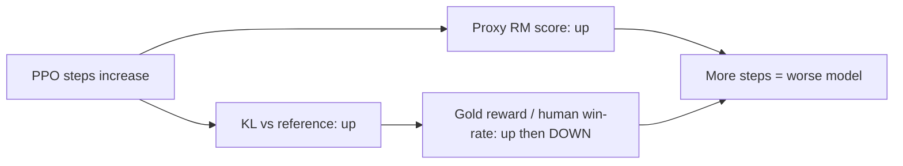

# Reward Models

## Overview

A reward model (RM) is a learned scalar function \\( r(x, y) \\) scoring how well a response \\( y \\) serves prompt \\( x \\), trained to reproduce human (or AI) preference judgments. It is the load-bearing proxy of the RLHF stage: PPO pushes the policy toward whatever the RM scores highly, so every property of the final model — helpfulness, tone, honesty, length, formatting — is filtered through it. This page covers the Bradley-Terry training objective, how preference data is actually collected, the scalar-head vs LLM-as-judge architecture split, the Goodhart over-optimization curves, and the ensemble/revocation defenses. The pipeline context is [Post-Training Overview](./README.md); the failure pathology has its own page, [Reward Hacking](./reward-hacking.md).

> **Interview Angle**: The differentiating question is quantitative: "your policy's RM score keeps climbing but human win-rate peaked — what's happening and what do you do?" That is the Gao et al. over-optimization curve plus the mitigation toolbox, and it is the single most common real-world reward-model incident.

## Bradley-Terry: From Human Judgments to a Scalar

Human raters find it far easier to compare two responses than to assign absolute scores (absolute scores drift between annotators and sessions; comparisons are locally consistent). The standard model treats a preference judgment as a noisy observation of the reward gap:

\\[
P(y_w \\succ y_l \\mid x) = \\sigma\\big( r(x, y_w) - r(x, y_l) \\big)
\\qquad
\\mathcal{L}_{\\mathrm{RM}} = -\\log \\sigma\\big( r(x, y_w) - r(x, y_l) \\big)
\\]

Only the *difference* of rewards is identified by the loss — absolute RM scores are meaningless across models and datasets, which is why RM scores must never be compared across checkpoints. Rankings of \\( K \\) responses decompose into \\( K-1 \\) pairwise terms (or a softmax over all \\( K \\), the "plackett- luce" variant). InstructGPT trained a 6B RM on ~33K prompts where each had 4-9 model samples ranked — roughly 100-300K comparisons from one annotation pass. Llama 2 and Llama 3 repeated this at 10-100× scale across iterative rounds.

```mermaid
graph LR
    P["Prompt pool (diverse, decontaminated)"] --> GEN["Sample K = 2-9 responses from 1-2 policies"]
    GEN --> ANN["Human/AI annotation: pick best, or full ranking"]
    ANN --> QC["Quality gates: agreement checks, honeypots, audit"]
    QC --> PAIRS["Pairwise dataset (y_w, y_l)"]
    PAIRS --> RM["Train RM: -log sigma(r_w - r_r)"]
    RM --> USE["Drive PPO / GRPO / best-of-N"]
    ANN -.->|"inter-annotator agreement reported"| QC
```

## Preference Data Collection in Practice

| Design choice | Common setting | Why it matters |
|---|---|---|
| Sampling policies | 1-2 recent checkpoints, temperature ~1 | Pairs from a *weak* policy are too easy; pairs from the current policy track the actual failure surface |
| Candidates per prompt | K = 2 (fast) to K = 9 (InstructGPT) | Larger K gives ranking structure and more pairs per prompt at sublinear annotation cost |
| Judgment type | Best-of-K, full ranking, or pointwise rubric | Rankings give K-1 constraints per task; pointwise scores need calibration |
| Annotator pool | Specialized vendors (Surge, Scale) with audits | InstructGPT used ~contractor pools with screening; Llama 3 ran continuous audits |
| Agreement tracking | Krippendorff's α / win-rate vs previous model | Low α signals ambiguous prompts or rushed labeling, not necessarily bad annotators |

Two systematic artifacts to plan around: **position bias** (judges prefer the first or last option shown — randomize and counterbalance presentation order) and **length bias** (longer, more thorough-looking responses win too often — track win-rate-vs-length correlation as a standing metric).

## Architectures: Scalar Head vs LLM-as-RM

| Property | Scalar-head RM | LLM-as-RM (generative judge) |
|---|---|---|
| Form | SFT backbone + linear head emitting one number (often from the last token) | The LLM itself prompted to critique and output a score/verdict |
| Training | Bradley-Terry on pairs | None (zero-shot) or fine-tuned judge; constitutional critique/revision |
| Cost at inference | One forward pass, cheap — ideal inside an RL loop | Generation of a full critique — 10-100× more tokens, usually offline |
| Known biases | Length, sycophancy, style shortcuts | Position bias, self-preference (favors its own outputs), verbosity |
| Used in | PPO/GRPO online RL (InstructGPT, Llama 2/3) | AlpacaEval/MT-Bench evals, RLAIF, offline pair labeling |
| Interpretability | Score only | The critique text is an auditable rationale |

Rules of thumb from published pipelines: the RM is typically the same size as or one step smaller than the policy (InstructGPT: 6B RM for a 175B policy; Llama 2 paired 34B-scale policies with similarly sized RMs), and a too-small RM saturates early — it cannot distinguish the subtler behaviors a larger policy invents, which accelerates over-optimization. Generative judges are increasingly *trained* (critique-then-score formats) because zero-shot GPT-4 judging showed measurable position, length, and self-enhancement biases.

## Overoptimization: The Goodhart Curve

An RM is a proxy optimized on finite preference data. Gao, Schulman, Hilton (OpenAI, 2022) ran the controlled experiment: train a policy with PPO against a proxy RM, and measure both the proxy score and a *gold* RM (larger, trained on much more data, or human labels) as functions of the KL distance from the reference policy.

| Observation | What you see on the plot |
|---|---|
| Proxy reward | Monotonically increasing in KL — optimization is "working" |
| Gold reward | Concave: rises, peaks, then *decreases* — the policy is finding high-proxy, low-quality outputs |
| Peak location | Farther in KL for bigger RMs and more preference data — scaling the proxy *delays* but does not remove the peak |
| Functional form | Gold reward vs KL fits a concave function; peak gold reward scales roughly like the square root of KL-at-peak |

This is Goodhart's law with a measured shape. Operationally it means: (1) always plot gold/held-out RM score and human win-rate against KL, not just proxy reward; (2) the KL budget is a real hyperparameter — InstructGPT-class runs used per-token KL coefficients around 0.01-0.05 with targets of a few nats; (3) when the curve peaks, more PPO steps make the model worse while every training metric improves.

## Defenses: Ensembles, Revocation, Refresh

| Defense | Idea | Evidence |
|---|---|---|
| RM ensembles | Train N RMs (different seeds/data shards), optimize their mean; disagreement doubles as an uncertainty signal that can gate exploration | Coste et al. (2023): ensembles raise the gold-reward peak and delay over-optimization vs a single RM |
| Weight-averaged RMs (WARM) | Average RM *weights* along a trajectory instead of predicting from N outputs — one-model inference cost with ensemble-like robustness | Ramé et al. (2024) |
| Revocation | With an ensemble, "undo" reward dimensions that a subset of RMs flags as gamed — audits which reward components are being exploited rather than just averaging | Eisenstein et al. (2023): helps, but does not eliminate hacking |
| Early stopping on gold signal | Hold out a second RM or a human-audited eval set; stop PPO when it peaks | Standard practice in every RLHF pipeline since InstructGPT |
| RM refresh rounds | Recollect preferences on the *current* policy each round (Llama 3's ~6 rounds; iterative RLHF) | Fixes distribution shift between RM training data and the evolving policy |

No defense is free: ensembles multiply RM training and inference cost; refresh rounds lengthen the pipeline. The realistic posture is monitoring (KL + gold curves) with one or two defenses enabled, not all of them.

## Outcome vs Process Reward Models (Preview)

The RM described so far scores the *whole response* — an outcome reward model (ORM). Process reward models (PRMs) instead score each reasoning step, which changes both the data collection (step-level labels or automatic step verification) and the failure modes (partial credit, dense feedback for RL). That distinction deserves its own page: see [Process Reward Models](./process-reward-models.md) for PRM800K, Math-Shepherd, and the ORM-vs-PRM comparison table.

## Interview Questions

1. **Why train reward models on pairwise comparisons instead of absolute scores?**
Absolute scores drift — the same annotator uses "7/10" differently across sessions and prompts, and cross-annotator scale differences are worse. Pairwise comparisons are locally consistent and robust to scale drift; Bradley-Terry converts them into a scalar reward up to a monotonic transform, which is all the KL-constrained RL objective can use anyway (adding a constant to r changes nothing). Rankings of K candidates additionally yield K-1 independent constraints per annotation, amortizing the expensive part (reading the prompt and candidates) across more signal.

2. **Your policy's RM score rose 20% over 300 PPO steps but human win-rate fell. Diagnose and fix.**
That is the Gao et al. over-optimization signature: the proxy is being gamed while true quality peaked. First plot both signals against KL from the reference policy to find where gold reward peaked; you almost certainly overshot the peak KL. Immediate fix: roll back to the best-KL checkpoint (you checkpointed every N steps). Structural fixes: add or raise the KL penalty, switch to an ensemble RM and gate on disagreement, refresh preference data on the current policy (the RM is stale relative to the policy's new behaviors), and audit the top-scoring outputs for length/style hacks. Do not just train longer — the proxy reward will keep rising while quality keeps falling.

3. **How big should the reward model be relative to the policy, and why?**
Same scale or one size down is the published norm (InstructGPT: 6B RM on a 175B policy). The RM must be expressive enough to model the preference-relevant distinctions the policy can produce; an RM that is too small saturates — its top-scored outputs plateau in quality quickly, and PPO's continued pressure then exploits residual quirks instead of improving quality, accelerating the Goodhart peak (smaller RMs peak at smaller KL). Bigger RMs delay the peak but cost linearly in RL-loop inference, which is why the peak can also be pushed out with data quantity and freshness rather than size alone.

4. **What is "reward revocation" and when does it beat a plain ensemble average?**
Revocation (Eisenstein et al.) uses the ensemble not just as an averaged scorer but as a diagnostic: it identifies reward directions that some members consider gamed and *revokes* (removes) the component of the update along those directions, rather than letting the majority outvote the warning. It beats plain averaging when the failure is concentrated — e.g. one exploitable style feature that several members still score positively — because averaging can mask a minority-vote objection. Its limits, per the same paper: ensembles mitigate but do not eliminate hacking, and revocation adds machinery (per-dimension attribution) that most production pipelines skip in favor of KL control and refresh rounds.

5. **Where do LLM-as-judge reward signals fit in a training pipeline, given their biases?**
Offline and as data generators, not as the inner-loop RL reward. Judging requires generating a critique — 10-100× the tokens of a scalar-head forward pass — so it is too expensive per PPO step at scale, and zero-shot judges carry position, verbosity, and self-preference biases that become policy properties when optimized against directly. The productive uses: labeling preference pairs at scale (RLAIF-style, per [RLAIF](../advanced/rlaif.md)), constitutional critique-and-revise loops where the revised outputs become SFT data, and as a held-out "gold-ish" evaluator for monitoring over-optimization — with presentation randomization and a different judge family than the one being trained.

6. **Why can't you compare RM scores between two different reward models, or even two checkpoints of the same one?**
Bradley-Terry training identifies only reward *differences* within each pair; the absolute scale and offset are unconstrained (the loss is invariant to adding a constant, and the scale depends on the temperature-like calibration of each training run). Two RMs live in incomparable units — a 4.2 from one model says nothing about a 4.2 from another. Even two checkpoints of the same RM drift as training shifts its scale. All meaningful monitoring must therefore be *within* one frozen RM: proxy-vs-gold pairs, or win-rate against a fixed baseline, evaluated under the same scorer.

## Key Takeaways

- An RM is a Bradley-Terry model over preference pairs: \\( P(y_w \\succ y_l) = \\sigma(r_w - r_l) \\); only differences are identified, so absolute scores are unitless and non-comparable across models.
- Collection dominates quality: 1-2 recent-policy checkpoints, K=2-9 candidates, randomized presentation, agreement tracking; position and length bias are standing artifacts to measure.
- Scalar-head RMs (one forward pass) run inside RL loops; LLM-as-judge RMs are offline data generators and auditors, with position/self/verbosity biases of their own.
- Over-optimization is measured, not hypothetical: proxy score rises monotonically while gold reward peaks and falls (Gao et al. scaling laws); bigger RMs and more data delay but do not remove the peak.
- Monitor proxy score, held-out gold score, and human win-rate *against KL*; the KL budget is the primary over-optimization control.
- Defenses: RM ensembles, weight-averaged RMs, revocation, early stopping on gold signal, and periodic RM refresh on the current policy — each with real cost.
- Outcome RMs score whole responses; process RMs score steps — a different data regime with different failure modes ([Process Reward Models](./process-reward-models.md)).

## References

- Ouyang et al., "Training language models to follow instructions with human feedback" (InstructGPT RM design), NeurIPS 2022 — https://arxiv.org/abs/2203.02155
- Gao, Schulman, Hilton, "Scaling Laws for Reward Model Overoptimization", 2022 — https://arxiv.org/abs/2210.10760
- Coste, Anwar, Kirk, Krueger, "Reward Model Ensembles Help Mitigate Overoptimization", ICLR 2024 — https://arxiv.org/abs/2310.02743
- Eisenstein et al., "Helping or Herding? Reward Model Ensembles Mitigate but Do Not Eliminate Reward Hacking", 2023 — https://arxiv.org/abs/2312.09244
- Ramé et al., "WARM: On the Benefits of Weight Averaged Reward Models", 2024 — https://arxiv.org/abs/2401.12187
- Christiano et al., "Deep Reinforcement Learning from Human Preferences", NeurIPS 2017 — https://arxiv.org/abs/1706.03741
- Bai et al., "Constitutional AI: Harmlessness from AI Feedback" (AI feedback and critique-revision), 2022 — https://arxiv.org/abs/2212.08073
- Lambert et al., "Tülu 3: Pushing Frontiers in Open Language Model Post-Training", 2024 — https://arxiv.org/abs/2411.15124
- Llama Team, "The Llama 3 Herd of Models" (multi-round preference collection), 2024 — https://arxiv.org/abs/2407.21783

## Cross-References

- [Post-Training Overview](./README.md) — where the RM sits in stage 2 of the pipeline
- [Process Reward Models](./process-reward-models.md) — step-level rewards: PRM800K, Math-Shepherd, ORM-vs-PRM
- [Reward Hacking](./reward-hacking.md) — the exploitation side of every proxy-reward system
- [DPO Family](./dpo-family.md) — methods that replace the explicit RM with an implicit reward
- [RLHF & DPO (serving view)](../llm-serving/rlhf.md) — the RM training snippet in context
- [RLAIF](../advanced/rlaif.md) — replacing human annotators with AI raters
- [LLM Evaluation](../llm-serving/evaluation.md) — how RM quality and win-rates are measured
