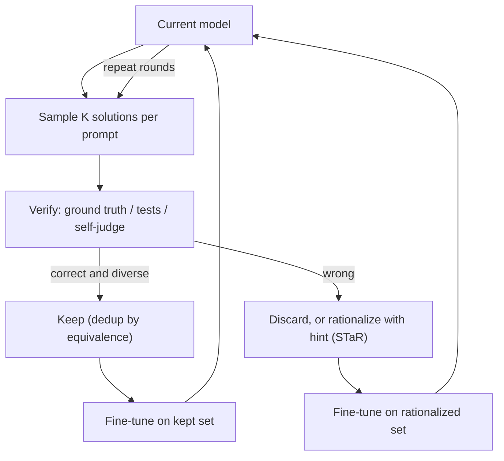

# Self-Improvement: STaR, ReST, and Bootstrapped Reasoning

## Overview

Self-improvement methods turn a model's own correct outputs into its training data: sample many solutions, keep the ones a verifier (or the model itself, acting as judge) accepts, fine-tune on them, and repeat. STaR introduced the loop for reasoning, RFT made rejection sampling a scaling law, ReST/ReST-EM formalized it as grow-improve iterations with an EM interpretation, and Self-Rewarding LMs extended it to preference tuning where the model judges its own outputs. The pipeline context is [Post-Training Overview](./README.md); the data-generation machinery these loops consume is detailed in [Synthetic Data](./synthetic-data.md).

> **Interview Angle**: The sharp question is "when does self-improvement converge and when does it drift?" — the answer separates methods with external ground truth (verifiers, which anchor the loop) from methods with self-assigned rewards (which drift through self-preference bias). The second-sharpest is "how is this different from RLVR?" — self-improvement is iterative filtered SFT; RLVR is policy-gradient RL on the same signal.

## The Core Loop

Every method on this page is a variation on three design decisions: **who verifies** (ground truth, execution, reward model, or the model judging itself), **what is kept** (all correct? deduplicated by reasoning path? reward-thresholded?), and **what the fine-tune resumes from** (the previous round's model, or the original base each time — the single most important stability decision, per ReST-EM).

## STaR: Bootstrapping Reasoning

STaR (Zelikman et al., 2022, "Self-Taught Reasoner") is the founding loop for chain-of-thought self-improvement:

1. For each training problem, the model generates step-by-step rationales; keep the rationales that reach the **correct final answer**; fine-tune on (problem → rationale → answer); repeat with the improved model.
2. **Rationalization** — STaR's key trick for problems the model gets wrong: give the model the *answer* and ask it to produce a rationale working backward. Those rationales, conditioned on a known-correct answer, are added to the training set even though the model could not have solved the problem unaided. This covers the failure mode of pure rejection sampling: hard problems where the model rarely (or never) samples a correct path contribute nothing.
3. Results at the time: consistent gains over direct fine-tuning and standard CoT on arithmetic, commonsense QA (StrategyQA), and GSM8K, with each iteration compounding — the first clean demonstration that "generate correct reasoning, train on it" climbs without new human labels.

The intellectual debt every later method owes STaR: correctness of the *final answer* is a cheap, scalable proxy for correctness of the *reasoning*, and with a good generator the proxy is tight enough to bootstrap on.

## RFT: Rejection Sampling Fine-Tuning as a Scaling Law

RFT (Yuan et al., 2023, "Scaling Relationship on Learning Mathematical Reasoning") treated the STaR loop as a data-scaling experiment on GSM8K-class math:

- Sample K solutions per problem from a fine-tuned model, keep the correct ones, and — the paper's distinctive filter — **deduplicate by reasoning path**: solutions are grouped by the set of equations/operations they use, and only *distinct* reasoning paths are kept. Two solutions with different surface wording but identical derivation count as one example.
- The measured scaling relationship: performance improves as the number of **distinct reasoning paths** grows, saturating around a few hundred distinct paths per problem — more samples of the same derivation add nothing. This explained why naive rejection sampling has diminishing returns and made "diversity of correct solutions" the metric to optimize, not raw sample count.
- RFT also confirmed STaR's rationalization intuition independently: models trained on RFT data improved on problems they initially could not solve, because the diverse correct paths of *related* problems generalize.

RFT is the direct ancestor of the rejection-sampling round in the DeepSeek-R1 pipeline (~600K verified reasoning samples SFT'd after the first RL round — see [GRPO & RLVR](./grpo-rlvr.md)): sample from the current policy, verify, dedup, re-SFT.

## ReST and ReST-EM: The Grow-Improve Structure

ReST (Gulcehre et al., DeepMind, 2023, "Reinforced Self-Training") formalized the loop for language modeling with a learned reward, and ReST-EM (Singh et al., 2024, "Beyond Human Data") simplified it to a form that scaled on math with no human data:

| Phase | Operation | Design choice |
|---|---|---|
| Grow | Sample many outputs per prompt from the *current* policy; score with reward (RM or verifier); bucket into a growing dataset | Data accumulates across rounds — the anti-collapse policy (see [Synthetic Data](./synthetic-data.md)) |
| Improve | Fine-tune on the accumulated, reward-filtered set, weighted by reward | Rank-weighted losses in original ReST |

ReST-EM's two decisive simplifications:

1. **Binary filter + unweighted loss**: replace graded rewards with a 0/1 verifier pass and train uniformly on survivors — simpler, and matching RLHF-class results on MATH with zero human preference data.
2. **Restart from the initial policy each iteration**: every round fine-tunes the *original* model on all data accumulated so far, instead of continuing from the previous round's fine-tuned model. Continuing training sequentially compounds drift (the model moves off-distribution, generates only its own modes, and quality degrades — the self-consumption failure); restarting bounds the policy's distance from base because each round is just one SFT job on a growing, externally-anchored dataset. This is the EM reading: E-step samples and filters under the current model, M-step refits the initial model to the filtered posterior.

ReST-EM reported PaLM 2 models gaining on MATH and matching RLHF baselines on several benchmarks without human labels — the result that made "filtered self-data can substitute for preference data" a respectable engineering claim.

## Self-Rewarding Language Models

Self-Rewarding LMs (Yuan et al., Meta, 2024) extend the loop past verifiable domains by making the model its own judge:

1. The model is trained (via LLM-as-Judge prompting and training data) to evaluate its own candidate responses, producing scores that behave like a reward model.
2. For each prompt, sample several responses, have the model **judge its own outputs**, build preference pairs (highest vs lowest scored), and run DPO on them (see [DPO Family](./dpo-family.md)).
3. Iterate: after each DPO round, both the generator *and* the judge have improved, and AlpacaEval-style win-rates rose across three iterations in the paper — self-improvement on open-ended generation where no execution verifier exists.

The mechanism's weakness is the same property that makes it remarkable: the reward is self-assigned. Self-preference bias (models rate their own style higher), judge drift, and the absence of external ground truth mean the loop optimizes "what this model's judge currently likes" — the conditions under which self-improvement **drifts** rather than converges, explored below.

## Converges or Drifts?

| Factor | Converges | Drifts |
|---|---|---|
| Verification | External ground truth: answer match, unit tests | Self-judged rewards, judge and generator share weights/family |
| Data policy | Accumulate across rounds (ReST-EM); dedup by reasoning path (RFT) | Replace each round with self-data (collapse-prone); no dedup (style homogenization) |
| Fine-tune anchor | Restart from base each round (ReST-EM) | Sequential continuation without replay |
| Difficulty coverage | Rationalization (STaR) fills hard-problem gaps; prompt sets broaden each round | Prompt pool fixed — the loop sharpens existing modes only; unseen reasoning patterns never enter |
| Saturation signal | Distinct-path count per problem saturates (RFT: a few hundred); pass@k gap closes | Judge scores keep rising while external evals stall or fall — the reward-hacking signature (see [Reward Hacking](./reward-hacking.md)) |

The unifying rule: self-improvement is a positive-feedback loop, and positive-feedback loops are safe exactly insofar as an external anchor bounds them. Ground-truth verifiers, accumulated data, base-model restarts, and fresh prompts are all anchors; self-preference, replacement, and sequential drift remove them. Quiet-STaR (Zelikman et al., 2024) pushes the bootstrapping idea to its limit — training the model to generate *internal* rationales at every token ("think before speaking") optimized by the same answer-likelihood signal — and inherits the same dependence on an external signal (the likelihood of the true continuation) for its stability.

## Relation to RLVR

Self-improvement and RLVR share the verifier; they differ in what the loop does with the signal:

| Property | Self-improvement (STaR/RFT/ReST-EM) | RLVR (GRPO/DAPO) |
|---|---|---|
| Training objective | SFT on filtered generations | Policy gradient on outcome rewards |
| Credit assignment | Whole-sample (correct trajectories replayed) | Outcome advantage broadcast per token, clipped updates |
| Off-policy data reuse | High — accumulated datasets replay across rounds | Low — on-policy rollouts each step, stale data clipped away |
| Exploration | Only what sampling at temperature discovers | Active: policy-gradient pressure toward reward, clip-higher keeps entropy |
| Compute shape | Big sampling jobs + SFT jobs, iterable offline | Tight generation-training loop, RL infrastructure |
| Ceiling | Bounded by what the model can *sample* (pass@K) | Can exceed the initial sampling distribution (learns new modes) |

This is why R1's pipeline uses *both*: RLVR to push beyond what the policy samples, and a rejection-sampling (RFT) round to consolidate the RL checkpoint's verified outputs into stable SFT data — the loop and the gradient alternating.

## Interview Questions

1. **Explain STaR's rationalization trick and why plain rejection sampling needs it.**
Plain rejection sampling only trains on problems the model can already solve — a correct sample must exist in K tries. STaR's rationalization handles the rest: for problems where all K samples are wrong, give the model the correct answer and ask for a backward rationale that *derives* it. Those rationales are conditionally trustworthy (anchored on a known-correct answer) and add exactly the hard-problem coverage the loop otherwise lacks. Without it, self-improvement plateaus at the model's initial capability boundary: easy problems get more diverse training data, hard ones stay at zero — the "rich get richer" pathology the trick removes.

2. **What did RFT's deduplication-by-reasoning-path change about how we count self-generated data?**
RFT showed that improvement scales with the number of *distinct reasoning paths*, not raw correct samples — it saturated around a few hundred distinct paths per problem, so thousands of near-identical correct solutions added nothing beyond a handful. Deduplication groups solutions by their underlying equation/operation sequence rather than surface text. Two consequences: sampling budgets should be spent on maximizing path diversity (higher temperature, diverse prompting) rather than volume, and "data size" in self-improvement is a misleading metric — you report equivalence-class counts.

3. **Why does ReST-EM restart from the initial model each iteration, and what failure does this avoid?**
Sequential fine-tuning compounding round after round drifts the policy off its base distribution: the model trains on its own outputs, generates only its sharpened modes, and each round's filter sees a narrower candidate pool — the self-consumption failure mode that leads to diversity collapse. ReST-EM's fix: the E-step (sample + filter under the current model) and M-step (refit the *initial* model to all accumulated filtered data) are decoupled, so the trained policy is never more than one SFT job away from base, and the growing dataset — anchored by the original prompt distribution and verifier — bounds the drift. It is the accumulation-vs-replace policy from the model-collapse literature applied to a training loop.

4. **Self-Rewarding LMs improved AlpacaEval across iterations with no external verifier — why is this not a free lunch?**
Because the reward is the model grading itself: the loop optimizes agreement with the model's own current judge, and that judge is subject to self-preference bias (favoring its own style, length, and phrasing). Nothing in the loop distinguishes "genuinely better" from "more like what my judge likes", so quality claims rest entirely on external evals — which is where careful readers look for divergence. Judge scores rising across rounds while an independently-graded eval stalls is the drift signature. The method is best understood as preference-data *amplification* — it converts the model's judgment into DPO pairs (see [DPO Family](./dpo-family.md)) — and its trustworthiness inherits every bias of that judgment.

5. **How does self-improvement differ from RLVR, and why does R1 use both?**
Self-improvement is iterative filtered SFT: sample, verify, replay correct trajectories — off-policy, offline-friendly, and bounded by what the model can already sample (its pass@K). RLVR is policy-gradient training on the same verifier signal: on-policy rollouts, outcome advantages, clipping — it can push the policy beyond its initial sampling distribution, which filtered SFT cannot. R1 uses both because their failure modes are complementary: RL moves the frontier but destabilizes formatting and general behavior, while the RFT-style round (sample from the RL checkpoint, verify ~600K reasoning samples, re-SFT) consolidates the gains into stable weights before the next RL stage. Sampling sharpens what exists; gradients discover what sampling missed.

6. **Give the checklist for deciding whether a self-improvement loop will converge or drift in your setting.**
Five questions. (1) Is verification external and objective — ground truth, tests — or self-assigned? (2) Does the dataset accumulate across rounds, or does each round replace it? (3) Does fine-tuning restart from a fixed anchor (base model) or continue sequentially? (4) Is the prompt pool growing — fresh problems, rationalization for unsolved ones — or frozen? (5) Do you monitor an external eval against the loop's internal reward, so drift is detectable? Verifier + accumulation + restart + growing prompts + external monitoring converges; breaking any two of those five is where observed drift cases live, and the drift shows up as judge-score inflation with flat external benchmarks.

## Key Takeaways

- The loop is generate → verify → keep → fine-tune → repeat; the three design decisions are who verifies, what is kept (dedup by reasoning path!), and what the fine-tune anchors to.
- STaR (2022) founded the loop and added rationalization — answer-conditioned backward rationales that give hard problems training signal rejection sampling cannot.
- RFT turned the loop into a scaling law: gains track *distinct reasoning paths* (saturating at a few hundred per problem), not raw sample counts — dedup by derivation, spend budget on diversity.
- ReST-EM's stability recipe: binary verifier filter, accumulate data across rounds, restart fine-tuning from the initial model each iteration — the EM reading that made filtered self-data match RLHF-class math results without human labels.
- Self-Rewarding LMs extend the loop to open-ended generation via self-judged DPO pairs — powerful where no verifier exists, and drifting exactly where the self-judge is unanchored.
- Converge-vs-drift is determined by external anchors: ground-truth verification, data accumulation, base-model restarts, growing prompt pools, and external-eval monitoring.
- RLVR and self-improvement are complements — gradients discover beyond pass@K, filtered SFT consolidates — which is why R1's pipeline alternates them.

## References

- Zelikman et al., "STaR: Bootstrapping Reasoning With Reasoning", NeurIPS 2022 — https://arxiv.org/abs/2204.05862
- Yuan et al., "Scaling Relationship on Learning Mathematical Reasoning with Large Language Models" (RFT), 2023 — https://arxiv.org/abs/2308.01825
- Gulcehre et al., "ReST: Reinforced Self-Training for Language Modeling", 2023 — https://arxiv.org/abs/2308.08998
- Singh et al., "Beyond Human Data: Scaling Self-Training for Problem-Solving in Language Models" (ReST-EM), 2024 — https://arxiv.org/abs/2406.04315
- Yuan et al., "Self-Rewarding Language Models", 2024 — https://arxiv.org/abs/2401.10020
- Zelikman et al., "Quiet-STaR: Language Models Can Teach Themselves to Think Before Speaking", 2024 — https://arxiv.org/abs/2403.09629
- Shumailov et al., "The Curse of Recursion" (model collapse), 2023 — https://arxiv.org/abs/2305.17493
- DeepSeek-AI, "DeepSeek-R1: Incentivizing Reasoning Capability in LLMs via Reinforcement Learning" (rejection-sampling round), 2025 — https://arxiv.org/abs/2501.12948
- Shao et al., "DeepSeekMath" (GRPO context), 2024 — https://arxiv.org/abs/2402.03300

## Cross-References

- [Synthetic Data](./synthetic-data.md) — generation and filtering mechanics behind every loop here
- [GRPO & RLVR](./grpo-rlvr.md) — the on-policy RL counterpart that shares the verifier
- [Process Reward Models](./process-reward-models.md) — step-level verification for reasoning traces
- [Reward Hacking](./reward-hacking.md) — the drift mechanism when judges are self-assigned
- [Post-Training Overview](./README.md) — the pipeline these loops iterate inside
- [DeepSeek](../sota/deepseek.md) — the model family where RFT + RLVR alternation shipped
- [Chain-of-Thought Prompting](../../ml/agents/chain-of-thought.md) — the reasoning format being bootstrapped
