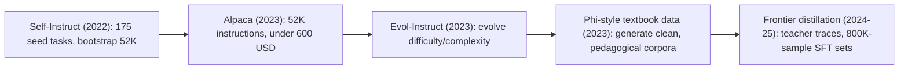
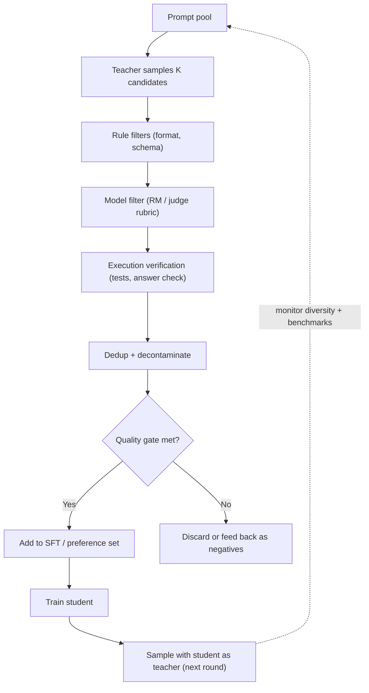

# Synthetic Data for Post-Training

## Overview

Synthetic data — training examples generated, rewritten, or filtered by models rather than written by humans — is the workhorse of modern post-training. SFT mixtures, preference pairs, and reasoning traces are now overwhelmingly machine-generated with human oversight applied at the *verification* layer instead of the writing layer. This page traces the generation lineage from Self-Instruct through Evol-Instruct to phi-style textbook data and frontier distillation, the verification loops that make it usable, the model-collapse evidence and counterevidence, and the licensing traps. The loops that feed on verified self-data are expanded in [Self-Improvement](./self-improvement.md); ingestion plumbing is in [Data Pipelines](./data-pipelines.md).

> **Interview Angle**: The question behind the question is "how do you keep quality and diversity when the model trains on its own outputs?" — which is the verification-loop design plus the model-collapse literature. Answers that only say "filter it well" miss the collapse-vs-accumulation debate.

## Why Post-Training Went Synthetic

Human-written SFT data costs writer-hours per example and saturates quickly: beyond ~100K examples, marginal human data is expensive, inconsistent, and hard to scale across domains and languages. Model generation inverts the economics — tokens are cheap, so the bottleneck moves to *selection*: generating 10-100 candidates and keeping the few that pass verification is cheaper and often higher-quality than writing one example by hand. Llama 3's post-training mixture and R1's reasoning SFT set are both majority machine-generated; the human effort concentrated in prompt design, rubric writing, and spot audits (see [Data Pipelines](./data-pipelines.md) for the operational loop).

Three properties make synthetic data attractive precisely where it is risky:

1. **Scale with control**: you can shape difficulty, domain, and format distribution by construction — Evol-Instruct literally parameterizes question complexity.
2. **Self-consistency**: model-generated reasoning that passes execution or answer checks is *internally* verifiable without experts.
3. **Feedback loop risk**: training on your own outputs recursively can narrow the distribution — the model-collapse debate.

## Generation Lineage

### Self-Instruct: Bootstrapping Instructions

Self-Instruct (Wang et al., 2022) showed a model can teach itself instruction-following: start from ~175 hand-written seed tasks, prompt the model to generate new (instruction, input, output) triples, classify them, and filter. Two filters carried the method: novelty (new instructions must differ from existing ones — ROUGE-L overlap threshold around 0.7 against the pool) and validity (the model itself judges whether the output really performs the instruction). The result: ~52K usable instructions from 175 seeds. Alpaca then ran this recipe on a stronger teacher for under $600 of API cost, demonstrating the economics that made synthetic SFT data the default.

### Evol-Instruct: Parameterizing Difficulty

WizardLM's Evol-Instruct (Xu et al., 2023) treats prompt generation as an evolutionary process over *complexity*. "Depth" evolutions rewrite an instruction to be harder along a named axis — add constraints, multi-step reasoning, concretization, causal reasoning; "width" evolutions mutate the scenario into a new domain; deliberately unhelpful evolutions act as an "elimination" class that the filter must reject. Evolving from seed instructions produced a distribution of questions much harder than the seeds — and WizardLM-7B showed this mattered: evolved data trained a 7B model that matched or beat models trained on far larger unstructured sets. The design lesson: *difficulty is a controllable axis*; RLVR pipelines now curate RL prompt sets the same way (see [GRPO & RLVR](./grpo-rlvr.md)).

### Phi-Style Textbook Data

The phi line (phi-1, phi-1.5, phi-3) pushed quality-per-token to the extreme: rather than generating *more* data, generate data that looks like a carefully written textbook — clean, self-contained, pedagogically ordered — then filter aggressively with model-based quality classifiers. Phi-1 (1.3B) trained on ~7B tokens of GPT-generated "textbook quality" code plus filtered web data and reached code benchmarks competitive with much larger models. Phi-3 scaled the idea: the reported achievement was a heavy filtering pipeline over a large corpus, not a novel architecture. The lesson interviewers probe: *the filter is the method* — model-as-judge classifiers running before training beat post-hoc fixes.

### Distillation from Frontier Models

Distillation-as-data: sample the strongest available teacher, train the student on its outputs. Orca (2023) added what makes traces teach: explanation traces, step-by-step system messages, and scaling from task instructions to detailed reasoning, showing explanation-rich supervision transfers more than answers. The R1 distills are the current canonical example: ~800K samples (600K reasoning + 200K general) sampled from DeepSeek-R1 trained Qwen/Llama bases (1.5B-70B) to reasoning levels their own RL could not reach at that scale — see [Post-Training Overview](./README.md). Logit-level distillation (matching teacher distributions) exists ([Knowledge Distillation](../../ml/advanced/distillation.md)), but for cross-architecture post-training, data-level distillation dominates because it only needs API access to the teacher.

## Verification Loops

Generation without verification produces confident noise. Production loops compose four filter classes:

| Filter class | Mechanism | Examples |
|---|---|---|
| Rule-based | Regex/schema/style checks, format validation | Reject malformed JSON, wrong language, template echo |
| Model-based | RM scores, LLM-judge rubrics, self-critique | Keep generations above RM threshold; judge-vs-generator must differ in family |
| Execution-based | Run the code; check the answer | Unit tests for code (with hidden tests), canonical answer match for math |
| Statistical | Dedup, decontamination, diversity metrics | MinHash dedup (see [Dataset Deduplication](../advanced/dataset-deduplication.md)), n-gram/embedding decontamination vs benchmarks |

Three design details separate working loops from broken ones:

1. **Judge independence.** If the filter judge is the same model family as the generator (or the same checkpoint), shared blind spots pass through the filter — the classic failure where "filtered" data is confidently wrong. Use a different family, or execution, for high-stakes verification.
2. **Rejection sampling as preference mining.** The same loop generates preference pairs for free: sample K, verify, chosen = correct, rejected = filtered-out — this is RFT ([Self-Improvement](./self-improvement.md)) and the bulk source of DPO pairs in open recipes.
3. **Diversity telemetry.** Track n-gram/embedding diversity and per-cluster coverage each round; diversity metrics are the earliest collapse warning.

## Model Collapse: Evidence and Counterevidence

**The collapse claim.** Shumailov et al. (2023; Nature 2024) showed theoretically and experimentally that training recursively on model-generated data — replacing rather than accumulating real data — makes the distribution progressively lose its tails: low-probability modes vanish, and after several generations the model reproduces a narrowed distribution, eventually confabulating. The intuition: each generation's sampling + retraining quantizes the distribution and discards rare-but-real structure. This matters for post-training because the attractive loop "generate → verify → train → generate" is exactly recursive unless you inject external data each round.

**The counterevidence.** Gerstgrasser et al. (2024) showed the collapse result is sensitive to one implementation choice: *accumulation*. When each generation adds synthetic data to the full existing corpus (real + all previous synthetic) instead of replacing it, they observed no collapse across generations — the fixed real-data anchor bounds the drift, and scale further dampens it. This matches practice: pipelines that mix fresh human/web data with synthetic rounds (the Llama 3 pattern) do not exhibit catastrophic narrowing, while purely self-consuming loops remain risky.

| Regime | Data policy | Outcome |
|---|---|---|
| Replace | Each round trains on synthetic only | Tails vanish; benchmark and diversity decay over generations |
| Accumulate | Each round adds synthetic to the full corpus | No collapse observed at practical scales; grows linearly in storage |
| Anchor + mix | Fresh real data + verified synthetic each round | Current best practice (Llama 3, Tülu 3 mixtures) |

Operational takeaway: collapse is a property of the *data management policy*, not an inevitability of using synthetic data. Monitor per-cluster coverage, vocabulary entropy, and held-out benchmark drift each round; alarm when diversity metrics decay while training loss improves.

## Licensing and Provenance Landmines

Synthetic data inherits legal exposure from its generator and its sources:

- **Terms of service.** Generating training data from a hosted model can violate its ToS — the ShareGPT-style scraping of ChatGPT conversations that trained several 2023 models was, at minimum, a gray zone; provider ToS commonly restrict "competing model" training outright. Distilling from a frontier API into a commercial product is a legal review question, not just an engineering one.
- **Output copyright.** In the US, purely AI-generated content has been held not to satisfy human-authorship requirements for copyright — so a synthetic dataset may be effectively unprotectable *and* unencumbered; the risk concentrates in the human-curated portions (prompts, edits, rubrics) and in any source text the generator was conditioned on.
- **Upstream contamination.** Model-generated data that paraphrases copyrighted or PII-bearing training text can launder those problems into your dataset; PII scrubbing and paraphrase-matching against known-sensitive corpora belong in the ingestion gate (see [Data Pipelines](./data-pipelines.md)).
- **License inheritance.** "Research-only" teachers (Llama-family license terms, OpenRAIL restrictions on downstream use) constrain what the student model and its data can be used for — a student distilled from a research-only checkpoint inherits usage restrictions in practice, whatever the letter of the license says.
- **Provenance tracking.** The Data Provenance Initiative audited thousands of open datasets and found widespread license/ToS mislabeling; the operational fix is boring: dataset cards per mixture with generator model, version, filters, and license checks, updated every round.

## Interview Questions

1. **Walk me through Evol-Instruct and why difficulty evolution mattered more than raw scale.**
Evol-Instruct starts from seed instructions and iteratively rewrites them along named axes: depth evolutions add constraints, reasoning steps, or concretization; width evolutions move the scenario to a new domain; deliberately broken evolutions train the filter to reject. The result is a difficulty distribution far above the seeds'. It mattered because instruction-following quality correlates with training-question difficulty coverage, not raw count — WizardLM-7B on evolved data matched much larger sets of unstructured data. The same principle survives in RLVR pipelines: curating the *difficulty distribution* of verifiable prompts (too easy = zero advantage, too hard = zero success, per DAPO's dynamic sampling) is a first-class design decision.

2. **Design a verification loop for synthetic math reasoning data. What filters, in what order?**
Order by cost: rule filters first (format, answer-tag presence, language) — near-free, kills most noise; then execution/answer checks — canonicalize the final answer and compare against ground truth, since math answers are cheap to verify exactly; then model-based review only for the surviving hard cases (step-quality rubric or PRM scoring — see [Process Reward Models](./process-reward-models.md)); then dedup and decontamination against benchmarks (n-gram + embedding). Two non-obvious points to state: use a judge from a different model family than the generator to avoid shared blind spots, and mine rejected-but-close candidates as the rejected side of preference pairs — the loop that filters SFT data is also your DPO pair generator.

3. **Is model collapse real, and what data policy avoids it?**
The replace-only regime is real: Shumailov et al. showed recursively training on model outputs alone progressively loses distribution tails — by construction, sampling and retraining discard rare modes each generation. But the counterevidence reframes it: Gerstgrasser et al. showed that *accumulating* (never deleting) real plus synthetic data eliminates collapse in their experiments, and practice agrees — pipelines anchored by fresh real data each round show no catastrophic narrowing. So collapse is a data-management failure mode, not a law of synthetic data. My checklist: never replace, always accumulate or anchor; monitor embedding-cluster coverage and vocabulary entropy per round; alarm on diversity decay with improving training loss.

4. **What are the legal failure modes of distilling from a frontier API into your product?**
Four. ToS breach — most provider terms restrict training competing models, and enforcement (key bans, contract action) is a business risk independent of copyright. Upstream laundering — outputs can paraphrase copyrighted or PII-bearing text from the teacher's training data, importing problems invisibly; PII scrubbing and sensitivity matching belong in ingestion. Uncertain IP on outputs — US practice treats purely machine-generated text as lacking human authorship, which cuts both ways for dataset rights. And license inheritance — distilling from checkpoints with research-only or use-restricted licenses practically constrains the student. The mitigation is unglamorous: provenance records per dataset (generator, version, ToS review), and legal sign-off before any commercial training run.

5. **Why does judge independence matter so much in synthetic pipelines?**
A judge shares its generator's blind spots: same pretraining data, same biases, same confident-wrong modes. Filtering with the same model family (or worse, the same checkpoint) creates a correlated error channel — bad outputs that *look* good to the generator look good to the judge, so your filter passes exactly the failures you needed to catch, at scale. This is the mechanism behind several "self-congratulation" incidents in self-labeled data. Practical rules: prefer execution over judges wherever a checker exists; when using a judge, pick a different family and audit agreement on a human-labeled slice; treat high judge-generator agreement as a warning sign, not a success metric.

6. **How did R1's distilled models change the synthetic-data conversation?**
They showed that for small models, SFT on a frontier model's reasoning traces beats running your own RL: R1-Distill models (Qwen/Llama bases, 1.5B-70B) trained on ~800K teacher samples reached reasoning levels that direct small-model RL at the same compute did not. The implication for synthetic data strategy is a decision rule: small-scale, generate-and-distill; frontier-scale, generate-and-RL (with SFT backstops, per the R1 pipeline). It also re-centered data quality over algorithm novelty — the 800K traces, verified and formatted, were the product; the training recipe was standard SFT.

## Key Takeaways

- Post-training data is now mostly model-generated with human effort shifted to verification: prompt pools, rubrics, audits — writing-by-hand lost the economics (Alpaca: 52K instructions for under $600).
- The lineage — Self-Instruct (self-bootstrap + novelty filters) → Evol-Instruct (parameterized difficulty) → phi-style textbook data (filter-is-the-method) → frontier distillation (Orca traces, R1's 800K) — is really four filter designs, not four data sources.
- Verification composes four classes in cost order: rules → execution → model-judge → statistical (dedup/decontamination); execution beats judges wherever a checker exists.
- Judge independence is structural, not stylistic: same-family judges share blind spots and pass correlated errors; audit judge-generator agreement on human-labeled slices.
- Model collapse is a *replace* regime artifact; accumulate-or-anchor policies (fresh real data + verified synthetic, per Llama 3/Tülu 3 practice) show no collapse at practical scales — monitor cluster coverage and entropy as early warnings.
- Synthetic data inherits legal exposure through the generator: ToS restrictions on competing-model training, upstream copyright/PII laundering, research-only license inheritance, and uncopyrightable outputs — provenance cards per mixture are the control.
- The R1 distills set the current decision rule: small budgets distill, frontier budgets run RLVR — but both run on the same verified-generation loop.

## References

- Wang et al., "Self-Instruct: Aligning Language Models with Self-Generated Instructions", ACL 2023 — https://arxiv.org/abs/2212.10560
- Xu et al., "WizardLM: Empowering Large Language Models to Follow Complex Instructions" (Evol-Instruct), 2023 — https://arxiv.org/abs/2304.12244
- Gunasekar et al., "Textbooks Are All You Need" (phi-1), 2023 — https://arxiv.org/abs/2306.11644
- Li et al., "Textbooks Are All You Need II: phi-1.5 technical report", 2023 — https://arxiv.org/abs/2309.05463
- Abdin et al., "Phi-3 Technical Report", 2024 — https://arxiv.org/abs/2404.14219
- Mukherjee et al., "Orca: Progressive Learning from Complex Explanation Traces of GPT-4", 2023 — https://arxiv.org/abs/2306.02707
- Shumailov et al., "The Curse of Recursion: Training on Generated Data Makes Models Forget" (model collapse; Nature 2024), 2023 — https://arxiv.org/abs/2305.17493
- Gerstgrasser et al., "Is Model Collapse Inevitable? Breaking the Curse of Recursion by Accumulating Real and Synthetic Data", 2024 — https://arxiv.org/abs/2404.01413
- DeepSeek-AI, "DeepSeek-R1: Incentivizing Reasoning Capability in LLMs via Reinforcement Learning" (distill recipe), 2025 — https://arxiv.org/abs/2501.12948
- Yuan et al., "Scaling Relationship on Learning Mathematical Reasoning with Large Language Models" (RFT), 2023 — https://arxiv.org/abs/2308.01825
- Llama Team, "The Llama 3 Herd of Models" (synthetic data in post-training mixtures), 2024 — https://arxiv.org/abs/2407.21783
- Longpre et al., "The Data Provenance Initiative", 2023 — https://arxiv.org/abs/2310.16787

## Cross-References

- [Self-Improvement](./self-improvement.md) — STaR/ReST/RFT: the recursive loops this data feeds
- [Data Pipelines](./data-pipelines.md) — annotation ops, quality gates, and ingestion plumbing
- [Dataset Deduplication](../advanced/dataset-deduplication.md) — MinHash/exact/semantic dedup mechanics
- [GRPO & RLVR](./grpo-rlvr.md) — difficulty-curation of verifiable prompt sets
- [Process Reward Models](./process-reward-models.md) — step-level verification of generated reasoning
- [Knowledge Distillation](../../ml/advanced/distillation.md) — logit-level distillation vs data-level distillation
- [Supervised Fine-Tuning (SFT)](../llm-serving/sft.md) — where the filtered data is consumed
