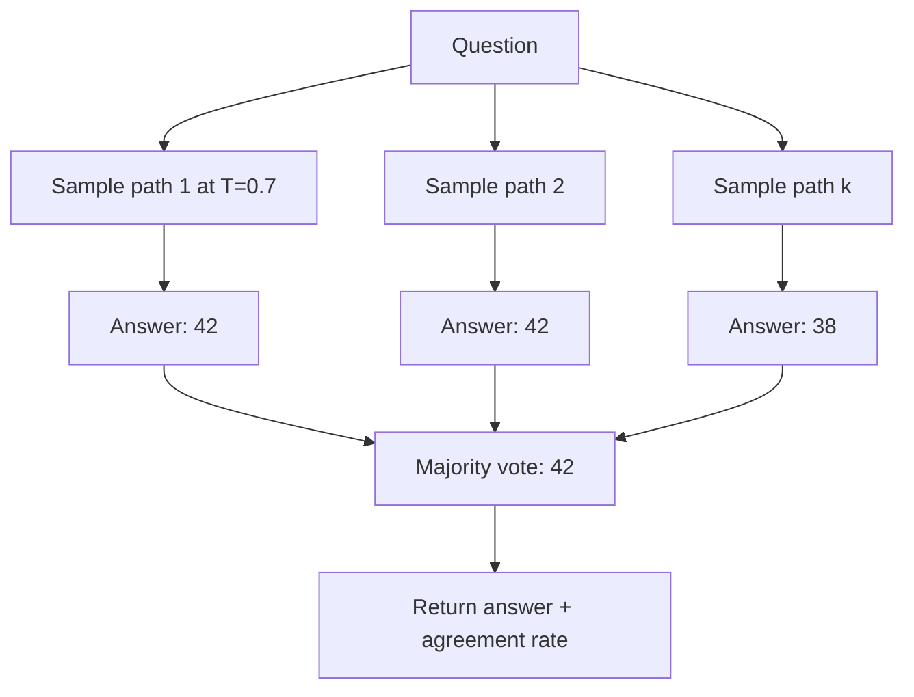
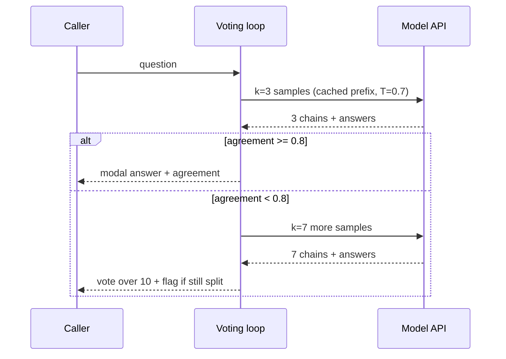

# Chain-of-Thought and Self-Consistency: Evidence and Cost Math

## Overview

Chain-of-Thought (CoT) prompting elicits intermediate reasoning steps before the final answer, and self-consistency upgrades it by sampling k independent reasoning paths and taking a majority vote over their answers. This page treats both as engineering artifacts: the verified accuracy evidence from the original papers, the token and latency arithmetic of sampling k paths, and the documented failure cases — small models, non-reasoning tasks, and reasoning models that already internalize the behavior. The conceptual mechanics are covered in [Chain-of-Thought Prompting](../../ml/agents/chain-of-thought.md); this page assumes them and spends its budget on numbers, selection rules, and cost control. Interviewers use this material in two modes: as a knowledge check ("what did the papers actually measure?") and as a design probe ("your voting loop costs k× — what do you do?"), and the page is organized to support both.

## The Evidence Base

The original CoT paper (Wei et al., 2022) tested few-shot CoT across arithmetic, commonsense, and symbolic reasoning benchmarks on three model families (GPT-3, LaMDA, PaLM). Two results matter for interviews. First, the headline: on GSM8K, PaLM 540B went from 17.9% accuracy with standard prompting to 56.9% with CoT — a 39-point jump from prompt wording alone. Second, the emergence threshold: CoT gains appear mainly above roughly 100B parameters; small models either plateau or produce incoherent chains that hurt performance, so CoT is not a portable free lunch across model sizes. Follow the paper's ablation logic rather than its headline: the gain comes from letting each step condition on prior steps, not from any magic in the phrasing.

Zero-shot CoT (Kojima et al., 2022) removed the need for worked examples by appending a single sentence — "Let's think step by step" — to the question, then a second pass extracts the answer after the reasoning. On GPT-3 (code-davinci-002 era models), it lifted MultiArith from 17.7% to 78.7% and GSM8K from 10.4% to 40.7% over zero-shot prompting with no examples at all. The practical implication survives today: reasoning elicitation is sometimes a one-line change, and it is the first thing to test before reaching for few-shot exemplar pools or search frameworks.

| Technique | Paper | Model | Benchmark | Before | After | Extra tokens per question |
|---|---|---|---|---|---|---|
| Few-shot CoT | Wei et al. 2201.11903 | PaLM 540B | GSM8K | 17.9% (standard) | 56.9% | ~100–300 output |
| Zero-shot CoT | Kojima et al. 2205.11916 | GPT-3 | MultiArith | 17.7% (zero-shot) | 78.7% | ~100–300 output |
| Zero-shot CoT | Kojima et al. 2205.11916 | GPT-3 | GSM8K | 10.4% (zero-shot) | 40.7% | ~100–300 output |
| Self-consistency | Wang et al. 2203.11171 | PaLM 540B | GSM8K | 56.5% (CoT) | 74.4% (k=40) | k× output tokens |

Note on reading papers: the self-consistency abstract reports an absolute +17.9% improvement over CoT on GSM8K (plus +11.0% SVAMP, +12.2% AQuA, +7.9% StrategyQA). Cross-paper comparisons of exact percentages are treacherous because prompt sets, extractors, and model checkpoints differ; the deltas and the shape of the curves are what transfer.

## Zero-Shot CoT: One Sentence, Two Passes

Zero-shot CoT is mechanically a two-prompt pattern. The first prompt appends the trigger phrase and elicits the reasoning trace; the second pass extracts the final answer from the trace (in the original paper, an explicit "so the answer is" continuation; in production, a schema-enforced extraction call). The trigger works because instruction-tuned models have learned step-by-step solution formats from pretraining data — the phrase *activates* a distribution over solution templates rather than teaching anything new.

```text
User:  A jar contains 4 red and 6 blue marbles. Two are drawn without
       replacement. What is the probability both are red?
       Let's think step by step.
Model: Step 1: P(first red) = 4/10 = 0.4.
       Step 2: After removing one red, P(second red) = 3/9 = 0.333.
       Step 3: Multiply independent draws: 0.4 x 0.333 = 0.1333.
       The probability both marbles are red is 2/15.
```

Three engineering notes. The phrase has many effective variants ("work through this carefully, step by step", "first list the knowns and unknowns") — Anthropic's docs treat reasoning instruction as a first-class technique with worked templates. The answer should be extracted by a second constrained call, not regex, so the extraction reliability inherits from structured output. And the trace should be treated as *untrusted internal text*: it can leak the extraction format, hedge in user-visible ways, or contain policy-adjacent content, so customer-facing flows strip it.

## Few-Shot CoT Templates

Few-shot CoT (the original technique) places complete worked examples — question *and* chain *and* answer — in the prompt so the model imitates the reasoning pattern, not just the answer format. The template shape that survives production:

```text
[system: You answer quantitative questions. Always reason before answering.]

Q: Roger has 5 tennis balls. He buys 2 cans of 3 balls each. How many balls?
A: He starts with 5. Each can has 3, so 2 cans = 6. 5 + 6 = 11. Answer: 11.

Q: <question>
A: (reason, then) Answer: <final>
```

The exemplars are doing three jobs at once: defining the reasoning style, defining the answer format, and implicitly defining the difficulty distribution. That triple duty is why exemplar *selection* (covered on the few-shot page) matters more than exemplar count — 3 examples that match the task's shape outperform 8 generic ones, while every extra example costs input tokens on every call.

## Self-Consistency: Sampling and Majority Vote

Self-consistency (Wang et al., 2022) replaces the single greedy chain with k chains sampled at nonzero temperature (typically 0.7–1.0), each ending in an extracted answer, and returns the modal answer. The insight is that one question has many valid reasoning routes; incorrect routes make *different* mistakes, while the correct answer is reachable by many routes, so it concentrates in the vote. The vote is an ensemble over reasoning paths, not over models — no retraining and no extra model calls beyond the k samples.



Three implementation details determine whether the vote works. Answer extraction must normalize variants ("42", "42 dogs", "the answer is 42" must collapse to one key) or the vote splits artificially. Agreement rate is free telemetry: when k paths agree, the vote is nearly pointless overhead; when they disagree heavily, the question is hard and the output deserves a flag, a retry, or a human. And sampling temperature must be high enough for path diversity but low enough that chains stay coherent — 0.5–1.0 is the working range, and k=5–10 captures most of the gain in practice, with the paper's k=40 curves showing clear diminishing returns.

### Answer Extraction and Normalization

The vote is only as good as the extractor, and extraction failures masquerade as reasoning failures. The production hierarchy, in order of preference:

| Strategy | Mechanism | Failure mode |
|---|---|---|
| Schema-enforced field | Ask for `{"reasoning": ..., "final_answer": ...}` under a JSON schema | None structural; content can still be wrong |
| Tool-call extraction | Force a `submit_answer(value: number)` tool call | Type mismatches if schema is loose |
| Delimiter + regex | Chain ends with `Answer: X`, parse X | Format drift, multi-line answers |
| Normalized string match | Lowercase, strip units, canonicalize number formats | Collapses genuinely different answers |

Whatever the mechanism, log the raw paths. When accuracy drops after a model upgrade, the first regression is usually the extractor, not the reasoning — chains change format silently and the vote keys split.

## The Latency and Cost Math of Sampling k Paths

Self-consistency multiplies output tokens — the expensive, serial part of inference — by k. Let a single CoT chain cost \\( I \\) input tokens and \\( O \\) output tokens. Then:

\\[
\text{cost}(k) \approx k \cdot (I \cdot p_{in} + O \cdot p_{out})
\\]

where \\( p_{in}, p_{out} \\) are per-token prices. Because \\( p_{out} \\) is typically 3–5x \\( p_{in} \\) and output tokens are generated serially, output dominates both bill and wall-clock latency. Concretely, assume a 2,000-token prompt (cacheable), a 400-token chain, and k = 10:

| Component | Single CoT | Self-consistency k=10 |
|---|---|---|
| Input tokens billed | 2,000 | 20,000 (shared prefix: mostly cache reads at ~0.1x) |
| Output tokens billed | 400 | 4,000 |
| Wall-clock latency (serial sampling) | ~4 s | ~40 s — never do this |
| Wall-clock latency (parallel, k=10) | ~4 s | ~4–8 s (rate-limit bound) |
| Cost at $3/M in, $15/M out | $0.012 | $0.072 |

Sweeping k makes the scaling shape explicit:
| Component | Single CoT | k=3 | k=10 | k=40 |
|---|---|---|---|---|
| Input tokens billed | 2,000 | 6,000 | 20,000 | 80,000 |
| Output tokens billed | 400 | 1,200 | 4,000 | 16,000 |
| Wall-clock latency (parallel) | ~4 s | ~4 s | ~4–8 s | ~10–15 s (rate-limit bound) |
| Cost at $3/M in, $15/M out | $0.012 | $0.020 | $0.072 | $0.264 |
| Effective multiplier | 1x | ~1.7x | ~6x | ~22x |

The table shows why the multiplier is never exactly k: shared input tokens are parallel-cheap and cacheable, while output tokens are the real multiplier. Reading it bottom-up gives the sizing rule — pick the row whose effective multiplier the feature's margin can absorb, then spend the surplus on the highest-value k. For most scoring and extraction products that lands at k=3–5 with escalation; the k=40 row is an eval-time or audit-time configuration, not an always-on one.

Two consequences follow. First, run the k samples concurrently — they are independent — so the latency penalty collapses to rate limits, not to k× serial decode; the cost penalty does not collapse, since you pay for every token. Second, adaptive k beats fixed k: vote with k=3, and only escalate to k=10–20 when the low-k agreement is low. This "early-exit self-consistency" cuts average cost by 2–4x while keeping almost all of the accuracy, and it turns the agreement rate you already computed into the escalation trigger.

The escalation policy is a small state machine worth getting right because it runs on every request. Two disambiguations apply to the state machine below. "Agree" means the extracted answers collide after normalization, not that the prose matches. And the escalation budget must be per-request, not global — a global cap turns a burst of hard questions into silent accuracy loss on exactly the traffic that needs the vote.



## Where the 2022 Evidence Generalizes Today

The 2022–2023 numbers are the citation of record, but the models changed. What has held up: reasoning-before-answer still helps on multi-step quantitative and symbolic tasks; the answer-extraction and normalization problems are identical; and the cost math is unchanged. What has shifted: the emergence threshold moved down as models got better at instruction following, so mid-size open models now benefit from CoT where 2022-era ones plateaued; chain quality itself became a training target (process-supervision and RLVR work trains the chain, not just the answer); and reasoning models made explicit elicitation redundant for the top of the market. The durable skill being tested in interviews is not "do you remember 56.9%" — it is whether you know which parts of the evidence are mechanistic (intermediate conditioning helps when steps are verifiable) versus which parts were calibration artifacts of one model generation.

## When CoT Hurts

CoT is a technique with a domain, and outside that domain it is a pure tax. The documented failure cases:

- **Small models.** Below roughly the 100B-parameter threshold observed by Wei et al., chains become incoherent and accuracy can *drop* below standard prompting. Scaling law work since then has blurred the threshold, but the rule stands: measure CoT against direct answering per model, per task.
- **Non-reasoning tasks.** Classification, extraction, formatting, and simple lookup gain nothing from visible reasoning; they gain latency, cost, and a new failure surface where the model talks itself out of a correct instinct (post-hoc rationalization can flip a correct one-token answer).
- **Reasoning models.** o1/R1-class models internalize long deliberation; their model cards explicitly warn that "think step by step" prompts and heavy few-shot scaffolding degrade performance. The OpenAI prompt-engineering guide separates chat-model advice from reasoning-model advice for exactly this reason.
- **Latency-bound products.** Even where CoT helps accuracy, a 2–5x output-token increase may violate the SLA. Mitigations exist (short-form CoT: "think in at most 3 sentences"; summarize-then-answer; CoT only on a classifier-detected hard subset).
- **Answer leakage to users.** The chain exposes the model's hedges and guesses; in customer-facing flows the reasoning trace must be stripped or kept in a hidden channel, and stripped traces still cost the tokens.

The selection rule: CoT is justified when the task decomposes into steps where intermediate computation reduces error (arithmetic, multi-hop lookup, constraint checking) *and* the final answer benefits from conditioning on that computation. Otherwise, direct answering with structured output is the better engineering choice.

## Reasoning Models Invert the Advice

The biggest behavior change since the 2022 papers: reasoning models (OpenAI o-series, DeepSeek R1, Claude extended-thinking models) generate long internal deliberation regardless of prompt phrasing. Their published guidance inverts several defaults. Explicit "think step by step" scaffolding is unnecessary at best and harmful at worst — it can truncate or distort the model's own deliberation. Dense few-shot exemplars can anchor the model to a shallow pattern instead of its native search. And a long visible chain is no longer the signal of quality: these models often perform better with *shorter* instructions, no examples, and a plain statement of the success condition.

The engineering consequence is a per-model prompt matrix, not one prompt. Where a chat-model prompt wants CoT triggers and exemplars, a reasoning-model prompt wants a precise task description, constraints, and a structured answer contract. This is why the OpenAI guide separates chat-model and reasoning-model advice, and why Anthropic documents extended thinking as its own feature with its own budget knobs (thinking-token budgets) rather than a prompting trick. Before adopting any elicitation technique on a new model, re-run the two-arm eval; the direction of the CoT delta changed sign between model generations once already.

## Diagnostics: Reading Failure Patterns

When a CoT deployment underperforms its eval, the failure pattern in the traces tells you which knob to turn:

| Symptom in traces | Likely cause | Fix |
|---|---|---|
| Correct reasoning, wrong extracted answer | Extractor/format drift | Schema-enforced extraction; fix normalizer |
| Chains confident but factually wrong early | Knowledge gap | Retrieval; bigger model; do not add k |
| Chains wander, never conclude | Task needs decomposition | Few-shot exemplars; planning; ToT |
| Paths agree on wrong answer | Correlated errors (shared bias) | Self-consistency exhausted — verify or retrieve |
| Chains truncate at budget | Output cap too low | Raise cap; or short-form CoT; or reasoning budget param |

The third row is the common escalation path from this page to the next one: chains that wander and self-contradict are the signature of a task whose intermediate states need *evaluation*, not just generation, which is the ToT regime. The fourth row is the humbler lesson: when k paths agree on the same wrong answer, the errors are correlated and no amount of additional sampling helps — the fix is outside the sampling loop (retrieval, a verifier, or a different model class).

## Short-Form CoT: Budgeted Reasoning

Between no-CoT and full-CoT sits short-form reasoning, which is the right default for latency-bound products: instruct the model to reason in a bounded number of sentences or enumerated steps, then answer. Typical shape: "Reason in at most three sentences, then give the answer as a single number." This retains most of the accuracy benefit for moderately multi-step tasks while cutting output tokens 3–5x versus verbose chains, and it composes with structured output — the bounded reasoning goes in one schema field, the answer in another.

Two variants extend the idea. Summarize-then-answer runs the full chain in a hidden turn, then a second call compresses the chain into the user-visible reply, decoupling reasoning length from presentation length. And difficulty routing sends only classifier-flagged hard inputs through CoT, keeping p50 latency at direct-answer cost while paying CoT's premium where it changes outcomes. Both are ordinary engineering around the same core mechanic; neither requires new model capabilities.

## Production Usage Patterns

Shipping CoT and self-consistency requires scaffolding beyond the prompt. The minimal production loop:

```python
def answer_with_self_consistency(question: str, k: int = 5, max_k: int = 15):
    """Adaptive-k majority vote with agreement-gated escalation."""
    paths = [sample_cot(question, temperature=0.7) for _ in range(k)]  # concurrent
    answers = [extract_answer(p) for p in paths]          # normalize variants
    top, votes = Counter(answers).most_common(1)[0]
    if votes / len(answers) >= 0.8 or len(paths) >= max_k:
        return top, votes / len(paths)                    # agree: stop early
    more = [sample_cot(question, temperature=0.7) for _ in range(k)]  # escalate
    return majority_vote(answers + [extract_answer(p) for p in more]), None
```

Pattern checklist: keep the k samples on one cached prompt prefix so the 20,000 billed input tokens are mostly cache reads; extract answers with a schema-enforced call (a `final_answer` field) instead of regex over prose; log agreement rate as a quality metric and alert on distribution shift; and budget-cap the whole loop (max_k, max seconds) so a pathological question cannot multiply your p95. For agent workflows, the same loop becomes a verification stage — see [LLM Agents in Production](../agents.md) for where it sits in the request path.

### Interaction with Prompt Caching and Batch APIs

Self-consistency is the friendliest workload for provider caching: all k samples share an identical prefix by construction. Put the system prompt, task description, and exemplars before the question, and each sample bills the shared prefix at cache-read prices (0.1x on Anthropic-style schedules) after the first write. The same holds for the escalation stage — appending extra samples reuses the same cached prefix. Batch/off-peak APIs (typically ~50% list price) compound further, since the k samples are embarrassingly parallel and rarely latency-critical in eval or back-fill jobs. The combined effect can bring a k=10 vote down to roughly 2–3x the price of a single uncached CoT call, which is what makes always-on self-consistency economically viable for high-stakes scoring paths.

### Vote Variants Worth Knowing

Plain majority vote is the baseline, but the vote signal can be sharpened. Weighted voting uses each path's average token log-probability (or its extracted answer's probability) as vote mass, which recovers some accuracy when paths disagree in confidence rather than uniformly. Voting over intermediate conclusions — running the vote at each reasoning checkpoint instead of only the final line — detects earlier whether the paths are even solving the same problem. And pairing the vote with a cheap verifier (unit-test the answer, re-check arithmetic) converts disagreement from a tie-breaker problem into a retry trigger. These variants matter most at small k, which is exactly where production operates after adaptive-k tuning.

## Self-Consistency vs Verification: Choosing the Amplifier

Majority vote is one of three ways to spend k× tokens; the others are verification and search. Verification (best-of-N with a verifier — a reward model, a unit test, a checker prompt) outperforms voting when a cheap oracle exists for *partial* or *final* answers, because it selects quality rather than assuming the mode is quality. Search (ToT, the subject of the next page) interleaves evaluation *inside* the reasoning, pruning bad states before they compound. The engineering decision tree: answers vote-able and no verifier → self-consistency; verifier available → best-of-N; intermediate states scoreable and errors compound → ToT. The three are not mutually exclusive: self-consistency over ToT leaves (voting across search outcomes) is a known combination when both signal sources are available.

A worked sizing comparison across all three amplifiers appears on the [ToT and GoT](./tot-and-got.md) page; the takeaway preview is that consensus is the cheapest amplifier, verification is the most reliable per unit cost when an oracle exists, and search is the most expensive per unit cost but the only one that can *recover* from an early wrong commitment rather than merely outvote it.

## Interview Questions

1. **What exactly does self-consistency add over plain CoT, and when is it worth k× cost?** Self-consistency samples k reasoning chains at nonzero temperature and returns the modal extracted answer, exploiting the fact that correct answers are reachable by many routes while errors are idiosyncratic. Wang et al. report +17.9% absolute over CoT on GSM8K with PaLM 540B, with diminishing returns beyond roughly 10–20 samples. It is worth the cost when the answer space is comparable (numbers, choices, short strings) and the failure mode of single-CoT is variance, not systematic bias. When errors are systematic — the model lacks the knowledge — voting amplifies the same wrong answer, and you need retrieval or a bigger model instead.
2. **How do you reason about the latency of k sampled paths?** Output tokens dominate because decoding is serial, so naive sequential sampling is k× the wall clock. But the paths are independent, so issue them concurrently: latency becomes roughly max over k streams plus vote time, bounded by rate limits rather than k× decode. The cost multiplier stays k× for output tokens, but input tokens can be cut ~10x on cache-hit pricing (Anthropic 0.1x reads) because all paths share the same prefix. In practice, adaptive-k with agreement-gated escalation gives most of the accuracy at a fraction of the average cost.
3. **When does CoT hurt, and how do you detect it in an eval harness?** CoT hurts on small models (incoherent chains below the ~100B emergence threshold seen by Wei et al.), on non-reasoning tasks (classification, extraction — pure token tax plus post-hoc rationalization), and on reasoning models that already deliberate internally, where "think step by step" measurably degrades output. Detection is a two-arm eval: the same golden set with direct-answer and CoT prompts, compared on accuracy *and* cost and p95 latency. If the CoT arm's accuracy delta is within noise while its cost is 3x, the harness should reject it — this is a one-day experiment, not a judgment call.
4. **Why did zero-shot CoT matter so much given that few-shot CoT already worked?** Kojima et al. showed that a single appended sentence — "Let's think step by step" — lifted GPT-3 from 17.7% to 78.7% on MultiArith and 10.4% to 40.7% on GSM8K with zero examples. That mattered because it demonstrated reasoning was elicitable rather than example-dependent: the capability existed in the pretrained model and needed activation, not teaching. Practically it meant no exemplar-pool maintenance, no token cost for demonstrations, and it pointed at the mechanism — conditional computation over intermediate steps — that later reasoning models internalized during training.
5. **How do you combine self-consistency with caching to keep the bill sane?** Structure the prompt so the static prefix (system prompt, task description, few-shot examples) comes first and only the question varies; then every one of the k samples reuses the cached prefix. On Anthropic-style pricing (cache write 1.25x once, cache read 0.1x), a k=10 loop over a 2,000-token shared prefix bills 9 of 10 input token blocks at 0.1x, cutting input cost ~8x versus no caching. The output tokens remain k× — that is the irreducible cost of voting — which is exactly why answer extraction and adaptive k matter more than micro-optimizing the prompt text.
6. **What is the relationship between self-consistency and best-of-N with a verifier?** Both spend k× tokens to pick one output, but they use different signals. Self-consistency uses the *model's own consensus* — no extra component, works where answers are comparable, fails when errors are correlated. Best-of-N uses an *external verifier* (unit tests, reward models, checker prompts) that scores candidates independently of their frequency; it wins when a cheap reliable oracle exists, because a high-quality minority path can beat a popular wrong one. The general engineering answer: consensus measures agreement, verification measures correctness, and when both signals exist, combining them (vote among verifier-approved candidates) dominates either alone.

## Key Takeaways

- CoT's original evidence: PaLM 540B on GSM8K went 17.9% → 56.9% with few-shot CoT; gains emerge mainly above ~100B parameters.
- Zero-shot CoT is one sentence — "Let's think step by step" — and moved GPT-3 from 17.7% → 78.7% on MultiArith with no examples.
- Self-consistency samples k paths and majority-votes extracted answers: +17.9% absolute over CoT on GSM8K (Wang et al.), diminishing returns past ~10–20 paths.
- Cost math: k× output tokens (irreducible), k× input tokens (largely cacheable at ~0.1x), latency ≈ parallel-bounded by rate limits, not k× serial decode.
- Adaptive k with agreement-gated escalation cuts average cost 2–4x; agreement rate is free per-question quality telemetry.
- CoT hurts on small models, non-reasoning tasks, and reasoning models — run a two-arm eval before adopting, not after.
- Answer extraction is part of the system: use a schema-enforced `final_answer` field, normalize variants, and log agreement distributions.
- Consensus (voting), verification (best-of-N with an oracle), and search (ToT) are different amplifiers; choose by which signal your task provides.

## References

- Wei et al., "Chain-of-Thought Prompting Elicits Reasoning in Large Language Models", NeurIPS 2022 — https://arxiv.org/abs/2201.11903
- Kojima et al., "Large Language Models are Zero-Shot Reasoners", NeurIPS 2022 — https://arxiv.org/abs/2205.11916
- Wang et al., "Self-Consistency Improves Chain of Thought Reasoning in Language Models", ICLR 2023 — https://arxiv.org/abs/2203.11171
- Yao et al., "ReAct: Synergizing Reasoning and Acting in Language Models", ICLR 2023 — https://arxiv.org/abs/2210.03629
- OpenAI prompt engineering guide (reasoning-model section) — https://platform.openai.com/docs/guides/prompt-engineering
- Anthropic prompt engineering overview (chain-of-thought chapter) — https://docs.claude.com/en/docs/build-with-claude/prompt-engineering/overview
- Prompt Engineering Guide paper index — https://www.promptingguide.ai/papers
- Lilian Weng, "Prompt Engineering" (survey) — https://lilianweng.github.io/posts/2023-03-15-prompt-engineering/

## Cross-References

- [Chain-of-Thought Prompting](../../ml/agents/chain-of-thought.md) — the conceptual mechanics: decomposition, scratchpad, error localization
- [ToT and GoT](./tot-and-got.md) — the next rung: search and evaluation over thought states
- [Prompt Caching](./prompt-caching.md) — how to structure the shared prefix so k samples bill 0.1x input
- [Prompt Engineering for Production Systems](../prompt-engineering.md) — budget allocation and token management around the prompt
- [DeepSeek](../sota/deepseek.md) — reasoning-model prompting behavior that inverts CoT advice
- [LLM Evaluation](../llm-serving/evaluation.md) — building the two-arm harness that gates CoT adoption
