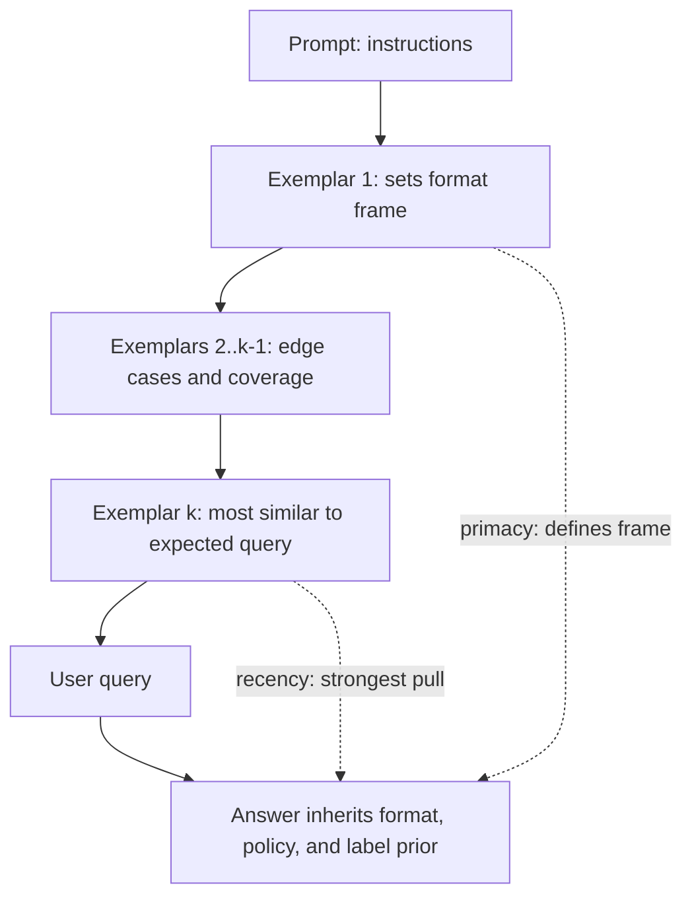
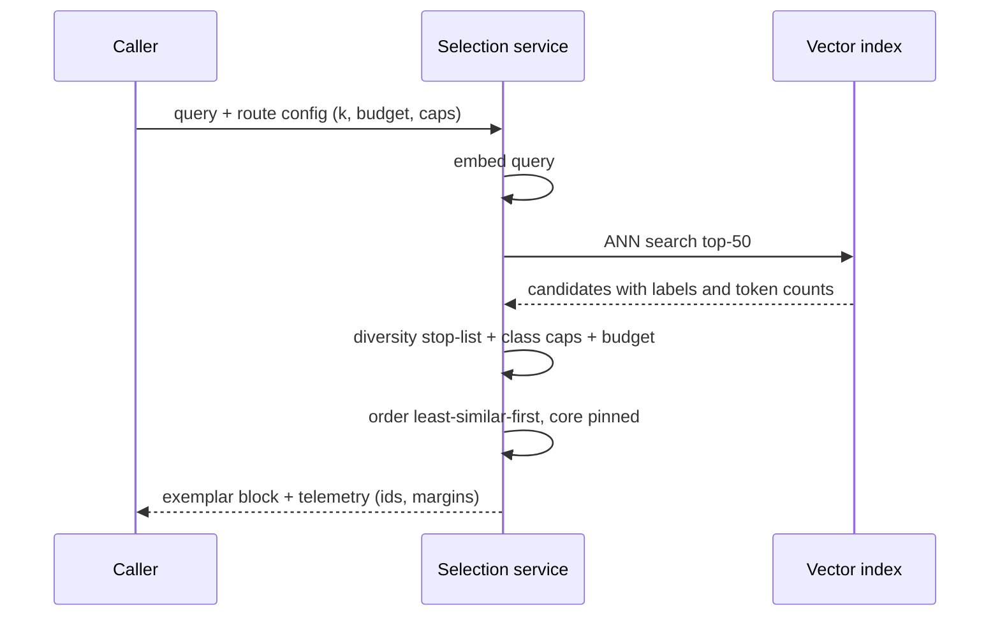

# Few-Shot Example Selection: Ordering, Retrieval, and Budget

## Overview

Few-shot prompting — placing k input/output demonstrations in the context so the model completes the pattern — is the cheapest reliability tool in the catalogue, but its performance is startlingly sensitive to *which* examples you pick, in *what order*, at *what position* relative to the query. The same demonstration set can swing accuracy by double-digit margins across orderings on GPT-3-class models (Lu et al.), and a similarity-retrieved set usually beats a hand-pinned one on long-tail inputs. Selection therefore behaves like a retrieval problem: embed the query, choose examples under a token budget, balance labels, order them deliberately, and version the whole mechanism like any other prompt change. This page covers what demonstrations actually do for the model, the ordering and position effects (recency bias, majority-label bias, Lost-in-the-Middle), KNN-retrieved exemplars, diversity and label balance, the fixed-versus-dynamic trade (which is secretly a caching trade), and a concrete selection algorithm that fits production constraints. The interview angle: example selection is where in-context learning ([CoT and Self-Consistency](./cot-and-self-consistency.md)) meets retrieval systems and prompt economics.

## What Demonstrations Actually Do

The original few-shot result (Brown et al., 2020: GPT-3 conditions on up to a few hundred demonstrations and learns the task in context, no gradient updates) is best understood as *pattern completion over the demonstrations*. A demonstration defines four things simultaneously, and knowing which one you need determines how many you pick and how carefully you select them. First, the **output format** — the grammar of the answer (JSON shape, citation style, severity scale) is copied from the demonstrations with near-mechanical fidelity, which is why 3–5 examples fix most format drift. Second, the **edge-case policy** — how ambiguous inputs, missing fields, or out-of-scope requests are handled is learned from the examples that demonstrate those cases, so coverage of edge cases matters more than average-case quality. Third, the **label space and tone** — the set of acceptable outputs and the register the model adopts. Fourth, the **input→output mapping** for idiosyncratic conventions (your internal ticket taxonomy, your abbreviation style) that no instruction fully specifies.

| Want the model to... | Use instructions | Use demonstrations |
|---|---|---|
| Follow a stable, nameable rule | Yes — one clear sentence | Only if the rule is hard to verbalize |
| Match an internal taxonomy or house style | Partly — name the categories | Yes — one exemplar per category |
| Handle a specific edge case correctly | Unreliable — describe it and hope | Yes — show the edge case verbatim |
| Emit a strict output grammar | Unreliable — prose is not a grammar | Yes, or better: schema enforcement ([Structured Output Patterns](./structured-output-patterns.md)) |

The cost side scales linearly: each demonstration is a purchase repeated on every call, which is why example count is a budget line rather than a style choice. Against that cost, the returns scale sublinearly at small k and keep climbing slowly at large k — the many-shot regime (Agarwal et al., 2024) shows quality improving log-linearly into the hundreds of examples, sometimes rivaling fine-tuning, but only when the token budget is enormous. In between sits the practical rule: instructions are cheap tokens but coarse instruments, demonstrations are expensive tokens but precise ones, and the two substitute for each other imperfectly — a demonstration of the exact edge case beats a paragraph of instruction about it, while a crisp instruction beats three redundant examples of the happy path.

### The Position Layout of a Few-Shot Block

Where each element sits in the prompt is as consequential as which examples were chosen, and the layout interacts with caching. The canonical layout, annotated with the reason for each position:

| Position | Content | Why there | Cache implication |
|---|---|---|---|
| 1 (first) | Instruction block | Sets the frame; nothing precedes it to compete | Static — cacheable prefix |
| 2 | Core exemplars (format anchors) | Primacy position for the policy anchor | Static — cacheable prefix |
| 3 | Mid-block exemplars (edge cases, coverage) | Middle is the weakest attention zone | Static — cacheable prefix |
| 4 | Retrieved top-ups (most similar to query) | Recency position: strongest pull | Dynamic — place where misses are free |
| 5 | User query | Last: the answer continues the pattern | Per-request |

Two consequences follow from this table. First, the dynamic exemplars must sit *between* the static core and the query — placing retrieved examples before the core block means the cache misses at position 3 instead of position 4, invalidating the core's read discount for no benefit. Second, the layout is why the recency finding and the caching finding agree rather than conflict: the most valuable dynamic real estate (immediately before the query) is precisely where a cache miss costs nothing, because nothing static follows it.

## Ordering Effects: Primacy, Recency, and Permutation Variance

Lu et al. ("Fantastically Ordered Prompts and Where to Find Them", ACL 2022) quantified what practitioners see in evals: across random permutations of the *same* demonstration set, model accuracy swings enormously — variance across orderings is sometimes comparable to the entire gap between zero-shot and few-shot performance. Two mechanisms drive it. **Recency bias**: the demonstrations nearest the query dominate the output distribution, so the model's answer drifts toward the label or pattern of the last few examples. **Ambiguity inherent to the task**: when the model is genuinely uncertain, the demonstrations tip it — which is why ordering effects are largest exactly where accuracy is weakest. The paper's mitigations are validation-driven: probe orderings against a held-out set (GlobalE ranks orderings by their validation accuracy; LocalE scores each individual example by how it performs when placed near the query), then pin the winner like any other prompt artifact.

Zhao et al. ("Calibrate Before Use", ICML 2021) decomposed the bias further with three effects every few-shot prompt inherits. **Majority-label bias**: an unbalanced demonstration set (4 of 5 examples class A) systematically raises the model's prior on class A — label balance is not cosmetic, it is a debiasing measure. **Recency bias**: again, later examples dominate. **Common-token bias**: single-token answers drift toward high-prior tokens regardless of input. Their fix, *contextual calibration*, is elegant: run the prompt with a contentless input ("N/A"), observe the skew in the output distribution, and divide the model's output probabilities by that skew. Application-side, the cheaper equivalent is to balance labels and place the most representative example last.

### A Worked Bias Example

The failure is concrete enough to simulate mentally. A refund-classification route ships five demonstrations; four are refund cases (the interesting ones, an engineer reasons) and one is a denial. Live traffic arrives 60/40 refund/deny, and the model starts approving refunds at 85% — including cases the policy denies — because the demonstrations set a 4:1 refund prior that overwhelms the instruction saying "deny if out of warranty." Aggregate accuracy drops a few points and the drift is invisible in averages; the per-class confusion matrix shows deny→refund errors spiking immediately. The fix takes two minutes — a 3/3 balanced set with the denial cases placed last (recency position) — and is the single highest-leverage demonstration edit this route ever needed. Every unbalanced few-shot prompt in production carries this same exposure; the only question is whether the task's metric is sensitive enough to reveal it.

Position in the context window compounds all of this on long prompts: Lost in the Middle (Liu et al., TACL 2024) shows models attend most to the beginning and end of long contexts and underweight the middle. For few-shot layout the consequence is concrete — the highest-value positions are the first demonstration (sets the frame) and the last one or two before the query (recency advantage), while a 20-example block buried mid-prompt is partly wasted tokens. The layout rule that survives all three papers: *the exemplar most similar to the expected query should sit closest to the query*, and the set should be label-balanced so neither bias has fuel.



## Similarity-Based Selection: KNN Exemplars

The fixed example pool was written against last quarter's input distribution; the live traffic drifts. KNN-augmented example selection (KATE — Liu et al., "What Makes Good In-Context Examples for GPT-3?") replaces the pool with a retrieval: embed the incoming query, take the k nearest labeled examples from a curated pool, and place them in the prompt. Across GPT-3 classification tasks the paper reports consistent improvements over random selection, with the largest gains under distribution shift — exactly the case where the fixed pool is stale. The mechanism is the same as RAG's, pointed at the exemplar store instead of the document store, which means every retrieval-engineering practice transfers: embedding model choice ([Embeddings](../llm-serving/embeddings.md)), ANN index operations ([FAISS](../advanced/faiss.md)), and re-ranking before truncation ([Rerankers](../retrieval-advanced/rerankers-deep.md)).

Similarity selection has three characteristic failure modes, all of which have cheap mitigations. **Near-duplicate collapse**: the k nearest neighbors of a common query are near-copies of each other, so the prompt carries redundant information and correlated blind spots — fix with a diversity constraint (below). **Majority-class gravity**: the pool's class distribution is what kNN returns, so a skewed pool yields skewed demonstrations — fix with per-class retrieval quotas. **Embedding-task mismatch**: a general-purpose embedding space may rank examples similar in surface form but different in the label-relevant feature — fix by embedding with a task-adapted model or hybrid lexical+vector scoring. The cost side is small and quantifiable: an embedding call plus an ANN lookup adds single-digit milliseconds at typical pool sizes, against hundreds of tokens of input cost per unnecessary demonstration avoided.

### The Retrieval Stack, End to End

The online path and the offline pool preparation are separate artifacts with separate versioning, which is the property teams miss first:



Offline, the pool pipeline is: curate and label examples → embed with the *versioned* embedding model → write vectors, labels, and token counts to the index → snapshot the pool version. The versioning matters because a selection that silently mixes examples embedded under two different embedding-model versions is comparing vectors across incompatible spaces — the same rule that governs any production vector store ([Vector Databases](../llm-serving/vector-databases.md)). Every change to the pool or its embedding model is a release: snapshot, evaluate the selection against the golden set, then promote.

## Diversity, Label Balance, and Uncertainty-Based Selection

Similarity alone maximizes relevance; production selection needs *coverage* under a token budget. The standard toolbox, in increasing sophistication: **label quotas** — retrieve per class in round-robin so the final set is balanced (this simultaneously attacks majority-label bias); **clustering medoids** — cluster the pool offline and keep one representative per cluster so the demonstrations span the input manifold; **determinantal point processes (DPP)** or greedy facility-location — select sets that are jointly dissimilar rather than individually similar, trading a little relevance for substantially better coverage; **hard-case curation** — keep a reserve pool of examples that previously caused failures, and promote one into the set when the query resembles them.

Active Prompting (Diao et al., 2023) inverts the selection direction: before labeling anything, sample the model k times per unlabeled question (self-consistency-style), measure the *disagreement* of the sampled answers, and send the highest-uncertainty questions to human annotators. The labeled hard cases become the demonstration pool, which the paper shows beats uncertainty-agnostic selection on CoT benchmarks — the demonstrations end up covering exactly the region where the model is least reliable. The connection to the rest of this page: Active Prompting is selection for the *pool*, KATE is selection from the *pool*, and a complete system does both — uncertainty-based acquisition offline, similarity-and-balance retrieval online.

The coverage-versus-cost trade resolves into a simple rule with real numbers behind it. Moving from 3 to 8 balanced, diverse demonstrations typically costs 5× the tokens of a 3-shot prompt for a modest, task-dependent accuracy gain — worth it on high-value routes, not on bulk classification where format compliance is the only requirement and 3 examples already deliver it. The decision variable is not "how many examples" but "what is the marginal accuracy per thousand tokens of demonstration," and it is measurable per route with a golden set.

Diversity itself is measurable, and the two cheap diagnostics catch most collapsed sets before users do:

| Diagnostic | How to compute | Healthy signal |
|---|---|---|
| Pairwise cosine of the selected block | Mean and max similarity among chosen exemplars | Max below the stop-list threshold; mean well under it |
| Label entropy | Shannon entropy of the label distribution of selections | Near the max for balanced tasks |
| Pool coverage | Share of production queries whose top-1 exemplar similarity exceeds a floor | High and stable — a falling value is traffic drift |
| Embedding spread | Mean pairwise distance of selected exemplar embeddings vs pool average | Selected set spreads at least as wide as the pool |

### Worked Budget: Sizing the Exemplar Block

Concrete numbers make the trade auditable. Take a classification route at 500,000 requests per month, $3/M base input price, demonstrations averaging 180 tokens each, and an 8,000-token static prefix that caches at 0.1x reads:

| Configuration | Exemplar tokens/request | Uncached exemplar cost/month | Notes |
|---|---|---|---|
| 3-shot fixed | 540 | $810 (full price if uncacheable) | Baseline quality; cheapest |
| 3-shot fixed, cached prefix | 540 | ~$81 (0.1x reads) | Caching is the free first win |
| 8-shot fixed | 1,440 | $2,160 → ~$216 cached | Pay only if golden set justifies it |
| 3-shot fixed + 3 dynamic | 540 + 540 | ~$81 cached + $810 full price | Dynamic block never caches |
| Many-shot (100 examples) | 18,000 | $27,000 — cache-eligible if static | Only for high-value routes |

The table's lesson is the interaction column: the *same* exemplar block costs 10x more when it sits outside the cacheable prefix, which is why the fixed/dynamic decision (next section) is not a stylistic preference. A 6-demonstration hybrid costs $891/month here — more than 6-shot fully cached ($162) and less than 8-shot uncached ($2,160) — so the right answer depends on cacheability first and accuracy second. Any team that cannot state which row of this table its route is in is guessing at its own bill.

## Fixed vs. Dynamic Exemplars: A Caching Decision

The choice between a pinned example set and per-query retrieval is often framed as a quality question, but on API providers it is equally an economics question, because of exact-prefix prompt caching ([Prompt Caching](./prompt-caching.md)). A fixed exemplar block lives inside the static prefix, hits the cache, and bills at a fraction of base price on every request after the first. Dynamic exemplars change per query, which forces them into the variable tail or destroys the cache for everything downstream of them — on cache-heavy routes the dynamic set can cost an order of magnitude more *before* accounting for any quality difference.

| Property | Fixed exemplar pool | Dynamic (KNN-retrieved) |
|---|---|---|
| Task accuracy on long-tail inputs | Degrades as traffic drifts | Better — adapts per query |
| Prompt-cache interaction | Static prefix segment; cache hits at read discount | Prefix churn; cache breaks unless placed last |
| Latency | None beyond the call | Embedding + ANN lookup, single-digit ms |
| Evaluation and versioning | Simple — prompt diff is the artifact | Two artifacts — pool version + retrieval config |
| Failure mode | Stale distribution, silent drift | Retrieval outage, embedding-model coupling |
| Best fit | Stable domains, cache-heavy, bulk routes | Long-tail traffic, high-value routes, drifting domains |

The hybrid that most production systems land on: a **fixed core set** (3–5 canonical demonstrations covering format and the top edge cases) in the cacheable prefix, plus **dynamic top-ups** (2–3 KNN-retrieved examples) appended immediately before the query, where their cache miss costs nothing. This gets the tail adaptation of retrieval without paying cache-invalidation on the bulk of the prompt, and it matches the static-prefix ordering discipline from the caching page: the dynamic block sits at the position where variability is free.

## A Selection Algorithm That Ships

The following is the online selection loop in near-final form: budgeted, label-balanced, diversity-aware, and ordered for the recency advantage. It assumes a curated pool where each example carries its label, a token count, and a precomputed embedding; it produces the exemplar block plus the order.

```python
def select_examples(query, pool, k=8, token_budget=1200,
                    per_class_cap=3, core_ids=()):
    q_emb = embed(query)
    # 1) similarity pass: rank pool by embedding cosine to the query
    candidates = sorted(pool, key=lambda e: -cosine(q_emb, e.emb))
    # 2) always include the pinned core exemplars (format + policy anchors)
    chosen = [e for e in pool if e.id in core_ids]
    used = sum(e.tokens for e in chosen)
    class_count = Counter(e.label for e in chosen)
    # 3) greedy fill: relevant first, skip if budget/class cap is full,
    #    skip if too similar to an already-chosen example (diversity)
    for e in candidates:
        if len(chosen) >= k or used + e.tokens > token_budget:
            continue
        if class_count[e.label] >= per_class_cap:
            continue
        if any(cosine(e.emb, c.emb) > 0.92 for c in chosen):
            continue
        chosen.append(e)
        used += e.tokens
        class_count[e.label] += 1
    # 4) order: least similar first, most similar last (recency advantage);
    #    core exemplars always first to anchor format
    rest = [e for e in chosen if e.id not in core_ids]
    rest.sort(key=lambda e: cosine(q_emb, e.emb))
    return core_examples_first(chosen, core_ids) + rest, used
```

Four properties make this production-grade rather than a toy. The **token budget** is checked against the real tokenizer, not a character heuristic, because demonstrations are repeated on every call and an over-budget block silently pushes out the retrieved context. The **per-class cap** keeps one frequent class from filling the window — the algorithmic version of majority-label debiasing. The **0.92 cosine stop-list** is the diversity control; the threshold is tuned once per task so that distinct edge cases survive while paraphrases of the same case do not. And the **most-similar-last ordering** operationalizes the recency finding: the example that best matches the incoming query is the one the model reads last, where its pull is strongest. The `core_ids` mechanism is the hybrid pattern from the previous section — the pinned core rides in the cacheable prefix, and only the retrieved remainder sits in the variable tail.

## Measurement and Drift

Example selection is a prompt change and inherits the full evaluation discipline: a golden set of 50–200 labeled real inputs, an ablation ladder (zero-shot → fixed pool → fixed+dynamic), and a statistical gate before any rollout. Three measurements are specific to this technique. **Permutation variance**: shuffle the demonstration order 20–50 times over the golden set and report the accuracy spread — a wide spread means the selection is fragile and ordering should be pinned or re-probed. **Per-class error rates**: majority-label bias shows up as asymmetric errors before it shows up in aggregate accuracy, so the per-class confusion matrix is the early-warning system. **Coverage telemetry**: log, per production request, how many of the selected demonstrations were core versus retrieved and the similarity margin of the last retrieved example — a falling margin means live traffic is drifting away from the pool, which is the signal to re-acquire examples (back to the Active-Prompting loop) rather than to tune the prompt wording.

The metrics worth a dashboard, with their failure signatures:

| Metric | Definition | What its degradation means |
|---|---|---|
| Ablation delta | Golden-set accuracy of selected set minus zero-shot | Selection stopped earning its tokens |
| Permutation spread | Accuracy range across 20–50 orderings | Fragile selection; pin order or re-probe |
| Class skew of selections | Label distribution of chosen exemplars in production | Pool drift or broken caps; expect majority-label bias |
| Similarity margin | Similarity of last retrieved exemplar minus k+1th | Falling margin = traffic drifting from pool |
| Core/dynamic ratio | Share of block that is pinned vs retrieved | Rising too high = retrieval silently failing |
| Block token usage | Actual exemplar tokens vs configured budget | Budget overrun crowds out retrieved context |

The failure gallery below maps the common production symptoms to their root causes; most are selection-policy bugs rather than model problems, which is why they reproduce deterministically once identified:

| Symptom | Root cause | Fix |
|---|---|---|
| Model answers in the wrong format occasionally | Core anchor missing or demoted from first position | Pin core exemplars first, always |
| One class over-predicted | Unbalanced pool or broken per-class cap | Enforce quotas; monitor class skew |
| Long-tail queries regress after traffic shift | Fixed pool stale | Add dynamic top-ups; re-acquire hard cases |
| Near-identical examples in most prompts | No diversity stop-list | Cosine stop-list or cluster medoids |
| Cache hit rate collapsed after enabling kNN | Dynamic examples placed before static blocks | Move retrieved block immediately before query |
| Selection latency spike | Pool re-embedded without index rebuild | Version pool + index; rebuild on embedding change |

## Anti-Patterns

- **Example hoarding**: pasting 20 demonstrations because "more is better," which multiplies input cost, pushes retrieved context out of the window, and buries the highest-value examples in the weakest attention zone.
- **Unbalanced label sets**: 4:1 or 9:1 class skews in the demonstrations — the majority-label bias is installed deliberately and then discovered in the confusion matrix weeks later.
- **Arbitrary ordering**: examples pasted in the order they were written rather than anchored-first, most-similar-last; the same set re-scored across orderings would show the fragility immediately.
- **kNN without diversity control**: nearest-neighbor retrieval alone returns near-duplicate exemplars for common queries, spending the whole block on one input region.
- **Dynamic examples in the middle of the prompt**: retrieved exemplars inserted before static blocks break exact-prefix caching for everything after them — place them immediately before the query where misses are free.
- **Selection changes without evals**: editing the pool, the embedding model, or the ordering without a golden-set ablation — example selection is a prompt change and drifts like one.

## Selection and Reasoning Models

The defaults above were calibrated on chat-class models, and reasoning models (o1/R1-class) invert part of them: several vendor guides now report that elaborate few-shot scaffolding can *degrade* reasoning-model performance, because the model internalizes chain-of-thought and long demonstration blocks mostly add input tokens and pattern interference. The practical adjustment is small but real — start reasoning-model routes at zero-shot with a precise instruction, add demonstrations only when a measured format or edge-case gap exists, and re-run the ablation ladder rather than porting the chat model's exemplar config. The selection machinery (balance, diversity, ordering) stays identical; what changes is the prior that a demonstration block is automatically worth its tokens. Check the model-specific guidance before layering any few-shot block on a reasoning model, and record the ablation in the route's eval notes so the next engineer does not re-add the block reflexively.

One closing connection rounds out the technique's place in the stack: example selection is the prompting-layer twin of data curation in training. The pool is a dataset, the selection policy is sampling, the biases (majority label, recency) are the same distribution-shift pathologies that plague training sets, and the fixes (balance, coverage, hard-case acquisition) are the same ones — [Synthetic Data](../post-training/synthetic-data.md) covers the training-side versions. Engineers who internalize that mapping stop treating demonstrations as prose decoration and start treating them as what they are: a tiny, untrained, repeatedly-applied model of the task, curated with the same discipline as any dataset.

## Interview Questions

1. **Why does few-shot example order matter, and how do you choose an order?** The demonstrations are not a symmetric set: models weight recent context more heavily (recency bias) and inherit the label prior of the set (majority-label bias), so permutations of identical examples produce materially different accuracy — Lu et al. measured swings across orderings comparable to the zero-shot→few-shot gap itself. The operational answer: balance labels, place the exemplar most similar to the expected query last (recency advantage), anchor format with a canonical first example, and validate the ordering against a held-out set — GlobalE-style order probing — before pinning it. On long prompts, also respect Lost-in-the-Middle: start and end positions dominate, so burying high-value examples mid-block wastes them.
2. **When would you retrieve few-shot examples with kNN instead of pinning a fixed set, and what does it cost?** Retrieve when traffic is long-tail or drifting: KNN-style selection adapts the demonstrations to each query and measurably beats random or fixed pools under distribution shift. The costs are engineering (pool curation, embedding model, ANN index — same machinery as RAG) and economics: dynamic exemplars change the prompt per request, so they break exact-prefix caching for anything after them. The standard hybrid resolves this — a fixed core set in the cacheable prefix, 2–3 retrieved top-ups appended right before the query where a cache miss is free.
3. **How do you prevent a few-shot prompt from biasing the model toward one class?** Majority-label bias is a property of the demonstration distribution, so the fix is at selection time: enforce per-class quotas in the selection algorithm (round-robin retrieval per label), verify the final set is balanced, and keep the most representative example last rather than flooding the tail with one class. Zhao et al.'s contextual calibration is the deeper fix — probe the model with a contentless input to measure the induced prior and correct the output distribution — but for application teams, balanced selection plus per-class error monitoring catches the bias where it actually appears: asymmetric confusion-matrix errors.
4. **What makes a demonstration pool good before any selection happens?** Three things. Coverage: the pool should contain the edge cases (ambiguous input, missing fields, out-of-scope) that previously caused failures — Active Prompting's uncertainty-based acquisition (annotate questions where k self-consistency samples disagree) targets exactly this. Diversity: the pool should span the input manifold (cluster medoids, DPP-style selection) so retrieved sets don't collapse into near-duplicates. Label integrity: verified labels with a review process, because a demonstration teaches a wrong pattern as strongly as a right one — the pool is training data by another mechanism and should be treated with the same hygiene.
5. **Walk through your selection algorithm for a budgeted, balanced few-shot block.** Rank the pool by embedding cosine to the query; pin the core exemplars that define format; greedily fill remaining slots skipping examples that bust the token budget, exceed a per-class cap, or sit above a cosine threshold against anything already chosen (0.92 works as a start); finally order least-similar-first with most-similar-last so the recency advantage lands on the best-matching example. Every one of those constants is tunable per route, and all of it is evaluated with the same golden-set ablation ladder as a prompt rewrite — zero-shot vs fixed vs fixed+dynamic.
6. **How does many-shot prompting change this whole picture?** Agarwal et al. (2024) showed quality scaling log-linearly with hundreds of in-context examples — no reversed-curve artifacts, sometimes rivaling fine-tuning — which pushes the ceiling far above the folk wisdom of "3–5 examples." The constraint becomes economics: at hundreds of examples the demonstration block dominates the input bill, so it only pays on high-value routes, ideally combined with prompt caching (a huge but *fixed* exemplar block is cache-friendly) or with compression (LLMLingua's finding that demonstrations tolerate the highest compression ratios of any prompt segment). Selection still matters — it decides which examples earn their tokens — but the budgeting horizon changes from hundreds to hundreds of thousands of tokens.

## Key Takeaways

- Few-shot demonstrations define format, edge-case policy, label space, and idiosyncratic mappings — pick examples for the property you need, not for volume.
- Order is a hyperparameter: permutation variance can rival the zero-shot→few-shot gap; recency and majority-label bias are the two mechanisms; balance labels and put the most query-similar exemplar last.
- KNN exemplar selection (KATE) beats fixed pools under distribution shift and reuses the RAG retrieval stack — embeddings, ANN index, rerankers.
- Similarity-only selection collapses into near-duplicates; add per-class caps, a cosine stop-list for diversity, and an uncertainty-acquired hard-case reserve (Active Prompting).
- Fixed vs dynamic exemplars is also a caching decision: fixed sets ride the cacheable prefix at read discount; dynamic sets break the prefix unless appended last — the hybrid gets both.
- Budget demonstrations in real tokens per route and treat marginal accuracy per thousand tokens as the decision metric.
- Measure like a prompt change: golden-set ablation ladder, permutation-variance spread, per-class confusion, and pool-drift telemetry that triggers re-acquisition.
- Many-shot scaling (log-linear into the hundreds of examples) changes the ceiling, not the discipline — selection and budgeting still decide what earns its tokens.

## References

- Brown et al., "Language Models are Few-Shot Learners", NeurIPS 2020 — https://arxiv.org/abs/2005.14165
- Liu et al., "What Makes Good In-Context Examples for GPT-3?" (KATE), DeeLIO 2021 — https://arxiv.org/abs/2101.06804
- Zhao et al., "Calibrate Before Use: Improving Few-Shot Performance of Language Models", ICML 2021 — https://arxiv.org/abs/2102.09690
- Lu et al., "Fantastically Ordered Prompts and Where to Find Them: Overcoming Few-Shot Prompt Order Sensitivity", ACL 2022 — https://arxiv.org/abs/2104.08786
- Diao et al., "Active Prompting with Chain-of-Thought for Large Language Models", 2023 — https://arxiv.org/abs/2302.12246
- Liu et al., "Lost in the Middle: How Language Models Use Long Contexts", TACL 2024 — https://arxiv.org/abs/2307.03172
- Agarwal et al., "Many-Shot In-Context Learning", NeurIPS 2024 — https://arxiv.org/abs/2404.11018
- DSPy (bootstrap few-shot and example optimization) — https://dspy.ai/

## Cross-References

- [CoT and Self-Consistency](./cot-and-self-consistency.md) — the reasoning-elicitation techniques whose exemplars this page selects
- [Prompt Caching](./prompt-caching.md) — the exact-prefix economics that make fixed exemplar blocks cheap and dynamic ones expensive
- [Embeddings](../llm-serving/embeddings.md) — the embedding models behind similarity-based exemplar retrieval
- [FAISS](../advanced/faiss.md) — the ANN index machinery for online exemplar lookup
- [RAG Systems](../rag-systems.md) — the same retrieval-and-assemble pattern pointed at documents instead of exemplars
- [Chain-of-Thought Prompting](../../ml/agents/chain-of-thought.md) — the conceptual treatment of in-context reasoning this page budgets for
