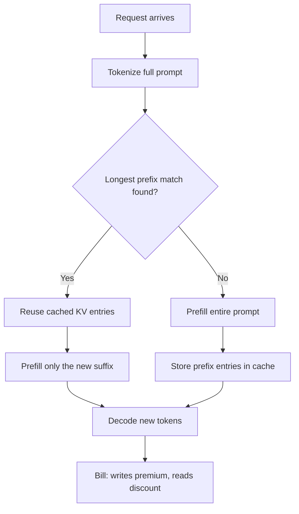
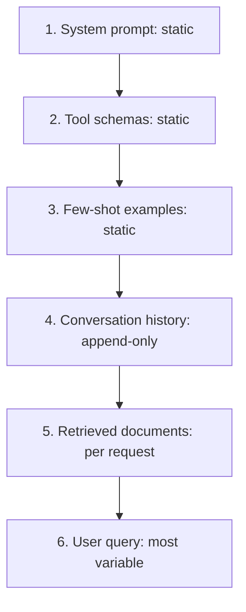
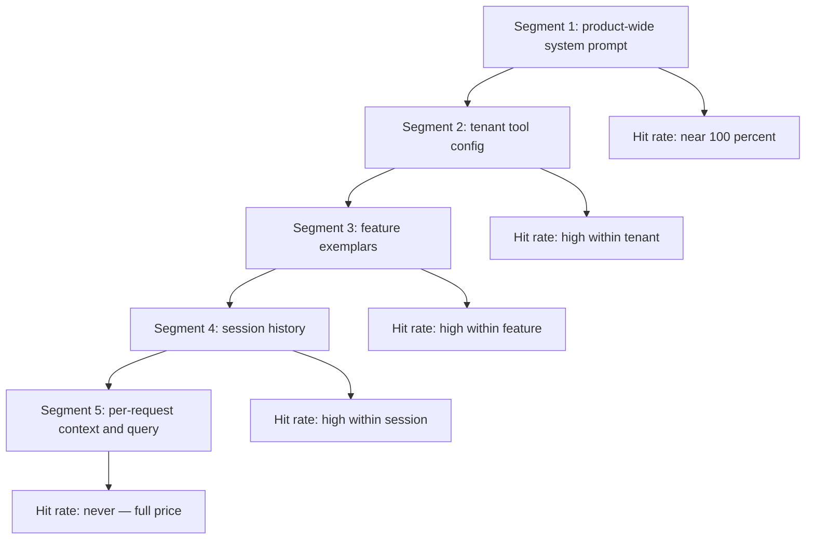
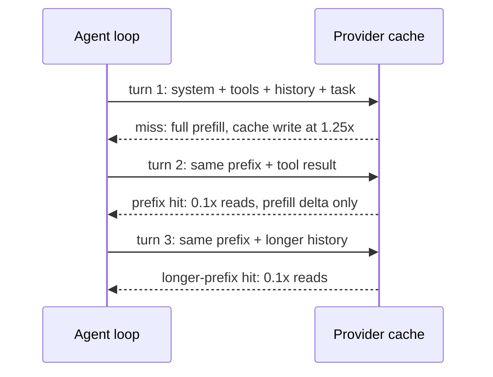

# Prompt Caching: Prefix Economics at the API Layer

## Overview

Prompt caching — called prompt caching by Anthropic and OpenAI, context caching by DeepSeek — reuses the key-value cache computed for an identical token prefix so subsequent requests bill that prefix at a fraction of the base input price (0.1x on Anthropic-style schedules) and skip most prefill compute. It is the single largest cost lever in most production LLM systems because production prompts are dominated by *repeated* content: system prompts, tool schemas, few-shot examples, conversation history. Discounts range from 50% to 90% on the matched portion, and on long contexts the prefill skip is also a material latency win. The engineering content is not in enabling it — OpenAI and DeepSeek caches require zero configuration — but in structuring prompts so the cache actually hits, and in noticing when it silently stops. This page covers the mechanism, the provider implementations and their pricing deltas, the static-prefix ordering pattern that makes caching work, the invalidation gotchas, and measured savings. The model-internals side (what the KV cache is) is covered in [KV Cache](../llm-serving/kv-cache.md); this page stays at the API and prompt-structure layer. Pricing figures are as of late 2025 — verify against the provider pricing pages before quoting them in a design doc.

## The Mechanism: Exact-Prefix Keying

All provider implementations share one contract: the cache is keyed on the *exact token prefix* of the request. A request's prompt is tokenized; the longest prefix already in the provider's cache (and evictable, and warm) is reused — its key/value attention entries are recomputed once and read thereafter — and only the remainder goes through prefill. The billing and the compute both follow the prefix match:



Two consequences of exact-prefix keying drive every design rule below. First, *order matters absolutely*: the first differing token ends the match, so a timestamp at position 10 invalidates everything after it even if 9,900 tokens are identical. Second, the match is over tokens, not semantics — two prompts that differ only in whitespace or tool-JSON field order tokenize differently and cache separately. Third, the cache is provider-side and transparent: there is no API to inspect what is cached, so correctness comes from prompt discipline, not from cache management calls (Anthropic's explicit `cache_control` markers being the partial exception).

The reuse contract, stated as four rules, is all you need for design reviews:

1. **Prefix identity**: cached prefixes match on exact token identity, from the very first token.
2. **Longest match wins**: the provider reuses the longest warm matching prefix; everything after it is re-prefilled.
3. **Writes cost more, reads cost less**: on explicit schemes the first (write) request pays a premium and subsequent (read) requests pay a fraction.
4. **Warmth is time-limited**: entries expire (minutes by default) unless refreshed by traffic or an explicit longer TTL.

## Provider Implementations Compared

| Property | Anthropic | OpenAI | DeepSeek | Gemini |
|---|---|---|---|---|
| Model | Explicit (opt-in) | Automatic (implicit) | Automatic | Both (implicit + explicit API) |
| Control surface | `cache_control` breakpoints on prompt blocks | None — prefix does the work | None — prefix does the work | Explicit TTL for the cached content |
| Minimum cacheable prefix | 1,024 tokens (2,048 on some models) | 1,024 tokens | 64-token block granularity | Varies by model |
| Write premium | 1.25x base input price | None | None | None for implicit |
| Cache-read price | 0.1x base input price | ~50% of base on many models, higher on newer ones | ~1/10 of miss price (e.g., $0.014 vs $0.14 per 1M on deepseek-chat) | Roughly a quarter of base on implicit hits |
| TTL / eviction | 5 minutes default, refreshed on hit; optional 1-hour TTL at 2x write price | Caches typically cleared after ~5–10 minutes of inactivity; occasionally longer off-peak | Disk-backed, longer-lived | Developer-set TTL on explicit caching |
| Breakpoints | Up to 4 per request | n/a | n/a | n/a |

The structural difference worth internalizing: Anthropic makes you *declare* the cache points, which buys control (you can cache mid-prompt and layer breakpoints) at the cost of instrumenting every request; OpenAI and DeepSeek make it automatic, which is zero-effort but means you cannot force a cache or mark mid-prompt breakpoints — the longest-matching prefix rule alone decides what gets reused. Automatic does not mean reliable, though: OpenAI's cache warms on a best-effort basis and its effectiveness depends on your traffic concentration, which is why cost dashboards should track cached-token counts rather than assume the listed discount. Google's Gemini offers both implicit and explicit caching with cached tokens priced at a fraction of base input; treat the exact multiple as a check-the-pricing-page item. Self-hosted serving stacks generalize the same idea further — vLLM's automatic prefix caching and SGLang's RadixAttention maintain prefix tries over the KV cache and can hit partial matches across any prior request, not just within the last few minutes (see [vLLM Internals](../advanced/vllm-internals.md) and [SGLang](../advanced/sglang.md)). For interviews, the one-line version: explicit schemes trade instrumentation for control, implicit schemes trade control for zero effort, and both obey the same prefix-identity contract underneath.

## Pricing Deltas and Break-Even Math

The Anthropic schedule (write 1.25x, read 0.1x) has a genuinely interesting break-even because writes cost *extra*. Let P be the input cost of the cacheable prefix without caching, and n the number of requests sharing the prefix within the TTL window:

\\[
\text{cost}(n) = 1.25P + (n-1) \cdot 0.1P \quad \text{vs} \quad nP \text{ uncached}
\\]

Break-even is at n ≈ 1.28 — the second request already wins. At n = 2 the saving is ~33%; at n = 100 the total is 11.15P versus 100P, an ~89% reduction on prefix input cost. The OpenAI/DeepSeek schedules have no write premium, so they break even immediately and the discount is the whole story. The TTL adds a subtlety: a cache entry survives only 5 minutes (Anthropic default) from its last hit, so *steady traffic* is what sustains the discount. A system prompt hit by 10 requests/minute pays 1.25x once and 0.1x forever after; a prompt hit once every 10 minutes pays the write premium repeatedly for zero reads.

Worked example, agent assistant with an 8,000-token static prefix (system + tools + exemplars) at $3/M base input:

| Traffic pattern | Effective prefix cost per request | Monthly (100k requests, 30 days) |
|---|---|---|
| Uncached | $0.024 | $2,400 |
| Cached, 60 req/min sustained | ~$0.0024 (reads dominate) | ~$240 |
| Cached, 1 request every 10 min (always cold) | ~$0.030 (write premium, no hits) | ~$3,000 — worse than uncached |

The third row is the trap: bursty low-volume traffic with a long TTL gap pays the premium without ever collecting the discount, and Anthropic's 1-hour TTL option (2x write) exists precisely for it — the write premium rises from 25% to 100%, but a hit every 50 minutes amortizes far better than a re-write every 5.

### Cache Warming for Scheduled Workloads

Traffic you control can be shaped to the cache instead of the reverse. A daily report job that hits one giant system prompt once per hour pays the write premium every run; issuing one cheap throwaway request ("ping" with max_tokens=1) on a schedule inside the TTL window refreshes the entry so the real runs always read at 0.1x — the refresh costs a fraction of the write premium it eliminates. The same trick warms caches before deploys (run the new prompt against a canary before the fleet switches, so the write happens once under controlled conditions) and before launches where a cold cache would otherwise bill the whole launch burst at full price. This is ordinary cache management — the web-performance playbook applied to an inference bill.

## The Static-Prefix Ordering Pattern

Because the first differing token ends the match, prompt layout is a caching decision. The canonical ordering places the most *static* content first and the most *per-request* content last:



The rationale per position: the system prompt and tool schemas never change within a deployment, so they anchor the cache. Few-shot examples change only with prompt versions — static in production, invalidated deliberately. Conversation history is append-only, so turn t's prefix contains turn t-1's prompt and each new turn extends the match (this is why multi-turn chat is the most cache-friendly workload there is). Retrieved documents and the user query vary per request, so they go last, where a miss costs nothing. The failure pattern this fixes is common enough to name: teams that interpolate per-user context ("You are talking to {name}") or a timestamp into the *front* of the system prompt defeat the cache for every request while the content itself is barely variable. The pattern generalizes beyond chat — batch pipelines, eval harnesses, and search loops all benefit from the same static-first discipline, which is why it is stated once here and referenced from the reasoning pages.

Anthropic's explicit breakpoint API makes the same pattern concrete:

```python
response = client.messages.create(
    model="claude-sonnet-4-5",
    max_tokens=2048,
    system=[{
        "type": "text",
        "text": STATIC_POLICY + TOOL_GUIDELINES + FEW_SHOT_EXEMPLARS,  # ~8k tokens
        "cache_control": {"type": "ephemeral"},   # mark the breakpoint
    }],
    messages=[
        {"role": "user", "content": conversation_history_and_documents},
        {"role": "user", "content": user_query},
    ],
)
```

Everything before the `cache_control` marker becomes the cache unit; requests that share that exact block bill it at 0.1x after the first write. With up to four breakpoints you can layer caches — one at the system prompt (shared across the whole product), one at a tenant's tool configuration (shared per customer), one at the exemplar set (shared per feature) — which is how multi-tenant systems get hit rates above 90% despite heterogeneous users.

### Layered Breakpoints in a Multi-Tenant System

The layered design is easiest to see as a prefix split into cache segments, each with its own sharing scope and hit-rate expectation:



Reading the diagram bottom-up gives the design discipline: every token you can push toward the left is a token that stops being billed at full price. The corollary is a code-review rule — any PR that moves volatile content earlier in the prompt, or inserts per-request data between two static segments, is a cost regression even if it looks semantically identical. A counter-example worth recognizing: interleaving retrieved documents between exemplar blocks (one document per example, for "grounding each example") splits the static content into non-adjacent pieces and forfeits the middle segment; if you need grounded examples, cache the exemplars as static text and attach the per-request documents after them.

## Multi-Turn and Agent Loops: The Best Case

Conversational and agentic workloads are where caching compounds. In a multi-turn conversation, turn t's prompt is turn t-1's prompt plus new content, so every turn is automatically a cache hit on everything before it. An agent loop is even better: the same system prompt and tool schemas are re-sent on every iteration, and the tool results the loop appends grow the prefix monotonically:



The economics compound non-linearly: a 30-turn agent loop with an 8k-token static prefix would re-send ~240k prefix tokens uncached but bills them once at write price and 29 times at 0.1x — a ~9x reduction on prefix spend, before counting the prefill *latency* savings, which for a 100k-token context can cut seconds per turn. This is the same reason ToT-style search loops (see [tot-and-got](./tot-and-got.md)) and self-consistency sampling (see [cot-and-self-consistency](./cot-and-self-consistency.md)) are cache-friendly: all their calls share an identical prefix by construction.

One design rule protects this best case: keep history *append-only* in the prompt. The common optimizations — trimming old turns, summarizing history, re-ranking retrieved documents into a new order — all rewrite the middle of the prefix and reset the match at the rewrite point. If a context-management policy must intervene, put it at the oldest end (drop from the front) rather than re-sorting the middle, and accept that a compaction event costs one full-price request before the append-only pattern resumes.

## TTL, Eviction, and Invalidation Gotchas

| Gotcha | Mechanism | Mitigation |
|---|---|---|
| Timestamp or random ID in prefix | First differing token kills the match | Move volatile content after all static blocks; format dates into the query, not the system prompt |
| Per-user personalization up front | Every user = distinct prefix | Put per-user data at the tail; keep a per-tenant (not per-user) breakpoint |
| Tool schema churn | Tool definitions are part of the prefix | Version tool schemas; deploy them like prompts, not like code |
| Prompt A/B tests | Each variant is its own prefix; low-traffic variants stay cold | Warm variants before measuring cost; compare quality at equal cache-warmth |
| Provider failover | Caches are per-provider (and per-account) | Cache-hit rates are a reason to avoid aggressive cross-provider failover mid-session |
| JSON field reordering in tool args | Same text, different tokenization | Serialize deterministically (sorted keys) before injection |
| Long TTL gaps | Entry expires; next request pays write again | Buy the 1-hour TTL for bursty traffic; or ping the cache on a schedule (cheap reads refresh it) |
| Deploy-time system prompt edits | Whole fleet's cache invalidates at once | Roll prompts gradually; expect a write-premium spike after each deploy |

The deploy-spike deserves emphasis because it shows up on invoices: a prompt change invalidates every cached entry containing the changed prefix, so the first hours after a deploy bill 1.25x across the fleet until hits rebuild. Teams that ship prompts daily should look at caching in their cost dashboards *per prompt version*, or the deploy spike reads as an unexplained regression.

One subtlety about what is actually stored: the provider caches the *tokenized* prefix and its KV state, so two requests that share text but differ in upstream serialization (tool JSON key order, whitespace, template whitespace) do not share cache. Build the prompt string through one deterministic code path — template with sorted-key serialization and no ad-hoc string concatenation — or you will split identical-content traffic across distinct prefixes and never see the hit rate your token math predicts.

## Measured Savings by Workload

Real-world hit rates cluster by workload shape. The table gives representative ranges to sanity-check your own dashboard against; the drivers are traffic concentration (many requests sharing prefixes) and prefix size (bigger prefixes = bigger discounts).

| Workload | Typical hit rate | Input-cost reduction | Why |
|---|---|---|---|
| Multi-turn chat | 85–95% | ~80–90% | Append-only prefix grows monotonically |
| Agent loops (10+ iterations) | 90%+ | ~85–95% | Same static prefix re-sent every iteration |
| Batch evaluation / backfills | 90%+ | up to ~90% | Identical prompts repeated across examples |
| RAG with shared system + exemplars | 60–90% | 50–85% | Static prefix large relative to variable context |
| Single-shot, unique prompts | < 20% | marginal | Little repeated content; watch the write premium |

The latency column is unlisted but real: skipping prefill for the matched prefix saves wall-clock roughly proportional to prefix length, and on 100k-token contexts that is seconds per request. Products sensitive to first-token latency get a double benefit — time-to-first-token improves even more than total latency, because prefill is precisely the phase that delays it. This is why long-context applications (repository-scale code assistants, contract review) treat caching as a latency feature first and a cost feature second.

### What Caching Does Not Fix

Caching discounts input tokens that repeat. It does nothing for: output tokens (always full price — the reasoning techniques' dominant cost), the *variable* context that differs per request (RAG documents, unique queries — which is what compression addresses), models' attention quality (a repeated 50k-token prefix still consumes context window and can still dilute attention), or cross-provider redundancy (traffic spread over two providers caches neither's prefixes fully). A cost plan built on caching alone therefore plateaus at the shared-prefix fraction of the bill; the rest needs the compression, routing, and output-side levers from [LLM Cost Optimization](../cost-optimization.md).

The order of operations for a cost-reduction program follows from that boundary: first restructure prompts for cache hits (this page — cheapest, no quality risk), then compress the never-cacheable variable context, then route or downshift models for the residual traffic, and only then reach for output-side reductions like short-form CoT. Caching first is not just because it is the largest lever, but because it is the only one whose failure mode (a lower hit rate) is fully reversible and quality-neutral.

### Observability: Instrumenting Hit Rate

Provider usage responses expose cached versus uncached input token counts per request (field names vary: `cache_read_input_tokens`, `prompt_tokens_details.cached_tokens`). Treat them as first-class telemetry:

| Metric | Definition | Alert threshold |
|---|---|---|
| Hit rate | Cached input tokens / total input tokens, by route | Below workload expectation (table above) by 20 points |
| Prefix churn | Distinct prefix hashes per route per hour | Rising after a deploy with no prompt change |
| Write/read ratio | Write-premium tokens / discounted tokens | Above ~1:10 on steady traffic means TTL thrash |
| Cost per request | Blended input cost including premiums | Step change after deploys |

The prefix-churn metric is the diagnostic that catches the silent killers: a timestamp in the system prompt shows up as every request having a distinct prefix, which is invisible in quality metrics and unmistakable in the token histograms. Log a hash of the first N tokens of each prompt (the prefix fingerprint) alongside the request, and grouping any cost anomaly by that fingerprint points at the offending field in minutes.

### Cache-Aware A/B Testing

Prompt experiments interact with caching in a way that corrupts naive cost comparisons. Each variant owns a distinct prefix, so a 50/50 split halves each variant's hit rate; a five-variant experiment can leave every variant below the TTL-refresh threshold, billing write premiums across the board. The comparison then reads "variant B costs 30% more" when the truth is "variant B is colder". Fix the measurement before comparing: run variants in phases with warm-up requests, or evaluate offline on a batch (where identical prompts hit naturally), and compare quality at equal warmth. The same logic applies to canary rollouts — a 1% canary will never sustain a cache, so judge canaries on quality and latency only, and judge cost after full rollout with hit rate at steady state.

## Provider-Specific Tuning Notes

Small operational details that differ per provider and surprise teams in production:

- **Anthropic**: breakpoints count against a four-per-request limit, so decide the layering *before* adding ad-hoc markers; the 1-hour TTL is a request-time parameter, not an account setting, so it can be applied selectively to bursty routes only. Minimum prefix sizes mean short system prompts cannot be cached at all — pad the cacheable block with exemplars rather than marker-hunting.
- **OpenAI**: the cache is scoped at the organization/project level and warms best under concentrated traffic; there is no way to pin or pre-warm via API, so scheduled batch jobs should send identical prompt strings (not reformatted ones) to exploit it. Monotonically appended conversation IDs that prepend metadata will silently defeat the prefix — put routing metadata out-of-band.
- **DeepSeek**: 64-token block granularity means even moderately sized static prefixes reuse well, and the disk-backed store makes warmth survive far longer than the chat-workload TTLs of other providers — batch jobs and infrequent pipelines benefit disproportionately.
- **All providers**: tool definitions and system prompts are prefix content. Version them, deploy them atomically with the prompt, and record their hash in your tracing metadata so "prompt version" includes everything that participates in the prefix.

## Interview Questions

1. **Explain provider prompt caching: what exactly is keyed, and what do you save?** The cache is keyed on the exact token prefix of the request. When a request's longest token prefix matches a warm cache entry, the provider reuses the stored key-value attention states for that prefix, running prefill only on the new suffix; you bill that prefix at the cache-read price instead of base input price. The savings are two-fold and stacked: price (0.1x reads on Anthropic, ~50%+ on OpenAI, ~1/10 on DeepSeek) and latency (prefill is skipped for the matched part, which matters most on 100k-token contexts). The exact-prefix rule is the whole game — one differing token ends the match, which is why prompt ordering is an economic decision, not a style choice.
2. **Walk through the break-even math for Anthropic-style caching (1.25x write, 0.1x read).** With P the uncached prefix cost and n requests within the TTL window, cached cost is 1.25P + (n−1)·0.1P against nP uncached; break-even is just above n = 1, so the second request already profits. At n = 100, cost is ~11P versus 100P — an ~89% reduction. The interesting failure mode is TTL expiry: if traffic arrives slower than the 5-minute TTL, every request re-pays the 25% write premium with zero reads — *worse* than uncached. That is the case the 1-hour TTL (2x write) option is for, and it's why cache-hit rate per prompt version is a dashboard metric, not a nice-to-have.
3. **How do you structure a prompt to maximize cache hits?** Order content by volatility: static system prompt, then tool schemas, then few-shot exemplars, then append-only conversation history, then per-request retrieved documents, then the user query. Never interpolate volatile data (timestamps, per-user context, random IDs) before any static block, because the first differing token ends the prefix match. On Anthropic, mark up to four `cache_control` breakpoints to create layered caches (product-wide system prompt, per-tenant tools, per-feature exemplars); on OpenAI and DeepSeek the ordering is the entire control surface. Deploy tool schemas and system prompts with the same versioning discipline as prompts — they are part of the prefix.
4. **What invalidates a prompt cache in practice?** Any token-level change in the shared prefix: a timestamp, a per-user greeting, reordered JSON in a tool definition, a whitespace difference from a different serializer, a system-prompt deploy. Cross-cutting causes: provider or account failover (caches don't follow), prompt A/B variants that split traffic so thin no variant stays warm, and TTL expiry under bursty traffic. Note what does *not* invalidate: sampling parameters (temperature, max_tokens) are not part of the prefix, so you can vary generation freely on a cached prefix.
5. **Why are agent loops the best-case workload for caching?** Every iteration re-sends the same static prefix (system prompt, tool schemas) and appends to the conversation monotonically, so each turn after the first is a hit on the longest prefix yet — writes are paid once and everything else bills at 0.1x. On a 30-turn loop with an 8k-token static prefix, uncached traffic re-sends ~240k prefix tokens; cached traffic bills one write plus 29 discounted reads, roughly a 9x reduction on prefix spend, with the prefill skip also cutting seconds of latency per turn on long contexts. The same structure is why self-consistency and ToT loops cache so well: all their calls share one prefix by construction.
6. **How does self-hosted prefix caching differ from provider caching?** The mechanism is the same (reuse KV entries for a shared token prefix) but the control point differs: vLLM's automatic prefix caching and SGLang's RadixAttention maintain a radix-tree index over all prior requests on the serving instance, so they can hit *partial* prefixes from any earlier request, not just recent turns, and there is no write premium or TTL pricing — the saving is pure prefill compute and the memory cost of retaining blocks (which competes with decode batch size in the scheduler). Provider caching is an accounting scheme on top of a similar mechanism; self-hosted caching is a scheduler-level optimization with visible internals. In interviews, the useful contrast is that self-hosted lets you trade KV memory for prefill compute explicitly, while providers make that trade for you with a TTL.

## Key Takeaways

- Prompt caching reuses KV entries for an exact token prefix: reads bill at 0.1x (Anthropic) to ~50% (OpenAI), and prefill compute for the matched part disappears.
- Exact-prefix keying means prompt *order* is an economic decision: static system prompt → tools → exemplars → append-only history → variable context → query.
- Anthropic-style schedules have a write premium (1.25x; 2x for 1-hour TTL) and a break-even at the second request; sustained traffic hits ~89% savings at n=100.
- The classic self-inflicted wound is volatile content (timestamps, per-user text) at the front of the prefix, which silently disables the cache fleet-wide.
- Multi-turn chat and agent loops are the best case: append-only prefixes turn every turn into a hit, compounding to ~85–95% input-cost reductions.
- Deploys invalidate caches wholesale — expect a write-premium spike after every prompt or tool-schema change, and track hit rate per prompt version.
- Caching never discounts output tokens; pair it with output-side levers (short-form CoT, routing) for the full cost picture.
- Self-hosted stacks (vLLM prefix caching, SGLang RadixAttention) implement the same idea as a scheduler optimization with partial-prefix hits and no pricing TTL.
- Track hit rate, prefix churn, and write/read ratio as first-class telemetry; a hash of the first N prompt tokens (prefix fingerprint) turns cost anomalies into one-group-by diagnoses.

## References

- Anthropic prompt caching documentation — https://docs.claude.com/en/docs/build-with-claude/prompt-caching
- OpenAI prompt caching guide — https://platform.openai.com/docs/guides/prompt-caching
- OpenAI Cookbook (caching and cost examples) — https://cookbook.openai.com/
- DeepSeek API documentation (context caching on disk) — https://api-docs.deepseek.com/
- Anthropic prompt engineering overview (long-context and caching techniques) — https://docs.claude.com/en/docs/build-with-claude/prompt-engineering/overview
- SGLang (RadixAttention) — https://github.com/sgl-project/sglang
- OpenAI prompt engineering guide — https://platform.openai.com/docs/guides/prompt-engineering

## Cross-References

- [KV Cache](../llm-serving/kv-cache.md) — the model-internals mechanism that prefix caching amortizes
- [vLLM Internals](../advanced/vllm-internals.md) — automatic prefix caching and block management in a serving stack
- [SGLang](../advanced/sglang.md) — RadixAttention: prefix trees over the KV cache
- [LLM Cost Optimization](../cost-optimization.md) — where caching sits among routing, batching, and quantization
- [CoT and Self-Consistency](./cot-and-self-consistency.md) — k-sample loops that share one cached prefix
- [ToT and GoT](./tot-and-got.md) — search loops with highly repetitive prompt prefixes
