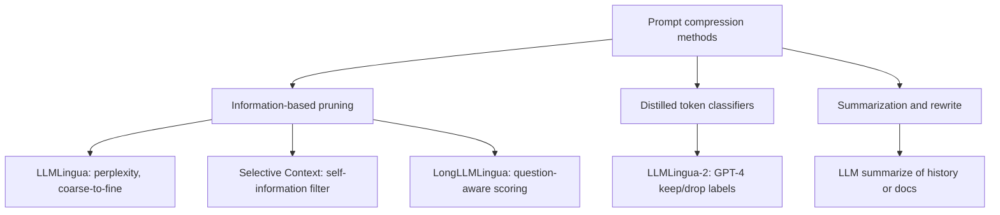
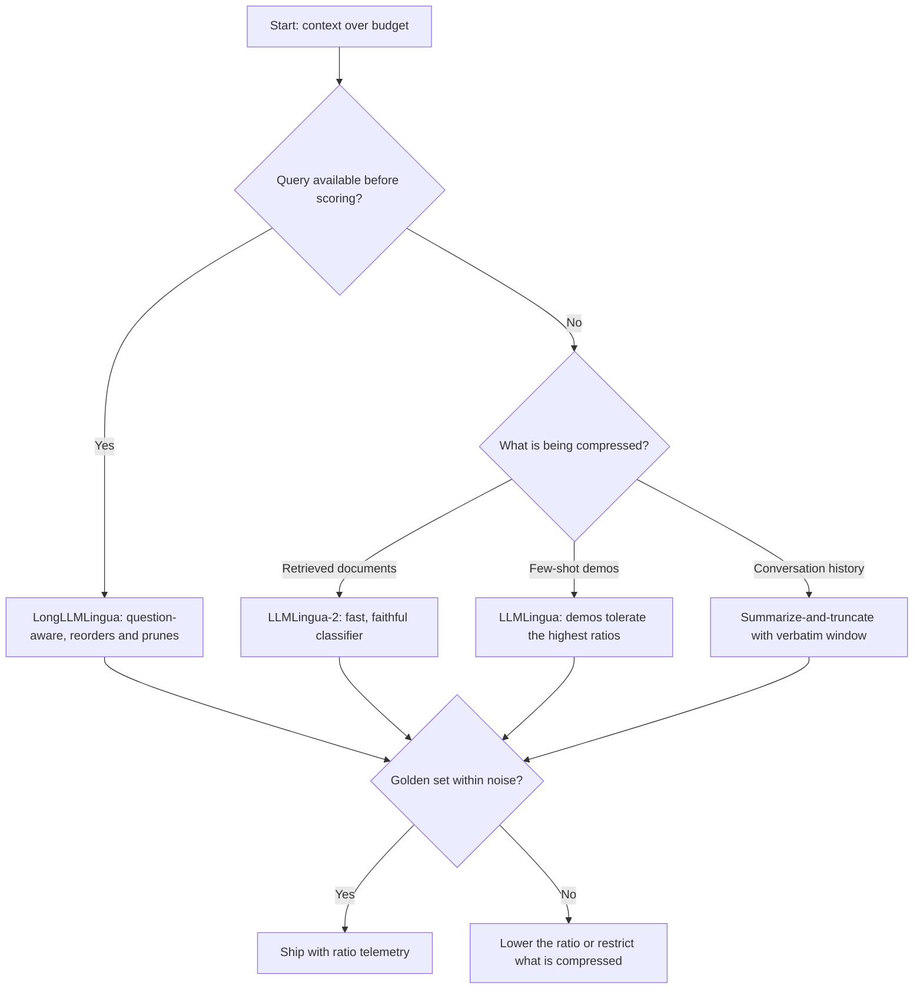
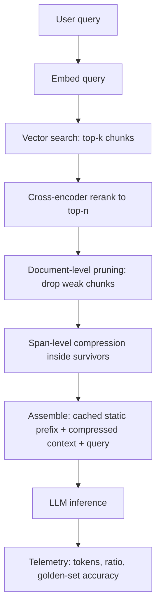

# Prompt Compression: Shrinking Context Before the Prefill Bill

## Overview

Prompt compression removes tokens from context before inference while keeping the model's task performance close to the uncompressed baseline: an information-theoretic filter, a distilled token classifier, or a summarizer decides which spans are droppable, and only the survivors are prefilled. It exists because prompt caching and compression solve disjoint halves of the token bill — caching discounts the *repeated* prefix (system prompt, tool schemas, exemplars, history), while retrieved documents, per-request context, and long user input are unique on every call and can never be cached (see [Prompt Caching](./prompt-caching.md) for the prefix side). The compression side is where RAG pipelines and long-context applications get their cost and latency back: compressing 20,000 tokens of retrieved context 4x saves the prefill for 15,000 tokens on every single request, plus a proportional slice of time-to-first-token. This page covers the method families (LLMLingua, LongLLMLingua, Selective Context, LLMLingua-2, summarization), the ratio-versus-accuracy trade-offs, where the compressor sits in a RAG pipeline, and the operational rules that keep compression from silently deleting task-relevant detail. The distinction to keep sharp in interviews: compression is a *lossy transformation of input text*, not a cache — quality must be re-measured per task and per ratio, because there is no prefix-identity-style guarantee.

## The Method Landscape

Every production method answers one question — *which tokens can I remove without hurting this task?* — with a different judge. The judge determines the granularity, the overhead, and the failure modes.



| Method | Judge of importance | Granularity | Typical ratio | Query-aware | Extra training | Controller cost |
|---|---|---|---|---|---|---|
| LLMLingua | Small-LM perplexity, iterative masking | Token / span | 2x–20x | No | None | Milliseconds on GPU |
| Selective Context | Self-information \\(-\log_2 p(u \mid \text{ctx})\\) | Token / phrase / sentence | ~2x (50% retained) | No | None | Small-LM forward pass |
| LongLLMLingua | Question-conditioned perplexity contrast | Document → entity → token | ~4x | Yes | None | Small-LM + reordering |
| LLMLingua-2 | Encoder token classifier (GPT-4-distilled) | BPE span | 2x–5x | No (task-agnostic) | One-off distillation | Fast encoder inference |
| Summarization | Another LLM's judgment | Whole passages | 2x–10x | Can be | None | An LLM call per request |

The rows are complements, not competitors. Perplexity methods need no training and adapt to any text but are query-blind unless upgraded (LongLLMLingua). Distilled classifiers are fast and faithful but inherit GPT-4's notion of importance. Summarization handles the coarsest ratios and produces readable text, but the compressor itself can hallucinate and it costs a full LLM call.

### Choosing a Method: A Decision Path

The selection is driven by three questions: does the workload have a query to condition on, is per-request latency tight, and is the compressor allowed to be generative. The path below covers the common RAG and assistant shapes; the "retrieval or memory" branch distinguishes per-request document compression from rolling history compression, which have different faithfulness requirements.



Two nodes deserve comment. The golden-set gate `V` is drawn as part of the path, not as an afterthought, because every one of these methods changes model inputs and therefore requires the same regression discipline as a prompt edit. And the fallback edge `DROP` is the honest one: when a task cannot hold accuracy at the target ratio, the correct move is a smaller ratio on a narrower segment — not a better compressor, because no compressor can recover information the task actually needed.

## Information-Based Pruning: LLMLingua and Selective Context

LLMLingua (Jiang et al., EMNLP 2023) demonstrated that a cheap language model can decide which prompt tokens an expensive model never needs to see. The controller (originally GPT-2-class) scores each token by probability and removes low-information spans in two stages: a coarse-grained pass that drops whole low-value units (filtering by perplexity), then a fine-grained pass that applies *iterative masking* — mask the low-probability tokens, re-score the damaged text with the controller, and repeat so that removal decisions account for what is already gone. The headline claims: up to 20x compression with minimal performance loss in the best settings, 1.5x–20x across the task suite, and consistent gains in end-to-end cost and latency because the controller's inference is orders of magnitude cheaper than the prefill it eliminates. One finding matters more than any single number: *few-shot demonstrations tolerate far higher compression ratios than instructions or questions* — demos are redundant by design, while the question defines the task and the instructions define the policy, so both must be preserved nearly verbatim.

### The Controller Loop, Mechanically

The perplexity approach is small enough to state as runnable pseudo-code, which is the fastest way to see what "the small model decides" means. The scorer keeps a running token budget, drops the lowest-information units until the budget is met, and refuses to touch protected segments (instructions, question, numerals):

```python
import math

def compress(context: str, scorer, budget_tokens: int,
             granularity: str = "sentence") -> str:
    units = split_into_units(context, granularity)   # token / phrase / sentence
    protected = [u for u in units if u.is_instruction or u.is_question]
    droppable = [u for u in units if u not in protected]
    # self-information per unit under the small-LM scorer: I(u) = -log2 p(u | ctx)
    scores = {u: scorer.self_information(u.text) for u in droppable}
    kept, kept_tokens = [], sum(u.n_tokens for u in protected)
    for u in sorted(droppable, key=lambda u: -scores[u]):   # high info first
        if kept_tokens + u.n_tokens <= budget_tokens or u.has_digits:
            kept.append(u)
            kept_tokens += u.n_tokens
    return render(protected + kept)                  # preserve source order
```

Three implementation details decide whether this survives contact with production. Units are scored *in context*, not in isolation — the probability of a sentence depends on what precedes it, so a single forward pass over the whole text with per-span scoring beats scoring sentences independently. The `has_digits` guard is the cheap version of LongLLMLingua's entity protection: numerals, dates, and identifiers are near-free to keep and catastrophic to drop. And `render` must preserve source order (sort kept units back to their original positions), because scrambling paragraph order changes the narrative the downstream model reasons over even when no content is lost.

Selective Context (Li et al., EMNLP 2023) is the cleanest formulation of the same idea. Each lexical unit \\(u\\) (token, phrase, or sentence) gets a self-information score:

\\[
I(u) = -\log_2 p(u \mid \text{preceding context})
\\]

Units below a threshold — predictable, redundant text like boilerplate, filler, and repeated phrasing — are dropped until a target retain ratio (50% is the typical setting) is met. Token-level granularity is the finest and preserves the most accuracy per ratio; sentence-level removal keeps text fluent and readable but discards single low-information sentences that occasionally held the answer. The paper shows comparable task performance at half the context on long-document QA and summarization benchmarks, with degradation appearing as the retain ratio drops further. The practical takeaway: self-information filtering is a *redundancy* detector, not a *relevance* detector — it knows "the" is droppable but not that a specific clause answers the question.

Granularity is the method's main tuning knob, and the trade is always accuracy-per-ratio against readability and safety of removal:

| Granularity | Unit scored | Accuracy per ratio | Failure pattern |
|---|---|---|---|
| Token | Single BPE token | Best — finest decisions | Output text has holes; confusing to humans |
| Phrase | N-gram / segment | Good — keeps multi-token entities whole | Misses redundancy that spans phrases |
| Sentence | Whole sentence | Worst per ratio; most readable | One low-information sentence can carry the answer |
| Document | Whole chunk | Coarse pre-filter only | Reranking territory, not compression |

## Compression vs. the Alternatives

Compression is one of five ways to shrink an over-budget context, and interviews frequently ask why not just use the others. Truncation is free but drops the tail blindly; retrieving fewer chunks is the reranker's job and leaves redundancy inside chunks untouched; map-reduce summarizes passages in parallel but multiplies LLM calls; upgrading to a long-context model raises the ceiling and the per-token price simultaneously.

| Alternative to compression | What it does | Why it is not enough alone |
|---|---|---|
| Naive truncation | Cut the tail at the budget | Loses whatever happened to be last; no notion of importance |
| Retrieve fewer, better chunks | Rerank, keep top-n | Reduces chunk *count*; redundancy *inside* chunks survives |
| Map-reduce summarization | Summarize each chunk, merge | Costly fan-out of LLM calls; same hallucination risks as summarization |
| Long-context model upgrade | Fit everything in the window | Attention dilution (Lost in the Middle) and a higher per-token price |
| KV cache compression | Shrink attention state after prefill | Serving-stack feature; does not cut input-token billing or network payload |

The mature pipelines stack them: rerank first (cheap, high precision at the document level), then compress spans inside what survives, then — if the stack is self-hosted — let KV compression handle the residual attention state. Each layer addresses a granularity the previous one cannot see.

## Question-Aware Compression: LongLLMLingua

LongLLMLingua (Jiang et al., ACL 2024) fixes the query-blindness. Its scores are contrasts: for each candidate document or span, it compares the perplexity of the text *conditioned on the question* against the perplexity *without* it, so importance is measured relative to the task at hand. The pipeline is coarse-to-fine at three levels: document-level scoring prunes whole retrieved chunks and *reorders* the survivors so the most relevant sit closest to the query (exploiting the positional recency effects documented in [Lost in the Middle](https://arxiv.org/abs/2307.03172)); entity-level detection then protects key entities inside surviving documents; token-level compression runs last. On LongBench the paper reports up to 21.4% accuracy *improvement* over full context at roughly 4x fewer tokens — compression can beat the uncompressed baseline because removing distractor passages cleans up attention — plus a reported up-to-6.8x speedup in first-token generation on long inputs. That last property is why long-context RAG is the natural home for this method: the prefill skipped is exactly the part that delays the first token.

The reordering insight deserves its own sentence because it is free: ranking retrieved documents by question-conditioned perplexity contrast is a passable reranker that costs only small-LM forwards. Where the retrieval stack already includes a cross-encoder reranker ([Rerankers](../retrieval-advanced/rerankers-deep.md)), the contrast scores instead drive *token-level* decisions inside the surviving documents; where there is no reranker, LongLLMLingua's document stage substitutes for one.

## Distilled and Summarization Approaches

LLMLingua-2 (Zhu et al., ACL 2024) replaces perplexity with a learned classifier. The recipe: prompt GPT-4 to compress a corpus (MeetingBank transcripts and others), record which BPE tokens GPT-4 kept versus dropped, then train a small encoder (XLM-RoBERTa-class) to predict keep/drop per span. Because the controller is a classifier rather than a generative scorer, it is fast (the paper reports several-fold higher throughput than the LLMLingua pipeline), deterministic, and *faithful* — it removes spans but never rewrites them, so it cannot hallucinate replacements the way a compressor LLM can. Compression sits at 2x–5x, below LLMLingua's ceiling, but the speed and faithfulness make it the pragmatic choice for per-request RAG compression in production, including CPU deployment with smaller variants.

Summarization-based compression ("compress this 30-page filing into 800 words before answering") is the oldest method and still the only one that reaches 10x–20x on moderately redundant text while producing fluent output. It is also the only method whose output a human can read directly, which matters when the compressed context is logged, audited, or shown in a support UI. It has three structural costs that the token-level methods avoid. First, the compressor is itself an LLM call, so the accounting must net compressor cost against prefill saved — at low traffic it can be net-negative. Second, it is generative: the summary can drop a load-bearing number or invent a plausible one, and the downstream model has no way to know. Third, it is stateful and hard to evaluate — the same input summarizes differently across calls, which breaks reproducibility and complicates regression testing. Where summarization genuinely earns its place is *rolling conversation history* in long-lived agents ([Agent Memory](../agentic/agent-memory-advanced.md)): history is append-only, older turns are rarely quoted verbatim, and a periodic summarize-and-truncate keeps both tokens and attention quality bounded.

### A Rolling-History Policy That Ships

The standard policy keeps a *verbatim recent window* (the last N turns, untouched, so the model can quote the user exactly) and a *running summary* of everything older, regenerated only when the evicted portion grows past a threshold. Summarize-on-append — rewriting the summary every turn — is the classic mistake: it rewrites the middle of the prompt on every call, which defeats prefix caching and doubles the summarize calls. Threshold-triggered regeneration (evict-and-summarize only when the overflow exceeds, say, 2,000 tokens) amortizes the cost and keeps the summary segment byte-stable between regenerations, so the static prefix plus summary block still caches. The policy's failure mode is important enough to name: summaries must preserve open commitments ("the user asked for X and we promised Y"), because a fluent summary that drops an unresolved task silently changes agent behavior several turns later.

## Ratio vs Accuracy: The Operating Envelope

Compression is a dial, and the dial has distinct regimes. The bands below aggregate the reported results of the papers above plus field experience; your task will disagree at the margins, which is why every band ends in "measure."

| Ratio band | Expected behavior | Suitable for |
|---|---|---|
| ≤ 2x | Near-lossless on most tasks; the "free lunch" zone | Anything, including instructions |
| 2x–5x | RAG QA and summarization largely hold; multi-hop reasoning starts to slip | Retrieved context, long documents |
| 5x–10x | Extractive QA survives; generative synthesis and citations degrade | Redundant corpora, transcript cleanup |
| 10x–20x | Works only on highly redundant inputs; treat as summary | Demonstrations (LLMLingua's high-ratio results) |
| > 20x | Failure territory; information removed is information unavailable | Reject unless eval says otherwise |

Three sensitivity rules cut across the bands. Instructions and the user question carry near-zero compressibility — compressing them is the top field failure, and LLMLingua's own ablations show demos tolerate compression at ratios instructions cannot. Numeric and named-entity spans are disproportionately load-bearing for math and extraction tasks (GSM8K-style accuracy falls sharply once digits are dropped), which is what LongLLMLingua's entity-level protection and LLMLingua-2's span classification are built to preserve. And compression quality is *task-shaped*: a ratio that is safe for retrieval-augmented QA can wreck a generation task that needs stylistic detail, so the eval set must be the real task distribution, not a generic benchmark.

The task-shaped part generalizes into an ordering you can use as a starting point before your own sweep:

| Task type | Practical max ratio | Why |
|---|---|---|
| Math / arithmetic reasoning | ~1.2x | Every digit and operator is load-bearing |
| Multi-hop QA | ~2x | Each hop's fact may be needed |
| Single-hop QA over redundant corpora | 4x–5x | High redundancy, one supporting passage |
| Summarization / synthesis | 2x–3x | Style and coverage both degrade early |
| Classification / extraction | 4x–6x | Decision surface survives span removal well |
| Few-shot demonstrations (as context) | 10x–20x | Redundant by construction (LLMLingua's finding) |

## Where Compression Sits in a RAG Pipeline

The canonical placement is *after retrieval and reranking, before prompt assembly*, with the query-aware scorer driving both pruning and ordering:



Reading the diagram as a funnel explains the division of labor: retrieval drops *irrelevant* documents by embedding similarity, the reranker reorders by precise relevance ([Rerankers](../retrieval-advanced/rerankers-deep.md)), document-level compression drops *weak-but-retrieved* material the cross-encoder kept, and span-level compression drops *redundant or low-information text inside* relevant documents. Each stage costs less compute than the one before it and each narrows the set the next stage must examine, which is why the ordering is not arbitrary — running span-level compression before reranking wastes controller compute on documents the reranker would have discarded anyway. The assembled prompt keeps the static prefix (system prompt, tool schemas, exemplars) uncompressed and cache-friendly, applies compression only to the never-cacheable variable context, and appends the raw query last. This is exactly the layering the cost-optimization page assumes when it says "compress prompts, fewer RAG chunks" as the input-side lever ([LLM Cost Optimization](../cost-optimization.md)).

### Worked Cost Example: Caching and Compression Combined

Take one request shape and price it end to end: an 8,000-token static prefix (system prompt, tool schemas, exemplars) plus 20,000 tokens of retrieved context per request, at $3/M base input on an Anthropic-style cache schedule (write 1.25x, read 0.1x) and a 4x compressor on the context only. The four strategies differ by an order of magnitude, and the interaction is the point:

| Strategy | Prefix billing | Context billing | Per request | 1M requests/month |
|---|---|---|---|---|
| Neither | 8,000 tokens full price | 20,000 full | $0.0840 | $84,000 |
| Caching only | ~800 (0.1x reads; write amortized) | 20,000 full | $0.0624 | $62,400 |
| Compression only | 8,000 full | 5,000 (4x) | $0.0390 | $39,000 |
| Both | ~800 | 5,000 | $0.0174 | $17,400 |

The savings multiply rather than add because the levers act on disjoint segments of the prompt — caching re-prices the prefix while compression removes context tokens. Controller cost is a small-LM forward pass over 20,000 tokens plus an encoder pass over the survivors, well under a tenth of a cent per request even on modest GPUs, and LLMLingua-2's classifier variant is cheaper still. The latency column compounds the win: the 15,000 skipped prefill tokens are a material fraction of time-to-first-token at every model class, and skipping them costs zero quality if the golden set says the ratio is safe. This two-lever bill is the standard exhibit for why the cost-optimization page orders its levers caching-first, compression-second.

## Operations: Ratios, Guards, and Failure Modes

| Failure mode | Mechanism | Guard |
|---|---|---|
| Compressed instructions or question | Applying the compressor to the whole prompt uniformly | Never compress the instruction block or query; whitelist the context segments |
| Dropped digits and entities | Low self-information tokens include numbers, dates, IDs | Entity-level protection (LongLLMLingua) or keep-all-numerals rule in the controller |
| Compressor hallucination | Generative summarizers invent or alter content | Prefer extractive/classifier methods for grounded QA; spot-check summaries against sources |
| Ratio drift after corpus change | New document type breaks the calibrated retain ratio | Track realized ratio and accuracy per route; re-tune on drift |
| Reproducibility loss | Stochastic summarization changes inputs between runs | Deterministic controllers; version the compressor model like the prompt |
| Silent quality regression | Fewer tokens, plausible answers, wrong citations | Golden-set eval gate on every ratio or compressor change |
| Cache interaction mistakes | Compressing the static prefix | Compression targets the variable tail; the prefix stays byte-stable for prefix caching |

Two operational rules carry most of the safety. *Compression is a per-route policy, not a global flag*: the retrieval route over contracts can run 5x compression while the math route runs 1.2x, and both ship behind the same golden-set gate ([Evaluation](../llm-serving/evaluation.md)). *Telemetry must show the counterfactual*: log original tokens, surviving tokens, realized ratio, and downstream accuracy together, because a compression bug presents as a slow accuracy slide with a healthy-looking cost curve — the ratio column is what makes the regression attributable.

The metrics table below is the minimum instrumentation for a compressed route; every row exists because its absence produced a real incident pattern.

| Metric | Definition | Healthy target |
|---|---|---|
| Realized ratio | Original context tokens / surviving tokens, per request | Within 10% of the configured target |
| Golden-set accuracy delta | Compressed-route accuracy minus uncompressed baseline, on a fixed set | Within noise (binomial test, n ≥ 50) |
| Entity recall | Share of ground-truth numbers/IDs present in compressed context | ≥ 99% — the canary for digit-dropping bugs |
| Controller overhead | Compressor latency and cost per request | Under 10% of the prefill it saves |
| Protected-segment integrity | Hash of instruction + question block before/after | Always identical — compressors never touch them |
| Citation correctness | Share of answers citing a surviving passage that supports the claim | Baseline parity with uncompressed route |

Finally, distinguish compression from the KV-level techniques ([KV Cache Compression](../advanced/kv-cache-compression.md)): prompt compression removes tokens before prefill and helps every serving stack, while KV compression shrinks the attention state after prefill and is a serving-stack feature — they compose, and interviews probe exactly this distinction.

## Interview Questions

1. **When does prompt compression pay off, and when does prompt caching dominate instead?** They solve disjoint problems. Caching discounts content that repeats *exactly* across requests — system prompts, tool schemas, exemplars, append-only history — and it is the first lever because it is quality-neutral and reversible. Compression targets the *never-cacheable* variable context: retrieved documents and unique per-request input, which differ token-by-token on every call. The order of operations is caching first (free, zero quality risk), then compression on the residual variable tokens, then routing or model downshift. A pipeline whose bill is dominated by RAG context gets little from additional cache tuning and much from a 4x compressor; a chat product with a giant static prefix gets nearly everything from caching alone.
2. **How does LongLLMLingua improve on plain LLMLingua, and why can compression improve accuracy?** Plain LLMLingua scores tokens by unconditional perplexity under a small controller — it finds redundancy but not relevance. LongLLMLingua conditions the scoring on the question (perplexity contrast), prunes and *reorders* documents coarse-to-fine (document → entity → token), so ranking and compression come from one score. Reported: up to 21.4% improvement on LongBench at ~4x fewer tokens and up to 6.8x faster first-token generation. Accuracy can improve because retrieved context contains distractor passages that diffuse attention and invite wrong-passage answers; removing them sharpens the signal — the same positional mechanism behind Lost-in-the-Middle findings.
3. **What breaks when you compress too aggressively, and how do you pick the ratio?** The failure is information deletion, and it is task-shaped: multi-hop and math questions fail first because every supporting fact or digit is load-bearing; single-hop QA tolerates 5x on redundant corpora; generation degrades stylistically before it fails factually. Pick the ratio empirically per route: sweep {1x, 2x, 4x, 8x} against a golden set of real queries, watch accuracy *and* citation correctness, and choose the highest ratio whose accuracy delta is within noise. Never compress instructions or the question regardless of the sweep result — that is the one universal rule.
4. **Compare perplexity-based compression with LLMLingua-2's distilled classifier. When do you choose each?** Perplexity methods (LLMLingua, Selective Context) need no training, adapt to any domain out of the box, and support self-information math \\(I(u) = -\log_2 p(u \mid \text{ctx})\\), but they are query-blind (unless upgraded), stochastic-ish in behavior, and pay small-LM inference per request. LLMLingua-2 distills GPT-4's keep/drop decisions into an encoder classifier: faster (several-fold), deterministic, faithful (extractive, cannot hallucinate), and task-agnostic once trained — at a 2x–5x ratio ceiling and a one-off training cost. Choose perplexity for rapid prototyping and odd domains; choose the classifier for high-throughput production RAG where per-request latency and faithfulness dominate.
5. **Where does summarization-based compression still win, and what are its risks?** It wins at coarse ratios on naturally redundant text and where fluency matters: rolling agent memory (summarize-and-truncate old turns), briefing-style reports, and any consumer of the context that a human might also read. Risks: the compressor is itself an LLM call (net-negative at low traffic), it is generative so it can drop or distort load-bearing facts with no way for the downstream model to detect it, and it is non-deterministic, which breaks reproducible evals and caching of the compressed segment. Production rule: extractive or classifier-based compression for grounded answering; summarization only where the alternative is truncation.
6. **How does prompt compression interact with prefix caching in one pipeline?** They operate on different segments and must be kept separate by design. The static prefix (system prompt, tools, exemplars) is byte-stable and bills at cache-read rates — compressing it would buy nothing (it is already discounted) and risks degrading the policy that governs every request. The variable tail (compressed retrieved context + query) never hits the cache anyway, so shrinking it saves the full input price, token for token. One subtlety: the compressed tail must be *deterministic* per input, or two semantically identical requests produce different suffixes — harmless for caching (they are unique regardless) but fatal for reproducible evaluation and for semantic cache layers.

## Key Takeaways

- Caching discounts the repeated prefix; compression shrinks the never-cacheable variable context — they are complements, and caching is always the first lever because it is quality-neutral.
- LLMLingua: small-LM perplexity controller, coarse-to-fine with iterative masking, 1.5x–20x; the key ablation is that demonstrations compress far better than instructions or questions.
- Selective Context: self-information \\(-\log_2 p(u \mid \text{ctx})\\) filtering at token/phrase/sentence granularity — a redundancy detector, not a relevance detector.
- LongLLMLingua adds question-aware scoring: perplexity-contrast document ranking, reordering toward the query, entity protection; up to 21.4% on LongBench at ~4x tokens, plus multi-fold first-token latency wins.
- LLMLingua-2 distills GPT-4 keep/drop decisions into a fast, faithful, deterministic encoder classifier (2x–5x) — the production workhorse for per-request RAG compression.
- Ratio regimes: ≤2x near-lossless, 2–5x safe for RAG context, 5–10x extractive-only, >10x demos and summaries; sweep against a task-specific golden set, never compress instructions or the query.
- Pipeline placement: after retrieval and reranking, before assembly — document-level pruning first, span-level compression second, static prefix untouched for caching.
- Watch for dropped numerals and entities, compressor hallucination in summarization, ratio drift after corpus changes, and silent accuracy slides — log realized ratio and accuracy together per route.

## References

- Jiang et al., "LLMLingua: Compressing Prompts for Accelerated Inference of Large Language Models", EMNLP 2023 — https://arxiv.org/abs/2310.05736
- Jiang et al., "LongLLMLingua: Accelerating and Enhancing LLMs in Long Context Scenarios via Prompt Compression", ACL 2024 — https://arxiv.org/abs/2310.06839
- Li et al., "Compressing Context to Enhance Inference Efficiency of Large Language Models" (Selective Context), EMNLP 2023 — https://arxiv.org/abs/2310.06201
- Zhu et al., "LLMLingua-2: Data Distillation for Efficient and Faithful Task-Agnostic Prompt Compression", ACL 2024 — https://arxiv.org/abs/2403.12968
- Microsoft LLMLingua project and code repository — https://github.com/microsoft/LLMLingua
- Liu et al., "Lost in the Middle: How Language Models Use Long Contexts", TACL 2024 — https://arxiv.org/abs/2307.03172
- Prompt Engineering Guide (DAIR.AI) — https://www.promptingguide.ai/

## Cross-References

- [Prompt Caching](./prompt-caching.md) — the repeated-prefix half of the token bill; compression handles what caching cannot
- [LLM Cost Optimization](../cost-optimization.md) — where compression sits among caching, routing, batching, and quantization
- [Rerankers](../retrieval-advanced/rerankers-deep.md) — the retrieval-stage filter that runs before span-level compression
- [RAG Systems](../rag-systems.md) — the pipeline architecture this compression stage plugs into
- [KV Cache Compression](../advanced/kv-cache-compression.md) — the post-prefill, serving-stack counterpart to prompt-level compression
- [Long-Context Strategies](../architectures/long-context-strategies.md) — architectural alternatives to shrinking the input
- [Agent Memory](../agentic/agent-memory-advanced.md) — rolling history summarization, the natural home of summarization compression
- [Prompt Engineering Reference Library](../../references/prompt-engineering.md) — HTTP-verified index of the primary sources above
