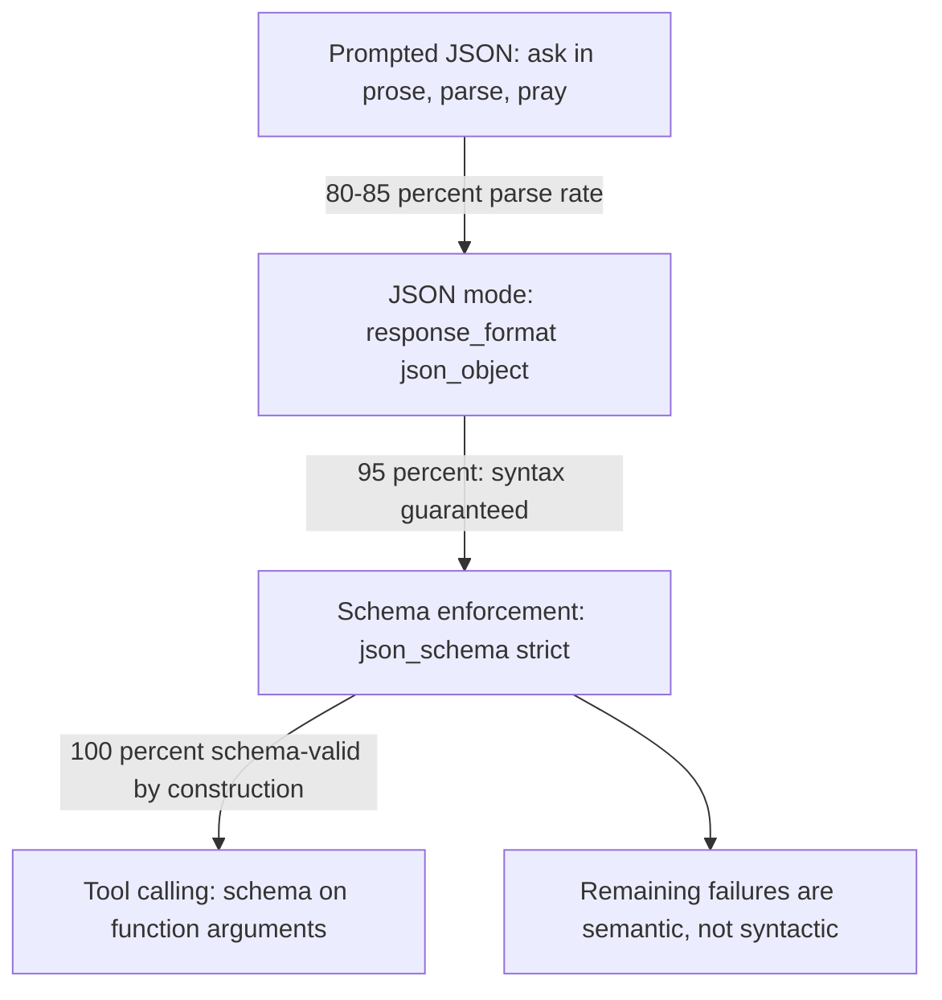
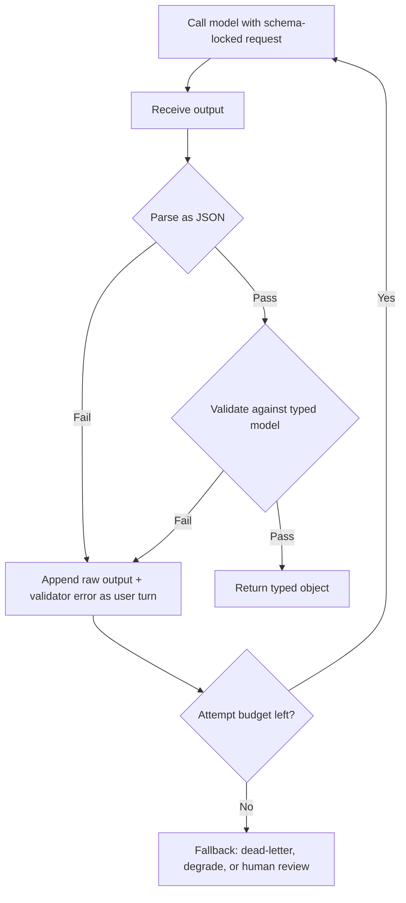
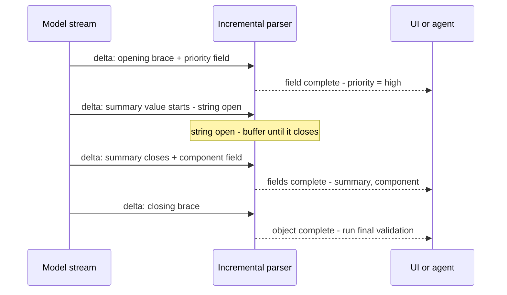

# Structured Output Patterns: JSON Mode, Tool Calling, and Schema-First Design

## Overview

When downstream code consumes an LLM's output, the prompt stops being prose and becomes a contract: the model must emit data that parses, validates, and matches a schema — every request, not most requests. The engineering ladder for that contract has four rungs, and the reliability numbers are stark: prose-requested JSON parses in the 80–85% range in the field, provider JSON mode lifts that to roughly 95%, and schema enforcement (constrained decoding under the hood) makes invalid output impossible *by construction*. This page is the API-and-application layer of that story: when to use JSON mode versus tool calling versus schema-first design (Pydantic/Zod models as the single source of truth), how retry-with-error loops recover semantic failures, how streaming and partial-JSON parsing work, and the operational practices that keep structured output reliable at scale. The decoding-layer mechanics — FSM and CFG logit masking, XGrammar-style mask caching, tokenizer boundary traps — live in [Constrained Decoding](../advanced/structured-output-decoding.md); this page treats that machinery as a black box and focuses on the contracts around it.

## The Reliability Ladder

Four rungs, ordered by how much of the failure class each one eliminates:



| Rung | Mechanism | Guarantee | Failure class remaining | Portability |
|---|---|---|---|---|
| Prompted JSON | Instructions + client-side parse | None | Markdown fences, prose wrap, invalid escapes | Universal |
| JSON mode | Provider constrains output to syntactic JSON | Valid JSON | Wrong shape, missing fields, wrong types | Most providers |
| Schema enforcement | Provider runs constrained decoding against your JSON Schema | Schema-valid output | Semantic validity only | Provider-specific flags |
| Tool calling | Schema attached to a function/tool definition | Args schema-valid; model decides to call | Same as schema + decision to call | Universal in agentic APIs |

The ladder's economics favor climbing as high as the provider allows: each rung removes a failure class that retries would otherwise pay for on every request. One caveat keeps the ladder honest — "100% by construction" is a *syntactic* guarantee. A schema-valid response can still contain `"priority": "high"` on a ticket that is obviously low priority, so validation never ends at the schema boundary. The remaining failures are semantic, and they are attacked with prompt design, grounding, and post-parse business rules rather than with stricter grammars.

## Prompted JSON and Its Failure Modes

The lowest rung — "return only valid JSON with these fields" — is still the right choice for portable libraries, providers without schema features, and quick prototypes. Its failure modes are predictable enough to enumerate, and every one of them shows up in the logs of a system that relies on it. The model wraps the object in a markdown code fence; it appends a helpful sentence before or after the JSON; it emits unescaped newlines or control characters inside string values; it invents a field name close to but not matching the schema; under sampling temperature it truncates or doubles a bracket. Parse-time defenses (strip fences, extract the outermost object, tolerate trailing prose) recover most of these, which is why the field rate lands at 80–85% rather than far lower — but every recovery is code you own forever, and the residual 15–20% is a retry loop that costs latency and tokens on its worst days.

Two practices make the low rung as good as it can be, and they are worth knowing because they carry upward. *Show the shape, not just the rules*: a literal output skeleton (keys, value types, an example value) beats a paragraph of description, for the same reason exemplars beat instructions in [Few-Shot Example Selection](./few-shot-example-selection.md). *Parse defensively but never silently*: a repair that accepts almost-JSON must log what it repaired, or the schema drifts invisibly. And know when to stop climbing — if the provider has no schema features (some local runtimes, older deployments), prompted JSON plus a strict validator plus one retry is a legitimate production configuration, not a compromise to apologize for.

The defensive parser for this rung is small, and every line of it encodes a real observed failure:

````python
import json, re

def extract_json(text: str) -> dict:
    # 1) strip markdown fences the model wrapped around the object
    text = re.sub(r"^```(?:json)?\s*|\s*```$", "", text.strip())
    try:
        return json.loads(text)
    except json.JSONDecodeError:
        pass
    # 2) slice from first brace to last brace: drops prose wrap
    start, end = text.find("{"), text.rfind("}")
    if start >= 0 and end > start:
        return json.loads(text[start:end + 1])   # may still raise -> retry
    raise ValueError("no JSON object found in output")
````

What the snippet does not fix is instructive: a truncated object (missing closing brace) needs a retry rather than a repair, doubled keys are silently last-wins in Python and should be detected, and every fallback path here must increment a metric — an extraction layer that "always works" is a layer whose failure rate you are measuring incorrectly.

## JSON Mode: Syntax Guaranteed, Shape Not

JSON mode (`response_format={"type": "json_object"}` on OpenAI-compatible APIs and equivalents elsewhere) constrains the model to emit syntactically valid JSON and nothing else. That single guarantee eliminates the fence-and-prose failure class entirely, which is why it routinely lifts parse rates to the mid-90s — the remaining failures are *shape* failures: missing required fields, wrong types, an extra nested level, or an enum value the model paraphrased. Providers add quirks: OpenAI historically required the word "JSON" somewhere in the prompt when JSON mode is active, and some models produce empty objects when the schema isn't stated in the prompt. The correct mental model is "JSON mode buys the parser, not the contract": you still supply the shape (prompt text or schema), and you still validate against a typed model before the data touches business logic.

Where JSON mode earns its keep is the middle of the ladder — portability without full schema support, or shapes too dynamic to express as a fixed schema (a "return the fields you find" extraction). Its operational risk is the illusion of safety: teams see 95% parse success, remove their validators, and the 5% that remains is exactly the failure class — shape errors — that the validator existed for. Keep the typed-model validation regardless of the mode; the parse rate is a property of the transport, not of your contract.

Provider behavior differs enough to matter for portable systems:

| Provider behavior | Detail |
|---|---|
| Prompt must mention JSON | OpenAI-compatible APIs historically require the word "JSON" in messages when JSON mode is active |
| Shape hint still needed | Without a schema or example in the prompt, some models emit minimal or empty objects |
| No schema validation | JSON mode constrains syntax only; field checks stay client-side |
| Streaming compatible | Output streams as normal text deltas; incremental parsing applies |
| Not a strict-mode substitute | `json_schema` strict is a different request parameter with different guarantees |

## Schema Enforcement: Strict Structured Outputs

The top rung passes a JSON Schema to the provider (`response_format={"type": "json_schema", "json_schema": {..., "strict": true}}` on OpenAI; equivalent features on Anthropic, Gemini, and open stacks), and the server runs constrained decoding against it — every token is masked against the grammar before sampling, so output *cannot* violate the schema. The mechanism is exactly the one documented in [Constrained Decoding](../advanced/structured-output-decoding.md); from the API layer you see three consequences. First, the provider's claim is total schema adherence — OpenAI documents the feature as guaranteed — so parse-and-retry code for syntax becomes dead weight; what remains is semantic validation. Second, providers accept a *subset* of JSON Schema: unsupported keywords, limited `oneOf`/`anyOf` shapes, `additionalProperties: false` required, and on some APIs all fields must be listed as required (optionality is expressed as nullable unions instead). Third, schema compilation has a cost on first use — a large schema can add seconds of compile time — which is why schemas are versioned artifacts and pre-compiled, not ad-hoc strings rebuilt per request.

The engineering that strict mode rewards is *schema design*, and the rules are consistent across providers:

| Schema design rule | Why | Example |
|---|---|---|
| Enums over free strings | Constrained choices can be masked exactly; free strings invite drift | `"priority": {"enum": ["low","med","high"]}` |
| Required over optional | Optional fields are where models omit data; nullable unions are cleaner | All keys present, values nullable |
| Bounded arrays | Unbounded lists produce unbounded latency and cost | `"maxItems": 10` |
| Descriptions on every field | Descriptions are prompt tokens the model reads | `"description": "ISO 8601 date, UTC"` |
| Flat over deeply nested | Deep nesting grows grammar size and compile time; hurts field quality | Prefer two levels where possible |
| No free-form `object` catches | `"additionalProperties": true` islands are untyped and unvalidated | Model every field you need |

## Tool Calling as an Output Contract

Tool calling attaches a JSON Schema to a named function and lets the model emit `{"name": ..., "arguments": {...}}` — with the arguments constrained by the same masked-decoding machinery. It is the universal interface for agentic systems ([Tool Calling](../../ml/agents/tool-calling.md) covers the mechanics and the execution loop), but it doubles as an extraction pattern: define a pseudo-tool like `submit_ticket(summary, priority, component, effort_days)` and force it with `tool_choice`, and you have schema-enforced output with a semantic wrapper the model understands natively. The arguments arrive as a JSON *string* on most APIs, so parsing and validation still apply client-side; what you gain over prompted JSON is the constraint guarantee plus excellent provider-side streaming of argument deltas.

The choice between tool calling and `response_format` schema enforcement is about *who decides*, not about syntax quality. Tool calling fits when the model should choose among actions (agentic loops, router patterns) or when you want the semantic affordance of a named operation; response-format schemas fit pure extraction where the model has no choice to make and you want the output bound to the response object rather than to a call. Under the hood the guarantee is the same, and provider implementations increasingly share one constrained-decoding backend for both — which is why a schema that compiles cleanly for one usually compiles cleanly for the other.

The forced-extraction pattern is small enough to show directly:

```python
tools = [{
    "type": "function",
    "function": {
        "name": "submit_ticket",
        "description": "File the classified support ticket",
        "parameters": Ticket.model_json_schema(),   # the Pydantic contract
    },
}]
resp = client.chat.completions.create(
    model="gpt-4o-2024-08-06",
    messages=messages,
    tools=tools,
    tool_choice={"type": "function", "function": {"name": "submit_ticket"}},
)
args = json.loads(resp.choices[0].message.tool_calls[0].function.arguments)
ticket = Ticket.model_validate(args)      # semantic validation still applies
```

`tool_choice` forcing is the load-bearing line: without it, the model may answer in prose instead of calling, which reintroduces the failure class the schema was meant to remove. With it, the request behaves like a function call that returns a typed object — the interface many teams prefer for extraction even when no real tool exists.

## Schema-First with Pydantic (and Friends)

The schema-first pattern makes a typed model the single source of truth, and derives everything else from it: the JSON Schema sent to the provider, the validation applied to responses, and the typed object your code consumes. In Python, Pydantic is the lingua franca; in TypeScript, Zod plays the same role; libraries like Instructor wrap provider SDKs so the model looks like a function returning your type:

```python
from pydantic import BaseModel, Field
from typing import Literal
from instructor import from_openai
from openai import OpenAI

class Ticket(BaseModel):
    summary: str = Field(description="One-sentence summary, under 120 chars")
    priority: Literal["low", "medium", "high"]
    component: Literal["billing", "shipping", "product", "other"]
    effort_days: float = Field(ge=0, le=20, description="Estimated effort in days")

client = from_openai(OpenAI())          # retries and validation wired in
ticket = client.chat.completions.create(
    model="gpt-4o-2024-08-06",
    response_model=Ticket,              # schema + validation + retry loop
    messages=[{"role": "user", "content": raw_complaint}],
    max_retries=2,
)
print(ticket.priority)                  # typed, validated, IDE-navigable
```

What the library does under the hood is exactly the two patterns this page recommends separately: derive the JSON Schema from the model, request strict schema enforcement when the provider supports it, validate the response against the model, and on validation failure feed the error text back for a repair attempt. Adopting it does not remove the obligation to understand those pieces — schemas still need design discipline, retries still cost money, and semantic failures still need a human or a different technique. The gain is that the contract lives in one typed, reviewable, version-controllable artifact instead of being smeared across prompt text, parsing code, and validation logic that drift apart.

The same pattern in TypeScript with Zod, for teams whose consumers are JS services:

```typescript
import { z } from "zod";

const Ticket = z.object({
  summary: z.string().max(120),
  priority: z.enum(["low", "medium", "high"]),
  component: z.enum(["billing", "shipping", "product", "other"]),
  effort_days: z.number().min(0).max(20),
});

const resp = await client.chat.completions.create({
  model: "gpt-4o-2024-08-06",
  response_format: { type: "json_schema", json_schema: {
      name: "ticket", strict: true, schema: zodToJsonSchema(Ticket) }, },
  messages,
});
const ticket = Ticket.parse(JSON.parse(resp.choices[0].message.content));
```

The cross-language point is the architecture, not the library: the schema artifact is typed in the application language, generates the wire format, and validates on receipt — three jobs that would otherwise be three sources of truth. Whether the wrapper is Instructor, a provider SDK's native schema support, or hand-rolled code, the properties to preserve are *single source*, *strict by default*, and *validation on receipt*.

## The Validate-Retry Loop

Even at the top rung, semantic validation fails sometimes, and the recoverable cases share one shape: the model can fix its own output if shown the validator's complaint. The loop is:



Three design rules separate working retry loops from expensive ones. *Budget attempts, then degrade*: two to three attempts is the ceiling — past that, the failure is almost always the prompt, the schema, or the task, and more retries just multiply cost; the fallback path (a default value, a queue for human review, a route to a stronger model) must exist and be monitored. *Feed the error verbatim*: `"priority must be one of low, medium, high (got 'High priority')"` is a repair instruction the model can execute precisely; a generic "invalid output, try again" is not. *Distinguish syntax from semantics*: syntax errors vanish once strict mode is on, and what remains — wrong priority, hallucinated component, out-of-range effort — rarely self-repairs because the model believes its answer; those need grounding (retrieve the real component list), a better model, or acceptance of a confidence score rather than a third retry.

The cost math keeps the loop honest. Each retry re-pays the full input (which caching discounts) and adds output tokens, so a system retrying 20% of requests twice pays roughly 1.4x the intended input bill — visible in any dashboard once attributed per schema version. This is the quantitative argument for climbing the ladder: strict mode's one-time schema design effort replaces a permanent retry tax, and the retries that remain are spent on semantic cases where they actually have a chance.

## Streaming Partial JSON

Structured output and streaming seem incompatible — a JSON object is not valid until its final brace — but user experience demands first tokens immediately, so the field has developed partial-JSON handling. The core trick is an *incremental parser*: a state machine that consumes the JSON stream token by token and reports each key whose value has become complete, tolerating the in-between states (a string still open, a number cut mid-token) that normal parsers reject. Libraries expose this as an iterator of stable prefixes; Instructor's `partial` mode goes further and re-validates the model as fields complete, so a UI can render `{"priority": "high", "summary": "..."}` progressively and run business logic the moment the fields it needs are done. Tool-call streaming works the same way: argument deltas arrive as string fragments, and the client assembles and incrementally parses them.



Three rules keep streaming structured output safe. *Nothing is final until the last brace*: partial objects drive rendering and progress, but business actions wait for the complete, fully validated object — a token-cap cutoff mid-stream is a parse failure by definition. *Expect the distribution to shift*: constrained JSON streams differently from free text (structural tokens arrive whether or not the model "wants" them), so measure perceived latency against the real prompt, not against the unconstrained baseline. *Buffer at semantic boundaries*: for UI rendering, emit on completed field boundaries rather than raw tokens, or the interface flickers through half-written values — the incremental parser's completion events, not the raw deltas, are the right event source.

## Reliability Practices in Production

| Practice | Detail | Failure it prevents |
|---|---|---|
| Version schemas like APIs | Additive changes only; new fields nullable; bump and log the schema hash | Silent breakage of downstream consumers |
| Validate semantically, always | Schema-valid ≠ correct: enums, ranges, cross-field rules in a typed model | Confident garbage ("priority: high" on trivia) |
| Monitor per schema version | Parse failures, validation failures, retry rate, repair success | Regressions hiding in aggregate rates |
| Golden-set semantic evals | Format compliance *and* field-level accuracy on 50–200 real inputs | Shipping a schema that parses and lies |
| Keep business validators | The grammar is a pre-filter; post-parse rules stay | Constraint bypass via valid-but-wrong values |
| Precompile / warm schemas | Compile at deploy time or first request per version | Multi-second cold-start latency spikes |
| Log raw output on failure | Sample the offending completions per version | Un-debuggable "validation failed" telemetry |
| Temperature discipline | Low temperature for extraction; measure format stability at your setting | Sampling noise blamed on "the model" |

Two of these deserve expansion because they are where audits find gaps. *Semantic validation* is the continuation of the constrained-decoding page's third trap: the grammar enforces membership in the language, not correspondence with reality, so the typed model's validators (enum, range, cross-field consistency, a lookup against the real component list) are the actual contract — the schema just guarantees the data is checkable. *Monitoring per schema version* is what makes structured output debuggable: when validation failures jump, the first question is "which schema version, which field, and what did the model actually emit," and a pipeline that logs the schema hash alongside sampled raw outputs answers it in minutes; one that only logs a boolean does not.

The composite picture for a production route is then: Pydantic model (source of truth) → strict schema enforcement at the provider (syntax impossible to violate) → typed validation with business rules (semantic contract) → bounded repair loop for the recoverable minority → dead-letter and human review for the rest → per-version metrics on every stage. Each stage removes a failure class the next one would otherwise pay for, and each is independently monitorable — which is the definition of an engineered contract rather than a hopeful prompt.

The stage-level metrics, for the dashboard:

| Stage metric | Definition | Alert threshold |
|---|---|---|
| Parse failure rate | Outputs failing JSON parsing per schema version | > 0.1% under strict mode (should be impossible); > 5% under JSON mode |
| Validation failure rate | Parse-passing outputs failing the typed model | > 1–2% per route |
| Repair success rate | Retries that end in a valid object | < 50% means the loop is masking a prompt problem |
| Retry overhead | Retry tokens / total tokens per route | > 10% without a corresponding failure spike means broken upstream |
| Dead-letter rate | Requests ending in fallback | > 0.5% is a task/schema fit problem, not noise |
| Cold-start compile time | First-request latency per new schema hash | > 1s means schemas need deploy-time precompilation |

Finally, a boundary worth stating in design reviews: structured output is the wrong tool when the output's consumer is a human reading prose — reports, explanations, creative writing — where a schema adds cost and constraint with nothing to parse. The technique's entire value exists at the code boundary; inside that boundary it is the highest-leverage reliability change available to an LLM pipeline.

## Interview Questions

1. **Your pipeline needs JSON from an LLM. What are the options, and which do you pick?** Four rungs, in ascending guarantee: prompted JSON (portable, ~80–85% field parse rate, endless defensive parsing), JSON mode (syntax guaranteed, shape not — validate anyway), strict schema enforcement (provider-side constrained decoding against your JSON Schema — invalid output impossible by construction), and tool calling (same constraint machinery on function arguments, plus the model's semantic affordance of "calling" an operation). Pick the highest rung the provider supports: schema-first with a Pydantic/Zod model as the source of truth, tool calling when the model should choose among actions. The deciding principle: output consumed by code should be constrained, not requested — each rung removes a failure class that retries otherwise pay for on every request.
2. **Does schema enforcement mean you can delete validation?** No — it means you can delete *syntax* validation. Constrained decoding guarantees membership in the grammar's language, which is syntactic: `"age": -999999999` satisfies an integer grammar, and a hallucinated component name satisfies a string schema. The remaining failures are semantic (valid JSON, wrong content), and they move downstream to typed-model validation — enums, ranges, cross-field rules, lookups against real reference data. The mature position: the schema makes output *checkable*, the typed model makes it *checked*, and the golden set makes it *measured*.
3. **Design a retry-with-error loop for structured output. What do you feed back, how many times, and what happens on the last failure?** Feed the raw output plus the validator's error message verbatim, as a user-turn correction — "priority must be one of low, medium, high; you returned 'High priority'" is a fixable instruction, while "invalid output" is not. Budget two to three attempts; each retry re-pays the input, so a route retrying 20% of traffic twice pays ~1.4x the intended input bill. Distinguish error classes: syntax errors disappear under strict mode, and semantic errors rarely self-repair (the model believes its answer), so the last failure must hit a real fallback — default value, dead-letter queue for human review, or escalation to a stronger model. Monitor retry rate and repair success per schema version; a rising repair rate is a prompt or schema problem wearing a retry costume.
4. **How does streaming work for structured output — isn't JSON all-or-nothing?** The stream is parsed incrementally by a state machine that tolerates intermediate states (open strings, cut numbers) and emits *field-completion* events: as soon as `"priority": "high"` closes, that field is stable and renderable, while the still-open string fields are buffered. Instructor-style partial validation can even validate the object as fields complete, so agents can act the moment the fields they need arrive. The rules that keep it safe: nothing is final until the last brace (a token-cap cutoff is a parse failure), business actions run only on the fully validated object, and UIs should consume field-completion events rather than raw deltas to avoid flickering half-written values. Tool-call streaming assembles argument deltas the same way.
5. **What are the restrictions and sharp edges of provider strict modes?** Providers accept a JSON Schema subset: unsupported keywords, limited union shapes, `additionalProperties: false` required, and on some APIs all fields required (optionality via nullable unions). Schema compilation costs real time on first use — large schemas can add seconds, so schemas are versioned deploy-time artifacts, not per-request strings. Constrained output can also read differently from free decoding (masking renormalizes the model's distribution), and a model that "wants" to stop can't until the structure closes — so every grammar pairs with a max-tokens budget and a boundary validity check. Finally, strict mode is per-provider: portable libraries still need the JSON-mode and prompted rungs for providers without the feature.
6. **How do tool calling and `response_format` schema enforcement differ, and when do you use each?** Mechanically they converge — both constrain generation against a JSON Schema with the same masked-decoding machinery. The difference is decision rights: tool calling hands the model a menu of named operations and lets it choose (then fills arguments under constraint), which is the natural shape for agentic loops, routers, and any flow where "does the model act, and how" is part of the task. `response_format` removes the choice and binds the output directly to the response object, which is the natural shape for pure extraction where the model has exactly one job. Use tool_choice forcing when you want the tool interface's semantics without the choice; use response-format schemas when there is no meaningful choice to force.

## Key Takeaways

- Output consumed by code is a contract, not a request: climb the ladder (prompted JSON ~80–85% → JSON mode ~95% → schema enforcement 100%-by-construction) as far as the provider allows.
- Strict schema enforcement is provider-side constrained decoding — the same FSM/CFG masking as open stacks wrapped in an API flag; JSON mode guarantees syntax, not shape; schema enforcement guarantees shape, not semantics — typed validation never goes away.
- Schema design is prompt engineering: enums, required-with-nullable, bounded arrays, descriptions on every field, flat structures, no free-form object islands.
- Pydantic/Zod schema-first gives one typed artifact that generates the schema, validates responses, and documents the contract; Instructor-style wrappers wire the retry loop.
- Retry-with-error loops feed the validator message verbatim, cap at 2–3 attempts, distinguish syntax from semantic failures, and always have a monitored fallback.
- Streaming structured output works via incremental parsers emitting field-completion events; nothing is final until the last brace and full validation.
- Version schemas like APIs, monitor parse/validation/retry rates per schema version, precompile schemas, and keep business validators — the grammar is a pre-filter.
- Tool calling vs response-format schemas is about decision rights, not syntax: menu-of-actions vs single extraction contract.

## References

- OpenAI Structured Outputs guide — https://platform.openai.com/docs/guides/structured-outputs
- OpenAI Function Calling guide — https://platform.openai.com/docs/guides/function-calling
- Instructor documentation (Pydantic-first structured output with retries) — https://python.useinstructor.com/
- Outlines (open-source structured generation) — https://dottxt-ai.github.io/outlines/
- JSON Schema specification — https://json-schema.org/
- Pydantic documentation — https://docs.pydantic.dev/latest/
- Anthropic tool use documentation — https://docs.claude.com/en/docs/build-with-claude/tool-use
- Willard & Louf, "Efficient Guided Generation for Large Language Models" (Outlines), 2023 — https://arxiv.org/abs/2307.09702
- OpenAI Cookbook (structured output and function-calling examples) — https://cookbook.openai.com/

## Cross-References

- [Constrained Decoding](../advanced/structured-output-decoding.md) — the decoding-layer machinery (FSM/CFG masks, XGrammar, cost model) behind every rung of this ladder
- [Tool Calling](../../ml/agents/tool-calling.md) — the agentic execution loop, tool schemas, and parallel-call mechanics
- [Guardrails](../agentic/guardrails.md) — where output validation sits in the broader input/output defense architecture
- [Few-Shot Example Selection](./few-shot-example-selection.md) — demonstrations as a format-teaching device when schemas are unavailable
- [Prompt Engineering for Production Systems](../prompt-engineering.md) — versioning, evaluation, and lifecycle around these contracts
- [Agent Protocols](../agentic/agent-protocols.md) — structured tool and message schemas at the protocol layer
