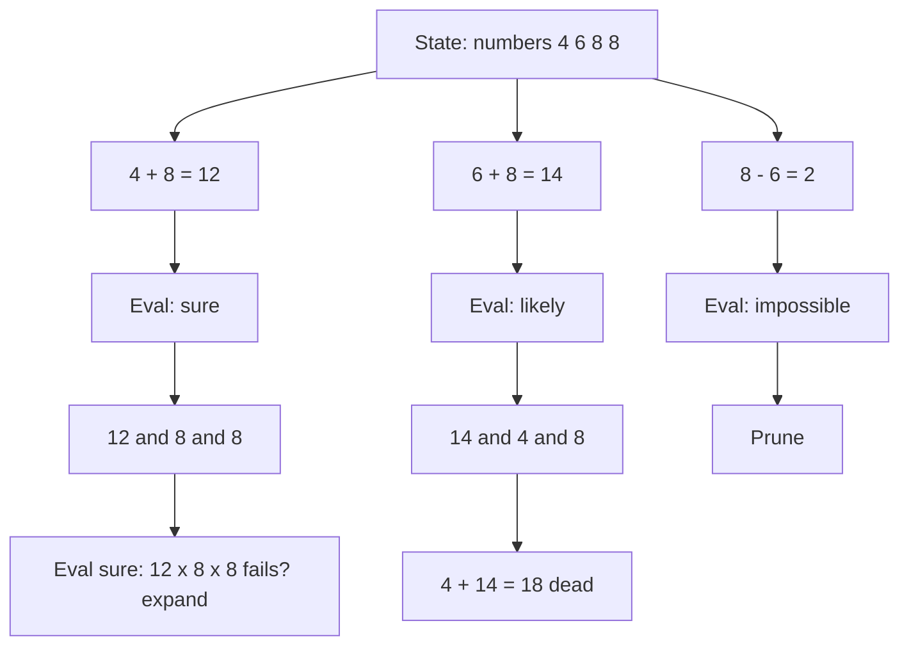
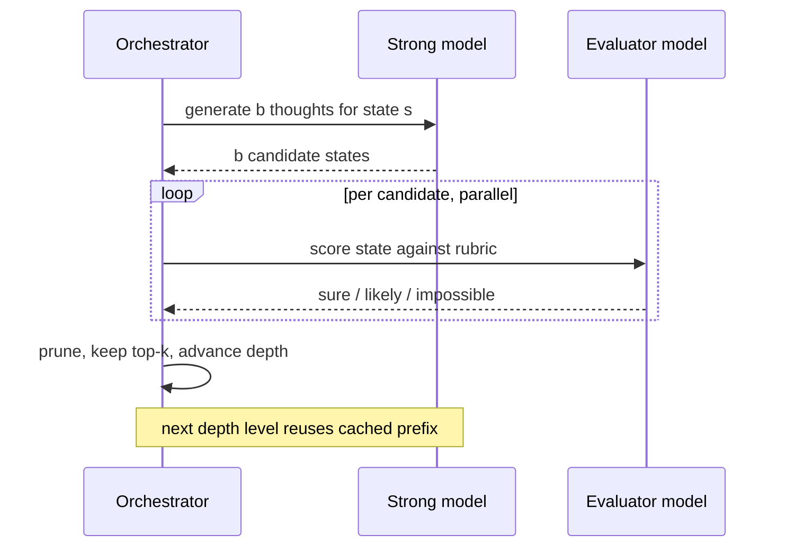
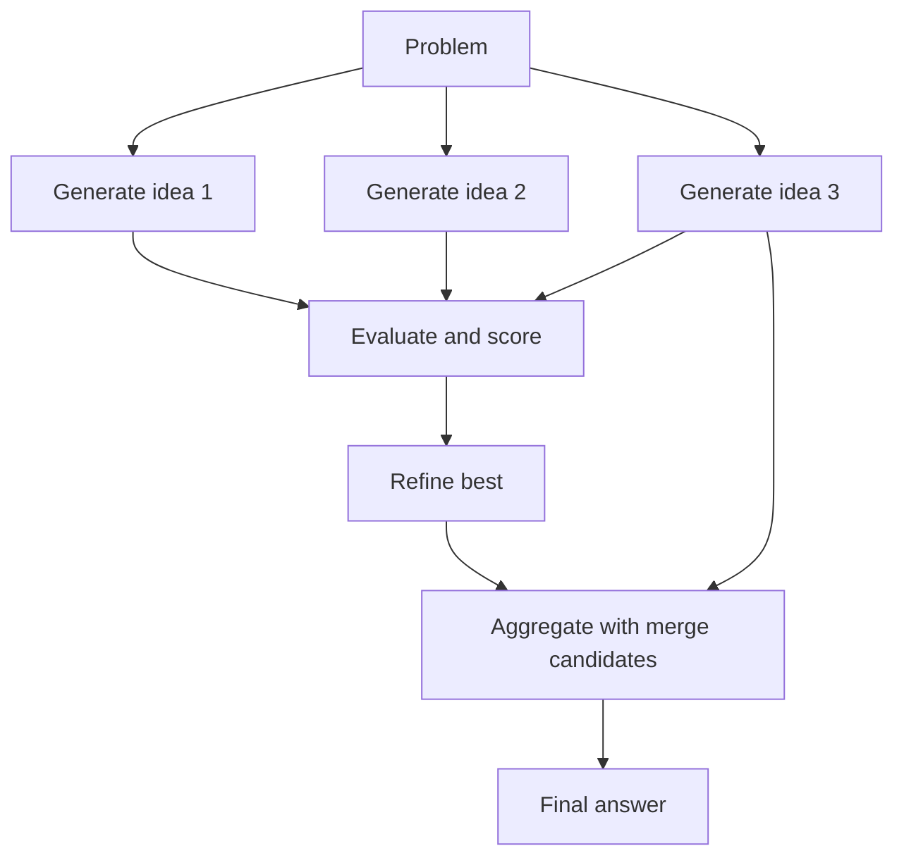

# Tree of Thoughts and Graph of Thoughts: Search Over Reasoning

## Overview

Tree of Thoughts (ToT) and Graph of Thoughts (GoT) turn language-model reasoning from a single sampled chain into an explicit search over *thought states*: the model generates candidate intermediate steps, scores them, expands the promising ones, and backtracks from the rest. This page covers the mechanics (generate–evaluate–search with BFS/DFS), the request-cost model that makes or breaks these techniques in production, GoT's aggregation and refinement structure, the best-of-N comparison, and the MCTS lineage. The conceptual overview lives in [Tree-of-Thought](../../ml/agents/tree-of-thought.md); this page is the engineering treatment — where the cost multipliers come from, and when decomposition beats raw CoT by enough to justify 10x–100x more model calls. The interview hook is almost always the same one: can you price the search before you run it, and can you say what signal the search is actually exploiting?

## Why Search Enters the Picture

CoT and self-consistency share a structural weakness: every token of the chain conditions on the tokens before it, so one wrong early step contaminates the entire downstream chain, and no vote can fix *correlated* errors that stem from the same early commitment. Search fixes exactly this. By holding multiple candidate thought states simultaneously, evaluating them before expanding, and backtracking from bad branches, the system converts "reason in one pass" into "explore, evaluate, commit". The ToT paper's motivating result is stark: on the Game of 24 (combine four numbers with arithmetic to reach 24), GPT-4 with chain-of-thought solves 4% of instances, while ToT with the same model reaches 74% — not because the model got smarter, but because it stopped committing to its first idea.

This framing also explains the preconditions. Search helps when (1) intermediate states are *scoreable* — you can judge whether a partial solution is promising; (2) errors *compound* — early mistakes make later success unlikely; and (3) the solution space has *backtrackable structure* — you can undo a step and try another. When any precondition fails, ToT collapses into an expensive way to sample many wrong chains: unscoreable states make "evaluation" a coin flip, non-compounding errors make backtracking pointless, and flat answer spaces make self-consistency the cheaper amplifier (see [cot-and-self-consistency](./cot-and-self-consistency.md)).

A note on scope: ToT and GoT are orchestration patterns over ordinary model calls — no fine-tuning, no special API surface, just a driver program issuing many calls. That is simultaneously why they are easy to adopt (any application that can loop can run a search) and why their costs are easy to underestimate (nothing in the API forces you to budget the loop). The pages that follow on caching and compression apply directly to these workloads, because a search generates highly repetitive prompt prefixes.

## The ToT Loop: Generate, Evaluate, Search

ToT decomposes a problem into atomic *thought steps* — for Game of 24, one arithmetic expression; for creative writing, one passage plan — and treats each prefix of thoughts as a state. Four components define the framework:

| Component | Role | Game of 24 instantiation | Cost driver |
|---|---|---|---|
| Thought decomposition | Define one search step | Propose one equation on the current numbers | Step granularity vs call count |
| Thought generator | Produce b candidates per state | Sample 3 candidate equations per state | b generate calls per expanded node |
| State evaluator | Score each state's promise | Model votes "sure/likely/impossible" per state | 1 evaluate call per candidate |
| Search algorithm | Choose which states to expand | BFS (b=5, depth 3) or DFS with backtracking | Expansion order and pruning aggressiveness |



The "impossible" verdict in the diagram is itself a model output, not ground truth — which is the technique's built-in ceiling: pruning on a wrong evaluation discards the correct branch just as irreversibly as a wrong generation would have. Evaluator precision, not generator quality, is usually the binding constraint in deployed ToT systems, and it is the first thing to measure when the search underperforms its eval.

Two search disciplines dominate practice. **Breadth-first** expands all surviving states level by level (the paper's b=5, depth=3 configuration for Game of 24), giving the best coverage when the evaluator is reliable and the depth is small. **Depth-first with backtracking** commits to the most promising state, expands until the evaluator says "impossible", backtracks to the next-best sibling, and trades coverage for early answers — the paper applies DFS to creative-writing tasks where a coherent draft direction matters more than exhaustive comparison. In both cases the evaluator is the same model prompted to judge promise ("sure / likely / impossible" votes, aggregated across sampled judgments), which is why evaluator quality is the ceiling on the whole system.

### The Request Flow in Practice

Each expansion is an API call with a growing prompt: the task description, the few-shot thought templates, and the accumulated state path. Each evaluation is a separate call whose prompt contains the state and the scoring rubric. The loop, in the shape production code actually has:

```python
def tot_search(problem, b=5, d=3, beam=None):
    frontier = [State(prefix=[], remaining=problem)]
    for depth in range(d):
        candidates = []
        for state in frontier:                          # serial in depth
            thoughts = generate_thoughts(state, n=b)    # b parallel calls
            for t in thoughts:
                score = evaluate_state(extend(state, t))  # 1 call per candidate
                candidates.append((score, extend(state, t)))
        survivors = top_k(candidates, k=b)              # prune by evaluator
        if any(is_terminal(s) for _, s in survivors):
            return best_terminal(survivors)
        frontier = survivors
    return best_final(frontier)                         # vote over leaves
```

The concurrency profile falls out of the loop: the b generations and b evaluations *within a level* are parallel, but levels are not. A depth-3 search therefore costs at least three serial round-trip rounds, each internally parallel — the latency floor is d × RTT + rate-limit queuing, independent of how much you spend on tokens.



Splitting generation and evaluation across two models is drawn explicitly because it is the highest-leverage budget knob: the evaluator's rubric is simple enough for a small model, it receives the majority of calls, and its judgments bound the search's precision.

## The Cost Model

ToT's bill scales with branching, depth, and evaluation, and it is worth memorizing the arithmetic because interviewers probe exactly this. For branching factor b, depth d, and one evaluation call per candidate:

\\[
\text{calls} \approx \underbrace{d \cdot b}_{\text{generations}} + \underbrace{d \cdot b}_{\text{evaluations}} \;\Rightarrow\; \text{roughly } 2 \cdot b \cdot d \text{ calls, each with a growing state prompt}
\\]

For Game of 24 (b=5, d=3), that is on the order of 30–50 calls per puzzle in the optimistic case, with realistic implementations (multiple evaluation samples per state, restarts, pruning misses) landing around 100+ calls. Each call carries the accumulated state as context, so per-call input tokens *grow* with depth — total input tokens scale closer to \\( O(b \cdot d^2) \\). The worked comparison:

| Approach | Model calls per instance | Output tokens | Game of 24 accuracy (GPT-4) | Latency profile |
|---|---|---|---|---|
| IO prompt (direct) | 1 | ~50 | 7.9% | milliseconds |
| CoT | 1 | ~200–400 | 4% | sub-second |
| Self-consistency k=100 | 100 | ~20,000–40,000 | 58% | parallelizable |
| ToT (BFS b=5, d=3) | ~30–100+ | ~10,000+ (in generations + evaluations) | 74% | serial depth — hardest to parallelize |

Three readings of this table. First, CoT *underperforms* IO prompting on Game of 24 — the canonical demonstration that CoT hurts when free-form reasoning drifts from the task's algebraic structure. Second, self-consistency with a large k recovers a lot of accuracy but cannot exceed what the single-path distribution supports (58%), while search reaches 74% by changing what is sampled, not how often. Third, the serial dependency structure is the hidden cost: ToT's expansion of depth-level t+1 depends on evaluations at depth t, so unlike self-consistency it cannot be flattened into one parallel batch; p95 latency is governed by depth times round-trip time.

### A Worked Token Budget

Translate the call count into the bill. Assume a 1,200-token static prefix (task + few-shot thought templates), states averaging 200 tokens, 300-token generation responses, and 150-token evaluations. For b=5, d=3, one level at a time:

| Level | Generation calls | Generation input | Evaluation calls | Evaluation input |
|---|---|---|---|---|
| 1 | 5 | 5 × ~1,500 | 5 | 5 × ~1,700 |
| 2 | 5 | 5 × ~1,700 | 5 | 5 × ~1,900 |
| 3 | 5 | 5 × ~1,900 | 5 | 5 × ~2,100 |
| Total | 15 | ~25,500 in + ~4,500 out | 15 | ~28,500 in + ~2,250 out |

Roughly 54,000 input tokens and 7,000 output tokens per solved instance before retries — two orders of magnitude above a single CoT call. Every mitigation in the next section exists because of rows in this table: the static prefix is identical across all 30 calls (cache it), the state paths are repeated across sibling candidates (prefix-share them), and the evaluator prompts are smaller and templated (use a cheaper model for them).

## Graph of Thoughts

Graph of Thoughts (Besta et al., 2023) generalizes the tree by allowing arbitrary dependencies between thoughts: branches can *merge* (aggregate k partial solutions into one), thoughts can be *refined* in place (iteratively improve one state), and the graph can contain cycles. The primitive set is small — generate, aggregate, refine, and score — but the composition changes which problems fit. Sorting is the paper's canonical example: generate partial sorted runs in parallel, then *aggregate* them by merging, with each aggregation call halving the number of runs. A tree cannot express merge; a graph can. The generalization matters most where tasks have shared structure across branches — duplicate subproblems, mergeable partial answers, iterative polish — precisely the cases where a tree re-does work and a graph deduplicates it.

The GoT paper reports that on sorting, this structure beats ToT on both axes simultaneously — roughly +62% quality improvement at ~31% lower cost — because aggregation exploits the task's merge-friendly structure instead of re-deriving everything per branch. The transferable lesson is not the sorting number; it is that **the graph shape should mirror the task's decomposition algebra**: parallelizable independent subtasks → fan-out generation; associative combination (merging, union, voting) → aggregation nodes; quality-critical single artifacts (a document, a proof) → refinement chains. Deduplication and multi-objective problems (the paper's set-cover and document-merging examples) similarly map onto graph primitives.

### GoT Primitives Mapped to Operations

The framework is small enough to hold in one table, and the mappings are what interviewers look for:

| Primitive | Signature | Sorting use | Document-synthesis use |
|---|---|---|---|
| Generate | state → k children | Spawn partial sorted runs | Draft section per source cluster |
| Aggregate | k states → 1 state | Merge two sorted runs | Merge drafts into one doc |
| Refine | state → improved state | Insertion-fix a near-sorted run | Rewrite for coherence and style |
| Evaluate | state → score | Length-of-sorted-prefix score | Rubric score per rubric axis |

Aggregation is the only primitive a tree cannot express, and it is also the one that changes cost: merging k states into one replaces the re-generation that a tree would need to reconcile them, which is where the paper's 31% cost reduction comes from. Refinement is the cheapest quality lever per call — one call improves one artifact — and pairs naturally with an evaluate-refine loop that stops when scores plateau.



## Best-of-N, Verification, and the Cost Comparison

Best-of-N is the flat-space competitor: sample N complete solutions and return the best according to a verifier. It is simpler than ToT (no state decomposition, no evaluation loop), embarrassingly parallel, and its ceiling is set by the verifier's quality rather than by the model's intermediate judgment. The three amplifiers form a decision table:

| Amplifier | Signal used | Calls | Parallel? | Choose when |
|---|---|---|---|---|
| Best-of-N + verifier | External oracle on final answers | N | Fully | A cheap reliable verifier exists (tests, schemas, reward models) |
| Self-consistency | Consensus of full chains | k | Fully | Answers are comparable; no verifier; errors uncorrelated |
| ToT | Model's evaluation of intermediate states | ~2·b·d, serial in depth | Only within a level | Errors compound; states scoreable; backtracking meaningful |

A concrete price check on one instance (GPT-4-class pricing, $3/M input, $15/M output): best-of-N with a free verifier at N=10 costs roughly 10 × (1,500 input + 300 output) ≈ $0.009 + verification latency of one round trip. Self-consistency at k=10 costs about the same. ToT at b=5, d=3 costs ~$0.20+ from the token budget above — an order of magnitude more — and buys its accuracy only where the verifier signal does not exist. When someone proposes ToT for a task with a test suite attached, the table already answered the question.

The comparison that matters in interviews: best-of-N with a *strong* verifier dominates ToT on cost when one exists, because final-answer verification is one call per candidate and fully parallel. ToT earns its premium when no external oracle exists — the model's own judgment of *partial* states is the only signal available. The modern production pattern fuses them: search (or plain sampling) proposes, an external verifier disposes — for code generation, sample N programs and run the test suite; for reasoning, vote among test-passing candidates. Process reward models generalize this: a learned evaluator scores partial reasoning, effectively replacing ToT's prompted evaluator with a trained one, at which point "ToT" becomes best-first search over PRM scores. See [Process Reward Models](../post-training/process-reward-models.md) for the trained-evaluator side.

### Budget Knobs, Ranked by Leverage

Given the cost table above, these are the knobs that reduce the bill without materially hurting quality, in order of leverage:

1. **Evaluator model downshifting** — run generations on the strong model and evaluations on a cheap small model; evaluation is the majority of calls and its rubric is simple. Typical saving: 40–60% of total cost.
2. **Prefix caching** — the task description, thought templates, and state paths up to the branching point are shared across all calls at a level; structure prompts so the shared part comes first (see [prompt-caching](./prompt-caching.md)). Saving: input tokens drop toward 0.1x.
3. **Evaluator sample reduction** — the paper aggregates multiple "sure/likely/impossible" votes per state; 3 votes instead of 5 barely moves precision. Saving: ~1/3 of evaluation calls.
4. **Aggressive early pruning** — one extra evaluation sample at shallow depth, where the surviving set multiplies downstream cost, is worth several at depth.
5. **Depth before breadth** — most tasks have small minimal depth; halving d halves serial latency *and* call count, while halving b only affects call count.

The inverse rule: do not economize on the final-level selection. A weak leaf-selection step silently discards search gains, and it is one call — the cheapest place to spend on quality.

## Failure Modes and Diagnostics

| Symptom | Diagnosis | Fix |
|---|---|---|
| Search accuracy ≈ CoT accuracy | States unscoreable — evaluator is a coin flip | Improve rubric; or drop to self-consistency |
| Correct branch pruned at depth 1 | Low evaluator precision at shallow depth | Multi-vote evaluation; add exemplars for judging |
| Latency dominates the bill | Deep search, serial rounds | Reduce d; cache aggressively; cheaper evaluator model |
| Bill explodes on edge cases | No budget cap; search runs unbounded | Hard cap on calls and wall-clock; degrade to CoT on breach |
| Same wrong branch re-explored | No state statistics (ToT has none) | Track visited states; or adopt an MCTS-style loop |

The last row is the honest boundary of the framework: vanilla ToT learns nothing *across* a search — nothing accumulates except the current frontier. When that limitation bites (long searches, repeated near-duplicate states), the upgrade is a genuine MCTS loop with per-node statistics, which is exactly where the LLM-search hybrid research went.

## Relation to MCTS and Classical Search

ToT is deliberately a *framework* rather than one algorithm, and the paper names its lineage explicitly: it instantiates the same skeleton as A* (generate candidates, keep a frontier, expand by priority) and as Monte Carlo Tree Search. MCTS contributes the part ToT's prompt-only version lacks: a principled expansion policy. Where ToT expands uniformly or greedily by prompted score, MCTS balances exploitation and exploration via UCT, backs up statistics from rollouts, and allocates its simulation budget adaptively — ideas that reappear in LLM-search hybrids (LATS and successors) that run genuine MCTS where each node expansion and rollout is an LLM call. Two disanalogies are worth stating precisely. First, ToT's "value estimate" is a prompted judgment, not a learned statistic — no node statistics accumulate across the search, so the same bad branch can be re-explored. Second, rollouts in MCTS are cheap simulations; LLM rollouts cost full inference, so the UCT-style budget math must price tokens, not playouts. The productive mental model: ToT = search skeleton + LLM as generator and (weak, expensive) evaluator; the engineering work is improving evaluator quality and search policy on that skeleton.

The classical-search vocabulary also gives you the right defaults for free. When the evaluator is a good admissible-ish scorer, best-first expansion beats uniform BFS at equal call budgets. When the evaluator is noisy, keep the beam wider at shallow depths where pruning errors compound most. And when the task has repeated states, memoize — the graph structure of GoT is, from this angle, just memoization made explicit.

## When Decomposition Beats Raw CoT

The GoT and ToT literature, read together, gives a usable checklist for when structured decomposition beats a single chain. Decomposition wins when:

- **Global constraints bind distant parts of the solution.** Game of 24's product must equal 24; a crossword's rows and columns interlock; a schedule must satisfy every dependency. Local generation cannot see global constraints, but explicit states can be checked against them.
- **The task has a natural algebra.** Sorting merges; set-cover unions; document synthesis aggregates. If partial solutions compose, GoT's aggregation nodes pay for themselves.
- **Early commitment is the dominant failure.** Measure it: run CoT and record where wrong answers first diverge from recoverable states. If the first wrong step predicts the wrong answer with high probability, you need backtracking, not more samples.
- **Partial verification exists.** Any check that prunes — even a prompted "impossible" vote with 80% precision — shrinks the search space exponentially in depth.
- **The workload is offline or batch.** Searches tolerate retries, deep exploration, and full-model evaluation when nobody is waiting on the answer; the same technique that is unshippable at p95-sensitive interactive latency is routine in a nightly pipeline.

And decomposition loses when states are unscoreable (open-ended chat, single-hop QA), when the chain is short enough that backtracking has nothing to backtrack over, or when the task's cost ceiling cannot absorb a 10x–100x call multiplier. The pragmatic adoption path is sequential: direct answer → CoT → self-consistency → best-of-N with the best available verifier → ToT/GoT, adopting the next stage only when the current stage's *failure mode* (not its accuracy level) matches the next stage's mechanism.

### Planning as Search in Agent Systems

The same machinery reappears one level up in agent architectures: an agent that plans k candidate subtask orders, evaluates each against constraints, and expands the best is running ToT over *plans* instead of over arithmetic steps. The decomposition unit changes (tool calls, subgoals), the evaluator changes (feasibility checks, simulator feedback), but the cost math and the preconditions carry over verbatim. This is why the two chapters cross-link heavily: [Agent Planning](../../ml/agents/planning.md) covers the plan-level patterns (plan-and-execute, replanning), while this page supplies the search-theoretic underpinning and the budget discipline. A useful interview line: agents are where ToT's evaluator problem gets *easier* — tool feedback is a real oracle — and where the latency problem gets *harder*, because every serial search level multiplies an already-latency-heavy tool loop.

## Interview Questions

> Format note for this page: the questions assume you can already sketch the ToT loop; the answers focus on costs, signals, and failure modes — the parts that decide whether the loop should run at all.

1. **Why does ToT beat CoT so dramatically on Game of 24 (74% vs 4%)?** Game of 24 punishes exactly CoT's weakness: an early arithmetic commitment contaminates the whole chain, and free-form reasoning drifts from the algebraic structure — CoT actually scores *below* direct IO prompting (4% vs 7.9%). ToT instead holds five candidate equations per state, asks the model to judge each resulting state "sure/likely/impossible", prunes the impossible, and backtracks when a branch dead-ends. The model never gets more capable; it stops committing to its first idea. The transferable lesson is the precondition list: scoreable states, compounding errors, backtrackable structure — remove any one and ToT's advantage collapses into expensive sampling.
2. **Derive the call cost of a ToT search.** With branching factor b, depth d, and one evaluation per candidate: generation is b calls per expanded node, evaluation is b calls per level (one per candidate), so roughly 2·b·d calls total — for b=5, d=3 that is 30–50 calls, with realistic implementations (multiple evaluator samples, restarts, imperfect pruning) landing around 100+. Input tokens grow per call because each prompt carries the accumulated state, pushing total input closer to O(b·d²). Crucially the search is serial in depth — level t+1's expansion depends on level t's evaluations — so p95 latency is depth × round-trip, and you cannot flatten it into one parallel batch the way you can with self-consistency.
3. **What does Graph of Thoughts add over a tree, concretely?** Three primitives a tree lacks: aggregation (merge k partial solutions into one state), in-place refinement (improve a state iteratively), and arbitrary dependency edges including fan-in. The paper's sorting result — about +62% quality at ~31% lower cost than ToT — works because sorting is merge-friendly: partial sorted runs generated in parallel are *combined* by aggregation rather than re-derived per branch. The engineering rule: match the graph shape to the task's decomposition algebra — fan-out for independent subtasks, aggregation for associative combination, refinement chains for quality-critical single artifacts.
4. **When would you choose best-of-N with a verifier over ToT?** Whenever a cheap, reliable oracle exists for final answers: unit tests for code, schema and policy checks for extraction, reward models for preference-shaped outputs. Best-of-N is one parallel call per candidate, needs no state decomposition, and its quality ceiling is the verifier's, not the model's self-judgment — whereas ToT spends ~2·b·d serial-ish calls trusting the model to evaluate its own partial states. ToT is the choice when only the model can judge *partial* progress and errors compound. In production the pattern fuses: search or sample to propose, external verifier to dispose — and process reward models simply replace the prompted evaluator with a trained one.
5. **How is ToT related to MCTS, and where does the analogy break?** The skeleton is shared: frontier of candidate states, scoring, selective expansion, optional backtracking — the same machinery as A* and MCTS, as the paper states. LLM-search hybrids like LATS go further and run genuine MCTS with UCT-style expansion and statistical backup across the search. The analogy breaks at two points: ToT's evaluator is a prompted judgment with no accumulated node statistics (the same unpromising branch can be re-explored because nothing is learned across iterations), and a "rollout" costs a full LLM inference rather than a cheap simulation, so exploration-budget math must be denominated in tokens and dollars, not playouts.
6. **You inherit a pipeline using ToT on a task where it shows no gain over CoT. Diagnose.** Check the three preconditions in order. States: can the prompted evaluator actually distinguish promising from dead states — dump evaluator scores against eventual outcomes and measure precision; near-chance scores mean the search is a random walk. Error structure: do wrong chains diverge early (backtracking helps) or fail uniformly at the end (self-consistency is cheaper)? Constraint structure: are there global constraints or compositional partial solutions at all? Most often the diagnosis is that the task is single-step in disguise, and the right fix is to delete the search and spend the budget on a verifier or on better exemplar selection — a 100x call multiplier with no mechanism to exploit it is pure waste.

## Key Takeaways

- ToT adds explicit search to reasoning: generate b candidate thoughts per state, evaluate each, expand or backtrack — BFS for coverage, DFS with backtracking for early answers.
- Game of 24 is the canonical evidence: GPT-4 scores 4% with CoT (below 7.9% direct) and 74% with ToT; the mechanism is escaping early commitment, not added intelligence.
- Preconditions for ToT to pay: scoreable intermediate states, compounding errors, backtrackable structure — miss one and it degrades into costly sampling.
- Cost model: ≈ 2·b·d model calls (b=5, d=3 → 30–100+), input tokens growing toward O(b·d²), latency serial in depth — the opposite parallelism profile of self-consistency.
- GoT adds aggregation, refinement, and fan-in edges; sorting improves ~62% in quality at ~31% lower cost than ToT because merge-shaped tasks fit merge-shaped graphs.
- Best-of-N with a strong external verifier usually dominates on cost; ToT is for when only the model can score partial progress — production often fuses proposer and verifier.
- ToT is MCTS's skeleton without its statistics or cheap rollouts; hybrids (LATS) restore UCT-style expansion and learned evaluation.
- Adopt in sequence — direct → CoT → vote → verify → search — advancing only when the current stage's failure mode matches the next stage's mechanism.

## References

- Yao et al., "Tree of Thoughts: Deliberate Problem Solving with Large Language Models", NeurIPS 2023 — https://arxiv.org/abs/2305.10601
- Besta et al., "Graph of Thoughts: Solving Elaborate Problems with Large Language Models", AAAI 2024 — https://arxiv.org/abs/2308.09687
- Wei et al., "Chain-of-Thought Prompting Elicits Reasoning in Large Language Models", NeurIPS 2022 — https://arxiv.org/abs/2201.11903
- Wang et al., "Self-Consistency Improves Chain of Thought Reasoning in Language Models", ICLR 2023 — https://arxiv.org/abs/2203.11171
- Kojima et al., "Large Language Models are Zero-Shot Reasoners", NeurIPS 2022 — https://arxiv.org/abs/2205.11916
- Prompt Engineering Guide paper index (ToT/GoT entry points) — https://www.promptingguide.ai/papers
- Lilian Weng, "Prompt Engineering" (survey) — https://lilianweng.github.io/posts/2023-03-15-prompt-engineering/
- DSPy (programmatic prompting and optimizer loops) — https://dspy.ai/

## Cross-References

- [Tree-of-Thought](../../ml/agents/tree-of-thought.md) — the conceptual overview: branching intuition and worked BFS/DFS sketches
- [CoT and Self-Consistency](./cot-and-self-consistency.md) — the flat-space amplifiers this page compares against
- [Agent Planning](../../ml/agents/planning.md) — task decomposition and replanning in agent architectures
- [Process Reward Models](../post-training/process-reward-models.md) — trained evaluators that replace ToT's prompted scoring
- [LLM Agents in Production](../agents.md) — where search loops sit in a production request path
- [Agent Systems (advanced)](../advanced/agent-systems.md) — planning-with-search in the advanced agents chapter
