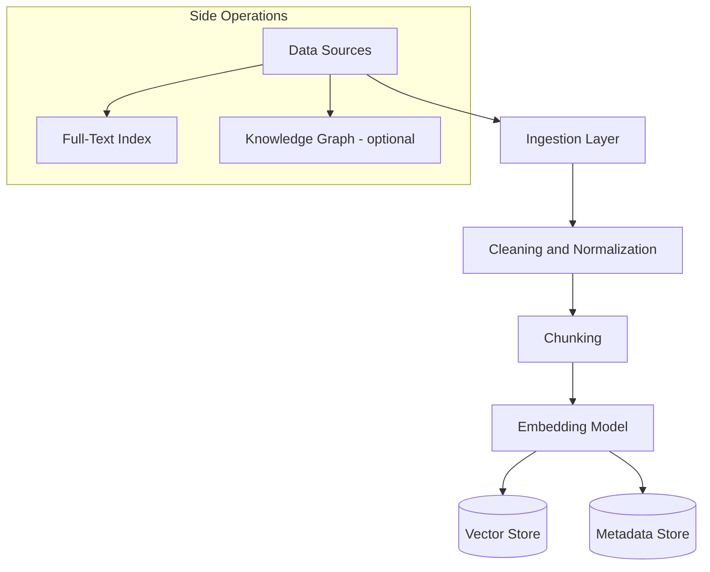
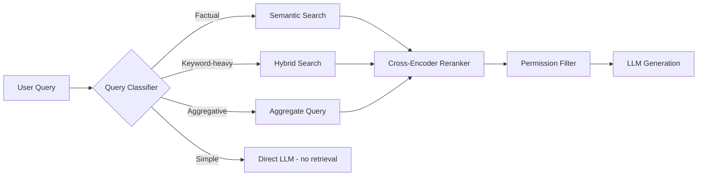

# RAG Systems: Architecture and Production Patterns

## Overview

This page covers production RAG system design — the infrastructure decisions, advanced retrieval patterns, and evaluation practices that distinguish a proof-of-concept from a reliable production system. For the core RAG pipeline (chunking, embeddings, vector search, reranking), see [rag.md](llm-serving/rag.md).

## RAG System Architecture

### Indexing Pipeline



| Component | Production Consideration |
|---|---|
| **Ingestion** | Incremental updates, not full reindex. Handle deletions and updates. |
| **Cleaning** | Remove boilerplate (headers, footers, nav), normalize whitespace, handle encodings |
| **Chunking** | Use recursive or semantic chunking with 10-20% overlap. Structure-aware for documents. |
| **Embedding** | Batch embed for throughput. Cache embeddings. Use async processing. |
| **Vector store** | Choose based on scale: Chroma for prototyping, Qdrant/Milvus for production, pgvector if you already run Postgres |
| **Metadata store** | Store document metadata (source, tenant, permissions, timestamps) alongside embeddings |

### Retrieval Pipeline



## Query Routing

Not every user query needs retrieval. Query routing classifies the incoming query and directs it to the appropriate retrieval strategy or decides to skip retrieval entirely.

| Query Type | Routing Strategy | Example |
|---|---|---|
| **Factual lookup** | Semantic search → RAG | "What is our refund policy?" |
| **Keyword-heavy** | Hybrid (BM25 + dense) | "Error code ERR-4092 in API v3" |
| **Aggregative** | Multi-query decomposition → parallel retrieval → synthesis | "Compare our Q3 and Q4 revenue drivers" |
| **Conversational** | Resolve coreferences from conversation history → retrieve | "What about the other one?" |
| **No retrieval needed** | Direct LLM response | "Translate this to French" |
| **Requires computation** | Code execution / calculator tool | "What is 15% of $43,200?" |

**Implementation:** A lightweight classifier (the LLM itself, or a small fine-tuned model) routes queries. LangChain's `RouterChain` and LlamaIndex's `QueryPipeline` provide framework support.

## Multi-Modal RAG

RAG is expanding beyond text to handle images, tables, audio, and structured data.

### Modality-Specific Strategies

| Modality | Embedding Approach | Chunking Approach |
|---|---|---|
| **Images** | CLIP, SigLIP, or multimodal embeddings | Per-image; optionally describe with VLM for text search |
| **Tables** | Convert to markdown/HTML, embed as text | Keep table as atomic unit; never split mid-row |
| **PDFs with mixed content** | Detect content type per page/region | Structure-aware: split by section headers, keep tables intact |
| **Audio/Video** | Transcribe → text RAG; or embed with multimodal models | Segment by speaker turn or fixed time windows |
| **Code** | Code-specific embeddings (CodeBERT, StarCoder) | Split by function/class boundaries |
| **Structured data (SQL)** | Text-to-SQL pipeline, not embedding-based | Schema descriptions as chunks; generate SQL → execute → return results |

### Late Chunking (Jina AI, 2024)

A newer approach where embedding is computed on the full document first, then chunked in the embedding space. This preserves long-range context that is lost when chunking text first. Particularly effective for documents where meaning spans chunk boundaries. Reference: [Jina AI Late Chunking](https://jina.ai/news/late-chunking-in-long-context-embedding-models/).

## RAG Evaluation: Operational Metrics

See [rag.md — RAG Evaluation](llm-serving/rag.md#rag-evaluation) for RAGAS framework metrics. This section covers operational evaluation for production systems.

### The Three Dimensions

| Dimension | Question | Metric |
|---|---|---|
| **Faithfulness** | Is every claim in the answer supported by retrieved context? | Claim-level verification (LLM-as-judge) |
| **Relevance** | Does the answer address the user's actual question? | Answer relevance score (RAGAS), user feedback |
| **Completeness** | Does the answer cover all aspects the user needs? | Reference-based recall against a gold answer |

### Building an Evaluation Pipeline

```python
# Pseudocode for a RAG evaluation harness

eval_dataset = [
    {"question": "...", "gold_answer": "...", "relevant_docs": ["doc_1", "doc_3"]},
    # 100-200 examples covering edge cases
]

for sample in eval_dataset:
    retrieved = rag_pipeline.retrieve(sample["question"])
    answer = rag_pipeline.generate(sample["question"], retrieved)

    metrics = {
        "context_precision": compute_context_precision(retrieved, sample["relevant_docs"]),
        "context_recall": compute_context_recall(retrieved, sample["relevant_docs"]),
        "faithfulness": verify_claims(answer, retrieved),  # LLM-as-judge
        "answer_relevance": score_relevance(answer, sample["question"]),  # LLM-as-judge
        "completeness": compute_completeness(answer, sample["gold_answer"]),
    }
```

### LLM-as-Judge Considerations

Using an LLM (often GPT-4) to evaluate faithfulness and relevance is standard practice, but introduces its own biases:

- **Position bias**: The judge prefers longer or first-presented answers. Mitigate with randomized order.
- **Verbosity bias**: Longer answers score higher. Mitigate by normalizing for length.
- **Self-preference**: A model rates its own outputs higher. Use a different model as judge.
- **Cost**: Evaluating 200 samples with GPT-4 costs money. Use a smaller model (Claude Haiku, GPT-4o-mini) for the judge.

## RAG Observability and Debugging

| What to Log | Why It Matters |
|---|---|
| **Query + retrieved chunks** | Debug retrieval failures (wrong chunks retrieved) |
| **Reranker scores** | Identify threshold issues (relevant chunk ranked too low) |
| **Full prompt sent to LLM** | Debug generation failures (model ignored context) |
| **LLM response + latency** | Track quality and performance over time |
| **Token counts** (input/output) | Cost tracking and budget alerts |
| **User feedback** (thumbs up/down) | Ground-truth signal for continuous improvement |

**Tools:** LangSmith, Phoenix (Arize), Langfuse, Traceloop, OpenTelemetry with custom LLM spans.

## Interview Questions

### Q1: How would you design a RAG system for a company with 10 million documents across multiple formats (PDF, HTML, Confluence, Slack)?
**Answer:** (1) **Ingestion**: Build a unified ingestion pipeline that normalizes each source into a common document format. PDFs need OCR for scanned pages; HTML needs boilerplate removal; Confluence/Slack need permission-aware extraction. (2) **Chunking**: Use structure-aware chunking — split by headers for documents, by message thread for Slack. Keep tables and code blocks as atomic chunks. (3) **Retrieval**: Hybrid search (dense + BM25) with cross-encoder reranking. Use pgvector or Qdrant depending on scale. (4) **Permissions**: Filter at retrieval time — each chunk carries metadata (tenant, document-level ACLs), and the retrieval query includes the user's access scope. (5) **Evaluation**: Build a golden test set of 200+ examples and track RAGAS metrics (context precision, faithfulness, answer relevance). (6) **Infrastructure**: Separate the indexing pipeline (batch, async) from the retrieval pipeline (real-time, synchronous).

### Q2: When would you use semantic caching in a RAG system?
**Answer:** Semantic caching stores the LLM's response for a query and returns it for semantically similar future queries. Use it when: (1) Users frequently ask the same questions (FAQ-style traffic), (2) The underlying documents don't change frequently, (3) Latency and cost reduction are priorities. The cache key is the query embedding; a threshold (e.g., cosine similarity > 0.95) determines cache hits. Trade-off: stale answers if documents are updated. Solution: invalidate cache entries when source documents change. Tools: GPTCache, custom Redis + embedding-based lookup.

### Q3: How do you evaluate whether your RAG system is actually useful?
**Answer:** Three levels: (1) **Component-level**: Retrieval metrics (MRR, context precision/recall via RAGAS) measure whether the right chunks are being found. (2) **Generation-level**: Faithfulness (is the answer grounded in context?) and answer relevance (does it address the question?) measured via LLM-as-judge. (3) **Task-level**: End-to-end metrics that matter to the business — task completion rate, user satisfaction (thumbs up/down), reduction in support tickets, time-to-resolution. Component metrics are necessary but not sufficient; always validate with real user feedback.

### Q4: What is query routing and why does it matter?
**Answer:** Query routing classifies incoming queries and selects the appropriate retrieval strategy. Not every query needs RAG — "translate this" should go directly to the LLM. Not every query needs the same retrieval — keyword queries benefit from BM25, while semantic queries need dense search. A router (lightweight classifier or the LLM itself) directs queries to: (1) no retrieval (direct LLM), (2) semantic search, (3) hybrid search, (4) multi-query decomposition, or (5) a tool/API. Routing improves both latency (skip unnecessary retrieval) and quality (use the right strategy for the query type).

## References

1. Lewis et al., "Retrieval-Augmented Generation for Knowledge-Intensive NLP Tasks", NeurIPS 2020
2. Gao et al., "Retrieval-Augmented Generation for Large Language Models: A Survey", 2024
3. Es et al., "RAGAS: Automated Evaluation of Retrieval Augmented Generation", 2023
4. Jina AI, "Late Chunking in Long-Context Embedding Models", 2024
5. Asai et al., "Self-RAG: Learning to Retrieve, Generate, and Critique through Self-Reflection", ICLR 2024

## Cross-References

- [Core RAG Pipeline →](llm-serving/rag.md) Chunking, embeddings, retrieval, reranking
- [Vector Databases →](llm-serving/vector-databases.md) Vector store selection
- [Prompt Engineering →](prompt-engineering.md) RAG prompt design
- [LLM Security →](llm-security.md) RAG security (LLM08: vector weaknesses)
- [Cost Optimization →](cost-optimization.md) Caching and model routing for RAG
- [Embeddings →](llm-serving/embeddings.md) Embedding model selection
