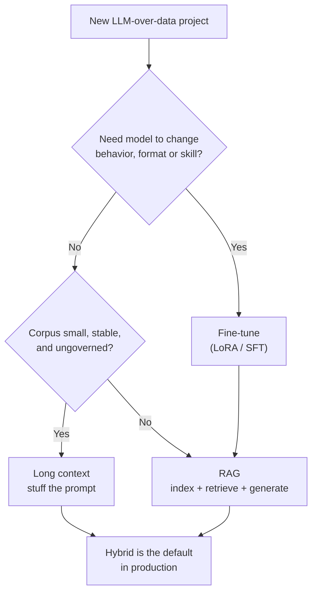
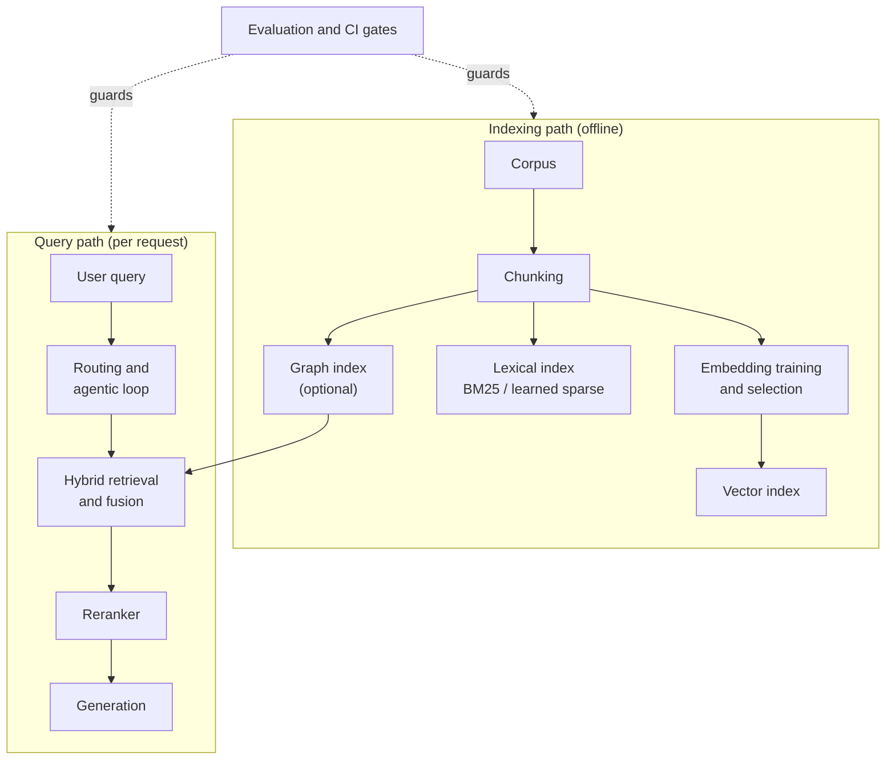
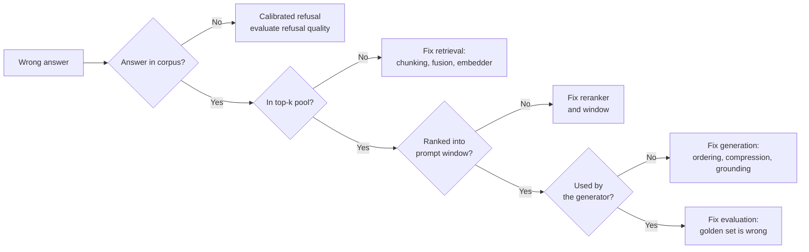

# RAG Decision Landscape

## Overview

This directory treats Retrieval-Augmented Generation as a systems engineering problem rather than a demo: how the components (chunking, hybrid retrieval, fusion, reranking, graphs, agentic loops, embedding training, evaluation) compose into a pipeline whose quality, latency and cost can be measured and defended in an interview. The pages here assume you already know RAG basics and ANN indexing; they cover the decisions and internals that sit above those fundamentals. Every page cross-links the existing dedicated pages on this topic instead of repeating them.

## The Three-Way Decision: RAG vs Long Context vs Fine-Tuning

The first decision in any "add LLM to my data" project is not which vector database to buy — it is which of three knowledge-injection mechanisms fits the workload. They differ in what they change: fine-tuning changes *weights* (skills, style, format), long context changes the *prompt* (small fixed corpora), RAG changes the *context assembly* (large, volatile, governed corpora). Get this wrong and no amount of downstream tuning recovers the position.

| Dimension | RAG | Long context (stuff the prompt) | Fine-tuning |
|---|---|---|---|
| Knowledge freshness | Index rebuild on write; minutes | Manual re-prompt each time | Re-training; days to weeks |
| Corpus size | Effectively unbounded | Bounded by context window (128K-10M tokens claimed) | Bounded by what fits in training data |
| Per-query cost | Embedding + retrieval + ~2-10K token prompt | Scales linearly with corpus tokens every query | Same as base model |
| Latency | +5-100 ms retrieval, TTFT driven by ~2-10K tokens | TTFT driven by full context (seconds+) | None added |
| Citations / auditability | Native (chunk → source) | Awkward (position in prompt) | Impossible post-hoc |
| Access control | Per-user filters at query time | All-or-nothing in the prompt | Baked in, hard to revoke |
| Teaches skills or facts | Facts only | Facts only | Skills and formats, unreliable facts |
| Failure mode | Retrieval miss → hallucination | Distraction, lost-in-the-middle, cost blowup | Hallucination with confidence |
| Operational surface | Index + search + eval harness | Prompt management | Training + serving + versioning |

The industry shorthand is correct and worth repeating in interviews: **fine-tuning teaches form, retrieval supplies facts**. Models fine-tuned on a document set answer questions about it worse than retrieval does, because weight-space knowledge is lossy, hard to update, and unauditable — Lewis et al. framed this exactly as the motivation for the original RAG paper (2020). Long context is the genuine third option and the strongest competitive pressure on RAG since 2024; the full cost/benchmark analysis lives in [Long Context vs RAG](./long-context-vs-rag.md).

In practice shipped systems combine all three: a fine-tuned base (format, tone, tool use), a retrieval layer (facts), and a large context window as headroom for big retrieved bundles. See [Fine-Tuning vs Prompt/Context Engineering](./embedding-finetuning.md) for the lever-by-lever comparison, and [Agent Memory: Advanced Systems Engineering](../agentic/agent-memory-advanced.md) for how agent memory stacks a third, write-heavy store on top.

## The Retrieval Quality Ceiling

RAG has a hard ceiling that no amount of generation quality can lift: **the generator can only use what retrieval returned**. If stage-1 retrieval (the cheap candidate generators: BM25, ANN over embeddings) puts the answer-bearing chunk outside the candidate pool, every later stage — fusion, reranking, the LLM itself — is polishing a list that no longer contains the answer. This is the recall ceiling argument from [Reranking and Hybrid Fusion](../../search/reranking.md), and it generalizes to the whole system.

Three consequences shape engineering priorities:

1. **Stage-1 recall is the metric that caps everything.** With 5 relevant chunks in the corpus and a top-100 candidate pool that catches 4, a perfect reranker and a perfect LLM still deliver at most 4. Measure recall@N on a labeled set before buying a better reranker.
2. **Errors compound multiplicatively.** A defensible budget for a mid-size system: 0.90 stage-1 recall × 0.95 rerank precision × 0.85 faithful generation ≈ 0.73 end-to-end correct. Each stage multiplies, so the weakest stage dominates — and retrieval is usually weakest because it is hardest to evaluate.
3. **Generation cannot compensate for absence.** Faithfulness metrics (see [RAG Evaluation](./rag-evaluation.md)) penalize answers unsupported by context, so a well-grounded LLM asked with an empty context should refuse, not invent. Systems that "fix" retrieval misses with clever prompting are tuning the one stage that is already capped.

The mitigation ladder, in rough order of cost: query rewriting/decomposition ([Agentic RAG](./agentic-rag.md)), hybrid lexical+dense retrieval ([Hybrid Search and Fusion](./hybrid-search-fusion.md)), a better embedding model (successive MTEB generations differ by single-digit nDCG@10 points; see [Embedding Fine-Tuning](./embedding-finetuning.md)), deeper candidate pools before reranking ([Rerankers: Deep Dive](./rerankers-deep.md)), and corpus-specific chunking ([Chunking Strategies](./chunking-strategies.md)). Only after the ceiling is raised does generation-side work pay.

## Component Map

The pipeline below is the spine of this directory. Each box links to the page that covers its internals; the existing repo pages it complements are listed in each page's cross-references.

| Page | Pipeline stage | What it covers | Complements |
|---|---|---|---|
| [Chunking Strategies](./chunking-strategies.md) | Indexing | Fixed/recursive/semantic/agentic splits, structural-aware, parent-document, late chunking, size effects | [RAG basics chunking](../llm-serving/rag.md) |
| [Embedding Fine-Tuning](./embedding-finetuning.md) | Indexing + query | Contrastive training, hard negatives, Matryoshka, instruction embeddings, MTEB | [Embeddings](../llm-serving/embeddings.md) |
| [Hybrid Search and Fusion](./hybrid-search-fusion.md) | Retrieval | BM25 + dense + SPLADE, RRF math, score-fusion pitfalls, engine support | [Reranking and Hybrid Fusion](../../search/reranking.md) |
| [Rerankers: Deep Dive](./rerankers-deep.md) | Rerank | Cross- vs bi-encoder vs late interaction, distilled models, latency budgets, measured gains | [Search reranking](../../search/reranking.md) |
| [GraphRAG](./graphrag.md) | Index + retrieval | Entity graphs, Leiden communities, local/global search, LightRAG, Graphiti | [GraphRAG section](../llm-serving/rag.md) |
| [Agentic RAG](./agentic-rag.md) | Orchestration | Retrieval as tool, Self-RAG, FLARE, CRAG, routers, stopping criteria, cost | [Agent systems](../advanced/agent-systems.md) |
| [RAG Evaluation](./rag-evaluation.md) | All | Retrieval vs generation metrics, RAGAS/TruLens/DeepEval, golden sets, CI gates, A/B | [LLM evaluation](../llm-serving/evaluation.md) |
| [Long Context vs RAG](./long-context-vs-rag.md) | Architecture decision | NIAH/RULER, context rot, cost math, Self-Route, the critique and rebuttals | [Long-context strategies](../architectures/long-context-strategies.md) |

## What This Directory Assumes You Already Know

The basics live elsewhere in this book and are linked, not repeated. [RAG Systems: Architecture and Production Patterns](../rag-systems.md) covers the operational architecture and query routing. [RAG (Retrieval-Augmented Generation)](../llm-serving/rag.md) is the fundamentals page: naive pipeline, chunk-size trade-offs, basic query transformation. [Advanced RAG Systems](../advanced/rag-advanced.md) covers the ANN index zoo (HNSW, IVF-PQ, DiskANN) and the bi- vs cross-encoder split. The candidate-generation side is in the [Search](../../search/README.md) directory: [Search Fundamentals](../../search/fundamentals.md), [Vector Search](../../search/vector-search.md), [HNSW](../../search/hnsw.md), [IVF-PQ](../../search/ivf-pq-quantization.md), and engine specifics in [Elasticsearch](../../search/elasticsearch.md), [FAISS](../advanced/faiss.md), [Milvus](../advanced/milvus.md) and [pgvector](../advanced/pgvector.md). Multi-node serving and caching of RAG systems are in [Distributed RAG Systems](../advanced/distributed/distributed-rag.md).

## Cross-Cutting Engineering Concerns

Four constraints cut across every page in this directory, and interviews probe them across topics.

**Latency.** A reference budget for an interactive assistant: retrieval side 50-150 ms total (ANN 5-20 ms, BM25 5-10 ms, fusion <1 ms, rerank 20-100 ms) against generation 300-1000 ms. Retrieval is therefore cheap to enrich *until* it doubles — a second retrieval hop or a deeper rerank window is affordable only if the p95, not the p50, is tracked. Batch reranking, quantized rerankers, and caching (see [Distributed RAG Systems](../advanced/distributed/distributed-rag.md)) are the standard relief valves.

**Cost.** Three cost centers dominate: index build (embedding plus optional LLM passes per chunk), per-query tokens (prompt assembly multiplied by QPS), and reranker compute (pairs scored per query). GraphRAG is the extreme case — its indexing can spend 10-30× the LLM tokens of plain embedding; its page quantifies this. The levers are chunk count (fewer, denser chunks), Matryoshka truncation (shorter vectors), rerank-window sizing, and routing cheap queries away from expensive paths.

**Freshness.** Corpus change rate selects the architecture. An hourly-updating news corpus requires incremental indexing, near-real-time lexical indexes, and cache invalidation discipline; a static regulation archive can afford GraphRAG-style heavy indexing and aggressive caching. Any design answer that ignores the write path is incomplete.

**Governance.** Per-user access control must survive retrieval: filters applied after ANN search leak count information and starve results, so pre-filtering or filtered HNSW support matters (see [Vector Databases](../llm-serving/vector-databases.md)). Citation requirements push toward chunk-level attribution and faithfulness gates (see [RAG Evaluation](./rag-evaluation.md)).

| Concern | Cheap lever | Expensive lever | Measured on |
|---|---|---|---|
| Latency | Smaller rerank window, quantized embedder | Second retrieval hop, LLM rewrite per query | p95/p99 end-to-end |
| Cost | Matryoshka truncation, fewer chunks | GraphRAG indexing, agentic loops | $ per 1K queries |
| Freshness | Incremental embedding + upsert | Full re-index, graph rebuild | Write-to-searchable lag |
| Governance | Pre-filtered ANN, chunk ACLs | Per-user indexes | Leak tests, permissioned recall |

## Failure Modes Catalog

Seven recurring failure points appear across every RAG post-mortem (Barnett et al., 2024), and each maps to one page here. Interviewers increasingly ask "what goes wrong?" rather than "how does it work?":

- **Missing content** — the answer does not exist in the corpus; no retrieval fix applies, and the correct behavior is a calibrated "not in the corpus" (evaluation: refusal quality, [RAG Evaluation](./rag-evaluation.md)).
- **Missed top-ranked documents** — the answer is indexed but ranked below the cut; fixes: hybrid fusion, reranking, better embeddings.
- **Not in context — consolidation** — answer spans chunks that were retrieved separately but never combined; fixes: parent-document retrieval, graph retrieval, agentic decomposition.
- **Not extracted from context** — the chunk is in the prompt but the model ignores it mid-context; fixes: lost-in-the-middle ordering, compression, see [Long Context vs RAG](./long-context-vs-rag.md).
- **Wrong format** — the answer exists but violates the output contract; fixes: few-shot, fine-tuning ([Embedding Fine-Tuning](./embedding-finetuning.md) for the retrieval-side analog).
- **Incomplete answers** — partial extraction from a correct context; fixes: query decomposition ([Agentic RAG](./agentic-rag.md)).
- **Data-extraction scaling errors** — table/PDF parsing breaks before retrieval ever sees the content; fixes: structural-aware chunking ([Chunking Strategies](./chunking-strategies.md)).

## A Worked Scenario

One scenario ties the pages together and is a useful interview narrative. A team ships a support assistant over 200K internal documents (PDF, Confluence, tickets). v1: fixed 512-token chunks, one dense retriever, top-10 to the LLM. Complaints: exact error codes and ticket IDs are never found, and multi-part questions ("compare plan A and plan B limits") get half-answered.

The debug order follows the failure catalog. Exact identifiers missing is the classic dense-only symptom — embeddings blur token strings — so the fix is hybrid retrieval with BM25 in the mix ([Hybrid Search and Fusion](./hybrid-search-fusion.md)). Half-answered multi-part questions are a decomposition problem, fixed by an agentic loop that splits the query and merges sub-answers ([Agentic RAG](./agentic-rag.md)). Because complaints cluster on PDF tables, the ingestion fix is structural-aware chunking rather than any model change ([Chunking Strategies](./chunking-strategies.md)). After retrieval improves, a cross-encoder reranker spends the newly-bought recall well ([Rerankers: Deep Dive](./rerankers-deep.md)).

Then the CFO asks for per-customer questions over the same corpus — access control rules out stuffing everything into a long context, and citations are mandatory, both favoring RAG ([Long Context vs RAG](./long-context-vs-rag.md)). Finally, engineering leadership asks how changes ship safely: the answer is the golden set and CI gates from [RAG Evaluation](./rag-evaluation.md), applied before any of the above changes merged. Each step names its metric: recall@100 for the pool, nDCG@10 for ranking, faithfulness for generation, and p95 latency as the guardrail.

## Glossary of Knobs

The vocabulary interviewers expect you to adjust, with the page that owns each:

| Knob | Typical range | Effect | Page |
|---|---|---|---|
| Chunk size | 256-1024 tokens | recall vs precision balance | [Chunking](./chunking-strategies.md) |
| Chunk overlap | 10-20% | boundary loss insurance | [Chunking](./chunking-strategies.md) |
| Retrieval depth k1 | 50-1000 | stage-1 recall ceiling | [Hybrid Search](./hybrid-search-fusion.md) |
| Fusion constant k (RRF) | 20-100 | rank damping, default 60 | [Hybrid Search](./hybrid-search-fusion.md) |
| Rerank window N | 25-200 | quality vs latency dial | [Rerankers](./rerankers-deep.md) |
| Final top-k to LLM | 5-20 | context budget, distraction | [Rerankers](./rerankers-deep.md) |
| Embedding dim (MRL) | 128-1024 | storage vs recall | [Embedding Fine-Tuning](./embedding-finetuning.md) |
| Agent hops | 1-5 | coverage vs cost amplification | [Agentic RAG](./agentic-rag.md) |
| Graph community levels | 1-5 | granularity of global answers | [GraphRAG](./graphrag.md) |

## Interview Setting

RAG system design is a standard LLM-track interview because it forces trade-off reasoning across retrieval, serving, and evaluation at once. The questions this directory prepares for: "Design RAG over 100M documents with a 200 ms p95" (latency budgets in [Rerankers](./rerankers-deep.md), scaling in [Distributed RAG](../advanced/distributed/distributed-rag.md)); "Why is your RAG wrong 20% of the time?" (error decomposition in [RAG Evaluation](./rag-evaluation.md)); "Why not just use the 2M-token model?" ([Long Context vs RAG](./long-context-vs-rag.md)); "When do graphs beat vectors?" ([GraphRAG](./graphrag.md)). Interviewers consistently reward one habit: quantifying the recall ceiling before proposing a fix. Stating "before I optimize the reranker, I would measure stage-1 recall@100 on a labeled set" separates candidates who have operated systems from those who have read about them.

## Interview Questions

1. **When would you choose fine-tuning over RAG, and when both?** Fine-tuning when the requirement is behavioral — output format, domain tone, tool-call syntax, classification heads — because those are weight-space properties. RAG when the requirement is factual currency, because retrieval updates in minutes and cites sources while fine-tuned knowledge is frozen, unauditable, and degrades with model drift. Both together are the common production answer: a fine-tuned base that follows the citation format and refuses without context, plus a retrieval layer that supplies facts. Fine-tuning to inject facts is a losing trade: it is expensive to update, cannot express access control, and hallucinates more confidently.
2. **Your RAG system gives wrong answers 20% of the time. Where do you start?** Resist tuning the prompt first; decompose the failure instead. Build or extend a labeled golden set (50-200 real queries), then measure stage-1 recall@k: if the answer chunk is absent from the candidate pool the ceiling is hit before generation and the fixes are chunking, hybrid retrieval, or a better embedder. If recall is fine but nDCG@10 is low, the reranker or fusion is misranked. If retrieval is fine but answers are unfaithful, the problem is generation: context overload, lost-in-the-middle ordering, or prompt structure. Each branch has a different owner and a different fix, which is why evaluation instrumentation is the first deliverable, not a late one.
3. **What is the retrieval quality ceiling and how do you measure it?** It is the fraction of relevant documents that ever enter the candidate pool: with r relevant items in the corpus and k candidates retrieved, a perfect downstream stack returns at most min(k, r_in_pool). You measure it as stage-1 recall@N on a labeled set, evaluated before fusion and reranking. Two disciplines follow: buy recall before capacity (raise N, add a lexical retriever, improve chunking) because a bigger reranker only spends the ceiling better, and evaluate stages separately so a strong reranker cannot mask a degraded retriever after a model upgrade.
4. **Why is "just use a bigger context window" not a full answer to RAG?** Cost and latency scale with context length on every query: a 1M-token input can cost two orders of magnitude more than a 10K-token retrieved prompt, and prefill time grows accordingly. Long context also degrades non-uniformly — NIAH-style retrieval passes while multi-hop and aggregation tasks fail well below the advertised window, and positional effects (lost in the middle) hurt answer quality regardless. Operationally, long context offers no per-query access control, no citations, and no incremental update path for a changing corpus. The honest answer is the hybrid: retrieve into a large-but-bounded window, and the numbers behind that are in the long-context page.
5. **Order the components of a production RAG pipeline and give a latency budget.** Query path: rewrite/route (~30-100 ms, only if LLM-assisted), hybrid retrieval (~5-30 ms including ANN and BM25), fusion (sub-millisecond), reranking top 50-100 (~20-100 ms GPU, the dominant retrieval-side cost), context assembly (~1 ms), generation (~300-1000 ms, TTFT plus decode). Offline: chunking, embedding, index build, and evaluation gates. The allocation principle is that generation dominates end-to-end latency, so retrieval-side spending (a bigger rerank window, an extra retrieval hop) is cheap until it threatens the p95, which is why every page in this directory pairs its quality claim with a cost number.
6. **How do the seven common RAG failure points map to ownership in an engineering team?** Content absence and extraction errors (PDF/table parsing) belong to the data pipeline, not the ML team — they are fixed with source ingestion and structural-aware chunking. Ranking failures belong to retrieval engineering: fusion configuration, reranker selection, embedding refresh. Generation-side failures — ignoring context, format drift — belong to prompt and model work, and are the cheapest to fix but the most tempting to over-fix. Refusal behavior (no calibrated "not in corpus") is a product decision that evaluation must encode as a metric. The mapping matters because teams that route every failure to "tune the prompt" accumulate invisible retrieval debt that evaluation gates would have caught.

## Key Takeaways

- Decide RAG vs long context vs fine-tuning on three axes — freshness, corpus size, and auditability — not on vendor benchmarks; hybrid stacks are the production default.
- The retrieval quality ceiling is the binding constraint: measure stage-1 recall@N first, because no reranker or prompt can recover a document that never entered the candidate pool.
- Stage errors multiply: 0.9 × 0.95 × 0.85 ≈ 0.73 end-to-end, so the weakest stage — usually retrieval — dominates system quality.
- Every page here is an engineering trade, not a technique to apply unconditionally: chunking changes recall/precision balance, fusion changes robustness, rerankers buy quality with linear latency, graphs buy multi-hop with index cost, agents buy coverage with LLM-call amplification.
- Evaluation is the first deliverable, not the last: a golden set plus CI gates is what makes every other component change safe to ship.
- Cost discipline is part of correctness: per-query token counts, rerank windows, and index-refresh schedules determine whether the design survives contact with production economics.

## References

- P. Lewis et al., "Retrieval-Augmented Generation for Knowledge-Intensive NLP Tasks", NeurIPS 2020 — <https://arxiv.org/abs/2005.11401>
- Y. Gao et al., "Retrieval-Augmented Generation for Large Language Models: A Survey", 2023 — <https://arxiv.org/abs/2312.10997>
- I. M. Barnett et al., "Seven Failure Points When Engineering a Retrieval Augmented Generation System", CAIN 2024 — <https://arxiv.org/abs/2401.05868>
- E. K. L. Li et al., "Retrieval Augmented Generation or Long-Context LLMs? A Comprehensive Study and Hybrid Approach" (Self-Route), EMNLP 2024 Industry — <https://arxiv.org/abs/2407.16833>
- N. Muennighoff et al., "MTEB: Massive Text Embedding Benchmark", EACL 2023 — <https://arxiv.org/abs/2210.07316>
- Lilian Weng, blog archive (RAG and agent surveys with full citations) — <https://lilianweng.github.io/>
- Hugging Face Papers (daily curated arXiv with runnable artifacts) — <https://huggingface.co/papers>

## Cross-References

- [Chunking Strategies](./chunking-strategies.md) — where recall is won or lost, before any model choice matters
- [Hybrid Search and Fusion](./hybrid-search-fusion.md) — combining lexical, dense and learned-sparse retrievers
- [Rerankers: Deep Dive](./rerankers-deep.md) — cross-encoders, late interaction, latency budgets
- [GraphRAG](./graphrag.md) — entity graphs, communities, global questions
- [Agentic RAG](./agentic-rag.md) — retrieval as a tool inside an agent loop
- [Embedding Fine-Tuning](./embedding-finetuning.md) — training the retriever on your domain
- [RAG Evaluation](./rag-evaluation.md) — metrics, golden sets, CI gates, A/B
- [Long Context vs RAG](./long-context-vs-rag.md) — the benchmark and cost evidence for the three-way decision
- [RAG Systems: Architecture and Production Patterns](../rag-systems.md) — operational architecture this directory builds on
- [Advanced RAG Systems](../advanced/rag-advanced.md) — ANN indexes and the bi/cross-encoder foundation
