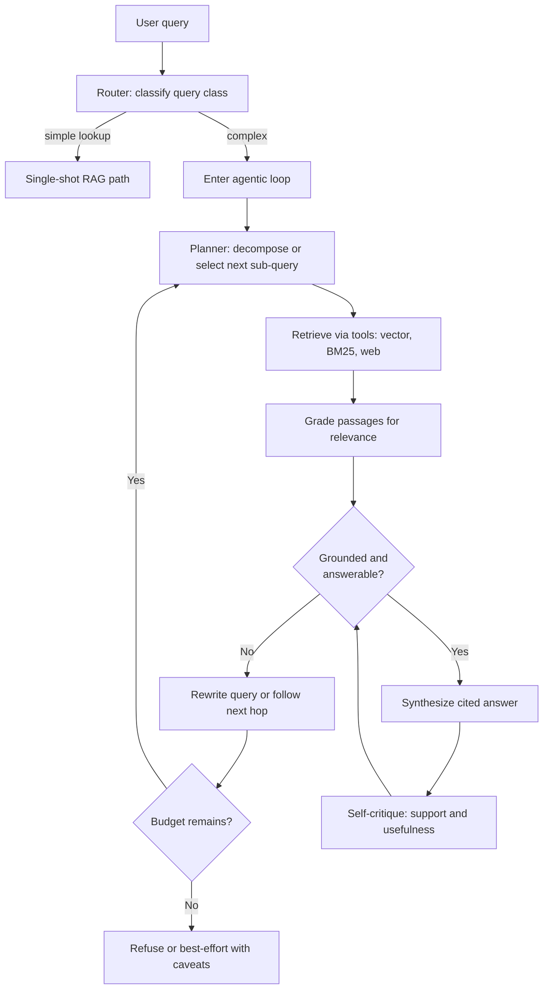
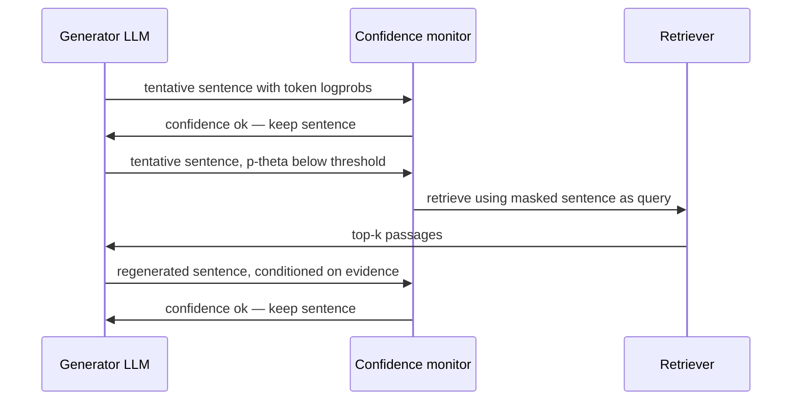
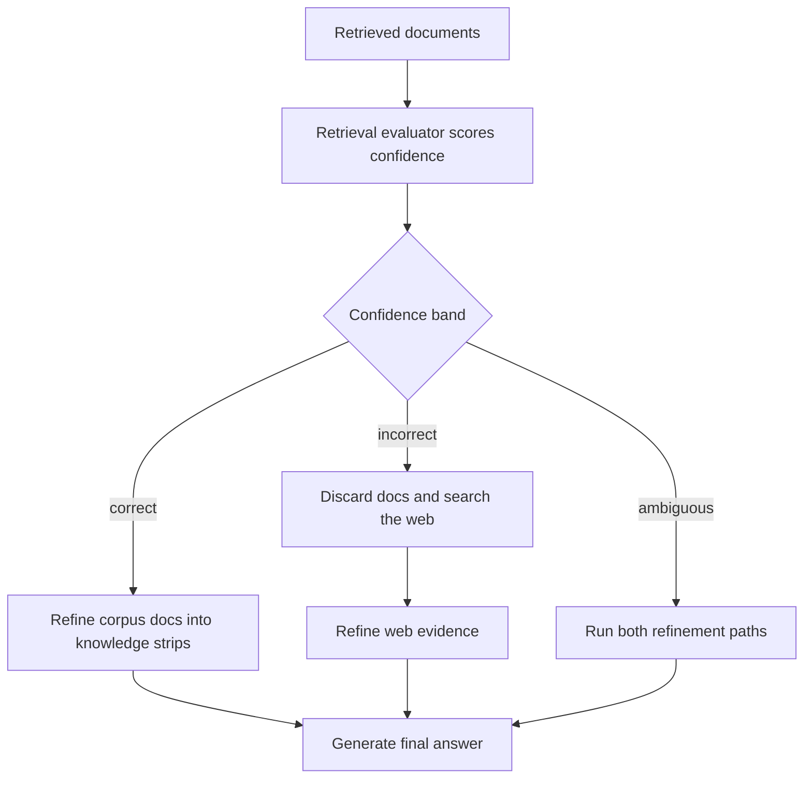

# Agentic RAG

## Overview

Single-shot RAG answers every query with one fixed pipeline — embed, retrieve top-k, stuff, generate — and that rigidity is why it fails on multi-part, multi-hop, and vocabulary-mismatched questions. Agentic RAG reframes retrieval as a *tool* the model calls in a loop: decompose the query, retrieve, grade what came back, rewrite or refine, and repeat until an answer is grounded or a budget is exhausted. This page covers the loop architecture, the three landmark papers that formalized its parts (Self-RAG's reflection tokens, FLARE's active retrieval, CRAG's corrective triggers), query decomposition and multi-hop with IRCoT, routers, stopping criteria, and the cost/latency ledger that decides when the loop pays.

Scope note: [RAG (Retrieval-Augmented Generation)](../llm-serving/rag.md) is the fundamentals page and [Advanced RAG Systems](../advanced/rag-advanced.md) covers the index/ANN side; this page is the orchestration layer above both. The generic agent machinery (planning, tool use, memory) is in [Agent Systems](../advanced/agent-systems.md); here we cover only what retrieval-specific agents add.

## Where Single-Shot RAG Breaks

Three question classes defeat the fixed pipeline structurally, and each motivates a different loop component:

- **Multi-part queries** ("compare the SLA terms and the refund window across plans A and B") need four evidence bundles, but one retrieval call returns one blended top-k that serves none of them well. The fix is decomposition: split the query, retrieve per sub-query, merge sub-answers.
- **Multi-hop queries** ("who funded the company that acquired the team that built X?") need the *output* of one retrieval to form the *input* of the next. No static query can anticipate the intermediate entity, so hops must be sequential — this is the class IRCoT and graph retrieval target ([GraphRAG](./graphrag.md)).
- **Mismatch and silence.** The corpus uses different words than the user ("refund window" vs "cancellation policy §4.2"), or the answer is not in the index at all. A fixed pipeline generates from an empty context and hallucinates; a loop that grades retrieved passages can detect the silence and escalate — rewrite, switch retriever, fall back to web search, or refuse.

The economic framing from [RAG Decision Landscape](./README.md) applies here: the generator can only use what retrieval returned, so when stage-1 recall is the binding constraint, an agentic loop is one of the few levers that raises the ceiling instead of spending it better. The price is per-query cost amplification — every section below pairs its quality mechanism with its LLM-call arithmetic.

## Retrieval as a Tool: The Loop Architecture

The minimal agentic RAG system wraps the same components a single-shot pipeline uses — retrievers, reranker, generator — in an agent scaffold where an LLM decides *whether, what, and how* to retrieve at each step. Concretely, the loop has five roles:

1. **Planner/router.** Classifies the query (lookup vs multi-part vs multi-hop vs out-of-corpus) and either answers directly, runs single-shot RAG, or enters the loop. Cheap implementations use a small model or embedding similarity; heavy ones use the main LLM with a routing prompt.
2. **Retrievers as tools.** Vector ANN ([Vector Search](../../search/vector-search.md), [FAISS](../advanced/faiss.md)), BM25/lexical, and optionally web search are exposed as callable tools with typed arguments — the agent writes the query string, picks the tool, sets k.
3. **Grader.** A lightweight judge (cross-encoder score, small NLI model, or LLM prompt) labels each retrieved passage relevant/irrelevant and grounded/ungrounded. This is what turns blind retrieval into corrective behavior.
4. **Rewriter/decomposer.** Turns failed queries into better ones: synonym expansion, HyDE-style hypothetical documents, or full decomposition into sub-queries.
5. **Synthesizer.** Merges per-hop evidence into a cited final answer, with a self-critique pass before returning.



Two implementation notes save teams weeks. First, the loop is a *state machine*, not a free-for-all: production systems (LangGraph, LlamaIndex workflows, Haystack) encode the states and transitions above explicitly so every hop is logged, replayable, and budget-capped — an unconstrained ReAct agent calling retrieval as one of many tools is a debugging nightmare, not an architecture. Second, grade-then-rewrite is what distinguishes agentic RAG from mere iteration: without an explicit relevance judgment between retrieval and the next hop, the loop has no signal for *what* to change, and it degenerates into re-issuing near-identical queries.

### The Tool Contract

Retrievers earn the name "tool" by having a typed, documented interface the planner can call blind. A minimal schema for a production retrieval tool looks like this:

```json
{
  "name": "corpus_search",
  "description": "BM25 + dense hybrid search over the internal support corpus.
     Use for product, billing and policy questions. Do NOT use for
     questions about the user's own account state.",
  "parameters": {
    "query": "string — natural language, keywords ok",
    "k": "int, default 10, max 50",
    "filters": "object, e.g. {\"product\": \"plan-A\", \"year\": 2025}",
    "route": "enum: vector|lexical|hybrid, default hybrid"
  },
  "returns": "list of {chunk_id, text, source, score}"
}
```

Three details carry most of the value. The `description` is a routing signal — the model chooses tools from descriptions, so a precise scope statement ("internal support corpus, not account state") prevents both misuse and governance violations. The `filters` parameter is where per-user access control survives agentic loops ([Vector Databases](../llm-serving/vector-databases.md)); a tool without filter plumbing invites the agent to work around ACLs. And the typed `route` parameter exposes the [Hybrid Search and Fusion](./hybrid-search-fusion.md) decision to the model, which matters because identifier-style queries ("ERR_4021") should hit lexical while paraphrases hit dense — a choice the model makes better when the choice exists at all.

### The Grader Prompt, Concretely

The grader is the loop's feedback signal, and it deserves the same engineering care as the retriever. A compact LLM grader prompt returning machine-parseable structure:

```text
You are grading retrieved passages for a question-answering system.
Question: <original user question>
Sub-query this passage was retrieved for: <hop query>
Passage: <chunk text>

Return JSON: {"relevant": bool, "reason": str,
              "answers_subquery": bool, "answers_original": bool,
              "missing_evidence": str | null}
Rules: relevance is judged against the ORIGINAL question, not the
sub-query. If relevant but incomplete, name what is missing in
missing_evidence — the rewriter will use it as the next query.
```

The prompt encodes the two anti-drift rules from the failure-modes section: relevance judged against the original question (not the drifting sub-query), and `missing_evidence` as a structured channel from grader to rewriter. Cheap variants replace the LLM with a cross-encoder score ([Rerankers: Deep Dive](./rerankers-deep.md)) plus a threshold — fewer tokens, no reasoning about *what* is missing, but 10-100× cheaper at scale. Many production loops run both: cross-encoder for the bulk filter, LLM grader only on the boundary cases and for the missing-evidence extraction.

## Query Decomposition and Multi-Hop Retrieval

Decomposition is the highest-value agentic pattern because multi-part questions are common in real traffic (any "compare X and Y", any "list all conditions under which Z"). Three strategies, in increasing sophistication:

- **Serial decomposition (Self-Ask style).** The model asks itself follow-up questions and answers each with a retrieval call, threading the previous answer into the next query: "Who acquired the company that built X?" → "Which company built X?" → retrieval → "Who acquired \<answer\>?" (Press et al., 2022). Each hop's query is *grounded in retrieved evidence*, which is what makes it work where a one-shot decomposition guess fails.
- **Interleaved reasoning (IRCoT).** Trivedi et al. (2023) generate chain-of-thought one sentence at a time and trigger retrieval on every sentence, using the CoT sentence as the query. The interleaving matters in both directions: CoT sentences are better queries than the raw question (they contain the intermediate entities), and retrieved passages steer the next reasoning step. With Flan-T5-large backbones, IRCoT improved answer F1 by up to 21 points and retrieval recall by up to 15 points on HotpotQA, 2WikiMultihopQA and MuSiQue in low-data regimes — the reported gains come mostly from *retrieval recall* improving, which is the ceiling argument again.
- **Parallel decomposition.** Split an answerable-in-parts question into independent sub-queries, retrieve and answer each concurrently, then reduce. This is a map-reduce, not a chain: latency grows with the slowest sub-query rather than the number of hops, and it is the right shape for the multi-part (non-multi-hop) class. Choosing chain vs map is itself a routing decision — does sub-query 2 depend on sub-query 1's answer?

A worked hop trace shows where the money goes. Question: "Which materials used in the battery chemistry of the model the EPA rated at 402 miles are sourced from China?" Hop 1 retrieves the EPA range table → sub-answer: "Model M". Hop 2 retrieves Model M's teardown report → sub-answer: "LFP cathode". Hop 3 retrieves supply-chain filings for LFP → final evidence. Three retrieval calls, three LLM generations, and — critically — hops 2 and 3 could not have been written at query time without hop 1's answer. The IRCoT lesson generalizes: *let the model's intermediate text form the next query*, and you get multi-hop behavior without a hand-built graph.

## Reflection Tokens: Self-RAG

Self-RAG (Asai et al., 2023, arXiv 2310.11511) trains the generator itself to control and critique retrieval by emitting special **reflection tokens** inline with its output, instead of relying on an external agent scaffold:

| Token | Values | Decides |
|---|---|---|
| `[Retrieve]` | yes / no | whether to fetch passages for the next segment (adaptive retrieval) |
| `[IsRel]` | relevant / irrelevant | whether a retrieved passage is relevant to the query |
| `[IsSup]` | fully / partially / no support | whether the generated claim is supported by the passage |
| `[IsUse]` | 1-5 | whether the response is useful to the answer |

Training is data-driven: a strong critique model (GPT-4) is prompted to generate reflection-token annotations for (query, retrieval, output) triples; the base model (Llama2 7B/13B) is then fine-tuned to predict those tokens during generation, including *no-retrieval* examples so it learns when fetching is unnecessary. At inference the model runs a segment-level loop: retrieve K passages if `[Retrieve]`=yes, generate one candidate segment per passage in parallel, critique each with `[IsRel]`/`[IsSup]`/`[IsUse]`, keep the best segment, continue. The paper reports Self-RAG (7B) outperforming ChatGPT and retrieval-augmented Llama2-chat on open-domain QA and fact-checking benchmarks, with 13B beating retrieval-augmented Llama2-70B across the evaluated suite — a small model with reflection beating much larger models with blind retrieval.

The architectural insight is the decoupling: adaptive retrieval (`[Retrieve]`) solves "when to fetch", while `[IsSup]` grounding checks solve "can I trust what I wrote". Both were previously separate systems (a router plus a hallucination detector); Self-RAG folds them into the generator's decoding. The cost is a fine-tuned model — you cannot bolt reflection tokens onto an API LLM — and segment-level parallel generation multiplies compute at inference. Distillations exist: the common production pattern is to keep the *token taxonomy* (retrieve? relevant? supported? useful?) as prompts against a general LLM, trading the paper's latency for portability.

## Active Retrieval: FLARE

FLARE (Jiang et al., 2023, arXiv 2305.06983) attacks the timing problem from a different angle: single-shot retrieval is fetched *before* the model knows what it needs, which works for fact-lookup but fails on long-form generation that wanders across topics. FLARE retrieves *actively*, driven by the model's own uncertainty:

1. Generate the next sentence tentatively from current context.
2. Scan the sentence for low-confidence tokens (token probability below a threshold, typically ~0.2 in the paper's setup).
3. If low-confidence tokens exist, treat the (masked) sentence as a retrieval query, fetch passages, and *regenerate* the sentence conditioned on them; if confidence is fine, keep the sentence and continue.

The tentative-sentence-as-query trick is the paper's core contribution: the model's own forward-looking text is a better query for what it is *about to say* than the original question is. FLARE improved results on four long-form knowledge-intensive tasks in the paper — multi-hop QA, commonsense reasoning (StrategyQA), and long-form QA (ASQA/QAMPARI) — and, importantly, the ablations show *passive* retrieval on a fixed schedule (every N sentences) can underperform no extra retrieval at all, because off-topic fetches inject distractors. Retrieval should happen at uncertainty, not at intervals.

FLARE is cheap to implement over an API LLM (no training, unlike Self-RAG) — the loop is: generate-with-logprobs → threshold → retrieve → regenerate. Its costs: latency grows with the number of retrieval triggers, logprobs are required (some API models do not expose them, which blocks the confidence trigger entirely), and the token-probability signal is a proxy for *knowledge missing*, not a guarantee — a model can be confidently wrong and never trigger. In practice FLARE pairs well with CRAG-style grading as a second, semantic confidence check.



The sequence exposes the two engineering knobs. Threshold placement controls trigger frequency: too low and the loop never fires (single-shot with overhead), too high and every sentence triggers a fetch, tripling cost while injecting distractors — the paper's ablations put the useful operating band well below one trigger per sentence. And the monitor needs streaming access to logprobs per token, which shapes deployment: it is natural on self-hosted vLLM-style stacks, awkward on closed APIs that omit logits, and impossible where only aggregated confidence is exposed.

## Loop Granularity: Query, Segment, or Token

The three papers differ in *where* the loop iterates, and the granularity choice determines both the quality ceiling and the cost profile:

| Granularity | Iteration unit | Example | Cost profile | Best fit |
|---|---|---|---|---|
| Query-level | whole question → sub-question | Self-Ask, parallel decomposition | 2-6 LLM calls | multi-part and multi-hop QA |
| Segment-level | generated passage | sentence/paragraph | 1 call per trigger | long-form generation, drifting topics |
| Token-level | decoding step | reflection tokens during decode | folded into generation | learned adaptive retrieval |

Query-level loops are the workhorse: they compose with any API LLM, they map cleanly onto state machines, and their per-hop artifacts (sub-queries, graded evidence) are auditable. Segment-level (FLARE) and token-level (Self-RAG) loops buy finer-grained timing — retrieving *exactly* at the uncertainty point — at the price of plumbing: logprobs, streaming, and in Self-RAG's case a fine-tuned model. A useful interview line: the granularity ladder is also an autonomy ladder, and production systems climb it only as far as their observability and budget enforcement can verify, because a loop that iterates inside the decoder is a loop you cannot see from the outside.

## Corrective RAG: CRAG

CRAG (Yan et al., 2024, arXiv 2401.15884) assumes the retriever is unreliable and adds an explicit evaluate-then-correct layer that works with *any* frozen LLM. A lightweight retrieval evaluator (a fine-tuned T5-large) scores each retrieved document, and the score's confidence band triggers one of three corrective actions:

| Trigger | Condition | Corrective action |
|---|---|---|
| **Correct** | evaluator confidence high | refine in-corpus evidence: decompose documents into *knowledge strips*, filter, recompose the informative ones |
| **Incorrect** | evaluator confidence low | discard retrieved docs entirely; transform the query into web-search queries (five rewrites in the paper), fetch, then refine |
| **Ambiguous** | middle band | run both paths and merge evidence |



Two design choices are worth naming in an interview. First, the evaluator is *small and specialized* — the paper's point is that relevance grading is a narrow classification task where a sub-billion-parameter model beats prompting a large LLM, at a fraction of the latency and cost; CRAG adds ~one T5 forward pass per document rather than one LLM call per document. Second, "refinement into strips" is retrieval-aware compression: documents are cut into sentences/clauses, the evaluator keeps the informative ones, and only those reach the generator's prompt — which cuts prompt tokens precisely where the corpus is noisy. CRAG improved performance across the paper's open-domain QA benchmarks (including PopQA and Biography) regardless of which base LLM it was wrapped around, which is why the corrective pattern (grade → route → repair) shows up in most production RAG frameworks under different names.

## Routers: Choosing the Execution Path

Routing is the static, pre-loop decision — which *pipeline shape* serves this query — and it is where most of the cost savings live, because the expensive path is needed by a minority of traffic. The main router families:

- **Semantic router.** Embed the query, match against route descriptions by cosine similarity, threshold, dispatch. Milliseconds, no LLM call, brittle on out-of-distribution queries; the semantic-router library and simple two-stage designs work this way.
- **LLM-as-router.** One small-model call with a routing prompt ("classify: lookup / multi-part / multi-hop / chat / out-of-corpus") or a function-calling choice among pipelines. More robust, ~100-300 ms and a few hundred tokens.
- **Learned/self-taught.** Self-RAG's `[Retrieve]` token is a learned router at segment granularity; Self-Route (Li et al., 2024, arXiv 2407.16833) routes between RAG and long-context reading by whether the query needs lookup or synthesis, cutting cost by ≈39% at comparable quality — the same routing logic generalized to the [Long Context vs RAG](./README.md) decision.
- **Cascade.** Always try the cheap path first; escalate on a failure signal (low grader confidence, low self-consistency, user-visible retry). This is CRAG's trigger structure applied at pipeline granularity rather than document granularity.

The design mistake to avoid is routing on query *syntax* rather than expected *cost/benefit*: "how do I reset my password?" (60% of traffic, single-shot, cached) and "audit all contracts mentioning indemnification" (0.1% of traffic, agentic) should never pay the same pipeline. A production rule of thumb: if fewer than ~20% of queries benefit from multi-hop behavior, put a cheap router in front and keep single-shot as the default; the loop pays for itself on the traffic it saves, not on the traffic it serves.

### A Router Prompt, Concretely

LLM routers are one small call returning a machine-parseable decision, and the prompt should carry the cost consequences so the model routes with a budget in mind:

```text
Classify the query and choose an execution path:
- direct: chit-chat, meta, or pure arithmetic — answer with no retrieval
- lookup: answerable from one or two obvious passages — single-shot RAG
- multi_part: several independent facts needed — parallel decomposition
- multi_hop: each fact depends on the previous — serial loop, max 4 hops
- out_of_corpus: nothing like this exists in our index — refuse with message

Query: <question>
Return JSON: {"path": ..., "sub_queries": [...] | null,
              "reason": one sentence}
```

Two disciplines make routers reliable. Calibrate against the golden set: a router that sends 5% of lookup queries into the loop costs 4× on those queries, so measure the confusion matrix, not just the router's accuracy — the expensive error direction is lookup→multi_hop, not the reverse. And always include the `direct` and `out_of_corpus` exits; a router that can only choose among retrieval pipelines turns chit-chat into paid retrieval and missing content into confident hallucination, which are the two cheapest wins in the whole design.

### Mapping Patterns to Frameworks

| Paper pattern | Framework construct | What the framework adds |
|---|---|---|
| Router (any family) | LangGraph conditional edges; LlamaIndex `RouterQueryEngine` | typed dispatch, per-edge telemetry |
| Grade-and-rewrite loop | LangGraph `retrieve → grade → rewrite` cycles | replayable state machine, checkpointing |
| CRAG evaluator | Haystack/LLMJudge components; custom NLI scorer | batched scoring, caching by chunk hash |
| FLARE confidence trigger | streaming callbacks with logprob hooks | per-token visibility, threshold config |
| Self-RAG reflection | fine-tuned checkpoint served like any LLM | standard decoding, no extra scaffold |
| Parallel decomposition | fan-out/fan-in subgraph nodes | concurrency limits, partial-failure policy |

The table's honest caveat: the papers' artifacts (Self-RAG checkpoints, CRAG's evaluator weights) are drop-in, but the *loops* are yours to encode — frameworks provide the state machine and telemetry, not the stopping policy or the golden-set-calibrated thresholds. Teams that treat the framework's default agent as the architecture rediscover the failure modes section within their first month; teams that encode the loop explicitly inherit the papers' cost/quality profiles instead of the framework's defaults.

## Stopping Criteria and Loop Control

An unbounded loop is a cost incident waiting to happen. Production systems enforce several criteria simultaneously, checked every iteration:

| Criterion | Mechanism | Typical setting |
|---|---|---|
| Max hops | hard counter | 2-5 (README's knob: 1-5) |
| Answer sufficiency | grader/sub-synthesizer says all sub-questions answered | per-iteration LLM or grader call |
| Grounding threshold | all claims pass `[IsSup]`-style support check | self-RAG-style critique prompt |
| Confidence trigger | token probs or evaluator score above threshold | FLARE-style, θ ≈ 0.2 |
| Loop/duplicate detection | hash retrieved doc sets; stop if no new evidence | set-intersection over retrieved IDs |
| Budget exhaustion | token or dollar cap per query | e.g., 10× single-shot budget |
| Self-consistency | N parallel sub-answers agree within tolerance | 3-5 samples, expensive |

The subtleties are asymmetries. Duplicate detection must compare *evidence sets*, not queries: a rewriter that changes wording while the retriever keeps returning the same top-3 is a silent loop, and set-comparison catches what string comparison misses. Sufficiency checking is itself an LLM call, so a naive "check every iteration" doubles loop cost — implementations either check only after every k-th hop or fold sufficiency into the synthesizer prompt of the previous hop. And the terminal state on budget exhaustion must be a *calibrated refusal or best-effort-with-caveats*, never a silent degradation to whatever the last hop produced; users forgive "I could not fully verify X", not confident wrong answers. All of this is only enforceable if the loop is an explicit state machine with per-state telemetry — the reason the framework-based implementations dominate production.

## Cost, Latency, and When the Loop Pays

The ledger below assumes the reference budgets from this directory's README (retrieval side 50-150 ms, generation 300-1000 ms, single-shot prompt 2-10K tokens) and adds the loop's multipliers:

| Strategy | LLM calls/query | Typical tokens/query | Latency | Fails on |
|---|---|---|---|---|
| Single-shot RAG + rerank | 1 (+rerank model) | 3-12K | ~0.5-2 s | multi-hop, multi-part, index gaps |
| Corrective (CRAG-style) | 1-3 + small evaluator | 5-20K | ~1-4 s | deep multi-hop chains |
| Iterative multi-hop (IRCoT-style) | 3-6 | 10-40K | ~3-10 s | corpus-absent answers |
| Full agent (ReAct + tools) | 5-20 | 20-100K+ | ~10-60 s | cost, p95 latency, drift |

Worked arithmetic for a support-assistant: 10K queries/day, single-shot at 6K input tokens ≈ 60M input tokens/day; if 15% of traffic is multi-part and each needs 3 decomposition branches, the agentic path for that stratum costs ~3× generate + 3× retrieve ≈ +27M tokens/day — a 45% total-cost increase for 15% of queries, *if* the router only routes that stratum. Unrouted (all traffic through a 4-call loop), the same behavior is a 4× bill and a p95 that breaches a 5-second SLO on the first retry storm. The decision procedure is therefore: stratify traffic, measure single-shot's failure rate per stratum on a golden set ([RAG Evaluation](./README.md) has the harness shape), and route only the strata where the loop's measured accuracy gain exceeds its measured cost multiple. The honest summary mirrors GraphRAG's: agentic RAG inverts the cost profile — cheap to index, expensive per query — which is the right trade when queries are hard and traffic is bounded, the wrong one when queries are easy and traffic is huge.

One lever belongs in every deployed loop regardless of routing: **sub-query caching and memoization**. Decomposition recreates the same sub-queries for recurring question shapes — cache (normalized sub-query → graded evidence) with the corpus's freshness TTL, and the multi-hop stratum's second call costs retrieval compute only, no LLM planner. In the support-assistant arithmetic above, a 40% cache hit rate on sub-queries erases roughly a third of the loop's added tokens; the cache key must include retrieval-filters (access control again) so memoization never leaks evidence across permission boundaries.

## Failure Modes

1. **Runaway loops.** No duplicate-evidence detection plus no hard budget: the agent re-queries paraphrases forever. Mitigation is mechanical — evidence-set hashing and a hard hop/token cap with an alarm at 80% budget.
2. **Error propagation.** A wrong intermediate sub-answer poisons every downstream hop, and the final answer is confidently wrong with plausible citations. Mitigations: per-hop grounding checks before the sub-answer is threaded forward, and self-consistency on high-stakes hops.
3. **Query drift.** Rewrites wander: hop 3's query no longer serves the original question because each rewrite optimized for the last retrieval miss. Mitigation: anchor every rewrite to the original query in the rewrite prompt, and require the grader to score *against the original question*, not the sub-query.
4. **Latency pile-ups.** Serial hops multiply p95, not p50: three hops of 1.5 s median is a 5-8 s p95 with tail latency, breaching interactive SLOs. Mitigation: parallelize independent sub-queries, stream sub-answers, and treat "is this stratum worth any loop at all" as the first routing question.
5. **Tool brittleness.** Web-search fallback (CRAG-style) changes the evidence domain silently — a support bot citing the public web in an internal-compliance answer is a governance failure, not a feature. Mitigation: route-level policy over which tools a query class may touch, logged with citations.
6. **Over-decomposition.** The planner splits questions that single-shot would ace, paying loop cost for zero accuracy gain and adding merge errors between sub-answers. Mitigation: measure decomposition value on the golden set before enabling it broadly; a router that under-triggers is cheaper than one that over-triggers.

## Interview Questions

1. **What is the difference between single-shot, corrective, and agentic RAG, and when does each pay?** Single-shot runs one embed-retrieve-generate pass — cheapest, right for point lookups where the query maps cleanly to corpus phrasing. Corrective RAG (CRAG) adds a small evaluator that grades retrieved documents and triggers repair — refine, rewrite, or web fallback — costing 1-3 extra calls plus a sub-billion-parameter scoring pass; it pays when the index is noisy or coverage is spotty. Agentic RAG lets the model plan, decompose, and retrieve iteratively with graded feedback — 3-20 LLM calls and seconds of latency; it pays only on multi-hop and multi-part strata where a single retrieval structurally cannot gather the evidence. The production answer is a router: single-shot default, corrective on noisy strata, agentic only where golden-set measurements show the accuracy gain exceeds the cost multiple.
2. **Explain Self-RAG's reflection tokens and what they buy over a separate router and hallucination checker.** Self-RAG fine-tunes the generator to emit four token families inline: `[Retrieve]` (should I fetch?), `[IsRel]` (is this passage relevant?), `[IsSup]` (is my claim supported by it?), and `[IsUse]` (is my response useful?). At inference it retrieves per segment only when needed, generates candidate segments per retrieved passage in parallel, critiques them, and keeps the best. This folds "when to retrieve" and "can I trust what I wrote" into the model's decoding instead of two external systems, and the paper's 7B/13B models beat ChatGPT and retrieval-augmented Llama2-70B on QA and fact-checking suites. The trade: it requires training access to the model — API-only stacks reimplement the taxonomy as prompts, at higher latency — and segment-level parallel generation raises inference compute.
3. **How does FLARE decide when to retrieve, and why can scheduled passive retrieval hurt?** FLARE generates a tentative next sentence, checks its token probabilities against a threshold (~0.2), and only on low confidence uses the masked sentence as a retrieval query and regenerates with the fetched passages. The tentative sentence is a forward-looking query — it describes what the model is about to say, so it retrieves for the *upcoming* knowledge need. The paper's ablations show passive retrieval on a fixed schedule can underperform no retrieval at all, because off-topic fetches inject distractors exactly when the model was doing fine. Caveats to name: token probability is a proxy for missing knowledge, not proof (confident errors never trigger), and the mechanism needs logprobs, which not every serving API exposes.
4. **Design the stopping criteria for a retrieval loop with a 5-second p95 budget. What do you check and when?** Simultaneously, every iteration: a hard hop counter (2-5), a token/dollar budget with an alarm at 80%, duplicate-evidence detection by hashing retrieved document sets so paraphrase-rewrites cannot spin silently, and answer sufficiency folded into the synthesizer prompt rather than a separate call (checking with a dedicated LLM call every iteration roughly doubles loop cost). Confidence triggers — FLARE-style token probs or CRAG-style evaluator scores — decide whether the *next* iteration happens at all. Terminal states must be explicit: grounded answer, calibrated refusal, or best-effort-with-caveats; a budget-exhausted loop returning the last ungraded draft is the classic production bug. And because serial hops multiply p95, independent sub-queries from the decomposition run in parallel rather than chained.
5. **Your single-shot RAG fails on 20% of multi-hop questions. Walk through whether an agentic loop is the right fix.** First stratify the golden set by question class and measure stage-1 recall per hop-1 query — if the failure is that intermediate entities are unretrievable because no document states the join, an agentic loop with grounded sub-queries (Self-Ask/IRCoT style) is the structural fix, and a graph index is the alternative ([GraphRAG](./graphrag.md)) at index-time cost instead of query-time calls. If recall is fine and ranking is the problem, a reranker is the cheaper fix. If the corpus genuinely lacks the answer, no loop helps — the fix is ingestion or calibrated refusal. Assuming multi-hop it is: budget the stratum (15-20% of traffic × 3-4 calls), keep single-shot as the routed default, and evaluate the loop against the same harness plus a cost line — accept only if measured accuracy gain per stratum exceeds the measured token multiple.
6. **What goes wrong when you let a general ReAct agent freestyle retrieval instead of using a constrained RAG loop?** Three systematic failures. Unguided tool use produces drifted queries — each rewrite optimizes for the last miss, not the original question — so the agent wanders while believing it is making progress, which duplicate-evidence detection would catch but a raw ReAct scaffold does not implement. Latency and cost become unbounded: the agent may issue a dozen calls where three suffice, and without a state machine there is no per-state budget enforcement or telemetry. And evidence provenance breaks: an agent that mixes web search with internal retrieval silently violates governance boundaries, so citations can point outside the permitted corpus. Production systems therefore encode the loop as an explicit state machine (plan → retrieve → grade → route → synthesize) with policy-bound tools, and reserve free-form ReAct for open-ended research tasks where the latency and cost profiles are acceptable.

## Key Takeaways

- Single-shot RAG is a fixed pipeline; agentic RAG is a control loop that decides whether, what, and how to retrieve per iteration — the quality mechanism is graded feedback between hops, not more retrieval.
- Three papers anchor the design space: Self-RAG (2310.11511) folds adaptive retrieval and grounding critique into the model via reflection tokens; FLARE (2305.06983) retrieves at token-probability uncertainty using the model's tentative next sentence as query; CRAG (2401.15884) wraps any frozen LLM with an evaluator that refines, rewrites, or falls back to the web.
- Decomposition is the highest-value pattern for real traffic: Self-Ask and IRCoT ground each hop's query in the previous hop's evidence — IRCoT reported up to 21 points of answer-F1 gain from better retrieval recall, the ceiling argument in action.
- Routing is where cost is saved: semantic or LLM routers keep single-shot as the default and pay loop costs only on hard strata; Self-Route's ≈39% saving shows the magnitude available from routing decisions alone.
- Stopping is multi-criteria and always-on: hop cap, token budget, evidence-set dedup, sufficiency checks folded into synthesis, and calibrated refusals on exhaustion.
- The cost profile inverts RAG's usual economics — cheap index, expensive query — so the decision to loop must come from stratified golden-set measurements, not from architecture enthusiasm.
- The loop is a state machine with telemetry, not a freeform agent: unconstrained ReAct over retrieval tools produces drift, runaway cost, and governance violations.

## References

- A. Asai, Z. Wu, Y. Wang, A. Sil, H. Hajishirzi, "Self-RAG: Learning to Retrieve, Generate, and Critique through Self-Reflection", ICLR 2024 — <https://arxiv.org/abs/2310.11511>
- Z. Jiang, Y. Xu, L. Zan, et al., "Active Retrieval Augmented Generation" (FLARE), EMNLP 2023 — <https://arxiv.org/abs/2305.06983>
- S.-Y. Yan, et al., "Corrective Retrieval Augmented Generation" (CRAG), 2024 — <https://arxiv.org/abs/2401.15884>
- H. Trivedi, N. Balasubramanian, T. Khot, A. Sabharwal, "Interleaving Retrieval with Chain-of-Thought Reasoning for Knowledge-Intensive Multi-Step Questions" (IRCoT), ACL 2023 — <https://arxiv.org/abs/2212.10509>
- O. Press, M. Zhang, S. Merrill, A. Liu, L. Schmidt, "Measuring and Narrowing the Compositionality Gap in Language Models" (Self-Ask), EMNLP Findings 2023 — <https://arxiv.org/abs/2212.10595>
- S. Yao, J. Zhao, D. Yu, N. Du, I. Shafran, K. Narasimhan, Y. Cao, "ReAct: Synergizing Reasoning and Acting in Language Models", ICLR 2023 — <https://arxiv.org/abs/2210.03629>
- N. Shinn, F. Cassano, et al., "Reflexion: Language Agents with Verbal Reinforcement Learning", NeurIPS 2023 — <https://arxiv.org/abs/2303.11366>
- E. K. L. Li et al., "Retrieval Augmented Generation or Long-Context LLMs? A Comprehensive Study and Hybrid Approach" (Self-Route), EMNLP 2024 Industry — <https://arxiv.org/abs/2407.16833>
- Y. Gao et al., "Retrieval-Augmented Generation for Large Language Models: A Survey", 2023 — <https://arxiv.org/abs/2312.10997>
- I. M. Barnett et al., "Seven Failure Points When Engineering a Retrieval Augmented Generation System", CAIN 2024 — <https://arxiv.org/abs/2401.05868>
- Self-RAG code and models — <https://github.com/AkariAsai/self-rag>
- FLARE code — <https://github.com/jzbjyb/FLARE>
- CRAG code — <https://github.com/HuskyInSalt/CRAG>
- LangGraph (framework for explicit agent state machines) — <https://langchain-ai.github.io/langgraph/>

## Cross-References

- [GraphRAG](./graphrag.md) — the index-time alternative to query-time multi-hop; also routed via the loop
- [Rerankers: Deep Dive](./rerankers-deep.md) — the graded feedback signal per hop, and its latency budget
- [Hybrid Search and Fusion](./hybrid-search-fusion.md) — the retriever toolbox the agent calls per hop
- [Chunking Strategies](./chunking-strategies.md) — what a "document" is at each hop
- [Advanced RAG Systems](../advanced/rag-advanced.md) — the ANN/index layer underneath every hop
- [Agent Systems](../advanced/agent-systems.md) — the general agent machinery (planning, tool use, memory) this page specializes
- [Embeddings](../llm-serving/embeddings.md) — the first-stage retriever the loop rewrites queries against
- [Vector Search](../../search/vector-search.md) — the candidate-generation baseline being corrected
