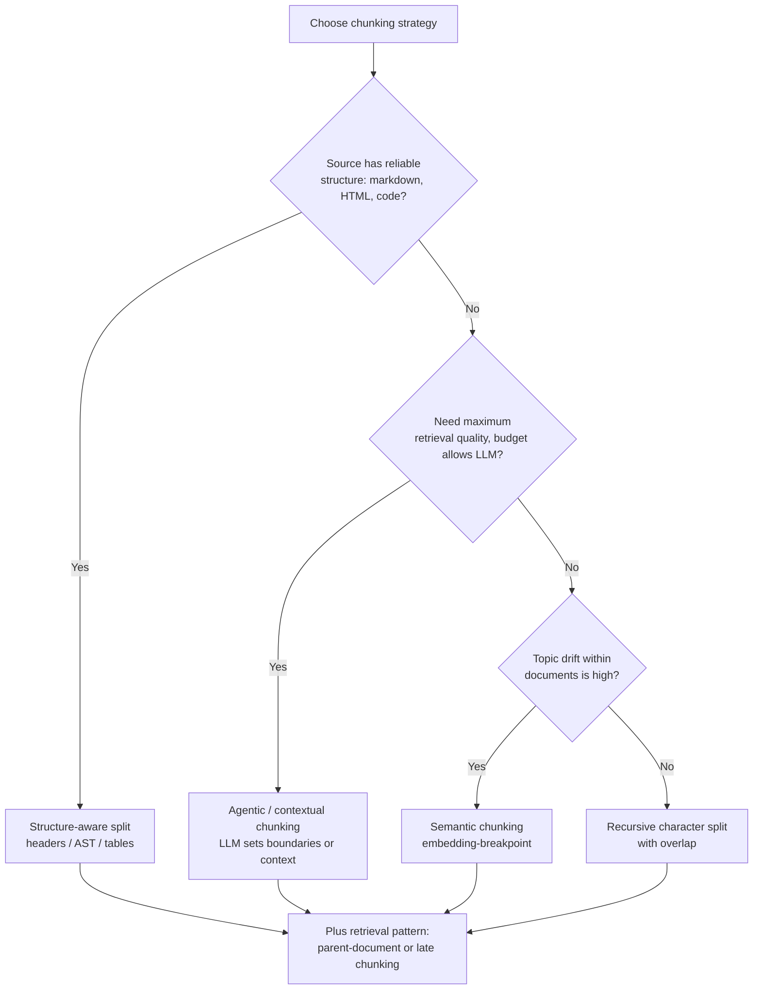
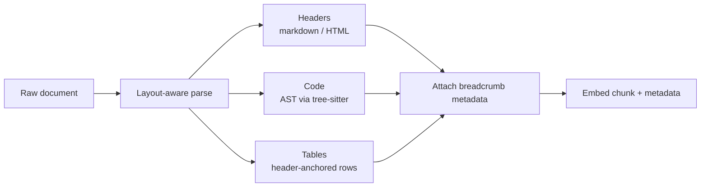
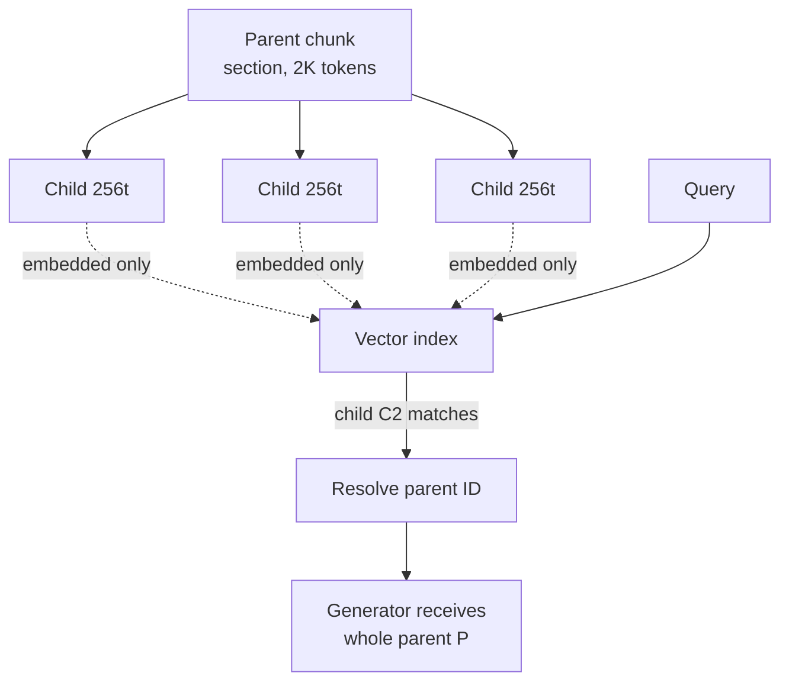

# Chunking Strategies

## Overview

Chunking decides the atomic unit of retrieval: too small and chunks lack the context to be matched or to answer a question alone; too large and precision collapses because one chunk carries many irrelevant topics that dilute both the embedding and the prompt. It is the cheapest lever in the RAG stack — no GPU required — and one of the few levers that changes *what can be retrieved* rather than how well a fixed candidate set is ranked. This page covers the split algorithms (fixed, recursive, semantic, agentic, structural-aware), the retrieval patterns built on them (parent-document, small-to-big, late chunking), and the measured effects of chunk size on recall and precision.

Scope note: the fundamentals page [RAG (Retrieval-Augmented Generation)](../llm-serving/rag.md) covers the naive pipeline and chunk-size trade-offs briefly; [RAG Systems](../rag-systems.md) covers ingestion for multi-modal sources. This page goes a level deeper on the splitting algorithms and the retrieval patterns that compensate for chunking mistakes.

## Why Chunking Is a Retrieval Decision

A chunk plays two incompatible roles. At **match time** it must be a semantic unit similar to likely queries — a dense embedding summarizes the whole chunk into one vector, so any second topic in the chunk contaminates that vector. At **generation time** it must carry enough surrounding context for the LLM to use it — a 100-token snippet extracted from a 5,000-token policy document often cannot be interpreted standalone ("the deductible is waived" for whom, from when?). Chunking strategy is the engineering answer to this tension, and the advanced patterns (parent-document, late chunking) exist precisely to give the two roles different granularities.

Three quantitative forces set the bounds:

- **Embedding model training length.** Most retriever embedders were trained on passages up to 512 tokens (BERT-lineage); embeddings of longer inputs degrade because the model was never supervised there. Long-context embedders (jina-embeddings-v2/v3 at 8K-32K, trained specifically for long documents) shift the feasible range but do not remove the precision problem.
- **Recall/precision curve.** Smaller chunks raise recall (more distinct units, one of which matches the query tightly) and lower precision (each unit carries less answer-usable context, and k units cover less material). Larger chunks do the opposite. The optimum moves with question type: factoid lookups favor small, synthesis questions favor large.
- **Context budget.** With a 10K-token prompt budget and k=10 retrieved chunks, average chunk length is 1K tokens; chunking at 256 tokens means k=10 covers only 2.5K tokens of corpus and misses context that neighboring chunks would supply. Chunk size and top-k must be co-designed, not tuned independently.



## Fixed-Size and Recursive Splitting

**Fixed-size** splitting cuts the token stream every `size` tokens with `overlap` tokens re-used across boundaries. It is deterministic, O(n), and embarrassingly parallel, which is why it remains the default at scale. Overlap exists because a sentence spanning a boundary would otherwise be unretrievable as a whole: with 10-20% overlap, a fact cut in half appears complete in at least one chunk. The costs are index bloat (1.1-1.2× more chunks) and duplicate matches that fusion must deduplicate.

**Recursive character splitting** tries a hierarchy of separators — paragraph (`\n\n`), then line (`\n`), then sentence (`. `), then word — cutting on the first separator that keeps pieces under the size limit. It respects natural boundaries where they exist and falls back to hard cuts only inside unbreakable spans. LangChain's `RecursiveCharacterTextSplitter` popularized the approach; LlamaIndex's `SentenceSplitter` is the sentence-aligned equivalent.

```python
# Recursive split with overlap, token-budgeted (stdlib tokenizer stand-in)
def recursive_split(text, size=512, overlap=64, separators=("\n\n", "\n", ". ", " ")):
    if len(text) <= size:
        return [text]
    for sep in separators:                      # prefer the strongest boundary
        parts = text.split(sep)
        if len(parts) > 1 and max(len(p) for p in parts) <= size:
            chunks, cur = [], []
            for p in parts:                     # pack pieces up to size
                if sum(len(x) for x in cur) + len(p) > size and cur:
                    chunks.append(sep.join(cur))
                    cur = cur[-overlap:]        # re-use tail as overlap
                cur.append(p)
            chunks.append(sep.join(cur))
            return chunks
    # no separator helps: hard cut with overlap
    step = size - overlap
    return [text[i:i + size] for i in range(0, len(text), step)]
```

Two tuning facts interviews probe: overlap is insurance against boundary loss, not a quality feature — beyond ~20% it mostly duplicates index entries; and token counting must match the *embedding model's* tokenizer, not the generator's, or measured 512-token chunks may be 400 or 700 real embedding tokens.

## Semantic Chunking

Semantic chunking embeds individual sentences, then cuts where the cosine similarity between adjacent sentences drops below a threshold (or at the bottom percentile of a sliding window), keeping runs of similar sentences together as one chunk. It adapts to topic structure: a transcript that drifts from pricing to support gets a split where the drift happens, which a fixed 512-token window would ignore. DoubleTextEmbedding alternatives include comparing each sentence to its k-th nearest neighbors (the approach in the original "semantic chunking" LlamaIndex implementation, after the Dense X Retrieval paper framed propositions as the retrieval unit).

The empirical record is more mixed than the intuition. Semantic chunking multiplies embedding cost at index time (one embedding per sentence rather than per chunk), depends heavily on the similarity threshold (too sensitive produces many tiny chunks, too lax reproduces fixed-size), and on several public comparisons it lands within noise of a well-tuned recursive split. It is worth deploying when documents are long-form and topically heterogeneous (transcripts, meeting notes, essays) and worth skipping when documents already carry structure. Evaluate it as a hypothesis on your golden set, not as an upgrade — see [RAG Evaluation](./rag-evaluation.md) for the harness that decides this cheaply.

## Agentic and Contextual Chunking

**Agentic chunking** (also LLM-based or proposition chunking) asks an LLM to draw the boundaries or to split text into atomic self-contained propositions, following the *Dense X Retrieval* line of work (Chen et al., 2023), which showed propositional units can improve factoid retrieval precision. The LLM enforces the property a fixed window cannot: each chunk is a complete thought, with pronouns resolved and context embedded. The cost profile is the catch — one LLM call per document segment (thousands of calls for a large corpus) plus a slower index build that must be re-run when the chunking prompt changes.

**Contextual retrieval** (Anthropic, 2024) attacks the same standalone-readability problem from the other side: keep your existing chunks, but prepend a 50-100 token LLM-generated sentence situating each chunk in its document ("This chunk is from section 4.2 of the Acme 2024 benefits policy; it covers dental deductible waivers for EU employees"). Anthropic reported retrieval failures reduced by 35% from contextual insertion alone, 49% combined with hybrid retrieval, and 67% with hybrid plus reranking on their benchmark suite. Because a naive implementation makes one LLM call per chunk, Anthropic recommends prompt caching to amortize document-level context — the document preamble is cached and only the chunk is re-sent, cutting cost roughly 4× in their published numbers.

| Pattern | Boundary decision | Context added | Index-time cost | Best for |
|---|---|---|---|---|
| Fixed-size | Token arithmetic | None | Trivial | Uniform text, massive scale |
| Recursive | Separator hierarchy | None | Trivial | Default choice |
| Semantic | Embedding breakpoints | None | 1 embed/sentence | Topically drifting prose |
| Agentic / propositions | LLM decision | Pronoun resolution | 1+ LLM call/segment | Factoid QA over messy docs |
| Contextual retrieval | Keep chunking | LLM-written header | 1 LLM call/chunk (cached) | Chunk servers where per-chunk context is missing |

## Structural-Aware Chunking

Structure is the cheapest high-quality boundary signal because a human already encoded semantics in it. **Markdown/HTML header splitting** cuts at heading boundaries and attaches the header path (`Doc > Section 3 > Refunds > EU`) as metadata; queries mentioning "EU refunds" then match on that metadata even when the body text omits the word. **Code splitting** must never cut mid-function: split on AST node boundaries (tree-sitter grammars, used by LangChain's language-aware splitters and by tree-sitter-based tools generally), keeping each function or class intact and prepending the file path and signature. **Tables** are a special case: a row split from its header is meaningless, so keep small tables whole, and for large tables emit one chunk per row with the header row repeated, or the flattened schema-plus-row representation. **PDF extraction** precedes all of this — layout-aware parsers (unstructured, docling-style layout models) decide whether a visual block is a table, a figure caption, or body text, and the seven-failure-points literature (Barnett et al., 2024) identifies extraction errors as a top failure class that chunking polish cannot repair.



Structural awareness also upgrades **parent-document retrieval** below: the "parent" of a table row is the whole table, and the parent of a section chunk is the section, both naturally defined by structure.

### A concrete structural example

The same 900-word policy document produces very different index entries depending on the splitter, and the differences are exactly where recall is won or lost:

```text
Input (markdown):
# Refunds Policy
## EU Customers
### Window
Refunds are accepted within 30 days...
### Exclusions
Digital goods are excluded...

Fixed 512-token split:      ["# Refunds ... 30 days ... exclusions ...", ...]
                            one chunk mixes EU window + exclusions; header lost

Header-path split:          breadcrumb="Refunds Policy > EU Customers > Window"
                            chunk body="Refunds are accepted within 30 days..."
                            metadata carries the full path for filtering
```

The header-path chunk answers "what is the EU refund window?" with an embedding dominated by refund-window content, and a metadata filter `section=EU Customers` restricts retrieval for tenant- or region-scoped questions. The fixed split answers neither query cleanly. This asymmetry — structure costs nothing at parse time and buys specialization at match time — is why structural splitting is the first upgrade over recursive for any corpus that has structure to begin with.

### Splitter selection matrix

| Source type | Recommended splitter | Parent unit | Watch out for |
|---|---|---|---|
| Markdown / HTML docs | Header-aware split | Section | Deeply nested docs → tiny leaves; merge shallow sections |
| Code repositories | AST (tree-sitter) per function/class | File or class | Generated code, vendored code — filter before indexing |
| Tables in PDF/HTML | Row chunks with header, or whole table | Table | Merged cells; caption lost unless attached |
| Chat / ticket threads | Per-message with thread parent | Thread | Signatures and quoted replies polluting embeddings |
| Transcripts / meeting notes | Semantic or speaker-turn | Topic block | Overlapping speakers; timestamps as noise |
| Long-form prose | Recursive 512 ± 10-20% | Chapter | Anthropic-style contextual headers help most here |
| Multilingual corpora | Language detect → per-language config | Same | Tokenizer token-per-word ratio differs 2-4× by language |

Multilingual corpora deserve the explicit callout: a 512-token budget that fits a 350-word English paragraph fits a 550-word German one or a 900-character Japanese one, so a single global chunk size silently produces very different information density per language. Per-language configuration keyed off language detection is the standard production answer.

## Parent-Document and Small-to-Big Retrieval

Parent-document (small-to-big) retrieval decouples the two roles of a chunk: *match* on small child chunks (high precision embedding), *generate* from the parent (large block with full context). At index time a parent chunk (e.g., 2K tokens: a section) is split into children (e.g., 256 tokens), and only children are embedded. At query time the matched child returns its parent ID; the system deduplicates parents, and the generator receives whole parents instead of fragments. LlamaIndex ships this as `AutoMergingRetriever` plus `SentenceWindowNodeParser` (retrieve a single sentence, expand to a surrounding window); LangChain ships `ParentDocumentRetriever`.

The pattern trades index size for precision and is the standard fix for two symptoms: answers that quote the right sentence but miss the constraint two paragraphs earlier, and top-k lists where five children of the same section crowd out diversity. Variants in the same family: **sentence-window** (one retrieved sentence ± w neighbors) and **hierarchical merging** (retrieve leaves, merge into parents when a parent wins above a child-hit threshold, freeing slots for other parents).



## Late Chunking

Late chunking (Jina AI, 2024) inverts the usual embed-then-split order. Instead of splitting first and embedding each chunk independently, it runs the **whole document through a long-context embedding model once** and pools the token-level output vectors into per-chunk embeddings afterwards. Every chunk embedding is therefore *contextualized*: the vector for a late-document chunk has attended to the document's title, definitions, and earlier constraints, because the transformer saw them before producing those tokens. This fixes the same core weakness as contextual retrieval (chunk embeddings that lack document context) with zero additional LLM calls — the cost is one long-context embedding pass per document instead of N short passes, and it requires an embedder whose tokenizer/attention is designed for long inputs (the technique was demonstrated with jina-embeddings-v2/v3 at 8K contexts).

| | Standard chunk-then-embed | Late chunking | Contextual retrieval |
|---|---|---|---|
| Chunk embedding sees document context | No | Yes (via attention) | Yes (via prepended summary) |
| Extra LLM calls | 0 | 0 | 1 per chunk (cached) |
| Requires long-context embedder | No | Yes | No |
| Works with any embedder | Yes | No | Yes |

Late chunking and contextual retrieval are complementary rather than competing: one contextualizes with attention, the other with generated text, and the choice depends on whether your embedder supports long inputs and whether your pipeline tolerates LLM calls at index time.

## Chunk-Size Effects: Recall and Precision

The size curve is not folklore; it is measurable on any labeled set, and its shape is consistent across public evaluations: **recall of answer-bearing units rises with smaller chunks and falls with larger ones; downstream answer quality rises with larger context and falls with over-fragmentation, with the crossover depending on question type.** Concretely:

- At chunk 128 tokens, k=20 covers 2.5K tokens: high chance the answer snippet is somewhere in the pool, low chance the LLM can assemble it without its missing surroundings. Recall-oriented metrics look great; faithfulness and completeness suffer.
- At 1024+ tokens, each embedding averages 4-8 topics: the vector is a blurry mixture, exact-match queries (IDs, error codes) degrade, and top-k returns fewer distinct sources. Precision-oriented metrics and citation granularity suffer.
- The classic failure at large sizes is *topical contamination*: a chunk spanning "pricing" and "refunds" ranks mediocrely for both queries instead of top for either — the embedding interpolates rather than specializes.
- For factoid questions, propositional/agentic chunking shows measurable precision gains in the Dense X Retrieval study; for synthesis questions ("summarize the policy position"), larger chunks or parent-document retrieval win because they preserve argument structure.

## Worked Budget Arithmetic

A back-of-envelope calculation interviewers like, because it turns chunk size from taste into arithmetic. Corpus: 50,000 documents averaging 4,000 tokens. Prompt budget: 8K tokens for context, k=10 final chunks.

```text
Chunk = 512 tokens (+ 12% overlap ⇒ effective ~457 new tokens per chunk)
  chunks per corpus  = 50,000 × 4,000 / 457      ≈ 438,000 chunks
  embedding cost     = 438,000 × 512 tokens      ≈ 224M embedding tokens (one-time)
  context coverage   = 10 × 512  = 5,120 tokens  (64% of budget; 40 full paragraphs)

Chunk = 1,024 tokens (+ 10% overlap)
  chunks per corpus  ≈ 50,000 × 4,000 / 922      ≈ 217,000 chunks   (2× fewer)
  embedding cost     ≈ 222M embedding tokens     (same — overlap counts)
  context coverage   = 10 × 1024 = 10,240 tokens (over budget: k must drop to 7)

Parent-document (children 256 / parents 2,048):
  children           ≈ 50,000 × 4,000 / 256      ≈ 781,000 embedded units (1.8× index)
  prompt             = 4 parents × 2,048         = 8,192 tokens, all coherent
```

The reading: chunk size barely moves total embedding cost (overlap and duplication, not size, drive it), but it moves *context coherence* a lot — at 512 tokens the generator sees ten fragments; parent-document retrieval shows four whole sections for the same budget. Index size, not cost, is the real price of smaller units, and HNSW memory scales with chunk count (see [HNSW](../../search/hnsw.md)).

## Practical Defaults and Tuning Recipe

Practical defaults distilled from production experience and public evaluations (they are starting points; your golden set decides):

| Parameter | Default | Rationale |
|---|---|---|
| Chunk size | 256-1024 tokens (512 common) | Embedder training length; context budget math |
| Overlap | 10-20% of size | Boundary insurance; beyond that pure index bloat |
| Child chunk (small-to-big) | 128-256 tokens | Tight matching unit |
| Parent chunk | 1024-2048 tokens | Self-contained generation unit |
| k to reranker | 50-200 children | Feed the reranker, not the LLM |
| Final context | 2-10 parents, 2-10K tokens | Lost-in-the-middle and budget limits |

Two boundary conditions: tables and code should override the defaults (whole-table or whole-function chunks regardless of size); and whenever the embedder or generator model changes, re-run the size sweep — the optimum is model-dependent, not a corpus constant.

## Pitfalls

1. **Tuning chunk size without a labeled eval.** Without golden queries and chunk-level relevance labels, "seems better" is the only signal, and it tracks the last anecdote heard.
2. **Matching the generator's tokenizer for embedding chunks.** Mismatched tokenizers silently produce off-budget chunks for the embedding model.
3. **Cutting tables, lists, and code on the default separator.** A one-line-per-chunk table is unretrievable noise; structural splitting is not optional for these types.
4. **Overlap as a fix for bad boundaries.** High overlap masks (and bloats) what a better strategy — structural, semantic, or parent-document — would fix at the root.
5. **Re-chunking without re-indexing discipline.** Changing chunk size invalidates embeddings, lexical statistics, and any stored parent mappings; it is a migration, not a parameter tweak (see [Distributed RAG Systems](../advanced/distributed/distributed-rag.md) for zero-downtime re-index patterns).

## Interview Questions

1. **Why does chunk size trade recall against precision, and which direction does your workload need?** Smaller chunks make the embedding more specialized, so the answer-bearing unit is more likely to appear somewhere in top-k (recall up), but each unit carries less usable context and covers less material at fixed k (precision and completeness down). Larger chunks do the reverse: fewer, blurrier vectors that match less tightly but answer more completely when they match. Factoid-heavy workloads (lookup, support macros) bias small; synthesis workloads (policy summaries, comparisons) bias large or parent-document. The honest answer is to sweep 256-1024 on a labeled set and report the crossover point for your question mix.
2. **What problem do parent-document and small-to-big retrieval solve that plain chunking cannot?** They decouple the match unit from the generation unit, which a single fixed granularity cannot do. The child (128-256 tokens) gives the embedding model a specialized, uncontaminated vector to match against; the parent (1-2K tokens) gives the LLM the surrounding constraints and definitions that make the matched sentence interpretable. This fixes the recurring symptom of an answer that quotes the right line but misses the exception two paragraphs earlier. The costs are parent-deduplication logic, index-time bookkeeping of parent IDs, and larger prompts, all of which are cheap compared with the quality gain on document-grounded corpora.
3. **Explain late chunking and when you would prefer it over contextual retrieval.** Late chunking embeds the whole document with a long-context embedder once, then pools token embeddings into per-chunk vectors, so every chunk embedding has attended to the document's global context — no LLM calls, no prompt templates. Contextual retrieval instead keeps ordinary chunking and pays one LLM call per chunk (amortized with prompt caching) to prepend a situating sentence, which works with any embedder. Prefer late chunking when your embedder is long-context and you want zero LLM cost at index time; prefer contextual retrieval when you must keep a fixed embedder (compliance, existing index) or when you want the context sentence itself to be searchable text. They compose: contextual headers plus late chunking are not contradictory.
4. **You retrieve the right chunk but the LLM's answer misses a constraint stated in the neighboring chunk. What are your options?** First, verify the constraint chunk is in the prompt at all — if the neighbor was not retrieved, the fix is retrieval-side: parent-document retrieval so neighbors travel together, or a larger final context with the k cut raised. If both chunks are in the prompt, the failure is generation-side: order the most relevant chunk first and last (lost-in-the-middle positioning), or compress distractors. If the constraint lives in a table that was shredded at ingestion, the fix is structural chunking before anything else. The diagnostic distinction — absent vs present-but-unused — is exactly what context-precision and context-utilization metrics measure in an evaluation harness.
5. **Why is 10-20% overlap the common recommendation, and what goes wrong outside that band?** Overlap duplicates a sliding window of text across adjacent chunks so that any sentence cut by a boundary appears complete in at least one indexed chunk; at 10-20% of chunk size this covers typical sentence and short-paragraph spans. Below ~10%, boundary sentences (and the facts inside them) can become unretrievable as whole units; above ~20%, the index grows materially while gains flatten, and the same passage starts winning multiple slots in top-k, which wastes context budget and requires deduplication. Overlap is also a smell: if you need 50% overlap to hit quality targets, the boundaries are wrong, and structural or semantic chunking is the root fix.
6. **How would you evaluate whether semantic chunking is worth its embedding cost on your corpus?** Treat it as an experiment, not an upgrade: build a golden set of real queries with chunk-level relevance labels, then run the existing recursive splitter and the semantic splitter head-to-head through the identical downstream stack (same fusion, reranker, top-k). Measure retrieval metrics first (recall@N, nDCG@10) and only then end-to-end answer quality, plus the index-time cost delta (roughly one embedding per sentence). If the delta is within noise on your question mix — common on structured corpora where headers already mark boundaries — keep the cheaper splitter and spend the budget on reranking. The experiment costs a day and prevents a quarter of folk-optimization.

## Key Takeaways

- Chunking sets the atomic unit of retrieval; it is the cheapest lever in the stack and changes what *can* be found, not just how well.
- The two roles of a chunk (matching unit vs generation unit) conflict; parent-document/small-to-big and late chunking resolve the conflict by giving each role its own granularity.
- Recursive character splitting is the default; structural awareness (headers, ASTs, tables) beats any text statistic wherever structure exists; semantic and agentic chunking are hypotheses to test, not defaults to install.
- Contextual retrieval (Anthropic: 35-49% fewer retrieval failures with hybrid) buys per-chunk context with cached LLM calls; late chunking buys it with one long-context embedding pass and zero LLM calls.
- Practical defaults: 256-1024 token chunks, 10-20% overlap, children 128-256 for matching, parents 1-2K for generation, k to the reranker 50-200.
- Chunk size and top-k must be co-designed against the context budget; the optimum is question-type-dependent and model-dependent, so re-sweep on every embedder change.
- Table and code splitting overrides everything: a table row without its header or a function cut mid-body is noise that no reranker can save.

## References

- D. Chen et al., "Dense X Retrieval: What Retrieval Granularity Should We Use?", ACL 2024 — <https://arxiv.org/abs/2312.06648>
- Anthropic, "Introducing Contextual Retrieval" (2024) — <https://www.anthropic.com/news/contextual-retrieval>
- Jina AI, "Late Chunking: Contextual Chunk Embeddings Using Long-Context Embedding Models" (2024) — <https://jina.ai/news/late-chunking-in-long-context-embedding-models/>
- G. Gunther et al., "Jina Embeddings 2: 8192-Token General-Purpose Text Embeddings for Long Documents", 2023 — <https://arxiv.org/abs/2310.19923>
- I. M. Barnett et al., "Seven Failure Points When Engineering a Retrieval Augmented Generation System", CAIN 2024 — <https://arxiv.org/abs/2401.05868>
- N. F. Liu et al., "Lost in the Middle: How Language Models Use Long Contexts", TACL 2024 — <https://arxiv.org/abs/2307.03172>
- LangChain, "Text splitters" (RecursiveCharacterTextSplitter, language-aware splitters) — <https://python.langchain.com/docs/concepts/text_splitters/>
- LlamaIndex Documentation, "Node postprocessors / retrievers" — <https://docs.llamaindex.ai/>

## Cross-References

- [RAG (Retrieval-Augmented Generation)](../llm-serving/rag.md) — the fundamentals page whose chunking section this expands
- [Rerankers: Deep Dive](./rerankers-deep.md) — what the reranker does with the chunk pool you feed it
- [Hybrid Search and Fusion](./hybrid-search-fusion.md) — the retrievers that consume these chunks
- [RAG Evaluation](./rag-evaluation.md) — the golden-set harness that decides chunking experiments
- [GraphRAG](./graphrag.md) — an alternative "chunk": entities and relations extracted from text
- [RAG Systems: Architecture and Production Patterns](../rag-systems.md) — ingestion and multi-modal extraction context
- [Long Context vs RAG](./long-context-vs-rag.md) — the alternative to chunking: skip retrieval, pay per token
