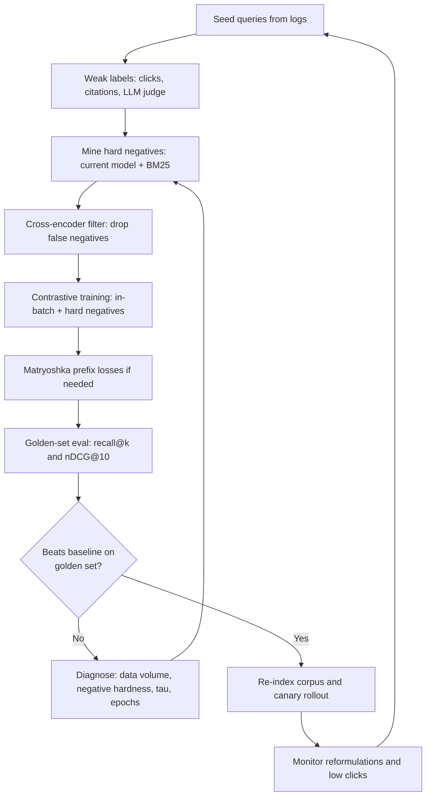

# Embedding Fine-Tuning

## Overview

The embedding model is the single highest-leverage component in a RAG stack: if stage-1 retrieval does not surface the answer-bearing chunk, no reranker, prompt, or generation trick recovers it. Off-the-shelf embedders are trained on generic web text and degrade predictably on domain vocabulary — product codes, clinical terminology, legal clause names, code identifiers. This page covers how to train or adapt an embedding model for your corpus: the contrastive objective with in-batch negatives, hard-negative mining, Matryoshka representations (arXiv 2205.13147) for tunable dimensionality, instruction-tuned embedders like E5-Mistral (arXiv 2401.00368), a concrete domain-adaptation recipe, MTEB-based evaluation, and the decision of when fine-tuning the retriever beats engineering more context.

Scope note: [Embeddings](../llm-serving/embeddings.md) covers what embeddings are and how they serve; the general contrastive-learning machinery (InfoNCE, SimCLR, CLIP, negative sampling) is in [Contrastive Learning](../../ml/foundations/contrastive-learning.md). This page is the retrieval-specific training playbook: how to make the vector space *your corpus's* space.

## The Objective: Contrastive Training with In-Batch Negatives

Embedding models for retrieval are trained with a contrastive objective: pull the query close to its positive document, push it away from negatives, in the angle space of a shared encoder. The standard loss is InfoNCE over cosine similarities \( s(q, d) = \cos(e_q, e_d) \):

\[ \mathcal{L}(q, d^{+}) = -\log \frac{\exp(s(q, d^{+})/\tau)}{\exp(s(q, d^{+})/\tau) + \sum_{j=1}^{N} \exp(s(q, d^{-}_{j})/\tau)} \]

where \( \tau \) is a temperature (typically 0.01-0.05 — small values sharpen the softmax and punish near-misses harder) and the \( d^{-}_{j} \) are negatives. The negative pool is the design decision. **In-batch negatives** take every other document in the batch as a free negative: with batch size \( B \), each query gets \( B-1 \) negatives at zero extra cost, since all document embeddings are already computed for the batch. This is why embedding training is batch-size-bound: DPR (Karpukhin et al., 2020) used in-batch plus one BM25 hard negative; modern recipes scale batches to 512-4096 across GPUs precisely to grow the negative pool.

The catch is that in-batch negatives are *uniformly easy* — documents in a random batch are usually about unrelated topics, so the model learns coarse topic separation quickly and then stops improving. A batch of 1024 generic passages contains perhaps one near-duplicate of any given query's positive. That ceiling is what hard-negative mining exists to break, and the two techniques compose: in-batch negatives supply volume, hard negatives supply difficulty. Typical production ratios are a few hard negatives per query on top of the full batch, with the batch mixed so positives and their mined negatives co-occur.

A clarifying contrast belongs next to the objective: **continued pretraining is not contrastive training**. Feeding the encoder more of your corpus's raw text (masked-language-modeling style) adapts its language statistics but does nothing to the geometry between queries and passages, which is what retrieval scores. The contrastive pair is the unit of improvement — every useful fine-tune contains queries, and document-only adaptation is pitfall #5 below. If all you have is documents and no queries, the first data-engineering task is synthesizing candidate queries per chunk ("read this passage, what would a user have typed to find it?") — the same primitive E5-Mistral scales to industrial size.

| Lever | What it improves | Typical setting | Cost |
|---|---|---|---|
| In-batch negatives | volume of negatives, gradient stability | batch 256-4096 | GPU memory (scales ~linearly) |
| Temperature \( \tau \) | hardness of the objective | 0.01-0.05 | tuning runs |
| Hard negatives (1-7/query) | fine-grained ranking | mined per query below | mining pipeline + ~2× train time |
| Cross-encoder filtering | false-negative removal | below | one pass over mined pairs |

One implementation detail bites everyone once: with in-batch negatives, batch composition *is* the negative distribution. Batches assembled by sampling documents independently at random give easy negatives; batches grouped by topic give harder ones; batches that accidentally contain a query's true positive create label noise (a false negative inside the batch). Curriculum through batch construction — topic-grouped sampling — is a known free win, and it requires no algorithm change, only a dataloader.

### Space Mechanics: Temperature, Symmetry, Normalization

Three mechanics decide whether a trained space behaves at serving time, and each is a one-line setting with outsized consequences. **Normalization**: cosines require unit-norm vectors, so the training loop should normalize both sides before scoring; skipping it means the model can lower loss by shrinking magnitudes instead of separating directions, which produces vectors whose dot products are calibration garbage. **Symmetry**: retrieval is asymmetric (short query, long passage) while STS is symmetric; encoders trained only on symmetric objectives put queries and passages in the same distribution and underperform on retrieval — hence the E5 `query:` / `passage:` prefixes, which are the cheap version of teaching the encoder two input modes. **Temperature**: with τ too high (0.1+) the softmax is flat and gradients barely distinguish the positive from a dozen near-misses; with τ too low (0.005) training becomes brittle to noisy labels, because one false negative dominates the batch's gradient. Sweep τ on the golden set before sweeping anything else; it is the highest-variance hyperparameter in the recipe.

A minimal sentence-transformers training fragment shows how little code the core recipe is — the difficulty lives in the data pipeline, not the loss:

```python
from sentence_transformers import SentenceTransformer, InputExample
from sentence_transformers.losses import MultipleNegativesRankingLoss
from sentence_transformers.models import Normalize

model = SentenceTransformer("BAAI/bge-base-en-v1.5")
train = [InputExample(texts=[q, pos, hard_neg]) for q, pos, hard_neg in pairs]
loss = MultipleNegativesRankingLoss(model)   # in-batch negatives + hard negs
model.fit(train_objectives=[(loader, loss)], epochs=1, warmup_steps=100,
          show_progress_bar=True)            # batch size = negative pool size
```

The `MultipleNegativesRankingLoss` line is the in-batch mechanism made explicit: every `(q, pos, hard_neg)` row contributes its positive *and* its hard negative, and every other row's texts become additional in-batch negatives — so enlarging the dataloader's batch size is literally enlarging the negative pool. Production training adds distributed gathering (all-reduce of embeddings across GPUs so the pool spans the whole global batch), the Matryoshka wrapper described below, and the mining/filter jobs feeding `pairs`; the loss itself rarely changes.

## Hard-Negative Mining

Hard negatives are documents that score high under the *current* retriever but are not relevant — the passages a deployed system would confuse with the answer. Training on them teaches the model exactly the boundary it fails on in production. The standard pipeline has three generations of technique:

- **Lexical mining (DPR era, 2020).** Take BM25's top-k for each query, exclude the known positive, use one or two as negatives. Cheap and effective; the negatives are lexically similar but not necessarily embedding-hard, and BM25 top-k is top-heavy with easy distractors on jargon-heavy corpora.
- **ANN mining with refresh (ANCE, 2020).** Xiong et al. index the corpus with the *current* encoder and mine its top-scoring non-relevant passages, asynchronously refreshing the index as training moves the space. This targets the model's own failure surface — the key insight is that negatives must be mined by the model being trained, or they lag behind what the model actually confuses. The cost is an index rebuild every few epochs.
- **Denoised mining (RocketQA, 2021).** Qu et al. observed that top-ranked non-positives contain *false negatives* — genuinely relevant passages mislabeled by the dataset. A cross-encoder filters mined negatives before training, and their experiments show denoising matters as much as the negatives themselves. Production rule: every mined negative should be scored by a strong cross-encoder; anything scoring like a positive is dropped, not trained against.

Quantity guidance from the literature: 1-7 hard negatives per query is the useful band. DPR's single BM25 negative was enough to beat BM25 by wide margins; E5-style recipes use a handful per query; beyond ~7 per query, gains flatten while mining cost grows linearly, and the false-negative risk grows with every additional mined item. Mining should run on *your* query distribution — queries logged from the product, not benchmark questions — because the goal is the model's production failure surface, not a leaderboard's.

The train-serving mismatch closes the loop: if you mine negatives with model v1 and deploy model v2, v2's residual confusions are unknown. The recipe therefore *ends* with a fresh mining pass — deploy, log queries where the grader disagreed with retrieval, mine negatives from those, and queue v3. Hard-negative mining is not a one-time data-prep step; it is the monitoring-driven data engine that keeps the embedder aligned with real traffic.

## Matryoshka Representations

Matryoshka Representation Learning (Kusupati et al., 2022, arXiv 2205.13147) trains an embedding so that *every prefix of the vector is itself a usable embedding*: the first 64 dimensions encode the coarse signal, the first 256 a mid-grain one, the full 3072 the finest. The trick is the loss — instead of one contrastive loss on the full vector, sum losses over truncated prefixes, each re-normalized to the unit sphere:

\[ \mathcal{L} = \sum_{m \in \mathcal{M}} w_m \, \mathcal{L}_{\text{contrastive}}\big( \operatorname{norm}(z_{1:m}), \, \operatorname{norm}(z'_{1:m}) \big) \]

with \( \mathcal{M} \) a ladder of prefix sizes (e.g., 64, 128, 256, 512, 1024, 3072) and \( w_m \) roughly uniform. Each prefix is optimized to rank correctly *on its own*, so truncation at inference — take the first \( m \) dimensions, done, no model call — trades a little ranking quality for proportional savings in storage, memory bandwidth, and ANN latency.

The production economics make this a deployment default rather than a novelty. OpenAI's text-embedding-3 models ship with exactly this property (3-large: 3072 native, offered at 256/1024/3072), and the cohort of open Matryoshka-trained models covers the common dims ladder. The arithmetic for a 100M-chunk corpus at float32 shows why: 3072 dims is ~1.23 TB of vectors and a heavy HNSW graph; 1024 dims is ~410 GB; 256 dims ~103 GB — a 12× storage cut for a modest recall cost, and smaller vectors mean more of the index fits in RAM, which often *recovers* latency despite the theoretical quality loss.

| Prefix dims | Storage per 1M chunks (f32) | ANN cost effect | Typical quality retention |
|---|---|---|---|
| 3072 (native) | ~12.3 GB | baseline | 100% |
| 1536 | ~6.1 GB | ~half memory bandwidth | ≈99% |
| 1024 | ~4.1 GB | 3× cheaper | ≈98% |
| 512 | ~2.0 GB | 6× cheaper | ≈96% |
| 256 | ~1.0 GB | 12× cheaper | ≈93-96% |

(The retention column is the commonly observed range on retrieval benchmarks when the model was trained with MRL; verify on your own golden set — non-MRL models degrade sharply under truncation because their information is *smeared* across all dimensions rather than ordered.)

Two usage patterns dominate. **One model, tiers of service**: full dims for the "quality" pipeline, truncated dims for bulk pre-filtering or for the 80% of queries where quality headroom is wasted — the same index, sliced per route. **Retrieve-then-rerank at scale**: coarse recall with 256-dim vectors over a huge pool, then the cross-encoder ([Rerankers: Deep Dive](./rerankers-deep.md)) spends the budget only on survivors; Matryoshka exists precisely to make stage 1 cheap enough to go deep. The implementation cost is honest but real: MRL training wants the big-batch contrastive machinery, and the ladder multiplies loss computation ~5-6×, which is GPU time, not architecture change.

Truncation is a pure serving-time operation — the embedding function is unchanged, only the stored slice differs:

```python
def embed_truncate(texts, dims=256):
    vecs = model.encode(texts, normalize_embeddings=True)  # full 1024
    return vecs[:, :dims]      # MRL-trained: first k dims still rank well

# then re-normalize the slice before indexing, or cosine breaks
```

The one-line footgun is the second comment: a truncated slice of a unit vector is no longer unit-norm, so the index build or the query path must re-normalize — indexes that assume normalized vectors will silently rank wrong, and the bug hides behind plausible-looking top-k results. Teams adopting truncation should also re-run ANN recall measurements per dim tier, because the interaction with HNSW's `ef`/candidates settings shifts: smaller vectors change the graph's neighbor geometry, and the `efConstruction` tuned for 1024 dims can over- or under-shoot for 256.

A third pattern — **adaptive dimensionality** — routes per query: embed once at full dims, retrieve at the truncated tier, and only if the grader's confidence is low re-slice at a higher tier or re-run the query at full dims. This composes directly with the corrective loops in [Agentic RAG](./agentic-rag.md), where "retry with a better retrieval configuration" is already a state: Matryoshka makes the retry a different slice of the same vector instead of a different model. The measurement requirement is identical to every tiering scheme — golden-set recall per tier, and a monitor on how often queries escalate, because an escalation rate above ~20% means the coarse tier is mis-sized and the savings are illusory.

## Instruction-Tuned Embedders: E5-Mistral and the Synthetic-Data Generation

The 2024 cohort of embedders changed the recipe twice. First, backbone scale: E5-Mistral (Wang et al., 2024, arXiv 2401.00368) fine-tunes Mistral-7B as an embedding model and showed that a 7B decoder backbone with contrastive training beats the prior generation of 300M-500M-parameter specialists — its 56.6 on MTEB retrieval led published results at release. Second, data provenance: instead of curating human-labeled pairs, E5-Mistral generates training data *from an LLM* — few-shot prompting GPT-4 to produce (task instruction, query, positive document, hard negatives) tuples across dozens of task types spanning web search, QA, clustering, and STS — then trains with in-batch negatives plus those mined hard negatives.

The "instruction" part is the interface change. Each input is prefixed with a task instruction, and queries and documents are encoded *asymmetrically*:

```text
query:    Given a web search query, retrieve relevant passages that
          answer the query: <user query>
passage:  <document text>
```

The instruction tells the encoder what the query will be *used for*, which disambiguates identical strings under different intents — "python" as a search query versus "python" as a clustering label versus a passage. The same mechanism is your domain adapter: instruct with "Given a support ticket, retrieve knowledge-base articles that resolve it" and the encoder optimizes ticket→KB similarity rather than generic similarity. Nomic Embed, BGE-family, and gte-Qwen models followed the same pattern (instruction prefixes + LLM-generated training data + strong backbone), so the recipe below is not tied to one artifact.

The strategic consequence for practitioners: the barrier to a strong domain embedder dropped from "labeled retrieval dataset" to "seed queries plus an LLM for labeling" — which is why fine-tuning is now usually cheaper than the alternative levers it competes with. The remaining cost center is inference: a 7B embedder is 30-50× the compute of a 110M-parameter model per document encoded, so production designs either fine-tune a small backbone, or use the large model to distill (score pairs; train the small model against those scores) and serve the small one.

Two caveats keep the claim honest. The instruction is *trained-in* for E5-Mistral and friends — the model expects its instruction distribution, so a custom domain instruction should be accompanied by at least some training pairs phrased under that instruction, not applied cold to a checkpoint that never saw it. And the synthetic-data loop inherits the teacher's biases: GPT-4-generated queries are clean and well-formed, while real user queries are truncated, typo-ridden, and entangled — so the recipe's step 1 (real log queries) remains load-bearing even when the bulk of training pairs is synthetic.

## Choosing the Backbone and the Training Stack

The recipe's step 4 hides a decision with cost and latency consequences for years: what to train, and what to serve. The option space, with the trade each option makes:

| Option | Train cost | Serve cost | Quality ceiling | When to pick |
|---|---|---|---|---|
| Off-the-shelf, no training | none | lowest | bounded by MTEB fit | churn high, budget zero, hybrid+rerank suffices |
| Fine-tune 100-500M embedder | GPU-hours | lowest | good on jargon, weaker reasoning-heavy matching | default for most RAG corpora |
| LoRA on 7B embedder (E5-Mistral-style) | hundreds of GPU-hrs | 30-50× per doc encoded | highest zero-shot + instruction control | quality-bound problems, re-encode budgets available |
| 7B teacher → distill to small student | 7B scoring pass + small training | lowest | close to teacher on mined pairs | quality-bound problems, latency-bound serving |
| 7B as reranker instead | none | cross-encoder latency | sidesteps embedding training | when misses are ranking, not recall |

For orientation, the 2023-2025 model landscape most of these options attach to:

| Model family | Backbone / params | Native dims | MRL | Instruction prefixes |
|---|---|---|---|---|
| E5 / e5-v2 | transformer ~110-335M | 384-1024 | no | yes (`query:` / `passage:`) |
| BGE / bge-en-v1.5 | BERT-class ~110M | 768 | no | yes (short instruction on queries) |
| Nomic Embed | BERT-class ~137M | 768 | yes | yes |
| E5-Mistral | Mistral-7B | 4096 | not published | yes (per-task, trained-in) |
| gte-Qwen2 / Qwen3-Embedding | Qwen 1.5B-8B | 1536-4096 | partial | yes |
| OpenAI text-embedding-3 | closed | 3072 / 1536 | yes (256/512/1024/3072) | no (API handles it) |

The table's reading guide: MRL and instruction support are *training-time* properties that survive fine-tuning, while backbone size is a serving-cost decision — so the adaptation recipe mostly chooses the row whose serving cost fits, then rebuilds its quality with data. Everything in the recipe below is orthogonal to the row chosen, which is the point of separating recipe from model.

Two of these rows are underused and worth naming in interviews. **Distillation** decouples the quality decision from the serving decision: run the 7B embedder offline to score millions of (query, passage) pairs, then train the small student against those scores — the student serves at 110M-parameter cost with most of the teacher's domain calibration. And the last row is the honest null hypothesis: if golden-set analysis shows the answer chunk *is retrieved* but ranked below the cut, the correct move is a better reranker ([Rerankers: Deep Dive](./rerankers-deep.md)), and fine-tuning the embedder would be optimizing the wrong stage. Measure which stage owns the failure before choosing a row.

## A Domain-Adaptation Recipe

The pipeline below is the standard production sequence, parameterized with settings that are defensible starting points; every hyperparameter is later overridden by golden-set evidence, not taste.

1. **Collect seed queries.** 5K-100K real queries from logs, search boxes, ticket titles, or the eval set. Real phrasing matters: the queries must look like production traffic, including typos and acronyms, because the model adapts to the query distribution as much as the corpus.
2. **Label positives cheaply.** Clicks and citations from existing logs; otherwise LLM-judge labeling — present the query and 20 BM25+dense candidates, ask which answer it, and keep confident judgments. Human labeling only for the golden eval set, which must stay separate from training data to remain an honest metric.
3. **Mine hard negatives** with the *current* model (ANN top-50 minus positives) and BM25 top-20 minus positives, then filter with a strong cross-encoder — drop any negative scoring above the positive. Keep 1-7 per query.
4. **Train contrastive** on the target backbone: full-batch in-batch negatives plus mined pairs, \( \tau \approx 0.02\text{-}0.05 \), 1-2 epochs (more overfits to the mining distribution), learning rate ~1e-5 full fine-tune or ~1e-4 LoRA (a few hundred GPU-hours for a 7B backbone at 100K examples; minutes-to-hours for a 100M model). LoRA is the standard: [PEFT](https://huggingface.co/docs/peft) adapters keep the base model swappable and the training memory bounded.
5. **Add Matryoshka** if dimension-tunable serving is wanted: wrap the loss in the prefix ladder and re-run — it composes with steps 2-4.
6. **Evaluate on the golden set first**, MTEB second. Recall@k and nDCG@10 on your labeled queries are the decision metric; an MTEB subset guards against catastrophic forgetting of generic retrieval.
7. **Deploy with an index rebuild** — new embedding space, old index is garbage; re-embed the whole corpus and canary traffic between models behind the router ([Vector Databases](../llm-serving/vector-databases.md) covers zero-downtime reindex patterns).
8. **Monitor and re-mine.** Log queries where users reformulated or clicked below rank 3; those become next quarter's hard negatives. The recipe is a loop, not a line.

For step 4 specifically, the hyperparameter starting points that survive contact with real training runs:

| Parameter | Starting point | Adjust when |
|---|---|---|
| Batch size (global) | 256-1024 | recall plateaus early → grow pool before anything else |
| Temperature \( \tau \) | 0.02-0.05 | gradients unstable → raise; false negatives dominate → raise |
| Hard negatives per query | 1-7 | mining cost binds → cut; ranking precision short → raise toward 7 |
| Learning rate (full 110M) | 1e-5 to 3e-5 | loss oscillates → halve; underfitting → up to 5e-5 |
| Learning rate (LoRA, 7B) | 1e-4 | same shape as full-tune |
| Epochs | 1-2 | golden set still improving and mining set refreshed → allow 3 |
| Max sequence length | 256-512 tokens | long-chunk corpora → reconsider chunking first ([Chunking Strategies](./chunking-strategies.md)) |
| Loss scaling across MRL prefixes | uniform weights | storage tier underperforms → upweight that prefix |

Two long-text notes belong beside the table. Sequence length is a *chunking* decision before it is a model decision: encoders trained at 512 tokens pool their signal, and stuffing an 800-token chunk into a 512-token window silently truncates from the right — if chunks are longer than the encoder window, either the chunking or the window changes. And multilingual corpora shift the decision toward the instruction-tuned LLM-backbone family, whose cross-lingual alignment is markedly better than BERT-era specialists; if the corpus is mixed-language, add cross-lingual pairs (query in language A, passage in language B) to the training mix or the encoder will optimize one side's distribution.



## Evaluation: MTEB and the Golden Set

MTEB (Muennighoff et al., 2023, arXiv 2210.07316) is the standard multi-task benchmark — dozens of datasets across classification, clustering, retrieval, STS, reranking, and more — and the reference points worth knowing are its retrieval subset (BEIR-style nDCG@10): BM25 averages ≈41.9, strong 2022-era specialists sit in the high 40s to low 50s, E5-Mistral reported 56.6, and the current leaderboard sits above 60. Two published numbers ground the "small models suffice" calibration: text-embedding-3-large scores 64.6 on MTEB average and text-embedding-3-small 62.3, so the gap between a 33M-parameter serving model and a flagship is real but narrow for many workloads.

The trap is optimizing MTEB instead of your corpus. MTEB retrieval is generic-web QA; a legal or clinical corpus shares little of that distribution, and a fine-tune can gain +6 points on your golden set while losing 2 on MTEB — the correct trade, every time. The discipline is the directory's standard: golden set first (50-200 labeled queries per stratum, held out from training), MTEB as a regression guard only. Within the golden set, measure at the operating point that matters — recall@20 into a reranker is the RAG-relevant number, not nDCG@10 over 1000 — and re-run the full harness before any embedding-model swap, because a new embedder invalidates every cached vector.

| Reference point | Score | Source |
|---|---|---|
| BM25, BEIR average | ≈41.9 nDCG@10 | BEIR benchmark paper |
| E5-Mistral-7B (instructed) | 56.6, MTEB retrieval | arXiv 2401.00368, at release |
| OpenAI text-embedding-3-small / -3-large | 62.3 / 64.6 MTEB average | OpenAI model cards |
| Target for a domain fine-tune | +2-8 recall@20 points over the off-the-shelf baseline on *your* golden set | typical outcome of the recipe above |

That last row is the honest one: the published leaderboard tells you whether a model is *reasonable*; the golden-set delta tells you whether *your* fine-tune worked. A fine-tune that moves your recall@20 from 0.78 to 0.86 has paid for itself regardless of what it does to MTEB; one that moves MTEB and not your golden set is a science project.

### A Worked Before/After Evaluation

A concrete (illustrative) result from the recipe, shaped like real production evaluations, shows how to read one. Setup: 8K labeled queries from support-chat logs, 1.4M KB articles, golden set of 300 held-out queries stratified by class (how-to, error-code, policy, comparison):

| Configuration | recall@20 (golden) | MTEB-retrieval guard | Serving cost/query |
|---|---|---|---|
| Off-the-shelf bge-base, hybrid off | 0.78 | unchanged | baseline |
| + hybrid (BM25 fusion) | 0.83 | n/a | +5-10 ms |
| + fine-tune (recipe, 2 epochs) | 0.89 | −0.4 (noise-level) | re-index only |
| + truncated 256-dim serving tier | 0.87 | — | −70% vector memory |

Reading it the way a hiring committee would: hybrid bought 5 points cheapest (identifiers were the bulk of the misses — the classic symptom), fine-tuning bought 6 more on the jargon strata the log analysis predicted, and the truncated tier gives back 2 points only on the tier where a reranker sits behind it. The negative MTEB delta is the expected signature of domain adaptation and is not a regression; the MTEB subset exists precisely to show the drop is small and bounded. The 0.87→0.89 gap between full and truncated dims is what the reranker is expected to recover — which is measurable, and only worth paying if measured.

### What to Measure, In Order

Evaluation discipline is a sequence, not a dashboard. First, **stage-1 recall@N on the golden set** — the ceiling metric; if it did not move, nothing downstream matters and the training recipe (not the threshold) is the problem. Second, **end-to-end answer quality on the same queries** through the full pipeline — recall gains sometimes fail to become answer gains when the reranker was already rescuing the old model's misses, and the delta between the two numbers is the reranker's value, measured rather than assumed. Third, **the generic-capability guard** (an MTEB retrieval subset) — bounded small deltas are the expected cost of adaptation; double-digit drops mean the fine-tune damaged the space and the training data or epochs need revisiting. Fourth, **operating-cost metrics at serving precision**: p50/p95 embed latency, index memory, and recall at int8/binary if quantization is planned. Each number maps to one decision — ship, iterate the data, revert, or resize the serving tier — and an evaluation that produces numbers without mapped decisions is ceremony.

### The Re-Embedding Tax

Every embedding-model change re-prices the whole index path, and the tax scales with corpus size and churn. A 10M-chunk corpus at a 110M-parameter embedder re-encodes in GPU-minutes to low GPU-hours; at a 7B embedder it is GPU-days plus the inference-stack work to serve a decoder-class model in an embedding-shaped batch workload. The tax recurs per model iteration, so the recipe's loop (re-mine quarterly) should be planned around it: heavy evaluation and negative-mining between full retrains, and model swaps batched with corpus migrations when possible. Teams that treat embedder selection as reversible pay this tax accidentally; teams that treat it as a versioned contract — model hash stored with every vector, migration scripts rehearsed — pay it deliberately and rarely.

## When Fine-Tuning Beats Context Engineering

Context engineering — bigger rerank windows, more chunks stuffed into the prompt, lost-in-the-middle-aware ordering — spends per-query money to compensate for retrieval misses. Fine-tuning the embedder spends one-time money to *stop generating the misses*. The decision is arithmetic plus failure mode:

| Signal | Favors | Why |
|---|---|---|
| Recall@k misses cluster on jargon, codes, acronyms | Fine-tuning | generic embeddings blur token-exact strings; training fixes the space, not the window |
| Corpus is large and per-query cost matters | Fine-tuning | one-time index rebuild vs paying larger windows on every query, forever |
| Multi-part questions dominate | Context/loop engineering | decomposition ([Agentic RAG](./agentic-rag.md)), not the embedder |
| Exact identifiers never surface | Hybrid retrieval first | BM25 in the mix ([Hybrid Search and Fusion](./hybrid-search-fusion.md)) is cheaper than training |
| No query logs, no labels | Off-the-shelf + reranker | fine-tuning without query distribution optimizes nothing |
| Corpus churns daily | Off-the-shelf + incremental re-embed | model swaps force full re-indexes; churn multiplies that cost |

The cost comparison at representative scale: suppose recall@20 into your reranker is 0.80 against a 0.90 target on 10M queries/month. Context path: deepen candidates 100→400 and widen rerank windows — +30-80 ms p95 per query and reranker compute scaled 4×, forever. Fine-tuning path: the recipe above on a 100M-parameter backbone — roughly a few hundred GPU-hours one-time, a full re-embed of the corpus, and −0 to +10 ms at query time. The crossover favors fine-tuning once query volume makes per-query spend exceed one-time training cost, which at these numbers happens within weeks. The failure mode that flips it back is churn: a corpus where 10% of documents change monthly pays re-embedding every model iteration, and per-query levers win on net.

The directory's framing holds as the summary: fine-tuning the *generator* teaches form; fine-tuning the *embedder* changes what retrieval can find; context engineering changes what the generator sees. They compose — the strongest stacks run a fine-tuned embedder feeding a reranked, decomposed, well-assembled prompt — but when the binding constraint is stage-1 recall, the embedder is the only lever of the three that raises the ceiling.

One sequencing rule closes the decision: fix the mechanical failures before training anything. Hybrid retrieval for identifiers, chunking for extraction misses, a router for structural query classes, and then measure what remains — a fine-tune built on top of an unfixed mechanical layer optimizes a space whose remaining failures are no longer spatial, and the golden-set delta will show it. The recipe's step 1 (seed queries from logs) doubles as the diagnostic that proves the remaining misses are vocabulary-shaped, which is the precondition that makes contrastive training the right tool.

## Pitfalls

1. **Training on the eval set.** LLM-judged labels leak into training and the golden set stops measuring anything. Keep the eval split human-labeled or at minimum source-separated, and gate deploys on it exclusively.
2. **False negatives from mining.** Top-ranked non-positives include relevant passages; training against them teaches the model to unlearn true answers. Cross-encoder filtering of mined negatives is not optional at any quality bar.
3. **Truncating a non-Matryoshka model.** Slicing dimensions off a conventionally trained embedder discards smeared information non-uniformly and silently degrades recall. Truncation is only safe on models trained with the prefix loss.
4. **Epoch overfitting to mined negatives.** Three-plus epochs on a static mined set makes the model an expert on last quarter's confusions and worse on everything else; 1-2 epochs and refresh the mining set.
5. **Ignoring the query side.** Fine-tuning on document text only (e.g., more pretraining) without query-document pairs moves the corpus to the model but not the queries to the corpus; the contrastive pair is the unit of improvement.
6. **Re-index amnesia.** Swapping embedders invalidates every stored vector and every calibrated similarity threshold; half-migrated indexes silently mix spaces. Re-index atomically, canary, and keep the old model serving until the golden set passes on the new index.
7. **Quantizing a fine-tuned space without re-measuring.** The interaction of embedding training with compression is real: a space fine-tuned for cosine ranking may lose more to int8/binary quantization than the off-the-shelf model did, because the fine-tune can concentrate signal in magnitude patterns that quantization flattens. Re-run recall@k at the serving precision (fp16, int8, binary) as part of the golden-set gate, not as a post-deploy surprise — the interplay of quantization and recall is covered in [FAISS](../advanced/faiss.md) and [Advanced RAG Systems](../advanced/rag-advanced.md).

## Interview Questions

1. **Explain in-batch negatives. Why does batch size matter so much in embedding training, and what is the failure mode?** The InfoNCE denominator needs negatives, and in-batch negatives reuse the batch's other documents as free negatives — batch size B gives B-1 of them per query at zero extra compute. Scaling B from 64 to 4096 grows the negative pool 64×, which is why embedding training is memory-bound and why gradient accumulation alone cannot replace a large batch: accumulated micro-batches never see each other's documents, so the effective negative pool stays micro-batch-sized. The failure mode is that random-batch negatives are topically easy — the model learns coarse separation, then plateaus — which is exactly why in-batch volume is combined with mined hard negatives, and why batch *composition* (topic grouping) is a real training knob.
2. **What are hard negatives, how do you mine them, and what can go wrong?** Hard negatives are non-relevant documents that the current retriever scores highly — its actual confusion set. Mine them by indexing the corpus with the current model (ANCE-style, refreshed as training moves the space) or with BM25, exclude known positives, then filter with a strong cross-encoder to remove false negatives — genuinely relevant passages that mislabeled data puts in the negative pool (RocketQA showed denoising matters as much as hardness). Use 1-7 per query; beyond that gains flatten and false-negative risk grows. The failure modes: mining with a stale model optimizes yesterday's failures, and unfiltered mining actively teaches the model to rank true answers below distractors.
3. **What are Matryoshka embeddings, and why do they matter operationally for RAG?** Trained by summing contrastive losses over prefixes of the embedding (each prefix re-normalized), the vector is ordered by information importance: the first 256 dims carry most of the retrieval signal, so inference-time truncation — no model change, just slice the vector — trades a few ranking points for proportional savings. At 100M chunks, 3072→256 dims cuts vector storage from ~1.2 TB to ~100 GB, shrinks the HNSW graph, and raises cache residency, often netting *better* latency despite the quality cost. Operationally it enables one index serving multiple tiers (coarse truncated recall into a cross-encoder reranker, full dims where quality matters) and it is why OpenAI ships 3-large at 256/1024/3072. The caveat: only models trained with the prefix loss truncate safely.
4. **Walk through adapting an embedding model to a new domain with no labeled retrieval dataset.** Start from seed queries — logs, ticket titles, search-box phrasings — because the model must adapt to the *query* distribution. Label positives with clicks/citations where logs exist, otherwise LLM-judge over 20-50 candidates per query, keeping a separate human-labeled golden set for evaluation. Mine hard negatives with the current model plus BM25, cross-encoder-filter them, and train contrastively (LoRA on a 7B or full-tune a 110M backbone, τ ≈ 0.02-0.05, 1-2 epochs, batch ≥256). Optionally add Matryoshka prefix losses. Gate on golden-set recall@k, use an MTEB subset only as a generic-capability regression guard, then re-index atomically and canary. The follow-up loop — log reformulated queries, re-mine, retrain — is what makes it a system rather than a one-off.
5. **Your stage-1 recall@20 is 0.80 and the target is 0.90. Compare the fine-tuning path against the context-engineering path.** Context path: retrieve deeper (100→400 candidates), widen the rerank window, possibly add a second retrieval pass in a loop — this works but multiplies reranker compute 4× and adds 30-80 ms p95 on every query, forever. Fine-tuning path: the domain recipe above — seed queries, weak labels, mined and filtered hard negatives, 1-2 epochs of contrastive training — costs a few hundred GPU-hours once plus a full re-embed, and leaves query-time latency unchanged. The crossover is query volume: at 10M queries/month the per-query spend of the context path exceeds the one-time training cost within weeks. The exceptions that flip the decision: a churning corpus (re-embedding tax on every model iteration) and failures that are not embedding failures at all — exact identifiers (fix with hybrid/BM25 first) and multi-part questions (fix with decomposition).
6. **When would you *not* fine-tune the embedder, even with data available?** When the failures are not similarity failures: exact error codes and IDs are a lexical-retrieval problem — hybrid retrieval fixes them cheaper than any training run. When the golden set cannot be defended — labels scraped from clicks inherit position bias and the eval then can't gate anything. When the corpus churns faster than the training loop: a daily-updating index pays the re-embed tax perpetually, and an off-the-shelf model plus a reranker plus query rewriting may already clear the target. And when a routing fix dominates: if 70% of misses come from one query class that a router can send to a different pipeline (decomposition, a second index, an agent), route first and re-measure — fine-tuning is the right lever only after the failures are demonstrably in the vector space itself.

## Key Takeaways

- The embedder sets the retrieval ceiling: no reranker or prompt recovers a chunk stage-1 never returned, so embedding quality work is ceiling-raising, not polish.
- The contrastive recipe is in-batch negatives for volume plus 1-7 cross-encoder-filtered hard negatives for difficulty; batch size is the negative pool, and false negatives in the pool are the silent killer.
- Mine negatives with the model you are training (refresh as it moves) and from your production query distribution — benchmark queries optimize the wrong failure surface.
- Matryoshka training makes every vector prefix a valid embedding: truncation at 1/3 or 1/12 the dims buys storage, bandwidth, and ANN latency at a few ranking points, enabling tiered retrieval from one index.
- Instruction-tuned embedders (E5-Mistral: LLM-generated data, 7B backbone, 56.6 MTEB retrieval at release) turned domain adaptation from a labeling project into a prompt-engineering-and-GPU project.
- Evaluate on your golden set at the operating point (recall@20 into rerank), keep MTEB as a regression guard, and treat any published leaderboard number as a sanity check, not a target.
- A small MTEB drop with a large golden-set gain is the expected signature of successful domain adaptation, not a regression — the two benchmarks measure different corpora.
- Fine-tune when misses cluster on domain vocabulary and query volume amortizes the one-time cost; use hybrid retrieval for identifiers, decomposition for multi-part queries, and routing for everything structural — the embedder lever only fixes vector-space failures.
- Treat the embedder as a versioned contract: model hash with every vector, atomic re-index on swap, recall re-measured at serving precision — the re-embedding tax is the price of getting it wrong casually.

## References

- A. Kusupati et al., "Matryoshka Representation Learning", NeurIPS 2022 — <https://arxiv.org/abs/2205.13147>
- L. Wang, N. Yang, X. Huang, B. Jiao, L. Yang, D. Jiang, R. Majumder, F. Wei, "Text Embeddings by Weakly-Supervised Contrastive Pre-training" (E5), 2022 — <https://arxiv.org/abs/2212.03533>
- L. Wang, N. Yang, F. Wei, "Improving Text Embeddings with Large Language Models" (E5-Mistral), ACL 2024 — <https://arxiv.org/abs/2401.00368>
- N. Muennighoff et al., "MTEB: Massive Text Embedding Benchmark", EACL 2023 — <https://arxiv.org/abs/2210.07316>
- V. Karpukhin, B. Oğuz, W. Min, et al., "Dense Passage Retrieval for Open-Domain Question Answering", EMNLP 2020 — <https://arxiv.org/abs/2004.04906>
- R. Xiong, L. Xiong, et al., "Approximate Nearest Neighbor Negative Contrastive Learning for Dense Text Retrieval" (ANCE), ICLR 2021 — <https://arxiv.org/abs/2007.00808>
- Y. Qu, Y. Ding, et al., "RocketQA: A Robust and Optimizable Retriever-Reranker Pipeline", EMNLP 2021 — <https://arxiv.org/abs/2010.12896>
- N. Thakur, N. Reimers, et al., "BEIR: A Heterogeneous Benchmark for Zero-shot Evaluation of Information Retrieval Models", NeurIPS 2021 Datasets — <https://arxiv.org/abs/2104.08663>
- R. Reimers, I. Gurevych, "Sentence-BERT: Sentence Embeddings using Siamese BERT-Networks", EMNLP 2019 — <https://arxiv.org/abs/1908.10084>
- OpenAI, "New embedding models and API updates" (text-embedding-3, Matryoshka support) — <https://openai.com/blog/new-embedding-models-and-api-updates>
- sentence-transformers (training API for contrastive and Matryoshka losses) — <https://github.com/UKPLab/sentence-transformers>
- MTEB leaderboard and harness — <https://github.com/embeddings-benchmark/mteb>
- Hugging Face PEFT (LoRA adapters for embedder backbones) — <https://huggingface.co/docs/peft>
- Y. Gao et al., "Retrieval-Augmented Generation for Large Language Models: A Survey", 2023 — <https://arxiv.org/abs/2312.10997>

## Cross-References

- [Embeddings](../llm-serving/embeddings.md) — the fundamentals page: what embeddings are and how they serve
- [Contrastive Learning](../../ml/foundations/contrastive-learning.md) — the general InfoNCE/SimCLR/CLIP machinery this page specializes to retrieval
- [Agentic RAG](./agentic-rag.md) — the query-side complement: when to fix failures with loops instead of the vector space
- [Rerankers: Deep Dive](./rerankers-deep.md) — the stage that spends the recall fine-tuning buys, and the cross-encoder used for negative filtering
- [Hybrid Search and Fusion](./hybrid-search-fusion.md) — the cheaper first fix for identifier-style misses
- [Chunking Strategies](./chunking-strategies.md) — the unit the embedder encodes; changing embedders re-opens chunk-size tuning
- [Advanced RAG Systems](../advanced/rag-advanced.md) — the ANN layer whose recall interacts with embedding dim and quantization
- [FAISS](../advanced/faiss.md) — index-level effects of Matryoshka truncation and dimension reduction
- [Vector Databases](../llm-serving/vector-databases.md) — zero-downtime re-indexing when the embedding space changes
