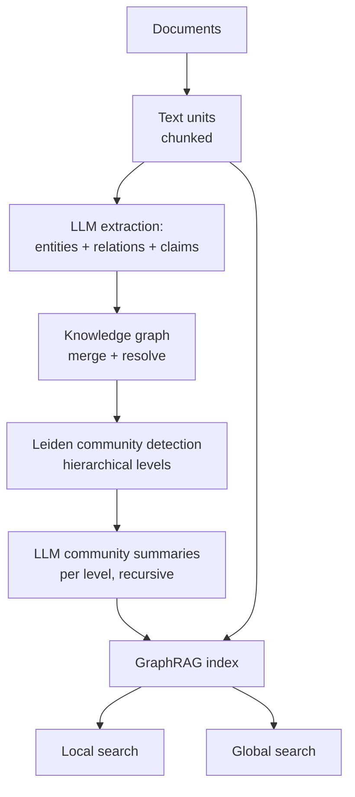
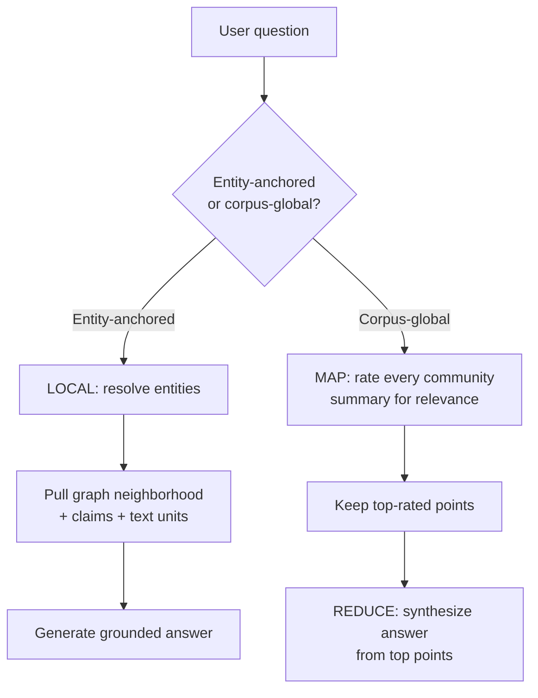

# GraphRAG

## Overview

Vector retrieval answers "which chunks look like this query?" — it has no native answer for "who is connected to whom?", "what are the main themes across the whole corpus?", or "trace how influence flowed from X to Y". GraphRAG adds an entity-and-relation layer on top of (or instead of) chunk vectors: an LLM extracts a knowledge graph at index time, community detection partitions it, and LLM-written summaries of those communities become a retrieval unit that can represent *corpus-global* structure. This page covers the Microsoft GraphRAG pipeline (extraction, Leiden communities, local vs global search, map-reduce summarization), its indexing cost profile, the lighter alternatives (LightRAG, Graphiti's temporal graphs), and the decision boundary against vector-only RAG.

Scope note: the [GraphRAG](../llm-serving/rag.md) section in the RAG fundamentals page introduces the idea in a few paragraphs; this page is the systems engineering version — algorithms, costs, and when the graph actually pays.

## Why Vectors Alone Hit a Wall

Three question classes defeat chunk-similarity retrieval structurally, not accidentally:

- **Multi-hop.** "Who funded the company that acquired the team that built X?" The evidence lives in three chunks, none of which individually resembles the query. Retrieval can be decomposed into hops ([Agentic RAG](./agentic-rag.md)), but each hop is another LLM call at query time; a graph answers the hop by traversal at index-time cost.
- **Corpus-global themes.** "What are the main complaints across all 10,000 support tickets?" No chunk is relevant to the whole; selecting 20 chunks cannot represent 10,000. This is a *summarization over the entire corpus* problem — exactly what GraphRAG's community summaries were built for (Edge et al., 2024).
- **Relational aggregates.** "How do organizations A and B relate?" The relation may never be stated verbatim anywhere; it is implied by paths between entities. Similarity search retrieves statements, not paths.

A second, quieter motivation: **context economy**. A graph neighborhood is a dense, pre-digested context bundle — entities, typed relations, provenance — that carries more answer-relevant structure per token than raw chunks. For multi-hop questions this can mean fewer retrieved units and less distractor text for the same answerability.

## The Microsoft GraphRAG Indexing Pipeline

GraphRAG (Edge et al., 2024; microsoft/graphrag library) builds its index in stages, each LLM-mediated:

1. **Chunking.** Source documents are split (the default is text units of a few hundred tokens — the same trade-offs as [Chunking Strategies](./chunking-strategies.md) apply).
2. **Entity and relationship extraction.** An LLM prompt extracts entities (typed), their descriptions, and relationships between them, with source-text-unit provenance. Each extracted element carries the chunk IDs it came from, which is what later grounds summaries in retrievable text.
3. **Knowledge graph assembly.** Extractions are merged across chunks: same-named entities are resolved, descriptions concatenated, relationship weights accumulated from co-occurrence counts.
4. **Community detection (Leiden).** The Leiden algorithm (Traag et al., 2019) partitions the graph into communities — clusters of densely connected entities — hierarchically: level 0 is fine-grained, each level up merges communities into coarser ones. Leiden improves on Louvain (Blondel et al., 2008) by guaranteeing well-connected communities, which matters because a disconnected "community" would produce incoherent summaries.
5. **Community summaries.** An LLM writes a summary per community at every level, recursively: higher-level summaries summarize lower-level summaries. The result is a pyramid of pre-written corpus syntheses.



## The Extraction Step, Concretely

Extraction quality determines everything downstream, so the prompt and its output schema deserve inspection. A production extraction prompt (GraphRAG's default is similar in spirit) asks for a typed entity list and a relationship list per text unit:

```text
Given the text unit below, extract:
- entities: name, type (person|organization|product|event|location|concept),
  description (one sentence grounded in the text)
- relationships: source entity, target entity, relationship description,
  strength (1-10), source_text_ids
- claims: subject, object, claim statement, temporal qualifier (if any)

Rules: resolve pronouns to entity names; do not invent entities not
evidenced in the text; prefer canonical names ("Microsoft" not "MSFT").
```

Typical yields per 600-token text unit: 5-15 entities, 5-20 relationships, 0-3 claims. Three engineering details decide whether the graph is usable. **Canonicalization**: the same real-world entity arrives as "MSFT", "Microsoft Corp", "Microsoft" — GraphRAG merges on normalized names plus LLM-assisted resolution; whatever you ship, duplicates fragment communities and split provenance. **Weight accumulation**: the same relationship extracted from ten text units should weight ten times one extraction — this frequency signal is what makes Leiden's density metric meaningful. **Claims vs relationships**: relationships are edges; claims are dated statements ("X acquired Y in 2021") that local search surfaces for grounding. Skipping claims makes the graph structure-rich but evidence-poor, and summaries start hallucinating connections the corpus never stated.

## Inside Leiden and the Community Pyramid

A small worked example shows why the hierarchy matters. Suppose extraction over a 1,000-document policy corpus yields 8,000 entities and 30,000 relationships. Leiden partitions at level 0 into, say, 400 communities of ~20 entities each ("dental claims processing", "EU works councils", "equity vesting"); level 1 merges those into ~60 ("benefits administration"); level 2 into ~12 ("people operations"). Summaries are written bottom-up: the level-2 summary of "people operations" summarizes the level-1 summaries beneath it, recursively. At query time:

- Local search on "dental deductible waiver" hits the level-0 community plus its text units — precise, cheap, well-grounded.
- Global search on "what are the biggest sources of employee confusion?" maps over level-1 or level-2 summaries (60-12 map calls instead of 400), then reduces. Dropping one level roughly halves the map-phase cost while coarsening the answer — that dial, per question, is the main global-search economic control.

Leiden itself is fast and does not need LLMs: modularity optimization with refinement, \\( O(|E|) \\)-ish per pass on sparse graphs — the expensive part of the pyramid is exclusively the LLM summaries, which is why incremental graph updates still require re-summarizing the affected branch.

## A Worked Global-Search Trace

Cost arithmetic on a real-shaped question makes the map-reduce concrete. Corpus: 10,000 support tickets → 60,000 text units → graph with 25,000 entities → Leiden gives 1,500 level-0 communities, 200 level-1, 30 level-2. Question: "What are the top themes in customer complaints this quarter?"

```text
Global search at level 1 (200 communities):
  map:    200 LLM calls × (summary ~800 tok in + prompt ~300 tok) → 220K input tokens,
          200 × ~150 tok output points
  reduce: top ~40 points (~6K tokens) → 1 call → answer
  total ≈ 201 calls, ~226K input + ~34K output tokens, wall-clock ~10-20 s parallelized

Global search at level 2 (30 communities):
  map:    30 calls, ~33K input tokens
  total ≈ 31 calls, ~36K input + ~6K output tokens — ~6× cheaper, coarser answer

Vector-RAG baseline on the same question:
  retrieve 20 tickets (200K tokens of corpus can't be read; picks a biased sample)
  → answer reflects those 20, not the quarter. The failure is structural, not tuning.
```

The trace also shows the honest caveat: global search answers *over summaries*, so its factual grounding is one level removed from source text. Products that need quoted provenance attach text-unit IDs back through the community → entity → text-unit chain, which is exactly why GraphRAG keeps provenance on every extraction.

## Local Search vs Global Search

The two query modes traverse the same index differently, and choosing between them is the first question to ask of any GraphRAG deployment:

**Local search** answers entity-anchored questions ("what is X, how does it relate to Y?"). It maps the query to entities (embedding similarity plus extraction), pulls their graph neighborhood — neighbors, relations, claims — plus the original text units those entities appeared in, and packs that into the prompt. This is RAG with a graph-shaped context bundle: provenance and precision are strong, and cost is comparable to vector RAG (a couple of LLM calls).

**Global search** answers corpus-level questions ("what are the themes?"). There is no entity to anchor on, so it runs **map-reduce over community summaries**: the map step asks an LLM to rate each community summary's relevance to the query and extract candidate points (with scores); the reduce step takes the highest-rated points and synthesizes the final answer. Because community summaries are precomputed, the map phase reads a compressed corpus — the paper's global answers over ~100 books used community summaries at a chosen level rather than the full text.



| | Local search | Global search |
|---|---|---|
| Question shape | "What/how does X relate to Y" | "What are the main themes across the corpus" |
| Context | Entity neighborhood + source text units | Community summaries (one level) |
| LLM calls per query | 1-2 | 1 per community (map) + 1 (reduce) |
| Cost profile | Comparable to vector RAG | Higher; scales with community count at chosen level |
| Provenance | Strong (text units attached) | Weak-to-medium (summaries; needs level control) |
| Latency | ~1 vector-RAG equivalent | Seconds; map phase parallelizable |

## Cost Profile of Indexing

GraphRAG's cost center is indexing, and the arithmetic is unforgiving enough to be an interview staple. Per text unit the extraction prompt costs a few thousand tokens in and several hundred out; a 4,000-token document at 600-token units means ~6-7 extraction calls *before* the summary stage. Community summaries then add one LLM call per community per level. Orders of magnitude, using the GraphRAG paper's own framing (its indexing of ~100 books required millions of LLM tokens; community runs reported in the hundreds of dollars per corpus in early 2024 pricing):

| Pipeline | LLM calls at index time (per 10K docs, ~6 units/doc) | Relative cost |
|---|---|---|
| Vector-only RAG | 0 (embedding only: ~60K embedding calls) | 1× (embedding ≪ LLM) |
| GraphRAG, local-search use | ~60K extraction calls | ~10-30× vector-only |
| GraphRAG, global-search use | ~60K + thousands of community summaries across levels | highest; scales with graph structure |

Three mitigations ship with the ecosystem and should be named in an answer: **community level selection** (global search over a coarser level reads far fewer, shorter summaries — the main cost dial at query time); **incremental indexing** (update the graph and re-summarize only affected communities; the library supports incremental flows, though entity merging keeps this nontrivial); and **cheaper extractor models** (extraction tolerates smaller models better than generation does, cutting cost several-fold at some recall risk). The honest summary: GraphRAG inverts the cost profile of RAG — expensive indexing, cheaper multi-hop queries — while vector RAG is cheap to index and pays per query. Whether that inversion pays depends entirely on query distribution and corpus stability ([Long Context vs RAG](./long-context-vs-rag.md) has the symmetric argument for long-context).

## Alternatives: LightRAG and Graphiti

**LightRAG** (Guo et al., 2024; HKUDS/LightRAG) keeps the extract-a-graph idea but cuts the pipeline's weight: entities and relations are extracted once, embedded, and stored in *dual-level* structures — low-level (concrete entities) and high-level (themes/concepts) — with retrieval fetching neighborhoods from both levels plus their linked text units. There is no Leiden partitioning and no recursive community-summary pyramid: global-ish questions are answered by retrieving high-level keyword/entity matches and their contexts instead of by map-reduce over pre-written summaries. The result is much cheaper indexing and incremental updates (new chunks extend the graph without re-summarizing), at the price of weaker answers on genuinely corpus-global "themes" questions — the map-reduce over summaries is what gives GraphRAG its comprehensiveness there.

**Graphiti / Zep** (Rasmussen et al., 2025; getzep/graphiti) targets a different problem: *temporal* knowledge graphs for agent memory rather than static corpus QA. Edges carry bi-temporal metadata (`t_valid` / `t_invalid` plus event/transaction time), so facts are invalidated rather than overwritten — "Alice is team lead" expires when a later episode says she moved on, and the graph can answer "who led the team as of March?" Graphiti builds incrementally (episodes in, entity/edge extraction out, with LLM-based edge invalidation), skips community detection for latency, and serves hybrid search over the graph plus embeddings. For conversational agents whose memory must respect time and contradiction, this beats both a static graph and a vector store of summaries — see [Agent Memory: Advanced Systems Engineering](../agentic/agent-memory-advanced.md) for the memory-architecture context.

| | Microsoft GraphRAG | LightRAG | Graphiti/Zep |
|---|---|---|---|
| Graph build | Full extraction + Leiden + summaries | Light extraction, dual-level | Incremental episode extraction |
| Global questions | Map-reduce over community summaries | High-level entity/theme retrieval | Not the focus |
| Temporal reasoning | None | None | Bi-temporal edges, invalidation |
| Indexing cost | Highest | Low-medium | Medium, amortized per episode |
| Update story | Re-summarize affected communities | Append-friendly | Built for streaming updates |
| Best fit | Static corpora, research-synthesis UX | Cheaper general-purpose graph RAG | Agent memory, evolving facts |

## When Graphs Beat Vector-Only

The decision reduces to query distribution and corpus stability:

- **Graphs win** when a material share of questions is relational (multi-hop, "how do X and Y connect"), when corpus-global synthesis is a first-class product need ("themes across the archive"), or when provenance paths matter (compliance, investigation tooling). They also win on stable corpora whose indexing cost amortizes — regulation, research literature, intelligence-style document sets.
- **Vectors win** when questions are pointwise ("what is the refund window?"), the corpus churns, latency budget is tight, or the team cannot fund LLM-heavy indexing. Adding a reranker and hybrid retrieval (see [Hybrid Search and Fusion](./hybrid-search-fusion.md)) captures most remaining headroom at a fraction of graph-indexing cost.
- **Hybrid is the honest default**: GraphRAG itself keeps the text units and uses vector search inside local search; production deployments typically run vector RAG as the default path with graph retrieval for the query classes that need it (routed — see [Agentic RAG](./agentic-rag.md)).

The GraphRAG paper's own evaluation is the citation to reach for: on global-sensemaking questions over podcast and news corpora, win rates against a naive vector-RAG baseline ("naive RAG") were comprehensive and diverse by wide margins (roughly 70-80% win rates judged by an LLM and by humans), while for local questions the gap narrows — consistent with the structural argument above, and a reminder that LLM-judged win rates need the calibration caveats in [RAG Evaluation](./rag-evaluation.md).

## Pitfalls

1. **Indexing cost discovered mid-project.** Teams prototype GraphRAG on 100 documents, then meet the real corpus: extraction plus summaries at 10K+ documents is a budget line, not a config change; estimate tokens-per-doc before committing.
2. **Entity resolution debt.** "Acme Corp", "Acme Corporation", and "ACME" merge or don't based on your resolution step; poor merging fragments communities and silently degrades every downstream answer. Budget iteration time here.
3. **Global search at the wrong community level.** Level choice trades answer granularity against map-phase cost; picking the level per question (not globally) is where most deployments land after the first bill.
4. **Stale graphs on live corpora.** A graph index is a materialized view; without incremental update discipline, answers drift from source truth. If the corpus changes daily, Graphiti-style incremental construction or LightRAG's append path is the fit, not full re-index.
5. **Graph for graph's sake.** If your golden-set queries are 90% pointwise lookups, the graph layer spends indexing money on questions nobody asks; the eval harness decides, not the architecture diagram ([RAG Evaluation](./rag-evaluation.md)).

## Interview Questions

1. **What does GraphRAG add over plain vector RAG, and for which question types?** Vector retrieval scores chunk similarity; it cannot traverse relations or represent corpus-global structure. GraphRAG adds an LLM-extracted entity/relationship graph with provenance, partitions it into hierarchical communities (Leiden), and pre-writes LLM summaries per community. Local search answers entity-anchored questions by pulling a graph neighborhood plus source text units — grounded, cheap, comparable to vector RAG. Global search answers corpus-level questions ("main themes across the archive") by map-reduce over community summaries, which chunk retrieval structurally cannot do since no chunk represents the whole corpus. The cost is indexing: LLM extraction per text unit plus per-community summaries, an order of magnitude above embedding-only indexing.
2. **Why Leiden and not just k-means or Louvain on the entity graph?** The community structure must be discovered from graph topology — density of connections — not feature space, so k-means on embeddings is the wrong tool. Louvain (Blondel et al., 2008) does modularity-based discovery but can produce internally disconnected communities, which matters here because a disconnected community yields an incoherent summary. Leiden (Traag et al., 2019) guarantees well-connected communities and refines partitions hierarchically, giving GraphRAG its multi-level summary pyramid: fine communities for specific answers, coarse ones for cheap global map-reduce. The hierarchy is also the cost dial — global search over a coarser level reads fewer, shorter summaries.
3. **Walk through the cost model. When does GraphRAG's cost profile beat vector RAG's?** Indexing: per text unit, one extraction call (few-K tokens in, hundreds out); for 10K docs at ~6 units/doc that is ~60K LLM calls, plus per-community-per-level summary calls — call it 10-30× a vector-only pipeline whose index cost is just embeddings. Querying: local search is 1-2 calls, comparable to vector RAG; global search costs one map call per community plus reduce, seconds of latency. So GraphRAG beats vector RAG on cost only when its query advantages are real: multi-hop and corpus-global questions at non-trivial share, on a corpus stable enough to amortize indexing, with incremental updates keeping the graph fresh. For pointwise lookups over churning corpora, the vector pipeline wins on every axis that matters.
4. **How do LightRAG and Graphiti differ from Microsoft GraphRAG, and when would you pick each?** LightRAG keeps graph extraction but drops Leiden and the summary pyramid, storing entities/relations at two levels (concrete and thematic) with vector retrieval over both; it is much cheaper to index and append-friendly, but weaker on genuinely corpus-global "themes" questions where map-reduce over pre-written summaries shines. Graphiti/Zep serves a different problem — temporal knowledge graphs for agent memory: bi-temporal edges with validity intervals, LLM-driven edge invalidation, incremental episode ingestion, so it answers "who was the lead as of March?" and handles contradictions that would corrupt a static graph. Pick GraphRAG for static-corpus synthesis products, LightRAG for cost-sensitive general graph RAG, Graphiti for agents whose facts change over time.
5. **Your stakeholders want GraphRAG "because it's newer". How do you decide with data?** Stratify the golden set by question archetype: pointwise lookup, multi-hop relational, corpus-global synthesis, temporal. Measure vector-RAG (with hybrid + reranker as the fair baseline) per stratum. If multi-hop + global strata are under ~10% of traffic and baseline quality there is acceptable, GraphRAG buys little — spend the budget on retrieval quality instead. If those strata are material and the corpus is stable, prototype GraphRAG on a slice, estimate indexing tokens per document before scaling, and evaluate with the same harness plus cost lines. The decision output should read like an allocation: "graph retrieval serves 14% of queries that vector RAG fails 60% of; indexing costs $X once and $Y per month incrementally."
6. **What breaks first when a GraphRAG deployment meets a live, updating corpus?** The graph is a materialized view, so staleness hits first: entities and relations from revised documents persist until a re-extraction pass runs, and community summaries — the expensive layer — are computed from older graph state. Entity resolution is the second failure: incremental merges accumulate duplicates and contradictions that were invisible in the one-shot prototype build. Mitigations in order: incremental indexing with affected-community re-summarization, bi-temporal edge semantics (Graphiti-style invalidation) for facts with lifetimes, and a reconciliation job comparing graph-derived answers against source text units on a freshness SLO. If update frequency makes all three expensive, that is the signal the workload belongs on LightRAG-style append-friendly construction rather than full GraphRAG.

## Key Takeaways

- Vector retrieval is similarity over statements; graphs add *structure* — relations, paths, and corpus-level summaries — which is the only way to answer multi-hop and global-synthesis questions without paying per-hop LLM calls at query time.
- Microsoft GraphRAG = LLM extraction → knowledge graph → Leiden hierarchical communities → recursive LLM summaries; local search traverses the graph, global search map-reduces over summaries.
- Leiden (not Louvain, not k-means) because well-connected communities summarize coherently and the hierarchy is the global-search cost dial.
- Indexing is the cost center: extraction per text unit plus per-community summaries puts GraphRAG ~10-30× a vector-only pipeline; estimate tokens-per-document before committing.
- LightRAG trades the summary pyramid for cheap dual-level retrieval; Graphiti adds bi-temporal semantics for agent memory; the three serve different query distributions, not a quality ranking.
- Hybrid is the production default: vector RAG as the default path, graph retrieval routed in for relational and global strata.
- Let the eval harness — stratified by question archetype — decide, because "graph beats vectors" is a statement about your query distribution, not about the technology.

## References

- D. Edge, H. Trinh, N. Cheng, et al., "From Local to Global: A Graph RAG Approach to Query-Focused Summarization", Microsoft Research, 2024 — <https://arxiv.org/abs/2404.16130>
- Microsoft GraphRAG library (documentation and source) — <https://microsoft.github.io/graphrag/>
- Microsoft GraphRAG GitHub repository — <https://github.com/microsoft/graphrag>
- V. A. Traag, L. Waltman, N. J. van Eck, "From Louvain to Leiden: Guaranteeing Well-Connected Communities", Scientific Reports 2019 — <https://arxiv.org/abs/1810.08473>
- V. D. Blondel, J.-L. Guillaume, R. Lambiotte, E. Lefebvre, "Fast Unfolding of Communities in Large Networks" (Louvain), JSTAT 2008 — <https://arxiv.org/abs/0803.0476>
- Z. Guo, Xia, et al., "LightRAG: Simple and Fast Retrieval-Augmented Generation", 2024 — <https://arxiv.org/abs/2410.05779>
- HKUDS, LightRAG GitHub repository — <https://github.com/HKUDS/LightRAG>
- L. Rasmussen et al., "Zep: A Temporal Knowledge Graph Architecture for Agent Memory", 2025 — <https://arxiv.org/abs/2501.13956>
- GetZep, Graphiti GitHub repository — <https://github.com/getzep/graphiti>
- Y. Gao et al., "Retrieval-Augmented Generation for Large Language Models: A Survey", 2023 — <https://arxiv.org/abs/2312.10997>

## Cross-References

- [GraphRAG](../llm-serving/rag.md) — the fundamentals-page section this page expands
- [Agentic RAG](./agentic-rag.md) — routing queries to graph vs vector paths, per-hop retrieval
- [Chunking Strategies](./chunking-strategies.md) — the text units feeding extraction
- [RAG Evaluation](./rag-evaluation.md) — stratified evaluation and LLM-judge caveats for graph wins
- [Agent Memory: Advanced Systems Engineering](../agentic/agent-memory-advanced.md) — the memory architecture Graphiti serves
- [Vector Search](../../search/vector-search.md) — the baseline being augmented
- [Milvus](../advanced/milvus.md) — the vector-store side of a hybrid graph+vector deployment
