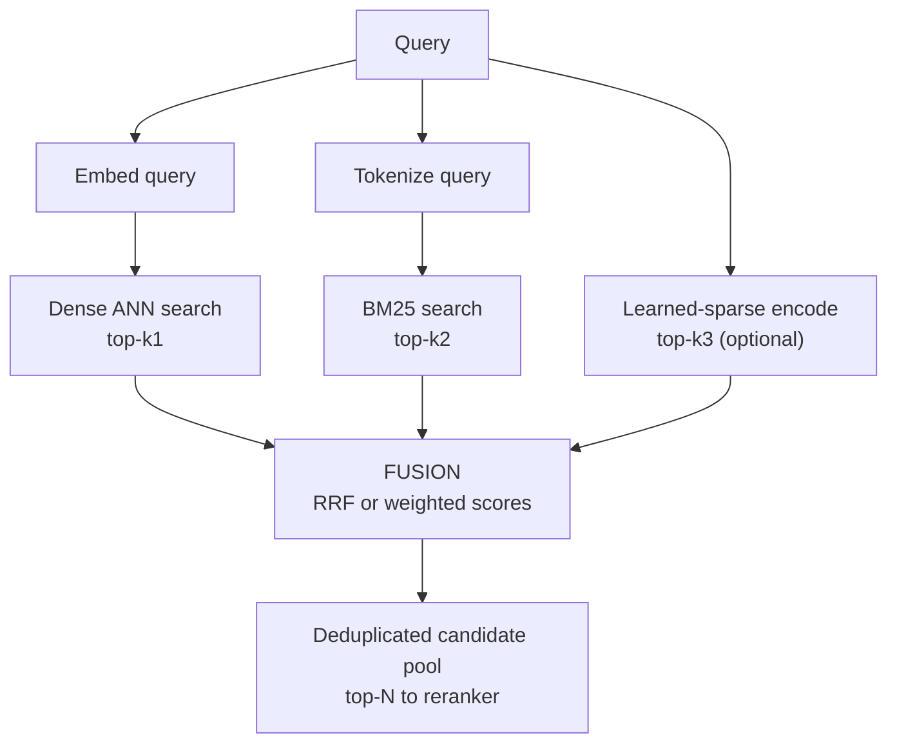

# Hybrid Search and Fusion

## Overview

No single retriever covers the query distribution: dense embeddings generalize across paraphrase but blur exact identifiers, BM25 nails rare tokens but misses synonymy, learned-sparse models buy back some of each. Hybrid retrieval runs multiple retrievers in parallel and *fuses* their lists into one ranking. This page covers the retriever families and their failure modes, the fusion mathematics (RRF and weighted score fusion with per-query normalization), how production engines implement hybrid, and how to evaluate whether fusion is actually paying.

Scope note: [Reranking and Hybrid Fusion](../../search/reranking.md) already derives RRF with a worked example and catalogs the OpenSearch normalization processors; this page complements it with retriever internals (BM25 mechanics, SPLADE), engine-by-engine hybrid configuration, and evaluation methodology. Read both — the fusion math there, the system picture here.

## The Three Retriever Families

**Lexical (BM25).** BM25 scores a document as a sum over matched query terms of IDF-weighted, saturating term frequencies with length normalization:

\\[ \mathrm{score}(q,d) = \sum_{t \in q} \mathrm{IDF}(t) \cdot \frac{f_{t,d}\,(k_1+1)}{f_{t,d} + k_1 \cdot (1 - b + b \cdot |d|/\mathrm{avgdl})} \\]

with the standard defaults \\( k_1 \approx 1.2 \\) (term-frequency saturation: the 10th occurrence adds little) and \\( b \approx 0.75 \\) (long documents are discounted). Its virtues are boring and decisive: exact token matching (IDs, error codes, part numbers, names), OOV robustness, incremental updates in milliseconds, and no model to drift. Its weakness is vocabulary mismatch — "car" never matches "automobile", and any concept the user words differently is invisible.

**Dense (bi-encoder).** Query and document are embedded independently; cosine similarity ranks. This captures paraphrase and cross-lingual semantics, which is why dense retrieval dominates BEIR-style semantic benchmarks. Its weaknesses mirror BM25 exactly: numerics and identifiers embed as noise, domain shift (a biomedical embedder on legal text) silently degrades, and the single-vector summary of a 512-token chunk mixes topics (see [Chunking Strategies](./chunking-strategies.md)).

**Learned sparse (SPLADE).** SPLADE (Formal et al., 2021) runs a masked language model over the document and produces a *sparse vector over the vocabulary itself*: each dimension is a token, and the model's output weight (via max-pooling over token positions) is that token's importance. Because the model can activate tokens *not present* in the document, it performs learned query/document expansion while staying a sparse vector — so it indexes into an inverted list exactly like BM25 and supports the same exact-match machinery. SPLADE models are trained by distilling from cross-encoder teachers (SPLADE++ / SPLADE v2 added hard-negative sampling and distillation), reaching cross-encoder-adjacent quality at inverted-index speeds.

| | BM25 | Dense bi-encoder | SPLADE |
|---|---|---|---|
| Match mechanism | Exact tokens + IDF | Semantic similarity | Learned tokens + expansion |
| Vocabulary mismatch | Fails | Handles | Handles (learned expansion) |
| Exact IDs / codes | Strong | Weak | Moderate |
| Index | Inverted list | Vector index (HNSW etc.) | Inverted list with float weights |
| Update cost | Milliseconds | Re-embed + upsert | Re-run MLM head + upsert |
| Serving cost | CPU, cheap | GPU or optimized CPU | CPU with heavier scoring |
| Interpretability | Full | None | High (weights are words) |

## BM25 Tuning That Actually Matters

BM25's defaults are good, but three configuration choices move production quality more than any k1/b sweep:

- **Analyzer selection.** Stemming vs lemmatization, stop-word lists, case folding, and n-gram tokenization for CJK text (where whitespace tokenization fails completely) determine *what* can match at all. A corpus with product codes needs tokenizers that keep `ERR-4402` intact instead of splitting it into `err` and `4402`.
- **Field weighting and boosts.** Matches in titles, headers, or metadata fields deserve separate boosts — most engines implement multi-field BM25 with per-field weights, which is the poor engineer's reranker and works remarkably well for structured corpora.
- **\\( k_1 \\) and \\( b \\).** \\( k_1 \\) controls saturation (how much a term's 5th occurrence counts vs its 1st); \\( b \\) controls length normalization (0 = no penalty, 1 = full average-length normalization). Sweeps on labeled data typically move nDCG by low single digits; the defaults (1.2 / 0.75) are near-optimal for prose and wrong for short-text corpora (tickets, titles, log lines), where \\( b \to 0.3 \\) often wins because document length stops being a quality proxy.

The remaining BM25 knobs — synonyms, phrase queries, proximity boosts — are corpus-specific and belong in the evaluation loop, not hand-tuned. The interview point: BM25 is a *configured baseline*; treating it as untouchable wastes the cheapest quality in the stack, and skipping it loses the exact-match tail.

## SPLADE Internals, Compressed

The SPLADE scoring pipeline at index time: run the document through a BERT-class encoder with the MLM head; for each vocabulary token \\( v \\), compute \\( w_v = \max_{j} \log(1 + \mathrm{relu}(\mathrm{logits}_{j,v})) \\) over token positions; keep the nonzero \\( w_v \\) as the document's sparse vector. Query encoding is the same machinery on the query, and scoring is a dot product over shared vocabulary dimensions — implementable as weighted inverted-list traversal. The training recipe earns the quality: distillation from a cross-encoder teacher (teacher scores become soft targets), hard-negative sampling mined with the model itself (the SPLADE v2 refinement), and an FLOPS regularizer that penalizes expanding too many tokens, keeping vectors sparse and the index affordable.

```python
# SPLADE-style document encoding sketch (shapes over details)
def encode_splade(text, encoder, mlm_head, vocab_size=30522):
    logits = mlm_head(encoder(text))                 # [seq, vocab]
    weights = torch.log1p(torch.relu(logits)).max(dim=0).values  # [vocab]
    sparse = weights.nonzero().squeeze(1)            # activated vocabulary terms
    return dict(zip(sparse.tolist(), weights[sparse].tolist()))
    # typical output: 50-300 nonzero terms per paragraph
    # an inverted list, but weights are floats and the set includes
    # tokens the text never contained: learned expansion
```

## A Worked Weighted-Fusion Pathology

The min-max outlier failure deserves concrete numbers, because it is the interview-ready version of "normalization pitfalls". Two retrievers, five documents, weights 0.6 lexical / 0.4 dense:

```text
doc    BM25    cos    minmax(BM25)  minmax(cos)   0.6*lex + 0.4*dense
d1     42.0   0.30       1.000         0.000          0.600
d2      9.1   0.91       0.188         1.000          0.512
d3     18.2   0.75       0.418         0.750          0.551
d4      4.8   0.55       0.075         0.417          0.212
d5      7.3   0.68       0.137         0.633          0.335

Ranking: d1 (0.600) > d3 (0.551) > d2 (0.512) > d5 (0.335) > d4 (0.212)
```

d1 is the classic outlier: one exact rare-term hit (BM25=42) whose extreme score compresses every other lexical contribution into the 0.0-0.2 band. The dense retriever's genuinely relevant d2 (cos 0.91) is held to 0.512 and nearly loses to a document whose only virtue is one identifier. Under RRF the same d1 ranks below d3 and d2 because its dense rank is poor — scale immunity in action. The production fixes: z-score normalization (dampens the outlier), per-retriever score caps, or simply RRF when you cannot tune.

## Architectural Patterns for Hybrid

There are three deployment shapes, with different failure profiles:

- **Engine-native hybrid.** One system (Elasticsearch, OpenSearch, Qdrant, Weaviate, Vespa, Milvus) holds both indexes and fuses internally. Best consistency — every query sees one snapshot, single auth boundary — with fusion semantics bounded by engine options.
- **Side-by-side + application fusion.** A search engine (lexical) and a dedicated vector database (dense) run independently; the application merges lists. This is how most first-generation RAG stacks shipped — pgvector next to Postgres full-text, a dedicated vector DB next to Solr. It scales each store on its own hardware and allows arbitrary fusion code, but the two snapshots can diverge (a document updated in one and not the other produces asymmetric results), and p95 latency is the max of the two paths.
- **Materialized learned-sparse.** SPLADE-style vectors stored either as engine fields (Elasticsearch ELSER text-expansion) or in a vector DB with native sparse support (Qdrant sparse vectors). Expansion happens at index time; the query path stays single-system; the model choice is frozen at index time.

| Pattern | Consistency | Fusion flexibility | Operational cost |
|---|---|---|---|
| Engine-native | Same snapshot | Bound by engine options | One system to run |
| Side-by-side + app fusion | Snapshot skew risk | Any (application code) | Two systems, one merge service |
| Materialized learned-sparse | Same snapshot | Model fixed at index time | Heavier index build |

Whichever pattern you pick, the fusion layer must be versioned and evaluated like any other model change: a fusion-weights update is a ranking change with production blast radius, and it belongs behind the same CI gates as an embedder swap (see [RAG Evaluation](./rag-evaluation.md)).

## Query-Class Table: What Each Retriever Buys

Mapping query archetypes to retriever behavior makes the hybrid argument concrete — and this table doubles as a review checklist for fusion complaints ("hybrid made X worse" almost always means one row here was misunderstood):

| Query archetype | Example | Best single retriever | What fusion adds |
|---|---|---|---|
| Exact identifier | `ERR_4402 timeout` | BM25 / learned sparse | Dense contribution downweighted by agreement logic; identifier doc survives |
| Named entity + context | `Kubernetes node pressure causes` | Hybrid (no single winner) | Lexical anchors the entity, dense adds context words |
| Paraphrase / conceptual | `how do I stop my pods from being evicted` | Dense | BM25 anchors vocabulary the user didn't use |
| Numeric / comparative | `plans over 500 USD with SLA 99.9` | BM25 on numbers, weak dense | Both lists mediocre — needs structured extraction, not fusion |
| Cross-lingual | query in DE, corpus in EN | Dense (multilingual embedder) | BM25 contributes nothing; weights should reflect that |
| Very short keyword query | `s3 lifecycle` | BM25 | Dense adds topic neighbors; risk of drift is highest here |

Two consequences worth stating. First, *multilingual* corpora are the case where the lexical channel is often dead weight — a German query tokenizes to nothing useful against an English analyzer — and the fusion weights or router should reflect the detected query language. Second, *numeric/comparative* queries are a reminder that fusion fixes vocabulary mismatch, not representation gaps: if "500 USD" and "SLA 99.9" are not extracted as structured fields at ingestion, no retriever combination will rank the right plan first, and the correct fix lives in the ingestion pipeline (see [Chunking Strategies](./chunking-strategies.md)), not in the query path.

## Why Neither Alone Suffices

The complementarity is measurable, not rhetorical. On BEIR (Thakur et al., 2021), BM25 is a robust zero-shot baseline that outperforms many dense retrievers *out of their training domain*, while rerankers and late-interaction models lead overall — the abstract's own conclusion. Production query logs show a bimodal split: a minority of queries with exact identifiers (where dense retrieval embarrasses itself) and a majority of natural-language queries (where BM25 misses paraphrase). A hybrid covers both tails, and the fusion step is what lets the system do so without committing to a weights-per-query-type router (though routers — see [Agentic RAG](./agentic-rag.md) — are the next refinement).



## Reciprocal Rank Fusion

RRF (Cormack, Clarke, Buettcher, SIGIR 2009) scores each document by the sum of reciprocal ranks across lists:

\\[ \mathrm{RRF}(d) = \sum_{L} \frac{1}{k + \mathrm{rank}_L(d)} \\]

The paper fixed the damping constant at \\( k = 60 \\) "during a pilot investigation", and it became the ecosystem default (Elasticsearch `rank_constant`, OpenSearch, Qdrant all default to 60). The intuition for why a *large* k works: with k=60, rank 1 contributes 1/61 ≈ 0.0164 and rank 100 contributes 1/160 = 0.00625 — a 2.6× ratio between the top and rank 100. Small k (say 1) makes rank differences huge and the fusion becomes nearly a "who is #1" vote; large k (say 1000) flattens ranks toward uniform voting where every list membership counts equally. k=60 damps the head enough that agreement across lists matters more than any single list's top position, and it dampens the tail enough that deep junk rarely outvotes a mid-rank from another list. It is also scale-free — an outlier BM25 score of 42 contributes the same as any other #1 — which is exactly the property weighted score fusion lacks.

A full worked example with document-by-document arithmetic is in [Reranking and Hybrid Fusion](../../search/reranking.md#reciprocal-rank-fusion); the operational properties to memorize: order-only (magnitude ignored), no weights without extension, immune to score-scale pathology, and trivially O(|candidates|) to compute. Its costs: rank positions discard score magnitude information, cannot express "trust lexical 3× more", and the 1/rank shape is top-heavy — relevant when a downstream reranker consumes the fused tail.

## Weighted Score Fusion and Normalization Pitfalls

When magnitude and weights matter (and they often do — a support tool wants identifier matches to dominate), the standard is a weighted sum of per-query-normalized scores. The normalization is per query because score distributions shift between queries: a rare-term BM25 query can peak at 40 while a common-term query peaks at 2, and any global calibration learned offline goes stale as the corpus changes.

The pitfalls, each of which has shipped production incidents:

1. **Outlier stretch under min-max.** One document with an extreme score sets the scale for the whole list; a single BM25=42 min-maxed to 1.0 squeezes every other lexical score toward 0, letting the dense retriever dominate everything but that one hit.
2. **Zero-scores and the floor.** Min-max outputs of 0.0 can zero-out contributions entirely; OpenSearch's normalization processor documents replacing 0.0 with 0.001 to keep documents in the ranking rather than annihilating them.
3. **Unbounded dense scores.** Cosine is bounded but raw dot products (unnormalized vectors) are not — one more scale mismatch that shows up as "hybrid got worse after we switched embedders".
4. **Weights interact with the normalizer.** Switching min-max to z-score without re-tuning weights silently re-weights the blend; the z-score path also constrains the combination function (OpenSearch allows only arithmetic_mean with it).
5. **Distribution shift between retrievers.** Dense lists are typically tight (scores clustered near the top); lexical lists are long-tailed. A naive mean over raw z-scores favors whichever list happens to have fatter spread — evaluate the blend on labeled data, not on inspecting a few examples.

| Scheme | Per-query | Keeps magnitude | Outlier behavior | Weights |
|---|---|---|---|---|
| RRF (k=60) | yes (rank-only) | no | immune by construction | no (without extensions) |
| Min-max weighted | yes | yes | one extreme reshapes the list | yes |
| Z-score weighted | yes | yes | resists extremes, assumes rough normality | yes (re-tune) |
| L2-normalized | yes | yes | preserves in-list ratios | yes |
| Distillation (score a small model on fused pool) | n/a | yes | learned, robust | learned |

The last row is the modern answer: when the blend really matters, train a small cross-encoder or LTR model on the fused pool instead of hand-tuning — the reranker page ([Rerankers: Deep Dive](./rerankers-deep.md)) covers the model side, and classical learning-to-rank in Elasticsearch lives in its LTR plugin ecosystem.

## Hybrid in Production Engines

Every major engine ships hybrid; the differences are in fusion model and configurability. Verified configurations (values from vendor documentation):

| Engine | Hybrid mechanism | Fusion | Key parameters |
|---|---|---|---|
| Elasticsearch 8.x | `retriever` API combining `standard`, `knn`, `text_expansion` (ELSER) children | RRF or linear retriever | `rank_window_size`, `rank_constant` (default 60); equal child weights in RRF |
| OpenSearch 2.x | Hybrid search pipeline (neural + BM25 + sparse) | Normalization processor: min_max / L2 / z-score × arithmetic / geometric / harmonic mean; also RRF option | per-clause weights; 0.0 → 0.001 floor |
| Qdrant | Query API `prefetch` (multiple dense or sparse sub-queries) + `fusion: rrf` or score fusion; native sparse vectors (BM25-style or SPLADE-style) | RRF or distribution-based score fusion | per-prefetch limits; sparse + dense in one index |
| Weaviate | `hybrid` search operator over BM25 + dense | Fixed-weighted score fusion | `alpha` (0 = pure BM25, 1 = pure dense); `fusionType` relative score fusion |
| Vespa | First-phase/second-phase ranking expressions over BM25, tensor ops, ONNX | Plain expressions (e.g. `0.7*bm25 + 0.3*popularity`), multi-phase rerank | fully programmable rank profiles |
| Milvus 2.x | Multi-vector / multi-metric search with hybrid scoring (ranker strategies: RRF, weighted) | RRF or weighted scorer | per-request limit per search |

Two design patterns worth naming in interviews: **equal-vote RRF** (Elasticsearch) favors robustness — no tuning, no scale pathology — while **weighted normalized fusion** (OpenSearch, Weaviate alpha, Vespa expressions) favors precision once you have labeled data to tune it. Teams commonly start with RRF and graduate to weighted fusion + reranker as evaluation infrastructure matures. For engine internals — how the inverted list and ANN index coexist in one node — see [Elasticsearch](../../search/elasticsearch.md), [Milvus](../advanced/milvus.md), [pgvector](../advanced/pgvector.md) (where hybrid means combining with full-text search in Postgres), and the engine-agnostic [Vector Search](../../search/vector-search.md).

## Evaluating Fusion Gains

Fusion is only justified by measured gains on *your* query distribution. The evaluation protocol that isolates the effect:

1. **Freeze the downstream.** Same chunking, same reranker, same top-k; change only the fusion input, or you measure the stack, not the fusion.
2. **Report per retriever, fused, and by query stratum.** Split the golden set into identifier queries ("ERR_4402 timeout"), semantic queries, and mixed. Fusion gains concentrate in the mixed and identifier strata; on pure semantic queries the dense retriever usually matches the fused result.
3. **Measure the ceiling first.** Stage-1 recall@N before and after adding a retriever — if adding BM25 to a dense-only pool raises recall@100 from 82% to 91%, the ceiling moved; everything downstream inherits it (the recall-ceiling argument from [Reranking and Hybrid Fusion](../../search/reranking.md#the-recall-ceiling)).
4. **Check the reranker's diet.** If a strong cross-encoder reranks the fused top-100, fusion quality gains can shrink to noise — the reranker fixes misordering but not absence, so track both fused-list nDCG@10 *before* rerank and end-to-end after.
5. **Watch p95 latency, not just p50.** Hybrid doubles the stage-1 fan-out; the slowest retriever bounds the fused path unless they run concurrently.

Published reference points for calibration: the BEIR benchmark showed BM25 beating many dense retrievers zero-shot while late interaction led — the empirical basis for "run both"; SPLADE v2 reported MS MARCO dev MRR@10 ≈ 38.3 versus BM25's ≈ 18.4, showing learned sparse closing most of the gap to cross-encoder rerankers while remaining indexable; production case studies (Elasticsearch/OpenSearch blogs, vendor evaluations) typically report low-single-digit nDCG@10 gains from hybrid over the better single retriever, with the largest gains on exact-match-heavy query mixes. Treat any "hybrid always helps" claim as vendor marketing until the stratified evaluation says so on your data.

The reporting artifact itself is worth standardizing — a one-table summary per experiment makes fusion regressions visible across teams:

| Metric | Dense-only | Hybrid (RRF) | Hybrid (weighted) | Delta vs best single |
|---|---|---|---|---|
| Stage-1 recall@100 (all queries) | 0.82 | 0.91 | 0.91 | +9 pts (ceiling moved) |
| recall@100, identifier stratum | 0.55 | 0.89 | 0.92 | +34 pts |
| recall@100, semantic stratum | 0.90 | 0.90 | 0.89 | ~0 (as expected) |
| Fused nDCG@10 (pre-rerank) | 0.41 | 0.46 | 0.48 | +5 to +7 pts |
| End-to-end nDCG@10 (post-rerank) | 0.52 | 0.55 | 0.55 | +3 pts (reranker absorbs some) |
| p95 stage-1 latency | 18 ms | 24 ms (concurrent) | 24 ms | +6 ms |

Reading the table: the recall gain is concentrated in the identifier stratum — exactly where dense-only fails — while the semantic stratum is unchanged, confirming the complementarity hypothesis. The end-to-end delta is smaller than the pre-rerank delta because the cross-encoder already fixed ordering within the dense-only pool; both numbers matter and answer different questions. The p95 line is the guardrail that keeps the quality win honest.

## Pitfalls

1. **Fusing raw un-normalized scores.** BM25=40 next to cosine=0.9 is a lexical vote, not a ranking; the failure is silent because results still *look* plausible.
2. **Tuning k and weights by eyeballing examples.** The blend shifts rankings in ways invisible to a five-query smoke test; use the golden set with stratified reporting.
3. **Deduplicating after scoring.** The same chunk reached via both retrievers should count its agreement (RRF handles this naturally via summed ranks); dedupe before the reranker, not before fusion.
4. **Forgetting the sparse-vector index cost.** SPLADE-style weights are floats per activated token (hundreds of tokens per doc) — an order of magnitude heavier than BM25's integer postings; budget storage and scoring CPU accordingly.
5. **Routing away the exact-match tail.** A semantic router that sends queries to dense-only retrieval reintroduces the identifier failure mode; keep hybrid as the default path (see [Agentic RAG](./agentic-rag.md) for router design).
6. **Fusion changes shipped without re-running the eval harness.** Changing k, weights, or normalizers is a ranking change; shipping it on smoke-test intuition is how a "small tweak" costs a quarter of retrieval quality on the identifier stratum.

## Interview Questions

1. **Why can't you just add BM25 and cosine scores with fixed weights?** The two scores live on incomparable scales: BM25 is unbounded and query-dependent (a rare-term query can peak at 40, a common-term one at 2), while cosine is bounded in [-1, 1] — and dot-product variants are unbounded again unless vectors are normalized. A fixed linear combination is therefore dominated by whichever scale happens to be larger, effectively a lexical vote. Production systems either fuse ranks (RRF, scale-free by construction) or normalize scores per query (min-max, z-score, L2) before applying weights. Even then the normalizer interacts with the weights — switching min-max to z-score without re-tuning silently changes the blend — which is why the tuning happens against a labeled set.
2. **Justify RRF's k=60. What breaks at k=1 or k=1000?** k damps the rank curve. At k=1, 1/(1+rank) makes rank 1 contribute 0.5 versus 0.0099 at rank 100 — a 50× gap, so fusion becomes "who is first", magnifying single-list flukes. At k=1000, 1/1001 versus 1/1100 differ by 10%, so all list memberships count almost equally and deep junk can outvote a consistent mid-ranker. k=60 sits between: top ranks are still clearly favored (1/61 vs 1/160 ≈ 2.6× from rank 1 to 100) while agreement across lists dominates any single #1. The constant originated as a pilot-investigation choice in the 2009 RRF paper, not a derivation — sweep it on your data, but note that results are typically flat within 20-100.
3. **What is SPLADE and why is it called sparse? How does it compare with BM25?** SPLADE runs a masked-language-model head over the document and takes, per vocabulary token, the max over token positions of the model's activation, yielding one weight per *vocabulary term* — a sparse vector in the same space as the vocabulary itself. It is called sparse because most vocabulary weights are zero, so it indexes into inverted lists like BM25, but the nonzero set includes tokens absent from the document: learned expansion with weights. Trained by distilling from cross-encoders with hard-negative sampling (SPLADE v2), it reported MS MARCO dev MRR@10 around 38 versus BM25's ~18, at inverted-index serving speeds. The costs are heavier index-time compute (an MLM pass per document), float-weighted postings that inflate index size, and CPU scoring cost above plain BM25.
4. **Where does fusion sit relative to the reranker, and does a strong reranker make fusion irrelevant?** Fusion runs before reranking: it merges retriever lists into one deduplicated pool that the reranker then reorders. A strong reranker fixes *ordering* of the pool but not *composition* — if BM25 would have contributed the exact-identifier document that dense retrieval missed, no reranker can recover it after a dense-only stage. So fusion still moves the recall ceiling; what a strong reranker does is shrink the *ranking-quality* gains of fancy weighted fusion, which is why you evaluate fused-list nDCG@10 before rerank and end-to-end after. The production pattern is RRF into a 100-200 pool, cross-encoder rerank to 10-20.
5. **How do you A/B a switch from dense-only to hybrid without breaking the system?** Offline first: golden-set stratified evaluation (identifier/semantic/mixed strata) measuring stage-1 recall@N, pre-rerank fused nDCG@10, and post-rerank end-to-end quality, with the downstream frozen. Then a shadow deployment running both paths and logging rank agreement, followed by a live A/B with guardrails: p95 latency (hybrid doubles stage-1 fan-out; run retrievers concurrently), cost per query, and negative-quality signals (thumbs-down rate, escalations). Roll out by query stratum if your router supports it — identifier-heavy traffic benefits most. Expect single-digit nDCG@10 gains concentrated in the identifier stratum; anything larger suggests the dense-only baseline was under-tuned.
6. **When would you choose weighted score fusion over RRF despite its pitfalls?** When magnitude carries information you want to exploit: popularity or authority boosts, a trusted lexical channel for identifier queries, or per-stratum control ("identifier queries: 0.8 lexical"). RRF cannot express any of these — it is deliberately rank-only and weight-free. Weighted fusion with per-query normalization (OpenSearch-style min-max/z-score pipelines, Weaviate alpha, Vespa expressions) gives the control, at the price of outlier sensitivity, scale mismatches, and a tuning burden that must be repeated when the corpus or embedder changes. The mature pattern is: RRF to start, then graduate to weighted fusion once a labeled eval set exists to tune and gate it.
7. **What are the operational risks of the side-by-side pattern (separate search engine and vector database)?** Three, in rough order of incident frequency. Snapshot skew: a document updated in the lexical index but not yet re-embedded in the vector store produces asymmetric results — retriever A says the policy was updated, retriever B still surfaces the old text, and the fusion happily returns both. Latency coupling: the fused path is as slow as the slowest retriever, so a BM25 cluster GC pause surfaces as a retrieval SLO breach even though "the vector DB is fine". Consistency of configuration: filter predicates, access-control rules, and analyzers must be replicated in two engines, and divergence is a silent correctness bug. Engine-native hybrid exists precisely to eliminate the skew and replication problems, at the cost of fusion flexibility — the trade is a genuine architecture interview question, not a default.

## Key Takeaways

- No single retriever covers the query distribution: BM25 owns exact tokens, dense owns paraphrase, SPLADE learns expansion while staying indexable — hybrid is the cheap insurance that covers both tails.
- RRF is scale-free and outlier-immune; k=60 (from the 2009 paper's pilot) damps ranks so cross-list agreement beats any single #1; it is flat in 20-100 and expressible in every major engine.
- Weighted score fusion requires per-query normalization; the pitfalls (min-max outlier stretch, zero-floors, unbounded dot products, weight-normalizer interaction) are documented failure modes in shipped engines.
- Fusion moves the recall ceiling; rerankers spend it. Evaluate fused-list quality *before* the reranker or a strong reranker will mask fusion regressions.
- Every major engine ships hybrid with different fusion models — Elasticsearch RRF (rank_constant=60), OpenSearch normalization processors, Qdrant prefetch+RRF, Weaviate alpha, Vespa expressions — so pick the fusion semantics your evaluation infrastructure can support.
- Stratify evaluation by query type: fusion gains concentrate on identifier and mixed queries; on pure semantic queries the dense retriever usually matches the fused list.
- Hybrid doubles stage-1 fan-out: budget p95 latency and run retrievers concurrently, or the quality gain arrives with a latency regression.
- Configuring BM25 (analyzers, field boosts, k1/b per corpus) is often worth more than the fusion decision itself; an un-analyzed identifier or broken CJK tokenization defeats every downstream stage.

## References

- G. V. Cormack, C. L. A. Clarke, S. Buettcher, "Reciprocal Rank Fusion Outperforms Condorcet and Individual Rank Learning Methods", SIGIR 2009 — <https://plg.uwaterloo.ca/~gvcormac/cormacksigir09-rrf.pdf>
- T. Formal, B. Piwowarski, S. Clinchant, "SPLADE: Sparse Lexical and Expansion Model for First Stage Ranking", ICTIR 2021 — <https://arxiv.org/abs/2107.05720>
- T. Formal, C. Lassance, B. Piwowarski, S. Clinchant, "From Distillation to Hard Negative Sampling: Making Sparse Neural IR Models More Interpretable and Effective" (SPLADE v2), 2022 — <https://arxiv.org/abs/2109.10086>
- N. Thakur et al., "BEIR: A Heterogeneous Benchmark for Zero-shot Evaluation of Information Retrieval Models", NeurIPS Datasets 2021 — <https://arxiv.org/abs/2104.08663>
- P. Bajaj et al., "MS MARCO: A Human Generated MAchine Reading COmprehension Dataset", 2016 — <https://arxiv.org/abs/1611.09268>
- Elasticsearch Reference, "Reciprocal rank fusion" — <https://www.elastic.co/docs/reference/elasticsearch/rest-apis/reciprocal-rank-fusion>
- OpenSearch Docs, "Normalization processor" — <https://opensearch.org/docs/latest/search-plugins/search-pipelines/normalization-processor/>
- Qdrant Documentation, "Hybrid Queries (Query API prefetch and fusion)" — <https://qdrant.tech/documentation/concepts/hybrid-queries/>
- Weaviate Developers, "Hybrid search" — <https://weaviate.io/developers/weaviate/search/hybrid>
- Vespa Documentation, "Ranking" (multi-phase rank profiles and expression fusion) — <https://docs.vespa.ai/en/ranking.html>
- R. Nogueira, K. Cho, "Passage Re-ranking with BERT" (the cross-encoder teacher behind SPLADE-style distillation lineage) — <https://arxiv.org/abs/1901.04085>
- R. Robertson, H. Zaragoza, "The Probabilistic Relevance Framework: BM25 and Beyond", Foundations and Trends in Information Retrieval, 2009 (no public URL; cited by title and venue)

## Cross-References

- [Reranking and Hybrid Fusion](../../search/reranking.md) — RRF worked example, normalization processors, the recall ceiling
- [Vector Search](../../search/vector-search.md) — the dense candidate generator
- [Search Fundamentals](../../search/fundamentals.md) — inverted indexes and BM25 scoring mechanics
- [Elasticsearch](../../search/elasticsearch.md) — where retrievers, rescorers and RRF live in the engine
- [Rerankers: Deep Dive](./rerankers-deep.md) — the stage that consumes the fused pool
- [Chunking Strategies](./chunking-strategies.md) — the units all three retrievers score
- [Agentic RAG](./agentic-rag.md) — routing as a refinement over default hybrid paths
- [RAG Evaluation](./rag-evaluation.md) — the golden-set harness that gates every fusion change
- [pgvector](../advanced/pgvector.md) — hybrid at the smallest scale: Postgres full-text + vectors

