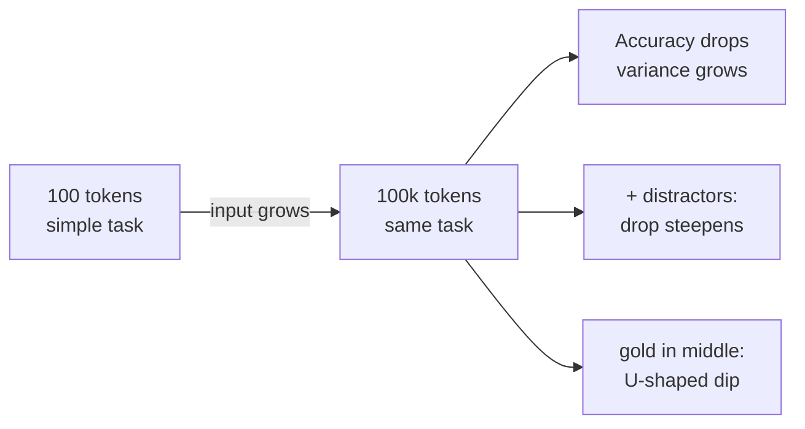
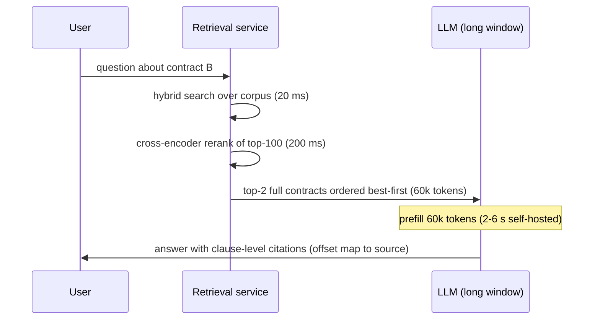
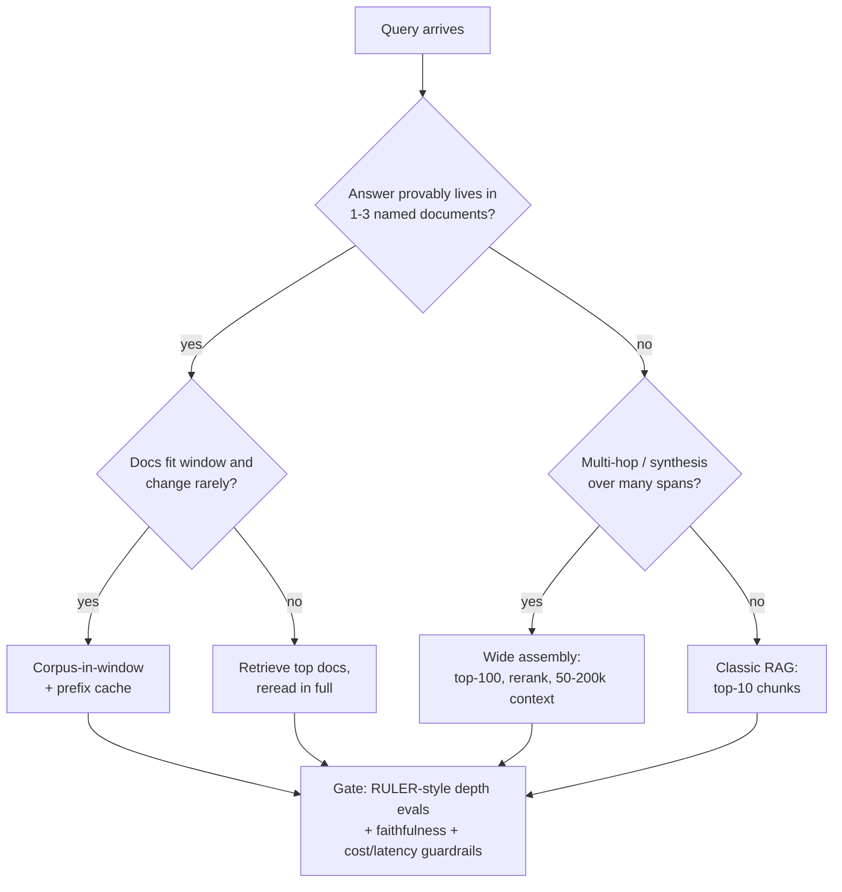

# Long Context vs RAG

## Overview

Since 128K-2M-token windows became standard, every RAG architecture review opens with the same question: if the model can read 1M tokens, why maintain a retrieval stack? This page treats the question quantitatively — what the long-context benchmarks (NIAH, RULER) actually measure, what lost-in-the-middle and context-rot evidence say about usable context, the full cost arithmetic of a 1M-token request versus retrieval plus 10k tokens, and the hybrid retrieve-then-reread patterns that production systems converge on. The honest answer is regime-dependent, and "long context kills RAG" is false as a general claim but true in specific, identifiable regimes — naming those regimes is the interview skill.

Companion pages: [Long-Context Strategies](../architectures/long-context-strategies.md) covers the *mechanisms* (RoPE scaling, ALiBi, sliding windows, KV compression) that make big windows possible; this page covers the *systems decision* of when to use them instead of retrieval. [RAG Evaluation](./rag-evaluation.md) supplies the metrics used to arbitrate.

## The Debate, Stated Honestly

The "long context kills RAG" claim, in its strongest form, has three correct observations. First, for corpora that genuinely fit in a window and change rarely — one contract, one repository, one product's docs at 50k tokens — the retrieval plumbing is dead weight: no embedding model, no fusion tuning, no index-staleness bugs, and the model can attend across the whole corpus for multi-hop questions that chunk-level retrieval structurally breaks. Second, 2023-era RAG was genuinely bad: tiny chunks destroyed local context, weak recall@k ceilings were invisible without evaluation, and top-k stuffing ignored ordering effects. Third, long context eliminates a class of retrieval-attribution bugs — when the model fails, the evidence was there.

The counter-claims, each with quantitative backing below: (1) advertised context size overstates effective context — RULER showed models passing single-needle tests while failing aggregation and multi-hop tasks at the same lengths; (2) cost and latency scale linearly (and attention super-linearly) with stuffed tokens, while retrieval input cost is roughly constant — a 100-200× input-cost ratio at equal answer length; (3) corpora in production are tens of millions to billions of tokens and multi-tenant, which no window covers; (4) freshness, per-user ACLs, and citation provenance are retrieval-native properties that stuffing handles badly or not at all.

Both camps converge on the same production pattern: **retrieve-then-reread** — use retrieval to select *what* enters the window, use the long window to read the selected material *in full*. The debate is not RAG-vs-long-context; it is how much context to pay for after retrieval, and whether the corpus justifies a window bigger than your query needs.

Watch what the window vendors themselves ship: every provider pushing million-token windows also sells a retrieval product — OpenAI's File Search for assistants, Anthropic's contextual-retrieval recipe (chunk embeddings enriched with document-context prefixes) for RAG pipelines, Google's grounding on Vertex AI Search. The coexistence is the tell: windows are a capacity feature, retrieval remains the default architecture for corpus-scale QA, and provider guidance treats pasting as the special case for small inputs. When the vendor's own docs recommend retrieval beyond a handful of documents, "just paste it all" carries an implicit asterisk.

## Needle in a Haystack: What Passing Actually Certifies

NIAH (Gregory Kamradt, November 2023) inserts a single sentence — "one of the special magic numbers for {placeholder} is: {number}" — at many depths of a haystack of Paul Graham essays, asks for the number, and reports accuracy across a depth × length grid. GPT-4-class models scored near-perfect at 128K, and the visualization became the marketing image for long context. What a pass certifies: the model can find one topically-isolated fact anywhere in the window when asked a direct lookup question with no competing instructions. That is a *memory-bandwidth* test, not a *reasoning-over-context* test.

Three structural weaknesses matter for architecture decisions:

- **Single needle, no distractor pressure.** One target sentence amid topically-unrelated prose is easy; production corpora contain *many* near-miss documents (the rival spec version, last year's policy) that compete for attention. Multi-needle variants (also from Kamradt's test suite) raise the difficulty and reported scores drop measurably.
- **No aggregation.** Computing "summarize all SLA clauses" or "count every violation" requires attending to many spans jointly — exactly the capability NIAH never exercises.
- **No calibration of depth effects.** A single averaged pass can hide U-shaped depth curves — the test's famous summary plot aggregates the position axis that lost-in-the-middle research shows is decisive.

OpenAI reported ~99% multi-needle retrieval at 128K for GPT-4 Turbo; treat even multi-needle numbers as a lower bound on capability, not a guarantee of corpus-QA quality. The test that a model "knows its window" is passing harder task families at that length — which is RULER's contribution.

## RULER: Effective Context vs Advertised Context

RULER (Hsieh et al., NVIDIA, COLM 2024) builds parameterized task families at configurable context lengths and defines *effective context*: the largest length at which aggregate performance stays within a fixed margin of the model's short-context baseline. The four families deliberately spread across cognitive demands:

| Family | Example tasks | What it stresses |
|---|---|---|
| Retrieval | Single/multi-key, multi-value, multi-query NIAH variants | Lookup under distractor pressure |
| Multi-hop tracing | Variable tracking (chains of assignments across the context) | Joint attention over scattered spans |
| Aggregation | Common/frequent word extraction (CWE/FWE), counting | Summarizing across many spans |
| QA | SQuAD/HotpotQA-derived, context-augmented | Reading comprehension at depth |

Two headline findings shape architecture reviews. First, **advertised context overstates effective context for every model tested** — 2024-era models advertising 32K-128K windows frequently showed effective context well below claim (in several cases a quarter or less), and the gap widened with task complexity. Second, **task families degrade non-uniformly**: needle-style retrieval holds up longest, aggregation and multi-hop collapse first — which is why a vendor chart showing NIAH-only numbers at 1M tokens is compatible with near-zero aggregation ability at 200k. RULER's own aggregate correlated better with downstream long-context QA than any single-family score.

The operational takeaways: demand per-task-family breakdowns when evaluating a long-context model; benchmark at *your* context budget, not the vendor's maximum; and re-run on your own corpus, because RULER's synthetic distributions flatter models relative to messy real text (see [Long-Context Strategies](../architectures/long-context-strategies.md) for the position-encoding and training machinery behind the claims). Later benchmarks (∞BENCH pushing past 100K with realistic tasks; HELMET re-ranking RULER-style tasks against downstream workloads) continue the same discipline: window size is a config value, effective context is a measurement.

### The Benchmark Landscape at a Glance

The tests stack into a difficulty ladder; knowing which rung a vendor chart sits on is half the evaluation:

| Benchmark | What it exercises | What a good score certifies | Blind spot |
|---|---|---|---|
| NIAH (single needle) | One fact, direct lookup, no distractor pressure | Information is physically reachable in the window | Almost everything else — no reasoning, no noise, no aggregation |
| Multi-needle NIAH | k facts retrieved jointly | Robustness under mild distractor load | Still lookup-shaped; no synthesis |
| RULER (4 families) | Retrieval variants, multi-hop tracing, aggregation, QA | Effective context with task-family breakdown | Synthetic distributions flatter models vs messy real text |
| ∞BENCH | Realistic tasks past 100K (QA, retrieval, coding, math over long books/code) | Long-context competence on natural text | Few models score well; ceiling effects above 100-200K |
| HELMET | RULER-style tasks + downstream workloads (book QA, long-doc QA, code) | Correlation with real long-context workloads | Newer; smaller model coverage |

The ladder explains why debates stall: a "1M context works" claim citing NIAH and a "long context fails" claim citing RULER aggregation are both correct — at different rungs. Always ask which family, which length, and effective-context definition when reading any long-context number.

## Lost in the Middle and Context Rot

Lost in the middle (Liu et al., TACL 2024) varied the position of the gold document in 20-document multi-document QA and found a U-shaped accuracy curve — best at the beginning and end of the context, worst in the middle, with drops exceeding 20 percentage points for some models — *including* models advertising large windows. The effect appears in closed-book and key-value variants too, so it is not an artifact of one dataset. For architecture this means a stuffed 1M-token prompt is not a uniformly-addressable memory: position in context is a first-class variable, and "it was in the prompt" does not mean it was usable.

Context rot (Chroma research, 2025) extends the argument to input length itself: across 18 models, performance on nominally simple retrieval tasks degraded as input grew — even without distractors, and with the degradation steepening under distractor pressure, longer target responses, and repeated runs (higher variance at length). The practical reading: the marginal token in a stuffed prompt is not free — it is a small attention tax, and the taxes compound. Combine the two effects and the design rule falls out: **the prompt should contain the evidence, ordered by relevance, capped at the length the model demonstrably uses well** — not the window maximum. This is why context precision (are retrieved chunks actually useful?) and context ordering are evaluation metrics on [RAG Evaluation](./rag-evaluation.md) rather than afterthoughts.

## Assembling the Prompt: A Worked Token Budget

The design rule from the last section — evidence, ordered, capped — becomes concrete as a budget. Take a 200k-window model serving a support assistant, where measured usable length (from RULER-style depth evals on *your* corpus) is 128k:

| Block | Budget | Rules |
|---|---|---|
| System + instructions + tool schema | 1-2k | Static prefix — identical bytes every request so the cache hits |
| Retrieved evidence, relevance-ordered | 30-60k | Best chunks at the edges; dedupe near-duplicates; tables/code stay atomic |
| Conversation history | 4-10k | Rolling summary beyond that; pin last user turn |
| Output + headroom | 8-16k | Output budget is also your worst-case answer length |
| Unused window | the rest | Dead capacity — you are not billed for it, but you are not using it either |

Three assembly mistakes account for most quality complaints in stuffed systems. **Near-duplicate chunks** (the same passage retrieved via both lexical and dense channels, or boilerplate repeated across pages) burn budget and bias attention toward repetition. **Unordered evidence** ignores the U-shaped depth curve — chronological or index-order placement puts gold chunks in the worst positions at random. **Budget-by-window** (fill until the model rejects) ignores measured usable length; the cap comes from your evals, not the spec sheet. All three are checkable in CI with the context-precision metric — dead weight shows up as low precision at high cost.

## Cost Math: One 1M-Token Request vs Retrieval + 10k

Prices below are illustrative list-price shapes (flat ~$3/M input; tiered ~$1.25/M below 128K and ~$2.50/M above, Gemini-1.5-Pro-style; ~$12/M output) — recompute against current provider pages before quoting them in a design doc. The *ratios* are the durable part, because they follow from token counts, not from any particular price sheet.

Setup: knowledge base of 50M tokens; 10,000 queries/day; answers of ~500 output tokens. Option A stuffs ~1M tokens of corpus per request. Option B retrieves ~10k tokens (20 chunks × 500 tokens) and prefills those.

| Quantity | Stuff 1M/query | Retrieve + 10k/query | Ratio |
|---|---|---|---|
| Input tokens | 1,000,000 | 10,000 | 100× |
| Input cost @ flat $3/M | $3.00 | $0.030 | 100× |
| Input cost @ tiered ($2.50 vs $1.25 per M) | $2.50 | $0.0125 | 200× |
| Output cost (500 tok @ $12/M) | $0.006 | $0.006 | 1× |
| Daily input spend @ 10k queries (tiered) | ~$25,000 | ~$125 | 200× |
| KV cache, 70B-class, fp16 | ~328 GB | ~3.3 GB | 100× |
| TTFT, 8×H100 node, 70B-class | ~35 s (compute floor) | ~1-2 s | ~20-50× |
| Max corpus size | the window | the index (TBs) | unbounded |

The derivations worth memorizing:

- **Input token ratio is structural.** Stuffing pays for the whole corpus view on every query; retrieval pays for ~10k tokens regardless of corpus size. At 50M tokens of corpus, that is the difference between 20× corpus-per-query redundancy (1M/50M covered per query... i.e., stuffing 1M tokens covers 2% of the corpus) and paying only for what matched.
- **KV cache is the serving-side mirror of the cost ratio.** Per token, a GQA model costs \\( 2 \times L \times H_{kv} \times d_{head} \times 2 \\) bytes (K+V, layers, KV heads, head dim, fp16). A Llama-3-70B-class model (80 layers, 8 KV heads, 128 head dim) needs ~0.33 MB/token — ~328 GB for one 1M-token sequence, exceeding a single 80-90 GB accelerator, so long-stuff serving implies multi-GPU sharding, KV quantization, or both (see [KV Cache Compression](../advanced/kv-cache-compression.md)). The same model retrieving 10k tokens needs ~3.3 GB — one GPU with room for batch.
- **Prefill is compute-bound and quadratic-ish.** Prefill FLOPs are ≈ \\( 2 N_{params} n \\) plus an attention term that stops being negligible at 1M. For the 70B-class model: \\( 2 \times 7\times10^{10} \times 10^6 = 1.4\times10^{17} \\) FLOPs; an 8×H100 node at ~50% MFU delivers ~4×10¹⁵ FLOP/s, so the compute floor is ~35 s TTFT — before queuing, and before the O(n²) attention overhead. The same node prefills 10k tokens in well under a second. This is why 1M-token requests are batch/analytics-shaped, not chat-shaped.
- **Output cost is identical, which keeps the ratio honest.** Hallucinated "RAG is cheaper because generation is the same" is wrong only in magnitude, not direction: with 500-token answers, input dominates both options, so the 100-200× input ratio is the whole story. With 5,000-token outputs (report generation), output cost ($0.06 at $12/M) still does not close a 100× input gap.
- **Caching changes the ratio only for repeated prefixes.** Prompt-cache reads bill the matched prefix at ~0.1×, so a *static, shared* 1M context hammered by many users amortizes beautifully — but per-user, per-document corpora rarely hit, and the write premium applies on cold fills (see [Prompt Caching](../prompting/prompt-caching.md) for the break-even arithmetic). Model the hit rate before assuming the discount.

### What the Retrieval Side Actually Costs

The 100-200× comparison is incomplete until the retrieval side owns its own bill — which, honestly computed, is small but not zero:

- **One-time embedding.** 50M tokens at typical embedding API rates (~$0.02-0.10/M tokens) is $1-5 once, or effectively free on a self-hosted embedder. Even re-embedding the full corpus on every embedder upgrade is rounding error next to one day of stuffing.
- **Index storage and serving.** A 50M-token corpus is ~100-250k chunks; dense vectors at 1024 dims × 4 bytes ≈ 4 KB/chunk → 0.4-1 GB of vectors — a single node hosts the entire index alongside the inverted lists. Query-side ANN+BM25 is milliseconds of CPU; at 10k queries/day the amortized infrastructure is dollars.
- **Reranker compute.** A cross-encoder over the top-100 is the priciest retrieval stage (~100-500 ms, GPU-seconds at scale); it remains 10-100× cheaper than the prefill it saves.
- **Engineering.** The real cost: chunking tuning, hybrid fusion weights, golden-set maintenance, eval harness upkeep. This is the line item stuffing advocates are actually pointing at — and it is exactly the investment that transfers to every model swap, while a 1M-token habit must be re-justified against every price change.

The crossover structure: retrieval has fixed engineering cost plus tiny marginal cost; stuffing has zero engineering cost plus enormous marginal cost. Below a few queries per day, stuffing wins on total cost of ownership; above roughly one query per few seconds, retrieval wins by two orders of magnitude — and production traffic is almost always above the crossover.

### Pricing Shapes in the Wild

Long-context billing is not one design; recognizing the shapes matters because each rewards different behavior:

| Pricing shape | Example shape | What it rewards |
|---|---|---|
| Flat per-token, no tiers | ~$2-3/M input at any length up to 1M | Predictability; stuffing still pays 100× token count |
| Tiered by request length | ~$1.25/M ≤128K, ~$2.50/M above | Retrieval: staying under the tier boundary is doubly cheap |
| Premium beyond a threshold | ~2× input and output past 200K tokens | Capping context below the cliff; wide-assembly over full-stuff |
| Cache read ≈ 0.1× base | Matched-prefix reads | Static shared prefixes — corpus-in-window with high hit rates |

The tiered rows are why the same 1M-token request can cost 200× the retrieval path rather than 100×: the stuffed request *also* changes the per-token rate. Output prices are usually tier-free, which is where the asymmetry bites — you cannot save your way out of a huge input with cheap output.

### Freshness and Update Economics

Stuffing re-pays for change: a document updated overnight re-enters every subsequent request at full input price, so the effective cost of freshness is proportional to query volume. Retrieval pays once per update — re-embed the changed chunks (milliseconds), upsert into the index, done; the marginal cost of a document edit is independent of how many queries will ever mention it. For high-churn corpora (tickets, news, documentation in active edit), freshness economics alone decide the question, before quality enters the discussion. The one caveat: re-embedding is cheap, but *re-tuning* (fusion weights, golden-set refresh against new content) is not — high-churn corpora also need drift-aware evaluation ([RAG Evaluation](./rag-evaluation.md)).

## Latency and Serving Reality

Latency asymmetry favors retrieval more than cost does. Prefill time scales with input tokens (and super-linearly through the attention term); decode time scales with output tokens and is *independent of input length* — so a stuffed 1M request feels like a long pause followed by normal-speed tokens, which is the worst interaction profile for chat. Retrieval adds its own tail: embed (~10-50 ms), ANN + BM25 (~10-30 ms), cross-encoder rerank of the top-100 (~100-500 ms), then a 10k-token prefill (~0.5-2 s end-to-end at API latencies). A 3 s TTFT SLO therefore *caps* stuffable context: whatever your serving tier prefills in under ~2.5 s is your real budget, and for mid-sized self-hosted models that is tens of thousands of tokens — not a million.

Long-context serving mitigations exist and matter: chunked prefill overlaps compute and scheduling; ring attention shards the O(n²) attention across devices (see [Ring Attention](../advanced/ring-attention.md)); sliding-window and hybrid-SSM architectures cut attention cost but re-introduce the "evicted middle is gone" problem that retrieval was solving. All of them reduce *latency and memory per token*; none reduces the token count you pay for. Retrieval is the only lever that attacks the token count itself — which is why cost-driven designs retrieve more aggressively as traffic scales, not less.

A per-stage latency budget for the two shapes on the same 70B-class, 8×H100 serving tier:

| Stage | Stuff 1M | Retrieve + 10k |
|---|---|---|
| Retrieval (embed + ANN + BM25) | — | 10-50 ms |
| Rerank top-100 (cross-encoder) | — | 100-500 ms |
| Prefill | ~35 s compute floor (60-120 s realistic with attention term and queuing) | ~0.3-1 s |
| Decode 500 tokens | ~2-5 s (unchanged) | ~2-5 s (unchanged) |
| End-to-end p50 | ~1-2 minutes | ~1-2 s |

The decode row is the user-experience trap: token generation speed is independent of input length, so a stuffed request looks fine in a throughput benchmark (tokens/second) while being 50× worse in time-to-first-token — the metric users actually feel. SLOs should therefore pin TTFT separately from decode speed, and context budget per route follows from the TTFT budget, not from the window.

## Hybrid: Retrieve-Then-Reread Patterns

Four production shapes, in increasing long-context intensity:

1. **Classic RAG.** Hybrid retrieval → rerank → top-10 chunks (~5-10k tokens) → generate. The default: cheapest per query, provenance-native, works at any corpus size. Its weakness is chunk granularity — multi-hop questions whose evidence spans documents need wide assembly, and small chunks lose local context ([Chunking Strategies](./chunking-strategies.md)).
2. **Document-level retrieve-then-reread.** Retrieve *documents* (not chunks) with cheap stage-1 scoring, then read the top 1-3 documents *in full* in the window. This spends long context where it is strong — within-document cross-attention over ~10-100k tokens — and never indexes what it doesn't need. It is the pattern for legal review, ticket-thread triage, and "find the clause across these three versions".
3. **Wide-assembly RAG.** Retrieve top-100, rerank, assemble 50-200k tokens of ordered context — best chunks at the edges (lost-in-the-middle mitigation), duplicates deduped, budget capped at measured usable length. This is the long-context window used as a *reranked staging buffer*, and it is where window size genuinely buys accuracy: the reranker's recall ceiling (see [Rerankers: Deep Dive](./rerankers-deep.md)) moves from 10 slots to 200.
4. **Corpus-in-window with cache.** Corpus ≤ window, static, shared: stuff once, cache the prefix, answer from cache reads. Marginal cost per query collapses; provenance and citations still need an offset-map from context positions back to source — a chunk index by another name.

Pattern 4 is the honest version of "long context kills RAG": at small, stable, shared corpus sizes the retrieval stack degenerates into an offset map for citations. Vendor evaluations of the opposite regime (e.g., Databricks' 2024 "Long Context RAG Performance of LLMs" study) found chunk-based RAG matching or beating full-document stuffing on QA benchmarks while costing orders of magnitude less — treat vendor numbers as directional, and re-run the comparison on your own corpus with the [RAG Evaluation](./rag-evaluation.md) harness before committing either way.

One request through the document-level pattern, with realistic stage timings:

The window is doing what it is uniquely good at — holding two full contracts so clause cross-references survive — while retrieval does what it is uniquely good at: making sure those two contracts, not two thousand chunks from two hundred documents, are what got read.

## ACLs, Tenancy, and Provenance

Three retrieval-native properties have no clean stuffing equivalent, and they are usually the deciding rows in regulated environments. **Access control**: retrieval filters at query time — each chunk carries its tenant/document ACLs and the search itself is permission-bounded, so an unauthorized document is never a candidate. Stuffing inverts this: someone assembles a prompt from allowed documents, and the correctness of access control becomes a property of prompt-construction code, untestable at the storage layer and unauditable after the fact. **Provenance**: citations need a mapping from answer spans back to source locations; retrieval has this for free (chunk IDs), while a stuffed prompt needs an offset map rebuilt on every corpus change — an index by another name, built worse. **Audit**: "which documents could have influenced this answer?" is a metadata query on retrieved chunks; on a stuffed prompt it is the entire context.

The regime where stuffing survives these constraints is genuinely small-corpus, single-tenant, citation-light — internal notes, one user's uploaded files with a simple offset map. The moment documents have per-user visibility, answers need citations, or auditors ask the influence question, the retrieval stack returns — not for quality reasons but for governance ones (see [LLM Security](../llm-security.md) for the threat-model side).

## Decision Table: When Each Wins

| Dimension | Long context wins | RAG wins |
|---|---|---|
| Corpus size | ≤ ~100-500k tokens | Millions to billions of tokens |
| Freshness | Corpus stable; re-stuffing per request is acceptable | Index updates in seconds-minutes |
| Cost/query | Batch, one-off, or heavily cache-hit traffic | High-QPS, low-margin, cost-capped products |
| Latency SLO | Seconds-to-minutes tolerable (analysis, batch) | Chat-grade TTFT (≤ 3 s) |
| Multi-hop reasoning | Within one document / one window | Across documents — needs wide retrieval first |
| Provenance & citations | Needs offset-map bookkeeping | Chunk IDs native |
| ACLs / multi-tenancy | Risky — filtering a stuffed prompt leaks | Filter at retrieval; leakage-resistant |
| Query distribution | Unknown/one-off (no time to tune retrieval) | Known and stratifiable (tune fusion, rerank) |
| Aggregation tasks | Whole-corpus summaries, counting, extraction | Only if evidence fits the window — assemble wide |
| Evaluation measurability | Hard — effective context ≠ advertised | Direct — recall@k, nDCG, context precision |

Two rows deserve emphasis because they invert intuition. *Multi-hop*: long context is often marketed as the multi-hop fix, but if the hops span a 50M-token corpus, no window holds all candidate evidence — retrieval must select first, and only then does the window's joint attention pay off. *ACLs*: stuffing a filtered subset of documents per user re-creates the retrieval system in prompt form, except permission bugs become prompt-construction bugs — quieter, harder to test, and audit-hostile.

Mapping common workload archetypes onto the rows:

| Workload | Shape | Default pattern |
|---|---|---|
| Product-docs assistant (5M tok, weekly updates, high QPS) | Scale + freshness + cost | Classic RAG, strict context cap |
| Contract / lease review (1-3 docs, ad hoc) | Small, one-off, within-document hops | Document reread (no index needed) |
| Cross-version clause comparison (a few docs) | Small, needs full-document attention | Document reread over top docs |
| Support-ticket deflection (50M tok, churn, cost-capped) | Everything retrieval-favoring | Classic RAG + refusal stratum evals |
| Codebase Q&A (repo 50k-300k tok) | Small, stable-ish, cacheable | Corpus-in-window + offset map for citations |
| Monorepo-scale code Q&A (10M+ tok) | Scale + freshness | Hybrid retrieval + file-level reread |
| Research synthesis across 100 papers | Aggregation-heavy, one-off | Wide assembly (top-100 → 100-200k) |
| Forensic log analysis (batch, one-off) | Aggregation, latency-tolerant | Full window, batch-priced |

The archetype table is the interview answer in compressed form: name the workload, read off the pattern, justify with the cost and latency rows above.

## Pitfalls

1. **Trusting advertised windows.** Effective context (RULER-style, per task family) is the number that matters; single-needle marketing charts are compatible with failing aggregation at a quarter of the claimed length.
2. **Stuffing without ordering or capping.** Lost-in-the-middle plus context rot mean an unordered maximum-context prompt is a downgrade from a smaller, ordered, relevance-capped one — measure usable length, then cap below it.
3. **Ignoring tiered pricing.** Per-token rates step up (often 2×) beyond ~128-200k; a 1M-token request bills at the premium rate, doubling the structural 100× ratio to 200×.
4. **Assuming the cache discount.** Prompt caching rescues only repeated *identical* prefixes; per-user corpora with cold TTLs can end up *more* expensive under write-premium schemes.
5. **Killing the vector store to save cost, then rebuilding it for citations.** Provenance requires mapping answer spans back to sources; without a chunk index you will rebuild one badly inside the prompt. Keep the index; it is also your ACL boundary.
6. **Evaluating long-context choices without depth-aware benchmarks.** Perplexity at 1M tokens certifies nothing about mid-context retrieval; run multi-depth needle, RULER-style aggregation, and your own corpus QA before deciding.
7. **One-size-for-all-queries routing.** Lookup queries want top-10 chunks; synthesis queries want wide assembly; one-off deep analysis wants the full window. Route by query class and price the route.

## Interview Questions

1. **Your corpus is 200k tokens, static, and shared by all users. Do you still need a vector database?** Probably not for retrieval — stuff the corpus, cache the prefix (0.1× reads make repeat traffic nearly free), and answer directly. But three retrieval-stack functions survive: citation provenance (maintain an offset map from context positions to source spans), ACL extensions (the moment per-user visibility appears, stuffing filtered subsets per user becomes prompt-construction security), and evaluation (you still need RULER-style depth checks and faithfulness gates, because "it was in the prompt" never guaranteed use). The decision flips on cache hit rate and tenancy, not on corpus size alone.
2. **Why can a model ace NIAH at 128K and still fail RULER at 16K?** NIAH certifies one capability: single-fact lookup with no distractor pressure. RULER's other families stress what NIAH never exercises: multi-hop tracing (joint attention over scattered assignments), aggregation (summarizing across many spans), and QA under distractor density. Degradation is task-family-dependent — needle retrieval holds up longest, aggregation collapses first — so a model can pass the retrieval family at its claimed length while its aggregate score (and effective context, defined as the length where aggregate stays within margin of the short-context baseline) sits far below claim. The general lesson: benchmark scores certify the task family measured, nothing more.
3. **Walk through the cost comparison for answering 10k queries/day from a 50M-token corpus.** Retrieval pays ~10k input tokens per query — at tiered list prices (say $1.25/M under 128K) that is ~$0.0125 input, ~$125/day plus identical output cost in both options. Stuffing pays for the window: ~1M tokens at the >128K premium rate (~$2.50/M) is $2.50/query, ~$25,000/day — a ~200× input-cost ratio that comes from token counts and price tiers, not from any particular price sheet. Serving-side: the 70B-class KV cache for 1M tokens is ~328 GB (multi-GPU), prefill has a ~35 s compute floor on an 8×H100 node; the retrieval path caches 3.3 GB and answers in ~1-2 s. Caching narrows the gap only when the same prefix is reused across users — model the hit rate first.
4. **How do lost-in-the-middle and context rot change the way you assemble RAG context?** Three concrete changes. Order by relevance with the best material at the edges — the U-shaped curve makes position a first-class variable, and "it was in the prompt" is not "it was usable". Cap the context at the length the model demonstrably uses well on your corpus, which is frequently well below the advertised window — every additional chunk is recall insurance but also an attention tax that context-rot measurements show compounds under distractors. Evaluate assembly explicitly: context precision (are retrieved chunks useful?) and depth-controlled QA (same evidence, different depths) belong in the harness, because assembly regressions are invisible to document-level recall@k.
5. **Design a retrieve-then-reread pipeline for a contract-analysis product.** Stage 1: document-level retrieval over the corpus with hybrid search (contract IDs, clause numbers, party names reward lexical matching). Stage 2: read the top 1-3 full documents in the window — this is where long context earns its cost, preserving clause cross-references that chunking destroys. Stage 3: for cross-document synthesis (compare versions across 20 contracts), retrieve wide (top-100), rerank, assemble 50-200k ordered by relevance with the most-relevant at the edges. Every answer cites clause-level spans via an offset map. Gate with RULER-style multi-depth tasks plus faithfulness (claim-level, per-claim verdicts), and route: single-contract questions to full-doc reread, corpus-wide analytics to wide assembly, and batch the 1M-token jobs that tolerate minutes of TTFT.
6. **When is a 1M-token request the right answer despite everything above?** When the query is one-off or low-QPS, latency-tolerant, and the task genuinely needs joint attention over material that retrieval would under-select: deep cross-document synthesis, whole-codebase audits, log forensics where you cannot pre-index the structure, and cold-start corpora where building an index for a single analysis is wasted effort. The signature properties: batch-shaped (seconds-to-minutes of TTFT acceptable), one-shot (no amortized cache benefit to chase), aggregation-heavy (retrieval's selectivity is the enemy), and human-critical enough that the model seeing everything is worth 100-200× the input cost. Even then, benchmark effective context first — you may be paying the premium rate for a window the model only uses well to 200k.

## Key Takeaways

- "Long context kills RAG" is regime-true only: small, stable, shared, cache-friendly corpora within ~100-500k tokens favor stuffing; scale, freshness, tenancy, and cost favor retrieval — and production corpora usually fail the stuffing test on size alone.
- NIAH passing certifies single-fact lookup; RULER shows advertised context exceeds effective context for every model tested, with aggregation and multi-hop degrading first — demand per-task-family numbers at your context budget.
- Lost in the middle (U-shaped depth curves) plus context rot (accuracy and variance degrade with input length, steepening under distractors) make ordering and context capping first-class design decisions, not cosmetics.
- The cost ratio is structural: ~1M stuffed input tokens vs ~10k retrieved is 100× on flat pricing and up to 200× under long-context tiered pricing; output cost is identical and rarely closes the gap.
- Serving mirrors the economics: ~328 GB KV cache and a ~35 s prefill compute floor for one 1M-token request on a 70B-class model versus ~3.3 GB and ~1-2 s end-to-end for retrieve-plus-10k.
- Prompt caching rescues stuffing only for static, shared, repeatedly-hit prefixes; per-user corpora with write-premium schemes can cache their way to *higher* bills.
- Production converges on retrieve-then-reread: retrieval selects what enters the window (top-10 chunks, full documents, or a reranked 50-200k wide assembly), the window does the joint reading — long context as the reranker's staging buffer, not the retrieval stack's replacement.
- Route by query class: lookup → classic RAG; within-document synthesis → document reread; cross-corpus aggregation → wide assembly; one-off batch analysis → full window. Gate every route with depth-aware evals, faithfulness, and cost/latency guardrails.

## References

- G. Kamradt, "Needle In A Haystack - Pressure Testing LLMs", 2023 (test suite and depth × length grid) — <https://github.com/gkamradt/LLMTest_NeedleInAHaystack>
- N. F. Liu, K. Lin, J. Hewitt, et al., "Lost in the Middle: How Language Models Use Long Contexts", TACL 2024 — <https://arxiv.org/abs/2307.03172>
- C.-P. Hsieh, S. Sun, S. Kriman, et al., "RULER: What's the Real Context Size of Your Long-Context Language Models?", NVIDIA / COLM 2024 — <https://arxiv.org/abs/2404.06654>
- X. Zhang, Y. Wu, J. Xia, et al., "∞BENCH: Extending Long Context Evaluation Beyond 100K Tokens", 2024 — <https://arxiv.org/abs/2402.13718>
- H.-Y. Yen, M. Tian, H. Shi, D. Fried, D. Chen, "HELMET: How to Evaluate Long-Context Language Models Effectively and Thoroughly", 2024 — <https://arxiv.org/abs/2410.02694>
- Gemini Team, "Gemini 1.5: Unlocking Multimodal Understanding Across Millions of Tokens of Context", 2024 — <https://arxiv.org/abs/2403.05530>
- P. Lewis, E. Perez, A. Piktus, et al., "Retrieval-Augmented Generation for Knowledge-Intensive NLP Tasks", NeurIPS 2020 — <https://arxiv.org/abs/2005.11401>
- Databricks, "Long Context RAG Performance of LLMs", 2024 (vendor study; cited by title — evaluate on your own corpus)
- Chroma, "Context Rot: How Increasing Input Tokens Impacts LLM Performance", Chroma Research, 2025 (cited by title)
- OpenAI API Pricing (long-request tiering shapes; verify current rates) — <https://openai.com/api/pricing/>
- Anthropic Pricing (long-context billing tiers; verify current rates) — <https://www.anthropic.com/pricing/>

## Cross-References

- [Long-Context Strategies](../architectures/long-context-strategies.md) — the RoPE/ALiBi/KV machinery that makes (and limits) large windows
- [Ring Attention](../advanced/ring-attention.md) — sharding the 1M-token prefill across devices
- [KV Cache Compression](../advanced/kv-cache-compression.md) — the memory side of the 328 GB number
- [Position Encoding](../advanced/position-encoding.md) — why extrapolation ≠ deep retrieval
- [Chunking Strategies](./chunking-strategies.md) — the granularity decision underneath document-level reread
- [Rerankers: Deep Dive](./rerankers-deep.md) — the recall ceiling that wide assembly extends
- [RAG Evaluation](./rag-evaluation.md) — the harness that arbitrates retrieve-vs-stuff on your corpus
- [Prompt Caching](../prompting/prompt-caching.md) — prefix economics behind the caching rows above
- [RAG Systems](../rag-systems.md) — the production retrieval architecture this page prices against
