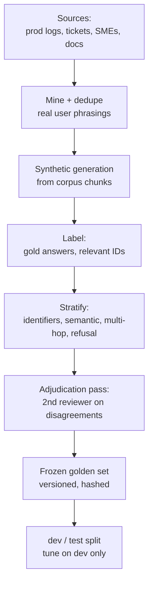
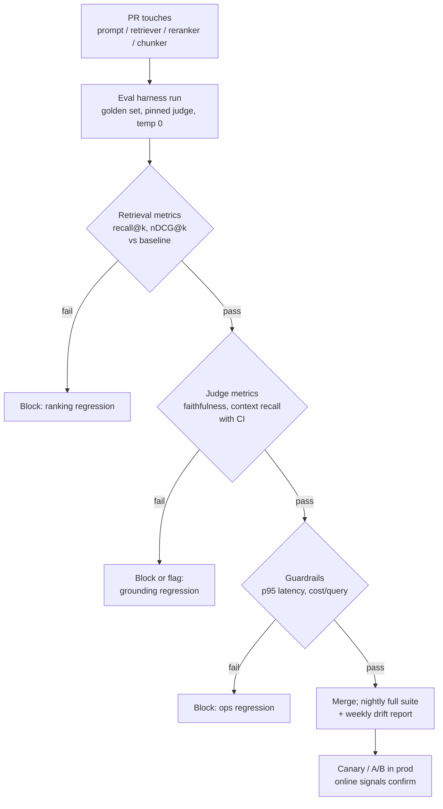

# RAG Evaluation

## Overview

A RAG pipeline is a chain of independently-failable stages — indexing, retrieval, reranking, context assembly, generation — and end-to-end impressions ("looks better") cannot localize which stage regressed. RAG evaluation is the discipline of measuring each layer with metrics that have the right failure sensitivity: ranking metrics (recall@k, MRR, nDCG) for retrieval, claim-level and reference-free metrics (faithfulness, answer relevance, context precision/recall) for generation, all driven by a curated golden set and wired into CI gates and production A/Bs. This is a top-three interview topic for applied-LLM roles because it separates teams that ship RAG from teams that can *change* RAG safely.

Scope note: [RAG Systems](../rag-systems.md) covers the operational/observability angle (what to log, three quality dimensions) and [RAG (serving view)](../llm-serving/rag.md#rag-evaluation) has the one-table metric summary; this page is the deep dive — the metric math, framework internals, judge calibration, golden-set methodology, and the CI/AB machinery that turns measurements into release decisions.

## Metrics by Layer

Every RAG failure is a failure at some layer, and each layer has metrics that catch exactly its failure modes. The core design decision in an eval harness is which layer each metric is allowed to speak about: a generation metric cannot rescue a retrieval gap (the model cannot cite text it never saw), and a retrieval metric says nothing about whether the model *used* what it retrieved.

| Layer | Question it answers | Metrics | LLM-as-judge? | Typical failure caught |
|---|---|---|---|---|
| Corpus / indexing | Is the corpus fresh, complete, chunked sanely? | Index coverage %, freshness lag, chunk-size distribution | no | Missing documents, stale index, broken parsers |
| Stage-1 retrieval | Did the right candidates enter the pool? | recall@N (hit rate), candidate-pool coverage | no | Hybrid/embedder config, top-N too small |
| Final ranking | Are relevant chunks at the top? | MRR, nDCG@k, precision@k | no | Reranker regressions, fusion weights |
| Context assembly | Did the *prompt* contain the needed facts? | Context precision, context recall (RAGAS-style) | judge | Chunk selection, ordering, context budget |
| Generation | Is the answer grounded and on-topic? | Faithfulness, answer relevance | judge | Hallucination, ignoring context, off-topic drift |
| End-to-end | Does the user succeed? | Task success rate, thumbs-up rate, deflection, escalation rate | telemetry | Product-level quality, prompt regressions |
| Ops guardrails | Is it fast and affordable? | p50/p95 latency, cost/query, token counts | no | Latency/cost regressions from "quality" changes |

Two rules make this table operational. First, **debug top-down**: when faithfulness drops, check context recall before touching the prompt — if the evidence never reached the prompt, generation changes are noise. Second, **gate bottom-up**: retrieval metrics are cheap and deterministic enough to run on every commit, while judge-based metrics run on larger cadences with confidence intervals (below).

## Retrieval Metrics: Recall@k, MRR, nDCG

These metrics need, per query, a set (or graded list) of relevant documents and the system's ranked output. They inherit fifty years of IR methodology (see Manning, Raghavan & Schütze, *Introduction to Information Retrieval*) and run in milliseconds without any model calls, which is what makes them CI-eligible.

**Recall@k** answers "did the needed evidence survive the cut?" — for a query \\( q \\) with relevant set \\( R(q) \\) and the top-\\( k \\) retrieved list:

\[ \mathrm{recall@}k = \frac{| \{ d \in R(q) \} \cap \{ \text{top-}k \} |}{| R(q) |} \]

Recall@k is the *ceiling* metric: the generator can only use what retrieval surfaced, so if recall@10 on the golden set is 0.82, 18% of questions were lost before the LLM ran. For multi-fact questions, track **recall of necessary facts**, not documents — a single chunk can be "relevant" while omitting the second fact the answer requires (see [Chunking Strategies](./chunking-strategies.md) on granular relevance).

**MRR (Mean Reciprocal Rank)** answers "how soon does the first hit appear?" — for query \\( i \\) whose first relevant document sits at rank \\( \mathrm{rank}_i \\):

\[ \mathrm{MRR} = \frac{1}{|Q|} \sum_{i=1}^{|Q|} \frac{1}{\mathrm{rank}_i} \]

MRR is the right headline for "one good chunk is enough" workloads (support answers, navigational queries) because it is sensitive to the top of the list: moving the first hit from rank 3 to rank 1 moves MRR by 0.33 for that query, while rank-40 churn is invisible. It is the wrong headline when multiple chunks matter — a query with five relevant documents scores identically to one with a single hit.

**nDCG@k (normalized discounted cumulative gain)** answers "is the *whole ordering* good, weighted by graded relevance?" With \\( \mathrm{rel}_i \\) the graded relevance (0-3 from human labels or judge scores) of the document at position \\( i \\):

\[ \mathrm{DCG@}k = \sum_{i=1}^{k} \frac{2^{\mathrm{rel}_i} - 1}{\log_2(i+1)}, \qquad \mathrm{nDCG@}k = \frac{\mathrm{DCG@}k}{\mathrm{IDCG@}k} \]

where IDCG is the DCG of the ideal ordering. The \\( \log_2 \\) discount encodes position economics (position 2 is worth ~0.63 of position 1, position 10 worth ~0.29), and the \\( 2^{\mathrm{rel}} - 1 \\) gain makes highly-relevant documents count disproportionately more. nDCG@10 on a graded golden set is the workhorse offline metric for reranking changes; it is what "we shipped a new reranker" should be backed by.

A worked example makes the three comparable. Query with relevant documents graded 3 (highly), 2, 1; system returns them in order 2, 3, 1:

```text
pos:      1        2        3
rel:      2        3        1
gain:     3        7        1            (2^rel - 1)
disc:     1.000    1.585    2.000        (log2(pos+1))
DCG@3  =  3/1.000 + 7/1.585 + 1/2.000 = 7.916
IDCG@3 =  7/1.000 + 3/1.585 + 1/2.000 = 9.393   (ideal order: rel 3, 2, 1)
nDCG@3 =  7.916 / 9.393 = 0.843
recall@3 = 1.000    (all three relevant docs retrieved)
MRR      = 1.000    (relevance threshold: any grade; first hit at rank 1)
MRR'     = 0.500    (threshold grade >= 3: first highly-relevant at rank 2)
```

Read the numbers honestly: recall@3 = 1.0 says the evidence arrived; nDCG = 0.843 says the ordering is good but not ideal (the grade-3 document at rank 2 is discounted); MRR differs by whether "relevant" means any grade (1.0) or grade ≥ 3 (0.5). **Decide the relevance threshold before the experiment**, not after seeing which definition wins.

Common pitfalls: (1) deduplicate chunks before scoring — the same passage returned via hybrid fusion must not count twice (see [Hybrid Search and Fusion](./hybrid-search-fusion.md)); (2) report per-stratum (identifier queries vs semantic queries), because aggregates hide exactly the strata where regressions live; (3) prefer nDCG@k with \\( k \\) matched to what the prompt can hold — nDCG@100 is academic when only 10 chunks fit in context.

## Generation Metrics: Faithfulness, Answer Relevance, Context Precision/Recall

Retrieval metrics need labels; generation metrics mostly need a judge. The RAGAS framing (Es et al., EACL 2024) established the standard four, and TruLens' "RAG triad" (context relevance, groundedness, answer relevance) is the same decomposition with different names. All four are *reference-free* — they run on (question, retrieved context, answer) triples without gold answers, which is what makes them usable on live traffic.

**Faithfulness (groundedness).** Decompose the answer into atomic claims with an LLM, then verify each claim is entailed by the retrieved context; the score is the supported fraction:

\[ \mathrm{faithfulness} = \frac{|\{\text{claims entailed by context}\}|}{|\{\text{claims in answer}\}|} \]

This is the anti-hallucination metric. Its failure modes are judge-driven: claim decomposition granularity (a compound claim "X caused Y in Q3" is hard to verify), and entailing from *partially* supporting context. Calibrate against a set of answers with known fabricated entities (below).

**Answer relevance.** Generate \\( n \\) synthetic questions from the answer, embed them, and score their mean similarity to the original question:

\[ \mathrm{answer\ relevance} = \frac{1}{n} \sum_{j=1}^{n} \cos\big( E(q),\, E(\hat{q}_j) \big) \]

It catches evasive, padded, or off-topic answers that contain the right entities without addressing the question. It does *not* catch factual error — a confident, well-targeted, wrong answer scores 1.0 — which is why faithfulness and answer relevance always ship as a pair.

**Context precision.** Given retrieved chunks \\( c_1 \dots c_k \\) in ranked order with per-chunk utility \\( v_i \in \{0,1\} \\) ("was this chunk actually used/necessary for the answer?"), the RAGAS-style average precision punishes useful chunks buried below noise:

\[ \mathrm{context\ precision} = \frac{\sum_{i=1}^{k} v_i \cdot \mathrm{precision@}i}{\sum_{i=1}^{k} \mathbf{1}[v_i > 0]} \]

Low context precision with high answer quality means the prompt is carrying dead weight — a cost and distraction problem (lost-in-the-middle effects grow with context size; see [Long Context vs RAG](./long-context-vs-rag.md)).

**Context recall.** With a ground-truth answer available, decompose it into claims and check what fraction is attributable to the retrieved context:

\[ \mathrm{context\ recall} = \frac{|\{\text{GT claims attributable to context}\}|}{|\{\text{GT claims}\}|} \]

This is the *retrieval-side* metric that uses generation machinery, and it is the bridge metric: when end-to-end quality drops while recall@k (document-level) holds, context recall usually reveals that the *chunk granularity* lost a needed fact.

The generation-metric quartet with layer attribution:

| Metric | Inputs | Judge needed | Failure localized to | Companion metric |
|---|---|---|---|---|
| Faithfulness | answer + context | yes (decompose + entail) | Generation (or context quality if false) | Context recall |
| Answer relevance | question + answer | yes (gen + embed) | Generation / prompt | Faithfulness |
| Context precision | context (+ answer) | yes (utility labels) | Retrieval ordering / assembly | nDCG@k |
| Context recall | context + gold answer | yes (claim attribution) | Retrieval / chunking | recall@k |

## Frameworks: RAGAS, TruLens, DeepEval

The frameworks differ less in metrics than in *where they live* in the development loop: RAGAS is a metric library, TruLens is a tracing-and-feedback loop, DeepEval is a pytest-style test runner, and the tracing platforms (LangSmith, Langfuse, Phoenix) are where live-traffic evaluation attaches to production traces. Mature teams use two: one library for metrics inside CI, one platform for sampling production traces into the same metrics.

| | RAGAS | TruLens | DeepEval | LangSmith / Langfuse / Phoenix |
|---|---|---|---|---|
| Core shape | Metric library (faithfulness, context precision/recall, answer relevance) | Instrumentation + feedback functions; RAG triad | Pytest-style assertions (`assert_test`) with metric suite | Trace storage + online eval jobs + datasets |
| Judge plumbing | You bring the LLM (or use defaults) | Feedback functions with provider adapters | Metric objects wrap any LLM | Dataset experiments with configured judges |
| CI fit | High — plain Python, deterministic inputs | Medium — built around interactive apps | Highest — native pytest, exits nonzero | Medium — API-driven experiments |
| Test-set generation | Synthetic testset generation built in | No | No (synthetic unit via `synthesizer`) | Dataset versioning + manual curation |
| Distinguisher | De-facto metric vocabulary; papers cite it | Groundedness feedback on live traces; record/replay | Gating in pytest with per-metric thresholds | Where production traces become eval sets |

Three integration rules earned from production pain. First, **pin the judge model and prompt version**: RAGAS numbers from GPT-4-class judges are not comparable to Haiku-class judges, and an unpinned judge silently re-baselines every trend chart. Second, **cache judge calls** keyed on the hash of (inputs, judge model, prompt version) — evaluation is embarrassingly redundant across commits and caching cuts CI cost by an order of magnitude. Third, treat RAGAS synthetic testset generation as a *seed*, not a golden set: generated questions reflect the chunk distribution, not user intent, and over-indexing on them produces systems tuned to synthetic phrasing (Saad-Falcon et al.'s ARES makes a similar point by training judges and reporting confidence intervals rather than point scores).

## LLM-as-Judge Calibration for RAG

Every judge-based metric inherits the documented failure modes of LLM-as-judge (Zheng et al., NeurIPS 2023 — MT-Bench/Chatbot Arena; Wang et al., 2023 on position bias). For RAG the failure modes are compounded because judgments are *evidence-grounded*: the judge must compare an answer against context, not just rank two answers.

| Bias | Mechanism | RAG-specific symptom | Mitigation |
|---|---|---|---|
| Position bias | Judge favors the first (or last) presented option | Groundedness verdict flips when context order is permuted | Randomize context order; average both orders |
| Verbosity bias | Longer answers score higher | Faithfulness drops for answers with disclaimers; "more thorough" wins even when wrong | Length-controlled prompts; pairwise with explicit tie option |
| Self-preference | Judge prefers its own family's output | Judge = generator inflates faithfulness | Judge from a different model family than the generator |
| Evidence-order sensitivity | Verdict anchored on first retrieved chunk | Chunks buried mid-context discounted despite lost-in-the-middle physics | Present context with IDs; ask per-chunk verdicts, aggregate in code |
| Scale miscalibration | Judge clusters at 4-5 on 1-5 scales | Deltas of +0.05 are uninterpretable | Rubric with anchored examples; or binary/pairwise judgments aggregated |
| Non-determinism | Temperature > 0 flips verdicts | Flakey CI | Temperature 0 + cached verdicts; accept a flake budget |

Calibration is a measurement task in itself. Build a calibration set of ~100-200 examples with *human* labels for each judge metric (answers with known fabrications, context sets with known omissions); measure agreement between judge and humans (percent agreement plus Cohen's kappa, which discounts chance); and re-calibrate whenever the judge model or prompt changes. Two calibration targets are worth stating numerically: judge-human agreement should approach human-human agreement (κ ≈ 0.7 is a reasonable bar for claim-level faithfulness), and judge *false-negative* rate on planted fabrications should be tracked separately from the aggregate — a judge that misses 20% of hallucinations makes your faithfulness gate decorative. For pairwise A/B judging, swap presentation order and require both orders to agree; disagreement becomes a tie, and ties reduce sensitivity — budget enough examples to compensate (Zheng et al. report position-bias rates up to ~25% on some judge/task pairs when unmitigated).

The cheapest calibration win is structural: instead of asking "is this answer faithful? (1-5)", ask per-claim questions ("claim 1: entailed / contradicted / not-found by chunk 3?") and aggregate mechanically. Verdict-level judgments are more reproducible than holistic scores, and per-chunk granularity sidesteps evidence-order sensitivity by construction.

## Golden-Set Construction

The golden set is the measurement instrument; a biased instrument makes every downstream number theater. Concretely, it is a versioned dataset of records: question, gold answer (when available), relevant chunk/document IDs (when known), query stratum, difficulty tags, and provenance (who labeled it, when, against which corpus snapshot).



Design rules, each answering a specific failure:

- **Size and shape.** ~150-300 records is enough to detect large regressions (a 5-point nDCG drop on 200 queries is usually significant); ~1,000+ for small-delta work. Size per stratum matters more than the total: a 300-record set with 10 identifier queries cannot gate identifier regressions.
- **Stratify like your traffic.** Minimum strata: exact identifiers (`ERR-4402`), semantic/paraphrase, multi-hop (answer needs ≥ 2 chunks), tables/numeric, and *refusal* queries (no answer exists in the corpus — the system must say so). The refusal stratum is the only thing gating hallucination-on-missing-evidence.
- **Mine real phrasings.** Production logs and support tickets carry the actual query distribution — typos, abbreviations, fragmentary phrasing. Synthetic generation from chunks (RAGAS-style) fills coverage gaps for facts nobody asked yet, but labels generated by the same model family that runs the system share its blind spots; have humans spot-check ≥ 10%.
- **Version and freeze.** Hash the set; a PR states which golden-set version it was measured on. Re-baselining (corpus update, embedder change) is an explicit event with a recorded diff, never a silent overwrite — otherwise every trend chart lies.
- **Dev/test discipline.** Tune fusion weights, rerankers, and prompts on a dev split; the test split is touched a handful of times per year. Teams that iterate against their only eval set overfit to it within weeks and read random noise as shipping gains.
- **Refresh on a schedule.** Golden sets rot as the corpus and query mix drift; a quarterly refresh (append new strata, retire stale records, keep a frozen "regression core" untouched) balances relevance with comparability.

A concrete record schema keeps the dataset reviewable and diffable:

```yaml
id: gs-0142
version: v7
corpus_snapshot: 2025-11-04
stratum: identifier        # identifier | semantic | multi_hop | numeric | refusal
difficulty: medium
question: "ERR-4402 timeout when replicating across regions"
gold_answer: "..."
relevant_chunk_ids: [doc_8812#c3, doc_8812#c4, doc_1107#c1]
must_refuse: false
provenance:
  source: support_ticket_55123
  labeled_by: sme-kp
  reviewed_by: sme-al
judge_annotations:         # filled by calibration runs
  faithfulness_human: 1.0
  fabrications_planted: []
```

The `relevant_chunk_ids` field is what makes document-level recall computable; the `judge_annotations` block is what makes judge calibration computable. Both come from human labeling passes, which is why the schema carries reviewer names — adjudicated labels (two annotators, disagreements resolved by a third) are the only ones that belong in the test split.

## A Minimal Harness, In Code

The whole discipline fits in ~50 lines of Python, which is the point — nothing here justifies a platform purchase before the fundamentals exist. This runner computes stratified retrieval metrics deterministically and delegates judge metrics to a cached, pinned judge:

```python
import json, math, hashlib
from collections import defaultdict

def recall_at_k(retrieved_ids, relevant_ids, k):
    hits = len(set(retrieved_ids[:k]) & set(relevant_ids))
    return hits / max(len(relevant_ids), 1)

def ndcg_at_k(retrieved, rel_map, k):
    dcg = sum((2 ** rel_map.get(d, 0) - 1) / math.log2(i + 2)
              for i, d in enumerate(retrieved[:k]))
    ideal = sorted(rel_map.values(), reverse=True)[:k]
    idcg = sum((2 ** r - 1) / math.log2(i + 2) for i, r in enumerate(ideal))
    return dcg / idcg if idcg else 0.0

def judge(metric, payload, judge_model="judge@v3", temp=0.0):
    key = hashlib.sha256(json.dumps(
        [metric, payload, judge_model, temp], sort_keys=True).encode()).hexdigest()
    if key in judge_cache:                  # judge calls are the cost center
        return judge_cache[key]
    verdict = call_judge(metric, payload, judge_model, temp)
    judge_cache[key] = verdict              # CI re-runs become ~free
    return verdict

def run(golden_set, pipeline):
    by_stratum = defaultdict(lambda: defaultdict(list))
    for rec in golden_set:
        chunks = pipeline.retrieve(rec["question"])          # frozen downstream
        answer = pipeline.generate(rec["question"], chunks)
        s = by_stratum[rec["stratum"]]
        s["recall@10"].append(recall_at_k(chunks.ids, rec["relevant_chunk_ids"], 10))
        s["ndcg@10"].append(ndcg_at_k(chunks.ids, rec.get("grades", {}), 10))
        s["faithfulness"].append(judge("faithfulness",
                                       {"answer": answer, "context": chunks.text}))
    return {stratum: {m: sum(vals) / len(vals) for m, vals in metrics.items()}
            for stratum, metrics in by_stratum.items()}
```

Design decisions embedded in those lines: per-stratum output (aggregates are computed by the caller, never inside), a frozen pipeline object so retrieval-metric runs cannot accidentally change chunking, judge caching keyed on inputs *and* judge version, and relevance maps (not just sets) so nDCG and recall share one labeled dataset. Everything else — dashboards, platforms, experiment trackers — is convenience layered on this shape.

## CI Regression Gates

The gate turns evaluation from a report into a release decision. The pipeline shape:



Gate design decisions that matter in practice:

- **Absolute floors vs relative deltas.** Absolute floors ("faithfulness ≥ 0.90") catch drift in the environment (corpus rot, judge model swap); relative deltas ("no stratum drops > 2 points nDCG@10 vs merge-base") catch the change itself. Both are needed; the relative gate is the workhorse.
- **Determinism budget.** Retrieval metrics on pinned indexes are deterministic; judge metrics at temperature 0 are ~deterministic but not perfectly. Define a flake budget (e.g., a gate fails only if the delta exceeds noise measured from re-running the baseline twice) — bootstrap confidence intervals over queries give the CI the statistical honesty that fixed thresholds lack.
- **Two cadences.** PR gates run a 50-100 query stratified smoke set (minutes, cheap, cached judges); nightly runs the full set plus latency/cost benchmarks. Weekly jobs re-run the calibration suite against the judge and emit drift reports.
- **What is gated.** Every change with production blast radius: prompts (including system-prompt wording), embedder versions, fusion weights and \\( k \\), reranker models, chunk sizes, top-k, context-ordering logic. The fusion page's rule applies verbatim: a fusion-weights tweak is a ranking change ([Hybrid Search and Fusion](./hybrid-search-fusion.md)).
- **Non-gating signals.** New-stratum coverage, calibration κ, cost per eval run — tracked, trended, but not release-blocking, or the gate becomes the process bottleneck teams route around.

### Statistical Noise and Gate Thresholds

A gate on a stochastic metric needs a noise model, or it becomes a flake generator. The mechanics: re-run the *unchanged baseline* against the golden set several times to measure run-to-run variance (judge non-determinism plus retrieval tie-breaking), then gate the candidate's delta against that band. For small sets, paired bootstrap resampling over queries (resample 1,000 times, report the 95% CI of the delta) converts "0.97 vs 0.95" into "\\( [+0.004, +0.031] \\), probably real" or "\\( [-0.012, +0.019] \\), noise". For binary per-query outcomes (hit/miss at \\( k \\)), McNemar's test on the paired discordant counts is the classical choice and costs one contingency table.

| Golden-set size | Detectable delta (nDCG@10, ~80% power) | Gate implication |
|---|---|---|
| 50 queries | ~±5 points | Smoke gate only — blocks disasters |
| 200 queries | ~±2.5 points | Standard PR gate |
| 1,000+ queries | ~±1 point | Small-delta tuning, nightly |

The table's numbers are order-of-magnitude (they depend on metric variance and query mix), but the shape is the lesson: **small sets can only gate large regressions**. Teams that tune reranker weights on a 50-query set are reading noise; teams that see a "2-point improvement" on 50 queries and ship it are gambling. Size the set to the delta you need to detect, and keep the smoke set stratified so the disasters it does block include the per-stratum ones.

### The Standard Experiment Report

Standardizing the artifact keeps experiments comparable across teams and makes regressions visible at review time — the same discipline the fusion page applies to fusion experiments, generalized:

| Field | Example |
|---|---|
| Change | "Swap reranker ms-marco-MiniLM → bge-reranker-v2-m3; top-100 → top-50" |
| Golden set | `golden-v7@2025-11-04`, hash `9f2c…`, 312 records, 5 strata |
| Judge | `judge@v3` (pinned model + prompt hash), cache hit rate 94% |
| Primary metric | nDCG@10 overall: 0.52 → 0.55, 95% CI [+0.014, +0.041] |
| Strata | identifier +1 pt, semantic +4 pts, multi-hop +6 pts, refusal unchanged |
| Judge metrics | faithfulness 0.91 → 0.93; context recall unchanged |
| Guardrails | p95 latency 1.9 s → 2.4 s (below SLO headroom); cost/query +18% |
| Decision | Ship behind flag for semantic + multi-hop strata; identifier path unchanged |

The report records the golden-set hash and judge version because a number without its instrument is unauditable — six months later, "0.55" means nothing without knowing what measured it.

## Production A/B and Online Signals

Offline metrics rank systems; only online experiments rank *systems-under-your-traffic*. The standard sequence: shadow deployment (both paths run, only one serves; compare outputs and latency without user exposure), then a live A/B, then stratified rollout. For ranking-flavored changes, **interleaving** (team-draft interleaving: shuffle both systems' lists into one presentation, attribute clicks by which system contributed each item) detects preference differences with an order of magnitude fewer impressions than head-to-head A/B — the same reason it became standard in web search.

Online guardrails for RAG, with the failure each catches:

- **p95 latency and cost/query.** Quality gains that arrive with a 40% latency regression usually lose; hybrid and reranking changes are the classic offenders (stage-1 fan-out doubles).
- **Thumbs-down rate and retry/rephrase rate.** Users rephrasing within a session is the highest-signal "answer missed" proxy; retries *up* while thumbs-down *flat* means the failure is silent.
- **Escalation/deflection.** For support RAG: deflection rate is the business metric; a faithfulness improvement that does not move deflection is a lab result.
- **Faithfulness sampled on live traces.** Run the (cached) judge on a small % of production traffic via the tracing platforms ([Agent Observability](../agentic/agent-observability.md) covers the tracing substrate); this catches distribution drift — new query types, corpus staleness — that the frozen golden set cannot see.

Drift closes the loop: when live faithfulness or retry-rate degrades while offline gates stay green, either the corpus moved (freshness lag), the query mix moved (new stratum), or the judge moved (model deprecation). All three are golden-set refresh triggers, which is why the A/B stage and the golden-set pipeline share an owner.

## Pitfalls

1. **One aggregate number.** A single "RAG score" averaging across strata hides the identifier-stratum collapse until customers find it; always report per stratum.
2. **Tuning on the test set.** Iterating prompts against the only eval set converts it into a training set; within weeks numbers read as noise. Freeze a test split and respect it.
3. **Judge = generator.** Self-preference bias inflates every metric; pin a judge from a different model family and version it like a dependency.
4. **Synthetic-only golden sets.** RAGAS-style generated questions measure chunk coverage, not user intent; they are a seed for coverage, mined-real-queries carry the truth.
5. **Gates without noise floors.** Fixed thresholds on stochastic metrics produce flaky CI that teams learn to retry-past, which trains the org to ignore the gate. Measure run-to-run noise; gate on deltas with confidence intervals.
6. **Evaluating retrieval at the wrong k.** nDCG@100 cannot see what the prompt will contain; evaluate at the k that actually enters context, and separately at the pool size the reranker sees.
7. **No refusal stratum.** Without unanswerable queries, the harness rewards systems that always answer — the exact behavior faithfulness gates try to punish.

## Interview Questions

1. **Why is recall@k the first metric to look at when a RAG system underperforms, and what does a low value not tell you?** Recall@k is the ceiling: the generator can only use evidence that entered the context, so low recall localizes the failure to indexing/retrieval before any prompt debugging is justified. It is cheap, deterministic, and CI-runnable. What it does *not* tell you: whether the chunks were *ordered* well (that is MRR/nDCG territory), whether they contained the needed facts at the right granularity (context recall at claim level), or whether the model used them (faithfulness). A system can have recall@10 = 1.0 and still fail — ten relevant documents competing with each other still loses to lost-in-the-middle effects if ordering and assembly are wrong.
2. **Explain faithfulness vs answer relevance, and why they must be reported together.** Faithfulness checks that every claim in the answer is entailed by the retrieved context — it is the anti-hallucination metric, computed by decomposing the answer into atomic claims and verifying each against the context. Answer relevance checks that the answer addresses the question — computed by generating questions from the answer and measuring their similarity to the original. They are complementary blind spots: a grounded-but-evasive answer scores high on faithfulness and low on relevance; a fluent, on-topic, fabricated answer scores high on relevance and fails faithfulness. Reporting either alone admits a failure class the other catches, which is why RAGAS and TruLens's triad both bundle them.
3. **How do you calibrate an LLM judge for faithfulness, and when do you stop trusting it?** Build a labeled calibration set: ~100-200 (answer, context) pairs with human ground truth, including planted fabrications and edge cases (compound claims, hedged claims). Measure judge-human agreement (percent agreement plus Cohen's kappa — target κ ≈ 0.7 or better, near human-human agreement) and the false-negative rate on planted fabrications separately, because a judge that misses hallucinations makes the gate decorative. Mitigate known biases structurally: per-claim verdicts instead of holistic scores, different judge family than the generator, temperature 0, cached calls, order-randomization for pairwise judgments. Stop trusting it when the judge model or prompt changes without re-calibration, or when live-vs-offline correlation breaks — both are recalibration triggers, not tuning opportunities.
4. **Design the CI gate for a change to your hybrid fusion weights.** Freeze everything downstream (same chunks, same reranker, same top-k). Run the stratified golden set: per-stratum recall@N for the stage-1 pool, nDCG@10 for the fused pre-rerank list, faithfulness and context recall end-to-end. Gate on relative deltas: no stratum drops more than ~2 points, identifier stratum explicitly inspected (fusion changes concentrate their damage there), plus p95 latency guardrail since fusion affects fan-out. Judge calls pinned and cached; deltas reported with bootstrap CIs against run-to-run noise. The key interview point: a fusion-weight tweak is a *ranking change with production blast radius* — it deserves the same machinery as an embedder swap.
5. **Your golden set says quality improved, but thumbs-down rate rose in production. Walk through the diagnosis.** Three hypotheses, checked in order. Distribution drift: new query types in production that the golden set's strata don't cover — sample live traces, cluster recent queries, diff against golden-set strata. Measurement-validity drift: the judge model was deprecated or its prompt drifted, moving offline numbers without moving reality — check the calibration suite's recent runs. Sampling error: the golden-set gain is within noise while the online delta is real — check the offline CI width. The fix that prevents recurrence: online offline-metric correlation tracking (compare offline predicted wins vs online outcomes per change), and a golden-set refresh process triggered by live-drift alarms.
6. **When is interleaving better than an A/B test for a reranker change, and what are its limits?** Interleaving merges both systems' ranked lists into one presentation (team-draft attribution) and measures which system's items get chosen; it removes between-user variance, so it detects preference differences with roughly 10× fewer impressions — ideal for low-traffic products or small reranker deltas. Limits: it only measures relative preference on *presented* rankings, so it cannot measure absolute outcomes (deflection, task success), it is awkward when outputs are not naturally list-shaped (single-answer RAG), and it leaks both systems' behavior to every user, which is a real constraint when one variant is risky. Practical pattern: interleaving to pick the winner quickly, then a small A/B to confirm guardrails.

## Key Takeaways

- Evaluation is per-layer: recall@k/MRR/nDCG for retrieval, context precision/recall for assembly, faithfulness/answer relevance for generation — a failure must be attributed before it can be fixed.
- recall@k is the ceiling metric; the generator cannot use evidence retrieval never surfaced, so ceiling-first debugging beats prompt-tuning folklore.
- nDCG@k with graded relevance is the workhorse for ranking changes; decide the relevance threshold and the k (matching prompt capacity) before the experiment.
- Faithfulness and answer relevance are complementary blind spots; RAGAS/TruLens vocabularies differ, the decomposition does not — always ship them as a pair.
- Judge metrics inherit LLM-as-judge biases (position, verbosity, self-preference, scale miscalibration); the fixes are structural — per-claim verdicts, cross-family judges, order randomization — and calibration (κ vs human labels, planted-fabrication FN rate) is a scheduled task.
- The golden set is the instrument: stratify like traffic (identifiers, semantic, multi-hop, refusal), mine real phrasings, version and freeze, tune on dev only.
- CI gates need noise floors: gate on relative deltas with bootstrap CIs at temperature 0 with cached judges, and gate every change with ranking blast radius — prompts, embedders, fusion weights, rerankers, chunk sizes.
- Online confirmation is non-optional: shadow → interleaving/A/B → stratified rollout, with latency/cost guardrails and live faithfulness sampling to catch the drift frozen golden sets cannot see.

## References

- S. Es, J. James, L. Espinosa-Anke, S. Schockaert, "RAGAS: Automated Evaluation of Retrieval Augmented Generation", EACL 2024 (System Demonstrations) — <https://arxiv.org/abs/2309.15217>
- L. Zheng, W.-L. Chiang, Y. Sheng, et al., "Judging LLM-as-a-Judge with MT-Bench and Chatbot Arena", NeurIPS 2023 — <https://arxiv.org/abs/2306.05685>
- Z. Wang, H. Dong, R. Jia, et al., "Large Language Models are not Fair Evaluators", 2023 — <https://arxiv.org/abs/2305.17926>
- J. Saad-Falcon, O. Khattab, C. Potts, M. Zaharia, "ARES: An Automated Evaluation Framework for Retrieval-Augmented Generation Systems", NAACL 2024 — <https://arxiv.org/abs/2311.09476>
- N. Thakur, N. Reimers, A. Rücklé, A. Srivastava, I. Gurevych, "BEIR: A Heterogeneous Benchmark for Zero-shot Evaluation of Information Retrieval Models", NeurIPS Datasets 2021 — <https://arxiv.org/abs/2104.08663>
- P. Lewis, E. Perez, A. Piktus, et al., "Retrieval-Augmented Generation for Knowledge-Intensive NLP Tasks", NeurIPS 2020 — <https://arxiv.org/abs/2005.11401>
- C. D. Manning, P. Raghavan, H. Schütze, *Introduction to Information Retrieval*, Cambridge University Press, 2008 — <https://nlp.stanford.edu/IR-book/>
- RAGAS Documentation (metrics and synthetic testset generation) — <https://docs.ragas.io/>
- TruLens Documentation (RAG triad: context relevance, groundedness, answer relevance) — <https://www.trulens.org/>
- DeepEval Documentation (pytest-style LLM evaluation) — <https://deepeval.com/docs/getting-started>
- LangSmith Documentation (datasets, evaluation, tracing) — <https://docs.smith.langchain.com/>
- Langfuse Documentation (open-source tracing and evaluation) — <https://langfuse.com/docs>
- Phoenix (Arize) Documentation (OpenTelemetry-native tracing and evals) — <https://arize.com/docs/phoenix>

## Cross-References

- [Hybrid Search and Fusion](./hybrid-search-fusion.md) — fusion changes are ranking changes; the eval harness gates them
- [Rerankers: Deep Dive](./rerankers-deep.md) — the stage whose regressions nDCG@k is built to catch
- [Chunking Strategies](./chunking-strategies.md) — chunk granularity decides whether document-level recall and claim-level context recall agree
- [RAG Systems](../rag-systems.md) — operational metrics, observability fields, and the production architecture being evaluated
- [RAG (serving view)](../llm-serving/rag.md#rag-evaluation) — the compact metric table this page expands
- [Agent Observability](../agentic/agent-observability.md) — tracing substrate that feeds live-traffic evaluation
- [Reranking and Hybrid Fusion](../../search/reranking.md) — the recall ceiling and fusion math referenced throughout
- [Long Context vs RAG](./long-context-vs-rag.md) — evaluation of the retrieve-vs-stuff decision this page's metrics quantify
