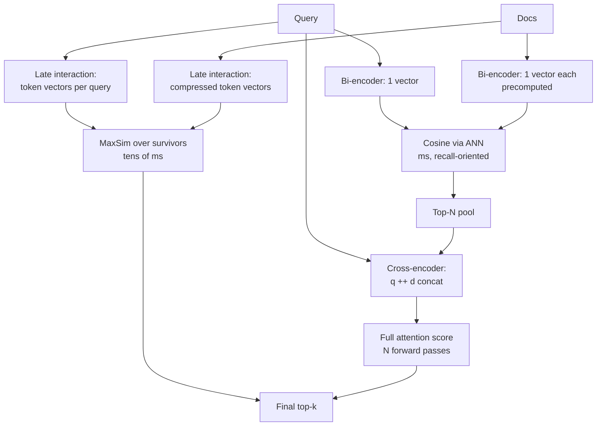

# Rerankers: Deep Dive

## Overview

A reranker is the quality dial of the retrieval pipeline: it reorders a candidate pool with a more expensive model than the one that generated the pool. This page goes inside the three scoring architectures (bi-encoder, cross-encoder, late interaction), the distilled production models built on them, the latency and throughput budgets that constrain window size, and the measured end-to-end gains that justify the spend. The basic bi-vs-cross-encoder comparison lives in [Advanced RAG Systems](../advanced/rag-advanced.md) and the fusion/recall-ceiling context in [Reranking and Hybrid Fusion](../../search/reranking.md); this page assumes both and goes deeper on mechanics, models, and money.

## The Three Scoring Architectures

Every relevance model answers the same question — how similar are query \\( q \\) and document \\( d \\) — with a different interaction budget between their tokens.

**Bi-encoder (embed-then-compare).** Query and document pass through the encoder *independently*; the score is cosine (or dot) between the two vectors. Precompute document vectors at index time and the query cost is one encoding plus an ANN lookup — this is why bi-encoders are the standard first-stage. The cost of independence: no query term can sharpen a document term. "Java thread pool sizing" and "coffee thread pool" produce similar document vectors if both discuss pools.

**Cross-encoder (joint attention).** Query and document are concatenated and run *together* through a transformer; every query token attends to every document token, and a classification head emits one relevance score. Full interaction is why cross-encoders dominate zero-shot benchmarks (the BEIR conclusion), and why they cannot be precomputed: the transformer pass is per (query, document) pair at query time. A 110M-parameter cross-encoder over 100 pairs costs 100 forward passes of ~200 tokens each — milliseconds batched on a GPU, hundreds of milliseconds on CPU.

**Late interaction (ColBERT family).** Encode query and document separately (so documents precompute), but keep *token-level* vectors and let tokens interact at scoring time via MaxSim:

\\[ \mathrm{score}(q,d) = \sum_{i=1}^{|q|} \max_{j \in d} \; \langle E_q(t_i), E_d(t_j) \rangle \\]

Each query token finds its best-matching document token; the sum rewards documents where *every* query term finds support. This preserves much of the cross-encoder's quality while keeping document encoding offline. ColBERT (Khattab & Zaharia, SIGIR 2020) also appends query-marker "[MASK]" tokens to queries — punctuation-agnostic query augmentation that lets the model emphasize query terms. ColBERTv2 (Santhanam et al., NAACL 2022) made storage practical: token vectors are compressed via *residual quantization* against a centroid set, cutting storage roughly 6-10× versus ColBERT v1's 32-bit token vectors (the paper reports ~36× fewer bits per token than vanilla float storage) with negligible quality loss. PLAID (Santhanam et al., CIKM 2022) made query time practical: candidate generation over compressed centroid representations, then careful pruning so full-resolution MaxSim is computed only for survivors — latencies in the tens of milliseconds at MS MARCO scale on CPU-class hardware.

| Property | Bi-encoder | Late interaction (ColBERTv2/PLAID) | Cross-encoder |
|---|---|---|---|
| Token interaction | none | query→doc max (asymmetric) | full attention |
| Document precomputation | yes (1 vector) | yes (token vectors, compressed) | no |
| Query-time cost | ANN lookup, ms | centroid pruning + MaxSim, tens of ms | N transformer passes, 10-100+ ms batched |
| Storage | 1 vector × 384-1024 dims | token vectors × doc length (compressed ~2-4 bytes/token) | nothing (stateless) |
| Quality ceiling | good | near cross-encoder | best |
| Interpretability | none | token alignment (which doc term matched) | attention maps (partial) |



## The MaxSim Calculation, Concretely

Late interaction is best understood with numbers. Query "refund window EU" produces 5 query-token vectors; a candidate document produces 60 token vectors. For each query token, compute cosine against all 60 document tokens and keep the maximum; sum the five maxima. A document that says "refunds ... 30 days ... European Union" will produce high maxima for `refund`, `window`≈`days`, `EU`≈`European` — a strong score even though "window" never literally appears, because the *token vectors are contextual* (encoded with the full passage). This is the mechanism behind late interaction's quality: term-level grounding plus contextuality, without joint attention. The cost is the \\( O(|q| \times |d|) \\) similarity matrix per pair, mitigated by PLAID's centroid pruning: with 32 query tokens and candidate pruning to a few dozen documents, full MaxSim runs on only the survivors.

ColBERTv2's storage trick matters as much as the scoring: instead of storing each 128-dim float token vector (512 bytes), it stores a 1-2 byte centroid ID plus a low-bit quantized residual — the paper reports ~36× compression versus uncompressed with no measurable loss on MS MARCO. That is what makes late interaction indexable at production scale, and PLAID's engine implementation is the reference (stanford-futuredata/ColBERT repo ships both).

## Distilled and Production Rerankers

Production rarely runs raw BERT rerankers; it runs distilled models that keep most of the quality at a fraction of the cost:

| Model | Architecture | Size | Latency profile | Notes |
|---|---|---|---|---|
| `cross-encoder/ms-marco-MiniLM-L-6-v2` | Distilled cross-encoder (MiniLM) | ~22M params | ~1-3 ms/pair CPU-class, batched | The workhorse of self-hosted stacks; MS MARCO-supervised |
| BAAI `bge-reranker-v2-m3` | Cross-encoder on XLM-RoBERTa | ~568M | GPU-realistic; multilingual | Part of the BGE family; strong multilingual + long-input |
| Cohere Rerank 3.5 | Proprietary cross-encoder (API) | n/a | API, ~tens of ms/pair batched | Multilingual, ranked top of BEIR-style evals on release; per-use pricing |
| Jina reranker v2 | Cross-encoder, base-multilingual | ~161M | GPU or fast CPU | Handles code and function-call text, 8K context |
| Voyage `rerank-2` | Proprietary (API) | n/a | API | Context up to 16K; rerank + zero-shot modes |
| RankGPT (LLM listwise) | Instruction-tuned LLM ranks a window | 7B-70B+ | 1 LLM call per window (seconds) | Sliding-window listwise ranking; quality near monoT5-3B on TREC DL at much higher cost |

The distillation pattern is uniform: a large teacher (cross-encoder or LLM) scores pairs; a small student trains to match margin/logit targets; hard negatives from stage-1 retrieval sharpen the boundary. MiniLM (Wang et al., 2020) established the self-attention distillation used across these models; the BGE and Jina families add multilingual supervision and longer inputs. Selection logic in practice: self-hosted and latency-critical → MiniLM-class first, BGE-v2-m3 if multilingual or quality-critical; API-acceptable → Cohere/Voyage for the quality-per-ops-dollar and zero model ops; offline or non-latency-critical → LLM listwise.

A compact selection rubric for the table above:

| Your constraint | Reach for | Why |
|---|---|---|
| p95 < 50 ms, on-prem, English-ish | MiniLM-class cross-encoder, N=100+ on GPU | Cheapest per pair; depth beats model size |
| Multilingual or long inputs, on-prem | bge-reranker-v2-m3 / jina-reranker-v2 | XLM-R lineage + 8K-class context |
| Strict SLO, no GPU ops appetite | Cohere Rerank / Voyage API | Quality without a model fleet; watch the RTT tail |
| Quality-critical, batch/offline | LLM listwise (RankGPT-style) | Seconds per window are affordable offline |
| High-QPS rerank at scale | Late interaction (ColBERTv2/PLAID) | Precomputed token vectors, cheap MaxSim scoring |
| Need per-pair threshold (not just order) | Any cross-encoder + your calibration layer | Scores need calibrating before business logic |

## Training Objectives: Pointwise, Pairwise, Listwise

Rerankers are trained under three supervision shapes, and the shape explains both quality and calibration behavior:

- **Pointwise.** Each pair gets a relevance label (binary or graded); the model trains as a classifier/regressor. Simple, but it ignores that ranking is comparative, and raw scores are poorly calibrated across queries — fine for ordering, wrong for thresholds.
- **Pairwise.** For a query, the model trains on document *preferences* (RankNet-style: penalize inversions of the pair ordering). Captures "A should outrank B" directly; ignores position within the whole list.
- **Listwise.** Optimize a list-level surrogate (ListNet/ListMLE, or in modern practice **margin-MSE distillation**: the student matches the teacher's *score margins* between document pairs, transferring the teacher's ranking geometry rather than absolute scores). This is what most production distillers use, and it is why distilled students order like their teachers while being 10-30× smaller.

The practical consequence interviewers probe: **cross-encoder scores are ordering signals, not probabilities**. A 0.87 from one query and a 0.87 from another are not comparable — never build business logic on absolute rerank scores ("drop results below 0.5") without calibrating on your own labels; use per-query relative scores or a post-hoc calibrated transform.

## Workbench: Pair-Cost Arithmetic

The whole budget section reduces to one multiplication. A sanity model (deterministic) makes the trade-offs explicit:

```text
assumptions: pairs N, per-pair cost c (batched), stage budget B

MiniLM 6-layer on GPU:  c ≈ 0.2 ms   → B=120 ms allows N=600 (pool effectively unconstrained)
MiniLM 6-layer on CPU:  c ≈ 3.0 ms   → B=120 ms allows N=40   (depth-starved: raise B or go GPU)
BGE-v2-m3 on GPU:       c ≈ 1.5 ms   → B=120 ms allows N=80   (quality per pair high; depth limited)
Cohere API (incl RTT):  c ≈ 1.5 ms   → B=120 ms allows N≈80, but p99 dominated by network tail
LLM listwise:           c ≈ 1500 ms  → B=120 ms allows N=0    (different SLO class entirely)

marginal-gain check on a real pool:
  recall@50 = 0.71, recall@100 = 0.84, recall@200 = 0.88, recall@400 = 0.89
  → deepening 100→200 buys +4 pts of ceiling for 2× compute; 200→400 buys +1 pt
  → the correct spend at B=120 ms: N=200 with the cheapest model that fits, not N=50 with the best
```

The last block is the interview climax: reranker model choice is *second-order*; window depth against the measured recall curve is *first-order*. The recall@N curve is measured on the golden set with the deployed stage-1, and it decays — the marginal points are always at the tail.

## Online Quality Signals

Offline golden sets go stale; production signals keep the reranker honest between eval runs:

- **Position-biased clicks.** Raw CTR on ranked results is dominated by position; use it only with position debiasing (models or interleaving) — otherwise the reranker "improves" by moving things to position 1.
- **Clicks on lower ranks.** A click on rank 6 is evidence the top-5 were wrong — a direct, if sparse, reranker quality signal.
- **Reformulation rate.** Users who search again within a session are measuring your stage-1 pool; track it per experiment arm.
- **Fallback rate.** The share of queries where the rerank stage timed out and stage-1 order shipped — an SLO for the reranker, and a quality drag that must be visible.
- **Grounding failures downstream.** If the generator cites chunks the reranker ranked 15th, the window may be too shallow — join citation positions with rerank positions in observability (see [Agent Observability](../agentic/agent-observability.md) for the instrumentation patterns).

## Latency and Throughput Budgets

The rerank budget is arithmetic, not vibes. Define the window N (pairs scored) and the model's per-pair cost:

| Setup | Per-pair cost | N=50 | N=100 | N=200 |
|---|---|---|---|---|
| MiniLM-class, CPU, batched | ~2-4 ms | 100-200 ms | 200-400 ms | 0.4-0.8 s |
| MiniLM-class, GPU, batched | ~0.1-0.3 ms | 5-15 ms | 10-30 ms | 20-60 ms |
| BGE-v2-m3 (568M), GPU, batched | ~1-2 ms | 50-100 ms | 0.1-0.2 s | 0.2-0.4 s |
| Cohere Rerank (API) | ~0.5-2 ms + network | 50-150 ms | 100-250 ms | 0.2-0.5 s |
| LLM listwise (one window call) | 0.5-3 s/call | 0.5-3 s | 1-6 s (2 windows) | 2-9 s |

Rules that fall out of the arithmetic:

- **Batching is everything on GPU.** 100 pairs as one padded batch is ~10× cheaper than 100 sequential calls; the window N is simultaneously a quality dial and a batch-shape decision.
- **The window, not the model, dominates at fixed latency.** Going from N=100 to N=50 with the same model halves cost; going from a 22M to a 568M model at fixed N=100 costs 5-10×. Buy window depth before model size when recall@N is the binding constraint (the ceiling argument in [Reranking and Hybrid Fusion](../../search/reranking.md#the-recall-ceiling)).
- **Budget at p95.** A reranker that takes 30 ms at p50 and 300 ms at p99 will dominate your retrieval SLO; timeouts and a fallback order (return stage-1 ranking) are mandatory engineering, not nice-to-haves.
- **Parallelize across queries, not within.** Within a query, pairs are batched; across queries, replicas scale. Autoscaling on queue depth of the rerank stage is the standard pattern (see [Inference Systems](../advanced/inference-systems.md) for the serving side).

## Self-Hosted vs API Rerankers: The Full Ledger

The build-vs-buy decision for rerankers has more rows than model quality, and interviews increasingly ask for the full ledger:

| Factor | Self-hosted (MiniLM / BGE / Jina) | API (Cohere / Voyage) |
|---|---|---|
| Quality ceiling | Good; BGE-v2-m3-class is near-API | Top-tier on release; strong multilingual |
| p95 predictability | Bounded by your hardware; tail controllable | Network RTT tail; vendor incidents become your incidents |
| Cost shape | Fixed GPU, amortized across QPS | Linear per query; volume discounts |
| Data boundary | Text stays in your VPC | Candidate text leaves the boundary (compliance review needed) |
| Model drift | You control upgrades, gated by your eval | Vendor can change behavior under the same endpoint |
| Multilingual coverage | Depends on checkpoint choice | Usually broad and vendor-benchmarked |
| Scaling story | Replicas + autoscaler you operate | Vendor's problem, your rate limits |

The cost crossover matters: at low QPS the API is cheaper (no idle GPU); at high QPS a self-hosted GPU running batched MiniLM-class models amortizes to fractions of a cent per 1K pairs and the API's per-use pricing inverts. The non-functional rows usually decide first, though: data residency rules out APIs in some deployments, and p95 predictability rules them out at strict SLOs. Teams that need both run the self-hosted model on the interactive path and the API on batch/eval paths where its quality accelerates labeling ([RAG Evaluation](./rag-evaluation.md) uses exactly this split).

A minimal batched reranking loop, with the two engineering details that matter (batching, and the fallback path):

```python
def rerank(query, pool, model, batch_size=64, timeout_s=0.4, k=10):
    pairs = [(query, d.text) for d in pool]               # dedup upstream
    scores = []
    try:
        for i in range(0, len(pairs), batch_size):
            scores.extend(model.predict(pairs[i:i + batch_size]))  # one forward per batch
    except StageTimeout:
        return stage1_order(pool)[:k], fallback=True       # never block the query
    ranked = sorted(zip(scores, pool), key=lambda t: -t[0])
    return [d for _, d in ranked[:k]], fallback=False
```

## Rerank Placement in the Pipeline

The canonical placement: **retrieve deep (100-1000) → fuse → rerank shallow (to 10-50) → generate**. Three placement decisions carry real consequences:

1. **Before vs after query transformation.** Rewriting/decomposing the query before retrieval changes the pool; reranking happens after fusion on the final pool. Running the reranker per sub-query multiplies cost by the number of sub-queries — usually reserved for agentic paths where each hop's results feed the next ([Agentic RAG](./agentic-rag.md)).
2. **Two-stage vs three-stage.** A cheap bi-encoder → expensive cross-encoder is two-stage. Three-stage adds late interaction in the middle: ANN top-1000 → ColBERT-style MaxSim top-100 → cross-encoder top-10. The middle stage prunes the cross-encoder's batch 10× for a few milliseconds — worthwhile at scale or when the cross-encoder is an expensive API.
3. **Rerank before or after context assembly.** For parent-document retrieval, rerank children but assemble parents; for long documents, rerank passages then merge. Reranking *after* assembly (scoring whole assembled contexts) is the "rank-then-reread" variant used when the generator context is one large bundle — see [Long Context vs RAG](./long-context-vs-rag.md).

The reranker also changes *what k should be* at each boundary: with a reranker present, raise stage-1 depth (it is cheap and raises the ceiling) and lower final k (the reranker makes the top slots trustworthy, and fewer, better chunks beat more, noisier ones in the prompt — a lost-in-the-middle effect measured in [Long Context vs RAG](./long-context-vs-rag.md)).

One placement anti-pattern deserves its own paragraph: **reranking inside the agent loop by default**. When an agentic controller issues three sub-queries, reranking each sub-pool triples pair cost while the controller has not yet decided which hop matters; the economical order is retrieve-wide per hop, fuse the hops, rerank once on the merged pool. Per-hop reranking earns its cost only when hop outputs feed the next hop's retrieval formulation — the Self-RAG/FLARE patterns in [Agentic RAG](./agentic-rag.md) — where the reranked top-1 is literally the conditioning signal for the next step.

## Measured End-to-End Gains

Published reference numbers on standard benchmarks (MS MARCO passage dev MRR@10; BEIR average nDCG@10) to calibrate expectations:

| System | MS MARCO MRR@10 | BEIR nDCG@10 (zero-shot) | Source |
|---|---|---|---|
| BM25 | ~18.4 | ~0.43 avg | BEIR paper baseline |
| SPLADE++ | ~38.3 | ~0.50 | SPLADE v2 paper |
| ColBERTv2 | ~39.7 | ~0.51 (55.9 on subsets varies) | ColBERTv2 paper |
| monoBERT (BERT-base rerank) | ~38-39 | ~0.49 avg | Nogueira & Cho lineage |
| monoT5-3B / RankT5 class | ~40+ | ~0.52+ | T5 reranker lineage |
| RankGPT (gpt-3.5/4 listwise) | ~40-43 (on subsets) | ~0.53 on TREC DL | RankGPT paper |

Three readings interviewers reward. First, **the reranker delta is largest exactly where stage-1 is weakest**: BM25 → monoBERT on MS MARCO roughly doubles MRR@10 (+~20 points), while SPLADE → cross-encoder adds single digits — a strong first stage shrinks the reranker's remaining headroom. Second, **zero-shot gains transfer unevenly**: BEIR's per-dataset spread is wide (rerankers win big on some datasets, lose on others), so benchmark averages must be validated on your golden set ([RAG Evaluation](./rag-evaluation.md)). Third, **end-to-end answer quality moves less than ranking metrics**: going from nDCG@10 0.45 to 0.55 might move faithfulness or answer relevance a few points, because generation can sometimes compensate — but only when the answer was *in* the pool, which is why the recall ceiling still binds.

A defensible production claim format: "switching from MiniLM cross-encoder to Cohere Rerank 3.5 on our 2,000-query golden set moved nDCG@10 from 0.48 to 0.53 (+5 points), answer-grounding failures down 18%, at +40 ms p95 and +$X per 1K queries." Absolute numbers from papers set the plausible range; your numbers are the ones that matter.

## Pitfalls

1. **Reranking before the pool is deduplicated.** Scoring the same chunk twice (reached via two retrievers) wastes half the window; dedupe on chunk ID before the reranker.
2. **Fixed window, variable query length.** Long queries blow past pair-length limits and silently truncate documents; enforce token budgets per pair and fall back to stage-1 order for oversized pairs.
3. **Judging the reranker on end-to-end only.** A generator can mask ranking improvements; measure reranked nDCG@10 against labels, then end-to-end, or the reranker gets credit/blame for the LLM's weather.
4. **No timeout / fallback on the rerank stage.** The reranker is on the synchronous path; when it stalls, the whole query stalls. Set a stage timeout, return stage-1 order on breach, alert on fallback rate.
5. **Upgrading the reranker without re-tuning k.** A better reranker licenses a *deeper* stage-1 pool and a *smaller* final k; teams that swap the model and leave both constant capture a fraction of the available gain.

## Interview Questions

1. **Why is a cross-encoder more accurate than a bi-encoder, and why can't you index it?** A bi-encoder compresses query and document into single vectors *independently*, so no query token can sharpen its interaction with document tokens — the comparison is one cosine between two summaries. A cross-encoder concatenates (query, document) and runs full self-attention, letting every query token condition on every document token; that joint interaction is what captures phrase relevance, negation, and constraint matching. The cost is structural: the transformer pass happens per (query, document) pair at query time, so nothing about the document can be precomputed — indexing would mean precomputing scores for all possible queries. Hence the two-stage pattern: cheap recall-oriented candidate generation, expensive precise reranking of the top 50-200.
2. **Explain ColBERT's MaxSim and what ColBERTv2 changed.** ColBERT encodes query and document into token-level vectors separately; the score sums, over each query token, the maximum cosine similarity against all document tokens — every query term must find support somewhere in the document. Because document token vectors are precomputed, it sits between bi- and cross-encoders: near cross-encoder quality, bi-encoder-style indexability, at \\( O(|q| \times |d|) \\) scoring cost per pair. ColBERTv2's contribution was storage: token vectors compressed via residual quantization against learned centroids (~36× fewer bits per token) with negligible quality loss, and PLAID then added centroid-based candidate pruning at query time so full-resolution MaxSim runs only on survivors — tens of milliseconds at benchmark scale.
3. **You have a 150 ms budget for retrieval+rerank. How do you allocate it?** Give stage-1 (ANN + BM25 + fusion) 10-30 ms — it is cheap and sets the recall ceiling. That leaves ~120 ms for reranking: with a batched MiniLM-class model on GPU (~0.1-0.3 ms/pair) you can afford N=200-300 pairs; with BGE-v2-m3 (~1-2 ms/pair) N=50-80; with a rerank API, N=50-100 plus network margin. Decide by marginal value: measure recall@N of the pool — if recall@100 ≈ recall@300, the extra depth is wasted and a bigger model at N=50 wins; if recall@300 ≫ recall@100, buy depth with the smaller model. Always add a stage timeout with fallback to stage-1 order, and track the p99 of the rerank stage, not the p50.
4. **When would you deploy late interaction instead of a cross-encoder reranker?** When the workload is rerank-shaped at high QPS or storage-cheap-ish documents: late interaction gives most of the cross-encoder's quality at a fraction of the query-time cost because document token vectors precompute and scoring is cheap matrix work rather than a transformer pass. Typical triggers: rerank windows above ~500 pairs (a cross-encoder batch gets expensive), CPU-only serving where a 568M cross-encoder is impractical, and use cases that want token-alignment interpretability (showing which document terms matched which query terms). Triggers for a plain cross-encoder instead: tiny windows (20-50 pairs), very long documents (token-vector storage dominates), or when an API reranker's quality per ops-dollar wins.
5. **The team proposes replacing your MiniLM reranker with an LLM that re-scores candidates. Argue both sides.** For: LLM listwise ranking (RankGPT-style) shows top-tier benchmark quality, needs no training infrastructure, and can follow task-specific instructions ("prioritize pages with pricing tables") that a fixed cross-encoder cannot. Against: cost and latency are 10-100× worse (one LLM call per window, seconds at p95), quality is prompt-sensitive and less predictable across model updates, and the win over a good distilled cross-encoder on in-domain data is usually small — the published RankGPT deltas are against generic baselines, not against Cohere-Voyage-class rerankers tuned on MS MARCO-scale supervision. The synthesis most teams reach: LLM reranking for offline/batch or low-QPS high-value paths, distilled cross-encoders on the interactive path.
6. **How do you prove the reranker is worth its cost to a skeptic?** Run the ablation on the golden set with everything else frozen: stage-1 pool → (a) stage-1 order to the LLM, (b) reranked order. Report three numbers: ranking nDCG@10 delta, end-to-end answer-quality delta (faithfulness, answer relevance), and the cost line (ms p95 and $/1K queries). Then show the boundary analysis: gains concentrate on queries where the answer was in the pool but misranked — measure that stratum's share, because it is the reranker's total addressable market. If the share is small, the money belongs in recall (fusion, chunking, embeddings) instead; the recall-ceiling framing turns a model-choice debate into a measured allocation decision.

## Key Takeaways

- Three architectures trade interaction for cost: bi-encoder (none, indexable), late interaction (token-level MaxSim, precomputed tokens), cross-encoder (full attention, per-pair query-time cost) — production pipelines use all three in stages.
- ColBERTv2's residual quantization (~36× compression) and PLAID's centroid pruning are what made late interaction production-viable: near cross-encoder quality at tens of milliseconds.
- The window N is the primary dial: buy pool depth before model size when recall@N is binding, and batch pairs on GPU where per-pair cost drops ~10×.
- Reranker gains are largest where stage-1 is weakest: BM25→monoBERT roughly doubles MS MARCO MRR@10 (~18→~38), while strong-encoder→cross-encoder adds single digits.
- Canonical placement: deep retrieve (100-1000) → fuse → rerank shallow (10-50) → generate; a better reranker licenses deeper pools and smaller final k.
- Always budget the rerank stage at p95 with a timeout and stage-1 fallback; it is on the synchronous path and will eventually stall.
- Validate benchmark gains on your own golden set — BEIR averages hide wide per-dataset variance, and end-to-end answer movement is smaller than ranking movement.

## References

- O. Khattab, M. Zaharia, "ColBERT: Efficient and Effective Passage Search via Contextualized Late Interaction over BERT", SIGIR 2020 — <https://arxiv.org/abs/2004.12832>
- A. Santhanam et al., "ColBERTv2: Effective and Efficient Retrieval via Lightweight Late Interaction", NAACL 2022 — <https://arxiv.org/abs/2112.01488>
- A. Santhanam et al., "PLAID: An Efficient Engine for Late Interaction Retrieval", CIKM 2022 — <https://arxiv.org/abs/2205.09707>
- R. Nogueira, K. Cho, "Passage Re-ranking with BERT" (monoBERT), 2019 — <https://arxiv.org/abs/1901.04085>
- W. Sun et al., "Is ChatGPT Good at Search? Investigating Large Language Models as Re-Ranking Agents" (RankGPT), EMNLP 2023 — <https://arxiv.org/abs/2304.09542>
- N. Reimers, I. Gurevych, "Sentence-BERT: Sentence Embeddings using Siamese BERT-Networks", EMNLP 2019 — <https://arxiv.org/abs/1908.10084>
- W. Wang et al., "MiniLM: Deep Self-Attention Distillation for Task-Agnostic Compression of Pre-Trained Transformers", NeurIPS 2020 — <https://arxiv.org/abs/2002.10957>
- N. Thakur et al., "BEIR: A Heterogeneous Benchmark for Zero-shot Evaluation of Information Retrieval Models", NeurIPS Datasets 2021 — <https://arxiv.org/abs/2104.08663>
- P. Bajaj et al., "MS MARCO: A Human Generated MAchine Reading COmprehension Dataset", 2016 — <https://arxiv.org/abs/1611.09268>
- Cohere Documentation, "Rerank" (Rerank 3.5) — <https://docs.cohere.com/docs/rerank>
- BAAI, bge-reranker-v2-m3 model card — <https://huggingface.co/BAAI/bge-reranker-v2-m3>
- Jina AI, jina-reranker-v2-base-multilingual model card — <https://huggingface.co/jinaai/jina-reranker-v2-base-multilingual>
- Stanford Future Data, ColBERT/PLAID reference implementation — <https://github.com/stanford-futuredata/ColBERT>
- Voyage AI Documentation, "Reranker" — <https://docs.voyageai.com/docs/reranker>
- Sentence Transformers Documentation, CrossEncoder usage and pretrained models — <https://www.sbert.net/>

## Cross-References

- [Reranking and Hybrid Fusion](../../search/reranking.md) — fusion math, recall ceiling, and where the reranker sits
- [Advanced RAG Systems](../advanced/rag-advanced.md) — the bi/cross-encoder table and ANN context this page builds on
- [Hybrid Search and Fusion](./hybrid-search-fusion.md) — the candidate generation feeding the reranker
- [Agentic RAG](./agentic-rag.md) — per-hop reranking in multi-step retrieval loops
- [RAG Evaluation](./rag-evaluation.md) — golden sets and CI gates for reranker upgrades
- [Inference Systems](../advanced/inference-systems.md) — serving the reranker as a model endpoint
- [HNSW](../../search/hnsw.md) — the ANN stage whose pool the reranker consumes
