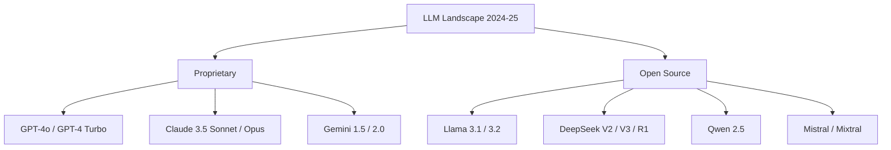

# State-of-the-Art LLMs (2024-2025)

## Overview

The LLM landscape evolves rapidly. This section covers the most important state-of-the-art models as of 2024-2025, their architectures, key innovations, and how they compare. Understanding these models is essential for ML interviews, as interviewers expect familiarity with current capabilities and trade-offs.

## Model Landscape

## Key Comparison Dimensions

| Dimension | What to Compare |
|-----------|----------------|
| Architecture | Dense vs MoE, context length, parameter count |
| Training | Pre-training data, RLHF/DPO, reasoning training |
| Capabilities | Coding, math, reasoning, multimodal |
| Performance | Benchmarks (MMLU, HumanEval, MATH) |
| Efficiency | Inference cost, latency, tokens/second |
| Access | API-only vs open-weights vs open-source |

## Benchmark Overview

| Model | MMLU | HumanEval | MATH | Context |
|-------|------|-----------|------|---------|
| GPT-4o | ~88% | ~90% | ~76% | 128K |
| Claude 3.5 Sonnet | ~88% | ~92% | ~71% | 200K |
| Gemini 1.5 Pro | ~86% | ~84% | ~67% | 2M |
| Llama 3.1 405B | ~87% | ~89% | ~73% | 128K |
| DeepSeek V3 | ~88% | ~82% | ~75% | 128K |
| Qwen 2.5 72B | ~86% | ~86% | ~68% | 128K |

*Note: Benchmarks change rapidly; these are approximate as of early 2025.*

## Interview Questions

1. **Compare GPT-4, Claude, and Gemini** — All are frontier proprietary models. GPT-4: strong general capabilities. Claude: strong coding, long context, safety. Gemini: multimodal, extremely long context (2M tokens).

2. **What is the difference between open-source and open-weights?** — Open-weights: model weights are public (Llama, Mistral). Open-source: weights + training code + data are public (some smaller models). Most "open-source" LLMs are actually open-weights.

3. **How do you choose an LLM for a task?** — Consider: task complexity, latency requirements, cost budget, context length needs, fine-tuning requirements, and data privacy constraints.

## Summary

The LLM landscape is dominated by a few frontier proprietary models (GPT-4, Claude, Gemini) and rapidly improving open-source alternatives (Llama, DeepSeek, Qwen, Mistral). Key differentiators include architecture choices (dense vs MoE), training methodology, context length, and multimodal capabilities.

## Cross-References

- [LLM Architecture](../llm-serving/architecture.md) — Transformer fundamentals
- [LLM Inference](../llm-serving/inference.md) — Serving details
- [Mixture of Experts](../moe/README.md) — MoE architecture
- [Multimodal Models](../multimodal/README.md) — Vision-language models
