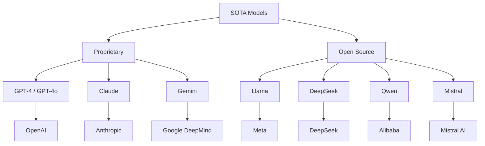

# State-of-the-Art Models

State-of-the-art (SOTA) models represent the current frontier of AI capabilities. This section covers the most influential large language models, their architectures, capabilities, and unique approaches.

## Overview



## Model Comparison

| Model | Org | Parameters | Context | Open | Multimodal | Key Strength |
|-------|-----|-----------|---------|------|------------|--------------|
| GPT-4o | OpenAI | ~1.8T (MoE) | 128K | No | Yes | Reasoning, multimodal |
| Claude 3.5 | Anthropic | Unknown | 200K | No | Yes | Long context, safety |
| Gemini 2 | Google | Unknown | 1M+ | No | Yes | Native multimodal |
| Llama 3.1 | Meta | 8B-405B | 128K | Yes | No | Open ecosystem |
| DeepSeek-V3 | DeepSeek | 671B MoE | 128K | Yes | No | Efficient MoE |
| Qwen 2.5 | Alibaba | 0.5B-72B | 128K | Yes | Partial | Multilingual |
| Mistral Large | Mistral | Unknown | 128K | Partial | No | Efficiency |

## Evolution Timeline

```
2020: GPT-3 (175B) - Scaling laws demonstrated
2022: ChatGPT - RLHF breakthrough
2023: GPT-4 - Multimodal, stronger reasoning
2023: Claude - Constitutional AI, long context
2023: Llama - Open-source LLMs
2023: Gemini - Natively multimodal
2024: Mixtral - Open-source MoE
2024: GPT-4o - Any-to-any multimodal
2024: DeepSeek-V3 - Efficient MoE
2024: Llama 3.1 - 405B open model
```

## Key Differentiators

### Proprietary Models
- Generally stronger performance
- Better safety alignment
- Expensive API access
- No weight access
- Rapid iteration cycles

### Open Source Models
- Free to use and modify
- Can run locally
- Customizable for specific needs
- Community contributions
- Rapid catching up to proprietary

## Interview Questions

1. **What are the main SOTA models?**
   GPT-4o (OpenAI), Claude (Anthropic), Gemini (Google), Llama (Meta), DeepSeek, Qwen (Alibaba), and Mistral. Each has different strengths in reasoning, multimodal, context length, or efficiency.

2. **What differentiates proprietary from open-source models?**
   Proprietary models are generally stronger but require API access. Open-source models can run locally, be customized, and are free, but may lag in capabilities.

3. **Which model is best for which use case?**
   GPT-4o: General purpose, multimodal. Claude: Long documents, safety-critical. Gemini: Video/audio, long context. Llama: Self-hosted, customization. DeepSeek: Efficient inference.

## Cross-References

- [GPT-4](gpt4.md) - OpenAI's flagship
- [Claude](claude.md) - Anthropic's approach
- [Gemini](gemini-sota.md) - Google's multimodal
- [Llama](llama.md) - Open-source leader
- [DeepSeek](deepseek.md) - MoE innovation
- [Qwen](qwen.md) - Multilingual focus
- [Mistral](mistral.md) - Efficiency focus
