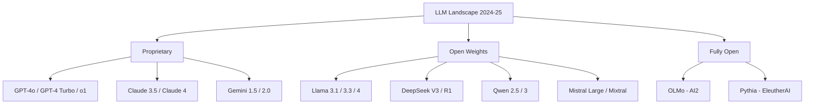
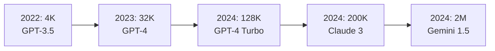
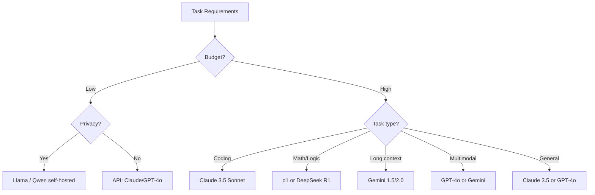

# State-of-the-Art LLMs (2024-2025)

## Overview

The LLM landscape evolves rapidly. This section covers the most important state-of-the-art models as of 2024-2025, their architectures, key innovations, and how they compare. Understanding these models is essential for ML interviews, as interviewers expect familiarity with current capabilities and trade-offs.

## Model Landscape

## Key Comparison Dimensions

| Dimension | What to Compare |
|-----------|----------------|
| Architecture | Dense vs MoE, context length, parameter count |
| Training | Pre-training data, RLHF/DPO, reasoning training |
| Capabilities | Coding, math, reasoning, multimodal |
| Performance | Benchmarks (MMLU, HumanEval, MATH, SWE-bench) |
| Efficiency | Inference cost, latency, tokens/second |
| Access | API-only vs open-weights vs fully open-source |

## Benchmark Overview

| Model | MMLU | HumanEval | MATH | Context | Architecture |
|-------|------|-----------|------|---------|--------------|
| GPT-4o | ~88% | ~90% | ~76% | 128K | Dense MoE (rumored) |
| GPT-o1 | ~92% | ~95% | ~94% | 200K | Dense + Chain-of-Thought |
| Claude 3.5 Sonnet | ~88% | ~92% | ~71% | 200K | Dense |
| Claude Opus 4 | ~91% | ~95% | ~88% | 200K | Dense |
| Gemini 1.5 Pro | ~86% | ~84% | ~67% | 2M | MoE |
| Gemini 2.0 | ~90% | ~90% | ~80% | 2M | MoE |
| Llama 3.1 405B | ~87% | ~89% | ~73% | 128K | Dense |
| DeepSeek V3 | ~88% | ~82% | ~75% | 128K | MoE (671B total, 37B active) |
| DeepSeek R1 | ~91% | ~94% | ~97% | 128K | MoE + RL reasoning |
| Qwen 2.5 72B | ~86% | ~86% | ~68% | 128K | Dense |

*Note: Benchmarks change rapidly; these are approximate as of early 2025.*

## Detailed Model Comparison

### Proprietary Models

#### GPT-4 Family (OpenAI)

- **GPT-4 Turbo**: 128K context, vision, function calling, JSON mode
- **GPT-4o**: "Omni" — native multimodal (text, audio, image, video), faster, cheaper
- **o1/o3**: Reasoning models — use chain-of-thought internally, excel at math/coding/logic
- **Key innovation**: Reasoning tokens (hidden thinking), tool use ecosystem

#### Claude Family (Anthropic)

- **Claude 3.5 Sonnet**: Best value, 200K context, strong coding
- **Claude Opus 4**: Most capable, extended thinking
- **Key innovation**: Constitutional AI (RLAIF), 200K context window, computer use

#### Gemini Family (Google)

- **Gemini 1.5 Pro**: 2M token context (longest), multimodal
- **Gemini 2.0 Flash**: Fast, efficient, agentic capabilities
- **Key innovation**: 2M context, native multimodal (text/image/audio/video), TPU training

### Open-Weights Models

#### Llama Family (Meta)

- **Llama 3.1**: 8B/70B/405B, 128K context, competitive with GPT-4
- **Llama 3.3**: Improved efficiency, better multilingual
- **Key innovation**: Largest open model (405B), extensive fine-tuning ecosystem

#### DeepSeek

- **DeepSeek V3**: 671B MoE (37B active), strong coding/math, cost-efficient training
- **DeepSeek R1**: RL-trained reasoning, competitive with o1 on math/code
- **Key innovation**: MoE efficiency, RL-based reasoning, surprisingly low training cost

#### Qwen (Alibaba)

- **Qwen 2.5**: 0.5B to 72B, strong multilingual (especially Chinese)
- **Qwen 3**: Enhanced reasoning, MoE variants
- **Key innovation**: Multilingual, long context, competitive at smaller sizes

#### Mistral

- **Mistral Large**: Dense, strong European language support
- **Mixtral 8x22B**: MoE, strong efficiency
- **Key innovation**: Sliding window attention, efficient MoE routing

---

## Architecture Patterns

### Dense vs Mixture of Experts (MoE)

| Aspect | Dense | MoE |
|--------|-------|-----|
| Parameters | All active | Only subset active |
| Memory | All weights in memory | All weights, but fewer FLOPs |
| Quality per FLOP | Lower | Higher |
| Examples | GPT-4 (possibly), Llama | DeepSeek V3, Mixtral, Gemini |

### Context Length Evolution

### Reasoning Models

A new paradigm where models "think" before answering:

| Model | Approach | Strength |
|-------|----------|----------|
| o1/o3 (OpenAI) | Hidden chain-of-thought | Math, coding, logic |
| DeepSeek R1 | RL-trained reasoning | Math, code, transparent thinking |
| Claude with Extended Thinking | Visible thinking | General reasoning |

---

## How to Choose an LLM

### Decision Factors

| Factor | Best Choice |
|--------|-------------|
| **Coding** | Claude 3.5 Sonnet, o1 |
| **Math/Reasoning** | o1, DeepSeek R1 |
| **Long context (>128K)** | Gemini 1.5/2.0 |
| **Multimodal** | GPT-4o, Gemini |
| **Cost efficiency** | DeepSeek V3, Llama 3.1 |
| **Self-hosting** | Llama 3.1, Qwen 2.5 |
| **Privacy** | Self-hosted open-weights |
| **Multilingual** | Qwen 2.5, Gemini |

---

## Interview Questions

1. **Compare GPT-4, Claude, and Gemini.**
   All are frontier proprietary models. GPT-4: strong general capabilities, best tool use ecosystem. Claude: strong coding, longest proven context (200K), Constitutional AI safety. Gemini: longest raw context (2M), native multimodal, TPU-trained. Choice depends on task requirements.

2. **What is the difference between open-source and open-weights?**
   Open-weights: model weights are public (Llama, Mistral). Open-source: weights + training code + data are public (OLMo, Pythia). Most "open-source" LLMs are actually open-weights — you get the model but not how to reproduce it.

3. **What is a Mixture of Experts model?**
   MoE models have many expert sub-networks but only activate a subset per token. DeepSeek V3 has 671B total parameters but only activates ~37B per token. This gives the quality of a large model at the compute cost of a smaller one. Key challenge: load balancing experts.

4. **How do reasoning models (o1, R1) differ from standard LLMs?**
   Standard LLMs generate tokens left-to-right. Reasoning models use chain-of-thought (visible or hidden "thinking") to work through problems step-by-step. Trained with RL on correctness. Much better at math, logic, and multi-step coding — but slower and more expensive.

5. **How do you choose an LLM for a production system?**
   Consider: (1) Task complexity and type, (2) Latency requirements, (3) Cost budget, (4) Context length needs, (5) Privacy/compliance requirements, (6) Fine-tuning needs, (7) Self-hosting vs API. Start with the best model for quality, then optimize for cost/latency if needed.

6. **Why did DeepSeek R1 make waves despite being from a smaller lab?**
   It demonstrated that RL-based reasoning could match o1-level performance at a fraction of the training cost. It challenged the assumption that only well-funded Western labs could build frontier reasoning models. Its open release enabled research into reasoning training methods.

## Summary

The LLM landscape is dominated by frontier proprietary models (GPT-4, Claude, Gemini) and rapidly improving open-weights alternatives (Llama, DeepSeek, Qwen, Mistral). Key differentiators include architecture choices (dense vs MoE), training methodology (RLHF vs Constitutional AI vs RL reasoning), context length, and multimodal capabilities. For interviews, be prepared to discuss trade-offs, choose models for specific use cases, and explain architectural innovations.

## Cross-References

- [LLM Architecture](../llm-serving/architecture.md) — Transformer fundamentals
- [LLM Inference](../llm-serving/inference.md) — Serving details
- [Mixture of Experts](../moe/README.md) — MoE architecture
- [Multimodal Models](../multimodal/README.md) — Vision-language models
- [GPT-4](./gpt4.md) — GPT-4 details
- [Claude](./claude.md) — Claude details
- [DeepSeek](./deepseek.md) — DeepSeek details

## References

- [GPT-4 Technical Report](https://arxiv.org/abs/2303.08774) — OpenAI
- [Claude 3 Technical Report](https://www.anthropic.com/research) — Anthropic
- [Gemini Technical Report](https://arxiv.org/abs/2312.11805) — Google
- [Llama 3 Technical Report](https://arxiv.org/abs/2407.21783) — Meta
- [DeepSeek V3 Technical Report](https://arxiv.org/abs/2412.19437) — DeepSeek
- [DeepSeek R1](https://arxiv.org/abs/2501.12948) — DeepSeek
- [Mixture of Experts Survey](https://arxiv.org/abs/2209.01716)
- [MMLU Benchmark](https://arxiv.org/abs/2009.03300)
- [LLM Leaderboard — LMSYS Chatbot Arena](https://chat.lmsys.org/)
