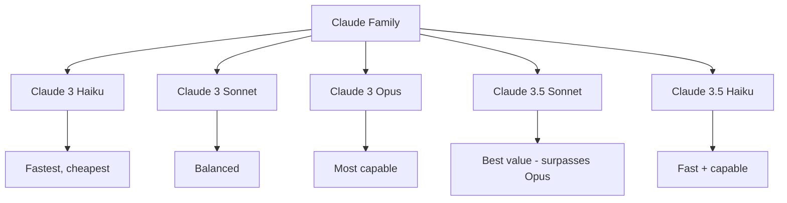

# Claude

## Overview

Claude is Anthropic's family of large language models, designed with a focus on safety, helpfulness, and honesty. The Claude 3 family (Haiku, Sonnet, Opus) and Claude 3.5 series offer competitive performance with GPT-4, with particular strengths in coding, long-context processing, and nuanced instruction following.

## Model Family

## Key Features

| Feature | Claude 3.5 Sonnet | Claude 3 Opus |
|---------|-------------------|---------------|
| Context | 200K tokens | 200K tokens |
| Coding | Best-in-class | Strong |
| Reasoning | Excellent | Excellent |
| Speed | Fast | Slower |
| Cost | $3/$15 per 1M tokens | $15/$75 per 1M tokens |

## Constitutional AI (CAI)

Claude's training uses Constitutional AI — a safety approach that uses a set of principles (constitution) rather than human feedback:

### How CAI Works

1. **Critique**: Model critiques its own responses against constitutional principles
2. **Revision**: Model revises responses based on critique
3. **RLAIF**: Train using AI-generated preferences (from the constitution) instead of human labels

## Strengths

- **Long context**: 200K tokens with strong retrieval
- **Coding**: Consistently top benchmarks (HumanEval, SWE-bench)
- **Instruction following**: Precise, nuanced adherence to complex instructions
- **Safety**: Designed to be helpful while avoiding harmful outputs
- **XML/structured output**: Excellent at structured formats

## Interview Questions

1. **What makes Claude different from GPT-4?** — Constitutional AI training (vs RLHF), 200K context window, stronger coding performance, and emphasis on safety. Claude tends to be more verbose and cautious.

2. **What is Constitutional AI?** — Training approach where the model critiques and revises its own outputs against a set of principles, then uses AI-generated preferences for RLHF. Reduces reliance on human labelers.

3. **Claude 3.5 Sonnet vs Claude 3 Opus?** — 3.5 Sonnet actually outperforms Opus on most benchmarks while being faster and cheaper. This demonstrates that newer, smaller models can surpass older, larger ones.

4. **How does Claude handle long context?** — 200K token context window with strong retrieval accuracy. Can process entire codebases or long documents in a single prompt.

5. **When would you choose Claude over GPT-4?** — Coding tasks, long document analysis, tasks requiring precise instruction following, and when safety/alignment is critical.

## Summary

Claude models are Anthropic's frontier LLMs, distinguished by Constitutional AI training, long context windows, and strong coding capabilities. Claude 3.5 Sonnet offers the best value, surpassing the larger Opus model. The focus on safety and nuanced instruction following makes Claude particularly suitable for enterprise applications.

## Cross-References

- [GPT-4](./gpt4.md) — Main competitor
- [LLM Architecture](../llm-serving/architecture.md) — Transformer fundamentals
- [RLHF](../llm-serving/rlhf.md) — Alignment training
- [LLM Serving](../llm-serving/inference.md) — Deployment
