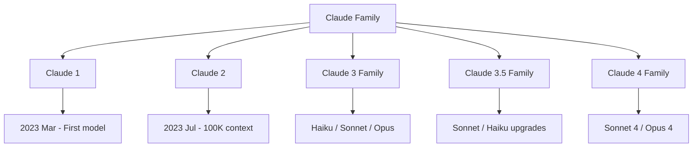
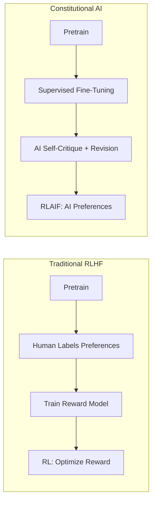

# Claude

## Overview

Claude is Anthropic's family of large language models, designed with a focus on safety, helpfulness, and honesty. The Claude family has evolved from Claude 1 through Claude 4, with each generation bringing significant improvements in capability, context length, and safety. Claude's distinguishing approach is Constitutional AI (CAI) — a training methodology that uses principles rather than human feedback to guide model behavior.

## Model Family



## Version History

| Version | Date | Context | Key Innovation |
|---------|------|---------|----------------|
| **Claude 1** | Mar 2023 | 9K | Constitutional AI training |
| **Claude 1.3** | Jul 2023 | 100K | First 100K context model |
| **Claude 2** | Jul 2023 | 100K | Improved coding, reasoning |
| **Claude 2.1** | Nov 2023 | 200K | Reduced hallucination, tool use |
| **Claude 3 Haiku** | Mar 2024 | 200K | Fast, cheap, efficient |
| **Claude 3 Sonnet** | Mar 2024 | 200K | Balanced speed/quality |
| **Claude 3 Opus** | Mar 2024 | 200K | Most capable (at the time) |
| **Claude 3.5 Sonnet** | Jun 2024 | 200K | Surpassed Opus, best value |
| **Claude 3.5 Haiku** | Oct 2024 | 200K | Near-Sonnet quality, fast |
| **Claude Sonnet 4** | 2025 | 200K | Extended thinking, improved coding |
| **Claude Opus 4** | 2025 | 200K | Frontier reasoning, extended thinking |

## Tier System

Claude uses a tiered approach: fast and cheap (Haiku), balanced (Sonnet), most capable (Opus).

| Tier | Speed | Cost | Best For |
|------|-------|------|----------|
| **Haiku** | Fastest | $0.25/$1.25 per 1M | High-volume, simple tasks |
| **Sonnet** | Fast | $3/$15 per 1M | Best value, most use cases |
| **Opus** | Slower | $15/$75 per 1M | Complex reasoning, research |

## Constitutional AI (CAI)

Claude's signature training method. Instead of relying primarily on human labelers for RLHF, CAI uses a set of written principles (a "constitution") to guide the model.

### Traditional RLHF vs CAI



### CAI Steps

1. **Generate**: Model produces responses to prompts
2. **Critique**: Model critiques its own response against constitutional principles
3. **Revise**: Model rewrites the response based on the critique
4. **RLAIF**: Train a preference model using AI-generated comparisons (response A vs revised response B)
5. **RL**: Optimize the policy against the AI preference model

### Constitutional Principles (Examples)

- "Choose the response that is most helpful and honest"
- "Choose the response that is least harmful or offensive"
- "Choose the response that is most respectful of human autonomy"
- "Choose the response that is least likely to be used for harmful purposes"

### Why CAI Matters

- **Scalable**: Doesn't require thousands of human labelers
- **Transparent**: Principles are written down and auditable
- **Iterable**: Can update the constitution to address new concerns
- **Consistent**: Principles apply uniformly across all training examples

## Key Capabilities

### Long Context

Claude supports 200K token context windows with strong retrieval accuracy. This enables:

- Processing entire codebases in a single prompt
- Analyzing long legal/medical documents
- Multi-document summarization
- Maintaining coherent conversations over many turns

### Coding

Claude consistently ranks among the top models for coding:

| Benchmark | Claude 3.5 Sonnet | GPT-4o |
|-----------|-------------------|--------|
| HumanEval | ~92% | ~90% |
| SWE-bench | ~49% | ~38% |
| MBPP | ~88% | ~86% |

**Strengths**: Code generation, debugging, refactoring, code review, explaining complex codebases.

### Computer Use

Claude can interact with computer interfaces — clicking, typing, navigating screens. This enables:

- Automating GUI-based workflows
- Testing applications
- Navigating websites
- Filling forms

### Extended Thinking

Claude 4 models support "extended thinking" — visible chain-of-thought reasoning before answering. This improves performance on:

- Complex math problems
- Multi-step logic puzzles
- Code architecture decisions
- Research analysis

## API Features

| Feature | Description |
|---------|-------------|
| **Messages API** | Chat-based interface with system prompts |
| **Tool Use** | Function calling with JSON schema definitions |
| **Vision** | Image understanding (charts, photos, screenshots) |
| **Streaming** | Server-sent events for real-time output |
| **Batch API** | Async batch processing at 50% cost |
| **Prompt Caching** | Cache repeated prefixes for 90% cost reduction |

### Tool Use Example

```json
{
  "name": "get_weather",
  "description": "Get current weather for a location",
  "input_schema": {
    "type": "object",
    "properties": {
      "location": {"type": "string", "description": "City name"},
      "units": {"type": "string", "enum": ["celsius", "fahrenheit"]}
    },
    "required": ["location"]
  }
}
```

Claude will output structured tool calls that your application executes and feeds back.

## Strengths and Weaknesses

### Strengths
- **Instruction following**: Precise adherence to complex, multi-constraint prompts
- **Coding**: Top-tier code generation and understanding
- **Long context**: Strong retrieval from 200K context
- **Safety**: Designed to be helpful while refusing harmful requests
- **Structured output**: Excellent at JSON, XML, and structured formats
- **Nuance**: Good at understanding ambiguity and edge cases

### Weaknesses
- **Verbosity**: Tends toward longer responses than necessary
- **Conservative refusal**: Sometimes refuses benign requests
- **No native image generation**: Text-only output
- **Smaller ecosystem**: Fewer integrations than OpenAI
- **Knowledge cutoff**: Less frequently updated than some competitors

## Interview Questions

1. **What is Constitutional AI and how does it differ from RLHF?**
   CAI uses a written set of principles (constitution) to guide training. The model critiques and revises its own outputs against these principles, then uses AI-generated preferences for RL (RLAIF). Traditional RLHF relies on human labelers to rank outputs. CAI is more scalable, transparent, and consistent.

2. **How does Claude 3.5 Sonnet compare to Claude 3 Opus?**
   3.5 Sonnet outperforms Opus on most benchmarks while being 5x cheaper and faster. This demonstrates that architectural improvements and better training can beat raw parameter count. It's a key lesson: newer smaller models often surpass older larger ones.

3. **What makes Claude good at coding?**
   Claude was trained with emphasis on code understanding and generation. It excels at: reading large codebases (200K context), understanding complex architectures, generating idiomatic code in many languages, debugging, and providing detailed code reviews. The SWE-bench score (~49%) shows strong real-world bug-fixing ability.

4. **How does Claude's 200K context work technically?**
   The context window supports 200K tokens (~150K words). Claude uses attention mechanisms that can efficiently process long sequences. Key metric: retrieval accuracy — how well the model can find and use specific information within the long context. Claude performs well on "needle in a haystack" tests.

5. **When would you choose Claude over GPT-4?**
   - Coding tasks (especially large codebase analysis)
   - Long document processing
   - Tasks requiring precise instruction following
   - Enterprise applications where safety/alignment matters
   - When you need structured output (JSON, XML)
   - When cost efficiency matters (Sonnet is very competitive)

6. **What is "computer use" in Claude?**
   Claude can interact with computer interfaces by taking screenshots, identifying UI elements, clicking, typing, and navigating. It's an early capability that enables GUI automation, testing, and workflow automation. Still experimental but represents a step toward AI agents that interact with software directly.

7. **How does prompt caching work in Claude?**
   If you send the same prefix (system prompt, long documents) across multiple requests, Claude caches it. Subsequent requests with the same prefix are 90% cheaper and faster. This is ideal for RAG systems where you embed the same document repeatedly with different questions.

## Summary

Claude models are Anthropic's frontier LLMs, distinguished by Constitutional AI training, 200K context windows, and strong coding capabilities. The tiered system (Haiku/Sonnet/Opus) provides flexibility across cost and capability needs. Claude 3.5 Sonnet's ability to surpass the larger Opus demonstrates that training improvements matter more than raw scale. Constitutional AI represents a principled, scalable approach to alignment that contrasts with traditional RLHF.

## Cross-References

- [GPT-4](./gpt4.md) — Main competitor
- [DeepSeek](./deepseek.md) — Open-source reasoning model
- [LLM Architecture](../llm-serving/architecture.md) — Transformer fundamentals
- [RLHF](../llm-serving/rlhf.md) — Alignment training
- [LLM Serving](../llm-serving/inference.md) — Deployment
- [Mixture of Experts](../moe/README.md) — MoE architecture
- [SOTA Models](./README.md) — Model comparison

## References

- [Anthropic Research](https://www.anthropic.com/research) — Official research publications
- [Constitutional AI: Harmlessness from AI Feedback](https://arxiv.org/abs/2212.08073) — Bai et al., 2022
- [Claude 3 Model Card](https://www.anthropic.com/claude) — Anthropic
- [Claude 3.5 Sonnet Announcement](https://www.anthropic.com/news/claude-3-5-sonnet) — Anthropic
- [The Claude Model Spec](https://www.anthropic.com/research/claude-model-spec) — Behavioral guidelines
- [SWE-bench Leaderboard](https://www.swebench.com/) — Coding benchmark
- [LMSYS Chatbot Arena](https://chat.lmsys.org/) — Human preference rankings
