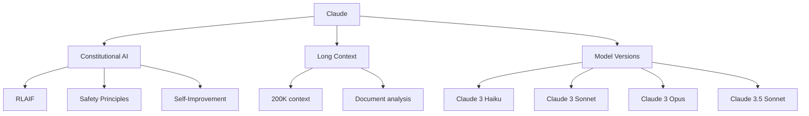

# Claude

Claude is Anthropic's AI assistant, designed with a focus on safety, helpfulness, and honesty. It uses Constitutional AI (CAI) for alignment and is known for strong reasoning, long context handling, and careful responses.

## Overview



## Constitutional AI (CAI)

### Core Concept

```python
# Traditional RLHF: Humans label outputs
# Constitutional AI: AI self-improves using principles

# CAI Process:
# 1. Supervised: Model generates responses
# 2. Self-critique: Model critiques own responses using constitution
# 3. Revision: Model revises based on critique
# 4. RLAIF: Train on AI-generated preferences

class ConstitutionalAI:
    def __init__(self):
        self.principles = [
            "Choose the response that is most helpful and honest",
            "Choose the response that is least harmful",
            "Choose the response that respects user autonomy",
            "Choose the response that is most truthful",
            "Choose the response that avoids bias",
            # ... more principles
        ]
    
    def critique(self, response):
        """AI critiques its own response using principles"""
        critique_prompt = f"""
        Consider this response: {response}
        
        According to the principle: "{self.principles[0]}"
        Does this response follow the principle? Why or why not?
        """
        return self.model.generate(critique_prompt)
    
    def revise(self, response, critique):
        """AI revises based on critique"""
        revision_prompt = f"""
        Original response: {response}
        Critique: {critique}
        
        Please revise the response to address the critique.
        """
        return self.model.generate(revision_prompt)
```

### RLAIF (RL from AI Feedback)

```python
# Instead of human labelers, use AI to generate preferences

def rlaif_training(model, prompt, response_a, response_b):
    """Train using AI-generated preferences"""
    
    # AI evaluates which response is better
    evaluation = model.generate(f"""
    Which response is better according to these principles:
    1. Helpful and honest
    2. Safe and harmless
    3. Respectful of autonomy
    
    Response A: {response_a}
    Response B: {response_b}
    
    Which is better? A or B?
    """)
    
    # Use preference for training
    if evaluation == "A":
        preferred, rejected = response_a, response_b
    else:
        preferred, rejected = response_b, response_a
    
    # Train with DPO or PPO
    loss = preference_loss(model, prompt, preferred, rejected)
    return loss
```

## Claude Model Family

### Claude 3 (March 2024)

| Model | Parameters | Speed | Context | Use Case |
|-------|-----------|-------|---------|----------|
| Haiku | Small | Fastest | 200K | High-volume, simple tasks |
| Sonnet | Medium | Balanced | 200K | General purpose |
| Opus | Large | Slowest | 200K | Complex reasoning |

### Claude 3.5 Sonnet (June 2024)

```python
# Claude 3.5 Sonnet: Best balance of capability and speed
# - Better than Claude 3 Opus on most benchmarks
# - Faster than Claude 3 Sonnet
# - 200K context window
# - Strong coding capabilities

benchmarks = {
    "MMLU": 88.7,
    "HumanEval": 92.0,  # Coding benchmark
    "GSM8K": 96.4,      # Math reasoning
    "GPQA": 59.4,       # Graduate-level QA
}
```

### Claude 3.5 Haiku & Opus

```python
# Claude 3.5 Haiku: Ultra-fast, efficient
# Claude 3.5 Opus: Most capable (upcoming)
```

## API Usage

### Basic Chat

```python
import anthropic

client = anthropic.Anthropic()

# Simple chat
message = client.messages.create(
    model="claude-3-5-sonnet-20241022",
    max_tokens=1024,
    messages=[
        {"role": "user", "content": "Explain quantum computing simply."}
    ]
)

print(message.content[0].text)
```

### Long Document Analysis

```python
# Claude excels at long document analysis
# 200K context = ~500 pages of text

def analyze_document(document_text, question):
    message = client.messages.create(
        model="claude-3-5-sonnet-20241022",
        max_tokens=4096,
        messages=[{
            "role": "user",
            "content": f"""
            Here is a document:
            
            <document>
            {document_text}
            </document>
            
            Please answer: {question}
            """
        }]
    )
    return message.content[0].text
```

### Tool Use (Function Calling)

```python
# Claude supports tool use
tools = [{
    "name": "get_weather",
    "description": "Get current weather for a location",
    "input_schema": {
        "type": "object",
        "properties": {
            "location": {"type": "string", "description": "City name"},
            "unit": {"type": "string", "enum": ["celsius", "fahrenheit"]}
        },
        "required": ["location"]
    }
}]

message = client.messages.create(
    model="claude-3-5-sonnet-20241022",
    max_tokens=1024,
    tools=tools,
    messages=[{
        "role": "user",
        "content": "What's the weather in Tokyo?"
    }]
)

# Parse tool call
for block in message.content:
    if block.type == "tool_use":
        print(f"Tool: {block.name}")
        print(f"Input: {block.input}")
```

### Vision

```python
# Claude can analyze images
import base64

def analyze_image(image_path, question):
    with open(image_path, "rb") as f:
        image_data = base64.standard_b64encode(f.read()).decode("utf-8")
    
    message = client.messages.create(
        model="claude-3-5-sonnet-20241022",
        max_tokens=1024,
        messages=[{
            "role": "user",
            "content": [
                {
                    "type": "image",
                    "source": {
                        "type": "base64",
                        "media_type": "image/jpeg",
                        "data": image_data
                    }
                },
                {
                    "type": "text",
                    "text": question
                }
            ]
        }]
    )
    return message.content[0].text
```

## Artifacts & Projects

### Artifacts

```python
# Claude can create interactive content
# - Code (HTML, React, Python)
# - Documents (Markdown, text)
# - Visualizations (SVG, Mermaid)
# - Interactive widgets

# Example: Claude generates HTML
prompt = "Create an interactive HTML page that shows a todo list app"
# Claude generates complete HTML/CSS/JS code
```

### Projects

```python
# Projects allow setting context for conversations
# - Upload documents as context
# - Set custom instructions
# - Share across conversations

# Useful for:
# - Codebases
# - Documentation
# - Style guides
# - Domain knowledge
```

## Strengths

### 1. Long Context Handling

```python
# 200K context window
# Can process:
# - Entire books
# - Long codebases
# - Legal documents
# - Research papers

# Strong "needle in a haystack" performance
# Maintains quality across full context
```

### 2. Reasoning

```python
# Claude excels at:
# - Multi-step reasoning
# - Mathematical proofs
# - Code analysis
# - Scientific reasoning
# - Legal analysis

# Often more careful and thorough than competitors
```

### 3. Safety

```python
# Constitutional AI makes Claude:
# - Less likely to generate harmful content
# - More honest about uncertainty
# - Better at refusing inappropriate requests
# - Less prone to hallucination (but still possible)
```

### 4. Coding

```python
# Claude 3.5 Sonnet: 92% on HumanEval
# Strong at:
# - Code generation
# - Code review
# - Debugging
# - Architecture design
# - Documentation
```

## Limitations

1. **No real-time knowledge:** Training data has cutoff
2. **No audio/video:** Text and images only (as of Claude 3.5)
3. **Conservative:** May refuse reasonable requests
4. **Cost:** Similar to GPT-4 for comparable models
5. **Availability:** May have rate limits during high demand

## Comparison with GPT-4

| Feature | Claude 3.5 Sonnet | GPT-4o |
|---------|-------------------|--------|
| Text Quality | Excellent | Excellent |
| Vision | Yes | Yes |
| Audio | No | Yes |
| Context | 200K | 128K |
| Coding | 92% HumanEval | 67% HumanEval |
| Safety | More conservative | Balanced |
| Speed | Fast | Fast |
| Price | Similar | Similar |

## Interview Questions

1. **What is Constitutional AI?**
   CAI is Anthropic's alignment approach where the AI self-improves using written principles (constitution). Instead of human labelers, the AI critiques and revises its own outputs, then trains on AI-generated preferences (RLAIF).

2. **How does Claude differ from GPT-4?**
   Claude uses Constitutional AI for alignment (vs RLHF), has longer context (200K vs 128K), is more safety-focused, and may be more careful in responses. GPT-4 has native audio capabilities.

3. **What is RLAIF?**
   Reinforcement Learning from AI Feedback. Instead of human preferences, AI generates preference labels using constitutional principles. More scalable than RLHF.

4. **What are Claude's strengths?**
   Long context handling, careful reasoning, safety, coding (92% HumanEval), and document analysis. Known for thorough, well-structured responses.

5. **How does Claude handle long documents?**
   With 200K context window, Claude can process entire books or codebases. It maintains strong performance across the full context length.

6. **What is tool use in Claude?**
   Claude can call external functions/tools, similar to GPT-4's function calling. The model outputs structured tool calls that applications can execute.

7. **What are Claude's limitations?**
   No real-time knowledge, no audio/video (currently), may be overly conservative, and has similar cost to GPT-4.

## Common Mistakes

- ❌ Not using system prompts for consistent behavior
- ❌ Sending too much context (waste of tokens)
- ❌ Expecting real-time information
- ❌ Not handling tool use responses properly
- ❌ Overlooking Claude's specific API format (different from OpenAI)

## Summary

Claude is Anthropic's AI assistant focused on safety, helpfulness, and honesty. Constitutional AI enables self-improvement using principles. Known for long context (200K), strong reasoning, and coding capabilities. Claude 3.5 Sonnet offers the best balance of capability and speed.

## Cross-References

- [GPT-4](gpt4.md) - OpenAI's competitor
- [RLHF](../rlhf.md) - Traditional alignment approach
- [DPO](../dpo.md) - Direct preference optimization
- [Long Context](../long-context.md) - Context window techniques
