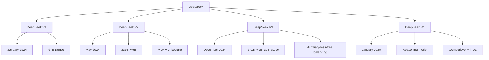

# DeepSeek

DeepSeek is a Chinese AI company that has created powerful open-source LLMs with innovative MoE architectures. DeepSeek-V3 and DeepSeek-R1 represent cutting-edge efficiency in large language models.

## Overview



## DeepSeek-V3 Architecture

### Innovative MoE Design

```python
class DeepSeekV3Config:
    """
    DeepSeek-V3: 671B total, 37B active per token
    """
    total_params = 671_000_000_000
    active_params = 37_000_000_000
    
    num_layers = 61
    d_model = 7168
    num_heads = 128
    head_dim = 128
    
    # MoE configuration
    num_experts = 256
    num_shared_experts = 1  # Always active
    num_routed_experts = 255
    top_k = 8  # Activate 8 routed experts
    
    # Context
    context_length = 128_000
    vocab_size = 129_280
```

### Multi-head Latent Attention (MLA)

```python
class MultiHeadLatentAttention(nn.Module):
    """
    DeepSeek-V2/V3's innovative attention mechanism
    Compresses KV cache for efficient inference
    """
    def __init__(self, d_model, num_heads, kv_lora_rank=512):
        super().__init__()
        self.num_heads = num_heads
        self.head_dim = d_model // num_heads
        self.kv_lora_rank = kv_lora_rank
        
        # Compress KV to low-rank representation
        self.kv_compress = nn.Linear(d_model, kv_lora_rank, bias=False)
        self.k_decompress = nn.Linear(kv_lora_rank, num_heads * self.head_dim, bias=False)
        self.v_decompress = nn.Linear(kv_lora_rank, num_heads * self.head_dim, bias=False)
        
        # Query projection
        self.q_proj = nn.Linear(d_model, num_heads * self.head_dim, bias=False)
        self.o_proj = nn.Linear(num_heads * self.head_dim, d_model, bias=False)
    
    def forward(self, x, kv_cache=None):
        batch_size, seq_len, _ = x.shape
        
        # Compress KV
        kv = self.kv_compress(x)  # (B, S, kv_lora_rank)
        
        # Decompress for attention
        k = self.k_decompress(kv)  # (B, S, num_heads * head_dim)
        v = self.v_decompress(kv)
        
        # Query
        q = self.q_proj(x)
        
        # Reshape for multi-head attention
        q = q.view(batch_size, seq_len, self.num_heads, self.head_dim)
        k = k.view(batch_size, seq_len, self.num_heads, self.head_dim)
        v = v.view(batch_size, seq_len, self.num_heads, self.head_dim)
        
        # Standard attention
        attn = F.scaled_dot_product_attention(q, k, v)
        attn = attn.view(batch_size, seq_len, -1)
        
        return self.o_proj(attn)
```

### Auxiliary-Loss-Free Load Balancing

```python
class AuxiliaryLossFreeRouter(nn.Module):
    """
    DeepSeek-V3's innovation: No auxiliary loss needed
    Uses dynamic bias for load balancing
    """
    def __init__(self, d_model, num_experts):
        super().__init__()
        self.gate = nn.Linear(d_model, num_experts, bias=False)
        self.bias = nn.Parameter(torch.zeros(num_experts))
        self.num_experts = num_experts
        
        # Tracking
        self.register_buffer('expert_count', torch.zeros(num_experts))
        self.register_buffer('total_tokens', torch.tensor(0.0))
    
    def forward(self, x):
        # Add bias to router logits
        logits = self.gate(x) + self.bias
        return logits
    
    def update_bias(self):
        """Dynamically adjust bias based on utilization"""
        if self.total_tokens > 0:
            utilization = self.expert_count / self.total_tokens
            target = 1.0 / self.num_experts
            
            # Adjust bias: increase for underused, decrease for overused
            adjustment = 0.001 * (target - utilization)
            self.bias.data += adjustment
            
            # Reset counters
            self.expert_count.zero_()
            self.total_tokens.zero_()
```

### Shared + Routed Experts

```python
class DeepSeekMoE(nn.Module):
    """
    DeepSeek-V3 MoE with shared and routed experts
    """
    def __init__(self, d_model, num_shared=1, num_routed=255, top_k=8):
        super().__init__()
        # Shared expert: always active
        self.shared_expert = SwiGLUExpert(d_model, d_model * 4)
        
        # Routed experts: selectively activated
        self.routed_experts = nn.ModuleList([
            SwiGLUExpert(d_model, d_model * 4)
            for _ in range(num_routed)
        ])
        
        # Router
        self.router = AuxiliaryLossFreeRouter(d_model, num_routed)
        self.top_k = top_k
    
    def forward(self, x):
        # Shared expert processes all tokens
        shared_output = self.shared_expert(x)
        
        # Route to top-k experts
        router_logits = self.router(x)
        top_k_logits, top_k_indices = router_logits.topk(self.top_k, dim=-1)
        top_k_weights = F.softmax(top_k_logits, dim=-1)
        
        # Process through routed experts
        routed_output = self.dispatch_to_experts(x, top_k_weights, top_k_indices)
        
        # Combine
        return shared_output + routed_output
```

## DeepSeek-R1

### Reasoning Model

```python
# DeepSeek-R1: Reasoning model competitive with OpenAI o1
# Uses reinforcement learning for reasoning

class DeepSeekR1:
    """
    Key innovations:
    - RL-trained reasoning
    - Chain-of-thought generation
    - Self-verification
    - Competitive with o1 on math/code
    """
    
    # Training process:
    # 1. Base model: DeepSeek-V3
    # 2. RL training for reasoning
    # 3. Distillation to smaller models
    
    # Capabilities:
    capabilities = {
        "math": "Competitive with o1",
        "code": "Strong competitive programming",
        "reasoning": "Multi-step logical reasoning",
        "verification": "Self-checking answers"
    }
```

### R1 Distillation

```python
# DeepSeek-R1 distilled into smaller models:
# - R1-Distill-Qwen-1.5B
# - R1-Distill-Qwen-7B
# - R1-Distill-Llama-8B
# - R1-Distill-Qwen-14B
# - R1-Distill-Qwen-32B
# - R1-Distill-Llama-70B

# These smaller models retain much of R1's reasoning ability
```

## DeepSeek-V2

### Key Innovations

```python
# DeepSeek-V2 introduced:
# 1. Multi-head Latent Attention (MLA)
# 2. DeepSeekMoE architecture
# 3. Auxiliary-loss-free balancing

config = {
    "total_params": "236B",
    "active_params": "21B",
    "experts": 160,
    "shared_experts": 2,
    "top_k": 6,
    "context": "128K"
}
```

## Using DeepSeek

### API Access

```python
from openai import OpenAI

# DeepSeek API is OpenAI-compatible
client = OpenAI(
    api_key="YOUR_DEEPSEEK_KEY",
    base_url="https://api.deepseek.com"
)

# Chat completion
response = client.chat.completions.create(
    model="deepseek-chat",  # DeepSeek-V3
    messages=[
        {"role": "user", "content": "Explain quantum computing"}
    ]
)

print(response.choices[0].message.content)

# Reasoning model
response = client.chat.completions.create(
    model="deepseek-reasoner",  # DeepSeek-R1
    messages=[
        {"role": "user", "content": "Solve this math problem: ..."}
    ]
)
```

### Local Deployment

```python
# Using vLLM
from vllm import LLM, SamplingParams

llm = LLM(
    model="deepseek-ai/DeepSeek-V3",
    tensor_parallel_size=8,  # Needs multiple GPUs
    gpu_memory_utilization=0.9
)

sampling_params = SamplingParams(temperature=0.7, max_tokens=200)
outputs = llm.generate(["What is machine learning?"], sampling_params)
```

### Quantized Versions

```python
# DeepSeek-V3 quantized versions available
# - AWQ (4-bit)
# - GGUF (for llama.cpp)
# - GPTQ

# Memory requirements:
# FP16: ~1.3 TB
# INT8: ~650 GB
# INT4: ~350 GB
```

## Performance

### Benchmark Results

```python
# DeepSeek-V3 benchmarks
benchmarks = {
    "MMLU": 88.5,
    "HumanEval": 82.6,
    "GSM8K": 96.0,
    "MATH": 90.2,
    "GPQA": 59.1
}

# DeepSeek-R1 benchmarks
r1_benchmarks = {
    "MATH": 97.3,      # Near-perfect
    "AIME": 79.8,      # Competition math
    "Codeforces": 96.3, # Competitive programming
    "GPQA": 71.5        # Graduate-level QA
}
```

### Efficiency

```python
# DeepSeek-V3 efficiency:
# - 671B total, 37B active (5.5% of parameters)
# - Much faster than dense 70B model
# - Comparable quality to GPT-4

# Training cost: ~$5.5M (claimed)
# Very efficient compared to competitors
```

## Comparison with Other MoE Models

| Feature | DeepSeek-V3 | Mixtral 8×7B | Switch Transformer |
|---------|------------|-------------|-------------------|
| Total Params | 671B | 47B | 1.6T |
| Active Params | 37B | 13B | ~1B |
| Experts | 256 | 8 | 128 |
| Top-K | 8 | 2 | 1 |
| Shared Experts | 1 | 0 | 0 |
| Load Balancing | Bias-based | Loss-based | Loss-based |
| Context | 128K | 32K | 2K |

## Comparison with Proprietary Models

| Feature | DeepSeek-V3 | GPT-4o | Claude 3.5 | Gemini |
|---------|------------|--------|------------|--------|
| Open Source | Yes | No | No | No |
| Parameters | 671B (37B active) | ~1.8T | Unknown | Unknown |
| Context | 128K | 128K | 200K | 1M |
| Reasoning | Excellent | Excellent | Excellent | Excellent |
| Code | Strong | Strong | Strong | Strong |
| Cost | Free (self-host) | $$$ | $$$ | $$$ |

## Strengths

1. **Efficiency:** 37B active from 671B total (very efficient)
2. **Innovation:** MLA, auxiliary-loss-free balancing
3. **Open source:** Full weight access
4. **Performance:** Competitive with GPT-4
5. **Reasoning:** R1 model competitive with o1
6. **Cost:** Very efficient training and inference

## Limitations

1. **Hardware:** Needs significant compute for full model
2. **Documentation:** Less extensive than Llama
3. **Ecosystem:** Smaller community than Llama
4. **Multimodal:** Text-only (currently)
5. **Origin:** Some concerns about Chinese AI models

## Interview Questions

1. **What is DeepSeek-V3?**
   A 671B parameter MoE model with only 37B active per token. Uses 256 experts with 8 active, shared experts, and auxiliary-loss-free load balancing. Competitive with GPT-4.

2. **What is Multi-head Latent Attention (MLA)?**
   DeepSeek's attention mechanism that compresses KV cache to low-rank representation. Reduces memory and compute while maintaining quality. Enables efficient long-context processing.

3. **How does DeepSeek's load balancing work?**
   Instead of auxiliary loss, uses dynamic bias. The bias is adjusted based on expert utilization: increased for underused experts, decreased for overused. Simpler and more effective.

4. **What is DeepSeek-R1?**
   A reasoning model trained with reinforcement learning. Competitive with OpenAI o1 on math, code, and reasoning tasks. Uses chain-of-thought and self-verification.

5. **How does DeepSeek compare to Llama?**
   DeepSeek uses MoE (more efficient per token), while Llama is dense. DeepSeek-V3 is larger but more efficient. Llama has bigger ecosystem and more community support.

6. **What is shared + routed expert architecture?**
   Some experts are shared (always active) while others are routed (selectively activated). Shared experts provide baseline capability, routed experts add specialization.

7. **How was DeepSeek-V3 trained so efficiently?**
   Uses efficient MoE architecture, auxiliary-loss-free balancing, and optimized training infrastructure. Claims $5.5M training cost, much less than competitors.

## Common Mistakes

- ❌ Not considering hardware requirements for deployment
- ❌ Confusing DeepSeek models (V2, V3, R1)
- ❌ Ignoring the shared expert component
- ❌ Not using quantized versions for local deployment
- ❌ Overlooking the auxiliary-loss-free balancing innovation

## Summary

DeepSeek represents cutting-edge open-source LLM development with innovative MoE architectures. DeepSeek-V3 achieves GPT-4 quality with only 37B active parameters from 671B total. DeepSeek-R1 matches OpenAI o1's reasoning capabilities. Key innovations include MLA, shared+routed experts, and auxiliary-loss-free balancing.

## Cross-References

- [MoE Architecture](../moe/architecture.md) - MoE fundamentals
- [Mixtral](../moe/mixtral.md) - Another MoE model
- [Llama](llama.md) - Dense model comparison
- [GPT-4](gpt4.md) - Proprietary comparison
- [Routing](../moe/routing.md) - Routing strategies
