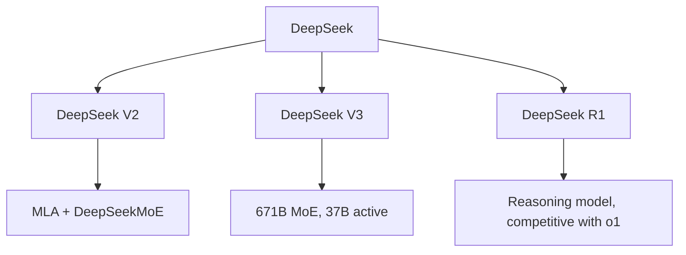
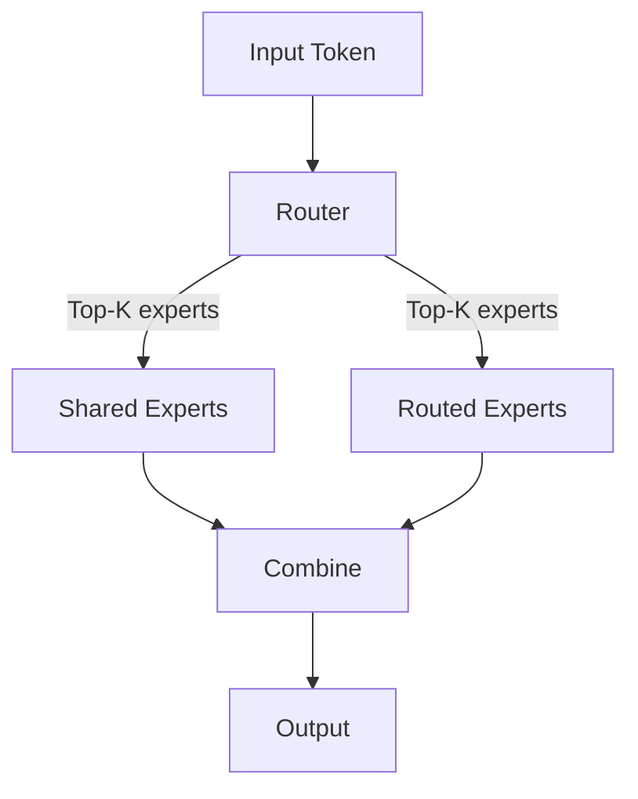
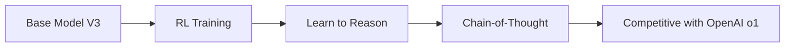

# DeepSeek

## Overview

DeepSeek is a Chinese AI lab that has produced several groundbreaking open-weight LLMs. DeepSeek V2 introduced Multi-head Latent Attention (MLA) and DeepSeekMoE architecture. DeepSeek V3 (December 2024) and DeepSeek R1 (January 2025) demonstrated that frontier-quality models can be trained at a fraction of the cost of Western labs, challenging the assumption that AI development requires billions of dollars.

## Model Family



## Key Innovations

### 1. Multi-head Latent Attention (MLA)

Compresses KV cache into a low-dimensional latent space:

```python
class MultiHeadLatentAttention(nn.Module):
    def __init__(self, d_model, num_heads, kv_lora_rank=512):
        super().__init__()
        # Compress KV into latent space
        self.kv_compress = nn.Linear(d_model, kv_lora_rank)
        self.k_decompress = nn.Linear(kv_lora_rank, num_heads * head_dim)
        self.v_decompress = nn.Linear(kv_lora_rank, num_heads * head_dim)
        self.q_compress = nn.Linear(d_model, kv_lora_rank)
        self.q_decompress = nn.Linear(kv_lora_rank, num_heads * head_dim)

    def forward(self, x):
        # Compress to latent
        kv_latent = self.kv_compress(x)
        q_latent = self.q_compress(x)

        # Decompress for attention
        k = self.k_decompress(kv_latent)
        v = self.v_decompress(kv_latent)
        q = self.q_decompress(q_latent)

        # Cache only the latent (much smaller)
        return attention(q, k, v)
```

### 2. DeepSeekMoE



- **Shared experts**: Always activated, capture common knowledge
- **Routed experts**: Activated selectively, capture specialized knowledge

### 3. DeepSeek R1 (Reasoning)

R1 uses reinforcement learning to develop chain-of-thought reasoning:



## Cost Efficiency

| Model | Training Cost | Parameters | Performance |
|-------|-------------|------------|-------------|
| GPT-4 | ~$100M+ | ~1.8T | Frontier |
| DeepSeek V3 | ~$5.5M | 671B (37B active) | Competitive |
| Llama 3.1 405B | ~$60M+ | 405B | Competitive |

DeepSeek achieved frontier performance at 1/10th to 1/20th the cost.

## DeepSeek V3 Specs

| Feature | Value |
|---------|-------|
| Total Parameters | 671B |
| Active Parameters | 37B per token |
| Context Length | 128K |
| Training Tokens | 14.8T |
| Training Cost | ~$5.5M |
| Architecture | MLA + DeepSeekMoE |

## Interview Questions

1. **What is DeepSeek's key innovation?** — Multi-head Latent Attention (MLA) compresses KV cache into latent space, dramatically reducing memory. DeepSeekMoE uses shared + routed experts for efficiency. Together, they achieve frontier performance at much lower cost.

2. **How does MLA reduce KV cache?** — Instead of caching full K and V tensors, MLA caches a compressed latent representation. At inference, K and V are decompressed from the latent. This reduces KV cache by ~90%.

3. **Why is DeepSeek R1 significant?** — It demonstrated that reasoning capabilities (like OpenAI's o1) can be developed through pure RL training on a strong base model. It's open-weight, enabling research into reasoning.

4. **How did DeepSeek train V3 so cheaply?** — MoE architecture (only 37B active), efficient training infrastructure, MLA reducing memory, and likely optimized data pipelines. Challenges the "bigger budget = better model" assumption.

5. **DeepSeek vs Llama?** — DeepSeek: more innovative architecture (MLA, MoE), better cost efficiency. Llama: larger ecosystem, more community support, Meta's resources. Both are competitive on benchmarks.

## Summary

DeepSeek represents a breakthrough in efficient LLM development. MLA and DeepSeekMoE enable frontier performance at a fraction of the cost. DeepSeek R1 proved that reasoning capabilities can be developed through RL. The open-weight release has accelerated research into efficient LLM architectures.

## Cross-References

- [Mixture of Experts](../moe/README.md) — MoE architecture
- [GPT-4](./gpt4.md) — Proprietary comparison
- [Llama](./llama.md) — Open-weight comparison
- [RLHF](../llm-serving/rlhf.md) — Alignment training
- [KV Cache](../llm-serving/kv-cache.md) — Inference optimization
