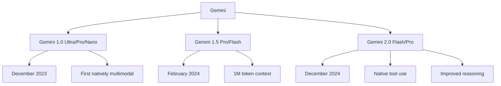

# Gemini (SOTA)

Gemini is Google DeepMind's family of multimodal AI models, designed to be natively multimodal from the ground up. It represents Google's most advanced AI, competing directly with GPT-4 and Claude.

## Overview



## Architecture

### Natively Multimodal

```python
# Key difference from GPT-4V:
# GPT-4V: Vision added to existing text model
# Gemini: Trained on text, image, audio, video jointly from start

class GeminiArchitecture:
    """
    Gemini is natively multimodal:
    - Text, image, audio, video processed together
    - No separate vision encoder needed
    - Unified understanding across modalities
    """
    
    # Hypothetical architecture (not fully public)
    modalities = {
        "text": "SentencePiece tokenizer",
        "image": "ViT-like encoder (256 tokens per image)",
        "audio": "Audio encoder (25 tokens/second)",
        "video": "Frame sampling + temporal encoding"
    }
    
    # Model variants
    variants = {
        "Ultra": {"params": "~1.5T+", "context": "128K"},
        "Pro": {"params": "~100B+", "context": "1M"},
        "Flash": {"params": "~10B+", "context": "1M"},
        "Nano": {"params": "1.8B/3.25B", "context": "32K"}
    }
```

### Mixture of Experts

```python
# Gemini likely uses MoE architecture
# Enables efficient scaling
# Different experts for different modalities/tasks

# Gemini 1.5 Pro: MoE with:
# - Multiple experts per layer
# - Efficient routing
# - 1M token context capability
```

## Gemini 1.5 Pro

### 1 Million Token Context

```python
# Breakthrough: 1M token context window
# Can process:
# - 1 hour of video
# - 11 hours of audio
# - 30,000 lines of code
# - 700,000 words

# "Needle in a Haystack" performance:
# 99.7% accuracy at finding specific facts in 1M tokens
```

### Long Context Applications

```python
def process_entire_codebase(repo_files, question):
    """Analyze entire code repository"""
    # Upload all source files
    files = [genai.upload_file(f) for f in repo_files]
    
    model = genai.GenerativeModel('gemini-1.5-pro')
    response = model.generate_content(
        [*files, f"Analyze this codebase and answer: {question}"]
    )
    return response.text

def analyze_hour_long_video(video_path, question):
    """Process entire movie"""
    video = genai.upload_file(video_path)
    
    model = genai.GenerativeModel('gemini-1.5-pro')
    response = model.generate_content(
        [video, question]
    )
    return response.text
```

## Gemini 2.0

### Key Improvements

```python
# Gemini 2.0 Flash (December 2024)
improvements = {
    "speed": "Faster than 1.5 Flash",
    "quality": "Better reasoning",
    "tools": "Native tool use",
    "output": "Multimodal output (text, image, audio)",
    "code": "Built-in code execution",
    "search": "Google Search grounding"
}
```

### Native Tool Use

```python
# Gemini 2.0 can use tools directly
# No separate function calling needed

def use_tools_with_gemini(prompt):
    """Gemini with built-in tools"""
    model = genai.GenerativeModel(
        'gemini-2.0-flash-exp',
        tools=[
            google_search_tool(),
            code_execution_tool()
        ]
    )
    
    response = model.generate_content(prompt)
    return response
```

### Multimodal Output

```python
# Gemini 2.0 can generate multiple modalities
# - Text responses
# - Images (via Imagen integration)
# - Audio (text-to-speech)
# - Code (with execution)

# Example: Generate image based on description
response = model.generate_content(
    "Create an image of a sunset over mountains",
    generation_config={"response_modalities": ["text", "image"]}
)
```

## API Usage

### Basic Usage

```python
import google.generativeai as genai

# Configure
genai.configure(api_key="YOUR_API_KEY")

# Text generation
model = genai.GenerativeModel('gemini-pro')
response = model.generate_content("Explain machine learning")
print(response.text)
```

### Multimodal Input

```python
# Image understanding
image = genai.upload_file("image.jpg")
model = genai.GenerativeModel('gemini-1.5-pro')
response = model.generate_content([image, "Describe this image"])

# Audio understanding
audio = genai.upload_file("audio.mp3")
response = model.generate_content([audio, "Transcribe this audio"])

# Video understanding
video = genai.upload_file("video.mp4")
response = model.generate_content([video, "What happens in this video?"])
```

### Multi-Image Reasoning

```python
# Compare multiple images
images = [genai.upload_file(f"img{i}.jpg") for i in range(5)]
response = model.generate_content([
    *images,
    "Compare these images and describe the differences"
])
```

### Chat Interface

```python
# Multi-turn conversation
chat = model.start_chat(history=[])
response = chat.send_message("Hello, I'm learning Python")
print(response.text)

response = chat.send_message("What are decorators?")
print(response.text)
```

## Gemini Nano

### On-Device AI

```python
# Runs on mobile devices (Pixel 8 Pro, etc.)
class GeminiNano:
    variants = {
        "Nano-1": {"params": "1.8B", "use": "Basic tasks"},
        "Nano-2": {"params": "3.25B", "use": "Complex tasks"}
    }
    
    capabilities = [
        "Summarization",
        "Smart reply",
        "OCR",
        "Basic image understanding",
        "On-device processing"
    ]
    
    # Key benefits:
    # - No internet required
    # - Privacy preserving
    # - Low latency
    # - Integrated into Android
```

## Performance Benchmarks

### Text Benchmarks

| Benchmark | Gemini Ultra | GPT-4 | Claude 3 Opus |
|-----------|-------------|-------|---------------|
| MMLU | 90.0% | 86.4% | 86.8% |
| GSM8K | 94.4% | 92.0% | 95.0% |
| HumanEval | 74.4% | 67.0% | 84.9% |
| GPQA | 59.1% | 56.1% | 50.4% |

### Multimodal Benchmarks

| Benchmark | Gemini Ultra | GPT-4V |
|-----------|-------------|--------|
| VQAv2 | 82.3% | 77.2% |
| TextVQA | 82.3% | 78.0% |
| DocVQA | 90.9% | 88.4% |
| InfographicVQA | 80.3% | 75.1% |

## Use Cases

### Document Analysis

```python
# Process long documents
def analyze_contract(contract_text, questions):
    """Analyze legal contract"""
    model = genai.GenerativeModel('gemini-1.5-pro')
    response = model.generate_content(f"""
        Analyze this contract:
        
        <contract>
        {contract_text}
        </contract>
        
        Answer these questions:
        {questions}
    """)
    return response.text
```

### Code Analysis

```python
# Analyze large codebase
def code_review(repo_path):
    """Review entire repository"""
    files = [genai.upload_file(f) for f in get_python_files(repo_path)]
    
    model = genai.GenerativeModel('gemini-1.5-pro')
    response = model.generate_content([
        *files,
        "Review this codebase for bugs, security issues, and improvements"
    ])
    return response.text
```

### Video Understanding

```python
# Analyze video content
def analyze_lecture(video_path):
    """Extract key points from lecture video"""
    video = genai.upload_file(video_path)
    
    model = genai.GenerativeModel('gemini-1.5-pro')
    response = model.generate_content([
        video,
        "Extract the key points from this lecture and create study notes"
    ])
    return response.text
```

## Comparison with Competitors

| Feature | Gemini 2.0 | GPT-4o | Claude 3.5 |
|---------|-----------|--------|------------|
| Text | Excellent | Excellent | Excellent |
| Vision | Excellent | Excellent | Excellent |
| Audio | Native | Native | No |
| Video | Native | Limited | No |
| Context | 1M | 128K | 200K |
| Tools | Native | Via API | Via API |
| On-device | Yes (Nano) | No | No |
| Price | $$ | $$ | $$ |

## Strengths

1. **Native multimodality:** Processes text, image, audio, video together
2. **Long context:** 1M token context window
3. **On-device:** Gemini Nano for mobile
4. **Tool use:** Built-in code execution, search
5. **Google integration:** Search, Maps, etc.
6. **Efficient:** MoE architecture for scaling

## Limitations

1. **Availability:** Not always available in all regions
2. **API complexity:** Different from OpenAI API
3. **Rate limits:** Can be restrictive
4. **Consistency:** May vary across sessions
5. **Safety filters:** Sometimes over-aggressive

## Interview Questions

1. **What makes Gemini different from GPT-4?**
   Gemini is natively multimodal (trained on text, image, audio, video jointly) while GPT-4V added vision later. Gemini has 1M context, native tool use, and on-device variants (Nano).

2. **How does Gemini's 1M context work?**
   Uses efficient attention mechanisms and MoE architecture. Maintains 99.7% accuracy on "needle in a haystack" tests across the full 1M tokens.

3. **What is Gemini Nano?**
   On-device variants (1.8B/3.25B parameters) for mobile devices. Enables privacy-preserving AI without internet. Integrated into Android via AICore.

4. **How does Gemini process video?**
   Video is sampled into frames and processed with temporal encoding. Audio is extracted separately. The model understands spatial and temporal relationships natively.

5. **What are Gemini's multimodal capabilities?**
   Text understanding/generation, image understanding, audio understanding/transcription, video understanding, and (with 2.0) multimodal output.

6. **How does Gemini compare to Claude for long documents?**
   Gemini has 1M context vs Claude's 200K. Both maintain quality across full context. Gemini can also process audio/video alongside text.

7. **What is Constitutional AI vs Gemini's approach?**
   Claude uses Constitutional AI (self-improvement with principles). Gemini uses traditional RLHF with additional safety training. Both aim for helpful, harmless, honest AI.

## Common Mistakes

- ❌ Not utilizing the 1M context window
- ❌ Confusing Gemini variants (Ultra vs Pro vs Flash vs Nano)
- ❌ Not using native multimodal capabilities
- ❌ Ignoring on-device options (Nano) for privacy-sensitive use
- ❌ Using wrong API format (different from OpenAI)

## Summary

Gemini represents Google's most advanced AI with native multimodality, 1M context, and on-device variants. Its architecture enables processing text, images, audio, and video together. Gemini 2.0 adds native tool use and multimodal output. The MoE architecture enables efficient scaling.

## Cross-References

- [GPT-4](gpt4.md) - OpenAI's competitor
- [Claude](claude.md) - Anthropic's competitor
- [Multimodal](../multimodal/gemini.md) - Multimodal details
- [MoE Architecture](../moe/README.md) - Mixture of Experts
- [Long Context](../long-context.md) - Context window techniques
