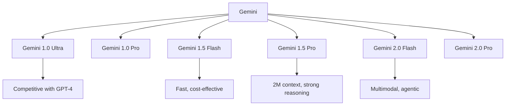
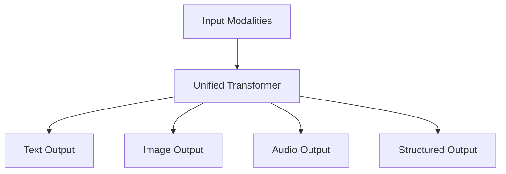
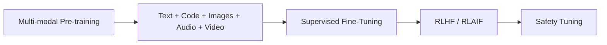

# Gemini

## Overview

Gemini is Google DeepMind's family of multimodal AI models, designed from the ground up to process text, code, audio, images, and video. Gemini 1.5 Pro introduced an industry-leading 2 million token context window. Gemini 2.0 (December 2024) further improved capabilities with native tool use and agentic features.

## Model Family

## Key Innovations

### 1. Extreme Context Length

| Model | Context Window |
|-------|---------------|
| GPT-4 | 128K |
| Claude 3.5 | 200K |
| Gemini 1.5 Pro | 2M tokens |
| Gemini 2.0 | 2M tokens |

### 2. Native Multimodality

Gemini processes interleaved text, images, audio, and video natively in a single model.

### 3. Mixture of Experts

Gemini uses MoE architecture for efficiency:
- Only activates relevant experts per token
- Reduces compute cost while maintaining quality
- Enables larger total parameter counts

## Training

## Comparison

| Feature | Gemini 1.5 Pro | GPT-4o | Claude 3.5 Sonnet |
|---------|---------------|--------|-------------------|
| Context | 2M | 128K | 200K |
| Multimodal | Native | Unified | Text + Vision |
| Coding | Strong | Strong | Best |
| Reasoning | Strong | Strong | Strong |
| Cost | $3.5/$10.5 | $5/$15 | $3/$15 |

## Interview Questions

1. **What makes Gemini unique?** — Native multimodality (text, image, audio, video in one model), 2M token context window, MoE architecture, and deep Google ecosystem integration.

2. **How does Gemini handle 2M token context?** — Efficient attention mechanisms (likely sparse or ring attention), positional interpolation, and optimized memory management. Can process entire codebases or hours of video.

3. **Gemini vs GPT-4 vs Claude?** — Gemini: longest context, native multimodal. GPT-4: strong general capabilities, widest API adoption. Claude: best coding, strongest safety. All are competitive on benchmarks.

4. **What is Gemini's MoE architecture?** — Uses Mixture of Experts where only a subset of parameters activates per token. This allows a larger total model with lower per-token compute cost.

5. **How does Gemini's multimodality work?** — All modalities (text, image, audio, video) are tokenized and processed by a single transformer, unlike models that use separate encoders for each modality.

## Summary

Gemini represents Google's frontier AI capabilities with industry-leading context length (2M tokens), native multimodality, and MoE architecture. The Gemini 2.0 family adds agentic capabilities with native tool use. Deep integration with Google Cloud (Vertex AI) makes it a strong choice for enterprise applications.

## Cross-References

- [GPT-4](./gpt4.md) — Main competitor
- [Mixture of Experts](../moe/README.md) — MoE architecture
- [Multimodal Models](../multimodal/README.md) — Vision-language
- [Vertex AI](../../ml/mlops/vertex.md) — Google's ML platform
- [LLM Architecture](../llm-serving/architecture.md) — Transformer fundamentals
