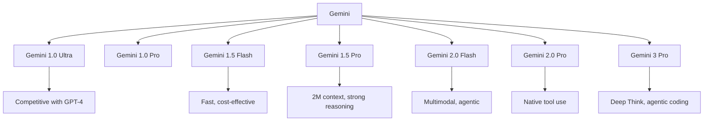
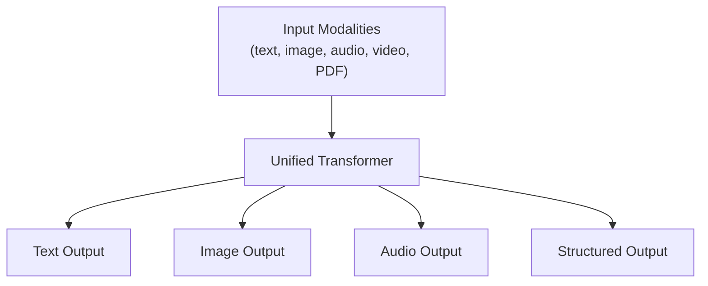
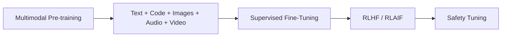

# Gemini

## Overview

Gemini is Google DeepMind's family of natively **multimodal** AI models — designed from the ground up to process text, code, audio, images, video, and PDFs in a single model. Gemini 1.5 Pro introduced an industry-leading 2 million token context window; Gemini 2.0 (December 2024) added native tool use and agentic features; **Gemini 3 Pro (November 2025)** is Google's frontier reasoning/agentic model with a 1M-token context window, a sparse Mixture-of-Experts architecture, and a **Deep Think** mode for long-horizon reasoning.

## Model Family

| Model | Context | Key Strength |
|-------|---------|--------------|
| Gemini Nano | 32K | On-device (1.8B / 3.25B) |
| Gemini Flash | 1M | Fast, cost-effective |
| Gemini Pro | 128K→1M | Balanced reasoning |
| Gemini Ultra | — | Flagship capability |
| Gemini 1.5 Pro | 2M tokens | Longest production context at launch |
| Gemini 3 Pro | 1M input / 64K output | Frontier reasoning + agentic coding |

## Key Innovations

### 1. Extreme Context Length

| Model | Context Window |
|-------|---------------|
| GPT-4 | 128K |
| Claude 3.5 Sonnet | 200K |
| Gemini 1.5 Pro | 2M tokens |
| Gemini 2.0 | 2M tokens |
| Gemini 3 Pro | 1M input tokens |

Practical impact: process entire codebases (~30K lines), hour-long videos, or hundreds of document pages in one prompt. Engineered via efficient attention (e.g., ring attention, context parallelism), RoPE positional encoding, and optimized KV-cache management — though accuracy degrades toward the extreme end ("attention dilution").

### 2. Native Multimodality

Unlike text-first models with vision adapters bolted on later, Gemini is **trained jointly on all modalities from the start** — improving cross-modal reasoning (e.g., understanding video with its audio narration holistically).

### 3. Mixture of Experts

Gemini uses a **sparse MoE** transformer (see [Mixture of Experts](../moe/README.md)):

- Only a subset of experts activates per token
- Decouples total parameter count from per-inference compute cost
- Reduces inference cost while maintaining quality; enables very large total models
- Gemini 3 Pro retains this architecture on Google's TPU v5p infrastructure

## Architecture

- **MoE transformer** with sparse activation.
- **Natively multimodal training** — not text-only plus vision adapter.
- Trained at massive scale on TPUs.
- Gemini 3 Pro adds a *deep reasoning engine* (Deep Think), controllable thinking intensity, and native spatial/agentic capabilities.

## Training Pipeline

See [LLM Training Pipeline](../../ml/llm/training-pipeline.md) for the general pipeline.

## Benchmark Performance

| Benchmark | Gemini Ultra | GPT-4 | Claude 3 |
|-----------|-------------|-------|----------|
| MMLU | 90.0% | 86.4% | 88.7% |
| HumanEval | 74.4% | 67.0% | 70.0% |
| MATH | 53.2% | 52.9% | 40.5% |
| MMMU | 59.4% | 56.8% | 59.4% |

## vs GPT-4 vs Claude

| Aspect | Gemini | GPT-4 | Claude |
|--------|--------|-------|--------|
| Multimodal | Native (text/image/audio/video/PDF) | Vision + audio | Vision only (text+vision) |
| Context | 2M tokens (1.5 Pro); 1M (3 Pro) | 128K tokens | 200K tokens |
| Strength | Multimodal, long context, agentic | Reasoning, ecosystem | Safety, writing |
| Provider | Google | OpenAI | Anthropic |

## Interview Questions

1. **What makes Gemini unique?** — Native multimodality (text, image, audio, video in one model), very long context (2M tokens on 1.5 Pro), sparse MoE architecture, and deep Google ecosystem integration (Search, Vertex AI, Android).

2. **How does Gemini handle a 2M/1M token context?** — Efficient attention mechanisms (ring attention / context parallelism), RoPE positional encoding, and optimized KV-cache memory management. It can process entire codebases or hours of video — though long-context retrieval accuracy degrades near the window limit.

3. **Gemini vs GPT-4 vs Claude?** — Gemini: longest context, native multimodal. GPT-4: strong general capabilities, widest API adoption. Claude: best coding, strongest safety. All are competitive on benchmarks.

4. **What is Gemini's MoE architecture?** — Sparse Mixture of Experts: only a subset of parameters activates per token, allowing a larger total model with lower per-token compute cost (see [MoE](../moe/README.md)).

5. **How does Gemini's multimodality work?** — All modalities (text, image, audio, video) are tokenized and processed by a **single transformer**, unlike models that bolt a vision encoder onto a text-only model.

6. **Compare Gemini Flash vs Gemini Pro.** — Flash is optimized for speed and cost (high-throughput, latency-sensitive apps); Pro/Ultra for complex reasoning, long documents, and quality-critical workloads.

## Common Mistakes

1. Confusing Gemini (Google) with similarly named projects.
2. Assuming a 2M/1M context window means perfect recall across the entire window (retrieval accuracy degrades near the limit).
3. Not distinguishing Nano/Flash/Pro/Ultra tiers — capabilities vary significantly.
4. Underestimating Gemini's coding strength (it is very strong at code generation, especially Gemini 3 Pro agentic coding).

## Summary

Gemini is Google DeepMind's frontier AI family: native multimodality, industry-leading context length, MoE efficiency, and — starting with Gemini 2.0/3.0 — agentic capabilities with native tool use. Deep integration with Google Cloud (Vertex AI) makes it a strong enterprise choice, competing directly with GPT-4/5 and Claude.

## Cross References

- [GPT-4](./gpt4.md) — main competitor
- [Claude](./claude.md) — safety-focused competitor
- [Mixture of Experts](../moe/README.md) — MoE architecture
- [Multimodal Models](../multimodal/README.md) — vision-language models
- [LLM Architecture](../llm-serving/architecture.md) — transformer fundamentals
- [LLM Training Pipeline](../../ml/llm/training-pipeline.md) — pre-training → RLHF
- [Vertex AI](../../ml/mlops/vertex.md) — Google's ML platform
