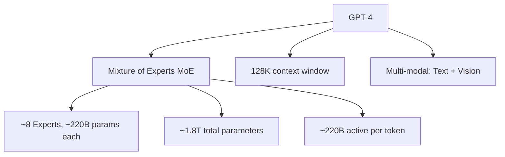
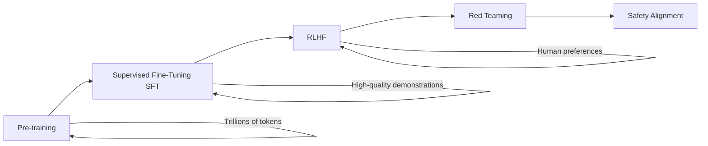

# GPT-4 & GPT-4o

## Overview

GPT-4 (March 2023) and GPT-4o (May 2024) are OpenAI's flagship multimodal large language models. GPT-4 set new benchmarks across reasoning, coding, and professional exams. GPT-4o ("o" for omni) added native multimodal capabilities — processing text, audio, image, and video in a single model with faster response times.

## Architecture (Inferred)

GPT-4's exact architecture is not public, but based on leaks and analysis:

### Key Architectural Features

| Feature | GPT-4 | GPT-4o |
|---------|-------|--------|
| Architecture | MoE (likely) | Unified multimodal |
| Parameters | ~1.8T total | Not disclosed |
| Context | 8K → 128K | 128K |
| Modalities | Text + Vision | Text + Vision + Audio |
| Speed | Standard | 2x faster |
| Cost | $30/$60 per 1M tokens | $5/$15 per 1M tokens |

## Capabilities

### Reasoning
- Passes bar exam (top 10%), medical licensing exams
- Strong mathematical reasoning
- Multi-step logical deduction

### Coding
- HumanEval: ~90% pass rate
- Handles complex codebases
- Debugging and refactoring

### Multimodal (GPT-4V/4o)
- Image understanding and description
- Document parsing (charts, tables)
- Video understanding (4o)
- Audio transcription and generation (4o)

## Training Pipeline

## Interview Questions

1. **What makes GPT-4 better than GPT-3.5?** — Better reasoning (passes professional exams), multimodal capabilities, longer context (128K), better instruction following, and reduced hallucinations.

2. **What is GPT-4o's key innovation?** — Unified multimodal model that natively processes text, audio, and video in one forward pass, rather than using separate encoders. Faster and cheaper than GPT-4.

3. **How does GPT-4 handle long context?** — 128K token context window. Uses techniques like sparse attention and positional interpolation. "Lost in the middle" problem: performance degrades for information in the middle of long contexts.

4. **What is RLHF and how does GPT-4 use it?** — Reinforcement Learning from Human Feedback. Trains a reward model on human preferences, then optimizes the LLM to maximize the reward. Makes the model more helpful, harmless, and honest.

5. **GPT-4 vs open-source models?** — GPT-4 still leads on complex reasoning and multimodal tasks. Open-source models (Llama 3.1 405B) are competitive on many benchmarks at a fraction of the cost. Gap is narrowing rapidly.

## Summary

GPT-4/GPT-4o represent the current frontier of proprietary LLMs. Key strengths include strong reasoning, multimodal capabilities, and wide API availability. GPT-4o unified text, audio, and vision into a single faster model. The main limitations are cost, closed architecture, and dependency on OpenAI's API.

## Cross-References

- [LLM Architecture](../llm-serving/architecture.md) — Transformer fundamentals
- [RLHF](../llm-serving/rlhf.md) — Alignment training
- [Multimodal Models](../multimodal/README.md) — Vision-language
- [Claude](./claude.md) — Main competitor
- [Gemini](./gemini.md) — Google's competitor
