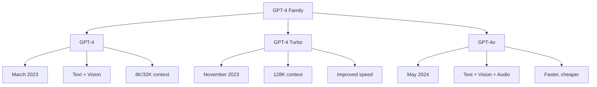

# GPT-4 & GPT-4o

GPT-4 is OpenAI's most capable large language model, released in March 2023. GPT-4o (May 2024) extends it with native multimodal capabilities across text, audio, and vision.

## Overview



## Architecture (Rumors & Analysis)

GPT-4's architecture is not public, but analysis suggests:

### MoE Architecture

```python
# Likely architecture based on leaks and analysis
class GPT4Architecture:
    """
    GPT-4 likely uses:
    - Mixture of Experts (MoE)
    - ~1.8 trillion total parameters
    - ~220B active per token
    - 16 experts, ~8 active
    - ~120 layers
    """
    
    # Approximate structure
    total_params = 1_800_000_000_000  # 1.8T
    active_params = 220_000_000_000   # 220B per token
    num_experts = 16
    active_experts = 8
    num_layers = 120
    d_model = 12288
    num_heads = 96
    context_length = 128_000  # 128K tokens
```

### Training Approach

```python
# GPT-4 training likely involved:
# 1. Pre-training on large text corpus (~13T tokens)
# 2. Supervised Fine-Tuning (SFT)
# 3. RLHF with human feedback
# 4. Additional safety training

# Key innovations:
# - Predictable scaling (tested on smaller models)
# - Infrastructure optimization
# - Alignment techniques
```

## GPT-4 Capabilities

### Reasoning

```python
# GPT-4 excels at complex reasoning tasks
# Examples:
# - Mathematical problem solving
# - Logical reasoning
# - Code generation and debugging
# - Scientific analysis
# - Legal/medical reasoning

# Benchmark results (approximate):
benchmarks = {
    "MMLU": 86.4,          # Massive multitask language understanding
    "HumanEval": 67.0,     # Code generation
    "GSM8K": 92.0,         # Math reasoning
    "BAR": 90.0,           # Bar exam
    "SAT Math": 710,       # SAT math score
    "LSAT": 163,           # Law school admission
}
```

### Multimodal (GPT-4V)

```python
# GPT-4V: Vision capabilities
# - Image understanding
# - OCR (text extraction)
# - Chart/graph analysis
# - Visual reasoning
# - Code from UI mockups

# Example usage
response = client.chat.completions.create(
    model="gpt-4-vision-preview",
    messages=[{
        "role": "user",
        "content": [
            {"type": "image", "image_url": {"url": "image.jpg"}},
            {"type": "text", "text": "What's in this image?"}
        ]
    }]
)
```

## GPT-4o

### Key Innovation: Native Multimodality

```python
# GPT-4o: "o" for "omni"
# Processes text, audio, and vision natively
# Single model handles all modalities

class GPT4o:
    """
    Key features:
    - Text input/output
    - Image input
    - Audio input/output (real-time)
    - Video understanding
    - 128K context
    - Faster than GPT-4
    - 50% cheaper than GPT-4
    """
    
    modalities = {
        "input": ["text", "image", "audio"],
        "output": ["text", "audio"]
    }
    
    latency = {
        "audio_response": "~320ms",  # Human-like response time
        "text_response": "Faster than GPT-4"
    }
```

### Real-Time Voice

```python
# GPT-4o can have real-time voice conversations
# - Natural interruption
# - Emotion detection
# - Singing
# - Multiple voices
# - Low latency (~320ms)

# Example API usage
response = client.chat.completions.create(
    model="gpt-4o",
    modalities=["text", "audio"],
    audio={"voice": "alloy", "format": "pcm16"},
    messages=[{
        "role": "user",
        "content": "Tell me a joke"
    }]
)

# Audio response
audio_data = response.choices[0].message.audio.data
```

### Improved Efficiency

```python
# GPT-4o vs GPT-4:
# - 2x faster
# - 50% cheaper
# - 5x higher rate limits
# - Better at non-English languages

# Pricing (approximate):
pricing = {
    "GPT-4": {"input": "$30/1M", "output": "$60/1M"},
    "GPT-4 Turbo": {"input": "$10/1M", "output": "$30/1M"},
    "GPT-4o": {"input": "$5/1M", "output": "$15/1M"},
    "GPT-4o mini": {"input": "$0.15/1M", "output": "$0.60/1M"}
}
```

## API Usage

### Basic Chat Completion

```python
from openai import OpenAI

client = OpenAI()

# Text completion
response = client.chat.completions.create(
    model="gpt-4o",
    messages=[
        {"role": "system", "content": "You are a helpful assistant."},
        {"role": "user", "content": "Explain quantum computing."}
    ],
    temperature=0.7,
    max_tokens=500
)

print(response.choices[0].message.content)
```

### With Function Calling

```python
# Define functions
tools = [{
    "type": "function",
    "function": {
        "name": "get_weather",
        "description": "Get weather for a location",
        "parameters": {
            "type": "object",
            "properties": {
                "location": {"type": "string"},
                "unit": {"type": "string", "enum": ["celsius", "fahrenheit"]}
            },
            "required": ["location"]
        }
    }
}]

response = client.chat.completions.create(
    model="gpt-4o",
    messages=[{"role": "user", "content": "What's the weather in Tokyo?"}],
    tools=tools,
    tool_choice="auto"
)

# Parse function call
tool_call = response.choices[0].message.tool_calls[0]
function_name = tool_call.function.name
arguments = json.loads(tool_call.function.arguments)
```

### Streaming

```python
# Stream responses
stream = client.chat.completions.create(
    model="gpt-4o",
    messages=[{"role": "user", "content": "Write a story"}],
    stream=True
)

for chunk in stream:
    if chunk.choices[0].delta.content:
        print(chunk.choices[0].delta.content, end="")
```

## GPT-4o Mini

```python
# Smaller, cheaper version
# Replaced GPT-3.5 Turbo
# Much better than GPT-3.5, close to GPT-4

# Use cases:
# - High-volume applications
# - Cost-sensitive applications
# - Real-time applications
# - Simple tasks

response = client.chat.completions.create(
    model="gpt-4o-mini",
    messages=[{"role": "user", "content": "Hello!"}]
)
```

## Comparison with Competitors

| Feature | GPT-4o | Claude 3.5 | Gemini 2 | Llama 3.1 |
|---------|--------|------------|----------|-----------|
| Text Quality | Excellent | Excellent | Excellent | Very Good |
| Vision | Excellent | Excellent | Excellent | N/A |
| Audio | Native | No | Native | No |
| Video | Limited | No | Native | No |
| Context | 128K | 200K | 1M | 128K |
| Speed | Fast | Fast | Fast | Variable |
| Price | $$ | $$ | $$ | Free |

## Strengths

1. **General reasoning:** Excels at complex multi-step reasoning
2. **Code generation:** Strong coding capabilities
3. **Multimodal:** Native vision and audio understanding
4. **Instruction following:** Precise adherence to instructions
5. **Safety:** Robust safety training
6. **Ecosystem:** Extensive tooling and integration

## Limitations

1. **Hallucination:** Can generate false information confidently
2. **Knowledge cutoff:** Training data has a cutoff date
3. **Cost:** Expensive for high-volume use
4. **Black box:** No weight access, limited interpretability
5. **Rate limits:** Can be restrictive for some users
6. **Consistency:** May give different answers to same question

## Interview Questions

1. **What is GPT-4's likely architecture?**
   Likely a Mixture of Experts model with ~1.8T total parameters and ~220B active per token. Uses 16 experts with 8 active, approximately 120 layers.

2. **How does GPT-4o differ from GPT-4?**
   GPT-4o is natively multimodal (text, audio, vision), faster, 50% cheaper, and has real-time voice capabilities. GPT-4 was primarily text with vision added later.

3. **What are GPT-4's main strengths?**
   Complex reasoning, code generation, multimodal understanding, instruction following, and safety. Excels at tasks requiring multi-step logical thinking.

4. **What is function calling in GPT-4?**
   Allows GPT-4 to call external functions/tools. The model outputs structured function calls that applications can execute and feed results back.

5. **How does GPT-4 handle multimodal inputs?**
   GPT-4V processes images through a vision encoder, converts them to visual tokens, and processes them alongside text tokens through the transformer.

6. **What is the difference between GPT-4 and GPT-4o mini?**
   GPT-4o mini is smaller, faster, and much cheaper. It's designed for high-volume and cost-sensitive applications, replacing GPT-3.5 Turbo.

7. **How was GPT-4 aligned?**
   Through Supervised Fine-Tuning (SFT), RLHF (Reinforcement Learning from Human Feedback), and additional safety training. OpenAI also used "red teaming" for safety testing.

## Common Mistakes

- ❌ Assuming GPT-4 is always correct (hallucination exists)
- ❌ Not using system prompts for consistent behavior
- ❌ Ignoring token limits and costs
- ❌ Not using function calling when appropriate
- ❌ Sending sensitive data without privacy considerations

## Summary

GPT-4 and GPT-4o represent the frontier of AI capabilities with strong reasoning, multimodal understanding, and real-time interaction. GPT-4o's native multimodality and efficiency improvements make it the current flagship. The likely MoE architecture enables massive scale while maintaining reasonable inference costs.

## Cross-References

- [Claude](claude.md) - Anthropic's competitor
- [Gemini](gemini-sota.md) - Google's multimodal model
- [Llama](llama.md) - Open-source alternative
- [MoE Architecture](../moe/README.md) - Mixture of Experts design
- [Multimodal](../multimodal/README.md) - Multimodal capabilities
