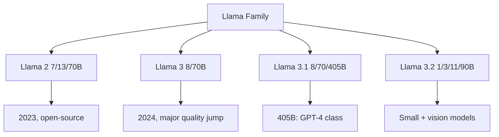
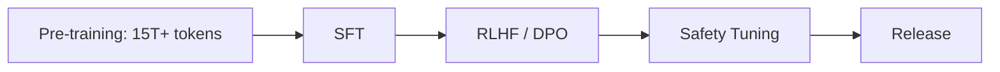
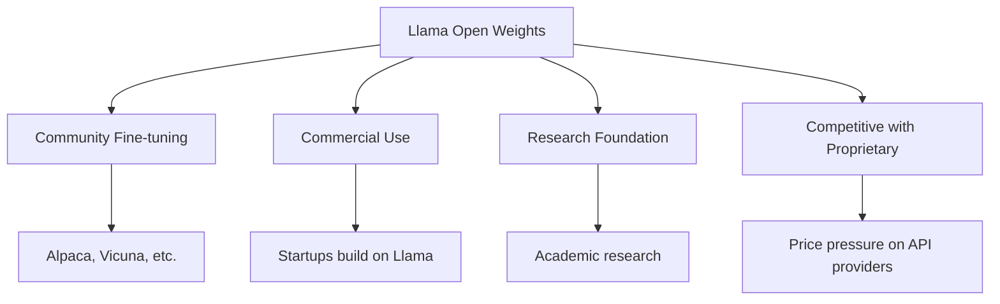

# Llama

## Overview

Llama is Meta's family of open-weight large language models. Llama 2 (July 2023) and Llama 3/3.1 (April/July 2024) democratized access to frontier-quality LLMs. Llama 3.1 405B was the first open-weight model to match GPT-4 on many benchmarks, sparking the open-source LLM revolution.

## Model Family



## Architecture

| Model | Parameters | Context | GQA Heads | Vocab Size |
|-------|-----------|---------|-----------|------------|
| Llama 2 70B | 70B | 4K | 8 | 32K |
| Llama 3 70B | 70B | 8K | 8 | 128K |
| Llama 3.1 405B | 405B | 128K | 8 | 128K |
| Llama 3.2 90B | 90B | 128K | 8 | 128K |

### Key Architectural Choices

```python
# Llama architecture highlights
class LlamaConfig:
    vocab_size = 128256        # Large vocabulary
    hidden_size = 16384        # For 405B
    num_layers = 126
    num_heads = 128
    num_kv_heads = 8           # Grouped Query Attention
    intermediate_size = 53248  # SwiGLU FFN
    max_position_embeddings = 131072  # 128K context
    rope_theta = 500000        # RoPE with large theta
```

### Grouped Query Attention (GQA)

```python
class GroupedQueryAttention(nn.Module):
    def __init__(self, num_heads=128, num_kv_heads=8):
        super().__init__()
        self.num_heads = num_heads
        self.num_kv_heads = num_kv_heads
        self.num_groups = num_heads // num_kv_heads  # 16 queries share 1 KV pair

        self.q_proj = nn.Linear(hidden_size, num_heads * head_dim)
        self.k_proj = nn.Linear(hidden_size, num_kv_heads * head_dim)
        self.v_proj = nn.Linear(hidden_size, num_kv_heads * head_dim)
```

## Training



### Training Data

- 15T+ tokens for Llama 3
- Heavy emphasis on code and math
- Multilingual data
- Quality filtering and deduplication

## Key Innovations

| Innovation | Description |
|-----------|-------------|
| Open weights | Model weights freely available |
| GQA | Faster inference with shared KV heads |
| RoPE | Rotary positional embeddings for long context |
| SwiGLU | Better activation function than ReLU |
| Large vocab | 128K tokenizer for multilingual |

## Impact on Industry



## Interview Questions

1. **Why is Llama significant?** — First truly competitive open-weight model matching GPT-4 class performance. Enabled fine-tuning, commercial use, and research without API dependency.

2. **What is Grouped Query Attention?** — Instead of each query head having its own KV heads, multiple query heads share KV heads. Reduces KV cache memory by 16x for Llama 3, enabling longer contexts.

3. **How does Llama 3.1 405B compare to GPT-4?** — Competitive on most benchmarks (MMLU, HumanEval, MATH). GPT-4 still leads on some complex reasoning tasks. 405B can be self-hosted, offering cost and privacy advantages.

4. **What is the Llama license?** — Permissive for commercial use (under 700M monthly active users). Not truly open-source (Meta restricts some uses), but enables most commercial applications.

5. **How do you deploy Llama models?** — vLLM, TGI, Ollama for serving. Quantization (GPTQ, AWQ) for consumer hardware. Fine-tuning with LoRA/QLoRA for custom tasks.

## Summary

Llama models democratized access to frontier LLMs. Llama 3.1 405B matches GPT-4 class performance with open weights, enabling self-hosting, fine-tuning, and research. Key architectural innovations include GQA, RoPE, and large vocabularies. The open-weight model ecosystem continues to grow rapidly.

## Cross-References

- [GPT-4](./gpt4.md) — Proprietary comparison
- [DeepSeek](./deepseek.md) — Another open-source leader
- [LLM Architecture](../llm-serving/architecture.md) — Transformer fundamentals
- [Quantization](../llm-serving/quantization.md) — Deployment optimization
- [vLLM](../llm-serving/vllm.md) — Serving framework
