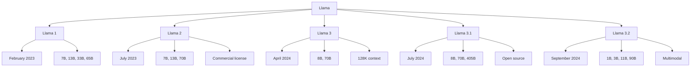

# Llama

Llama (Large Language Model Meta AI) is Meta's family of open-source large language models. Since its release, Llama has become the foundation of the open-source LLM ecosystem, enabling widespread research and deployment.

## Overview



## Llama Architecture

### Core Design

```python
class LlamaModel(nn.Module):
    """Llama architecture"""
    def __init__(self, d_model, num_heads, num_layers, vocab_size):
        super().__init__()
        self.embedding = nn.Embedding(vocab_size, d_model)
        self.layers = nn.ModuleList([
            LlamaBlock(d_model, num_heads) 
            for _ in range(num_layers)
        ])
        self.norm = RMSNorm(d_model)
        self.lm_head = nn.Linear(d_model, vocab_size, bias=False)
    
    def forward(self, x):
        x = self.embedding(x)
        for layer in self.layers:
            x = layer(x)
        x = self.norm(x)
        return self.lm_head(x)

class LlamaBlock(nn.Module):
    """Llama transformer block"""
    def __init__(self, d_model, num_heads):
        super().__init__()
        self.attention = LlamaAttention(d_model, num_heads)
        self.feed_forward = LlamaFFN(d_model)
        self.norm1 = RMSNorm(d_model)
        self.norm2 = RMSNorm(d_model)
    
    def forward(self, x):
        h = x + self.attention(self.norm1(x))
        out = h + self.feed_forward(self.norm2(h))
        return out
```

### Key Innovations

```python
# 1. RMSNorm (instead of LayerNorm)
class RMSNorm(nn.Module):
    def __init__(self, d_model, eps=1e-6):
        super().__init__()
        self.weight = nn.Parameter(torch.ones(d_model))
        self.eps = eps
    
    def forward(self, x):
        rms = torch.sqrt(x.pow(2).mean(-1, keepdim=True) + self.eps)
        return x / rms * self.weight

# 2. SwiGLU activation (instead of ReLU/GELU)
class LlamaFFN(nn.Module):
    def __init__(self, d_model, d_ff=None):
        super().__init__()
        d_ff = d_ff or int(2 * d_model * 4 / 3)
        self.w1 = nn.Linear(d_model, d_ff, bias=False)
        self.w2 = nn.Linear(d_ff, d_model, bias=False)
        self.w3 = nn.Linear(d_model, d_ff, bias=False)
    
    def forward(self, x):
        return self.w2(F.silu(self.w1(x)) * self.w3(x))

# 3. Rotary Position Embedding (RoPE)
class RotaryEmbedding(nn.Module):
    def __init__(self, dim, max_seq_len=2048):
        super().__init__()
        inv_freq = 1.0 / (10000 ** (torch.arange(0, dim, 2) / dim))
        self.register_buffer('inv_freq', inv_freq)
    
    def forward(self, seq_len):
        t = torch.arange(seq_len, device=self.inv_freq.device)
        freqs = torch.einsum('i,j->ij', t, self.inv_freq)
        return torch.cat([freqs, freqs], dim=-1)
```

## Model Versions

### Llama 1 (February 2023)

```python
# First release
# Sizes: 7B, 13B, 33B, 65B
# Trained on 1T tokens
# Non-commercial license

# Key points:
# - Demonstrated open-source viability
# - Strong performance for size
# - Sparked open-source LLM revolution
```

### Llama 2 (July 2023)

```python
# Major upgrade
# Sizes: 7B, 13B, 70B
# Trained on 2T tokens
# Commercial license (with restrictions)

improvements = {
    "context": "4K tokens",
    "training": "2T tokens (1T for Llama 1)",
    "alignment": "RLHF with safety tuning",
    "license": "Commercial (with restrictions)"
}

# Llama 2 Chat variants:
# - Llama-2-7b-chat
# - Llama-2-13b-chat
# - Llama-2-70b-chat
```

### Llama 3 (April 2024)

```python
# Significant upgrade
# Sizes: 8B, 70B
# Trained on 15T+ tokens

improvements = {
    "context": "8K tokens",
    "training": "15T+ tokens",
    "tokenizer": "128K vocabulary",
    "quality": "Much better than Llama 2"
}

# Key innovations:
# - Larger vocabulary (128K vs 32K)
# - More training data (15T vs 2T)
# - Better tokenizer efficiency
```

### Llama 3.1 (July 2024)

```python
# Major release: 405B open-source model
# Sizes: 8B, 70B, 405B
# Context: 128K tokens

improvements = {
    "context": "128K tokens",
    "training": "15T+ tokens",
    "405B": "Largest open-source model",
    "multilingual": "Better non-English support"
}

# Llama 3.1 405B:
# - Matches GPT-4 quality
# - Fully open-source
# - Can run on consumer hardware (quantized)
```

### Llama 3.2 (September 2024)

```python
# Multimodal and small models
# Sizes: 1B, 3B, 11B, 90B

improvements = {
    "multimodal": "11B and 90B support images",
    "small": "1B and 3B for edge devices",
    "context": "128K tokens",
    "vision": "Image understanding"
}

# Llama 3.2 Vision:
# - 11B: Lightweight multimodal
# - 90B: High-quality multimodal
```

## Using Llama

### With Hugging Face Transformers

```python
from transformers import AutoModelForCausalLM, AutoTokenizer
import torch

# Load model
model_name = "meta-llama/Llama-3.1-8B-Instruct"
tokenizer = AutoTokenizer.from_pretrained(model_name)
model = AutoModelForCausalLM.from_pretrained(
    model_name,
    torch_dtype=torch.float16,
    device_map="auto"
)

# Generate
messages = [
    {"role": "system", "content": "You are a helpful assistant."},
    {"role": "user", "content": "Explain quantum computing."}
]

input_ids = tokenizer.apply_chat_template(
    messages, return_tensors="pt"
).to(model.device)

output = model.generate(input_ids, max_new_tokens=500)
print(tokenizer.decode(output[0], skip_special_tokens=True))
```

### With vLLM (Optimized Inference)

```python
from vllm import LLM, SamplingParams

# Load with vLLM
llm = LLM(
    model="meta-llama/Llama-3.1-70B-Instruct",
    tensor_parallel_size=4,  # Split across GPUs
    gpu_memory_utilization=0.9
)

# Generate
sampling_params = SamplingParams(temperature=0.7, max_tokens=200)
outputs = llm.generate(["What is machine learning?"], sampling_params)
print(outputs[0].outputs[0].text)
```

### Quantized Versions

```python
# AWQ quantization (4-bit)
from transformers import AutoModelForCausalLM

model = AutoModelForCausalLM.from_pretrained(
    "TheBloke/Llama-3.1-70B-Instruct-AWQ",
    torch_dtype=torch.float16,
    device_map="auto"
)
# ~35 GB memory (vs 140 GB FP16)

# GGUF quantization (for llama.cpp)
# Can run on CPU or Apple Silicon
```

## Ecosystem

### Community Variants

```python
# Fine-tuned models:
# - CodeLlama: Code-specialized
# - LlamaGuard: Safety model
# - Alpaca: Instruction-tuned
# - Vicuna: Chat-tuned
# - Orca: Reasoning-focused

# Platforms:
# - Hugging Face Hub
# - Ollama (local deployment)
# - LM Studio (desktop app)
# - llama.cpp (C++ inference)
```

### Fine-tuning

```python
# LoRA fine-tuning
from peft import LoraConfig, get_peft_model

lora_config = LoraConfig(
    r=16,
    lora_alpha=32,
    target_modules=["q_proj", "v_proj"],
    lora_dropout=0.05,
    task_type="CAUSAL_LM"
)

model = get_peft_model(model, lora_config)

# Train on custom dataset
trainer = Trainer(
    model=model,
    train_dataset=dataset,
    args=TrainingArguments(
        output_dir="./output",
        num_train_epochs=3,
        per_device_train_batch_size=4,
        learning_rate=2e-4
    )
)
trainer.train()
```

## Performance

### Benchmark Results (Llama 3.1 405B)

```python
benchmarks = {
    "MMLU": 87.3,
    "HumanEval": 89.0,
    "GSM8K": 96.8,
    "GPQA": 51.1,
    "MATH": 73.8
}

# Comparison:
# Llama 3.1 405B ≈ GPT-4 (early version)
# Llama 3.1 70B ≈ GPT-3.5 Turbo
# Llama 3.1 8B ≈ Mistral 7B
```

### Speed and Memory

| Model | Parameters | Memory (FP16) | Memory (INT4) | Speed |
|-------|-----------|---------------|---------------|-------|
| 8B | 8B | 16 GB | 5 GB | Fast |
| 70B | 70B | 140 GB | 35 GB | Medium |
| 405B | 405B | 810 GB | 200 GB | Slow |

## Comparison with Other Models

| Feature | Llama 3.1 405B | GPT-4o | Claude 3.5 | Gemini |
|---------|---------------|--------|------------|--------|
| Open Source | Yes | No | No | No |
| Parameters | 405B | ~1.8T | Unknown | Unknown |
| Context | 128K | 128K | 200K | 1M |
| Multimodal | Vision (3.2) | Yes | Yes | Yes |
| Quality | Excellent | Excellent | Excellent | Excellent |
| Cost | Free | $$$ | $$$ | $$$ |

## Strengths

1. **Open source:** Full weight access, can modify and deploy
2. **Ecosystem:** Huge community, many fine-tuned variants
3. **Performance:** Competitive with proprietary models
4. **Flexibility:** Can run anywhere, customize for any use case
5. **Cost:** Free to use (just compute costs)
6. **Research:** Enables academic and industry research

## Limitations

1. **Compute required:** Large models need significant hardware
2. **Safety:** Less safety tuning than proprietary models
3. **Multimodal:** Vision only in 3.2, no audio/video
4. **Support:** No official API or support (community-driven)
5. **Updates:** Slower iteration than proprietary models

## Interview Questions

1. **What is Llama?**
   Meta's family of open-source large language models. Ranges from 1B to 405B parameters. The most influential open-source LLM, enabling widespread research and deployment.

2. **How does Llama differ from GPT-4?**
   Llama is open-source (weights available), while GPT-4 is proprietary. Llama 3.1 405B matches GPT-4 quality. GPT-4 has native multimodal capabilities, Llama added vision in 3.2.

3. **What are Llama's key architectural innovations?**
   RMSNorm (instead of LayerNorm), SwiGLU activation, Rotary Position Embedding (RoPE), and grouped query attention (GQA) in later versions.

4. **How can you run Llama locally?**
   Use quantized versions (AWQ, GGUF) with tools like vLLM, Ollama, or llama.cpp. 8B model runs on consumer GPUs, 70B needs more VRAM.

5. **What is the Llama ecosystem?**
   Fine-tuned variants (CodeLlama, LlamaGuard), deployment tools (vLLM, Ollama), and community contributions. The most active open-source LLM community.

6. **How was Llama 3.1 405B trained?**
   Trained on 15T+ tokens with supervised fine-tuning and RLHF. Uses 128K vocabulary, 128K context, and grouped query attention.

7. **What are the licensing restrictions for Llama?**
   Llama 2+ has commercial license with some restrictions (e.g., 700M monthly active users requires special permission). Llama 3.1 is more permissive.

## Common Mistakes

- ❌ Not using quantized versions for local deployment
- ❌ Ignoring the chat template format
- ❌ Using wrong model variant for task
- ❌ Not considering hardware requirements
- ❌ Overlooking safety implications of open models

## Summary

Llama is the most influential open-source LLM family, enabling widespread research and deployment. From 7B to 405B parameters, it matches proprietary model quality while being fully open. The ecosystem includes fine-tuned variants, deployment tools, and active community contributions.

## Cross-References

- [GPT-4](gpt4.md) - Proprietary competitor
- [DeepSeek](deepseek.md) - Another open-source leader
- [Mistral](mistral.md) - Efficient open models
- [Quantization](../../ml/advanced/quantization.md) - Running models locally
- [LoRA Fine-tuning](../training.md) - Customizing models
