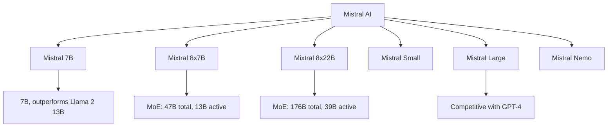

# Mistral

## Overview

Mistral AI is a French AI lab that has released several influential open-weight LLMs. Mistral 7B (September 2023) demonstrated that small models could be highly competitive. Mixtral 8x7B (December 2023) pioneered the Mixture of Experts approach for open-source LLMs. Mistral Large and Mistral models continue to push efficiency frontiers.

## Model Family



## Key Innovations

### 1. Sliding Window Attention (Mistral 7B)

```python
class SlidingWindowAttention(nn.Module):
    def __init__(self, window_size=4096):
        super().__init__()
        self.window_size = window_size

    def forward(self, q, k, v):
        # Only attend to the last window_size tokens
        # Reduces memory from O(n²) to O(n * window_size)
        seq_len = q.size(1)
        if seq_len > self.window_size:
            k = k[:, -self.window_size:]
            v = v[:, -self.window_size:]
        return attention(q, k, v)
```

### 2. Mixtral (Mixture of Experts)

```python
class MixtralBlock(nn.Module):
    def __init__(self, num_experts=8, top_k=2):
        super().__init__()
        self.experts = nn.ModuleList([Expert() for _ in range(num_experts)])
        self.router = nn.Linear(hidden_size, num_experts)
        self.top_k = top_k

    def forward(self, x):
        # Route to top-k experts
        router_logits = self.router(x)
        top_k_logits, top_k_indices = router_logits.topk(self.top_k, dim=-1)
        router_probs = F.softmax(top_k_logits, dim=-1)

        # Compute expert outputs
        output = torch.zeros_like(x)
        for i, expert in enumerate(self.experts):
            mask = (top_k_indices == i).any(dim=-1)
            if mask.any():
                expert_output = expert(x[mask])
                weight = router_probs[mask][top_k_indices[mask] == i]
                output[mask] += weight.unsqueeze(-1) * expert_output

        return output
```

## Mixtral 8x7B Architecture

| Component | Value |
|-----------|-------|
| Total Parameters | 47B |
| Active Parameters | 13B per token |
| Experts | 8 |
| Active Experts | 2 |
| Context | 32K |
| KV Heads | 8 (GQA) |

## Performance

| Model | MMLU | HumanEval | Params | Active |
|-------|------|-----------|--------|--------|
| Mistral 7B | 62% | 30% | 7B | 7B |
| Mixtral 8x7B | 70% | 40% | 47B | 13B |
| Mixtral 8x22B | 77% | 45% | 176B | 39B |
| Mistral Large | 81% | 84% | Not disclosed | Not disclosed |

## Interview Questions

1. **What is Mistral's key innovation?** — Demonstrated that small, efficient models can be highly competitive. Sliding window attention reduces memory. Mixtral pioneered open-source MoE.

2. **How does Mixtral's MoE work?** — 8 experts per layer, router selects top-2 for each token. Only 13B parameters active per token despite 47B total. Achieves 70B-class performance with 13B-class compute.

3. **What is sliding window attention?** — Each token attends only to the last W tokens instead of all previous tokens. Reduces memory from O(n²) to O(nW). Enables efficient processing of long sequences.

4. **Mixtral vs dense models?** — Mixtral: faster inference (fewer active params), better performance per FLOP, but larger model file. Dense: simpler, more predictable, easier to optimize.

5. **When would you choose Mistral?** — When efficiency matters (Mixtral), when you need a small but strong model (Mistral 7B), or when you want European AI (data sovereignty).

## Summary

Mistral AI has been a pioneer in efficient LLM design. Mistral 7B showed small models can compete. Mixtral's MoE architecture provides large-model quality with small-model efficiency. The sliding window attention mechanism reduces memory requirements. Mistral continues to push the efficiency frontier.

## Cross-References

- [Mixture of Experts](../moe/README.md) — MoE architecture details
- [Llama](./llama.md) — Dense model comparison
- [DeepSeek](./deepseek.md) — Another MoE innovator
- [LLM Architecture](../llm-serving/architecture.md) — Transformer fundamentals
- [Switch Transformer](../moe/switch.md) — MoE foundations
