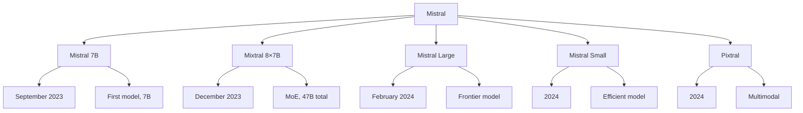

# Mistral

Mistral AI is a French AI company focused on creating efficient, high-performance language models. Their models are known for strong performance relative to size, efficient architectures, and open-source releases.

## Overview



## Model Family

### Mistral 7B (September 2023)

```python
# First model from Mistral AI
# Surprised the community with strong performance

config = {
    "parameters": "7.3B",
    "context": "8K (32K with sliding window)",
    "architecture": "Dense transformer",
    "key_innovation": "Sliding window attention"
}

# Performance:
# - Beat Llama 2 13B on most benchmarks
# - Close to Llama 2 34B
# - Much smaller and faster
```

### Sliding Window Attention

```python
class SlidingWindowAttention(nn.Module):
    """
    Mistral's key innovation: sliding window attention
    Each token attends only to nearby tokens (within window)
    Reduces compute while maintaining quality
    """
    def __init__(self, d_model, num_heads, window_size=4096):
        super().__init__()
        self.window_size = window_size
        self.attention = nn.MultiheadAttention(d_model, num_heads)
    
    def forward(self, x):
        batch_size, seq_len, _ = x.shape
        
        # Create sliding window mask
        mask = torch.zeros(seq_len, seq_len, dtype=torch.bool)
        for i in range(seq_len):
            start = max(0, i - self.window_size // 2)
            end = min(seq_len, i + self.window_size // 2)
            mask[i, start:end] = True
        
        # Apply attention with mask
        attn_out, _ = self.attention(x, x, x, attn_mask=~mask)
        return attn_out
```

### Mixtral 8×7B (December 2023)

```python
# First open-source MoE model
# Major breakthrough in open-source AI

config = {
    "total_params": "46.7B",
    "active_params": "12.9B per token",
    "experts": 8,
    "active_experts": 2,
    "context": "32K (76K with YaRN)"
}

# Performance:
# - Matches LLaMA 2 70B quality
# - 6x faster inference
# - Demonstrated MoE viability
```

### Mistral Large (February 2024)

```python
# Frontier-class model
# Closed-source (API only)

config = {
    "parameters": "Unknown (likely >100B)",
    "context": "128K tokens",
    "multilingual": "Strong",
    "coding": "Excellent"
}

# Competes with:
# - GPT-4
# - Claude 3 Opus
# - Gemini Pro
```

### Mistral Small (2024)

```python
# Efficient model for production
# Good balance of quality and speed

config = {
    "parameters": "22B",
    "context": "32K tokens",
    "use_case": "Production deployments"
}
```

### Pixtral (2024)

```python
# Multimodal model (vision + text)
# Can process images

capabilities = [
    "Image understanding",
    "Visual QA",
    "OCR",
    "Chart analysis"
]
```

## Key Innovations

### 1. Sliding Window Attention

```python
# Instead of full attention O(n²):
# - Each token attends only to W nearby tokens
# - Complexity: O(n × W) instead of O(n²)
# - W = 4096 typically

# Benefits:
# - Faster inference
# - Less memory
# - Can handle longer sequences
# - Quality maintained
```

### 2. Grouped Query Attention (GQA)

```python
# Mistral uses GQA for efficiency
# Fewer KV heads than query heads

class GQA(nn.Module):
    def __init__(self, d_model, num_q_heads, num_kv_heads):
        super().__init__()
        self.num_q_heads = num_q_heads
        self.num_kv_heads = num_kv_heads
        self.heads_per_group = num_q_heads // num_kv_heads
        
        self.wq = nn.Linear(d_model, num_q_heads * head_dim)
        self.wk = nn.Linear(d_model, num_kv_heads * head_dim)
        self.wv = nn.Linear(d_model, num_kv_heads * head_dim)
    
    def forward(self, x):
        q = self.wq(x)
        k = self.wk(x)
        v = self.wv(x)
        
        # Repeat KV heads for each query group
        k = k.repeat_interleave(self.heads_per_group, dim=-2)
        v = v.repeat_interleave(self.heads_per_group, dim=-2)
        
        # Standard attention
        return attention(q, k, v)
```

### 3. Efficient MoE (Mixtral)

```python
# Mixtral's MoE design:
# - 8 experts per layer
# - Top-2 routing
# - SwiGLU activation
# - No load balancing loss needed (naturally balanced)

# Benefits:
# - Large capacity with less compute
# - Faster than dense equivalent
# - Open-source
```

## Function Calling

### Mistral's Function Calling

```python
# Mistral has strong function calling capabilities
# Similar to OpenAI's function calling

tools = [{
    "type": "function",
    "function": {
        "name": "get_weather",
        "description": "Get weather for a location",
        "parameters": {
            "type": "object",
            "properties": {
                "location": {"type": "string"},
                "unit": {"type": "string", "enum": ["celsius", "fahrenheit"]}
            },
            "required": ["location"]
        }
    }
}]

response = client.chat.completions.create(
    model="mistral-large-latest",
    messages=[{"role": "user", "content": "What's the weather in Paris?"}],
    tools=tools,
    tool_choice="auto"
)

# Parse function call
tool_call = response.choices[0].message.tool_calls[0]
```

### JSON Mode

```python
# Structured output support
response = client.chat.completions.create(
    model="mistral-large-latest",
    messages=[{
        "role": "user",
        "content": "List 3 programming languages with their years created"
    }],
    response_format={"type": "json_object"}
)

# Returns valid JSON
```

## API Usage

### Mistral API

```python
from mistralai.client import MistralClient
from mistralai.models.chat_completion import ChatMessage

client = MistralClient(api_key="YOUR_API_KEY")

# Chat completion
response = client.chat(
    model="mistral-large-latest",
    messages=[
        ChatMessage(role="user", content="Explain quantum computing")
    ]
)

print(response.choices[0].message.content)
```

### With Hugging Face

```python
from transformers import AutoModelForCausalLM, AutoTokenizer

# Load Mistral 7B
model_name = "mistralai/Mistral-7B-Instruct-v0.2"
tokenizer = AutoTokenizer.from_pretrained(model_name)
model = AutoModelForCausalLM.from_pretrained(
    model_name,
    torch_dtype=torch.float16,
    device_map="auto"
)

# Generate
messages = [
    {"role": "user", "content": "What is machine learning?"}
]

input_ids = tokenizer.apply_chat_template(messages, return_tensors="pt")
output = model.generate(input_ids, max_new_tokens=500)
print(tokenizer.decode(output[0], skip_special_tokens=True))
```

## Performance

### Benchmark Results

```python
# Mistral 7B benchmarks
mistral_7b = {
    "MMLU": 62.5,
    "HumanEval": 30.5,
    "GSM8K": 52.2,
    "HellaSwag": 78.1
}

# Mixtral 8×7B benchmarks
mixtral = {
    "MMLU": 70.6,
    "HumanEval": 40.2,
    "GSM8K": 74.4,
    "HellaSwag": 86.7
}

# Mistral Large benchmarks
mistral_large = {
    "MMLU": 81.2,
    "HumanEval": 78.0,
    "GSM8K": 91.2,
    "HellaSwag": 89.3
}
```

### Speed Comparison

```python
# Relative speed (tokens/second)
speed_comparison = {
    "Mistral 7B": "1x (baseline)",
    "Mixtral 8×7B": "0.5x (2 experts active)",
    "Llama 2 70B": "0.15x",
    "GPT-4": "0.1x"
}

# Mixtral is much faster than Llama 2 70B
# while matching its quality
```

## Comparison with Other Models

| Feature | Mixtral 8×7B | Llama 2 70B | GPT-4 | DeepSeek-V3 |
|---------|-------------|-------------|-------|-------------|
| Open Source | Yes | Yes | No | Yes |
| Architecture | MoE | Dense | MoE (likely) | MoE |
| Parameters | 47B (13B active) | 70B | ~1.8T | 671B (37B active) |
| Context | 32K | 4K | 128K | 128K |
| Quality | ≈ Llama 70B | Good | Excellent | Excellent |
| Speed | Fast | Medium | Slow | Fast |

## Strengths

1. **Efficiency:** Strong performance relative to size
2. **Innovation:** Sliding window attention, efficient MoE
3. **Open source:** Mixtral 7B/8×7B fully open
4. **Function calling:** Strong tool use capabilities
5. **Speed:** Fast inference, especially Mixtral
6. **Quality:** Competitive with larger models

## Limitations

1. **Large models:** Mistral Large is closed-source
2. **Context:** Mixtral limited to 32K (vs 128K for competitors)
3. **Multimodal:** Only Pixtral for vision
4. **Ecosystem:** Smaller than Llama community
5. **Documentation:** Less extensive than major players

## Interview Questions

1. **What is Mistral AI?**
   A French AI company creating efficient, high-performance language models. Known for Mistral 7B, Mixtral 8×7B (open-source MoE), and Mistral Large (frontier model).

2. **What is sliding window attention?**
   Each token attends only to nearby tokens within a fixed window size. Reduces compute from O(n²) to O(n×W) while maintaining quality. Key innovation in Mistral 7B.

3. **How does Mixtral compare to Llama 2 70B?**
   Mixtral matches Llama 2 70B quality with 6x faster inference. Uses MoE with 47B total parameters but only 13B active per token.

4. **What is Mistral's function calling?**
   Similar to OpenAI's function calling. Mistral can output structured function calls that applications can execute. Strong at tool use and JSON generation.

5. **What is Grouped Query Attention?**
   Uses fewer key-value heads than query heads. Reduces memory and compute while maintaining quality. Mistral uses GQA for efficiency.

6. **How does Mixtral's MoE work?**
   8 experts per layer, top-2 routing. Each token is processed by 2 experts. SwiGLU activation. No load balancing loss needed.

7. **What are Mistral's main strengths?**
   Efficiency (strong per parameter), speed (especially Mixtral), open-source availability, and strong function calling capabilities.

## Common Mistakes

- ❌ Confusing Mistral models (7B vs Mixtral vs Large)
- ❌ Not utilizing function calling capabilities
- ❌ Ignoring sliding window attention benefits
- ❌ Using wrong context length (32K for Mixtral vs 128K for others)
- ❌ Not considering Mixtral for production (fast and high quality)

## Summary

Mistral AI creates efficient, high-performance language models with innovative architectures. Mistral 7B introduced sliding window attention, Mixtral demonstrated open-source MoE viability, and Mistral Large competes with frontier models. Known for strong performance relative to size and excellent function calling.

## Cross-References

- [Mixtral](../moe/mixtral.md) - Detailed Mixtral architecture
- [MoE Architecture](../moe/README.md) - Mixture of Experts fundamentals
- [Llama](llama.md) - Comparable open-source model
- [Function Calling](../applications/tools.md) - Tool use capabilities
- [Sliding Window Attention](../attention.md) - Attention mechanisms
