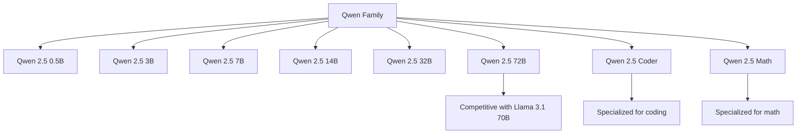
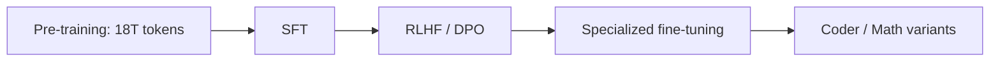

# Qwen

## Overview

Qwen (short for "Qianwen", meaning "thousand questions") is Alibaba's family of large language models. Qwen 2.5 (September 2024) is one of the strongest open-weight model families, with models ranging from 0.5B to 72B parameters. Qwen excels at coding, mathematics, and multilingual tasks, with particular strength in Chinese language understanding.

## Model Family



## Key Features

| Feature | Qwen 2.5 72B | Llama 3.1 70B |
|---------|-------------|---------------|
| Parameters | 72B | 70B |
| Context | 128K (up to 1M) | 128K |
| MMLU | ~86% | ~87% |
| HumanEval | ~86% | ~89% |
| MATH | ~68% | ~73% |
| Chinese | Excellent | Good |
| License | Apache 2.0 | Llama license |

## Architecture

Qwen uses a standard decoder-only transformer with optimizations:

```python
class QwenConfig:
    vocab_size = 152064          # Large vocabulary (Chinese + English)
    hidden_size = 8192           # For 72B
    num_layers = 80
    num_heads = 64
    num_kv_heads = 8             # GQA
    intermediate_size = 29568
    max_position_embeddings = 131072
    rope_theta = 1000000
    sliding_window = 131072      # Full context
```

## Specialized Models

### Qwen 2.5 Coder
- Fine-tuned specifically for code generation
- Supports 90+ programming languages
- Competitive with GPT-4 on coding benchmarks

### Qwen 2.5 Math
- Specialized mathematical reasoning
- Strong on MATH, GSM8K benchmarks
- Supports tool use for calculations

## Training



## Interview Questions

1. **What makes Qwen competitive?** — Strong multilingual (especially Chinese), competitive English benchmarks, Apache 2.0 license, specialized variants (Coder, Math), and efficient small models.

2. **Qwen vs Llama?** — Qwen: better Chinese, Apache 2.0 license, specialized variants. Llama: larger ecosystem, more community tools, stronger on English. Both are competitive on benchmarks.

3. **What is Qwen's context length advantage?** — Qwen 2.5 supports 128K natively and can extend to 1M tokens with YaRN (Yet another RoPE extensioN) positional interpolation.

4. **How does Qwen handle multilingual tasks?** — Large vocabulary (152K tokens) with strong Chinese and English coverage. Trained on multilingual data with emphasis on Chinese.

5. **When would you choose Qwen over Llama?** — Chinese language tasks, need for Apache 2.0 license, specialized coding/math needs, or when the specific model size fits your deployment constraints.

## Summary

Qwen 2.5 is one of the strongest open-weight LLM families, with models from 0.5B to 72B. Key strengths include multilingual capability, specialized variants, and permissive licensing. It's particularly strong for Chinese language tasks and offers competitive performance across benchmarks.

## Cross-References

- [Llama](./llama.md) — Main open-weight comparison
- [DeepSeek](./deepseek.md) — Another Chinese LLM
- [Mistral](./mistral.md) — European competitor
- [LLM Architecture](../llm-serving/architecture.md) — Transformer fundamentals
