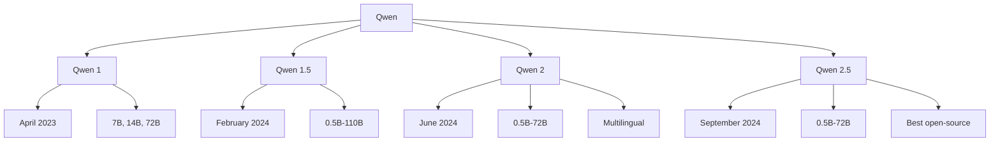

# Qwen

Qwen (通义千问, Tongyi Qianwen) is Alibaba's family of large language models, with a strong focus on multilingual capabilities, particularly Chinese and English. Qwen 2.5 represents the latest and most capable version.

## Overview



## Qwen 2.5 Architecture

### Model Specifications

```python
class Qwen25Config:
    """
    Qwen 2.5 model family
    """
    variants = {
        "0.5B": {"layers": 24, "d_model": 896, "heads": 14},
        "1.5B": {"layers": 28, "d_model": 1536, "heads": 12},
        "3B": {"layers": 36, "d_model": 2048, "heads": 16},
        "7B": {"layers": 28, "d_model": 3584, "heads": 28},
        "14B": {"layers": 48, "d_model": 5120, "heads": 40},
        "32B": {"layers": 64, "d_model": 5120, "heads": 40},
        "72B": {"layers": 80, "d_model": 8192, "heads": 64}
    }
    
    context_length = 128_000
    vocab_size = 152_064
```

### Key Features

```python
# Qwen 2.5 innovations:
features = {
    "multilingual": "29+ languages",
    "context": "128K tokens",
    "coding": "Strong code generation",
    "math": "Advanced mathematical reasoning",
    "vision": "Qwen2.5-VL for images/video",
    "audio": "Qwen2.5-Audio for speech"
}
```

## Multilingual Capabilities

### Language Support

```python
# Qwen supports 29+ languages
supported_languages = {
    "high_quality": ["Chinese", "English", "Japanese", "Korean"],
    "good": ["Spanish", "French", "German", "Italian", "Portuguese",
             "Russian", "Arabic", "Hindi", "Thai", "Vietnamese"],
    "moderate": ["Dutch", "Polish", "Turkish", "Indonesian", "Malay",
                 "Bengali", "Swahili", "Tagalog"]
}

# Strong Chinese capabilities:
# - Chinese literature understanding
# - Classical Chinese
# - Chinese idioms and culture
# - Technical Chinese
```

### Cross-Lingual Performance

```python
# Qwen 2.5 multilingual benchmarks
benchmarks = {
    "Chinese_MMLU": 85.2,
    "English_MMLU": 83.1,
    "Japanese_MMLU": 78.5,
    "Korean_MMLU": 76.8,
    "Cross_Lingual": "Strong transfer"
}
```

## Model Variants

### Text Models

| Model | Parameters | Context | Use Case |
|-------|-----------|---------|----------|
| Qwen2.5-0.5B | 0.5B | 128K | Edge devices |
| Qwen2.5-1.5B | 1.5B | 128K | Mobile |
| Qwen2.5-3B | 3B | 128K | Light tasks |
| Qwen2.5-7B | 7B | 128K | General purpose |
| Qwen2.5-14B | 14B | 128K | Complex tasks |
| Qwen2.5-32B | 32B | 128K | Professional |
| Qwen2.5-72B | 72B | 128K | Maximum capability |

### Specialized Models

```python
# Qwen 2.5 variants:
variants = {
    "Qwen2.5": "Base language model",
    "Qwen2.5-Instruct": "Instruction-tuned",
    "Qwen2.5-Coder": "Code-specialized",
    "Qwen2.5-Math": "Math-specialized",
    "Qwen2.5-VL": "Vision-Language",
    "Qwen2.5-Audio": "Audio understanding"
}
```

### Qwen2.5-VL (Vision-Language)

```python
# Multimodal model for images and video
class Qwen25VL:
    """
    Vision-Language capabilities:
    - Image understanding
    - Video understanding
    - OCR
    - Chart analysis
    - Visual reasoning
    """
    
    capabilities = [
        "Image description",
        "Visual QA",
        "OCR (text extraction)",
        "Chart/graph analysis",
        "Video understanding",
        "Math from images"
    ]
```

### Qwen2.5-Coder

```python
# Code-specialized model
# Strong on coding benchmarks

benchmarks = {
    "HumanEval": 92.7,      # Code generation
    "MBPP": 90.2,           # Python problems
    "LiveCodeBench": 55.1,  # Real-world coding
    "CodeContests": 32.1    # Competitive programming
}

# Supports many programming languages
languages = ["Python", "JavaScript", "TypeScript", "Java", "C++", 
             "Go", "Rust", "Swift", "Kotlin", "SQL", "Shell"]
```

### Qwen2.5-Math

```python
# Math-specialized model
benchmarks = {
    "MATH": 91.6,           # Competition math
    "GSM8K": 97.3,          # Grade school math
    "AIME": 52.3,           # American Invitational Math
    "CMATH": 95.8           # Chinese math
}
```

## Using Qwen

### With Hugging Face Transformers

```python
from transformers import AutoModelForCausalLM, AutoTokenizer

# Load model
model_name = "Qwen/Qwen2.5-7B-Instruct"
tokenizer = AutoTokenizer.from_pretrained(model_name)
model = AutoModelForCausalLM.from_pretrained(
    model_name,
    torch_dtype=torch.float16,
    device_map="auto"
)

# Generate
messages = [
    {"role": "system", "content": "You are a helpful assistant."},
    {"role": "user", "content": "What is machine learning?"}
]

input_ids = tokenizer.apply_chat_template(
    messages, return_tensors="pt"
).to(model.device)

output = model.generate(input_ids, max_new_tokens=500)
print(tokenizer.decode(output[0], skip_special_tokens=True))
```

### With vLLM

```python
from vllm import LLM, SamplingParams

# Load with vLLM
llm = LLM(
    model="Qwen/Qwen2.5-72B-Instruct",
    tensor_parallel_size=4,
    gpu_memory_utilization=0.9
)

# Generate
sampling_params = SamplingParams(temperature=0.7, max_tokens=200)
outputs = llm.generate(["Explain quantum computing"], sampling_params)
print(outputs[0].outputs[0].text)
```

### API Access

```python
from openai import OpenAI

# Qwen API is OpenAI-compatible
client = OpenAI(
    api_key="YOUR_QWEN_KEY",
    base_url="https://dashscope.aliyuncs.com/compatible-mode/v1"
)

response = client.chat.completions.create(
    model="qwen-turbo",  # or qwen-plus, qwen-max
    messages=[
        {"role": "user", "content": "Hello!"}
    ]
)
```

## Performance

### Benchmark Results

```python
# Qwen 2.5 72B benchmarks
benchmarks = {
    "MMLU": 86.1,
    "HumanEval": 86.6,
    "GSM8K": 91.6,
    "MATH": 83.1,
    "GPQA": 49.0
}

# Comparison with Llama 3.1 70B:
# Qwen 2.5 72B: Better on Chinese, math, coding
# Llama 3.1 70B: Better on English, reasoning
```

### Speed and Memory

| Model | Parameters | Memory (FP16) | Memory (INT4) |
|-------|-----------|---------------|---------------|
| 7B | 7B | 14 GB | 4 GB |
| 14B | 14B | 28 GB | 8 GB |
| 32B | 32B | 64 GB | 18 GB |
| 72B | 72B | 144 GB | 40 GB |

## Comparison with Other Models

| Feature | Qwen 2.5 72B | Llama 3.1 70B | DeepSeek-V3 | GPT-4o |
|---------|-------------|---------------|-------------|--------|
| Open Source | Yes | Yes | Yes | No |
| Parameters | 72B | 70B | 671B (37B active) | ~1.8T |
| Context | 128K | 128K | 128K | 128K |
| Chinese | Excellent | Good | Excellent | Good |
| Coding | Strong | Strong | Strong | Strong |
| Math | Strong | Good | Strong | Strong |

## Strengths

1. **Multilingual:** Excellent Chinese and multilingual support
2. **Size range:** From 0.5B to 72B for different use cases
3. **Specialized models:** Coder, Math, VL, Audio variants
4. **Performance:** Competitive with Llama and DeepSeek
5. **Ecosystem:** Good community support
6. **API:** Available via Alibaba Cloud

## Limitations

1. **Ecosystem:** Smaller than Llama community
2. **Documentation:** Less extensive than Western models
3. **Availability:** Some regions may have access issues
4. **Multimodal:** Vision and audio in separate models
5. **Large models:** 72B needs significant hardware

## Interview Questions

1. **What is Qwen?**
   Alibaba's family of large language models with strong multilingual support, particularly Chinese. Qwen 2.5 ranges from 0.5B to 72B parameters with specialized variants for coding, math, vision, and audio.

2. **How does Qwen compare to Llama?**
   Qwen has better Chinese and multilingual support. Llama has larger ecosystem and community. Both are competitive on English benchmarks. Qwen offers more size variants.

3. **What are Qwen's specialized models?**
   Qwen2.5-Coder (code generation), Qwen2.5-Math (mathematical reasoning), Qwen2.5-VL (vision-language), and Qwen2.5-Audio (speech understanding).

4. **How many languages does Qwen support?**
   29+ languages with high quality in Chinese, English, Japanese, and Korean. Good support for European, Middle Eastern, and Southeast Asian languages.

5. **What is Qwen2.5-Coder's performance?**
   92.7% on HumanEval, 90.2% on MBPP. Strong competitive programming performance. Supports many programming languages.

6. **How can you use Qwen locally?**
   Use Hugging Face Transformers, vLLM, or Ollama. Quantized versions available for consumer hardware. 7B model runs on 8GB GPU.

7. **What is Qwen's context window?**
   128K tokens across all model sizes. Can process long documents, codebases, and conversations.

## Common Mistakes

- ❌ Not using the chat template format
- ❌ Ignoring specialized models (Coder, Math) for specific tasks
- ❌ Not considering Chinese-specific capabilities when relevant
- ❌ Using wrong model size for hardware constraints
- ❌ Overlooking multilingual capabilities

## Summary

Qwen is Alibaba's competitive open-source LLM family with excellent multilingual support, particularly Chinese. Qwen 2.5 offers models from 0.5B to 72B with specialized variants for coding, math, vision, and audio. Strong performance across benchmarks makes it a viable alternative to Llama and DeepSeek.

## Cross-References

- [Llama](llama.md) - Meta's open-source model
- [DeepSeek](deepseek.md) - Chinese MoE model
- [Multimodal](../multimodal/README.md) - Vision and audio models
- [Coding Models](../applications/code.md) - Code generation
