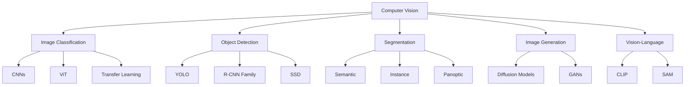

# Computer Vision

Computer Vision (CV) is a field of AI that enables machines to interpret and understand visual information from images and videos. It bridges the gap between raw pixel data and high-level understanding.

## Overview



## Key Paradigms

### Traditional CV Pipeline
```
Image → Preprocessing → Feature Extraction (SIFT, HOG) → Classifier (SVM) → Output
```

### Deep Learning CV Pipeline
```
Image → Neural Network (end-to-end) → Output
```

### Modern CV Pipeline (Foundation Models)
```
Image + Text Prompt → Foundation Model (CLIP, SAM, DINO) → Output
```

## Evolution of CV

| Era | Approach | Key Methods | Limitations |
|-----|----------|-------------|-------------|
| Pre-2012 | Handcrafted features | SIFT, HOG, Haar | Manual feature engineering |
| 2012-2017 | Deep CNNs | AlexNet, VGG, ResNet | Task-specific, supervised |
| 2017-2020 | Attention & Transformers | ViT, DETR | Data hungry |
| 2020-Present | Foundation Models | CLIP, SAM, DINO | Compute intensive |

## Core Tasks

### 1. Image Classification
Assigning a label to an entire image. See [classification.md](classification.md).

### 2. Object Detection
Locating and classifying objects with bounding boxes. See [object-detection.md](object-detection.md).

### 3. Segmentation
Pixel-level understanding of images. See [segmentation.md](segmentation.md).

### 4. Image Generation
Creating new images from distributions. See [diffusion.md](diffusion.md).

### 5. Vision-Language
Connecting visual and textual understanding. See [clip.md](clip.md) and [sam.md](sam.md).

## Essential Concepts

### Convolution Operation
The fundamental building block of CNNs:
```
Input (H×W×C) ⊛ Kernel (K×K×C) → Output (H'×W'×C')

Output[i,j] = Σ Σ Input[i+m, j+n] × Kernel[m, n]
```

### Receptive Field
The region of input that affects a particular output neuron. Deeper layers have larger receptive fields.

### Feature Maps
Outputs of convolutional filters that capture different visual patterns (edges, textures, shapes).

## Interview Questions

1. **What is the difference between image classification and object detection?**
   Classification assigns one label to an entire image; detection locates multiple objects with bounding boxes and labels.

2. **Why did deep learning outperform traditional CV?**
   Deep learning learns hierarchical features automatically (edges → textures → parts → objects) instead of relying on handcrafted features.

3. **What is transfer learning and why is it important in CV?**
   Using pre-trained models (on ImageNet) as starting points. Critical because labeled data is expensive and features transfer well across domains.

4. **Explain the bias-variance tradeoff in the context of CNNs.**
   Deeper/wider networks reduce bias but increase variance (overfitting risk). Regularization (dropout, data augmentation) controls variance.

## Common Mistakes

- ❌ Not normalizing pixel values (should be [0,1] or standardized)
- ❌ Ignoring data augmentation (leads to overfitting)
- ❌ Using too large models for small datasets (use transfer learning)
- ❌ Not handling class imbalance
- ❌ Confusing validation set with test set

## Summary

Computer Vision has evolved from handcrafted features to foundation models. The field now emphasizes pre-training on large datasets and fine-tuning for specific tasks. Understanding CNNs, attention mechanisms, and transfer learning is essential for interviews.

## Cross-References

- [Neural Networks](../basics.md) - Foundation concepts
- [Transformers](../transformers.md) - ViT and attention mechanisms
- [GANs](../../ml/gan/README.md) - Generative models
- [CLIP](clip.md) - Vision-language alignment
- [Multimodal Models](../multimodal/README.md) - Combining vision and language
