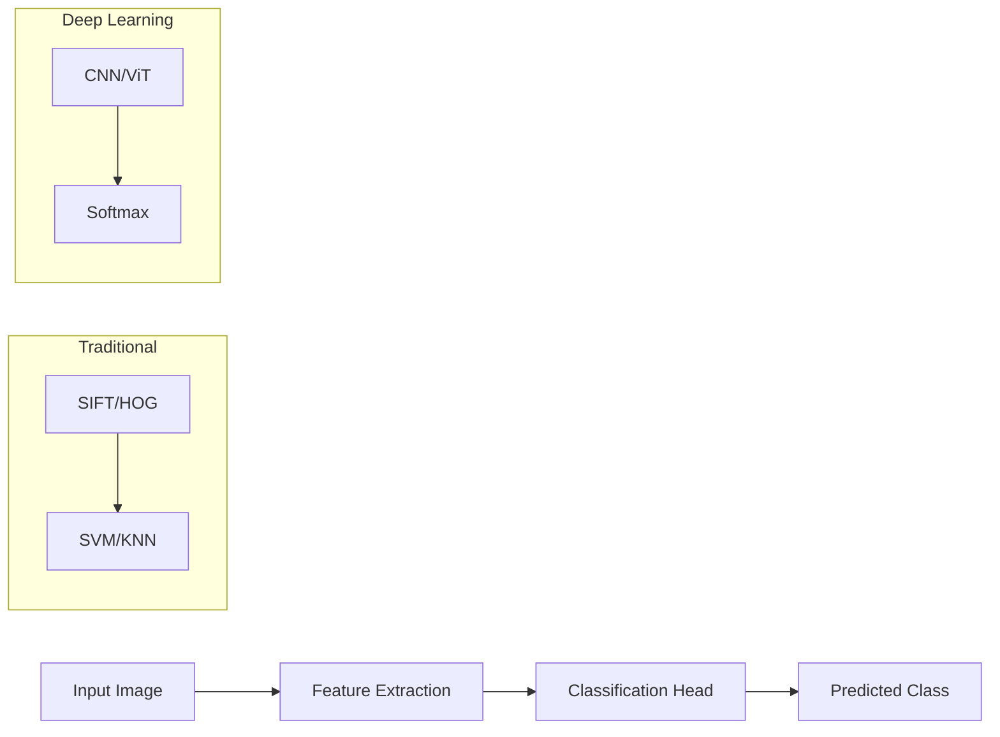
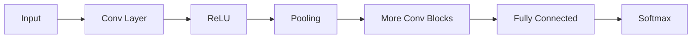
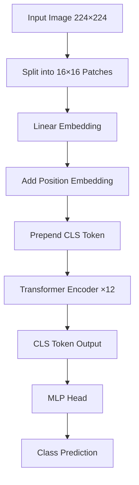
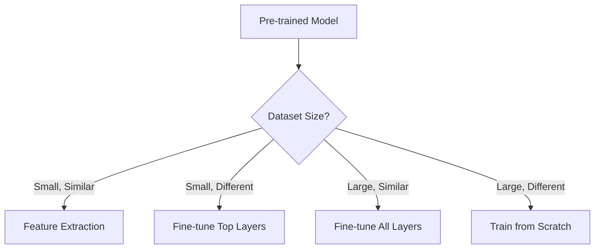

# Image Classification

Image classification is the task of assigning a label or category to an entire image from a fixed set of classes. It is the foundational task in computer vision.

## Overview



## CNNs (Convolutional Neural Networks)

### Architecture Components



### Key Layers

**Convolutional Layer:**
```
Output[i,j] = Σ_m Σ_n Input[i+m, j+n] × Kernel[m, n] + bias

Parameters: K × K × C_in × C_out + C_out (bias)
```

**Pooling Layer (Max/Average):**
```
MaxPool: Take maximum in each window
AvgPool: Take average in each window
Reduces spatial dimensions by factor of pool_size
```

### Classic Architectures

| Model | Year | Key Innovation | Parameters | Top-5 Error |
|-------|------|----------------|------------|-------------|
| AlexNet | 2012 | ReLU, Dropout, GPU | 60M | 16.4% |
| VGGNet | 2014 | 3×3 convolutions | 138M | 7.3% |
| GoogLeNet | 2014 | Inception modules | 6.8M | 6.7% |
| ResNet | 2015 | Skip connections | 25.6M | 3.6% |
| EfficientNet | 2019 | Compound scaling | 5.3M | 2.9% |

### ResNet (Residual Networks)

The most influential architecture innovation:

```python
# Residual Block
class ResidualBlock(nn.Module):
    def __init__(self, channels):
        super().__init__()
        self.conv1 = nn.Conv2d(channels, channels, 3, padding=1)
        self.bn1 = nn.BatchNorm2d(channels)
        self.conv2 = nn.Conv2d(channels, channels, 3, padding=1)
        self.bn2 = nn.BatchNorm2d(channels)
    
    def forward(self, x):
        residual = x
        out = F.relu(self.bn1(self.conv1(x)))
        out = self.bn2(self.conv2(out))
        out += residual  # Skip connection
        return F.relu(out)
```

**Why skip connections work:**
1. Solve vanishing gradient problem
2. Enable training of very deep networks (100+ layers)
3. Identity mapping is easy to learn
4. Gradient flows directly through skip connections

### EfficientNet

Compound scaling scales three dimensions uniformly:
```
depth: d = α^φ
width: w = β^φ
resolution: r = γ^φ

where α · β² · γ² ≈ 2, α ≥ 1, β ≥ 1, γ ≥ 1
```

## Vision Transformer (ViT)

ViT applies pure transformer architecture to image classification.

### Architecture



### Patch Embedding

```python
class PatchEmbedding(nn.Module):
    def __init__(self, img_size=224, patch_size=16, d_model=768):
        super().__init__()
        self.num_patches = (img_size // patch_size) ** 2  # 196 patches
        self.projection = nn.Conv2d(3, d_model, kernel_size=patch_size, stride=patch_size)
    
    def forward(self, x):
        # x: (B, 3, 224, 224)
        x = self.projection(x)  # (B, d_model, 14, 14)
        x = x.flatten(2).transpose(1, 2)  # (B, 196, d_model)
        return x
```

### ViT Variants

| Model | Layers | Hidden Dim | Heads | Params |
|-------|--------|------------|-------|--------|
| ViT-Small | 12 | 384 | 6 | 22M |
| ViT-Base | 12 | 768 | 12 | 86M |
| ViT-Large | 24 | 1024 | 16 | 307M |
| ViT-Huge | 32 | 1280 | 16 | 632M |

### ViT vs CNN

| Aspect | CNN | ViT |
|--------|-----|-----|
| Inductive bias | Translation equivariance, locality | Minimal (only position) |
| Data efficiency | Good with small data | Needs large data or pre-training |
| Global context | Limited by receptive field | Full attention from layer 1 |
| Compute cost | O(n) per layer | O(n²) per layer |
| Scaling | Moderate | Excellent |

## Transfer Learning

Using pre-trained models as starting points for new tasks.

### Strategies



**Feature Extraction:**
```python
# Freeze all layers except the final classifier
model = models.resnet50(pretrained=True)
for param in model.parameters():
    param.requires_grad = False
model.fc = nn.Linear(2048, num_classes)  # Only train this
```

**Fine-tuning:**
```python
# Unfreeze some/all layers with lower learning rate
model = models.resnet50(pretrained=True)
# Use different learning rates for different layers
optimizer = optim.Adam([
    {'params': model.layer4.parameters(), 'lr': 1e-4},
    {'params': model.fc.parameters(), 'lr': 1e-3}
])
```

### Why Transfer Learning Works

1. **Feature hierarchy:** Early layers learn universal features (edges, textures)
2. **Domain similarity:** ImageNet features transfer to many visual tasks
3. **Data efficiency:** Reduces need for large labeled datasets
4. **Convergence speed:** Pre-trained weights provide good initialization

## Data Augmentation

Techniques to artificially increase training data diversity.

### Geometric Transformations
```python
transform = transforms.Compose([
    transforms.RandomResizedCrop(224),
    transforms.RandomHorizontalFlip(),
    transforms.RandomRotation(15),
    transforms.ColorJitter(brightness=0.2, contrast=0.2, saturation=0.2),
    transforms.RandomAffine(degrees=0, translate=(0.1, 0.1)),
    transforms.ToTensor(),
    transforms.Normalize(mean=[0.485, 0.456, 0.406], std=[0.229, 0.224, 0.225])
])
```

### Advanced Augmentation

**Mixup:**
```python
# Blend two images and their labels
x_new = λ * x_i + (1 - λ) * x_j
y_new = λ * y_i + (1 - λ) * y_j
where λ ~ Beta(α, α)
```

**CutMix:**
```python
# Cut a patch from one image and paste on another
# Adjust label proportionally
λ = area_of_patch / total_area
y_new = λ * y_i + (1 - λ) * y_j
```

**RandAugment:**
```python
# Randomly select N transformations with magnitude M
transforms = [Rotate, TranslateX, ShearX, Brightness, Contrast, ...]
selected = random.sample(transforms, N)
for t in selected:
    image = t(image, magnitude=M)
```

### AutoAugment & RandAugment

| Method | Approach | Pros | Cons |
|--------|----------|------|------|
| AutoAugment | RL-searched policies | Optimal policies | Expensive search |
| RandAugment | Random from grid | Simple, effective | Less optimal |
| TrivialAugment | Random, one op | Simplest | Surprisingly effective |

## Modern Training Recipes

### Label Smoothing
```python
# Instead of hard labels [0, 0, 1, 0]
# Use soft labels [0.025, 0.025, 0.925, 0.025]
criterion = nn.CrossEntropyLoss(label_smoothing=0.1)
```

### Stochastic Depth
```python
# Randomly drop entire residual blocks during training
# Reduces overfitting, acts as regularization
if training and random.random() < drop_rate:
    return x  # Skip this block
```

### Knowledge Distillation
```python
# Train small model (student) to match large model (teacher)
loss = α * CE(student_logits, labels) + 
       (1-α) * KL(softmax(student_logits/T), softmax(teacher_logits/T))
```

## Evaluation Metrics

### Top-1 and Top-5 Accuracy
```
Top-1: Is the correct label the model's top prediction?
Top-5: Is the correct label in the model's top 5 predictions?

ImageNet SOTA: ~90% Top-1, ~99% Top-5
```

### Confusion Matrix
```
              Predicted
              Cat  Dog  Bird
Actual Cat  [ 85   10    5 ]
       Dog  [  8   87    5 ]
       Bird [  3    4   93 ]
```

## Code Example: Training a Classifier

```python
import torch
import torch.nn as nn
import torchvision.models as models
import torchvision.transforms as transforms
from torch.utils.data import DataLoader

# 1. Load pre-trained model
model = models.resnet50(pretrained=True)

# 2. Modify for custom dataset
num_classes = 10
model.fc = nn.Linear(model.fc.in_features, num_classes)

# 3. Data augmentation
train_transform = transforms.Compose([
    transforms.RandomResizedCrop(224),
    transforms.RandomHorizontalFlip(),
    transforms.ColorJitter(),
    transforms.ToTensor(),
    transforms.Normalize([0.485, 0.456, 0.406], [0.229, 0.224, 0.225])
])

# 4. Training loop
optimizer = torch.optim.AdamW(model.parameters(), lr=1e-4, weight_decay=0.01)
scheduler = torch.optim.lr_scheduler.CosineAnnealingLR(optimizer, T_max=100)
criterion = nn.CrossEntropyLoss(label_smoothing=0.1)

for epoch in range(num_epochs):
    model.train()
    for images, labels in train_loader:
        outputs = model(images)
        loss = criterion(outputs, labels)
        loss.backward()
        optimizer.step()
        optimizer.zero_grad()
    scheduler.step()
```

## Interview Questions

1. **Why does ResNet work better than VGG?**
   Skip connections allow gradients to flow directly, enabling training of much deeper networks without vanishing gradients. The network only needs to learn residual mappings.

2. **What is the difference between ViT and CNN?**
   ViT treats image patches as tokens and uses self-attention. CNNs use convolutions with local receptive fields. ViT needs more data but scales better.

3. **When would you use feature extraction vs fine-tuning?**
   Feature extraction: small dataset, similar domain. Fine-tuning: larger dataset or different domain. The more data and the more different the domain, the more layers you should fine-tune.

4. **Explain data augmentation and why it helps.**
   Augmentation creates modified versions of training images, increasing effective dataset size and teaching invariance to transformations (rotation, flip, color changes). Reduces overfitting.

5. **What is label smoothing and why use it?**
   Instead of hard labels (0 or 1), use soft labels (e.g., 0.9 for correct class). Prevents overconfident predictions, improves calibration, and acts as regularization.

6. **How does knowledge distillation work?**
   A small "student" model is trained to match the soft probability distribution of a large "teacher" model. The soft labels contain more information than hard labels (dark knowledge).

## Common Mistakes

- ❌ Not normalizing images with ImageNet stats when using pre-trained models
- ❌ Using too high learning rate when fine-tuning (destroys pre-trained features)
- ❌ Not using data augmentation (overfitting on small datasets)
- ❌ Forgetting to set model to eval mode during validation (BatchNorm, Dropout)
- ❌ Using softmax with wrong dimension in multi-label classification

## Summary

Image classification has evolved from handcrafted features to deep CNNs to Vision Transformers. Transfer learning is the standard practice, with pre-trained models on ImageNet serving as feature extractors or initialization. Data augmentation and modern training recipes (label smoothing, mixup, stochastic depth) are essential for best performance.

## Cross-References

- [CNNs](../vision/README.md) - Convolutional neural network fundamentals
- [Transformers](../transformers.md) - Self-attention mechanism
- [Object Detection](object-detection.md) - Extending classification to localization
- [Segmentation](segmentation.md) - Pixel-level classification
- [CLIP](clip.md) - Contrastive image-text pre-training
