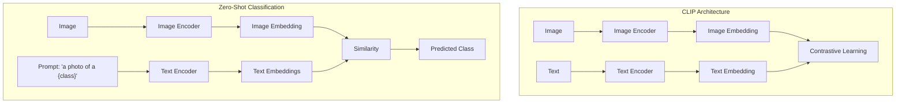
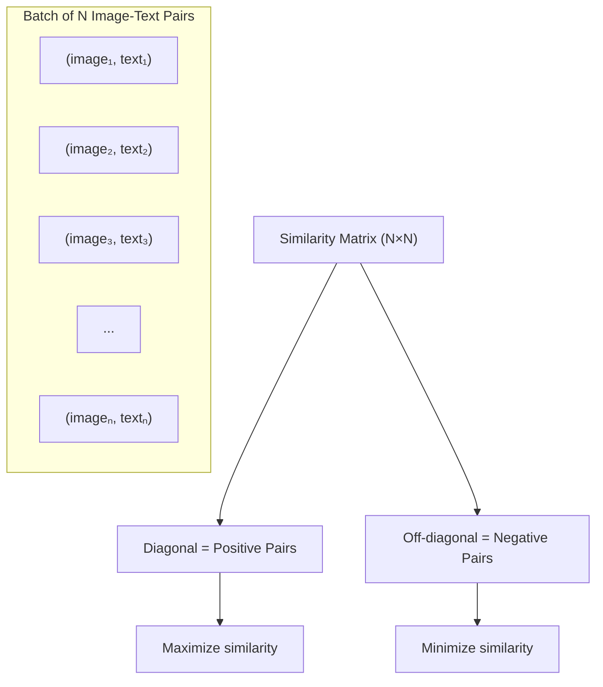

# CLIP: Contrastive Language-Image Pre-training

CLIP (Contrastive Language-Image Pre-training) by OpenAI learns visual concepts from natural language supervision. It connects text and images in a shared embedding space, enabling zero-shot visual understanding.

## Overview



## Architecture

### Dual Encoder Design

```python
class CLIP(nn.Module):
    def __init__(self, image_encoder, text_encoder, embed_dim):
        super().__init__()
        self.image_encoder = image_encoder  # ViT or ResNet
        self.text_encoder = text_encoder    # Transformer
        self.image_projection = nn.Linear(image_dim, embed_dim)
        self.text_projection = nn.Linear(text_dim, embed_dim)
        self.temperature = nn.Parameter(torch.ones([]) * 0.07)
    
    def encode_image(self, images):
        features = self.image_encoder(images)
        embeddings = self.image_projection(features)
        return F.normalize(embeddings, dim=-1)
    
    def encode_text(self, texts):
        features = self.text_encoder(texts)
        embeddings = self.text_projection(features)
        return F.normalize(embeddings, dim=-1)
    
    def forward(self, images, texts):
        image_embeddings = self.encode_image(images)
        text_embeddings = self.encode_text(texts)
        return image_embeddings, text_embeddings
```

### Image Encoder Options

| Variant | Architecture | Parameters | ImageNet Zero-Shot |
|---------|-------------|------------|-------------------|
| CLIP-RN50 | ResNet-50 | 38M | 59.6% |
| CLIP-RN101 | ResNet-101 | 56M | 62.3% |
| CLIP-ViT-B/32 | ViT-Base, 32px | 88M | 63.2% |
| CLIP-ViT-B/16 | ViT-Base, 16px | 86M | 68.3% |
| CLIP-ViT-L/14 | ViT-Large, 14px | 304M | 75.5% |

### Text Encoder

Transformer architecture similar to GPT-2:

```python
class TextEncoder(nn.Module):
    def __init__(self, vocab_size, d_model, n_heads, n_layers):
        super().__init__()
        self.token_embedding = nn.Embedding(vocab_size, d_model)
        self.position_embedding = nn.Embedding(max_length, d_model)
        self.transformer = TransformerEncoder(d_model, n_heads, n_layers)
        self.ln_final = nn.LayerNorm(d_model)
    
    def forward(self, text_tokens):
        positions = torch.arange(len(text_tokens))
        x = self.token_embedding(text_tokens) + self.position_embedding(positions)
        x = self.transformer(x)
        x = self.ln_final(x)
        # Use EOS token representation
        return x[torch.arange(len(text_tokens)), text_tokens.argmax(dim=-1)]
```

## Contrastive Learning

### InfoNCE Loss

```python
def clip_loss(image_embeddings, text_embeddings, temperature):
    """Contrastive loss for CLIP"""
    # Compute similarity matrix
    logits = image_embeddings @ text_embeddings.T / temperature  # (N, N)
    
    # Labels: diagonal is positive (matching pairs)
    labels = torch.arange(len(logits))
    
    # Symmetric cross-entropy loss
    loss_i2t = F.cross_entropy(logits, labels)      # Image-to-text
    loss_t2i = F.cross_entropy(logits.T, labels)     # Text-to-image
    
    return (loss_i2t + loss_t2i) / 2
```

### How Contrastive Learning Works



For a batch of N pairs:
- N positive pairs (matching image-text)
- N² - N negative pairs (non-matching)
- Scale to large batches (32,768 in CLIP paper) for more negatives

## Zero-Shot Classification

CLIP's most powerful capability: classifying without any training examples.

### How It Works

```python
def zero_shot_classify(image, class_names, clip_model):
    """Classify image without any training"""
    # 1. Create text prompts for each class
    prompts = [f"a photo of a {cls}" for cls in class_names]
    
    # 2. Encode image and texts
    image_embedding = clip_model.encode_image(image)
    text_embeddings = clip_model.encode_text(prompts)
    
    # 3. Compute similarities
    similarities = image_embedding @ text_embeddings.T
    
    # 4. Predict class with highest similarity
    predicted_class = class_names[similarities.argmax()]
    return predicted_class

# Example
classes = ["cat", "dog", "bird", "fish", "horse"]
prediction = zero_shot_classify(image, classes, clip_model)
# Returns: "cat"
```

### Prompt Engineering

The choice of prompt significantly affects performance:

```python
# Simple prompt
"a photo of a {class}"

# Better prompts (CLIP paper templates)
templates = [
    "a photo of a {}.",
    "a blurry photo of a {}.",
    "a photo of the large {}.",
    "a photo of the small {}.",
    "a {} in a video game.",
    "a painting of a {}.",
]

# Ensemble over prompts
def ensemble_classify(image, class_names, templates):
    all_similarities = []
    for template in templates:
        prompts = [template.format(cls) for cls in class_names]
        sim = compute_similarity(image, prompts)
        all_similarities.append(sim)
    return class_names[torch.stack(all_similarities).mean(0).argmax()]
```

## Applications

### Image Search

```python
def image_search(query, image_database, clip_model):
    """Search images using text query"""
    # Encode query
    text_embedding = clip_model.encode_text(query)
    
    # Pre-compute image embeddings
    image_embeddings = [clip_model.encode_image(img) for img in image_database]
    
    # Find most similar
    similarities = [cosine_sim(text_embedding, img_emb) for img_emb in image_embeddings]
    top_indices = torch.topk(similarities, k=5).indices
    
    return [image_database[i] for i in top_indices]
```

### Image Captioning Evaluation

```python
def clip_score(image, caption, clip_model):
    """Measure image-text alignment"""
    img_emb = clip_model.encode_image(image)
    txt_emb = clip_model.encode_text(caption)
    return (img_emb @ txt_emb.T).item()
```

### Open-Vocabulary Detection

```python
# Use CLIP features for detecting novel objects
# RegionCLIP, OWL-ViT use this approach

def open_vocab_detect(image, text_queries, detector):
    """Detect objects described by text"""
    # Extract region features
    regions = detector.get_regions(image)
    region_features = detector.encode_regions(regions)
    
    # Encode text queries
    text_features = clip_model.encode_text(text_queries)
    
    # Match regions to text
    similarities = region_features @ text_features.T
    detections = []
    for i, query in enumerate(text_queries):
        mask = similarities[:, i] > threshold
        detections.append(regions[mask])
    
    return detections
```

## CLIP Variants and Extensions

### OpenCLIP (Open Source)

```python
# Open-source reproduction with larger datasets
# LAION-5B dataset (5.85 billion image-text pairs)
# Various model sizes available

import open_clip
model, _, preprocess = open_clip.create_model_and_transforms('ViT-H-14', pretrained='laion2b_s32b_b79k')
```

### SigLIP

```python
# Sigmoid loss instead of softmax
# Better for large batches
# More efficient training

def siglip_loss(image_embeddings, text_embeddings):
    """Sigmoid-based contrastive loss"""
    logits = image_embeddings @ text_embeddings.T
    # Binary cross-entropy instead of softmax
    labels = torch.eye(len(logits))  # Diagonal is positive
    loss = F.binary_cross_entropy_with_logits(logits, labels)
    return loss
```

### CLIPSeg

```python
# CLIP for segmentation
# Uses CLIP features to generate segmentation masks
# Zero-shot segmentation: segment objects from text descriptions
```

### EVA-CLIP

```python
# Improved CLIP training with:
# - Masked image modeling (MIM) initialization
# - Better data curation
# - Larger scale (4B parameters)
# State-of-the-art zero-shot performance
```

## Scaling Laws

CLIP discovered important scaling laws for vision-language:

```
Zero-shot accuracy ∝ log(compute) or log(data) or log(parameters)

Key findings:
1. Larger models → better zero-shot transfer
2. More data → better zero-shot transfer
3. Both matter, but data may be more important
4. 400M image-text pairs used in original CLIP
```

## Limitations

1. **Compositionality:** Poor at understanding spatial relationships ("red cube on blue sphere")
2. **Counting:** Cannot count objects accurately
3. **Fine-grained recognition:** Struggles with subtle differences
4. **Negative prompts:** Cannot handle "not X" well
5. **Bias:** Inherits biases from training data
6. **Domain gaps:** Better on natural images than specialized domains

## Comparison with Other Approaches

| Method | Training | Zero-Shot | Data Efficiency | Flexibility |
|--------|----------|-----------|-----------------|-------------|
| CLIP | Contrastive | Excellent | Good | Very High |
| ImageNet Supervised | Classification | None | Moderate | Low |
| SimCLR | Self-supervised | Poor | Good | Moderate |
| DINO | Self-supervised | Moderate | Good | Moderate |
| ALIGN | Contrastive | Good | Good | High |

## Interview Questions

1. **What is CLIP and how does it work?**
   CLIP learns visual concepts from natural language by training dual encoders (image + text) with contrastive loss. It maps images and text to a shared embedding space where matching pairs are close.

2. **How does zero-shot classification work in CLIP?**
   Create text prompts for each class ("a photo of a dog"), encode them and the image, compute cosine similarities, and select the class with highest similarity. No training on the target dataset needed.

3. **What is the contrastive loss in CLIP?**
   InfoNCE loss that maximizes similarity for matching image-text pairs and minimizes for non-matching pairs. For a batch of N pairs, there are N positive and N²-N negative pairs.

4. **Why does CLIP use large batch sizes?**
   More negatives per batch provide better contrastive signal. CLIP uses batches of 32,768 pairs. Larger batches = more negative examples = better learned representations.

5. **What are the limitations of CLIP?**
   Poor at compositionality, counting, fine-grained recognition. Cannot handle negation well. Inherits biases from training data. Struggles with domain-specific images.

6. **How can CLIP be used for image search?**
   Encode the text query and all images using CLIP, compute cosine similarities, and return the most similar images. The shared embedding space enables cross-modal retrieval.

7. **What is prompt engineering in CLIP?**
   Designing text templates to improve zero-shot performance. Instead of "dog", use "a photo of a dog, a type of pet". Ensembling over multiple templates further improves accuracy.

## Common Mistakes

- ❌ Not normalizing embeddings before computing similarity
- ❌ Using simple class names instead of descriptive prompts
- ❌ Forgetting temperature scaling in contrastive loss
- ❌ Not ensembling over multiple prompts for better accuracy
- ❌ Applying CLIP to domains very different from training data

## Summary

CLIP revolutionized computer vision by connecting images and text through contrastive learning. Its zero-shot capabilities enable classification, search, and retrieval without task-specific training. The dual-encoder architecture with InfoNCE loss scales effectively with data and compute. CLIP serves as the foundation for many modern vision-language models.

## Cross-References

- [Vision Transformers](classification.md#vision-transformer-vit) - ViT as image encoder
- [Contrastive Learning](clip.md#contrastive-learning) - Learning from pairs
- [Stable Diffusion](diffusion.md#stable-diffusion) - Uses CLIP for text conditioning
- [SAM](sam.md) - Segment Anything Model
- [Multimodal Models](../multimodal/README.md) - Vision-language models
